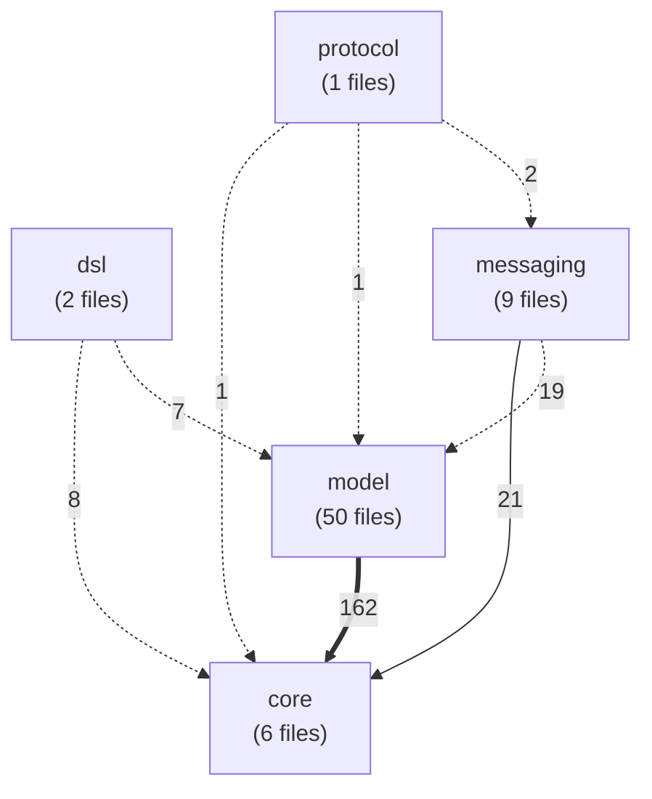

# 📈 Architecture Mermaid Diagrams

*(Рендерится в GitHub, GitLab, VS Code, Notion)*

## 📦 High-Level Module Dependencies

## 🚨 Critical Bottlenecks & Immediate Context

```mermaid
graph TD
    xjdf4s_messaging_Message["messaging.Message"]
    xjdf4s_core_Values["core.Values"]
    xjdf4s_model_resources_ProcessResources["resources.ProcessResources"]
    xjdf4s_model_ContentAndShapeIntents["🔴 model.ContentAndShapeIntents"]:::bottleneck
    xjdf4s_model_resources_ColorSpaceConversion["resources.ColorSpaceConversion"]
    xjdf4s_model_resources_DeliveryAndPreflightResources["resources.DeliveryAndPreflightResources"]
    xjdf4s_model_resources_QualityControl["resources.QualityControl"]
    xjdf4s_core_Validation["core.Validation"]
    xjdf4s_core_Cardinality["core.Cardinality"]
    xjdf4s_model_resources_DieLayoutProduction["resources.DieLayoutProduction"]
    xjdf4s_model_resources_BinderySignature["resources.BinderySignature"]
    xjdf4s_model_resources_ColorantControl["resources.ColorantControl"]
    xjdf4s_model_resources_FoundationalResources["resources.FoundationalResources"]
    xjdf4s_model_resources_MarksAndStacking["resources.MarksAndStacking"]
    xjdf4s_model_resources_Content["resources.Content"]
    xjdf4s_model_resources_PrepressResources["resources.PrepressResources"]
    xjdf4s_model_resources_PostpressResources["resources.PostpressResources"]
    xjdf4s_model_resources_FoldingResources["resources.FoldingResources"]
    xjdf4s_model_BindingIntent["model.BindingIntent"]
    xjdf4s_model_resources_AdditionalResources["resources.AdditionalResources"]
    xjdf4s_messaging_StatusNotificationResourceMessages["messaging.StatusNotificationResourceMessages"]
    xjdf4s_model_resources_GeneralAndPressResources["resources.GeneralAndPressResources"]
    xjdf4s_model_resources_Rendering["resources.Rendering"]
    xjdf4s_model_resources_RunList["resources.RunList"]
    xjdf4s_dsl_DocOp["dsl.DocOp"]
    xjdf4s_model_SimpleIntents["model.SimpleIntents"]
    xjdf4s_model_resources_Contact["resources.Contact"]
    xjdf4s_model_resources_Interpreting["resources.Interpreting"]
    xjdf4s_model_resources_PdlCreation["resources.PdlCreation"]
    xjdf4s_messaging_QueueEntryMessages["messaging.QueueEntryMessages"]
    xjdf4s_model_Subelements["🔴 model.Subelements"]:::bottleneck
    xjdf4s_messaging_KnownMessages["messaging.KnownMessages"]
    xjdf4s_model_resources_Device["resources.Device"]
    xjdf4s_model_resources_SimpleResources["resources.SimpleResources"]
    xjdf4s_model_resources_MorePostpressResources["resources.MorePostpressResources"]
    xjdf4s_model_resources_SheetOptimizing["resources.SheetOptimizing"]
    xjdf4s_model_DocumentValidation["model.DocumentValidation"]
    xjdf4s_model_MediaIntent["model.MediaIntent"]
    xjdf4s_messaging_GangAndQueueStatusMessages["messaging.GangAndQueueStatusMessages"]
    xjdf4s_model_AssemblingIntent["model.AssemblingIntent"]
    xjdf4s_messaging_Message --> xjdf4s_model_Subelements
    xjdf4s_model_resources_ProcessResources --> xjdf4s_model_resources_PrepressResources
    xjdf4s_model_resources_ProcessResources --> xjdf4s_core_Cardinality
    xjdf4s_model_resources_ProcessResources --> xjdf4s_model_resources_AdditionalResources
    xjdf4s_model_resources_ProcessResources --> xjdf4s_core_Values
    xjdf4s_model_resources_ProcessResources --> xjdf4s_model_resources_SimpleResources
    xjdf4s_model_resources_ProcessResources --> xjdf4s_model_ContentAndShapeIntents
    xjdf4s_model_resources_ProcessResources --> xjdf4s_model_Subelements
    xjdf4s_model_resources_ProcessResources --> xjdf4s_model_resources_FoldingResources
    xjdf4s_model_ContentAndShapeIntents --> xjdf4s_model_Subelements
    xjdf4s_model_ContentAndShapeIntents --> xjdf4s_core_Cardinality
    xjdf4s_model_ContentAndShapeIntents --> xjdf4s_core_Validation
    xjdf4s_model_resources_ColorSpaceConversion --> xjdf4s_model_resources_PrepressResources
    xjdf4s_model_resources_ColorSpaceConversion --> xjdf4s_model_resources_ProcessResources
    xjdf4s_model_resources_ColorSpaceConversion --> xjdf4s_model_Subelements
    xjdf4s_model_resources_DeliveryAndPreflightResources --> xjdf4s_model_SimpleIntents
    xjdf4s_model_resources_DeliveryAndPreflightResources --> xjdf4s_core_Values
    xjdf4s_model_resources_DeliveryAndPreflightResources --> xjdf4s_model_Subelements
    xjdf4s_model_resources_QualityControl --> xjdf4s_core_Values
    xjdf4s_model_resources_QualityControl --> xjdf4s_model_Subelements
    xjdf4s_model_resources_QualityControl --> xjdf4s_core_Cardinality
    xjdf4s_model_resources_QualityControl --> xjdf4s_core_Validation
    xjdf4s_model_resources_QualityControl --> xjdf4s_model_ContentAndShapeIntents
    xjdf4s_model_resources_QualityControl --> xjdf4s_model_resources_MarksAndStacking
    xjdf4s_core_Cardinality --> xjdf4s_core_Validation
    xjdf4s_model_resources_DieLayoutProduction --> xjdf4s_core_Cardinality
    xjdf4s_model_resources_DieLayoutProduction --> xjdf4s_model_resources_ProcessResources
    xjdf4s_model_resources_DieLayoutProduction --> xjdf4s_model_resources_Device
    xjdf4s_model_resources_BinderySignature --> xjdf4s_core_Cardinality
    xjdf4s_model_resources_BinderySignature --> xjdf4s_model_SimpleIntents
    xjdf4s_model_resources_BinderySignature --> xjdf4s_core_Values
    xjdf4s_model_resources_ColorantControl --> xjdf4s_core_Cardinality
    xjdf4s_model_resources_FoundationalResources --> xjdf4s_model_SimpleIntents
    xjdf4s_model_resources_FoundationalResources --> xjdf4s_model_Subelements
    xjdf4s_model_resources_FoundationalResources --> xjdf4s_core_Values
    xjdf4s_model_resources_MarksAndStacking --> xjdf4s_core_Values
    xjdf4s_model_resources_MarksAndStacking --> xjdf4s_core_Cardinality
    xjdf4s_model_resources_MarksAndStacking --> xjdf4s_model_resources_Content
    xjdf4s_model_resources_MarksAndStacking --> xjdf4s_model_resources_DieLayoutProduction
    xjdf4s_model_resources_MarksAndStacking --> xjdf4s_model_resources_ProcessResources
    xjdf4s_model_resources_MarksAndStacking --> xjdf4s_model_resources_AdditionalResources
    xjdf4s_model_resources_Content --> xjdf4s_model_resources_SheetOptimizing
    xjdf4s_model_resources_Content --> xjdf4s_core_Values
    xjdf4s_model_resources_Content --> xjdf4s_model_Subelements
    xjdf4s_model_resources_Content --> xjdf4s_model_resources_Interpreting
    xjdf4s_model_resources_Content --> xjdf4s_model_ContentAndShapeIntents
    xjdf4s_model_resources_Content --> xjdf4s_model_resources_DieLayoutProduction
    xjdf4s_model_resources_Content --> xjdf4s_model_resources_ProcessResources
    xjdf4s_model_resources_PrepressResources --> xjdf4s_core_Cardinality
    xjdf4s_model_resources_PrepressResources --> xjdf4s_model_resources_FoundationalResources
    xjdf4s_model_resources_PrepressResources --> xjdf4s_core_Values
    xjdf4s_model_resources_PostpressResources --> xjdf4s_model_BindingIntent
    xjdf4s_model_resources_PostpressResources --> xjdf4s_core_Cardinality
    xjdf4s_model_resources_PostpressResources --> xjdf4s_model_AssemblingIntent
    xjdf4s_model_resources_PostpressResources --> xjdf4s_model_ContentAndShapeIntents
    xjdf4s_model_resources_FoldingResources --> xjdf4s_core_Values
    xjdf4s_model_resources_FoldingResources --> xjdf4s_model_Subelements
    xjdf4s_model_resources_FoldingResources --> xjdf4s_core_Cardinality
    xjdf4s_model_BindingIntent --> xjdf4s_model_AssemblingIntent
    xjdf4s_model_BindingIntent --> xjdf4s_core_Cardinality
    xjdf4s_model_resources_AdditionalResources --> xjdf4s_model_AssemblingIntent
    xjdf4s_model_resources_AdditionalResources --> xjdf4s_core_Cardinality
    xjdf4s_model_resources_AdditionalResources --> xjdf4s_model_Subelements
    xjdf4s_model_resources_AdditionalResources --> xjdf4s_model_SimpleIntents
    xjdf4s_model_resources_AdditionalResources --> xjdf4s_core_Validation
    xjdf4s_model_resources_AdditionalResources --> xjdf4s_core_Values
    xjdf4s_messaging_StatusNotificationResourceMessages --> xjdf4s_core_Values
    xjdf4s_messaging_StatusNotificationResourceMessages --> xjdf4s_messaging_Message
    xjdf4s_messaging_StatusNotificationResourceMessages --> xjdf4s_model_Subelements
    xjdf4s_messaging_StatusNotificationResourceMessages --> xjdf4s_core_Validation
    xjdf4s_model_resources_GeneralAndPressResources --> xjdf4s_core_Values
    xjdf4s_model_resources_GeneralAndPressResources --> xjdf4s_model_Subelements
    xjdf4s_model_resources_GeneralAndPressResources --> xjdf4s_core_Cardinality
    xjdf4s_model_resources_Rendering --> xjdf4s_model_resources_RunList
    xjdf4s_model_resources_Rendering --> xjdf4s_model_Subelements
    xjdf4s_model_resources_Rendering --> xjdf4s_model_resources_ProcessResources
    xjdf4s_model_resources_Rendering --> xjdf4s_model_resources_PrepressResources
    xjdf4s_model_resources_RunList --> xjdf4s_model_ContentAndShapeIntents
    xjdf4s_model_resources_RunList --> xjdf4s_model_Subelements
    xjdf4s_model_resources_RunList --> xjdf4s_model_resources_FoundationalResources
    xjdf4s_dsl_DocOp --> xjdf4s_core_Values
    xjdf4s_model_SimpleIntents --> xjdf4s_core_Values
    xjdf4s_model_SimpleIntents --> xjdf4s_core_Validation
    xjdf4s_model_resources_Contact --> xjdf4s_core_Validation
    xjdf4s_model_resources_Interpreting --> xjdf4s_model_resources_PrepressResources
    xjdf4s_model_resources_Interpreting --> xjdf4s_model_resources_Rendering
    xjdf4s_model_resources_Interpreting --> xjdf4s_model_Subelements
    xjdf4s_model_resources_Interpreting --> xjdf4s_model_resources_FoundationalResources
    xjdf4s_model_resources_Interpreting --> xjdf4s_model_resources_SimpleResources
    xjdf4s_model_resources_PdlCreation --> xjdf4s_model_ContentAndShapeIntents
    xjdf4s_model_resources_PdlCreation --> xjdf4s_model_Subelements
    xjdf4s_model_resources_PdlCreation --> xjdf4s_model_resources_ColorSpaceConversion
    xjdf4s_messaging_QueueEntryMessages --> xjdf4s_messaging_GangAndQueueStatusMessages
    xjdf4s_messaging_QueueEntryMessages --> xjdf4s_messaging_Message
    xjdf4s_messaging_QueueEntryMessages --> xjdf4s_model_Subelements
    xjdf4s_model_Subelements --> xjdf4s_core_Cardinality
    xjdf4s_model_Subelements --> xjdf4s_core_Values
    xjdf4s_messaging_KnownMessages --> xjdf4s_model_resources_Device
    xjdf4s_messaging_KnownMessages --> xjdf4s_model_Subelements
    xjdf4s_messaging_KnownMessages --> xjdf4s_messaging_Message
    xjdf4s_model_resources_Device --> xjdf4s_core_Cardinality
    xjdf4s_model_resources_Device --> xjdf4s_core_Values
    xjdf4s_model_resources_Device --> xjdf4s_model_Subelements
    xjdf4s_model_resources_SimpleResources --> xjdf4s_model_SimpleIntents
    xjdf4s_model_resources_SimpleResources --> xjdf4s_model_ContentAndShapeIntents
    xjdf4s_model_resources_MorePostpressResources --> xjdf4s_model_BindingIntent
    xjdf4s_model_resources_MorePostpressResources --> xjdf4s_model_Subelements
    xjdf4s_model_resources_MorePostpressResources --> xjdf4s_model_AssemblingIntent
    xjdf4s_model_resources_SheetOptimizing --> xjdf4s_core_Cardinality
    xjdf4s_model_resources_SheetOptimizing --> xjdf4s_model_resources_DieLayoutProduction
    xjdf4s_model_resources_SheetOptimizing --> xjdf4s_model_MediaIntent
    xjdf4s_model_resources_SheetOptimizing --> xjdf4s_model_SimpleIntents
    xjdf4s_model_resources_SheetOptimizing --> xjdf4s_model_resources_RunList
    xjdf4s_model_DocumentValidation --> xjdf4s_core_Validation
    xjdf4s_model_DocumentValidation --> xjdf4s_model_MediaIntent
    xjdf4s_model_MediaIntent --> xjdf4s_core_Validation
    xjdf4s_model_MediaIntent --> xjdf4s_model_SimpleIntents
    xjdf4s_messaging_GangAndQueueStatusMessages --> xjdf4s_core_Values
    xjdf4s_messaging_GangAndQueueStatusMessages --> xjdf4s_model_Subelements
    xjdf4s_messaging_GangAndQueueStatusMessages --> xjdf4s_messaging_Message
    xjdf4s_model_AssemblingIntent --> xjdf4s_core_Values
    classDef bottleneck fill:#ff6b6b,stroke:#c0392b,stroke-width:3px,color:#fff;
```

## 🔄 Cyclic Dependencies

### Cycle 1 (2 files)

### Cycle 2 (43 files)

