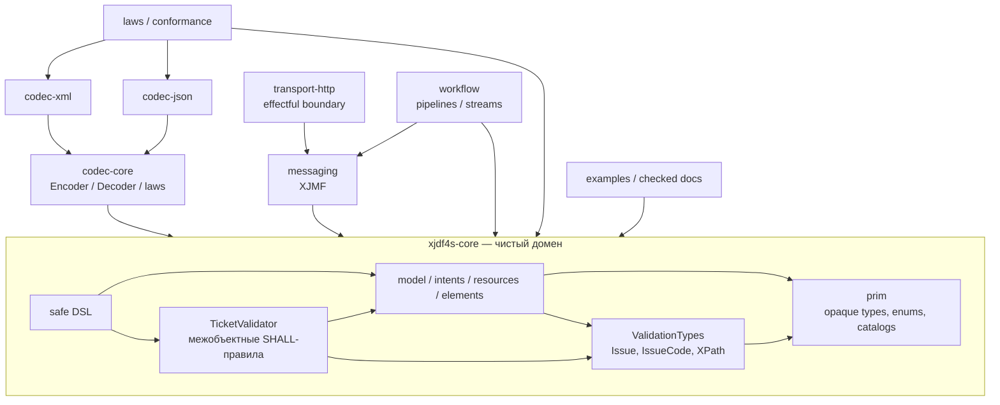
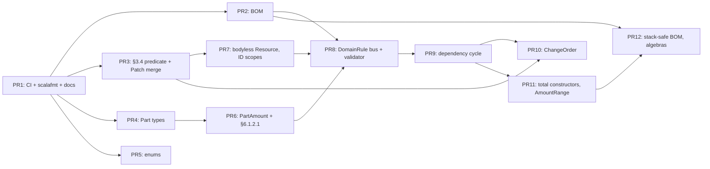
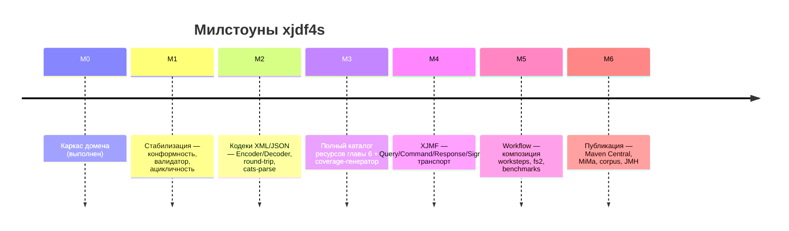

# NEXT — консолидированный план работ по xjdf4s

> **Дата:** 2026-08-15
> **Ветка:** `arena/01a004b7-xjdf4s`, база `c1ae995` (`develop`)
> **Статус:** единый рабочий документ, замещающий разрозненные
> `PLAN-{A,B,C}.md` и `ROADMAP-{A,B}.md` в части «что делать дальше».
>
> **Источники (13 документов):**
> `review/DEPENDENCY-DIAGRAM.md`, `review/DEPENDENCY-REPORT.md`,
> `review/PROPOSAL-A.md`, `review/PROPOSAL-B.md`, `review/PROPOSAL-C.md`,
> `review/REVIEW-A.md`, `review/REVIEW-B.md`, `review/REVIEW-C.md`,
> `PLAN-A.md`, `PLAN-B.md`, `PLAN-C.md`, `ROADMAP-A.md`, `ROADMAP-B.md`.
>
> **Метод:** все спорные утверждения источников перепроверены заново по
> текущему дереву `modules/*` и по `./reference/xjdf/*`. Там, где источники
> противоречат друг другу, в разделе [2](#2-разрешение-противоречий-между-источниками)
> зафиксировано одно решение с доказательством. В окружении нет JVM/sbt,
> поэтому выводы о компиляции помечены как требующие подтверждения CI
> (задача **E-1**).

---

## Оглавление

1. [Резюме и текущее состояние](#1-резюме-и-текущее-состояние)
2. [Разрешение противоречий между источниками](#2-разрешение-противоречий-между-источниками)
3. [Реестр подтверждённых находок](#3-реестр-подтверждённых-находок)
4. [Архитектурные решения (ADR)](#4-архитектурные-решения-adr)
5. [Целевая архитектура](#5-целевая-архитектура)
6. [План работ M1](#6-план-работ-m1)
    - [Фаза A — Наблюдаемость сборки](#фаза-a--наблюдаемость-сборки-a-1a-4)
    - [Фаза B — Функциональные блокеры](#фаза-b--функциональные-блокеры-b-1b-3)
    - [Фаза C — Конформность XJDF 2.2](#фаза-c--конформность-xjdf-22-c-1c-8)
    - [Фаза D — Корневой валидатор](#фаза-d--корневой-валидатор-d-1d-4)
    - [Фаза E — Архитектура и безопасный API](#фаза-e--архитектура-и-безопасный-api-e-1e-7)
    - [Фаза F — Документация и категориальная строгость](#фаза-f--документация-и-категориальная-строгость-f-1f-6)
    - [Фаза G — Инженерная инфраструктура](#фаза-g--инженерная-инфраструктура-g-1g-4)
7. [Нарезка на PR и граф зависимостей](#7-нарезка-на-pr-и-граф-зависимостей)
8. [Дорожная карта M2–M6](#8-дорожная-карта-m2m6)
9. [Стратегия тестирования](#9-стратегия-тестирования)
10. [Definition of Done M1](#10-definition-of-done-m1)
11. [Риски](#11-риски)
12. [Матрица трассируемости](#12-матрица-трассируемости)
13. [Конвенции вклада](#13-конвенции-вклада)

---

## 1. Резюме и текущее состояние

### 1.1 Что уже есть (M0 «Каркас домена»)

Три модуля, 43 файла, ~7 000 строк:

| Модуль | Файлов | Содержимое |
|---|---|---|
| `modules/core` | 36 | `prim` (opaque-типы Appendix A, 45 enum, каталоги), `model` (Ticket, Product/BOM, Resource, Partition, Amounts, Audit, Header, Patch, Validation, IdSource), `intents` (8 интентов гл. 4), `resources` (12 ресурсов гл. 6), `dsl` |
| `modules/laws` | 5 | `AlgebraLaws`, `AlignmentLaws`, `PartitionLaws`, `TicketLaws`, `Arbitraries` |
| `modules/examples` | 2 | `SpecExamples` (примеры 3.1/3.3/3.4/3.6/5.2 + brochure), `Main` |

Все три независимых аудита сходятся в оценке: **фундамент сильный**. Домен
не анемичен, алгебры настоящие (`Semigroup`/`Monoid`/`Semilattice`,
`FunctionK`, `Ior`, `State`, `ValidatedNec`), категориальный слой опирается
на работающие конструкции (`Fix[ProductTree]` + катаморфизм, моноид
эндоморфизмов `Patch`, естественное преобразование `Pulse ~> NonEmptyChain`),
трассируемость к таблицам спецификации выдержана почти везде.

### 1.2 Что мешает двигаться дальше

Сводно по итогам факт-чекинга (детали — §3):

```
┌──────────────────────────────────────────────┬────────┐
│ Категория                                    │ Кол-во │
├──────────────────────────────────────────────┼────────┤
│ Функциональные дефекты ядра (P0)             │   2    │
│ Расхождения со спецификацией XJDF 2.2 (P1)   │  13    │
│ Неполнота корневого валидатора (P1)          │   4    │
│ Архитектурные дефекты (P2)                   │   6    │
│ Ошибки документации / теории (P3)            │   7    │
│ Отсутствующая инженерная инфраструктура (P4) │   3    │
├──────────────────────────────────────────────┼────────┤
│ Опровергнуто при факт-чекинге                │   3    │
└──────────────────────────────────────────────┴────────┘
```

Ключевой системный дефицит — **отсутствие обратной связи от компилятора**.
Ни один аудит не смог запустить `sbt`, поэтому все оценки о компилируемости
аналитические. Именно это породило и два ложных «блокера сборки» (§2.1, §2.2).
Поэтому первым шагом M1 является CI (**G-1**), а не правки кода.

### 1.3 Граф зависимостей (из `review/DEPENDENCY-REPORT.md`)

- 43 узла, 232 ребра, **1 цикл**;
- цикл: `model.Validation → model.Product → model.Ticket → model.Patch → model.Validation`;
- узкое место: `resources.AllResources` (betweenness 161.6, fan-out 13),
  далее `model.Resource` (135.1), `intents.AllIntents` (45.9),
  `model.Validation` (42.1);
- фундамент (fan-in, fan-out = 0): `prim.Tokens` (36), `prim.Ids` (23),
  `prim.Quantity` (19), `prim.Time` (12), `prim.Versions` (2) — стабильны, ок;
- нарушений принципа стабильных зависимостей нет; God-объектов нет;
  изолированных файлов нет (но `model.IdSource` — листовой с fan-in 0, см. F-05).

Практический вывод для M3: добавление ~130 ресурсов в единый
`AllResources`-enum усилит уже существующее узкое место — представление
`ResourcePayload` нужно пересмотреть **до** массового наполнения (см. §8, M3.1).

---

## 2. Разрешение противоречий между источниками

Три плана и два роадмапа расходятся в шести местах. Ниже — окончательное
решение по каждому, с проверкой по коду/спецификации.

### 2.1 `Monoid[ValidatedNec[Issue, Unit]]` — **находка отклонена**

- **Утверждение:** `REVIEW-C` R-01, `PROPOSAL-C` P0-1, `PLAN-A` P0-1,
  `PLAN-B` P0.1 — «`checks.combineAll` не компилируется, нужен свой инстанс».
- **Контр-утверждение:** `PLAN-C` FC-01, `ROADMAP-A` FR-01, `ROADMAP-B` §4.3.
- **Проверка:** cats предоставляет
  `catsDataMonoidForValidated[A: Semigroup, B: Monoid]: Monoid[Validated[A, B]]`.
  Для `A = NonEmptyChain[Issue]` есть `Semigroup`, для `B = Unit` есть
  `Monoid` — инстанс синтезируется. Места вызова:
  `model/Validation.scala:56` (`checks.combineAll`),
  `model/Product.scala:192` (`kids.combineAll`).
- **Решение:** ❌ **не добавлять** рукописный `given` — он создаст
  неоднозначность implicit-разрешения. Вместо этого — **compile-test**
  `summon[Monoid[ValidatedNec[Issue, Unit]]]` (задача **A-3**), который
  закроет вопрос фактом, а не мнением.

### 2.2 `IntegerRange.indices` и нисходящие диапазоны — **находка отклонена**

- **Утверждение:** `REVIEW-C` R-03, `PROPOSAL-C` P1-2 — «ветка `by -1`
  недостижима, закон `-1 0` красный».
- **Проверка** (`prim/Quantity.scala:383–390`):
  ```scala
  val f  = normalizeIndex(r.from, size)   // "-1" при size=3 → 2
  val t  = normalizeIndex(r.to,   size)   // "0"  при size=3 → 0
  val lo = math.max(0L, math.min(f, size - 1))  // = 2  (это clamped FROM)
  val hi = math.max(0L, math.min(t, size - 1))  // = 0  (это clamped TO)
  if lo <= hi then (lo to hi).toList else (lo to hi by -1).toList
  ```
  `2 <= 0` ложно → `(2 to 0 by -1) = List(2,1,0)`. Поведение корректно
  по §1.10.2. Ошибка ревьюера вызвана именами `lo`/`hi`, которые внушают
  «lower/higher», хотя это «from/to».
- **Решение:** ❌ семантику **не менять**. Выполнить только переименование
  `lo`/`hi` → `clampedFrom`/`clampedTo` и добавить граничные тесты
  (задача **E-6**).

### 2.3 Красный `build.log` в индексе — **неприменимо**

- **Утверждение:** `REVIEW-A` §1.1, `REVIEW-B` R1.1, `PROPOSAL-A` §2.1,
  `PROPOSAL-B` P-03, `PROPOSAL-C` P4-2.
- **Проверка:** файла `build.log` нет ни в рабочем дереве, ни в индексе;
  `*.log` присутствует в `.gitignore`.
- **Решение:** ⚠️ действий не требуется. Правило на будущее (**G-2**):
  логи сборки — артефакты CI, не файлы репозитория.

### 2.4 `XJDF/@Name` — **не добавлять в домен**

- **Утверждение A:** `REVIEW-B` R2.10, `PROPOSAL-B` P-09, `PLAN-A` P1-12,
  `PLAN-B` P2.14, `ROADMAP-A` P1-10 — «добавить `XJDF.name: Option[XjdfString]`».
- **Утверждение B:** `ROADMAP-B` §4.3 — «это JSON-only дискриминатор».
- **Проверка** (Table 3.1, Sheet 2, `reference/xjdf/3 – Structure.md:31`):
  > `Name`? | `enumeration` | `@Name` SHALL specify the local name of the XJDF
  > when `XJDF` is defined as a root JSON object. Allowed value is: `XJDF`.
  > **JSON Exception:** `@Name` SHALL be provided in JSON if `XJDF` is the root
  > JSON object and **SHALL NOT be provided in XML**.
- **Решение:** ✅ утверждение B верно. Поле **не добавляется** в `XJDF`:
  это правило кодирования, а не домена. Реализуется в M2 (JSON-encoder всегда
  подставляет `"Name": "XJDF"`, decoder валидирует и снимает при нормализации).
  Тип к тому же `enumeration` с единственным значением, а не `string` —
  предложенная сигнатура `Option[XjdfString]` была бы неверна и по типу.
  Фиксируется в **ADR-0007**.

### 2.5 Дизайн `ChangeOrder` — выбран вариант «номинальный partial-документ»

Три несовместимых предложения:

| Вариант | Источник | Суть | Оценка |
|---|---|---|---|
| A | `PROPOSAL-A` §3.2, `PLAN-B` P3.1 | Убрать `Partial`, change order = только `Patch` | Честно, но теряется представление входящего документа §1.3.2 |
| B | `PLAN-C` ADR-1, `ROADMAP-A` ADR-0001 | `opaque type ChangeOrder = XJDF` | Даёт номинал, но **не решает** ослабленную кардинальность: `JobID`/`Types` остаются обязательными |
| C | `PROPOSAL-B` P-04(B), `ROADMAP-B` M1.4-2 | Отдельный `final case class ChangeOrder` с partial-полями + компиляция в `Patch` | Единственный, выражающий §1.3.2/§1.6.5 |

- **Проверка** (`model/Ticket.scala`): строка 13 — `trait Partial`;
  строка 41 — `... extends Partial`; строка 118 — `type ChangeOrder = XJDF & Partial`.
  Так как `XJDF <: Partial`, то `XJDF & Partial ≡ XJDF`. Ни одна сигнатура
  публичного API не принимает `ChangeOrder`.
- **Решение:** ✅ **вариант C** (см. [ADR-0001](#adr-0001-changeorder--номинальный-partial-документ)).

### 2.6 `Matrix` как `Group` — **отклонено**

- **Утверждение:** `REVIEW-A` §3.4 — «есть `inverse`, значит `Group`».
- **Проверка:** `Group` требует тотальный `inverse`; у вырожденной матрицы
  (det = 0) обратной нет, `inverse: Option[Matrix]` — честная сигнатура.
- **Решение:** ❌ `Group[Matrix]` не вводить. Оставить `Monoid` + частичный
  `inverse`, задокументировать причину. Опционально (не в M1) — отдельный
  проверенный тип `InvertibleMatrix` с тотальным `Group`.
  Согласуется с `PLAN-A` F-30, `ROADMAP-A` P2-5, `ROADMAP-B` M1.4-6.

### 2.7 Сводка приоритетов после разрешения

Приоритеты источников не совпадали (например, `Bom.toTree` — «P1» в `PLAN-B`,
«P0» в `PLAN-C`/`ROADMAP-A`). Единая шкала этого документа:

| Приор. | Смысл |
|---|---|
| **P0** | Ломает корректность ядра или примеры спецификации |
| **P1** | Нарушение конформности XJDF 2.2 (типы, кардинальности, токены, валидация) |
| **P2** | Архитектура, алгебры, безопасность API, мёртвый код |
| **P3** | Документация, категориальная строгость, DX |
| **P4** | Инженерия, CI/CD, гигиена репозитория |

---

## 3. Реестр подтверждённых находок

Каждая строка перепроверена по коду и по `./reference/xjdf/*` заново.
`N-xx` — сквозной идентификатор этого документа.

### 3.1 Функциональные дефекты ядра (P0)

| ID | Находка | Доказательство | Задача |
|---|---|---|---|
| **N-01** | `Bom.toTree` кладёт в `seen` ID **ребёнка**, а не текущего узла | `model/Product.scala`: `kid <- child.flatMap(c => toTree(c, byId, seen + c.id.fold("")(_.value)))`. Ребёнок немедленно находит собственный ID в `seen` → любой BOM со `@ChildRefs` объявляется циклом; `Main.demoBomFold` на Example 3.4 падает. Тестов на `fromProductList` в laws нет | **B-1** |
| **N-02** | `Patch.mergeResourceSets` конкатенирует вместо замещения | `model/Patch.scala:74–86`: `ticket.copy(resourceSets = ticket.resourceSets ++ update)`; конфликтующие сеты остаются оба. Scaladoc обещает «update wins», но `select` (§6.1.3.2, first match) вернёт **старый**. Результат к тому же нарушает §3.4. `Left` в сигнатуре `Ior` недостижим | **B-2** |

### 3.2 Расхождения со спецификацией XJDF 2.2 (P1)

| ID | Находка | Спецификация | Код | Задача |
|---|---|---|---|---|
| **N-03** | `Part/@ProductPart` типизирован как `IdRef` | Table 6.4: `ProductPart? (Deprecated in XJDF 2.1)` \| **NMTOKEN** | `model/Partition.scala:137` `productPart: Option[IdRef]`; :70 `ProductRef(value: IdRef)`; :313 `byProductRef` | **C-1** |
| **N-04** | `Part/@Metadata` типизирован как `NmToken` | Table 6.4: `Metadata?` \| **regExp** | `model/Partition.scala:130` `metadata: Option[NmToken]`; `NmToken` запрещает пробелы — regex их содержит | **C-1** |
| **N-05** | `Show[Part]`/сообщения валидатора печатают `OptionKey` | Table 6.4: имя атрибута — `Option` | `PartitionKey.OptionKey` (переименование вынужденное: коллизия со `scala.Option`), но wire-имя нигде не задано | **C-2** |
| **N-06** | `Sides` неполон | Table A.40 — 5 значений, `Unprinted` *(New in XJDF 2.1)* | `prim/Enums.scala:49–54` — 4 значения | **C-3** |
| **N-07** | `DeviceStatus` неполон | Table A.15 — 7 значений, `Cleanup` и `Setup` *(New in XJDF 2.1)* | `prim/Enums.scala:109–114` — 5 значений | **C-3** |
| **N-08** | `HardCoverJacket.Glued` даёт wire-токен `"Glued"` | Table 4.11 (Sheet 1), `Jacket?`: «Allowed values are: **None** … **Loose** … **Glue**» | `prim/Enums.scala:514–518`: `case Glued`, `token = this.toString` → `"Glued"` | **C-3** |
| **N-09** | `NamedColor` — закрытый enum из 16 значений | A.2.30: «For a list of allowed values, see `[Color Names]`» — внешний открытый каталог | `prim/Enums.scala:264–274` — closed enum; `MediaIntent(@MediaColor="Pantone 123 C")` невыразим | **C-4** |
| **N-10** | `PartAmount` содержит один `Part` | Table 6.3: `Part*` (0..*) | `model/Amounts.scala:39` `part: Part = Part.empty` | **C-5** |
| **N-11** | `Resource.specific` обязателен | Table 6.1: `Specific Resource **?**`; Example 3.6 использует `<Resource/>` | `model/Resource.scala:217` `specific: ResourcePayload` | **C-6** |
| **N-12** | `DropItem` неполон | Table 6.55: `TotalDimensions?` (shape), `TotalVolume?` (float), `TotalWeight?` (float) | `resources/Delivery.scala:34–37` — только `amount`, `itemRef` | **C-7** |
| **N-13** | `Notification` без `@ModuleID` и без правила Milestone | Table 8.49: `@ModuleID?`; «If Milestone is present, the value of `@Class` SHALL be `"Event"`» | `model/Header.scala:70–78` — нет `moduleId`, нет инварианта | **C-7** |
| **N-14** | `Header/@ID` включён в документный ID-скоуп | Table 7.3: `@ID` «SHALL be unique for all messages and XJMF **initiated by the Sender**» — мессенджинговый скоуп, не §2.2.3 | `model/Ticket.scala:57–63` — `headerIds` попадают в `declaredIds`; при этом `references` (:66–69) **не** собирает IDREF из аудитов — асимметрия | **C-8** |
| **N-15** | 7 scaladoc-ссылок указывают номер **раздела** вместо номера **таблицы** | Сверено с `6 – Resources.md`: строки 458, 786, 1086, 1349, 1583, 1682, 1844 | см. таблицу в **F-1** | **F-1** |

### 3.3 Неполнота корневого валидатора (P1)

| ID | Находка | Спецификация | Код | Задача |
|---|---|---|---|---|
| **N-16** | §3.4 проверяется только на точное равенство ключа | §3.4: «…same values of `@Name`, `@Usage`, `@ProcessUsage` and **common or no entries** in `@CombinedProcessIndex` SHALL NOT be specified» | `model/Validation.scala:87–98`: `groupBy(_.key)`. Не ловит `CPI=[0]` vs `CPI=[0,1]`, ни «без CPI» рядом с «CPI=[1]» | **D-1** |
| **N-17** | §6.1.2.1 учитывает родительские `Part` только при их количестве ровно 1; вторая половина правила не реализована | Table 6.3: «…already uniquely specified in **any** parent Resource/Part» + «…value of that key SHALL match **one of the values** from the parent» | `model/Validation.scala:170–177`: `r.parts.size match { case 1 => …; case _ => Nil }` | **D-2** |
| **N-18** | Локальные `isLawful` не подключены к валидатору | Table 4.8 (парность BindingIntent), §4.14 (min≤avg≤max), Table 8.23 (Disposition), Table 6.5 (PartWaste) | Определены `intents/Binding.scala:31`, `intents/FoldingVariable.scala:42`, `model/Amounts.scala:19`, `prim/Common.scala:213` — **ни один не вызывается**. `TicketValidator.checkIntentLawfulness` проверяет только `Intent.isLawful` (`@Name == elementName`) | **D-3** |
| **N-19** | Целостность BOM не входит в `validate` | §3.3.1.1, ацикличность и разрешимость `@ChildRefs` | `TicketValidator.validate` не вызывает `Bom.fromProductList`; тикет с циклом в BOM проходит `isValid` | **D-3** |

### 3.4 Архитектурные дефекты (P2)

| ID | Находка | Доказательство | Задача |
|---|---|---|---|
| **N-20** | `ChangeOrder = XJDF & Partial` вырожден | `XJDF <: Partial` ⇒ пересечение ≡ `XJDF`; в API не используется; §1.3.2 не выражена | **E-2** |
| **N-21** | Цикл файловых зависимостей в `model` | `DEPENDENCY-REPORT`: `Validation → Product → Ticket → Patch → Validation` | **E-3** |
| **N-22** | `IdAllocator`/`WithIds`/`IdSource` — мёртвый код | `grep` по `modules/` вне `model/IdSource.scala` — **ноль** использований; DSL берёт ID из явного параметра | **E-4** |
| **N-23** | `AmountRange.meet`/`join` расходятся с документацией | `prim/Quantity.scala:540–544`: `stricterMin` возвращает **большее** (`if x >= y then x`). `meet.amount` (:560) использует `stricterMin` — «ужесточение» повышает обещание; `join.min` (:570) тоже `stricterMin` — «расширение» сужает интервал. Законы `Semilattice` этого не ловят (каждая координата независимо min/max); `join` нигде не используется | **E-5** |
| **N-24** | `PartBuilder.set` бросает `IllegalArgumentException` без `unsafe` в имени | `model/Partition.scala:415–462` (`expectToken`, `expectProductRef`); нарушает принцип 5 из `docs/04` | **E-7** |
| **N-25** | `TicketDraft.withJobPart`/`withProject` молча глотают невалидные значения | `dsl/XjdfDsl.scala`: `JobPartId.from(...)` → `None`, тогда как `TicketDraft.of` валидирует `JobID` через `ValidatedNec` — несимметричный UX | **E-7** |

### 3.5 Документация и теория (P3)

| ID | Находка | Доказательство | Задача |
|---|---|---|---|
| **N-26** | README-сниппет не компилируется | `README.md:53`: `.flatMap(_.build)` на `ValidatedNec`; `Validated` — не монада | **A-2** |
| **N-27** | `docs/03` утверждает, что `.andThen` не компилируется | `docs/03-cats-mapping.md:21`: «ни for-comprehensions, ни `.flatMap`/`.andThen` … не». Фактически `Validated.andThen` существует и **используется** в `dsl.intent` | **A-2** |
| **N-28** | Битая ссылка в `docs/02` | `docs/02-scala3-features.md:164` → `03-cats.md`; файл называется `03-cats-mapping.md` | **A-2** |
| **N-29** | Битая ссылка в `docs/01` | `docs/01-category-theory-view.md:16` → «Part 1 – its-all-about-morphisms»; файл лежит в Part 3 | **A-2** |
| **N-30** | `Part.matches` назван предпорядком | `docs/01:64–66`: «тонкая категория (preorder) … рефлексивно и транзитивно». Контрпример: `{SheetName=S1} ≼ {} ≼ {SheetName=S2}`, но первое и третье конфликтуют. Отношение рефлексивно и **симметрично** (`matches ⟺ conflictingKeys.isEmpty`), но не транзитивно — это **отношение толерантности** | **F-2** |
| **N-31** | «Свободный моноид» для `NonEmptyChain`-носителей | `AuditPool`, `AmountPool`, `NmTokens`, `ProcessPath` — без нейтрального элемента это свободная **полугруппа**. Кардинальность `T+` спецификации корректна, неточен термин | **F-3** |
| **N-32** | «Сопряжение Intent ⇄ Resource» подано как факт | `docs/01 §7` — нет ни пары функторов, ни unit/counit, ни изоморфизма хом-множеств. Это инженерная аналогия | **F-3** |

### 3.6 Инженерная инфраструктура (P4)

| ID | Находка | Доказательство | Задача |
|---|---|---|---|
| **N-33** | Нет CI | каталог `.github/` отсутствует | **G-1** |
| **N-34** | Нет LICENSE | файла `LICENSE` нет; блокирует публикацию M6 | **G-3** |
| **N-35** | Нет `sbt-scalafmt` | `.scalafmt.conf` (3.11.0) есть, но `project/plugins.sbt` отсутствует ⇒ команды `scalafmtCheckAll` в сборке **нет**. Все планы, требующие её в CI, опираются на несуществующую задачу | **G-4** |

---

## 4. Архитектурные решения (ADR)

Каталог заводится в `docs/adr/` (задача **F-5**), формат Michael Nygard.

### ADR-0001: ChangeOrder — номинальный partial-документ

**Контекст.** `type ChangeOrder = XJDF & Partial` при `XJDF extends Partial`
семантически пуст (N-20). §1.3.2/§1.6.5 определяют change order как документ
с ослабленной кардинальностью, несущий только изменённые значения.

**Решение.** Разделить три сущности, которые сейчас смешаны:

1. **`ChangeOrder`** — входной partial-документ (`final case class` с
   `Option`-полями; обязателен только `jobId` как адресат изменения);
2. **`Patch`** — нормализованная операция `XJDF => XJDF` (уже есть, моноид
   эндоморфизмов с правым действием);
3. **результат применения** — `ValidatedNec[Issue, XJDF]`, потому что
   change order может нарушить инварианты целевого тикета.

```scala
/** §1.3.2, §1.6.5: change order carries only the modified values. */
final case class ChangeOrder(
    jobId: JobId,
    jobPartId: Option[JobPartId] = None,
    productList: Option[ProductList] = None,       // replace
    auditPool: Option[AuditPool] = None,           // append, chronologically
    resourceSets: Chain[ResourceSet] = Chain.empty,// upsert by §3.4 key
    comments: Chain[Comment] = Chain.empty
)

object ChangeOrder:
  /** Compiles a change order against a base ticket into a lawful endomorphism. */
  def compile(change: ChangeOrder, base: XJDF): ValidatedNec[Issue, Patch]

def applyChange(base: XJDF, change: ChangeOrder): ValidatedNec[Issue, XJDF]
```

`trait Partial` и `type ChangeOrder = XJDF & Partial` удаляются.
`opaque type ChangeOrder = XJDF` (вариант `PLAN-C`/`ROADMAP-A`) отвергнут:
он даёт номинал, но не решает ослабленную кардинальность.

**Следствия.** Демонстрация intersection types из README/`docs/02` теряет
своё текущее (ложное) обоснование. Честное применение intersection переносится
в M4 (XJMF), где оно органично: `type SubscribedQuery = Query & WithSubscription`.
Закон действия `applyTo(applyTo(t, p), q) == applyTo(t, p |+| q)` сохраняется
через `toPatch`.

### ADR-0002: Разрыв цикла зависимостей в `model`

**Контекст.** N-21: цикл из 4 файлов.

**Решение.** Вынести фундамент валидации в независимый файл:

```text
model/ValidationTypes.scala   Issue, IssueCode, SeverityClass, XPath,
                              type ValidationResult[A] = ValidatedNec[Issue, A]
model/Product.scala           зависит только от ValidationTypes
model/Ticket.scala            не зависит от реализации Patch
model/Patch.scala             зависит от Ticket и ValidationTypes
model/TicketValidator.scala   зависит от всей доменной модели, агрегирует правила
```

```
ДО:   [Validation] → [Product] → [Ticket] → [Patch] → [Validation]   ЦИКЛ

ПОСЛЕ:            [ValidationTypes]   (fan-out 0, фундамент)
                    ▲     ▲     ▲
              [Product] [Ticket] [Patch]
                    ▲     ▲     ▲
                   [TicketValidator]
```

**Критерий:** повторный прогон анализатора зависимостей даёт **0 циклов**.

### ADR-0003: Форма локальных правил — `DomainRule`, а не `Boolean`

**Контекст.** N-18: пять реализаций `isLawful: Boolean`, все висят в воздухе.
`Boolean` теряет причину, путь и severity.

**Решение.**

```scala
/** A model node carrying local structural laws (spec SHALL / SHALL NOT). */
trait DomainRule[-A]:
  def check(value: A, at: XPath): Chain[Issue]
```

Локальные правила возвращают структурированные `Issue` (код, severity, XPath,
человекочитаемое сообщение); `TicketValidator` выполняет обход агрегата и
накапливает их. Глобальные правила (уникальность ID, §3.4, хронология,
целостность BOM) остаются в валидаторе. Каждый `Issue` получает стабильный
machine-readable `IssueCode`, чтобы кодеки M2 и HTTP-слой M4 не разбирали строки.

### ADR-0004: Семантика `AmountRange`

**Контекст.** N-23: направления `meet`/`join` противоречат документации;
`join` не используется и не покрыт законом.

**Решение.** Зафиксировать смысл полурешётки обязательств по Table 6.3
(`@Amount` — план без брака; `@MinAmount`/`@MaxAmount` — допустимые недо-/пере-поставка):

| Операция | `min` | `max` | `amount` |
|---|---|---|---|
| `meet` — ужесточение контракта | `max(min₁, min₂)` | `min(max₁, max₂)` | `min(amount₁, amount₂)` |
| `join` — оптимистичное расширение | `min(min₁, min₂)` | `max(max₁, max₂)` | `max(amount₁, amount₂)` |

Дополнительно: пустое пересечение (`min > max`) не должно возвращаться как
«валидный» range — либо `Option`, либо явная ошибка. Если `join` не найдёт
потребителя — переименовать в `widen` и покрыть законом, либо удалить.
Оба варианта покрываются `Semilattice`-законами в `AlgebraLaws`.

### ADR-0005: `Part.matches` — отношение толерантности

**Контекст.** N-30.

**Решение.** В `docs/01 §3` заменить «preorder / тонкая категория» на
**отношение совместимости (tolerance relation)**: рефлексивное и симметричное,
но не транзитивное. Если нужен настоящий частичный порядок — он строится по
конфликт-свободному слиянию: `a ≤ b ⟺ mergeWith(a, b).isRight && merge(a, b) == b`.

Законы в `PartitionLaws`:

```scala
property("matches is reflexive")            // уже есть
property("matches is symmetric")            // новый
property("matches(b) == conflictingKeys(b).isEmpty")  // закон-мост
test("matches is NOT transitive (tolerance, not preorder)")  // явный контрпример
```

### ADR-0006: Политика severity — errors vs warnings

**Контекст.** `Issue` уже несёт severity, но `ValidatedNec` инвалидирует
результат при любом issue. Спецификация различает SHALL (обязательно),
SHOULD и MAY.

**Решение.** SHALL-нарушения инвалидируют результат. SHOULD/MAY попадают в
отдельный отчёт:

```scala
final case class ValidationReport(errors: Chain[Issue], warnings: Chain[Issue]):
  def isValid: Boolean = errors.isEmpty
```

До принятия окончательного API severity внутри `Issue` не игнорируется.

### ADR-0007: `XJDF/@Name` — правило кодирования, не поле домена

См. §2.4. Реализуется в M2 (codec-json), в `XJDF` не добавляется.
Тот же принцип применяется ко всем «JSON Exception» из таблиц: они собираются
в единый реестр кодека, а не протекают в доменные case-классы.

### ADR-0008: Открытые каталоги vs закрытые enum

**Контекст.** N-09; общее правило проекта из `docs/02` («allowed values are»
→ closed enum; «values include those from» / внешний список → `NmToken` + `Catalog`)
нарушено для `NamedColor`.

**Решение.** Формализовать критерий и применить машинную сверку:
для каждого closed enum — golden-множество wire-токенов, взятое из таблицы
Appendix A/главы. Scala-имя case **не считается** wire-токеном по умолчанию:
известные намеренные расхождения (`NoBinding`→`None`, `Unbound`→`None`,
`Uncoated`→`None`, `Unscored`→`None`, `Unjacketed`→`None`, jacket glue→`Glue`,
`OptionKey`→`Option`) ведутся отдельным реестром со ссылкой на таблицу.

---

## 5. Целевая архитектура

### 5.1 Модули после M1–M4



`core` не зависит ни от кодеков, ни от messaging, ни от HTTP/fs2.

### 5.2 Слои внутри `core`

| Слой | Содержимое | Не должен знать о |
|---|---|---|
| `prim` | проверенные скалярные типы Appendix A, closed enums, open catalogs | `XJDF`, XML/JSON, HTTP |
| `elements` | общие элементы глав 3/8 (`Comment`, `GeneralID`, `Event`, `Milestone`, `Dependent`, `FileSpec`, `Disposition`) | парсеры, эффекты |
| `model` | агрегаты XJDF и локальные инварианты | wire-формат |
| `validation` | `Issue`, severity, XPath, composable rules, root validator | transport |
| `dsl` | безопасное декларативное конструирование | ordering/namespaces |

Сейчас элементы глав 3/8 лежат в `prim/Common.scala` — переносятся в
`elements/` механически (задача **E-8**, отдельным PR без функциональных правок).

---

## 6. План работ M1

Цель M1: **воспроизводимо собираемое, спецификационно согласованное ядро**,
на публичных типах которого безопасно строить кодеки M2.

### Фаза A — Наблюдаемость сборки (A-1…A-4)

> Выполняется первой. Пока нет обратной связи от компилятора, любая широкая
> правка типов — работа вслепую (см. §2.1, §2.2 — два ложных «блокера»).

#### A-1. Первый зелёный прогон (P4)

`sbt -batch clean compile test examples/run` на JDK 21. Зафиксировать:
результат резолва версий (`cats-core 2.13.0`, `munit 1.3.0`,
`munit-scalacheck 1.3.0`, Scala 3.8.4, sbt 2.0.2), полный список
предупреждений `-Wunused:all -Wvalue-discard -Wnonunit-statement`, вывод демо.
Лог **не коммитить** — приложить в тред PR либо как артефакт CI.

#### A-2. Исполняемая документация (P3) — закрывает N-26…N-29

- `README.md:53`: `.flatMap(_.build)` → `.andThen(_.build)`;
- добавить в `TicketLaws` тест «README example compiles and validates»,
  дословно повторяющий сниппет;
- `docs/03-cats-mapping.md:21`: переписать тезис — «нет `flatMap` и
  for-comprehensions; есть `andThen` — right-biased sequencing без накопления
  левой ошибки»;
- `docs/02-scala3-features.md:164`: `03-cats.md` → `03-cats-mapping.md`;
- `docs/01-category-theory-view.md:16`: «Part 1 – its-all-about-morphisms» →
  Part 3;
- линт остальных markdown-ссылок в `docs/*` и `README.md`.

#### A-3. Compile-tests спорных находок (P4) — закрывает §2.1, §2.2

Один тест-файл, фиксирующий разрешённые противоречия фактом:

```scala
test("cats provides Monoid[ValidatedNec[Issue, Unit]]"):
  val _ = summon[Monoid[ValidatedNec[Issue, Unit]]]  // §2.1

test("§1.10.2: range \"-1 0\" selects everything in reverse"):
  assertEquals(IntegerRange.unsafe(-1, 0).select(List("a","b","c")),
               List("c","b","a"))                     // §2.2
```

#### A-4. Регрессионный тест из архивного контрпримера (P4)

`build.log` зафиксировал падение `PartitionLaws` до разворота overlay
(§2.3). Сам лог неактуален, но контрпример стоит недорого:

```scala
test("regression: overlay is right-biased (pre-M1c direction would fail)"):
  val l = Part(docIndex = Some(IntegerRange.unsafe(3, 3)))
  val r = Part(docIndex = Some(IntegerRange.unsafe(-10, -10)))
  assertEquals(Part.combine(l, r).docIndex, r.docIndex)
```

---

### Фаза B — Функциональные блокеры (B-1…B-3)

#### B-1. Исправить развёртку BOM (P0) — закрывает N-01

`model/Product.scala`. При входе в узел: проверить ID **текущего** узла
против path-local `seen`, сформировать `nextSeen`, передать один и тот же
`nextSeen` каждому ребёнку.

```scala
private def toTree(
    product: Product,
    byId: Map[String, Product],
    seen: Set[String]
): Either[Issue, Fix[ProductTree]] =
  val currentId = product.id.map(_.value)
  currentId match
    case Some(id) if seen.contains(id) =>
      Left(Issue.error(XPath("/XJDF/ProductList"),
        s"Cycle in product structure at ID '$id'"))
    case _ =>
      val nextSeen = currentId.fold(seen)(seen + _)
      product.references.toList.distinct match
        case Nil  => Right(Fix(ProductTree.Leaf(product)))
        case refs =>
          refs.foldLeft(Right(Chain.empty[Fix[ProductTree]])
                : Either[Issue, Chain[Fix[ProductTree]]]) { (acc, ref) =>
            for
              kids  <- acc
              child <- byId.get(ref.value).toRight(
                         Issue.error(XPath("/XJDF/ProductList"),
                           s"Unresolved ChildRef '${ref.value}'"))
              kid   <- toTree(child, byId, nextSeen)
            yield kids :+ kid
          }.map(cs => Fix(ProductTree.Node(product, cs)))
```

**Обязательные тесты:** лист без ID; валидное дерево глубины ≥ 2;
неразрешённый `ChildRef`; self-cycle; косвенный цикл A→B→C→A;
**DAG с общим ребёнком из двух независимых ветвей** (не должен считаться циклом);
`SpecExamples.notebook` разворачивается и `Bom.totalCopies` считается.

> Последний пункт — важный: замена `seen + child.id` на path-local `nextSeen`
> корректно разрешает переиспользование поддерева в разных ветвях, что
> в текущем коде тоже ломается.

#### B-2. Исправить `Patch.mergeResourceSets` (P0) — закрывает N-02

Update **замещает** конфликтующие сеты, а не конкатенирует. Конфликт
определяется общим предикатом §3.4 (см. **D-1**) — один helper на валидатор и
на merge, чтобы политики не разошлись.

```scala
def mergeResourceSets(ticket: XJDF, update: Chain[ResourceSet])
    : Ior[NonEmptyChain[Issue], XJDF] =
  val conflictsInUpdate = pairsClashing(update)     // §3.4 внутри самого update
  if conflictsInUpdate.nonEmpty then
    Ior.left(/* update внутренне противоречив — применить детерминированно нельзя */)
  else
    val replaced = ticket.resourceSets.filter(rs => update.exists(clashesWith(rs, _)))
    val retained = ticket.resourceSets.filterNot(rs => update.exists(clashesWith(rs, _)))
    val merged   = ticket.copy(resourceSets = retained ++ update)
    NonEmptyChain.fromChain(replaced.map(warnReplaced)) match
      case Some(nec) => Ior.both(nec, merged)
      case None      => Ior.right(merged)
```

Ветка `Ior.left` наконец становится достижимой и соответствует scaladoc.

**Тесты:** без конфликта; точное совпадение ключа; частичное пересечение CPI;
`None` vs `Some(CPI)`; несколько замен; дубликат внутри update → `Left`;
идемпотентность повторного применения; **результат merge проходит `validate`**
(сейчас не проходит — нарушает §3.4).

#### B-3. Уточнить `IntegerRange` (P2) — закрывает §2.2

Семантику **не менять**. Переименовать `lo`/`hi` → `clampedFrom`/`clampedTo`
(`prim/Quantity.scala:388–390`), добавить граничные случаи: пустой список,
выход за границы, отрицательные индексы, единичный элемент, прямой и
обратный диапазон, `"5 2"`.

---

### Фаза C — Конформность XJDF 2.2 (C-1…C-8)

#### C-1. Типы `Part/@ProductPart` и `Part/@Metadata` (P1) — закрывает N-03, N-04

1. Новый проверенный opaque в `prim/Tokens.scala`:

   ```scala
   /** XJDF data type `regExp` (Table A.1). */
   opaque type RegExp = String
   object RegExp:
     def from(raw: String): Option[RegExp] =
       if raw == null || raw.isEmpty then None
       else
         try { java.util.regex.Pattern.compile(raw); Some(raw) }
         catch case _: java.util.regex.PatternSyntaxException => None
     def unsafe(raw: String): RegExp =
       from(raw).getOrElse(throw IllegalArgumentException(s"Invalid regExp: '$raw'"))
     extension (r: RegExp) def value: String = r
     given Show[RegExp] = Show.show(_.value)
     given Eq[RegExp]   = Eq.fromUniversalEquals
   ```

   ⚠️ **Предварительно сверить грамматику**: `regExp` XJDF — это XSD-регулярные
   выражения; `java.util.regex.Pattern` — надмножество с иным синтаксисом
   некоторых конструкций. Если полная совместимость не подтверждается по
   `reference/xjdf/Appendix A` и `schema.xsd`, валидация ограничивается
   непустотой, а расхождение документируется в `SPEC-COVERAGE`.

2. `model/Partition.scala`:
    - `productPart: Option[NmToken]` (было `Option[IdRef]`);
    - `metadata: Option[RegExp]` (было `Option[NmToken]`);
    - `PartitionValue`: `ProductRef(value: NmToken)`, новый `RegExpValue(value: RegExp)`;
    - `ValueOf`: `ProductPart.type => NmToken`, `Metadata.type => RegExp`;
    - `byProductRef` → `byProductPart(value: NmToken)`;
    - `PartBuilder` — соответствующие ветки.
3. `ProductPart` исключается из автоматического сбора IDREF: по Table 6.4
   это `NMTOKEN`, вне механизма §2.2.3. Семантическая ссылка на `Product/@ID`
   при необходимости проверяется отдельным правилом.
4. Сверить **все 27 ключей** Table 6.4 заново (типы и порядок) — это тот же
   класс ошибок, что N-03/N-04.

#### C-2. Реестр wire-токенов (P1) — закрывает N-05, часть ADR-0008

- `PartitionKey.attributeName: String` (для `OptionKey` → `"Option"`),
  используется в `Show[Part]`, в сообщениях валидатора и в кодеках M2;
- единый документированный реестр намеренных расхождений «Scala-имя ↔
  wire-токен» со ссылкой на таблицу для каждой записи (см. ADR-0008).

#### C-3. Полнота enum и корректность токенов (P1) — закрывает N-06, N-07, N-08

```scala
enum Sides extends XjdfEnum:                      // Table A.40
  case OneSided, OneSidedBack, TwoSidedHeadToFoot, TwoSidedHeadToHead, Unprinted

enum DeviceStatus extends XjdfEnum:               // Table A.15
  case Cleanup, Idle, NonProductive, Offline, Production, Setup, Stopped

enum HardCoverJacket extends XjdfEnum:            // Table 4.11, Sheet 1
  case Unjacketed, Loose, GlueApplied
  def token: NmToken = this match
    case Unjacketed  => NmToken.unsafe("None")
    case Loose       => NmToken.unsafe("Loose")
    case GlueApplied => NmToken.unsafe("Glue")
```

> Примечание к `DeviceStatus.Setup`: по нарративу прежних итераций кейс был
> удалён при починке сборки — вероятно, из-за коллизии с `Status.Setup` после
> wildcard-импорта. Решается **явной ссылкой** (`DeviceStatus.Setup`), а не
> удалением члена спецификации.

**Закон для каждого closed enum:** `E.all.map(_.token.value).toSet` совпадает
с золотым множеством, выписанным литералом рядом с тестом со ссылкой на
таблицу. Провести машинную сверку всех 45 enum — при беглом переносе теряются
именно пометки *(New in XJDF 2.1/2.2)*.

#### C-4. `NamedColor` — открытый каталог (P1) — закрывает N-09

`NamedColor` из closed enum → `NmToken` + `Catalog.NamedColor` с
рекомендуемыми значениями (по образцу `ContactType`, `PrintingTechnology`).
В scaladoc — ссылка на A.2.30 и внешний `[Color Names]`.

#### C-5. `PartAmount.parts: Chain[Part]` (P1) — закрывает N-10

```scala
final case class PartAmount(
    amount: Option[Amount] = None,
    maxAmount: Option[Amount] = None,
    minAmount: Option[Amount] = None,
    waste: Option[Amount] = None,
    parts: Chain[Part] = Chain.empty,       // Table 6.3: Part*
    partWaste: Chain[PartWaste] = Chain.empty
)
```

Миграция затрагивает `examples`, `Arbitraries`, `Show`, валидатор, DSL.
Переходный аксессор `def part: Option[Part] = parts.headOption` допустим
только как `@deprecated`.

#### C-6. Bodyless `Resource` (P1) — закрывает N-11

`specific: Option[ResourcePayload] = None`. Следствия обрабатываются явно:

- `elementName: Option[NmToken]`;
- bodyless Resource берёт имя из родительского `ResourceSet`, но не
  притворяется конкретным payload;
- `references` для `None` пуст;
- `hasLawfulChildren` пропускает bodyless (правило «`@Name` совпадает»
  применимо только при наличии payload);
- DSL предлагает `Resource.empty` / `Resource.withPayload`;
- `SpecExamples.combinedProcesses` переписывается **буквально** под
  Example 3.6 (`<Resource/>`) вместо текущей эмуляции пустыми сетами;
- XML-кодек M2 сохраняет `<Resource/>`.

#### C-7. Пропущенные поля таблиц (P1) — закрывает N-12, N-13

```scala
final case class DropItem(                 // Table 6.55
    amount: Long,
    itemRef: IdRef,
    totalDimensions: Option[Shape] = None,
    totalVolume: Option[Double] = None,
    totalWeight: Option[Double] = None)

final case class Notification(             // Table 8.49
    classification: SeverityClass,
    jobId: Option[JobId] = None,
    jobPartId: Option[JobPartId] = None,
    moduleId: Option[NmToken] = None,      // @ModuleID
    queueEntryId: Option[NmToken] = None,
    detail: Option[NotificationDetail] = None,
    parts: Chain[Part] = Chain.empty,
    comments: Chain[Comment] = Chain.empty)
```

Правило Table 8.49 «Milestone present ⇒ `@Class="Event"`» реализуется как
`DomainRule` (ADR-0003), а не как `Boolean`. Правило «несколько `Comment`
SHALL иметь разные `@Language`» — там же, на уровне контейнера.

⚠️ `XJDF/@Name` **не добавляется** — см. §2.4 и ADR-0007.

#### C-8. Скоупы идентификаторов (P1) — закрывает N-14

1. Убрать `origin.id` (Header-ы аудитов) из `XJDF.declaredIds`: скоуп
   `Header/@ID` — мессенджинговый (Table 7.3). Ввести отдельную проверку
   уникальности сообщений (пригодится в M4).
2. Сделать `XJDF.references` **полным**: обойти `ResourceInfo.resourceSet`
   внутри аудитов и прочие уже реализованные payload — сейчас есть асимметрия
   между `declaredIds` и `references`.
3. Тесты: два аудита с одинаковым `Header/@ID` и разным `@Time` — валидны;
   два `Resource/@ID` с одинаковым значением — невалидны.

---

### Фаза D — Корневой валидатор (D-1…D-4)

#### D-1. §3.4 «common or no entries» (P1) — закрывает N-16

```scala
/** §3.4: two ResourceSets clash when Name/Usage/ProcessUsage are equal AND
 *  their CombinedProcessIndex lists have common entries, or either is absent. */
def clashesWith(a: ResourceSet, b: ResourceSet): Boolean =
  a.name == b.name && a.usage == b.usage && a.processUsage == b.processUsage &&
    cpiOverlap(a.combinedProcessIndex, b.combinedProcessIndex)

private def cpiOverlap(
    a: Option[NonEmptyChain[ProcessIndex]],
    b: Option[NonEmptyChain[ProcessIndex]]
): Boolean = (a, b) match
  case (None, _) | (_, None) => true      // без CPI = применяется ко всем
  case (Some(x), Some(y))    =>
    x.toChain.toList.toSet.intersect(y.toChain.toList.toSet).nonEmpty
```

Сравниваются **все пары**, а не `groupBy(_.key)`. Один и тот же helper
используется валидатором и `Patch.mergeResourceSets` (**B-2**).

**Тесты:** `[CPI=[0], CPI=[0,1]]` → invalid; `[no-CPI, CPI=[1]]` → invalid;
`[CPI=[0], CPI=[1]]` → valid (текущий Example 3.6); `Chain(a, a)` → invalid.

#### D-2. Оба правила §6.1.2.1 (P1) — закрывает N-17

Для **всех** родительских `Resource/Part` и **всех** `PartAmount.parts`:

1. ключ, однозначно заданный родителем, не переопределяется;
2. если дочерний `Part` повторяет родительский ключ, значение SHALL совпадать
   с одним из значений родителя.

```scala
/** Every distinct value of a key across the parent Resource/Part elements. */
def parentValues(parts: Chain[Part], key: PartitionKey): List[PartitionValue] =
  parts.toList.flatMap(_.valueOf(key)).distinct
```

Ветка `case 1 => …; case _ => Nil` удаляется. Тесты — положительный и оба
отрицательных примера из §6.1.2.1.

#### D-3. Подключить локальные правила и целостность BOM (P1) — закрывает N-18, N-19

Через шину `DomainRule` (ADR-0003) корневой обход включает минимум:

- `Intent/@Name == payload.elementName` (уже есть);
- `BindingIntent`: парность details ↔ `@BindingType` (Table 4.8) и запрет
  `@BindingSide` при `@BindingOrder="None"`;
- `VariableIntent`: `min ≤ avg ≤ max` (§4.14);
- `PartWaste`: задан `@ModuleIDs` или `@WasteDetails` (Table 6.5);
- `Disposition`: `@MinDuration` ⟂ `@Until` (Table 8.23);
- `Notification`: Milestone ⇒ `@Class="Event"` (Table 8.49);
- `Comment`: различные `@Language` внутри контейнера;
- amounts продуктов и ресурсов;
- **целостность и ацикличность BOM** (`Bom.fromProductList`) — XPath
  `/XJDF/ProductList`;
- `Product/@PartVersion`: root-продукты повторяют дочерние (Table 3.11, sh. 2);
- document-scoped ID/IDREF (с учётом **C-8**);
- хронология `AuditPool`;
- границы `@CombinedProcessIndex`;
- правила `Usage`/`Status` (Table 6.1).

**Негативные тесты обязательны на каждое правило:** SaddleStitch с
SoftCoverBinding; `VariableIntent` 9 < 5; Milestone + `Class=Warning`;
Disposition с двумя временами; BOM с циклом; и т. д. Позитивные примеры
(`brochureJob`, `notebook`) не должны деградировать.

#### D-4. Разделение errors и warnings (P2) — ADR-0006

`ValidationReport(errors, warnings)`; SHOULD/MAY не инвалидируют результат.
Каждый `Issue` получает стабильный `IssueCode`.

---

### Фаза E — Архитектура и безопасный API (E-1…E-8)

#### E-1. Приоритетная зависимость: CI

Формально это **G-1**, но по порядку исполнения он предшествует всей фазе E —
широкие рефакторинги без автоматической проверки недопустимы.

#### E-2. Реализовать ADR-0001 (ChangeOrder) (P2) — закрывает N-20

Удалить `trait Partial` и `type ChangeOrder = XJDF & Partial`; ввести
`final case class ChangeOrder`, `ChangeOrder.compile`, `applyChange`.
Переписать демонстрацию change order в `SpecExamples` на новый тип.
Обновить `docs/02` (честное описание отказа от вырожденного intersection).
Сохранить закон действия `Patch`.

#### E-3. Реализовать ADR-0002 (разрыв цикла) (P2) — закрывает N-21

Создать `model/ValidationTypes.scala`, перенести `Issue`, `IssueCode`,
`SeverityClass`, `XPath`, `type ValidationResult[A]`. Переименовать
`Validation.scala` → `TicketValidator.scala` (корень проверок).
**Критерий:** повторный анализ зависимостей — 0 циклов.

#### E-4. Решить судьбу `IdAllocator`/`IdSource` (P2) — закрывает N-22

Одно из двух **проверяемых** решений, не «как есть»:

1. **Интегрировать** в DSL: `dsl.inIds { … }`, `freshId(prefix)`;
   `dsl.product`/`dsl.resourceSet` берут ID из контекста при `id = None`;
   закон уникальности и детерминизма последовательности в `laws`;
   `IdAllocator.stateful` помечен как не потокобезопасный с указанием на
   чистую `State`-альтернативу.
2. **Удалить** публичный мёртвый API и вернуть его в M5 вместе с workflow,
   убрав из README/ROADMAP заявление о готовности.

Рекомендуется (1) с чистой `State`-программой как референсом.

#### E-5. Реализовать ADR-0004 (`AmountRange`) (P2) — закрывает N-23

Исправить направления `meet`/`join`; добавить в объект комментарий-таблицу
«что растёт, что падает»; покрыть `join` собственным законом либо
переименовать в `widen`, либо удалить. Инварианты: `MinAmount ≤ MaxAmount`;
номинальный `Amount` согласован с границами; пустое пересечение не
возвращается как валидный range.

#### E-6. Уточнить алгебраические инстансы (P2)

- `XYPair`, `Points`, `TimeSpan` → `CommutativeMonoid` (коммутативность
  очевидна и тестируема);
- `Matrix` — `Monoid` + частичный `inverse: Option[Matrix]`, с
  задокументированной причиной (см. §2.6);
- `AuditPool`/`AmountPool` на `NonEmptyChain` — `Semigroup`; явно написать,
  что `Monoid` недостижим, потому что пустая история запрещена
  спецификацией (`T+`);
- аудит `Eq`/`Order` у opaque/named-tuple типов: `Order` добавляется только
  там, где полный порядок осмыслен по спецификации;
- решить по `cats-laws` + `discipline-munit`: либо перевести kernel-законы
  туда целиком, либо сохранить локальные — **но не смешивать две неполные
  системы**. Доменные законы (§6.1.3.2, хронология, действие `Patch`)
  остаются обычными `ScalaCheckSuite`-свойствами в любом случае.

#### E-7. Тотальные конструкторы (P2) — закрывает N-24, N-25

- `PartBuilder.setSafe(key, value): Either[Issue, Part]`;
- бросающий вариант — только `setUnsafe`, имя объявляет поведение;
- `TicketDraft.withJobPart`/`withProject` возвращают `ValidatedNec` либо
  принимают уже проверенный тип — не превращают невалидную строку в `None`;
- правило: **нет `unsafe` без safe-альтернативы**.

#### E-8. Стек-безопасный катаморфизм BOM (P2)

```scala
def cataEval[A](algebra: ProductTree[A] => Eval[A])(tree: Fix[ProductTree]): Eval[A] =
  tree.unfix match
    case ProductTree.Leaf(p)       => algebra(ProductTree.Leaf(p))
    case ProductTree.Node(p, kids) =>
      kids.traverse(k => Eval.defer(cataEval(algebra)(k)))
          .flatMap(cs => algebra(ProductTree.Node(p, cs)))
```

Плюс stack-safe развёртка. Тест: синтетическая цепочка `@ChildRefs` глубиной
≥ 10 000 без `StackOverflowError`. Обычный `cata` остаётся тонкой обёрткой.
Пункт переносится из M5 в M1: правка локальная, а глубокий BOM
(коробочное производство) — реальный кейс.

#### E-9. Перенос элементов из `prim/Common.scala` в `elements/` (P2)

`Comment`, `GeneralID`, `Event`, `Milestone`, `Dependent`, `FileSpec`,
`Disposition` — элементы глав 3/8, а не примитивы Appendix A.
Механическое перемещение, **отдельным PR**, без функциональных правок.

---

### Фаза F — Документация и категориальная строгость (F-1…F-6)

#### F-1. Исправить ссылки на таблицы (P3) — закрывает N-15

| Файл | Сейчас | Должно быть | Проверено в `6 – Resources.md` |
|---|---|---|---|
| `resources/Color.scala:7` | Table 6.14 | **Table 6.27** | строка 458 |
| `resources/Finishing.scala:9` (CuttingParams) | Table 6.25 | **Table 6.53** | строка 786 |
| `resources/Finishing.scala:44` (FoldingParams) | Table 6.36 | **Table 6.74** | строка 1086 |
| `resources/Layout.scala:8` | Table 6.52 | **Table 6.95** | строка 1349 |
| `resources/Media.scala:8` | Table 6.57 | **Table 6.114** | строка 1583 |
| `resources/NodeInfo.scala:7` | Table 6.59 | **Table 6.119** | строка 1682 |
| `resources/Preview.scala:8` | Table 6.66 | **Table 6.134** | строка 1844 |

Корректные ссылки (менять не надо): `Component` 6.37, `Contact` 6.38,
`ComChannel` 6.39, `Company` 6.40, `Person` 6.42, `DeliveryParams` 6.54,
`DropItem` 6.55, `Device` 6.57, `RunList` 6.148.

> Показательно, что `Media` получил «Table 6.57» — номер настоящей таблицы
> `Device`. Ошибка систематическая (номер раздела выдан за номер таблицы),
> поэтому одной правки мало.

**Системная мера.** Ввести конвенцию scaladoc `§x.y / Table z` (спецификация
нумерует разделы и таблицы раздельно) и автоматическую проверку:
grep по `**Table N.M:` в `./reference/xjdf/*.md` — каждая ссылка из кода
обязана существовать. Проверка запускается в CI и переиспользуется генератором
отчёта покрытия M3.

#### F-2. `docs/01 §3` — tolerance relation (P3) — ADR-0005, закрывает N-30

#### F-3. Категориальная честность (P3) — закрывает N-31, N-32

- `NonEmptyChain`-носители — свободные **полугруппы**; в таблице `docs/01 §4`
  ввести колонку «свободная конструкция» со значениями
  `free semigroup (NonEmptyChain)` / `free monoid (Chain)` и строкой про
  кардинальности `T+`/`T*`;
- `docs/01 §7` «сопряжение Intent ⇄ Resource» пометить как инженерную
  аналогию, пока не заданы функторы, unit/counit и triangle identities;
- `Fix[ProductTree]` + `cata`: сохранить, но подчеркнуть, что дерево
  **разворачивается** из графа ссылок монадическим unfold — сам `ProductList`
  деревом не является;
- `Matrix` описать как моноид аффинных преобразований с частичным обращением;
- `Show` не называть сериализацией — это debug-вывод, wire-golden появится в M2.

**Конвенция:** каждое CT-утверждение в `docs/*` имеет либо закон в
`modules/laws`, либо явную пометку «эвристика».

#### F-4. Golden-тесты примеров спецификации (P3)

Перенести проверку валидности всех `SpecExamples` (`minimalProduct`,
`notebook`, `combinedProcesses`, `splitDelivery`, `brochureJob`) в регулярный
сьют; зафиксировать `Show`-рендер как golden-литералы с процедурой обновления.
`modules/examples` остаётся демонстрационным. Это основа round-trip-тестов M2.

#### F-5. Каталог ADR (P3)

`docs/adr/0001-changeorder.md` … `0008-open-catalogs.md` по §4.

#### F-6. Реестр покрытия спецификации (P3)

`docs/SPEC-COVERAGE.md`:

```text
Section | Table | Element/Attribute | Scala type | Cardinality | Validation | Tests | Status
```

Обновляется в каждом PR; в M3 генерируется и проверяется автоматически.

---

### Фаза G — Инженерная инфраструктура (G-1…G-4)

#### G-1. CI (P4) — закрывает N-33

`.github/workflows/ci.yml`: checkout → Temurin JDK 21 → официальный
`setup-sbt` → кэш coursier/ivy → один воспроизводимый прогон.

```yaml
name: CI
on: [push, pull_request]        # НЕ ограничивать main/develop:
                                # рабочие ветки должны проверяться тоже
jobs:
  build:
    runs-on: ubuntu-latest
    steps:
      - uses: actions/checkout@v4
      - uses: actions/setup-java@v4
        with: { java-version: '21', distribution: 'temurin', cache: 'sbt' }
      - uses: sbt/setup-sbt@v1
      - run: sbt -batch clean compile test examples/run
```

`scalafmtCheckAll` добавляется в тот же gate **после** G-4.
Флаг `-Werror` включается отдельным шагом только после первой зелёной сборки
без предупреждений.

#### G-2. Гигиена VCS (P4)

`*.log` уже в `.gitignore`, `build.log` не отслеживается (§2.3). Правило:
логи и артефакты — в CI, не в дереве. Коммиты по конвенции `M<n>: …`,
один логический шаг = один коммит.

#### G-3. LICENSE (P4) — закрывает N-34

Рекомендуется Apache-2.0 (стандарт Typelevel-экосистемы, требование
Sonatype для M6), но **окончательное решение принимает владелец репозитория** —
до его подтверждения файл не добавляется, а публикация M6 блокируется.

#### G-4. `sbt-scalafmt` (P4) — закрывает N-35

Создать `project/plugins.sbt` с единственным плагином:

```scala
addSbtPlugin("org.scalameta" % "sbt-scalafmt" % "<совместимая с sbt 2.0.2 версия>")
```

Без него команды `scalafmtCheckAll`, на которую опираются все планы, попросту
не существует. Проверить идемпотентность форматирования (в `.scalafmt.conf`
включены rewrite-правила с `newlines.source=keep`).

---

## 7. Нарезка на PR и граф зависимостей

| PR | Содержание | Зависит от |
|---|---|---|
| 1 | **G-1** CI, **G-4** sbt-scalafmt, **A-2** README/docs quick fixes, **A-3** compile-tests | — |
| 2 | **B-1** BOM correctness + полный набор регрессионных тестов | 1 |
| 3 | **D-1** предикат конфликта §3.4 + **B-2** Patch merge | 1 |
| 4 | **C-1** Part types / RegExp, **C-2** реестр токенов | 1 |
| 5 | **C-3** enums + golden-токены, **C-4** открытый NamedColor | 1 |
| 6 | **C-5** PartAmount кардинальность + **D-2** §6.1.2.1 | 4 |
| 7 | **C-6** bodyless Resource, **C-7** DropItem/Notification, **C-8** ID-скоупы | 3 |
| 8 | **D-3** DomainRule-шина + полный TicketValidator, **D-4** severity | 2, 6, 7 |
| 9 | **E-3** ValidationTypes / разрыв цикла (ADR-0002) | 8 |
| 10 | **E-2** ChangeOrder (ADR-0001) | 3, 9 |
| 11 | **E-7** тотальные конструкторы, **E-4** решение по IdAllocator, **E-5** AmountRange (ADR-0004) | 9 |
| 12 | **E-8** stack-safe BOM, **E-6** алгебры, **B-3** IntegerRange rename | 2, 11 |
| 13 | **F-1** ссылки на таблицы + автопроверка, **F-2**/**F-3** категориальная строгость, **F-5** ADR, **F-6** SPEC-COVERAGE | 1 |
| 14 | **F-4** golden-тесты примеров, **A-4** архивный контрпример | 2, 7 |
| 15 | **E-9** перенос элементов в `elements/` (чистое перемещение) | 9 |
| 16 | **G-3** LICENSE (после решения владельца) | — |
| final | Аудит покрытия и приёмка M1 | все |



**Правило порядка:** широкие изменения типов (фаза C) не начинаются до
зелёного baseline (PR 1–2). Это единственный способ не зацементировать
известные дефекты и не потратить работу на несуществующие (§2.1, §2.2).

---

## 8. Дорожная карта M2–M6



### M2 — Кодеки XML и JSON

**Предусловие: M1 полностью зелёный.** Wire-формат нельзя стабилизировать
поверх известно неверных типов и кардинальностей.

Модули `codec-core`, `codec-xml`, `codec-json`:

```scala
trait Encoder[Format, -A]:
  def encode(value: A): Format

trait Decoder[Format, A]:
  def decode(input: Format): ValidatedNec[DecodeIssue, A]
```

- **Нормализация** — до законов: определить default-значения, порядок
  несемантических атрибутов, namespace-префиксы, JSON-only дискриминаторы,
  различие «отсутствует» vs «явный default», foreign-элементы. Целевые
  свойства: `decode(encode(a)) = Right(normalize(a))`,
  `encode(decode(bytes)) = canonicalize(bytes)`.
- **Атомарные парсеры** на `cats-parse`: NMTOKENS, `XYPair`, `Shape`,
  `Rectangle`, `Matrix`, colors, `IntegerRange`, XSD `dateTime`/`duration`,
  `PDFPath`, transfer functions. Для каждого — валидные/невалидные корпуса,
  whitespace, границы, round-trip, отсутствие необработанных исключений.
- **XML:** namespace `http://www.CIP4.org/JDFSchema_2_0`; foreign prefixes
  (§3.5); порядок дочерних элементов §1.3.5.1 с исключением «Specific Resource
  последним» (Table 6.1); сохранение `<Resource/>`; отсутствие JSON-only
  `@Name`; `schema.xsd` — тест-оракул, но **не** замена текстовым правилам.
- **JSON:** §1.4.2 и все «JSON Exception» в **централизованном реестре**
  (`$schema`, root `"Name": "XJDF"`, `Types` массивом, `AuditPool` массивом
  с `@Name`, `Comment/@Text`), а не в разрозненных `if` по энкодерам
  (ADR-0007).
- **Conformance corpus:** для каждого примера — канонический XML, канонический
  JSON, ожидаемая нормализованная модель, ожидаемый validation report;
  негативные фикстуры; cross-format `XML → domain → JSON → domain`.

**DoD M2:** все типы M1 имеют кодеки либо документированное исключение;
round-trip-законы зелёные; примеры совпадают с golden; ни decoder, ни parser
не бросают исключений на произвольном входе.

### M3 — Полный каталог ресурсов главы 6

**Сначала ADR о представлении `ResourcePayload`.** `resources.AllResources`
уже имеет максимальную betweenness (161.6) — добавление ~130 таблиц в один
enum усилит узкое место. Сравнить: центральный генерируемый enum, иерархию
payload по семействам, registry/typeclass-подход. Выбранный вариант обязан
сохранять исчерпывающий стандартный каталог, escape hatch для foreign
extensions, тотальные `elementName`/`references`/validation/codec dispatch,
отсутствие unchecked casts и возможность добавить ресурс одной вертикальной
правкой.

- **Генератор-отчёт** поверх `reference/xjdf/6 – Resources.md`:
  `Table | Resource | Attribute | Type | Cardinality | Version note | Scala mapping`.
  Карта типов (Table A.1): `NMTOKEN → Option[NmToken]`, `NMTOKENS → Option[NmTokens]`,
  `string → Option[XjdfString]`, `ID → Option[Id]`, `IDREF → Option[IdRef]`,
  `IDREFS → Option[IdRefs]`, `float → Option[Double]`, `integer → Option[Long]`,
  `XYPair/shape/rectangle/matrix/dateTime/duration/IntegerRange → Option[…]`,
  `regExp → Option[RegExp]`, `enumeration → closed enum`. Кардинальность:
  `? → Option`, `* → Chain`, `+ → NonEmptyChain`.
  Сгенерированный код — **черновик, не норматив**: prose-ограничения и JSON
  Exceptions требуют ручной проверки.
- **Вертикальные партии** по процессным областям (prepress → layout →
  printing/color → finishing → packing → device/scheduling → tail), а не
  десятки непроверенных case-классов одним PR. Для каждого ресурса: точный
  mapping таблицы, вариант payload, обход IDREF, локальные правила,
  XML/JSON-кодеки, golden-фикстура, обновление coverage.
- **Registry** `ResourceRole(name, intentPairing, inputsOf, outputsOf)` —
  данные спецификации, а не жёсткие union-типы на каждый процесс.
- CI падает, если таблица главы 6 не имеет статуса, тип ссылается на
  несуществующую таблицу, поле добавлено без codec-mapping или потеряна
  пометка *(New in XJDF 2.1/2.2)*.

**DoD M3:** 100% таблиц классифицированы (Implemented / Not Applicable /
Deliberately Deferred с причиной); README показывает **вычисленное**, а не
заявленное покрытие.

### M4 — XJMF (глава 7)

Отдельный `modules/messaging`: `XJMF`, `Header` с корректными скоупами
идентификаторов (подготовлено в **C-8**), четыре семейства
Query/Command/Response/Signal как enum-иерархия, escape hatch для расширений,
`core` **не зависит** от `messaging`. Продолжить выравнивание Table 3.2
(`CommandReturnQueueEntry → AuditProcessRun`) тем же приёмом, что
`Alignment.signalToAudit`, с законом на каждый case. Свёртка потока сигналов
в хронологический `AuditPool` с явной политикой duplicate/out-of-order.
Транспорт §9.10.3 — в `transport-http` за `Kleisli`/tagless-final, с
timeouts/retry/idempotency и **относительными** endpoint-ами.
Здесь же — честная демонстрация intersection types (см. ADR-0001).

### M5 — Workflow и потоки

Композиция worksteps с контрактами входных/выходных ресурсов.
**Не называть это категорией**, пока не определены объекты, морфизмы,
identity, ассоциативность и не написаны law-тесты композиции.
End-to-end: MIS → validation → Device → сигналы/аудиты → change order →
ревалидация → следующий прогон. Опциональная fs2-интеграция с bounded
processing, watermark-политикой и детерминированным replay.
`PipeControl`/`Dependent` и overlapping processing (§3.4.1, §7.11).
Бенчмарки глубокого/широкого BOM и больших `AuditPool` (без квадратичных
обходов), инкрементальная валидация для `Patch`.
Пункт «stack-safe cata» из M5 **вычеркнут** — закрыт в M1 (**E-8**).

### M6 — Публикация

Артефакты: `xjdf4s-core`, `xjdf4s-codec-core`, `xjdf4s-codec-xml`,
`xjdf4s-codec-json`, `xjdf4s-messaging`, опционально `xjdf4s-workflow-fs2`,
`xjdf4s-laws` как testkit. До публикации обязательны LICENSE (**G-3**),
developers/SCM metadata, подпись, MiMa после фиксации публичной поверхности.
Версия спецификации не смешивается с semver библиотеки; до `1.0.0` breaking
changes перечисляются в release notes. Документация: scaladoc-сайт,
type-checked tutorials, migration guide, матрица «фича XJDF 2.2 → уровень
поддержки», cookbook, каталог ADR. Реальные документы CIP4 (с проверкой
лицензии каждой фикстуры), JMH-бенчмарки, fuzzing парсеров и security review
(entity expansion, oversized input, глубина рекурсии, catastrophic regex,
обработка URL).

---

## 9. Стратегия тестирования

| Уровень | Что проверяет | Инструмент |
|---|---|---|
| Unit | opaque-фабрики, token mapping, локальные инварианты | munit |
| Property / laws | ассоциативность, единица, идемпотентность, round-trip | ScalaCheck (+ опц. cats-laws/discipline) |
| Conformance | SHALL/SHOULD, примеры таблиц | именованные тесты с номером раздела/таблицы |
| Golden | канонический вывод примеров | fixture diff |
| Integration | domain ↔ codec ↔ messaging ↔ transport | munit + test-интерпретаторы |
| Corpus / fuzz | реальные и произвольные документы | M6 |

**Правила:**

1. Имя conformance-теста содержит раздел/таблицу.
2. На каждый баг сначала пишется падающий регрессионный тест.
3. Для каждого closed enum сверяется точное множество wire-токенов.
4. Для алгебры проверяются и законы, и доменная интерпретация: **законность
   операции не доказывает правильность её смысла** (ровно случай `meet`/`join`,
   N-23 — законы зелёные, семантика неверна).
5. `Show` тестируется только как debug-вывод; wire-golden появляется в M2.
6. Генераторы создают отдельно lawful и намеренно невалидные значения.
   Текущий `arbPart` порождает лишь 5 из 27 ключей — почти все сочетания
   overlay/matches не покрыты; переписать по типу каждого ключа.
   **Нельзя маскировать дефект генератором, который никогда не достигает границы.**
7. Каждый cats-инстанс имеет discipline- либо property-тест.
8. Добавление нового Partition Key без обновления всех мест перечисления
   (`keys`, `valueOf`, `combine`, `PartBuilder`, `ValueOf`, `attributeName`)
   обязано ломать сборку **или** закон:

   ```scala
   property("Part.keys ↔ valueOf are consistent"):
     forAll: (p: Part) =>
       PartitionKey.all.forall(k => p.keys.contains(k) == p.valueOf(k).isDefined)

   property("Part.combine is right-biased per key"):
     forAll: (a: Part, b: Part) =>
       PartitionKey.all.forall(k =>
         Part.combine(a, b).valueOf(k) == b.valueOf(k).orElse(a.valueOf(k)))
   ```

**Минимальная CI-матрица M1:** JDK 21 / Linux. Перед M6 — расширить
(Linux/macOS/Windows либо обоснованно меньшая матрица), добавить
dependency-update job без автомерджа мажоров и отдельные slow-job'ы для
corpus/JMH.

---

## 10. Definition of Done M1

M1 закрыт при одновременном выполнении:

1. **Сборка.** `sbt -batch clean scalafmtCheckAll compile test examples/run`
   зелёный на JDK 21 и выполняется в CI на каждом push/PR.
2. **Предупреждения.** Ни одного варнинга при
   `-Wunused:all -Wvalue-discard -Wnonunit-statement`.
3. **BOM.** Проходят тесты: валидное дерево, DAG с общим ребёнком, self-cycle,
   косвенный цикл, неразрешённый `ChildRef`, дерево глубиной ≥ 10 000
   без `StackOverflowError`. `Bom.fromProductList` работает на всех примерах
   спецификации со `@ChildRefs`.
4. **Конформность.**
    - `Part.productPart: Option[NmToken]`, `Part.metadata: Option[RegExp]`;
    - `PartAmount.parts: Chain[Part]`;
    - `Resource.specific: Option[ResourcePayload]`, `<Resource/>` представим;
    - все closed enum совпадают с таблицами (golden-тесты токенов), включая
      значения *(New in XJDF 2.1)*;
    - `HardCoverJacket` даёт токен `Glue`; `PartitionKey.OptionKey` печатается
      как `Option`;
    - `DropItem` и `Notification` полны по Table 6.55 / 8.49;
    - **каждая** scaladoc-ссылка на таблицу существует в `./reference/xjdf/*`
      (проверяется автоматически).
5. **Валидатор.** Все объявленные локальные правила вызываются из корня;
   §3.4 проверяется с пересечением CPI; §6.1.2.1 реализован полностью
   (оба предложения Table 6.3); целостность BOM входит в `validate`;
   предикат конфликта ResourceSet **един** для валидатора и `Patch`.
6. **Архитектура.** 0 циклов среди файлов `core`; `ChangeOrder` — номинальная
   partial-модель (ADR-0001); `IdAllocator` либо интегрирован, либо удалён по
   явному решению; нет `unsafe` без safe-альтернативы.
7. **Скоупы ID.** Документный и мессенджинговый скоупы разделены;
   `declaredIds` и `references` симметричны и полны.
8. **Документация.** Все сниппеты README/`docs` компилируются в тестах;
   `docs/01–04` не содержат известных теоретических ошибок и битых ссылок;
   заведены `docs/adr/` и `docs/SPEC-COVERAGE.md`, отражающий фактическое,
   а не заявленное покрытие.
9. **Инженерия.** CI зелёный; `sbt-scalafmt` подключён; вопрос лицензии
   решён владельцем (для публикации M6 — обязательно).
10. **Отсутствие обходов.** Ни одна задача M2 не вынуждена обходить известный
    дефект слоя M1.

---

## 11. Риски

| # | Риск | Вер./влияние | Меры |
|---|---|---|---|
| R1 | Базовая сборка ещё не воспроизведена | Высокая / высокое | **G-1** первым PR; не маскировать ошибки компиляции проектированием новых модулей; ложные блокеры §2.1/§2.2 — прямое следствие этого риска |
| R2 | Недоступность версий (`cats 2.13.0`, `munit 1.3.0`, Scala 3.8.4, sbt 2.0.2) | Средняя / высокое | Первый резолв в **A-1**; при неудаче — откат на подтверждённые версии, зафиксировать в ADR |
| R3 | Breaking changes `Resource`, `PartAmount`, `ChangeOrder` | Высокая / высокое | Выполнить **до** M2 и первого релиза; compiler-driven refactor; переходные аксессоры как `@deprecated` |
| R4 | Текст XJDF и `schema.xsd` расходятся | Средняя / высокое | Приоритет — текст; XSD как тест-оракул; каждое расхождение — строка в `SPEC-COVERAGE` |
| R5 | Java-regex ≠ XSD-regex для нового `RegExp` | Средняя / среднее | Сверить грамматику по Appendix A и `schema.xsd` (**C-1**); при расхождении — ослабить валидацию и задокументировать |
| R6 | Генератор главы 6 цементирует ошибку | Средняя / высокое | Генератор — только scaffolding и отчёт; prose и JSON Exceptions проверяются вручную |
| R7 | Неверная математическая терминология превращается в API | Средняя / среднее | Правило «закон или ярлык эвристики» (**F-3**); удаление декоративных инстансов |
| R8 | `AllResources` как узкое место при +130 ресурсах | Высокая / высокое | ADR о представлении `ResourcePayload` **до** массового наполнения (M3.1) |
| R9 | Потеря foreign extensions при round-trip | Средняя / высокое | Raw extension AST и явная политика unknown до стабилизации API кодеков |
| R10 | Объём M3 замедляет feedback | Высокая / среднее | Маленькие вертикальные срезы; автоматически измеряемое покрытие |
| R11 | LICENSE выбрана без согласия владельца | Низкая / высокое | Решение владельца до добавления файла; публикация блокируется до ясности |
| R12 | Раннее обещание бинарной совместимости | Средняя / среднее | Pre-1.0 policy; публичная поверхность фиксируется только в M6 |
| R13 | HTTP/stream-зависимости загрязнят `core` | Средняя / высокое | Отдельные модули + architecture dependency tests в CI |

**Открытые вопросы (в ADR):** судьба `AmountRange.join` (есть ли потребитель);
нужен ли отдельный валидатор сообщений для мессенджингового ID-скоупа;
переход на `cats-laws`/`discipline-munit` целиком или сохранение локальных законов.

---

## 12. Матрица трассируемости

| Находка | Источники | Решение | Задача | Приор. |
|---|---|---|---|---|
| `Monoid[ValidatedNec]` | REVIEW-C R-01, PROPOSAL-C P0-1, PLAN-A P0-1, PLAN-B P0.1 | ❌ **отклонено** (§2.1) | A-3 | — |
| `IntegerRange` нисходящие | REVIEW-C R-03, PROPOSAL-C P1-2 | ❌ **отклонено** (§2.2); только rename | B-3 | P2 |
| Красный `build.log` | REVIEW-A §1.1, REVIEW-B R1.1, PROPOSAL-A §2.1, PROPOSAL-B P-03, PROPOSAL-C P4-2 | ⚠️ **неприменимо** (§2.3) | G-2 | P4 |
| `XJDF/@Name` | REVIEW-B R2.10, PROPOSAL-B P-09, PLAN-A P1-12, ROADMAP-A P1-10 · vs · ROADMAP-B §4.3 | ✅ JSON-only, в домен **не добавлять** (§2.4, ADR-0007) | M2.5 | — |
| `Matrix` как `Group` | REVIEW-A §3.4 | ❌ отклонено (§2.6); `Monoid` + частичный inverse | E-6 | P2 |
| N-01 BOM ложные циклы | REVIEW-C R-02, PROPOSAL-C P1-1, PLAN-A P0-4, PLAN-C P0-1, ROADMAP-A P0-1, ROADMAP-B M1.1-1 | ✅ | **B-1** | **P0** |
| N-02 `Patch.mergeResourceSets` | REVIEW-B R3.2, PLAN-C FC-11, ROADMAP-A P0-2, ROADMAP-B M1.1-2 | ✅ | **B-2** | **P0** |
| N-03 `ProductPart: IdRef` | REVIEW-A §1.2, REVIEW-B R2.9, PROPOSAL-A §2.2 | ✅ → `NmToken` | **C-1** | P1 |
| N-04 `Metadata: NmToken` | REVIEW-A §1.3, REVIEW-B R2.9, REVIEW-C R-12, PROPOSAL-A §2.3 | ✅ → `RegExp` | **C-1** | P1 |
| N-05 `OptionKey` в wire | REVIEW-B R2.9, REVIEW-C R-07, PROPOSAL-B P-11, PROPOSAL-C P2-3 | ✅ `attributeName` | **C-2** | P1 |
| N-06 `Sides` неполон | REVIEW-B R2.1, REVIEW-C R-05, PROPOSAL-B P-01 | ✅ | **C-3** | P1 |
| N-07 `DeviceStatus` неполон | REVIEW-B R2.2, REVIEW-C R-04, PROPOSAL-B P-01 | ✅ | **C-3** | P1 |
| N-08 `Glued` → `Glue` | REVIEW-B R2.3, PROPOSAL-B P-01 | ✅ | **C-3** | P1 |
| N-09 `NamedColor` закрыт | REVIEW-A §2.2, PROPOSAL-A §3.5 | ✅ открытый каталог (ADR-0008) | **C-4** | P1 |
| N-10 `PartAmount.part` | REVIEW-B R2.5, REVIEW-C R-09, PROPOSAL-B P-06 | ✅ `Chain[Part]` | **C-5** | P1 |
| N-11 `Resource.specific` | REVIEW-B R2.7, PROPOSAL-B P-08 | ✅ `Option` | **C-6** | P1 |
| N-12 `DropItem` неполон | REVIEW-C R-11, PROPOSAL-C P2-6 | ✅ | **C-7** | P1 |
| N-13 `Notification` | REVIEW-B R2.10, PROPOSAL-B P-09 | ✅ `@ModuleID` + правило | **C-7** | P1 |
| N-14 `Header/@ID` скоуп | REVIEW-A §2.3, PROPOSAL-A §3.6 | ✅ | **C-8** | P1 |
| N-15 7 ссылок на таблицы | REVIEW-A §2.1, REVIEW-B R2.8, REVIEW-C R-06, PROPOSAL-A §3.1, PROPOSAL-C P2-2 | ✅ + автопроверка | **F-1** | P3 |
| N-16 §3.4 CPI | REVIEW-B R2.4, REVIEW-C R-08, PROPOSAL-B P-05, PROPOSAL-C P2-4 | ✅ общий предикат | **D-1** | P1 |
| N-17 §6.1.2.1 | REVIEW-B R2.5, REVIEW-C R-09/R-13, PROPOSAL-B P-06 | ✅ оба правила | **D-2** | P1 |
| N-18 `isLawful` не подключены | REVIEW-B R2.6, PROPOSAL-B P-07 | ✅ шина `DomainRule` (ADR-0003) | **D-3** | P1 |
| N-19 BOM вне `validate` | REVIEW-C R-21, PROPOSAL-C P3-6 | ✅ | **D-3** | P1 |
| N-20 `ChangeOrder` вырожден | REVIEW-A §3.1, REVIEW-B R3.1, REVIEW-C R-15 | ✅ ADR-0001, вариант C (§2.5) | **E-2** | P2 |
| N-21 цикл зависимостей | DEPENDENCY-REPORT, DEPENDENCY-DIAGRAM | ✅ ADR-0002 | **E-3** | P2 |
| N-22 `IdAllocator` мёртв | REVIEW-A §3.2, PROPOSAL-A §3.3, PLAN-C ADR-3 | ✅ явное решение | **E-4** | P2 |
| N-23 `meet`/`join` | REVIEW-A §3.3, PROPOSAL-A §3.4 | ✅ ADR-0004 | **E-5** | P2 |
| N-24 `PartBuilder.set` | REVIEW-C R-18, PROPOSAL-C P3-4 | ✅ safe/unsafe | **E-7** | P2 |
| N-25 `TicketDraft` API | REVIEW-C R-17, PROPOSAL-C P3-3 | ✅ | **E-7** | P2 |
| N-26 README `.flatMap` | REVIEW-B R4, REVIEW-C R-10, PROPOSAL-B P-02 | ✅ + compile-test | **A-2** | P3 |
| N-27 `docs/03` о `.andThen` | REVIEW-B R4 | ✅ | **A-2** | P3 |
| N-28/N-29 битые ссылки | REVIEW-B R4 | ✅ | **A-2** | P3 |
| N-30 `matches` preorder | REVIEW-A §3.5, REVIEW-B R3.3, REVIEW-C R-16 | ✅ ADR-0005 | **F-2** | P3 |
| N-31 «свободный моноид» | REVIEW-B R3.4, PROPOSAL-B P-10 | ✅ полугруппа | **F-3** | P3 |
| N-32 «сопряжение» | REVIEW-A §3.5, REVIEW-B R3.5 | ✅ эвристика | **F-3** | P3 |
| N-33 нет CI | REVIEW-A §5, REVIEW-C §4, PROPOSAL-A §5.2, PROPOSAL-B P-16, PROPOSAL-C P4-1 | ✅ | **G-1** | P4 |
| N-34 нет LICENSE | REVIEW-C §4, PROPOSAL-C P4-3 | ✅ после решения владельца | **G-3** | P4 |
| N-35 нет `sbt-scalafmt` | ROADMAP-B M1.0-1 (найдено при факт-чекинге) | ✅ | **G-4** | P4 |
| golden-тесты примеров | PROPOSAL-A §4.4, PROPOSAL-B P-12, PROPOSAL-C P4-6 | ✅ | **F-4** | P3 |
| stack-safe cata | PROPOSAL-B P-14, PLAN-C P2-7 | ✅ перенесено из M5 в M1 | **E-8** | P2 |
| `prim/Common` не примитивы | REVIEW-A §4, PROPOSAL-A §5.5 | ✅ | **E-9** | P2 |
| каталог ADR | PROPOSAL-B P-15 | ✅ | **F-5** | P3 |
| реестр покрытия | PROPOSAL-A §3.1, PROPOSAL-C P3-5, ROADMAP-B M1.2-6 | ✅ | **F-6** | P3 |
| генератор «таблица → тип» | PROPOSAL-A §5.3, ROADMAP-B M3.1 | ✅ | M3 | — |
| архитектура кодеков | PROPOSAL-A §5.4, PROPOSAL-C P5, ROADMAP-B §7 | ✅ | M2 | — |

### Нормативные ссылки

| Область | Источник |
|---|---|
| XJDF root, JSON `@Name` | `3 – Structure.md`, Table 3.1 |
| Product / BOM / NamedFeatures | глава 3, §3.1.3.1, Tables 3.10–3.11 |
| Уникальность ResourceSet | глава 3, §3.4, Table 3.12 |
| AmountPool / PartAmount / Part | глава 6, Tables 6.2–6.5, §6.1.2–6.1.3 |
| Resource | глава 6, Table 6.1 |
| DropItem / NodeInfo | глава 6, Tables 6.55, 6.119 |
| Product Intents | `4 – Product Intent.md` (Table 4.8, 4.11, §4.14) |
| Enums | `Appendix A – Data Types and Values.md` (A.15, A.30, A.40, A.1) |
| Header / XJMF | глава 7, Table 7.3 |
| Общие элементы | глава 8 (Tables 8.23, 8.49) |
| JSON / REST | §1.4.2, глава 9, §9.10 |
| XML schema-оракул | `reference/xjdf/schema.xsd` |

---

## 13. Конвенции вклада

1. Один PR = один пункт фазы (или тесно связанная пара). В описании — ссылки
   на разделы `./reference/xjdf/*` и идентификатор задачи этого документа
   (например, `C-3`).
2. Коммиты: `M<n>: <идентификатор> <краткое описание>`, например
   `M1: C-3 add Unprinted/Cleanup/Setup enum values and Glue token`.
3. На каждый баг — сначала падающий регрессионный тест, потом исправление.
4. Любой новый cats-инстанс — с property- или discipline-тестом в `modules/laws`.
5. Каждый новый тип — scaladoc в формате `§x.y / Table z`.
6. Серьёзные развилки фиксируются ADR в `docs/adr/` **до** кодирования.
7. Изменение публичного API сопровождается migration note.
8. Обновляются `SPEC-COVERAGE.md` и scaladoc в том же PR.
9. Нет новых `unsafe` без safe-альтернативы.
10. Нет сгенерированных логов и `target` в Git.
11. Языки: scaladoc — английский; `docs/*`, ROADMAP, NEXT — русский.
12. Флаги `-Wunused:all -Wvalue-discard -Wnonunit-statement` обязательны;
    предупреждения не допускаются в `develop`/`main`.
13. Каждое категориальное утверждение в `docs/*` имеет закон в `modules/laws`
    либо явную пометку «эвристика».

---

## Краткий следующий шаг

**PR 1 = G-1 + G-4 + A-2 + A-3.** Поднять CI, подключить `sbt-scalafmt`,
починить README и `docs`, зафиксировать compile-тестами два спорных пункта
(§2.1, §2.2). Только после зелёного baseline — **PR 2 (B-1, BOM)** и
**PR 3 (D-1 + B-2, ResourceSet)**. Широкие изменения типов фазы C начинаются
третьими: это сохраняет короткий цикл обратной связи и не даёт зацементировать
ни известные дефекты, ни несуществующие.