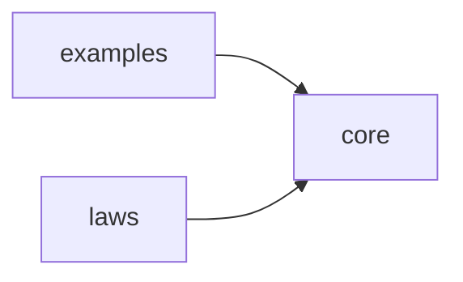
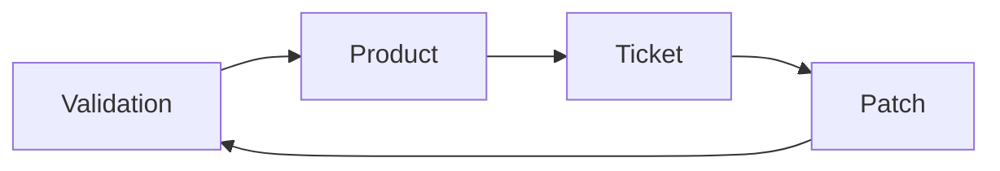
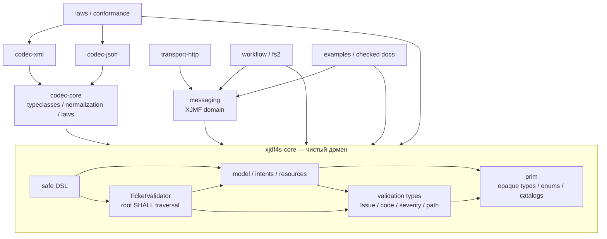
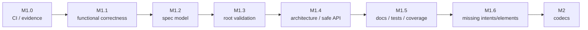

# NEXT — консолидированный план стабилизации и развития xjdf4s

> **Назначение:** единый исполнимый план следующих работ над `xjdf4s`: от
> текущего прототипа M0 до проверенного доменного ядра M1, кодеков, XJMF,
> workflow и публикации.
>
> **Дата консолидации:** 2026-08-15<br>
> **Базовый срез репозитория:** `c1ae995af20d775a76515b9a1d611bf880eccf1f`<br>
> **Технологический baseline:** Scala 3.8.4, Cats 2.13.0, sbt 2.0.2; целевая
> JVM для CI — Temurin JDK 21.<br>
> **Статус:** план, а не отчёт о выполнении. Наличие пункта ниже не означает,
> что он уже реализован. Статус меняется только после прохождения указанных
> критериев приёмки.
>
> Документ консолидирует все перечисленные в [приложении A](#приложение-a-источники-консолидации)
> обзоры, предложения, планы, дорожные карты и отчёты о зависимостях. При
> противоречии между ними здесь зафиксировано одно итоговое решение.

---

## Содержание

1. [Контракт документа](#1-контракт-документа)
2. [Цель, границы и критерий успеха](#2-цель-границы-и-критерий-успеха)
3. [Исходное состояние и архитектурный baseline](#3-исходное-состояние-и-архитектурный-baseline)
4. [Консолидированный реестр находок](#4-консолидированный-реестр-находок)
5. [Принципы реализации](#5-принципы-реализации)
6. [Целевая архитектура](#6-целевая-архитектура)
7. [Очередь архитектурных решений](#7-очередь-архитектурных-решений)
8. [M1 — стабилизация доменного ядра](#8-m1--стабилизация-доменного-ядра)
9. [Нарезка M1 на pull request](#9-нарезка-m1-на-pull-request)
10. [M2 — XML/JSON-кодеки](#10-m2--xmljson-кодеки)
11. [M3 — полный каталог ресурсов](#11-m3--полный-каталог-ресурсов)
12. [M4 — XJMF и транспорт](#12-m4--xjmf-и-транспорт)
13. [M5 — workflow и потоковая обработка](#13-m5--workflow-и-потоковая-обработка)
14. [M6 — публикация и эксплуатационная готовность](#14-m6--публикация-и-эксплуатационная-готовность)
15. [Стратегия тестирования](#15-стратегия-тестирования)
16. [Процесс разработки и Definition of Done](#16-процесс-разработки-и-definition-of-done)
17. [Риски и меры снижения](#17-риски-и-меры-снижения)
18. [Краткий следующий шаг](#18-краткий-следующий-шаг)
19. [Приложения](#приложение-a-источники-консолидации)

---

## 1. Контракт документа

### 1.1. Роль `NEXT.md`

`NEXT.md` — рабочий источник порядка исполнения. Исходные `REVIEW-*` фиксируют
наблюдения аудиторов, `PROPOSAL-*` — варианты решений, `PLAN-*` — промежуточные
консолидации, а `ROADMAP-*` — долгосрочные варианты. Они сохраняют ценность как
журнал решений, но не должны использоваться как независимые backlog-и.

Если исходный документ расходится с `NEXT.md`, исполнитель:

1. проверяет нормативный текст XJDF;
2. проверяет актуальный код и воспроизводимый тест;
3. при необходимости создаёт ADR;
4. обновляет `NEXT.md`, а не ведёт параллельный план в PR-описании.

### 1.2. Приоритет источников истины

При расхождении сведений действует следующий порядок:

1. нормативный текст XJDF 2.2 в `reference/xjdf/*`;
2. release notes XJDF 2.1/2.2;
3. `reference/xjdf/schema.xsd` как структурный oracle для имён,
   кардинальностей и XSD-типов;
4. нормативные примеры XJDF;
5. воспроизводимые compile-, regression- и conformance-тесты;
6. актуальный исходный код;
7. этот план;
8. исторические обзоры и предложения.

Если prose и XSD расходятся, выбор нельзя делать молча: нужен ADR с цитатами и
минимальным fixture.

### 1.3. Статусы

| Маркер | Значение |
|---|---|
| `[ ]` | не начато либо не подтверждено |
| `[~]` | частично реализовано, но критерии приёмки не пройдены |
| `[x]` | подтверждено обязательным CI и тестами |
| `BLOCKED` | есть явно указанная внешняя зависимость/решение |
| `REJECTED` | предложение рассмотрено и сознательно не принято |

Пункт нельзя отметить `[x]` только потому, что «код выглядит правильным».
Нужны тест, документация и зелёный gate.

### 1.4. Идентификаторы

- `F-*` — функциональный дефект;
- `S-*` — несоответствие спецификации;
- `V-*` — валидация;
- `A-*` — архитектура/API;
- `D-*` — документация;
- `E-*` — инженерия/процесс;
- `Q-*` — спорная или уточнённая находка;
- `ADR-*` — решение, которое должно быть зафиксировано отдельно.

---

## 2. Цель, границы и критерий успеха

### 2.1. Цель проекта

`xjdf4s` должен предоставлять декларативную, типобезопасную и проверяемую
законами модель **XJDF 2.2**, в которой:

- непроверенные внешние данные не становятся валидным доменным значением без
  явного safe/unsafe-перехода;
- ошибки домена накапливаются, имеют machine-readable code, severity и точную
  XPath-локализацию;
- закрытые перечисления спецификации отделены от открытых каталогов токенов;
- типы, wire-токены и кардинальности трассируются до нормативных таблиц;
- Cats-инстанс существует только при понятной доменной семантике и law-tests;
- XML и JSON — два представления одной нормализованной модели;
- чистое ядро не зависит от XML/JSON-библиотек, сети, файловой системы, HTTP и
  конкретного runtime эффектов;
- расширения и foreign namespaces не теряются молча.

Целевой пользовательский поток:

```text
Controller строит/декодирует XJDF
  → TicketValidator накапливает нарушения
  → XML/JSON round-trip без потери доменной информации
  → Device выполняет работу и формирует Audit/XJMF
  → ChangeOrder компилируется в проверяемый Patch
  → результат повторно валидируется
  → весь сценарий воспроизводится fixtures и законами
```

### 2.2. Ближайший результат

Ближайшая цель — **M1, codec-ready domain core**. После M1 публичную доменную
модель можно безопасно использовать как основу M2. До этого кодеки не должны
цементировать известные ошибки типов, кардинальностей и ID scope.

M1 успешен только одновременно по четырём измерениям:

1. **Воспроизводимость:** чистая сборка, тесты, examples и форматирование
   проходят в CI.
2. **Конформность:** реализованные типы и SHALL-правила соответствуют XJDF 2.2.
3. **Архитектура:** нет циклических файловых зависимостей, скрытых исключений и
   декоративных публичных типов.
4. **Трассируемость:** coverage registry, нормативные ссылки и исполняемые
   примеры отражают фактическое покрытие.

### 2.3. Не-цели M1

До закрытия M1 не добавляются:

- production XML/JSON-кодеки;
- сетевой транспорт;
- XJMF;
- полный каталог главы 6;
- fs2 workflow;
- production-кодогенерация напрямую из XSD;
- обещание бинарной совместимости публичного API.

Допускаются только подготовительные abstractions, необходимые для устранения
M1-дефектов и не создающие обратную зависимость `core → codecs/transport`.

---

## 3. Исходное состояние и архитектурный baseline

### 3.1. Модули

```text
modules/core      — prim, model, intents, resources, DSL и root validator
modules/laws      — munit/ScalaCheck, алгебраические и доменные законы
modules/examples  — исполняемые примеры XJDF
```

Граф модулей корректно направлен:



`core` не зависит от `laws` и `examples`; межмодульного цикла нет.

### 3.2. Что уже является хорошим фундаментом

Не требуется переписывать проект с нуля. Сохраняются и развиваются:

- opaque types с safe factories и явными `unsafe`-конструкторами;
- Scala 3 enums, union types, named tuples и match types там, где они реально
  выражают XJDF;
- `Chain`/`NonEmptyChain` как носители `*`/`+`-кардинальности;
- накопительная валидация через `ValidatedNec`;
- `Fix[ProductTree]` и catamorphism для BOM;
- `Patch` как композиция изменений;
- `FunctionK`/Alignment, `State`, `Ior`, Cats typeclasses;
- разделение закрытых enums и открытых token catalogs как общий принцип;
- вертикальная организация intent/resource payload.

Текущий M0 следует считать **функциональным прототипом**, а не завершённым
релизом.

### 3.3. Метрики графа зависимостей

Статический отчёт `review/DEPENDENCY-REPORT.md` зафиксировал baseline:

| Метрика | Значение |
|---|---:|
| Файлы/узлы | 43 |
| Файловые зависимости/рёбра | 232 |
| Модули | 3 |
| Циклы | 1 |
| Средний Fan-In / Fan-Out | 5.4 / 5.4 |
| Изолированные файлы | 0 |
| Максимальный Fan-In | 36 (`prim.Tokens`) |
| Максимальный Fan-Out | 19 (`dsl.XjdfDsl`, `examples.SpecExamples`) |
| Максимальная betweenness | 161.6 (`resources.AllResources`) |

Положительные сигналы отчёта: межмодульные зависимости направлены только
`examples/laws → core`, файлов с Fan-Out `> 25` нет, изолированных узлов нет и
нарушений принципа стабильных зависимостей не обнаружено.

Эти числа — baseline, а не вечная характеристика. После M1.4 отчёт должен быть
перегенерирован тем же алгоритмом.

### 3.4. Архитектурные hotspots

| Файл | Fan-In | Fan-Out | Betweenness | Практический вывод |
|---|---:|---:|---:|---|
| `resources.AllResources` | 5 | 13 | 161.6 | нельзя превращать M3 в один постоянно растущий центральный enum без ADR |
| `model.Resource` | 11 | 9 | 135.1 | изменения `specific`, references и validation требуют широких regression tests |
| `intents.AllIntents` | 3 | 6 | 45.9 | новые intents добавлять вертикальными срезами, контролировать dispatch |
| `model.Validation` | 6 | 11 | 42.1 | отделить validation types от root traversal |
| `model.Ticket` | 7 | 11 | 30.8 | не добавлять codec-only детали и Patch implementation в root model |
| `model.Product` | 7 | 5 | 20.9 | BOM-изменения защищать cycle/DAG/deep-tree tests |
| `model.Header` | 3 | 7 | 20.6 | явно разделить document и message ID scopes |
| `prim.Tokens` | 36 | 0 | 0 | это стабильный фундамент; breaking changes требуют migration plan |
| `prim.Enums` | 24 | 2 | 6.3 | точные wire-token goldens обязательны |
| `prim.Common` | 14 | 4 | 14.7 | разгрузить от непримитивных elements отдельным механическим PR |

Дополнительный сигнал: `model.IdSource` имеет Fan-In `0`, Fan-Out `1` и является
листом верхнего уровня — публичная возможность объявлена, но не используется.

### 3.5. Цикл внутри `core`



Цикл `Validation → Product → Ticket → Patch → Validation` нарушает Acyclic
Dependencies Principle и затрудняет расширение validator/codecs. Разрыв цикла
— обязательный M1 gate, а не косметический рефакторинг.

### 3.6. Ограничение текущей проверки

При подготовке этого документа в окружении отсутствовали `java`, `sbt`,
`scala` и `scalafmt`; сборка не запускалась. Поэтому compile-findings из
источников разделены на подтверждённые кодом и требующие первого CI-прогона.
Исторический `build.log` не является источником истины и в текущем индексе
отсутствует; `*.log` уже исключён `.gitignore`.

---

## 4. Консолидированный реестр находок

### 4.1. Подтверждённые функциональные дефекты

| ID | Находка | Последствие | Этап |
|---|---|---|---|
| `F-01` | `Bom.toTree` добавляет ID ребёнка в `seen` до входа в ребёнка | валидная ссылка определяется как цикл | M1.1 |
| `F-02` | `Patch.mergeResourceSets` добавляет update после old вместо замещения | старый ресурс выигрывает first-match; результат нарушает §3.4 | M1.1 |
| `F-03` | README вызывает `.flatMap` на `ValidatedNec` | главный пример не компилируется | M1.0 |
| `F-04` | BOM integrity не входит в `TicketValidator` | cycle/unresolved ref проходит root validation | M1.3 |

### 4.2. Подтверждённые расхождения со спецификацией

| ID | Находка | Нормативный ориентир | Этап |
|---|---|---|---|
| `S-01` | `Part.productPart: IdRef` вместо `NmToken` | Table 6.4 | M1.2 |
| `S-02` | `Part.metadata: NmToken` вместо `regExp` | Table 6.4 | M1.2 |
| `S-03` | нет `Sides.Unprinted` | Table A.40 | M1.2 |
| `S-04` | нет `DeviceStatus.Cleanup` и `Setup` | Table A.15 | M1.2 |
| `S-05` | `HardCoverJacket.Glued` даёт `Glued`, нужен `Glue` | Table 4.11 | M1.2 |
| `S-06` | `NamedColor` закрыт, источник значений открыт | Appendix A.2.30 / Color Names | M1.2 |
| `S-07` | `PartAmount` содержит один `Part`, нужен `Part*` | Tables 6.3–6.5 | M1.2 |
| `S-08` | `Resource.specific` обязателен, хотя допустим `<Resource/>` | Table 6.1, Example 3.6 | M1.2 |
| `S-09` | `DropItem` не содержит total dimensions/volume/weight | Table 6.55 | M1.2 |
| `S-10` | `Notification` не содержит `ModuleID` и правила Milestone ⇒ Event | Table 8.49 | M1.2/M1.3 |
| `S-11` | `Header/@ID` ошибочно смешан с document ID scope | Table 7.3, §2.2.3 | M1.2/M1.3 |
| `S-12` | `OptionKey` может печататься как wire-имя `OptionKey` | Table 6.4 (`Option`) | M1.2 |
| `S-13` | семь Scaladoc-ссылок путают section и table number | глава 6 | M1.2 |
| `S-14` | `XJDF.references` неполно обходит вложенные payload/audit resources | ID/IDREF rules | M1.3 |

Семь исправляемых ссылок: `Color` 6.27, `CuttingParams` 6.53,
`FoldingParams` 6.74, `Layout` 6.95, `Media` 6.114, `NodeInfo` 6.119,
`Preview` 6.134.

### 4.3. Подтверждённые пробелы валидации

| ID | Находка | Требуемый результат | Этап |
|---|---|---|---|
| `V-01` | ResourceSet сравнивается по exact key | pairwise `common or no CPI entries` predicate по §3.4 | M1.1/M1.3 |
| `V-02` | PartAmount проверяет parent только при одном `Part` | обход всех parent parts | M1.3 |
| `V-03` | вторая половина §6.1.2.1 не проверяется | повторённое значение key должно совпадать с одним parent value | M1.3 |
| `V-04` | локальные `isLawful` не подключены к root validator | единая шина структурированных local rules | M1.3 |
| `V-05` | errors и warnings не имеют ясной итоговой политики | `ValidationReport(errors, warnings)` и ADR severity | M1.3 |
| `V-06` | дубликат `Product Product` в `@Types` не имеет зафиксированной политики | решение по §3.1.3 + тест | M1.3 |
| `V-07` | не проверяется уникальность `Comment/@Language` в релевантном контейнере | правило Table 8.49-контекста | M1.3 |
| `V-08` | не проверяется parity `Product/@PartVersion` root/child | глобальное правило Table 3.11 | M1.3 |

Минимальный список локальных правил, которые должен вызывать root traversal:

- `Intent/@Name == payload.elementName`;
- BindingIntent details ↔ BindingType;
- VariableIntent bounds (`min <= average <= max`);
- Disposition mutually exclusive fields;
- PartWaste: присутствует `ModuleIDs` или `WasteDetails`;
- Resource child/name/status/usage rules;
- Notification/Milestone;
- amount bounds;
- chronology AuditPool;
- CombinedProcessIndex bounds;
- BOM acyclicity и разрешимость ChildRefs;
- document-scoped ID uniqueness и IDREF resolvability;
- required/cardinality rules, не выраженные типом.

### 4.4. Подтверждённые архитектурные и API-проблемы

| ID | Находка | Решение/этап |
|---|---|---|
| `A-01` | `ChangeOrder = XJDF & Partial`, а `XJDF extends Partial` | отдельная partial-модель → validated Patch; M1.4 |
| `A-02` | цикл из четырёх model-файлов | отделить validation types и root validator; M1.4 |
| `A-03` | `PartBuilder.set` бросает скрытый `IllegalArgumentException` | safe `Either`, explicit unsafe variant; M1.4 |
| `A-04` | `TicketDraft.withJobPart/withProject` молча теряют invalid input | проверенные типы или `ValidatedNec`; M1.4 |
| `A-05` | `IdSource`/`IdAllocator` — неиспользуемый публичный API | интегрировать с доказуемой семантикой либо удалить до M5; M1.4 |
| `A-06` | `AmountRange.meet/join` законны формально, но семантика и docs расходятся | ADR, разделение bounds/nominal; M1.4 |
| `A-07` | `Bom.cata`/unfold не гарантируют stack-safety | `Eval.defer`/итеративный обход и deep test; M1.4 |
| `A-08` | непримитивные elements лежат в `prim/Common.scala` | механический перенос в `model/elements`; M1.4 |
| `A-09` | `AllResources` уже главный bottleneck до M3 | ADR scalable payload dispatch/registry; до M3 |
| `A-10` | generators покрывают малую часть 27 PartitionKey | генератор каждого key/tag и law family; M1.2/M1.5 |

### 4.5. Подтверждённые проблемы документации и процесса

| ID | Находка | Этап |
|---|---|---|
| `D-01` | `Part.matches` назван preorder/тонкой категорией | tolerance relation + counterexample; M1.5 |
| `D-02` | `NonEmptyChain` назван свободным моноидом | free semigroup; M1.5 |
| `D-03` | Intent ↔ Resource назван доказанным adjunction | пометить инженерной эвристикой; M1.5 |
| `D-04` | `docs/03` неверно описывает `Validated.andThen` | исправить и compile-test; M1.0/M1.5 |
| `D-05` | есть битые локальные/category-theory ссылки | link check; M1.0/M1.5 |
| `D-06` | `docs/04` не отражает edge `resources → intents` | обновить фактическую диаграмму; M1.5 |
| `D-07` | `XjdfVersion` docs не объясняет 2.2-only domain | добавить Table 3.1/A.52 rationale; M1.5 |
| `E-01` | обязательного CI нет | M1.0 первым изменением |
| `E-02` | `.scalafmt.conf` есть, sbt-плагина/gate нет | добавить `sbt-scalafmt`; M1.0 |
| `E-03` | нет автоматического spec coverage registry | `docs/SPEC-COVERAGE.md` + checker; M1.2/M1.5 |
| `E-04` | нет выбранной владельцем лицензии | решить до публикации, желательно до конца M1 |

### 4.6. Разрешённые противоречия и отклонённые предложения

#### `Q-01`: локальный `Monoid[ValidatedNec[Issue, Unit]]`

**Итог: не добавлять превентивно.** Cats предоставляет `Monoid[Validated[E,A]]`
при `Semigroup[E]` и `Monoid[A]`; для `NonEmptyChain[Issue]` и `Unit` эти
условия должны выполняться. Добавить compile-test:

```scala
summon[Monoid[ValidatedNec[Issue, Unit]]]
```

Только если он реально не компилируется на зафиксированных версиях, сначала
сохранить минимальный reproducer, затем выбрать локальный fold/instance. Нельзя
вводить потенциально конфликтующий given по одному статическому предположению.

#### `Q-02`: нисходящий `IntegerRange`

**Итог: алгоритм вслепую не переписывать.** Текущий код имеет нисходящую ветку,
а тест `-1 0` уже существует. Нужно запустить его, переименовать misleading
`lo`/`hi` в `clampedFrom`/`clampedTo` и добавить boundary cases (`5 2`, пустой
input, out-of-range, single element). Исправление допустимо только после
падающего regression test.

#### `Q-03`: `build.log`

**Итог: текущий дефект отсутствует.** Файл не отслеживается, `*.log` находится
в `.gitignore`. Логи должны быть CI artifacts. Историческое красное содержимое
не доказывает состояние текущего кода.

#### `Q-04`: `XJDF/@Name`

**Итог: не добавлять общее доменное поле в M1.** Table 3.1 задаёт `Name="XJDF"`
как обязательный JSON discriminator и запрещает его для XML. JSON encoder M2
синтезирует `Name`, decoder валидирует и удаляет его при нормализации. Иное
решение требует ADR codec normalization.

#### `Q-05`: `Group[Matrix]`

**Итог: не объявлять тотальный `Group[Matrix]`.** Вырожденная матрица не имеет
обратной. Оставить `Monoid[Matrix]` + `inverse: Option[Matrix]`; при реальной
необходимости ввести проверенный `InvertibleMatrix` с честным `Group`.

#### `Q-06`: golden через `Show`

`Show` — debug output, не wire serialization. До M2 допустимы golden-tests
структуры/примеров, но нельзя объявлять их каноническим XML/JSON. В M2 goldens
переносятся на реальные codecs.

---

## 5. Принципы реализации

1. **Specification first.** В PR указываются section/table и нормативная цитата.
2. **Regression test first.** Подтверждённый баг сначала воспроизводится тестом.
3. **Parse at the boundary.** Локальные ограничения простого типа проверяются
   factory/decoder; межобъектные — root validator.
4. **Safe by default.** Обычный API не бросает исключения; бросающий путь явно
   содержит `unsafe`.
5. **Законы и смысл.** Прохождение associativity/identity не доказывает
   правильность доменной интерпретации операции.
6. **Wire ≠ domain.** Namespace prefixes, JSON `Name`, ordering и defaults не
   протекают в `core` без необходимости.
7. **Open ≠ closed.** «Allowed values are ...» обычно closed enum; внешний или
   расширяемый каталог — validated token + `Catalog`.
8. **Каждое SHALL — negative test.** SHOULD/MAY не превращаются в error без
   явной policy.
9. **Один predicate — несколько потребителей.** Например, ResourceSet conflict
   одинаков для validator и Patch.
10. **Малые vertical slices.** Новый payload включает model, references,
    validation, tests, coverage и позже codecs.
11. **Нет generated artifacts в Git.** Targets/logs/cache остаются вне индекса.
12. **Не менять стек без причины.** Обновление Scala/Cats/sbt — отдельный PR с
    compatibility evidence.

---

## 6. Целевая архитектура

### 6.1. Направление зависимостей M1–M4



Стрелка означает «зависит от». Запрещены зависимости `core → codec`,
`core → messaging`, `core → transport` и `messaging → transport`.

### 6.2. Слои внутри `core`

| Слой | Содержимое | Не должен знать о |
|---|---|---|
| `prim` | scalar opaque types, closed enums, open catalogs | XJDF aggregate, XML/JSON, HTTP |
| `model` | XJDF aggregates и локальные инварианты | parser backend, network, filesystem |
| `validation` | Issue, severity, path, DomainRule, root traversal | transport/runtime effects |
| `dsl` | safe domain authoring | namespace prefixes, wire ordering |

`Comment`, `GeneralID`, `Event`, `Milestone`, `Dependent`, `FileSpec`,
`Disposition` и другие elements глав 3/8 должны постепенно покинуть
`prim/Common.scala`. Перенос выполняется отдельно от изменения поведения.

### 6.3. Целевая форма validation

```scala
trait DomainRule[-A]:
  def check(value: A, at: XPath): Chain[Issue]

final case class ValidationReport(
  errors: Chain[Issue],
  warnings: Chain[Issue]
)

type ValidationResult[A] = ValidatedNec[Issue, A]
```

Требования:

- `Issue` имеет стабильный code, severity, XPath и message;
- local rule не возвращает только `Boolean`;
- root validator обходит весь aggregate и ничего не вызывает вручную «по
  памяти» без registry/composition;
- SHALL errors инвалидируют результат;
- SHOULD/MAY warnings сохраняются, но не теряются и не становятся errors по
  умолчанию.

### 6.4. Архитектурные budgets

После каждого крупного M1/M3-рефакторинга проверять:

- циклов файловых зависимостей: `0`;
- `prim` не зависит от domain layers;
- новые codec/transport modules не импортируются из `core`;
- рост betweenness `AllResources`/`Resource` не принимается без ADR;
- новый central dispatch не требует правки десятков несвязанных файлов;
- high Fan-In foundation (`Tokens`, `Ids`, `Quantity`, `Enums`) меняется только
  с migration note и широкими tests.

---

## 7. Очередь архитектурных решений

| ADR | Решение | Дедлайн | Рекомендация |
|---|---|---|---|
| `ADR-0001` | ChangeOrder document, relaxed cardinality, Patch/application | до M1.4-2 | отдельный nominal partial type; compile → Patch → validate |
| `ADR-0002` | validation layers и разрыв cycle | до M1.4-1 | stable validation types отдельно, root traversal снаружи domain nodes |
| `ADR-0003` | closed enums vs open catalogs | до NamedColor/M3 | token + Catalog для открытых списков |
| `ADR-0004` | AmountRange ordering, meet/join/widen | до M1.4-5 | bounds отдельно от nominal amount; partial conflicts explicit |
| `ADR-0005` | XML/JSON normalization, defaults, foreign extensions | до M2 API freeze | round-trip через normalize/canonicalize; unknown не терять |
| `ADR-0006` | severity policy | до M1.3-4 | errors и warnings в отдельном report |
| `ADR-0007` | scalable `ResourcePayload` dispatch | до массового M3 | сравнить central enum, family hierarchy, registry/typeclass |
| `ADR-0008` | lifecycle `IdAllocator` | до M1.4-4 | pure `State` integration или удалить до M5 |
| `ADR-0009` | codec parser/backend choices | до M2 implementation | total atomic parser; backend не протекает в codec-core |

Каждый ADR содержит Context, Decision, Alternatives, Consequences, normative
references и migration impact. «Решить позже» допустимо только с дедлайном и
без фиксации спорного API до решения.

---

## 8. M1 — стабилизация доменного ядра

### 8.0. Порядок фаз



Это порядок зависимостей, а не календарная оценка. Независимые PR внутри фазы
могут идти параллельно после зелёного M1.0.

### M1.0 — воспроизводимая сборка и быстрые исправления

#### M1.0-1. Обязательный CI (`E-01`, `E-02`)

**Задача**

- [ ] создать `.github/workflows/ci.yml` для любого pull request и push рабочей
  ветки;
- [ ] установить Temurin JDK 21 и sbt;
- [ ] кэшировать Coursier/Ivy/sbt безопасным стандартным способом;
- [ ] добавить `project/plugins.sbt` с совместимым `sbt-scalafmt`;
- [ ] выполнять один воспроизводимый gate:

```bash
sbt -batch clean scalafmtCheckAll compile test examples/run
```

Пока plugin ещё не добавлен, первый диагностический запуск допускается без
`scalafmtCheckAll`, но финальный M1.0 gate обязан включать его.

**Проверки**

- все три модуля компилируются;
- четыре существующих test suites действительно запускаются;
- examples заканчиваются с exit code 0;
- нет warnings `-Wunused:all`, `-Wvalue-discard`, `-Wnonunit-statement`;
- логи доступны как CI output/artifact и не коммитятся.

**Не делать**

- не добавлять `-Werror` до очистки baseline;
- не ограничивать workflow только `main/develop` так, чтобы feature PR не
  проверялись;
- не лечить compile error speculative implicit-ами до минимального reproducer.

#### M1.0-2. Исполняемая документация (`F-03`, `D-04`, `D-05`)

- [ ] README: `.flatMap(_.build)` заменить на `.andThen(_.build)`;
- [ ] минимальный README example вынести в compile/runtime test;
- [ ] исправить `docs/02` → `03-cats-mapping.md`;
- [ ] исправить category-theory link на Part 3;
- [ ] пояснить: у `Validated` нет lawful monadic `flatMap`, но есть
  последовательный `andThen`;
- [ ] каждый неисполняемый snippet явно отметить `pseudocode`.

#### M1.0-3. Закрыть спорные compile-findings (`Q-01`, `Q-02`)

Добавить тесты/compile checks для:

```scala
summon[Monoid[ValidatedNec[Issue, Unit]]]
IntegerRange(-1, 0).indices(size)
```

Проверить также `IntegerRange(5, 2)`, direct range, negative indexes,
out-of-bounds, size `0` и one-element input. Локальные переменные назвать по
семантике (`clampedFrom`, `clampedTo`).

**Критерий:** задача закрыта результатом тестов; ни custom Monoid, ни перепись
range algorithm не добавлены без доказательства необходимости.

#### M1.0-4. Гигиена репозитория и лицензия (`Q-03`, `E-04`)

- [ ] подтвердить `git ls-files '*.log'` → пусто;
- [ ] не хранить target/cache/generated dependency reports без необходимости;
- [ ] выбрать лицензию с владельцем репозитория; Apache-2.0 — рекомендация, не
  решение от имени владельца;
- [ ] до принятия лицензии публикация M6 остаётся `BLOCKED`.

**DoD M1.0**

- чистый CI зелёный;
- README example проверяется кодом;
- спорные compile-findings имеют воспроизводимый вердикт;
- в Git нет build logs;
- дальнейшие PR получают быстрый обязательный feedback.

---

### M1.1 — критическая функциональная корректность

#### M1.1-1. Исправить BOM unfold (`F-01`)

**Файл:** `modules/core/src/main/scala/xjdf4s/model/Product.scala`.

Path-local алгоритм:

1. при входе проверить ID **текущего** узла в `seen`;
2. сформировать `nextSeen = seen + currentId`;
3. передать один `nextSeen` каждому ребёнку;
4. не считать повторное использование поддерева в другой ветке циклом;
5. unresolved ref вернуть как структурированный `Issue`, а не exception.

Эскиз:

```scala
currentId match
  case Some(id) if seen.contains(id) => Left(cycleIssue(id))
  case _ =>
    val nextSeen = currentId.fold(seen)(seen + _)
    // recurse into every child with nextSeen
```

**Обязательные тесты**

- leaf без ID;
- валидное дерево глубины 2+;
- unresolved ChildRef;
- self-cycle;
- косвенный цикл `A → B → C → A`;
- DAG с общим ребёнком из независимых ветвей;
- notebook/spec example и `totalCopies`;
- duplicate Product ID обрабатывается root ID validation, а не маскируется
  unfold-алгоритмом.

#### M1.1-2. Единый ResourceSet conflict predicate (`F-02`, `V-01`)

Два ResourceSet конфликтуют, когда совпадают `Name`, `Usage`, `ProcessUsage` и:

- хотя бы с одной стороны нет `CombinedProcessIndex`; либо
- множества CPI пересекаются.

Создать один чистый helper/domain rule, используемый одновременно:

- `TicketValidator`;
- `Patch.mergeResourceSets`/ChangeOrder application;
- тестами конфликтов.

Нельзя иметь две похожие реализации с разной семантикой.

#### M1.1-3. Исправить Patch replacement (`F-02`)

Update должен удалять конфликтующие old sets и добавлять replacement, сохраняя
детерминированный порядок. Отдельно проверить внутренние конфликты update.
Целевой смысл результата:

- success без warning — замен не было;
- success + warnings — old values заменены;
- invalid — update сам неоднозначен/противоречив.

Конкретный carrier (`Ior`, `Validated` + report или иной) согласовать с
validation ADR; документация должна совпадать с реально достижимыми branches.

**Обязательные тесты**

- no conflict;
- exact key;
- partial CPI overlap;
- `None` vs `Some(CPI)`;
- disjoint CPI;
- несколько replacements;
- duplicate внутри update;
- old first-match больше не выигрывает;
- выбранная политика повторного применения детерминирована.

#### M1.1-4. IntegerRange: clarity, не speculative fix (`Q-02`)

После зелёного regression suite выполнить только безопасное переименование и
документацию. Если тест падает, исправление ограничить установленной семантикой
§1.10.2 и сохранить отдельный regression case.

**DoD M1.1**

- все BOM cases зелёные;
- spec examples больше не печатают false cycle;
- Patch не создаёт запрещённые ResourceSet duplicates;
- validator и Patch используют один conflict predicate;
- нисходящий IntegerRange подтверждён тестом.

---

### M1.2 — типы, токены и кардинальности XJDF 2.2

#### M1.2-1. Полная модель `Part` / Table 6.4 (`S-01`, `S-02`, `S-12`)

- [ ] `productPart: Option[NmToken]` вместо `Option[IdRef]`;
- [ ] `metadata: Option[RegExp]` вместо `Option[NmToken]`;
- [ ] создать checked opaque `RegExp` с `from` и явным `unsafe`;
- [ ] перед использованием Java `Pattern` доказать совместимость XJDF regExp;
  иначе проверять только нормативно подтверждённую грамматику;
- [ ] обновить `PartitionValue`, `ValueOf`, typed constructors, builder,
  arbitrary и examples;
- [ ] добавить `PartitionKey.attributeName`, где `OptionKey → "Option"`;
- [ ] удалить ProductPart из IDREF collection;
- [ ] сохранить отдельную semantic check его ссылки на Product, если этого
  требует prose, не выдавая NMTOKEN за XSD IDREF;
- [ ] машинно сверить все 27 keys с Table 6.4/schema.

Одно property-семейство для каждого key доказывает:

```text
keys.contains(k) == valueOf(k).isDefined
runtime value tag соответствует key
combine right-biased только по выбранному key
attributeName совпадает с XJDF
matches(b) == conflictingKeys(b).isEmpty
```

`Arbitraries` должен генерировать все 27 keys, а не малое удобное подмножество.

#### M1.2-2. Closed enums и open catalogs (`S-03`–`S-06`)

- [ ] `Sides += Unprinted`;
- [ ] `DeviceStatus += Cleanup, Setup`;
- [ ] отделить Scala case name от wire token `Glue`;
- [ ] сохранить специальные mappings вроде `Unjacketed → None` явно, а не
  через случайный `toString`;
- [ ] для каждого closed enum сравнивать точное golden set wire tokens;
- [ ] провести полный machine-assisted аудит Appendix A, особенно `New in
  XJDF 2.1/2.2`;
- [ ] преобразовать `NamedColor` в validated open token и вынести популярные
  значения в `Catalog.NamedColor`;
- [ ] создать централизованный registry намеренных Scala-name/wire-token
  различий.

#### M1.2-3. `PartAmount.parts: Chain[Part]` (`S-07`)

Целевая форма:

```scala
final case class PartAmount(
  amount: Option[Amount] = None,
  maxAmount: Option[Amount] = None,
  minAmount: Option[Amount] = None,
  waste: Option[Amount] = None,
  parts: Chain[Part] = Chain.empty,
  partWaste: Chain[PartWaste] = Chain.empty
)
```

Миграция включает DSL, examples, arbitrary, debug `Show`, validator и все
construction sites. Временный `part: Option[Part]` допустим только как
`@deprecated` compatibility accessor с удалением до public release.

#### M1.2-4. Bodyless Resource (`S-08`)

```scala
specific: Option[ResourcePayload] = None
```

Обязательные следствия:

- `elementName: Option[NmToken]`;
- references для `None` пусты;
- local child law допускает bodyless Resource;
- имя из ResourceSet не заставляет создавать fake payload;
- DSL имеет `Resource.empty`/`Resource.withPayload`, не `null`;
- Example 3.6 моделируется буквально;
- будущий XML codec сохраняет `<Resource/>`.

Из-за высокой centrality `model.Resource` изменение выполняется compiler-driven
с полным прогоном laws/examples.

#### M1.2-5. Поля и scopes (`S-09`–`S-11`, `S-14`)

- [ ] `DropItem`: `totalDimensions`, `totalVolume`, `totalWeight` с точными
  типами Table 6.55;
- [ ] `Notification.moduleId: Option[NmToken]`;
- [ ] local rule Milestone ⇒ class Event;
- [ ] исключить `Header/@ID` из document ID scope;
- [ ] в M4 ввести отдельный message/sender scope;
- [ ] собрать references из AuditResource/ResourceInfo и всех реализованных
  nested payload;
- [ ] проверить полный aggregate traversal `declaredIds/references`;
- [ ] не добавлять `XJDF.name` в domain (`Q-04`).

#### M1.2-6. Scaladoc и coverage registry (`S-13`, `E-03`)

Исправить семь известных ссылок и принять формат:

```text
§6.x / Table 6.N — ElementName
```

Создать `docs/SPEC-COVERAGE.md`:

```text
Section | Table | Element/Attribute | Scala type | Cardinality |
Validation | Domain tests | XML | JSON | Status | Notes
```

Checker должен находить:

- ссылку на несуществующую таблицу;
- domain type без нормативной ссылки;
- несогласованную cardinality;
- реализованное поле без validation/test status;
- потерянную version note.

**DoD M1.2**

- Table 6.4 отображена полностью и согласованно;
- enum token goldens совпадают с нормативными наборами;
- PartAmount и bodyless Resource выражают спецификационные кардинальности;
- scopes и новые fields покрыты tests;
- coverage registry создан и проверяем.

---

### M1.3 — полный root validator

#### M1.3-1. Структурированные local rules (`V-04`)

Заменить/обернуть boolean `isLawful` в composable `DomainRule`. Каждый rule
возвращает code, severity, XPath и message. Root traversal вызывает все rules
по структуре aggregate.

Минимальная проверка полноты: registry/test перечисляет все типы с local rules
и доказывает, что у каждого есть root invocation. Grep по приватным
`isLawful` не должен находить «мёртвые законы».

#### M1.3-2. ResourceSet uniqueness (`V-01`)

- сравнивать все пары, а не `groupBy(_.key)`;
- использовать helper из M1.1;
- выдавать стабильный issue code и paths обоих конфликтующих sets;
- проверить exact, overlap, missing CPI и disjoint cases.

#### M1.3-3. Полный §6.1.2.1 (`V-02`, `V-03`)

Для каждого parent `Resource/Part` и каждого `PartAmount.parts`:

1. key, однозначно заданный parent context, не дублируется без необходимости;
2. если child повторяет parent key, child value совпадает минимум с одним
   допустимым parent value;
3. multiple parent parts не отключают проверку;
4. issue использует `PartitionKey.attributeName`, поэтому пишет `@Option`, а
   не `@OptionKey`.

#### M1.3-4. Aggregate integrity (`F-04`, `S-14`, `V-06`–`V-08`)

- [ ] включить `Bom.fromProductList`/эквивалентную integrity rule;
- [ ] проверить duplicate Product IDs отдельно от cycle detection;
- [ ] завершить ID/IDREF traversal;
- [ ] решить `Product Product` в `@Types`; рекомендуемая строгая политика:
  `Product` не допускается при `types.size > 1`, включая duplicate;
- [ ] проверить Comment language uniqueness там, где это требует table;
- [ ] проверить root/child Product PartVersion rule;
- [ ] проверить CombinedProcessIndex bounds и process context;
- [ ] проверить chronology AuditPool;
- [ ] проверить Resource usage/status и local payload rules.

Спорное правило не включается молча: нормативная интерпретация фиксируется в
коротком decision record и negative fixture.

#### M1.3-5. Errors vs warnings (`V-05`, `ADR-0006`)

- SHALL → error;
- SHOULD/MAY → warning, если проект сообщает о них;
- warning не делает `ValidationResult` Invalid по умолчанию;
- strict policy может эскалировать warning отдельно;
- callers не анализируют message strings.

**DoD M1.3**

- root validator обходит весь aggregate;
- все реализованные local laws подключены;
- каждый SHALL имеет negative test;
- BOM, IDREF, ResourceSet и PartAmount rules проверяются из одного публичного
  validation entry point;
- warnings не теряются и не смешиваются с errors.

---

### M1.4 — архитектура, алгебры и safe API

#### M1.4-1. Разорвать dependency cycle (`A-02`, `ADR-0002`)

Целевая файловая структура:

```text
validation/ValidationTypes.scala — Issue, IssueCode, Severity, XPath, result
model/Product.scala              — Product/BOM; только stable validation types
model/Ticket.scala               — XJDF; без Patch implementation
model/Patch.scala                — зависит от Ticket и stable validation types
validation/TicketValidator.scala — outer traversal по всей domain model
```

Не требуется искусственный trait только ради метрики. Зависимости должны
следовать ответственности. После рефакторинга:

- generator/report показывает `0` cycles;
- module graph остаётся прежним;
- public imports имеют migration aliases только при необходимости.

#### M1.4-2. Nominal ChangeOrder (`A-01`, `ADR-0001`)

Разделить три понятия:

1. **ChangeOrder document** — partial input из §1.3.2/§1.6.5;
2. **Patch** — нормализованная операция над XJDF;
3. **application result** — повторно валидируемый XJDF/report.

Рекомендуемый API-направление:

```scala
final case class ChangeOrder(/* only allowed relaxed fields */)

object ChangeOrder:
  def compile(change: ChangeOrder, base: XJDF): ValidatedNec[Issue, Patch]

def applyChange(
  base: XJDF,
  change: ChangeOrder
): ValidatedNec[Issue, XJDF]
```

Точный набор полей утверждается по normative text. Не принимаются как финал:

- `XJDF & Partial`, когда XJDF уже Partial;
- `opaque ChangeOrder = XJDF`, если он не выражает relaxed cardinality;
- применение без повторной root validation.

#### M1.4-3. Total builders (`A-03`, `A-04`)

- runtime `PartBuilder.withValue` → `Either[Issue, PartBuilder]`;
- throwing variant → `withValueUnsafe`;
- compile-time known key сохраняет typed API;
- `TicketDraft.withJobPart/withProject` принимает validated type либо
  возвращает `ValidatedNec`;
- invalid input не превращается молча в `None`.

#### M1.4-4. Судьба IdAllocator (`A-05`, `ADR-0008`)

Выбрать ровно один вариант:

1. интегрировать pure/scoped allocation в DSL и доказать uniqueness,
   determinism и explicit collision policy;
2. убрать неиспользуемый public API и вернуть его в M5.

Mutable allocator допустим только как local interpreter с явной
`not thread-safe` документацией. Рекомендуемый semantic core — `State`.

#### M1.4-5. AmountRange (`A-06`, `ADR-0004`)

Минимальные инварианты:

- `min <= max`;
- nominal amount согласован с bounds;
- intersection повышает lower и понижает upper bound;
- empty intersection возвращает conflict/error;
- разные nominal amounts не объединяются произвольным `min/max` без доменного
  основания.

Рекомендуется отделить `AmountBounds` от nominal amount. `join` удалить либо
переименовать в `widen` только после определения порядка и laws. Нельзя
сохранять красивое имя, если domain semantics не определена.

#### M1.4-6. Точность Cats instances (`Q-05`)

- `XYPair`, `Points`, `TimeSpan` → `CommutativeMonoid`, если операция доказанно
  коммутативна;
- `Matrix` → `Monoid` + partial inverse;
- `AuditPool`/`AmountPool`/другие `NonEmptyChain` carriers → `Semigroup`, не
  `Monoid`;
- `Order` только при осмысленном полном порядке;
- каждый instance имеет discipline или эквивалентные laws;
- доменный смысл операции проверяется отдельными properties.

Выбрать одну полноценную систему law testing: `cats-laws` +
`discipline-munit` либо текущие локальные suites. Не смешивать две половинчатые
системы.

#### M1.4-7. Stack-safe BOM (`A-07`)

После semantic fix M1.1:

- реализовать `cataEval`/`Eval.defer` или итеративный fold;
- сделать unfold stack-safe;
- проверить цепочку глубины не менее 10 000;
- отдельно benchmark позже, не подменяя correctness benchmark-ом;
- thin `cata` допустим, если его stack-safety гарантирована implementation.

#### M1.4-8. Разгрузить `prim.Common` (`A-08`)

Механически перенести domain elements глав 3/8 в `model/elements` или
эквивалентный пакет. Не совмещать с изменением полей/семантики. Проверить
imports, Scaladoc links и dependency graph.

**DoD M1.4**

- cycles = 0;
- ChangeOrder — реальный nominal partial type;
- safe APIs total;
- IdAllocator интегрирован или удалён;
- AmountRange semantics зафиксирована ADR и tests;
- algebra names соответствуют carriers;
- deep BOM не переполняет стек;
- `prim` содержит именно primitives.

---

### M1.5 — документация, тестовая инфраструктура и coverage

#### M1.5-1. Категориальная точность (`D-01`–`D-03`)

Обновить `docs/01-category-theory-view.md`:

- `Part.matches` — reflexive + symmetric tolerance/compatibility relation, не
  transitive preorder;
- добавить явный контрпример `{k=1} ~ {} ~ {k=2}`, но `{k=1} !~ {k=2}`;
- настоящий partial order обсуждать только через доказанное absorption/merge;
- `NonEmptyChain[A]` — free semigroup, `Chain[A]` — free monoid;
- Intent/Resource pairing — engineering analogy, пока нет functors,
  unit/counit и triangle identities;
- BOM — unfold graph references → initial algebra tree → cata;
- Matrix — monoid with partial inverse;
- каждое строгое CT-утверждение имеет law либо пометку «эвристика».

#### M1.5-2. Scala/Cats/architecture docs (`D-04`–`D-07`)

- `docs/02`: честно описать ChangeOrder и intersection types;
- `docs/03`: `andThen`, AmountRange semantics, free semigroup terminology;
- `docs/04`: фактический edge `resources → intents` и новая validation layer;
- `XjdfVersion`: пояснить отличие списка версий Table A.52 от 2.2-only
  root-domain constraint Table 3.1;
- не называть `Show` wire serialization;
- проверить все local/reference links.

#### M1.5-3. Tests и fixtures (`A-10`, `Q-06`)

- [ ] lawful и intentionally-invalid Arbitrary отдельно;
- [ ] генерация всех 27 PartitionKey;
- [ ] regression fixture для исторического overlay direction, без зависимости
  от устаревшего build log;
- [ ] spec examples как обычные tests, а не только runnable main;
- [ ] golden структурных examples до M2;
- [ ] в M2 заменить/дополнить каноническими XML/JSON goldens;
- [ ] coverage counter вычисляется автоматически, не хранится приблизительным
  числом в README.

#### M1.5-4. ADR и coverage discipline

Создать `docs/adr/` и `docs/SPEC-COVERAGE.md`. Любое deliberate deviation имеет
owner, rationale, normative source, test и срок пересмотра. Coverage status не
может быть только «есть case class».

**DoD M1.5**

- известные теоретические ошибки и broken links отсутствуют;
- docs snippets исполняемы либо явно pseudocode;
- generators достигают всех важных branches;
- examples проверяются tests;
- ADR/coverage обновляются CI/process gate.

---

### M1.6 — заявленные пробелы Product Intent и common elements

После стабилизации abstractions добавить малыми vertical slices отсутствующие
intent payload:

- `ContentCheckIntent` + `PreflightItem`, `ProofItem`, согласование `FileSpec`;
- `EmbossingIntent` + `EmbossingItem`;
- `HoleMakingIntent` + `HolePattern` и Appendix F;
- `LaminatingIntent`;
- `ShapeCuttingIntent` + `ShapeCut`, `CutBox`, `CutPath`/`PDFPath`.

Добавить необходимые common elements главы 8:

- `Certification` (§8.7, Table 8.8);
- `Crease` (§8.14, Table 8.17);
- `GangSource` (§8.22, Table 8.27);
- `Glue` (§8.24, Table 8.29);
- `HolePattern` (§8.25, Table 8.30);
- `IdentificationField` (§8.26, Table 8.31);
- `MISDetails` (§8.30, Table 8.48).

Дополнительно:

- `NodeInfo`: `GangSource*` и `MISDetails?` из Table 6.119;
- NamedFeatures §3.1.3.1;
- явно заданные Traits имеют приоритет над implied
  `GeneralID[@Datatype="NamedFeature"]`.

Шаблон одного vertical slice:

1. normative table mapping и version notes;
2. domain type/cardinality;
3. ID/reference traversal;
4. local/global rules;
5. safe constructor/DSL;
6. positive + negative + property test;
7. example/fixture;
8. coverage entry;
9. после M2 — XML/JSON codecs и round-trip.

### Definition of Done M1

M1 закрыт, когда одновременно:

1. `sbt -batch clean scalafmtCheckAll compile test examples/run` зелёный на JDK
   21 в обязательном CI.
2. Нет compiler warnings по текущим strict flags.
3. BOM проходит leaf/tree/DAG/unresolved/cycle/deep-tree tests.
4. ResourceSet conflict semantics едина для validator и Patch.
5. `ProductPart`, `Metadata`, enums, `PartAmount.parts` и bodyless Resource
   соответствуют нормативным таблицам.
6. Root validator вызывает все зарегистрированные local/global rules.
7. Errors/warnings и document/message ID scopes разделены.
8. ChangeOrder — nominal relaxed model, а application повторно валидируется.
9. Файловых dependency cycles нет.
10. Safe APIs не содержат скрытых exceptions или silent invalid-input drops.
11. Docs не содержат известных CT/Cats ошибок и broken links.
12. `docs/SPEC-COVERAGE.md` отражает фактическое покрытие.
13. Все M1 intent/element slices имеют domain tests и нормативные ссылки.
14. Решение по LICENSE зафиксировано владельцем либо M6 явно остаётся blocked.

---

## 9. Нарезка M1 на pull request

### 9.1. Рекомендуемая последовательность

| PR | Содержание | Зависит от | Главный gate |
|---:|---|---|---|
| 1 | CI, sbt-scalafmt, README/docs quick fixes, compile probes | — | clean CI green |
| 2 | BOM false-cycle fix + regression suite | PR 1 | tree/DAG/cycle green |
| 3 | ResourceSet conflict predicate + Patch replacement | PR 1 | §3.4 cases green |
| 4 | Part types, RegExp, attributeName, all-key laws | PR 1 | Table 6.4 green |
| 5 | enum/open catalog audit + token goldens | PR 1 | exact token sets |
| 6 | PartAmount cardinality + §6.1.2.1 | PR 4 | parent/child cases |
| 7 | bodyless Resource + DropItem/Notification/scopes | PR 3 | Example 3.6 + scope tests |
| 8 | DomainRule + complete TicketValidator traversal | PR 2, 6, 7 | all local laws wired |
| 9 | ValidationTypes/TicketValidator cycle refactor | PR 8 | dependency cycles = 0 |
| 10 | ChangeOrder ADR + nominal API | PR 3, 9 | compile/apply/revalidate |
| 11 | safe builders + IdAllocator decision + AmountRange ADR | PR 9 | no hidden exceptions |
| 12 | stack-safe BOM + algebra laws | PR 2, 11 | depth ≥ 10k |
| 13 | docs/ADR/coverage/generators/golden examples | PR 4–12 | docs/tests/coverage gate |
| 14+ | missing intents/elements, один vertical slice на PR | PR 13 | slice template complete |
| final | M1 acceptance audit и dependency report regeneration | все | весь M1 DoD |

PR 2 и 3, PR 4 и 5 могут идти параллельно после PR 1. Архитектурный refactor не
должен предшествовать regression tests: иначе semantic fix смешается с move.

### 9.2. Правила размера PR

- один semantic decision на PR;
- mechanical move отдельно от behavior change;
- breaking type change содержит migration note и полный список call sites;
- generated diff не смешивается с handwritten behavior;
- каждый PR обновляет `SPEC-COVERAGE`, если меняется spec mapping;
- каждый bugfix содержит regression test, видимый до fix;
- PR не закрывает пункт, если required CI job был skipped.

---

## 10. M2 — XML/JSON-кодеки

**Предусловие:** M1 полностью зелёный. Иначе M2 замораживает неправильный
wire-contract.

### M2.1. Модули и контракты

```text
modules/codec-core — Encoder/Decoder, errors, normalization, laws
modules/codec-xml  — XJDF XML 2.2
modules/codec-json — XJDF JSON mapping 2.2
```

```scala
trait Encoder[Format, -A]:
  def encode(value: A): Format

trait Decoder[Format, A]:
  def decode(input: Format): ValidatedNec[DecodeIssue, A]
```

`DecodeIssue` содержит code, format path, expected type, raw token и cause.
Независимые semantic errors накапливаются; невосстановимая syntax error может
быть fail-fast.

### M2.2. Нормализация (`ADR-0005`)

Определить до API freeze:

- defaults;
- отсутствующее vs явно заданный default;
- порядок attributes/children;
- namespace prefixes;
- JSON-only discriminators;
- unknown/foreign elements и attributes;
- canonical lexical forms.

Законы:

```text
decode(encode(a)) = Right(normalize(a))
encode(decode(bytes)) = canonicalize(bytes)
```

Если foreign extensions должны быть lossless, вводится raw extension AST.
Неизвестные данные нельзя молча отбрасывать.

### M2.3. Atomic parsers

Total parsers (предпочтительно `cats-parse` или эквивалент) для:

- NMTOKENS и числовых списков;
- XYPair, Shape, Rectangle, Matrix;
- colors;
- IntegerRange;
- XSD dateTime/duration;
- RegExp lexical form;
- PDFPath, transfer functions и типов из M1.6/M3.

Для каждого: valid/invalid corpus, whitespace, round-trip, boundaries, fuzz и
отсутствие необработанных exceptions.

### M2.4. XML

- namespace `http://www.CIP4.org/JDFSchema_2_0`;
- default namespace и foreign prefixes (§3.5);
- child ordering §1.3.5.1;
- specific Resource последним среди XJDF children;
- bodyless `<Resource/>` сохраняется;
- XML не получает JSON-only `XJDF/@Name`;
- escaping/Unicode/XSD lexical normalization;
- `schema.xsd` используется как test oracle, не как замена prose.

In-memory backend может начинаться с `scala-xml`; streaming backend не меняет
`codec-core` API.

### M2.5. JSON

Централизованный registry JSON Exceptions:

- root `"Name": "XJDF"` обязателен;
- encoder синтезирует Name, decoder валидирует, domain его не хранит;
- `$schema` по спецификации;
- `Types` как array;
- AuditPool и другие array/object exceptions;
- `Comment/@Text` и специальные field names;
- unknown policy explicit и tested.

### M2.6. Conformance corpus

Для каждого spec example:

- canonical XML;
- canonical JSON;
- normalized domain model;
- expected validation report.

Дополнительно: negative fixtures, schema XML checks, cross-format
`XML → domain → JSON → domain`, property tests payloads, fixtures на каждое JSON
Exception и foreign namespace policy.

### DoD M2

- каждый M1 type имеет codec либо documented exception;
- round-trip laws зелёные;
- examples совпадают с XML/JSON goldens;
- parsers/decoders total на произвольном input;
- foreign extension policy проверена;
- bodyless Resource и JSON Name cases имеют regressions.

---

## 11. M3 — полный каталог ресурсов

### M3.1. Сначала — архитектура bottleneck (`A-09`, `ADR-0007`)

До массового расширения сравнить:

- central generated enum;
- hierarchy payload по families;
- registry/typeclass dispatch.

Выбранный дизайн обязан сохранять:

- exhaustive standard catalog;
- foreign extension escape hatch;
- total `elementName`, references, validation и codec dispatch;
- отсутствие unchecked casts;
- возможность добавить resource одним vertical slice;
- контролируемую centrality `AllResources`/`Resource`.

### M3.2. Table-to-type tooling

Tool читает Markdown главы 6 и строит отчёт:

```text
Table | Resource | Attribute/Element | XJDF type | Cardinality |
Version note | Scala mapping | Validation | Codec | Test
```

Он может генерировать skeleton, но не является нормативным source generator:
prose SHALL, release notes и JSON Exceptions проверяются человеком.

Базовая cardinality map:

```text
? → Option
* → Chain
+ → NonEmptyChain
```

Type mapping фиксируется централизованно (`NMTOKEN → NmToken`, `IDREF → IdRef`,
`regExp → RegExp`, и т.д.) и имеет exceptions registry.

### M3.3. Пакеты внедрения

1. prepress/content;
2. layout/imposition;
3. printing/color;
4. finishing/binding;
5. packing/delivery;
6. device/scheduling/quality;
7. remaining catalog и extensions.

Один PR не добавляет десятки непроверенных case classes. Каждый resource
проходит vertical slice template из M1.6, уже включая codecs.

### M3.4. Process/resource registry

Построить data registry, а не жёсткие union-типы для каждой комбинации:

```scala
final case class ResourceRole(
  name: ResourceSetName,
  intentPairing: Set[IntentName],
  inputsOf: Set[ProcessType],
  outputsOf: Set[ProcessType]
)
```

Strict validation должна учитывать extension processes и быть configurable.

### DoD M3

- 100% таблиц главы 6 классифицированы: Implemented, Not Applicable или
  Deliberately Deferred с причиной;
- каждый Implemented resource имеет domain + validation + XML + JSON tests;
- registry воспроизводимо строится из coverage data;
- README coverage вычисляется автоматически;
- CI ловит nonexistent table, field without codec и lost version note.

---

## 12. M4 — XJMF и транспорт

### M4.1. Чистая messaging-модель

Отдельный `modules/messaging`:

- XJMF и Header с message/sender ID scope;
- Query, Command, Response, Signal;
- typed payloads поддержанных chapter 7 messages;
- foreign extension escape hatch;
- reuse `core` без зависимости `core → messaging`.

### M4.2. Alignment message ↔ audit

- Signal → Audit;
- CommandReturnQueueEntry → AuditProcessRun;
- chronological fold signals в AuditPool;
- explicit duplicate/out-of-order policy;
- naturality statements только для реально определённых functor mappings.

### M4.3. XJMF codecs

Расширить codec modules либо добавить siblings; не смешивать XJMF и XJDF root
discriminators. Golden fixtures — из главы 7.

### M4.4. Effectful transport

`transport-http` содержит HTTP/REST §9.10.3:

- `Kleisli`/tagless-final boundary;
- Submit/Return QueueEntry, KnownDevices и согласованный минимум;
- timeout/retry/idempotency policy;
- relative endpoint model без hardcoded localhost;
- in-memory interpreter;
- logging/metrics не загрязняют messaging domain.

### DoD M4

- examples главы 7 decode/validate/re-encode;
- message ID и document ID scopes разделены;
- transport testable без сети;
- signal stream детерминированно даёт ожидаемый AuditPool.

---

## 13. M5 — workflow и потоковая обработка

### M5.1. Workstep composition

Определить process с input/output resource contracts. Composition разрешена,
когда output предыдущего шага совместим с input следующего с учётом partition
context и extension policy.

Не объявлять структуру категорией, пока не заданы и не проверены:

- objects;
- morphisms;
- identity;
- associative composition.

### M5.2. End-to-end controller pipeline

```text
MIS builds XJDF
  → validation
  → Device execution
  → Signal/Audit accumulation
  → ChangeOrder compile/apply
  → revalidation
  → next run
```

### M5.3. Optional fs2 integration

- bounded processing/back-pressure;
- chronology/watermark policy;
- replay и deterministic tests;
- `WriterT` только при преимуществе над explicit event stream;
- PipeControl/Dependent и overlap processing.

### M5.4. Масштаб

- benchmark deep/wide BOM;
- большие AuditPool/ResourceSet без accidental quadratic traversal;
- incremental Patch validation;
- memory/latency baselines;
- stack-safety из M1 остаётся invariant.

### DoD M5

- end-to-end demo запускается одной командой;
- composition имеет positive/negative contract tests;
- replay детерминирован;
- performance baselines документированы.

---

## 14. M6 — публикация и эксплуатационная готовность

### M6.1. Артефакты

Планируемые coordinates:

- `xjdf4s-core`;
- `xjdf4s-codec-core`;
- `xjdf4s-codec-xml`;
- `xjdf4s-codec-json`;
- `xjdf4s-messaging`;
- optional `xjdf4s-workflow-fs2`;
- optional stable `xjdf4s-laws` testkit.

Нужны owner-approved LICENSE, SCM/developer metadata, signing и Maven Central
workflow. Secrets не хранятся в Git.

### M6.2. Compatibility/versioning

- pre-1.0 breaking changes перечисляются в release notes;
- после фиксации public surface — MiMa или эквивалент для Scala 3;
- XJDF spec version не смешивается с library SemVer;
- deprecated API живёт минимум объявленный minor cycle.

### M6.3. Документация

- Scaladoc site;
- type-checked tutorials;
- migration guide;
- feature/support matrix;
- cookbook Controller/Device/ChangeOrder/codecs/extensions;
- ADR catalog.

### M6.4. Corpus, performance, security

- легально используемый public CIP4 corpus;
- JMH decode/encode/validation benchmarks;
- parser/decoder fuzzing;
- entity expansion, oversized input, recursion depth, catastrophic regex и URL
  handling review;
- release candidate round-trip согласованного набора реальных tickets.

### DoD M6

- tagged workflow публикует signed artifacts;
- source/docs jars доступны;
- compatibility gate зелёный;
- corpus/benchmarks имеют baseline;
- первый stable release имеет полный changelog.

---

## 15. Стратегия тестирования

### 15.1. Пирамида

| Уровень | Проверяет | Инструмент |
|---|---|---|
| Unit | factories, token mappings, local invariants | munit |
| Property/laws | algebra laws, overlay, generators, round-trip | ScalaCheck, cats-laws/discipline при выборе |
| Specification | SHALL/SHOULD, tables, sections | named conformance tests |
| Regression | каждый подтверждённый bug | minimal fixed fixture |
| Golden | canonical XML/JSON и checked examples | fixture diff |
| Integration | domain ↔ codec ↔ messaging ↔ transport | munit + test interpreters |
| Corpus/fuzz | real/arbitrary documents, parser totality | M6 tooling |
| Performance | deep/wide/large structures | JMH/controlled benchmarks |

### 15.2. Обязательные правила tests

- имя conformance test содержит section/table;
- сначала падающий regression, затем fix;
- enum test сравнивает exact wire-token set;
- algebra law и domain meaning — разные tests;
- `Show` тестируется как debug output;
- codec round-trip сравнивает normalized model;
- Arbitrary lawful/invalid разделены;
- generator обязан достигать boundaries;
- flaky property сохраняет minimized counterexample, не только random seed;
- warning/error cases проверяются отдельно;
- deep tests имеют разумный timeout и не запускаются случайно как benchmark.

### 15.3. Минимальная CI matrix

M1:

- JDK 21, Linux, один обязательный быстрый job.

Перед M6:

- поддерживаемые OS/JDK по опубликованной policy;
- текущий поддерживаемый Scala patch;
- dependency update job без auto-merge major versions;
- slow corpus/JMH/fuzz jobs отдельно от быстрого PR feedback.

---

## 16. Процесс разработки и Definition of Done

### 16.1. Checklist каждого изменения

1. Указаны нормативные section/table или явно сказано «не spec-driven».
2. При расхождении источников добавлен decision record/ADR.
3. Bug сначала воспроизведён.
4. API change имеет migration note.
5. Есть positive, negative и при необходимости property tests.
6. Обновлены Scaladoc и `SPEC-COVERAGE`.
7. Format, compile, test, examples прошли.
8. Нет нового unsafe без safe alternative.
9. Нет generated logs/cache/targets в Git.
10. Dependency direction не нарушено.

### 16.2. Локальные команды после M1.0

```bash
sbt -batch scalafmtCheckAll
sbt -batch compile
sbt -batch test
sbt -batch examples/run
```

Финальный gate:

```bash
sbt -batch clean scalafmtCheckAll compile test examples/run
```

### 16.3. Definition of Done milestone

Milestone завершён только если:

- mandatory CI зелёный;
- выполнены milestone-specific критерии;
- docs описывают фактический API;
- coverage report обновлён;
- deliberate deviations документированы;
- dependency report не показывает запрещённой архитектуры;
- следующий milestone не вынужден обходить известный дефект предыдущего.

### 16.4. Что сознательно не делать

- не переписывать работающее ядро ради смены стиля;
- не вводить эффект-систему в `core`;
- не заменять ручные token mappings derivation-макросами без доказанной пользы;
- не считать XSD единственной спецификацией;
- не кодировать approximate resource count вручную;
- не обещать binary compatibility до M6;
- не добавлять workaround для неподтверждённой compile-проблемы;
- не называть метафору математическим фактом без definitions/laws.

---

## 17. Риски и меры снижения

| Риск | Вероятность / влияние | Меры |
|---|---|---|
| Baseline build ещё не воспроизведён | высокая / высокая | M1.0 первым PR; compile probes; не маскировать errors |
| XJDF prose и XSD расходятся | средняя / высокая | prose priority, ADR + fixture, schema как oracle |
| Breaking `Resource`, `PartAmount`, `ChangeOrder` | высокая / высокая | выполнить до M2/release; compiler-driven migration |
| Неверный open/closed token type | средняя / высокая | Appendix registry, Catalog, exact token goldens |
| Validator опять забудет local rule | средняя / высокая | DomainRule registry/composition + completeness test |
| Patch и validator разойдутся по §3.4 | средняя / высокая | один shared conflict predicate |
| `AllResources` станет God/bottleneck в M3 | высокая / высокая | ADR-0007 до mass expansion, metric budget |
| Generator цементирует ошибку таблицы | средняя / высокая | scaffolding/report only, human prose review |
| Foreign extensions теряются | средняя / высокая | ADR-0005, raw extension AST/explicit policy |
| Глубокий BOM/большой pool ломает stack/memory | средняя / высокая | M1 deep tests, M5–M6 benchmarks |
| Теоретическая терминология превращается в неверный API | средняя / средняя | domain proof + laws + docs review |
| License выбрана без владельца | низкая / высокая | owner decision; release blocked до решения |
| Compatibility обещана слишком рано | средняя / средняя | pre-1.0 policy, MiMa только после public freeze |
| HTTP/fs2 загрязняют core | средняя / высокая | отдельные modules + architecture tests |
| CI становится слишком медленным | средняя / средняя | быстрый mandatory job, slow corpus/bench jobs отдельно |

---

## 18. Краткий следующий шаг

Первый практический инкремент — **PR 1: M1.0**:

1. создать CI на JDK 21;
2. подключить `sbt-scalafmt`;
3. получить первый чистый `compile/test/examples` baseline;
4. исправить README `.flatMap → .andThen` и проверить snippet;
5. compile-test стандартного Cats Monoid;
6. подтвердить нисходящий IntegerRange;
7. сохранить все обнаруженные failures как отдельные regression tasks.

После зелёного baseline два независимых потока:

- **PR 2:** BOM unfold;
- **PR 3:** ResourceSet conflict + Patch replacement.

Широкие type changes Table 6.4 начинаются только после этих evidence gates.

---

## Приложение A. Источники консолидации

| Источник | Что перенесено в `NEXT.md` |
|---|---|
| [`review/DEPENDENCY-DIAGRAM.md`](review/DEPENDENCY-DIAGRAM.md) | module graph, cycle и hotspot context |
| [`review/DEPENDENCY-REPORT.md`](review/DEPENDENCY-REPORT.md) | metrics, risk ranking, cycle, stable foundations |
| [`review/REVIEW-A.md`](review/REVIEW-A.md) | Part types, table refs, NamedColor, ID scope, ChangeOrder, allocator, AmountRange, algebras |
| [`review/REVIEW-B.md`](review/REVIEW-B.md) | enums, §3.4, PartAmount, local laws, Resource body, docs/category findings |
| [`review/REVIEW-C.md`](review/REVIEW-C.md) | BOM, disputed compile/range findings, DropItem, builder/API, BOM integrity |
| [`review/PROPOSAL-A.md`](review/PROPOSAL-A.md) | RegExp, Part laws, coverage generator, codec architecture, package split |
| [`review/PROPOSAL-B.md`](review/PROPOSAL-B.md) | token registry, full validation bus, test infrastructure, stack-safety, ADR process |
| [`review/PROPOSAL-C.md`](review/PROPOSAL-C.md) | concrete bug fixes, disputed findings, fields/rules, CI/process proposals |
| [`PLAN-A.md`](PLAN-A.md) | verified finding map, priorities, PR sequence and M1 criteria |
| [`PLAN-B.md`](PLAN-B.md) | cross-review normalization, file impact and phase dependencies |
| [`PLAN-C.md`](PLAN-C.md) | resolved contradictions, target refactors, full traceability and validation protocol |
| [`ROADMAP-A.md`](ROADMAP-A.md) | architecture decisions, M1–M6 dependencies, risks and conventions |
| [`ROADMAP-B.md`](ROADMAP-B.md) | final source precedence, detailed M1–M6 scope, codec/resource strategy and DoD |

---

## Приложение B. Сквозная трассируемость находок

| Нормализованная тема | REVIEW / DEPENDENCY | PROPOSAL | Итоговая задача |
|---|---|---|---|
| Standard Monoid for ValidatedNec | REVIEW-C R-01; REVIEW-B §5 | PROPOSAL-C P0-1 | `Q-01`, M1.0-3 — compile-test, custom instance только по факту |
| BOM false cycle | REVIEW-C R-02 | PROPOSAL-C P1-1 | `F-01`, M1.1-1 |
| IntegerRange reverse | REVIEW-C R-03; опровергнуто PLAN-C | PROPOSAL-C P1-2 | `Q-02`, M1.0-3/M1.1-4 |
| Historical build.log | REVIEW-A §1.1; REVIEW-B §1.1 | PROPOSAL-A §2.1; B P-03; C P4-2 | `Q-03`, M1.0-4 |
| ProductPart type | REVIEW-A §1.2; REVIEW-B §2.9 | PROPOSAL-A §2.2 | `S-01`, M1.2-1 |
| Metadata type | REVIEW-A §1.3; REVIEW-C R-12 | PROPOSAL-A §2.3; C P2-6 | `S-02`, M1.2-1 |
| Missing enums/tokens | REVIEW-B §2.1–2.3; REVIEW-C R-04/05 | PROPOSAL-B P-01; C P2-1 | `S-03`–`S-05`, M1.2-2 |
| Open NamedColor | REVIEW-A §2.2 | PROPOSAL-A §3.5 | `S-06`, M1.2-2 |
| Wrong table refs | REVIEW-A §2.1; REVIEW-C R-06 | PROPOSAL-A §3.1; C P2-2 | `S-13`, M1.2-6 |
| Option wire name | REVIEW-C R-07; REVIEW-B §2.9 | PROPOSAL-C P2-3 | `S-12`, M1.2-1 |
| ResourceSet overlap | REVIEW-B §2.4; REVIEW-C R-08 | PROPOSAL-B P-05; C P2-4 | `V-01`, M1.1-2/M1.3-2 |
| Patch duplicate merge | REVIEW-B §3.2 | PROPOSAL-B P-04 | `F-02`, M1.1-3 |
| PartAmount cardinality/rules | REVIEW-B §2.5; REVIEW-C R-09/R-13 | PROPOSAL-B P-06; C P2-4 | `S-07`, `V-02/03`, M1.2-3/M1.3-3 |
| Disconnected local laws | REVIEW-B §2.6 | PROPOSAL-B P-07 | `V-04`, M1.3-1 |
| Bodyless Resource | REVIEW-B §2.7 | PROPOSAL-B P-08 | `S-08`, M1.2-4 |
| DropItem/Notification | REVIEW-C R-11; REVIEW-B §2.10 | PROPOSAL-C P2-6; B P-09 | `S-09/10`, M1.2-5 |
| Header ID/references scope | REVIEW-A §2.3 | PROPOSAL-A §3.6 | `S-11/14`, M1.2-5/M1.3-4 |
| Duplicate Product Types | REVIEW-C R-14 | PROPOSAL-C P2-7 | `V-06`, M1.3-4 |
| XJDF JSON Name | REVIEW-B §2.10; уточнено PLAN-C/ROADMAP-B | proposals conflict | `Q-04`, M2.5 |
| Degenerate ChangeOrder | REVIEW-A §3.1; B §3.1; C R-15 | PROPOSAL-A §3.2; B P-04; C P3-1 | `A-01`, M1.4-2 |
| Dead IdAllocator | REVIEW-A §3.2 | PROPOSAL-A §3.3; C P3-5 | `A-05`, M1.4-4 |
| AmountRange semantics | REVIEW-A §3.3 | PROPOSAL-A §3.4 | `A-06`, M1.4-5 |
| PartBuilder/TicketDraft safety | REVIEW-C R-17/R-18 | PROPOSAL-C P3-3/P3-4 | `A-03/04`, M1.4-3 |
| BOM root integrity | REVIEW-C R-21 | PROPOSAL-C P3-6 | `F-04`, M1.3-4 |
| Dependency cycle | DEPENDENCY report/diagram | PLAN/ROADMAP ADR proposals | `A-02`, M1.4-1 |
| AllResources bottleneck | DEPENDENCY report | PROPOSAL-A generator; ROADMAP-B M3 | `A-09`, ADR-0007/M3 |
| Part laws/generators | REVIEW-A §4; REVIEW-B docs | PROPOSAL-A §4.3; B P-12 | `A-10`, M1.2-1/M1.5-3 |
| Algebra precision | REVIEW-A §3.4 | PROPOSAL-A §4.1 | `Q-05`, M1.4-6 |
| Stack-safe cata | REVIEW-B §3.6 | PROPOSAL-B P-14 | `A-07`, M1.4-7 |
| matches not preorder | REVIEW-A §3.5; B §3.3; C R-16 | PROPOSAL-B P-10; C P3-2 | `D-01`, M1.5-1 |
| Free semigroup terminology | REVIEW-B §3.4 | PROPOSAL-B P-10 | `D-02`, M1.5-1 |
| Adjunction overclaim | REVIEW-A §3.5; REVIEW-B §3.5 | PROPOSAL-B P-10 | `D-03`, M1.5-1 |
| README/andThen/links | REVIEW-B §4; REVIEW-C R-10 | PROPOSAL-B P-02; C P2-5 | `F-03`, `D-04/05`, M1.0-2 |
| CI/scalafmt/LICENSE | REVIEW-A §5; REVIEW-C §4 | PROPOSAL-A §5.2; C P4 | `E-01/02/04`, M1.0 |
| Coverage/ADR/goldens | все планы | PROPOSAL-A §4/5; B P-12/P-15 | `E-03`, M1.5 |

---

## Приложение C. Нормативные ориентиры

| Область | Источник |
|---|---|
| XJDF root и JSON Name | `reference/xjdf/3 – Structure.md`, Table 3.1 |
| Product/BOM/NamedFeatures | глава 3, §3.1.3.1, Tables 3.10–3.11 |
| ResourceSet uniqueness | глава 3, §3.4, Table 3.12 |
| Change order / relaxed cardinality | глава 1, §1.3.2 и §1.6.5 |
| Resource | глава 6, Table 6.1 |
| AmountPool/PartAmount/Part | глава 6, Tables 6.2–6.5, §6.1.2–6.1.3 |
| DropItem | глава 6, Table 6.55 |
| NodeInfo | глава 6, Table 6.119 |
| Product Intents | `reference/xjdf/4 – Product Intent.md` |
| Enums/open values | `reference/xjdf/Appendix A – Data Types and Values.md` |
| Hole patterns | `reference/xjdf/Appendix F – Hole Pattern Catalog.md` |
| Header/XJMF | глава 7, Table 7.3 и message tables |
| Common elements | глава 8 |
| JSON/REST | §1.4.2 и глава 9, §9.10 |
| Structural schema oracle | `reference/xjdf/schema.xsd` |

---

## Приложение D. Карта затрагиваемых файлов

Карта не заменяет поиск call sites компилятором, но задаёт ожидаемую область
изменений M1.

| Файл/область | Основные задачи |
|---|---|
| `build.sbt` | test dependencies, CI-compatible commands, при выборе cats-laws/discipline |
| `project/plugins.sbt` (новый) | `sbt-scalafmt` |
| `.github/workflows/ci.yml` (новый) | JDK 21, format/compile/test/examples gate |
| `model/Product.scala` | BOM unfold, integrity, stack-safe fold/unfold |
| `model/Patch.scala` | ResourceSet replacement, ChangeOrder/Patch boundary |
| `model/Partition.scala` | ProductPart, Metadata, RegExp value, attributeName, total builder |
| `model/Amounts.scala` | `PartAmount.parts`, AmountRange-related integration |
| `model/Resource.scala` | optional specific payload, references, local rules |
| `model/Ticket.scala` | ID/reference traversal, removal of Patch coupling, ChangeOrder split |
| `model/Validation.scala` | временный источник Issue/rules; разделяется M1.4 |
| `validation/ValidationTypes.scala` (новый) | stable Issue/code/severity/path/result types |
| `validation/TicketValidator.scala` (новый/перенос) | полный root traversal |
| `model/Header.scala`, `model/Audit.scala` | message/document scope, chronology и nested references |
| `model/IdSource.scala` | integration или removal по ADR-0008 |
| `dsl/XjdfDsl.scala` | validated TicketDraft, safe constructors, optional ID allocation |
| `prim/Tokens.scala` | `RegExp`, open catalogs/token foundations |
| `prim/Enums.scala` | missing cases, explicit wire-token registry, NamedColor migration |
| `prim/Quantity.scala` | IntegerRange clarity, AmountRange ADR, algebra precision |
| `prim/Time.scala` | `CommutativeMonoid[TimeSpan]` при подтверждении laws |
| `prim/Versions.scala` | 2.2-only Scaladoc rationale |
| `prim/Common.scala` | Notification fields/rules и перенос domain elements |
| `model/elements/*` (новое) | domain elements, вынесенные из `prim.Common` |
| `resources/AllResources.scala` | optional payload dispatch и подготовка ADR-0007 |
| `resources/Delivery.scala` | DropItem fields |
| `resources/Color.scala` | Table 6.27 Scaladoc |
| `resources/Finishing.scala` | Tables 6.53/6.74 Scaladoc |
| `resources/Layout.scala` | Table 6.95 Scaladoc |
| `resources/Media.scala` | Table 6.114 Scaladoc |
| `resources/NodeInfo.scala` | Table 6.119, GangSource/MISDetails |
| `resources/Preview.scala` | Table 6.134 Scaladoc |
| `intents/AllIntents.scala` и vertical slices | M1.6 intents, controlled dispatch growth |
| `laws/Arbitraries.scala` | all-key lawful/invalid generators |
| `laws/AlgebraLaws.scala` | compile probes, range, algebra laws |
| `laws/PartitionLaws.scala` | Table 6.4 consistency, overlay/matches properties |
| `laws/TicketLaws.scala` | BOM, validator, Patch, fields/scopes, spec examples |
| `examples/SpecExamples.scala`, `examples/Main.scala` | literal examples и runnable smoke checks |
| `README.md` | executable minimal example, factual coverage |
| `docs/01-category-theory-view.md` | tolerance/free semigroup/adjunction wording |
| `docs/02-scala3-features.md` | ChangeOrder/intersection и token mappings |
| `docs/03-cats-mapping.md` | `andThen`, laws и AmountRange semantics |
| `docs/04-architecture.md` | actual dependencies и target validation layer |
| `docs/adr/*` (новое) | решения ADR-0001…ADR-0009 |
| `docs/SPEC-COVERAGE.md` (новый) | spec-to-code-to-test traceability |