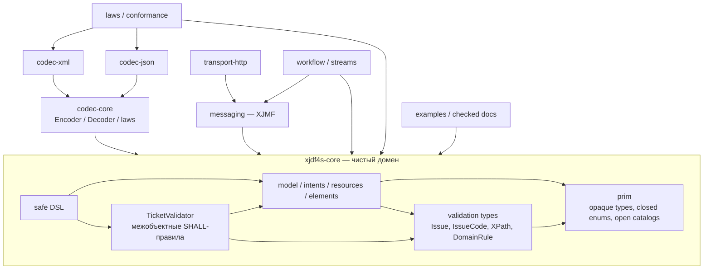
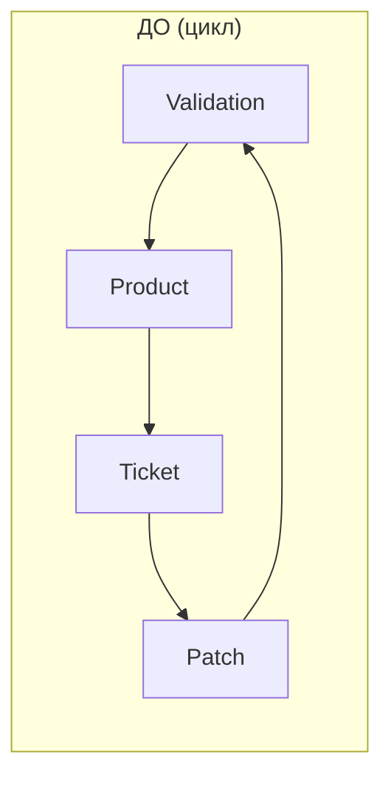
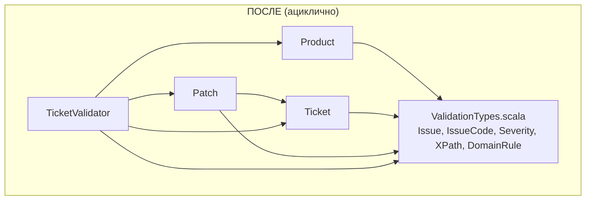
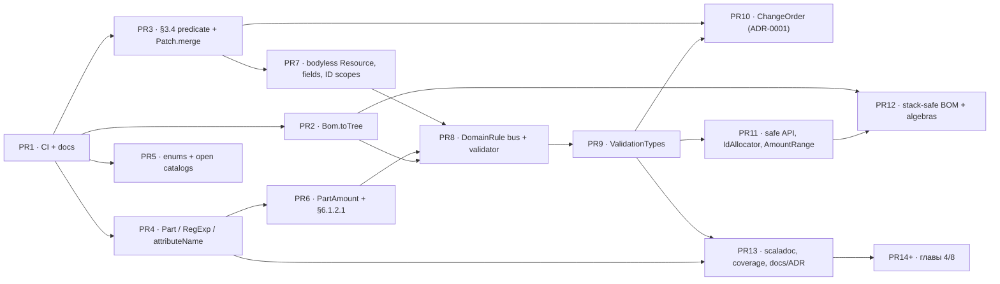
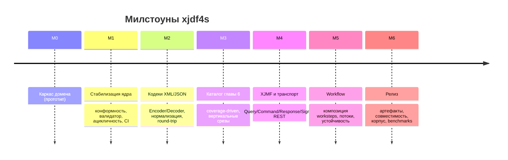

# NEXT — консолидированный план работ по xjdf4s

> **Назначение.** Единый исполнительный документ, который заменяет собой чтение
> тринадцати входных материалов (три ревью, три предложения, два отчёта о
> зависимостях, три плана, две дорожные карты). Он отвечает на четыре вопроса:
> *что реально сломано*, *что ошибочно объявлено сломанным*, *в каком порядке
> это чинить* и *по каким критериям считать сделанным*.
>
> **Базовый срез.** Ветка `arena/01a004c9-xjdf4s`, `HEAD = c1ae995`
> («Added roadmaps»), 2026-08-15. Стек: Scala 3.8.4, cats 2.13.0, sbt 2.0.2,
> целевая JVM для CI — Temurin 21.
>
> **Метод.** Каждое утверждение источников перепроверено по коду `modules/*`
> и по нормативным текстам `reference/xjdf/*` на этом срезе. В таблицах указаны
> файлы и строки, по которым проверка выполнена. В окружении **нет JVM и sbt**
> (`java: command not found`), поэтому ни одно утверждение вида «компилируется»
> / «тесты зелёные» не считается доказанным до первого прогона CI.
>
> **Единственный источник истины по предметной области** — нормативный текст
> `reference/xjdf/*`. Утверждение без ссылки на него — гипотеза, а не факт.

---

## Оглавление

1. [Резюме и первый шаг](#1-резюме-и-первый-шаг)
2. [Входные документы и как они соотносятся](#2-входные-документы-и-как-они-соотносятся)
3. [Базовое состояние M0](#3-базовое-состояние-m0)
4. [Консолидированный факт-чекинг](#4-консолидированный-факт-чекинг)
    - [4.1 Подтверждённые дефекты](#41-подтверждённые-дефекты)
    - [4.2 Отклонённые и переклассифицированные находки](#42-отклонённые-и-переклассифицированные-находки)
    - [4.3 Разрешение противоречий между планами](#43-разрешение-противоречий-между-планами)
    - [4.4 Теоретические и документационные неточности](#44-теоретические-и-документационные-неточности)
5. [Анализ зависимостей и целевая архитектура](#5-анализ-зависимостей-и-целевая-архитектура)
6. [Архитектурные решения (ADR)](#6-архитектурные-решения-adr)
7. [План M1 — фазы и задачи](#7-план-m1--фазы-и-задачи)
8. [Нарезка на PR и граф зависимостей задач](#8-нарезка-на-pr-и-граф-зависимостей-задач)
9. [Definition of Done M1](#9-definition-of-done-m1)
10. [Дорожная карта M2–M6](#10-дорожная-карта-m2m6)
11. [Стратегия тестирования и CI](#11-стратегия-тестирования-и-ci)
12. [Риски и меры снижения](#12-риски-и-меры-снижения)
13. [Матрица трассируемости](#13-матрица-трассируемости)
14. [Конвенции разработки](#14-конвенции-разработки)
15. [Приложения](#15-приложения)

---

## 1. Резюме и первый шаг

### 1.1 Вердикт

`xjdf4s` — сильный, но **не верифицированный** прототип доменного ядра.
Категориальный слой честен, Scala 3 применён осмысленно, покрытие базовых
таблиц XJDF аккуратное. Готовность M0 нельзя признать по трём причинам:

1. **Ядро содержит функциональные дефекты**, которые ломают заявленные
   возможности: развёртка BOM объявляет циклом любое валидное дерево со
   `@ChildRefs`; слияние change order дублирует `ResourceSet` вместо замещения;
   флагманский пример README не компилируется.
2. **Есть подтверждённые расхождения со спецификацией** в типах (`ProductPart`,
   `Metadata`), кардинальностях (`PartAmount/Part*`, `Resource/Specific?`),
   токенах (`Sides`, `DeviceStatus`, `HardCoverJacket`) и в семи ссылках
   scaladoc на таблицы.
3. **Нет механизма верификации**: ни CI, ни зелёного прогона. Три ревью
   разошлись в выводах именно там, где нужен компилятор, а два «блокера» из
   них оказались ложными. Пока нет CI, любой следующий вывод об исправности —
   такая же гипотеза.

Отдельно: валидатор **декларирует** больше, чем проверяет — объявленные
локальные инварианты (`isLawful`, целостность BOM) не вызываются из
`TicketValidator`, а проверка уникальности `ResourceSet` реализована строго
уже правила §3.4.

### 1.2 Первый шаг (порядок, а не календарь)

```
PR-1  CI + sbt-scalafmt + README/docs quick fixes  →  появляется факт о сборке
PR-2  Bom.toTree + регрессионные тесты             →  ядро снова считает BOM
PR-3  общий conflict-predicate §3.4 + Patch.merge  →  change order корректен
```

Только после зелёного baseline допускаются широкие изменения типов (M1.2).
Иначе крупный рефакторинг будет вестись вслепую, а известные дефекты
зацементируются сначала в API, а затем — в wire-формате M2.

### 1.3 Три правила, которые снимают большинство разногласий

| Правило | Следствие |
|---|---|
| **Не чинить то, что не доказано падающим тестом** | «Блокеры» R-01 и R-03 отклонены; вместо патча — compile/regression-тест |
| **Wire-формат отделён от домена** | `XJDF/@Name` и `$schema` — JSON-only, они не попадают в `case class XJDF` |
| **Законы важнее названий** | `Group[Matrix]`, preorder, adjunction не объявляются ради красоты интерпретации |

---

## 2. Входные документы и как они соотносятся

| Документ | Роль | Что взято в NEXT |
|---|---|---|
| `review/REVIEW-A.md` | Аудит №1: конформность Table 6.4, ID-скоуп, алгебры, категориальный слой | FC-05, FC-06, FC-07, FC-25, FC-26, FC-28, оценка Scala 3/cats |
| `review/REVIEW-B.md` | Аудит №2: enum и токены Appendix A, §3.4, §6.1.2.1, документация | FC-08, FC-09, FC-10, FC-11, FC-17, FC-18, FC-20, FC-21, FC-13, FC-14 |
| `review/REVIEW-C.md` | Аудит №3: пофайловый разбор, компиляционные риски, API-дизайн | FC-02, FC-19, FC-23, FR-01, FR-02, R-17, R-20 |
| `review/PROPOSAL-A.md` | Предложения к REVIEW-A: реестр таблиц, discipline-laws, golden-тесты, генератор «таблица → тип» | M1.2-6, M1.4-6, M2, M3.1 |
| `review/PROPOSAL-B.md` | Предложения к REVIEW-B: шина `Lawful`, ADR-каталог, подиум для кодеков, генераторы | M1.3-3, M1.4, M2.1, ADR-каталог, критика `arbPart` |
| `review/PROPOSAL-C.md` | Предложения к REVIEW-C: CI, LICENSE, sbt-scalafmt, примеры как тесты | M1.0, M1.5, M3–M6 |
| `review/DEPENDENCY-REPORT.md` | Статические метрики 43 файлов, 232 рёбер, 1 цикл | §5, M1.4-1, целевые метрики |
| `review/DEPENDENCY-DIAGRAM.md` | Mermaid-графы модулей, узких мест и цикла | §5 |
| `PLAN-A.md` | Консолидация №1 (F-01…F-34) | Матрица трассируемости; вывод по `Monoid` **отменён** |
| `PLAN-B.md` | Консолидация №2 (I-01…I-39, карта по файлам) | Сводка по файлам, порядок спринтов; вывод по `Monoid` **отменён** |
| `PLAN-C.md` | Консолидация №3 (FC-01…FC-24, ADR-1…ADR-5) | Схема FC-идентификаторов, ADR, код-скетчи |
| `ROADMAP-A.md` | Дорожная карта №1: фазы P0–P4, ADR-0001…0005, DoD | Структура фаз, ADR-нумерация, DoD |
| `ROADMAP-B.md` | Дорожная карта №2: M1.0–M1.6, M2–M6, тест-стратегия, риски | Основной каркас плана, целевая архитектура, ADR-0001/0006 |
| `ROADMAP.md` (исходный) | Досессионный роадмап M0–M6 | Не-цели, M1.6 (пробелы главы 4/8), конвенции |

**Схема идентификаторов в NEXT.** `FC-nn` — подтверждённый факт (нумерация
совместима с `PLAN-C` и `ROADMAP-A`), `FR-nn` — отклонённая/переклассифицированная
находка, `M1.x-y` — задача (совместима с `ROADMAP-B`), `ADR-000n` — решение.

---

## 3. Базовое состояние M0

### 3.1 Модули и метрики

```
modules/core      36 файлов — prim, model, intents, resources, dsl, validator
modules/laws       5 файлов — munit + ScalaCheck (4 сьюта + Arbitraries)
modules/examples   2 файла  — примеры глав 3/5 и демо
```

Верхний уровень ацикличен (`examples → core`, `laws → core`), внутри `core` —
один файловый цикл (см. §5).

### 3.2 Что уже реализовано (и с каким статусом)

| Область | Реализовано | Статус |
|---|---|---|
| Примитивы Appendix A | NmToken(s), Id/IdRef(s), JobId/JobPartId/ProjectId, XjdfString, LanguageTag, Url, XPath, версии, XYPair/Shape/Rectangle/Matrix, Points/Microns/Grammage, Amount/Coverage/UnitInterval, Severity (§5.3.4.1), IntegerRange (§1.10.2), Lab/CMYK/RGB, FloatList/IntegerList, AmountRange, Timestamp/TimeSpan/TimeRange | 🟡 нужен полный аудит Appendix A и round-trip |
| Перечисления | 40+ закрытых `enum` + `XjdfEnum`/`XjdfEnumCompanion`, каталоги открытых токенов | 🟡 три подтверждённых расхождения |
| Partition | 27 `PartitionKey`, `Part`, overlay-`Semigroup`, `matches`, `PartBuilder`, match type `ValueOf` | 🟡 два неверных типа, unsafe runtime API, нет `attributeName` |
| Amounts | `AmountPool`, `PartAmount`, `PartWaste`, `AmountRange` | 🟡 неверная кардинальность, спорная алгебра |
| Product/BOM | `Product`, `ProductList`, `Fix[ProductTree]`, катаморфизм, `totalCopies` | ❌ развёртка сломана (FC-02) |
| Resources | 12 payload-вариантов главы 6, `Resource`, `ResourceSet`, выбор по `Part` | 🟡 каталог неполон, `specific` чрезмерно обязателен |
| Intents | 8 payload-вариантов главы 4 + детали Binding/Assembling | 🟡 глава 4 покрыта частично |
| Audit | 5 видов аудита, `AuditPool`, `Header`, `Signal`/`Pulse`, `Alignment` (Table 3.2) | 🟡 ID-скоуп и локальные законы |
| Ticket | `XJDF`, `WorkstepKey`, `Patch`, `TicketValidator` (12 проверок), DSL | 🟡 вырожденный change order, неполный валидатор |
| Законы/примеры | 4 сьюта, примеры 3.1/3.3/3.4/3.6/5.2, brochure, change order | 🟡 прогон не подтверждён |

### 3.3 Ограничение верификации

На срезе **нет** `java`, `sbt`, `.github/workflows/`, `LICENSE`. Файл
`build.log`, о котором писали два ревью, **отсутствует** в дереве и в индексе;
`*.log` присутствует в `.gitignore`. Поэтому статус любого пункта — 🟡 до
первого зелёного CI-прогона (см. правило статусов в `ROADMAP-B §2.3`).

---

## 4. Консолидированный факт-чекинг

### 4.1 Подтверждённые дефекты

Проверено по коду на `HEAD = c1ae995` и по `reference/xjdf/*`.

| ID | Дефект | Проверка на срезе | Норма | Приор. | Задача |
|---|---|---|---|---|---|
| **FC-02** | `Bom.toTree` кладёт в `seen` ID **ребёнка** перед рекурсией, поэтому проверка `seen.contains(id)` немедленно срабатывает на собственном ID узла: любое дерево со `@ChildRefs` объявляется циклом | `model/Product.scala:151` — `toTree(c, byId, seen + c.id.fold("")(_.value))` при проверке на входе `Product.scala:135` | Глава 3, `Product/@ChildRefs` | **P0** | M1.1-1 |
| **FC-11** | `Patch.mergeResourceSets` документирует «update wins», но выполняет конкатенацию: старый и новый `ResourceSet` остаются вместе | `model/Patch.scala:76` — `ticket.resourceSets ++ update` | §3.4 (уникальность набора) | **P0** | M1.1-2 |
| **FC-13** | Сниппет README использует `.flatMap` на `ValidatedNec` — `Validated` не монада | `README.md:53` | cats: `Validated.andThen` | **P0** | M1.0-2 |
| **FC-05** | `Part/@ProductPart` смоделирован как `IdRef` | `model/Partition.scala:137`, `:70`, `:313`, `:460` | Table 6.4: `ProductPart?` = `NMTOKEN` *(Deprecated in XJDF 2.1)* | P1 | M1.2-1 |
| **FC-06** | `Part/@Metadata` смоделирован как `NmToken` (запрещает пробелы и regex-символы) | `model/Partition.scala:130` | Table 6.4: `Metadata?` = `regExp` | P1 | M1.2-1 |
| **FC-29** | `Show`/кодек напечатают Scala-имя `OptionKey` вместо XJDF-атрибута `Option`; у `PartitionKey` нет реестра wire-имён | `model/Partition.scala:131`, `:166`, `:198` | Table 6.4: атрибут `Option` | P1 | M1.2-1 |
| **FC-08** | `Sides` — 4 значения из 5 (нет `Unprinted`); `DeviceStatus` — 5 из 7 (нет `Cleanup`, `Setup`) | `prim/Enums.scala:49-53`, `:109-114`. Примечание: соседний `Status` **содержит** `Cleanup`/`Setup` — путаница двух таблиц | Table A.40 (`Unprinted`, New in 2.1); Table A.15 (`Cleanup`, New in 2.1, `Setup`) | P1 | M1.2-2 |
| **FC-09** | `HardCoverJacket.Glued` даёт wire-токен `"Glued"` | `prim/Enums.scala:514-521` | Table 4.11 (HardCoverBinding, Sheet 1): допустимо `None`, `Loose`, **`Glue`** | P1 | M1.2-2 |
| **FC-25** | `NamedColor` — закрытый `enum` из 16 значений | `prim/Enums.scala:264-274` | Appendix A.2.30 ссылается на внешний открытый каталог Color Names (`Pantone 123 C` невыразим) | P1 | M1.2-2 |
| **FC-10** | `PartAmount` содержит один `part: Part` | `model/Amounts.scala:34-45` | Table 6.3: `Part*` (0..*) | P1 | M1.2-3 |
| **FC-21** | `Resource.specific` обязателен, поэтому `<Resource/>` из Example 3.6 невыразим | `model/Resource.scala:217`, `:235`, `:244` | Table 6.1: Specific Resource — `?` | P1 | M1.2-4 |
| **FC-19** | `DropItem` без `TotalDimensions`, `TotalVolume`, `TotalWeight` | `resources/Delivery.scala:34-37` | Table 6.55 | P1 | M1.2-5 |
| **FC-20** | `Notification` без `@ModuleID`; правило «`Milestone` ⇒ `@Class="Event"`» не проверяется | `model/Header.scala:70-78` | Table 8.49 | P1 | M1.2-5 |
| **FC-26** | `Header/@ID` аудитов включён в документную область уникальности ID | `model/Ticket.scala:57-62` (`origin.id` в `declaredIds`) | Table 7.3: область уникальности `Header/@ID` — сообщения отправителя | P1 | M1.2-5 |
| **FC-07** | Семь scaladoc-ссылок указывают номер **раздела** вместо номера **таблицы** | `Color.scala:7` (6.14), `Finishing.scala:9` (6.25) и `:44` (6.36), `Layout.scala:8` (6.52), `Media.scala:8` (6.57), `NodeInfo.scala:7` (6.59), `Preview.scala:8` (6.66) | Проверено по `6 – Resources.md`: **6.27, 6.53, 6.74, 6.95, 6.114, 6.119, 6.134**. `Device.scala:7` («Table 6.57») — **верно** (Table 6.57: Device Resource), это и создало коллизию с Media | P1 | M1.2-6 |
| **FC-18** | `checkResourceSetKeys` использует `groupBy(_.key)` — ловит только точное равенство ключа, пропускает частичное пересечение CPI (`[0]` vs `[0,1]`) и смесь «без CPI + с CPI» | `model/Validation.scala:87-95` | §3.4 («common or no entries») | P1 | M1.3-1 |
| **FC-17** | Объявленные локальные инварианты не подключены к корневой валидации: `BindingIntent.isLawful` (`intents/Binding.scala:31`) и `VariableIntent.isLawful` (`intents/FoldingVariable.scala:42`) вызываются только из DSL (`dsl/XjdfDsl.scala:170`); `PartWaste.isLawful` (`model/Amounts.scala:19`), `Disposition.isLawful` (`prim/Common.scala:213`), `Product.hasLawfulAmounts` (`model/Product.scala:36`) и `Bom.fromProductList` не вызываются нигде в валидаторе | `model/Validation.scala:41-56` — список 12 проверок; `checkIntentLawfulness` (`:190`) сверяет только `@Name` ↔ `elementName` | Главы 3–6, соответствующие SHALL | P1 | M1.3-3 |
| **FC-30** | `checkPartAmountKeys` реализует §6.1.2.1 частично: `r.parts.size match { case 1 => …; case _ => Nil }` — при нескольких родительских `Part` проверка выключается; второе правило («значение SHALL совпадать с одним из родительских») отсутствует | `model/Validation.scala:179-188` | Table 6.3, §6.1.2.1 | P1 | M1.3-2 |
| **FC-12** | `type ChangeOrder = XJDF & Partial` вырожден: `XJDF extends Partial`, значит пересечение ≡ `XJDF` и ничего не различает | `model/Ticket.scala:13`, `:41`, `:118` | §1.3.2, §1.6.5: у change order ослабляется кардинальность | P2 | M1.4-2 |
| **FC-16** | Цикл файловых зависимостей внутри `model`: `Validation → Product → Ticket → Patch → Validation` | `DEPENDENCY-REPORT.md`, подтверждено импортами | ADP (принцип ацикличности) | P2 | M1.4-1 |
| **FC-23** | `PartBuilder.set` бросает `IllegalArgumentException` при несовпадении вида значения; safe-API не total, `unsafe` не вынесен в имя | `model/Partition.scala:415-462` (`expectToken`, `expectProductRef`) | Принцип 5 `docs/04` | P2 | M1.4-3 |
| **FC-22** | `IdSource`/`IdAllocator`/`WithIds` — мёртвый код: Fan-In 0, ни одного вызова; DSL принимает `id: Option[String]` | `model/IdSource.scala`, `DEPENDENCY-REPORT` (лист с Fan-In 0) | §2.2.3 | P2 | M1.4-4 |
| **FC-28** | `AmountRange.meet`/`join` расходятся с документацией: `meet.amount` использует `stricterMin`, возвращающий **большее** значение; `join` при этом **сужает** интервал | `prim/Quantity.scala:420-434` | §6.1.2, Table 6.3 | P2 | M1.4-5 |
| **FC-24** | Нет `.github/workflows/ci.yml`; нет `LICENSE` (блокирует публикацию M6) | `ls` на срезе | — | P0 (CI) / P3 (лицензия) | M1.0-1, M1.0-4 |
| **FC-14** | `docs/03-cats-mapping.md:19-21` утверждает, что на `Validated` не компилируются ни `.flatMap`, ни `.andThen` | Ложно для `.andThen`: метод существует в cats 2.13.0 и используется в `dsl.intent` | — | P3 | M1.5 |
| **FC-15** | `docs/01 §3` называет `Part.matches` предпорядком/тонкой категорией | Контрпример: `{Side=Front} ≼ {}` и `{} ≼ {Side=Back}`, но `{Side=Front} ⋠ {Side=Back}` — транзитивности нет | — | P3 | M1.5, ADR-0005 |
| **FC-31** | Битые/неточные ссылки в документации: `docs/02` → `03-cats.md` (файл называется `03-cats-mapping.md`); `docs/01 §1` ссылается на «Part 1 – its-all-about-morphisms» (файл в Part 3); `docs/04` не показывает ребро `resources → intents` (`Finishing.scala` импортирует `Fold`/`Perforate`) | `ls docs/`, `reference/category-theory/` | — | P3 | M1.0-2, M1.5 |

### 4.2 Отклонённые и переклассифицированные находки

Эти пункты **не входят** в план как дефекты. Важно не потратить на них работу.

| ID | Утверждение источника | Вердикт |
|---|---|---|
| **FR-01** | «`Monoid[ValidatedNec[Issue, Unit]]` не существует, `checks.combineAll` не компилируется» — REVIEW-C R-01, PROPOSAL-C P0-1, **PLAN-A P0-1**, **PLAN-B P0.1** | ❌ **Отклонено.** cats предоставляет `catsDataMonoidForValidated[E: Semigroup, A: Monoid]`; `Semigroup[NonEmptyChain[Issue]]` и `Monoid[Unit]` доступны, инстанс синтезируется. Совпадает с выводом REVIEW-B §5, PLAN-C, ROADMAP-A (FR-01), ROADMAP-B §4.3. **Кастомный `given` не добавлять** — он создаст неоднозначность разрешения. Действие: compile-test `summon[Monoid[ValidatedNec[Issue, Unit]]]` (M1.0-3). Выводы PLAN-A/PLAN-B по этому пункту аннулируются. |
| **FR-02** | «`IntegerRange.indices` не обрабатывает нисходящие диапазоны, ветка `by -1` недостижима» — REVIEW-C R-03 | ❌ **Отклонено.** `prim/Quantity.scala:383-390`: `lo` — это зажатый `from`, `hi` — зажатый `to`; для `-1 0` при size=3 получаем `lo=2, hi=0`, условие `lo <= hi` ложно, выполняется `(2 to 0 by -1)`. Ошибка ревьюера вызвана именами переменных. Действие: переименовать в `clampedFrom`/`clampedTo` + boundary-тесты (M1.1-3), поведение не менять. |
| **FR-03** | «`build.log` закоммичен с красным `PartitionLaws`» — REVIEW-A §1.1, REVIEW-B §1.1, PROPOSAL-A §2.1 | ⚠️ **Не воспроизводится** на срезе: файла нет ни в дереве, ни в индексе, `*.log` в `.gitignore`. Дополнительно: описанное свойство в текущем коде тавтологично (overlay право-смещённый, `combine` = `b.x.orElse(a.x)`). Действие: только правило гигиены — логи CI хранятся как artifacts (M1.0-4). |
| **FR-04** | «`XJDF/@Name` отсутствует в модели» — REVIEW-B R2.10, PLAN-A P1-12, ROADMAP-A P1-10 | 🔁 **Переклассифицировано.** Проверено по Table 3.1: `@Name` — **JSON Exception**: «SHALL be provided in JSON if XJDF is the root JSON object and **SHALL NOT be provided in XML**». То же для `@$schema`. Поле не добавляется в `case class XJDF`; правило реализуется в JSON-кодеке M2 (encoder синтезирует, decoder валидирует и снимает при нормализации) и фиксируется строкой в `SPEC-COVERAGE` как codec-only. Позиция ROADMAP-B принята. |
| **FR-05** | «`Matrix` должен получить `Group`» — REVIEW-A §3.4 | 🔁 **Переклассифицировано.** Тотальный `Group` невозможен: вырожденная матрица необратима. Целевое состояние — `Monoid[Matrix]` + `inverse: Option[Matrix]` с задокументированной причиной; опционально отдельный проверенный `InvertibleMatrix` с честным `Group` (M1.4-6). |
| **FR-06** | «Реализации P0-1/P1-1/P2-* доступны через `git cherry-pick 41aff7e`» — PROPOSAL-C, Приложение B | ⚠️ **Неприменимо.** В истории текущей ветки один коммит (`c1ae995`); коммитов `41aff7e`/`1de0ab8`/`90462ae`/`996b756`/`ca29745`, упоминаемых в планах, здесь нет. Планировать перенос кода из них нельзя. |

### 4.3 Разрешение противоречий между планами

| Спорный вопрос | Позиции | Решение NEXT | Основание |
|---|---|---|---|
| Кастомный `Monoid[ValidatedNec]` | PLAN-A/PLAN-B: добавить (P0) · PLAN-C/ROADMAP-A/ROADMAP-B: не добавлять | **Не добавлять**, закрыть compile-тестом | cats-инстанс существует; лишний `given` создаст ambiguity |
| `IntegerRange` | REVIEW-C/PLAN-B: чинить алгоритм · PLAN-C/ROADMAP-A/B: только rename | **Только rename + тесты** | Логика верна, дефект — в именовании |
| Дизайн `ChangeOrder` | PROPOSAL-A: убрать вовсе, оставить `Patch` · PLAN-C/ROADMAP-A: `opaque type ChangeOrder = XJDF` · PROPOSAL-B/ROADMAP-B: номинальный partial-тип + компиляция в `Patch` | **Гибрид, зафиксированный в ADR-0001**: убрать `Partial` и вырожденный alias немедленно; ввести `ChangeOrder` как отдельную partial-модель с `compile(change, base): ValidatedNec[Issue, Patch]`. `opaque type ChangeOrder = XJDF` признан недостаточным и **не является целевым** | §1.6.5 прямо описывает ослабление кардинальности для XJDF, ссылаемого из `CommandResubmitQueueEntry`; alias этого не выражает |
| `XJDF/@Name` | PLAN-A/ROADMAP-A: добавить поле · ROADMAP-B: codec-only | **Codec-only (M2)** | Table 3.1: JSON Exception, в XML запрещён |
| Приоритет `build.log`/VCS | REVIEW-A/B: блокер · PLAN-C/ROADMAP-A/B: устарело | **Не дефект**, только правило гигиены | Файла нет на срезе |
| Форма валидации | Большинство: подключить `isLawful` · ROADMAP-B: заменить `Boolean` на `DomainRule` с issue-кодами | **Заменить на `DomainRule`** и заодно подключить | `Boolean` теряет причину, severity и XPath; кодекам и HTTP API нужны машиночитаемые коды |
| `join` у `AmountRange` | PROPOSAL-A: удалить или переименовать в `widen` · PLAN-C: исправить направления · ROADMAP-B: сначала ADR, разделить bounds и nominal | **ADR-0004 до кода**: разделить `AmountBounds` и nominal `Amount`, `Semilattice` оставить только там, где операция тотальна и осмысленна | Полурешёточные законы выполняются формально, но не доказывают доменный смысл |
| discipline / cats-laws | PROPOSAL-A/B: перевести законы на discipline · ROADMAP-B: либо перевести, либо оставить, но не смешивать | **Решение в ADR-0007** одним заходом; запрещено держать две неполные системы | Резолв под Scala 3.8.4 не проверен без JVM |
| Лицензия | PROPOSAL-C/PLAN-*: Apache-2.0 · ROADMAP-B: решение владельца | **Рекомендация Apache-2.0, добавляется после подтверждения владельцем**; публикация M6 блокируется до ясности | Юридическое решение вне компетенции плана |

### 4.4 Теоретические и документационные неточности

| Утверждение в `docs/*` | Корректная формулировка |
|---|---|
| `Part.matches` — предпорядок / тонкая категория | **Отношение толерантности (совместимости)**: рефлексивно и симметрично, **не транзитивно**. Мост-закон: `a.matches(b) == a.conflictingKeys(b).isEmpty` + юнит-тест с контрпримером |
| `AuditPool`/`AmountPool`/`NmTokens`/`ProcessPath` — свободные моноиды | Носитель `NonEmptyChain` не имеет нейтрального элемента ⇒ это **свободные полугруппы**; «моноид» корректен только для `Chain`-носителей |
| Intent ⇄ Resource — сопряжение (adjunction) | **Инженерная аналогия/структурное зеркалирование** до тех пор, пока не заданы функторы, unit/counit и не доказаны triangle identities. Проверяемая часть — закон `Intent/@Name == payload.elementName` |
| На `Validated` не компилируются ни `flatMap`, ни `andThen` | Нет **монадического** `flatMap` и for-comprehension; `andThen` (right-biased sequencing) есть и используется в `dsl.intent` |
| `ChangeOrder = XJDF & Partial` различает контексты на уровне типов | Не различает: `XJDF <: Partial`. Описать честно и заменить (ADR-0001) |
| `Matrix` — группа | Моноид аффинных преобразований с **частичным** обращением |
| `Show` как сериализация | `Show` — только debug-вывод; wire-формат появляется в M2 |

---

## 5. Анализ зависимостей и целевая архитектура

### 5.1 Базовые метрики (`DEPENDENCY-REPORT.md`)

| Показатель | Значение | Комментарий |
|---|---|---|
| Узлы / рёбра / модули | 43 / 232 / 3 | средние Fan-In и Fan-Out — 5.4 |
| Циклы | **1** (4 файла) | `Validation → Product → Ticket → Patch → Validation` |
| God objects (Fan-Out > 25) | 0 | ✅ |
| Изолированные файлы | 0 | ✅ |
| Нарушения принципа стабильных зависимостей | 0 | ✅ |
| Топ Betweenness | `resources.AllResources` 161.6; `model.Resource` 135.1; `intents.AllIntents` 45.9; `model.Validation` 42.1; `model.Intent` 35.9 | узкие места, через которые проходит большинство путей |
| Топ Fan-In (фундамент) | `prim.Tokens` 36; `prim.Enums` 24; `prim.Ids` 23; `prim.Quantity` 19; `prim.Common` 14 | должны оставаться максимально стабильными |
| Instability | `laws` 0.97, `examples` 0.98, `core` 0.52 | ожидаемо для тестов/примеров |

**Выводы для плана.**

1. Цикл разрывается в M1.4-1 выделением `ValidationTypes`.
2. `AllResources` — центральная точка. Прежде чем добавлять в неё ~130 таблиц
   главы 6 (M3), нужен ADR-0008 о представлении `ResourcePayload`: иначе
   bottleneck усилится линейно по числу ресурсов.
3. `prim/Common.scala` (Fan-In 14) содержит элементы глав 3/8, а не примитивы —
   перенос в `model/elements` снижает связность фундамента (M1.4-8).
4. Метрика приёмки: после M1 отчёт показывает **0 циклов**, betweenness
   `Validation` снижается (валидатор становится листом-корнем, а не транзитом).

### 5.2 Целевой граф после M1–M4



### 5.3 Разрыв цикла





### 5.4 Слои внутри `core`

| Слой | Содержимое | Не должен знать о |
|---|---|---|
| `prim` | проверенные скалярные типы, закрытые enum, открытые каталоги | `XJDF`, XML/JSON, HTTP |
| `model` / `elements` | агрегаты XJDF и локальные инварианты | парсеры, эффекты |
| `validation` | `Issue`, severity, path, композируемые правила, корневой валидатор | транспорт |
| `dsl` | безопасное конструирование | порядок элементов, namespaces |

---

## 6. Архитектурные решения (ADR)

Каталог создаётся в `docs/adr/` (формат Michael Nygard, одна страница на
решение). Ниже — принятое содержание; ADR фиксируется **до** написания кода
соответствующей задачи.

### ADR-0001 — Change Order и статус `Partial`

- **Проблема.** `type ChangeOrder = XJDF & Partial` при `XJDF extends Partial`
  вырожден (FC-12). §1.6.5: у XJDF, на который ссылается
  `CommandResubmitQueueEntry`, «cardinality restrictions are loosened and all
  elements and attributes that are not required to identify the context of the
  change order become optional».
- **Решение.**
    1. Немедленно удалить маркер `Partial` и alias `ChangeOrder = XJDF & Partial`.
    2. Разделить три сущности:
        - **ChangeOrder document** — частичное описание с ослабленной
          кардинальностью (набор обязательных «контекстных» полей утверждается
          после повторной сверки §1.3.2/§1.6.5 и `schema.xsd` для change order);
        - **Patch** — нормализованная операция `XJDF => XJDF` (моноид эндоморфизмов,
          уже реализован);
        - **результат применения** — `ValidatedNec[Issue, XJDF]`, потому что
          change order способен нарушить инварианты.
    3. Целевой интерфейс:
       ```scala
       final case class ChangeOrder(/* только разрешённые partial-поля */)
  
       object ChangeOrder:
         def compile(change: ChangeOrder, base: XJDF): ValidatedNec[Issue, Patch]
  
       def applyChange(base: XJDF, change: ChangeOrder): ValidatedNec[Issue, XJDF]
       ```
    4. `opaque type ChangeOrder = XJDF` **отклонён**: не выражает ослабленную
       кардинальность; допустим только как временный шаг внутри одного PR.
    5. Честно описать статус в `docs/02` (intersection types демонстрируются
       там, где они действительно различают контексты, либо не демонстрируются).
- **Связь с милстоунами.** Полная форма ChangeOrder-документа проверяется в M4
  (XJMF `CommandResubmitQueueEntry`); в M1 фиксируется доменная часть.

### ADR-0002 — Слои валидации и разрыв цикла

- **Решение.** Вынести `Issue`, `IssueCode`, `SeverityClass`, `XPath`,
  `type ValidationResult[A] = ValidatedNec[Issue, A]` и `trait DomainRule[-A]`
  в независимый `model/ValidationTypes.scala` (Fan-Out 0). `Product`, `Ticket`,
  `Patch` зависят только от него; `TicketValidator` — внешний корень.
- **Проверка.** Генератор отчёта о зависимостях показывает 0 циклов.

### ADR-0003 — Закрытые enum против открытых каталогов

- **Решение.** Закрытый `enum` допустим **только** если таблица Appendix A
  перечисляет конечный набор. Если спецификация ссылается на внешний каталог
  (`Color Names`, типы контактов, технологии печати) — тип открытый
  (`NmToken`) + `Catalog.*` с рекомендованными значениями и тестом на
  расширяемость. Scala-имя case **не считается** wire-токеном автоматически:
  для каждого closed enum ведётся golden-множество токенов
  (`Unjacketed → "None"`, jacket glue → `"Glue"`).

### ADR-0004 — Алгебра `AmountRange`

- **Проблема.** Направления `meet`/`join` противоречат документации (FC-28);
  законы полурешётки выполняются покоординатно и ничего не доказывают о смысле.
- **Решение.**
    1. Отделить `AmountBounds(min, max)` от nominal `Amount`.
    2. Инварианты: `MinAmount <= MaxAmount`; nominal согласован с границами;
       пустое пересечение — **ошибка**, а не «валидный» диапазон.
    3. Для bounds: `meet` повышает нижнюю и понижает верхнюю границу; `join`
       (если сохраняется — под именем `widen`) действует наоборот.
    4. Nominal-амаунты **не** комбинируются произвольным `min`/`max` без
       доменного основания.
    5. `Semilattice` объявляется только там, где операция тотальна и доказана
       law-тестом.

### ADR-0005 — `Part.matches` как отношение толерантности

- **Решение.** Переформулировать `docs/01 §3`; добавить в `PartitionLaws`
  рефлексивность, симметричность, мост `matches ≡ conflictingKeys.isEmpty` и
  явный контрпример к транзитивности:
  ```scala
  test("Part.matches is a tolerance relation (reflexive, symmetric, non-transitive)"):
    val a = Part.bySide(Side.Front); val b = Part.empty; val c = Part.bySide(Side.Back)
    assert(a.matches(b) && b.matches(c) && !a.matches(c))
  ```

### ADR-0006 — Политика severity: errors vs warnings

- **Решение.** SHALL-нарушения инвалидируют результат; SHOULD/MAY попадают в
  предупреждения и **не** превращают `Valid` в `Invalid`.
  ```scala
  final case class ValidationReport(errors: Chain[Issue], warnings: Chain[Issue])
  ```
  Каждый `Issue` несёт стабильный машиночитаемый `IssueCode`, severity, XPath
  и человекочитаемое сообщение — чтобы кодеки и HTTP-слой не разбирали строки.

### ADR-0007 — Law-инфраструктура

- **Решение.** Однократный выбор: либо `cats-laws` + `discipline-munit` (готовые
  `SemigroupTests`, `MonoidTests`, `CommutativeMonoidTests`, `SemilatticeTests`,
  `FunctorTests`), либо текущие рукописные law-сьюты. Смешивать две неполные
  системы запрещено. Проверка резолва под Scala 3.8.4 / munit 1.3.0 выполняется
  в CI-ветке эксперимента; при проблемах фиксируется отказ с обоснованием.
  Доменные законы (§6.1.3.2, хронология аудитов, действие `Patch`) остаются
  обычными property-тестами в любом случае.

### ADR-0008 — Представление `ResourcePayload` перед M3

- **Проблема.** `resources.AllResources` — узел с максимальной betweenness
  (161.6). Добавление ~130 таблиц в один enum усилит bottleneck.
- **Решение.** До массового переноса сравнить три варианта (центральный
  генерируемый enum; иерархия по семействам процессов; registry/typeclass) по
  критериям: исчерпывающий стандартный каталог, escape hatch для foreign
  extensions, тотальные `elementName`/`references`/validation/codec dispatch,
  отсутствие unchecked casts, добавление ресурса одной вертикальной правкой.

### ADR-0009 — Нормализация кодеков и сохранение расширений (M2)

- **Решение.** Round-trip формулируется как `decode(encode(a)) = normalize(a)`
  и `encode(decode(bytes)) = canonicalize(bytes)`. Заранее определяются:
  значения по умолчанию, порядок несемантических атрибутов, namespace-префиксы,
  JSON-only дискриминаторы, различие «отсутствует» и «задано значением по
  умолчанию», политика foreign namespaces (raw extension AST — неизвестные
  расширения не выбрасываются молча).

---

## 7. План M1 — фазы и задачи

Фазы выполняются последовательно; внутри фазы задачи можно группировать в PR.
Формат задачи: **цель → файлы → норма → реализация → тесты → критерий**.

### M1.0 — Наблюдаемость сборки и быстрые исправления

> Без этой фазы все дальнейшие утверждения о корректности остаются гипотезами.

#### M1.0-1. Обязательный CI *(FC-24; ROADMAP-A P4-1, ROADMAP-B M1.0-1)*

- **Файлы:** `.github/workflows/ci.yml` (новый), `project/plugins.sbt` (новый).
- **Реализация:**
  ```yaml
  name: CI
  on:
    push:
      branches: [ "main", "develop", "arena/**" ]
    pull_request:
  jobs:
    build:
      runs-on: ubuntu-latest
      steps:
        - uses: actions/checkout@v4
        - uses: actions/setup-java@v4
          with: { java-version: '21', distribution: 'temurin', cache: 'sbt' }
        - uses: sbt/setup-sbt@v1
        - run: sbt -batch clean compile test examples/run
  ```
  `.scalafmt.conf` в репозитории есть, но плагина и команды `scalafmtCheckAll`
  в сборке нет — добавить `sbt-scalafmt` в `project/plugins.sbt` и только
  после этого включить формат-гейт:
  `sbt -batch clean scalafmtCheckAll compile test examples/run`.
- **Тесты/критерии:** workflow запускается на любом PR и push рабочей ветки;
  три модуля компилируются; предупреждений от `-Wunused:all`,
  `-Wvalue-discard`, `-Wnonunit-statement` нет; логи — CI-артефакты, не файлы
  репозитория. `-Werror` включается отдельным шагом **после** первого зелёного
  прогона.

#### M1.0-2. Исполняемая документация *(FC-13, FC-14, FC-31)*

- **Файлы:** `README.md:53`, `docs/02-scala3-features.md`,
  `docs/03-cats-mapping.md:19-21`, `docs/01-category-theory-view.md`.
- **Реализация:** `.flatMap(_.build)` → `.andThen(_.build)`; исправить тезис о
  `Validated.andThen`; починить ссылку на `03-cats-mapping.md`; исправить
  ссылку на «its-all-about-morphisms» (Part 3, не Part 1).
- **Тесты:** munit-тест «README-example compiles and validates» в `TicketLaws`;
  все сниппеты документации должны быть компилируемыми (постепенно).

#### M1.0-3. Зафиксировать статус спорных compile-находок *(FR-01, FR-02)*

- **Реализация:** добавить тесты, а не workaround:
  ```scala
  test("cats provides Monoid[ValidatedNec[Issue, Unit]]"):
    val _ = summon[Monoid[ValidatedNec[Issue, Unit]]]

  test("§1.10.2: IntegerRange(-1, 0) selects everything in reverse"):
    assertEquals(IntegerRange.unsafe(-1, 0).select(List("a","b","c")), List("c","b","a"))
  ```
  плюс smoke-тест, который прогоняет все `SpecExamples` (устраняет ситуацию
  «No tests to run», маскировавшую непроверенные сьюты).
- **Критерий:** ни одного «исправления» без падающего теста.

#### M1.0-4. Гигиена репозитория и лицензия *(FC-24, FR-03)*

- Логи сборки не коммитятся (`*.log` уже в `.gitignore`); результаты — CI
  artifacts.
- Коммиты по конвенции `M<n>: …`.
- `LICENSE`: рекомендация Apache-2.0 (совместима с экосистемой Typelevel и
  требуется для Sonatype в M6); файл добавляется **после подтверждения
  владельцем репозитория**; до этого публикация M6 заблокирована.

---

### M1.1 — Критическая функциональная корректность

#### M1.1-1. Исправить развёртку BOM *(FC-02; P0)*

- **Файл:** `model/Product.scala` (`toTree`, `fromProductList`).
- **Норма:** глава 3, `Product/@ChildRefs`, структура `ProductList`.
- **Реализация:** в `seen` попадает ID **текущего** узла, один и тот же
  `nextSeen` передаётся каждому ребёнку; повторное использование общего
  поддерева в разных ветвях (DAG) циклом не считается.
  ```scala
  private def toTree(product: Product, byId: Map[String, Product], seen: Set[String])
      : Either[Issue, Fix[ProductTree]] =
    val currentId = product.id.map(_.value)
    currentId match
      case Some(id) if seen.contains(id) =>
        Left(Issue.error(XPath("/XJDF/ProductList"), s"Cycle in product structure at ID '$id'"))
      case _ =>
        val nextSeen = currentId.fold(seen)(seen + _)
        // рекурсия во всех детей с nextSeen
  ```
- **Обязательные тесты:** лист без ID; валидное дерево глубины ≥ 2;
  неразрешённый `ChildRef`; самоцикл; косвенный цикл `A → B → C → A`; DAG с
  общим ребёнком из двух ветвей; `SpecExamples.notebook` разворачивается и
  `Bom.totalCopies` считается; демо `Main.demoBomFold` проходит.

#### M1.1-2. Исправить `Patch.mergeResourceSets` *(FC-11; P0)*

- **Файл:** `model/Patch.scala:74-86`.
- **Реализация:** update **замещает** конфликтующие наборы; конфликт
  определяется общим предикатом §3.4 (см. M1.3-1), а не `key ==`:
  ```scala
  def mergeResourceSets(ticket: XJDF, update: Chain[ResourceSet])
      : Ior[NonEmptyChain[Issue], XJDF] =
    val conflicts = ticket.resourceSets.filter(rs => update.exists(u => conflictsPer34(rs, u)))
    val retained  = ticket.resourceSets.filterNot(rs => update.exists(u => conflictsPer34(rs, u)))
    val merged    = ticket.copy(resourceSets = retained ++ update)
    …
  ```
  Отдельно проверяются конфликты **внутри** самого update. Контракт результата:
  `Right` — замен не было; `Both(warnings, ticket)` — конфликтующие старые
  значения заменены; `Left` — update внутренне противоречив и не может быть
  применён детерминированно.
- **Тесты:** без конфликта; точное совпадение ключа; частичное пересечение CPI;
  `None` vs `Some(CPI)`; несколько замен; дубликат внутри update;
  идемпотентность повторного применения; property «после merge нет пары
  конфликтующих `ResourceSet`».

#### M1.1-3. Уточнить `IntegerRange` *(FR-02)*

- **Файл:** `prim/Quantity.scala:383-390`.
- **Реализация:** `lo`/`hi` → `clampedFrom`/`clampedTo`; поведение не меняется.
- **Тесты:** пустой список; выход за границы; отрицательные индексы; один
  элемент; прямой и обратный диапазон.

---

### M1.2 — Соответствие типам, токенам и кардинальностям

#### M1.2-1. Полная модель `Part` (Table 6.4) *(FC-05, FC-06, FC-29)*

- **Файлы:** `prim/Tokens.scala` (новый тип), `model/Partition.scala`.
- **Реализация:**
    1. Ввести проверенный `opaque type RegExp` с `from`/явным `unsafe`:
       ```scala
       opaque type RegExp = String
       object RegExp:
         def from(raw: String): Option[RegExp] =
           Option(raw).filter(_.nonEmpty).flatMap: r =>
             try { java.util.regex.Pattern.compile(r); Some(r) }
             catch case _: java.util.regex.PatternSyntaxException => None
         def unsafe(raw: String): RegExp =
           from(raw).getOrElse(throw IllegalArgumentException(s"Invalid RegExp: '$raw'"))
         extension (r: RegExp) def value: String = r
         given Show[RegExp] = Show.show(_.value)
         given Eq[RegExp]   = Eq.fromUniversalEquals
       ```
       ⚠️ Грамматику XJDF `regExp` предварительно сверить со спецификацией:
       `java.util.regex` допустим только при подтверждённой совместимости, иначе
       фиксируется отклонение в `SPEC-COVERAGE`.
    2. `productPart: Option[NmToken]`, `metadata: Option[RegExp]`.
    3. `PartitionValue`: `ProductRef(value: NmToken)`, `RegExpVal(value: RegExp)`.
    4. `ValueOf`: `ProductPart.type => NmToken`, `Metadata.type => RegExp`.
    5. Конструктор `byProductPart(value: NmToken)` вместо `byProductRef`.
    6. `PartitionKey.attributeName: String` — реестр wire-имён (`OptionKey → "Option"`);
       `Show[Part]`, валидатор и будущие кодеки используют его, а не имя поля.
    7. `ProductPart` исключается из автоматического сбора IDREF; семантическая
       связь с `Product` проверяется отдельным правилом, несмотря на XSD-тип.
    8. Сверить все 27 ключей с Table 6.4 и `schema.xsd`.
- **Тесты (одно property-семейство по каждому ключу):**
  `keys.contains(k) == valueOf(k).isDefined`; runtime-значение имеет ожидаемый
  тег; право-смещённый `combine` заменяет только выбранный ключ;
  `attributeName` совпадает с XJDF; `matches(b) == conflictingKeys(b).isEmpty`.
  Это закрывает риск дрейфа между пятью параллельными перечислениями полей
  (`keys`, `valueOf`, `combine`, `PartBuilder`, `ValueOf`).

#### M1.2-2. Закрытые enum и открытые каталоги *(FC-08, FC-09, FC-25; ADR-0003)*

- **Файл:** `prim/Enums.scala`, `prim/Common.scala` (каталоги).
- **Реализация:**
  ```scala
  enum Sides extends XjdfEnum:
    case OneSided, OneSidedBack, TwoSidedHeadToFoot, TwoSidedHeadToHead, Unprinted

  enum DeviceStatus extends XjdfEnum:
    case Cleanup, Idle, NonProductive, Offline, Production, Setup, Stopped

  enum HardCoverJacket extends XjdfEnum:
    case Unjacketed, Loose, GlueApplied
    def token: NmToken = this match
      case Unjacketed  => NmToken.unsafe("None")
      case Loose       => NmToken.unsafe("Loose")
      case GlueApplied => NmToken.unsafe("Glue")
  ```
  `NamedColor` → открытый `NmToken` + `Catalog.NamedColor` с рекомендованными
  значениями.
- **Тесты:** для каждого закрытого enum property-тест
  `all.map(_.token.value).toSet == <золотое множество из таблицы>`; отдельный
  тест «открытый каталог принимает значение вне списка» (`Pantone 123 C`).
- **Побочный эффект:** список «переименованных» case (Scala-имя ≠ токен)
  ведётся отдельно — он понадобится кодекам M2.

#### M1.2-3. Кардинальность `PartAmount` (Tables 6.2–6.5) *(FC-10)*

- **Файлы:** `model/Amounts.scala`, `model/Resource.scala`, `model/Validation.scala`,
  `laws/Arbitraries.scala`, `examples/SpecExamples.scala`.
  ```scala
  final case class PartAmount(
      amount: Option[Amount] = None,
      maxAmount: Option[Amount] = None,
      minAmount: Option[Amount] = None,
      waste: Option[Amount] = None,
      parts: Chain[Part] = Chain.empty,
      partWaste: Chain[PartWaste] = Chain.empty
  ):
    @deprecated("transitional accessor", "M1")
    def part: Option[Part] = parts.headOption
  ```
- **Критерий:** переходный аксессор помечен deprecated и удаляется до M2.

#### M1.2-4. Bodyless `Resource` *(FC-21)*

- **Файл:** `model/Resource.scala`, `examples/SpecExamples.scala`.
- **Реализация:** `specific: Option[ResourcePayload] = None`. Следствия
  обрабатываются явно: `elementName: Option[NmToken]`; bodyless-ресурс берёт
  имя из родительского `ResourceSet`, но не притворяется конкретным payload;
  `references` для `None` пуст; `hasLawfulChildren` принимает bodyless;
  DSL получает `Resource.empty` / `Resource.withPayload`; `SpecExamples.combinedProcesses`
  переписывается под буквальный Example 3.6; XML-кодек M2 обязан сохранять
  `<Resource/>`.

#### M1.2-5. Пропущенные поля и области видимости ID *(FC-19, FC-20, FC-26; FR-04)*

- **Файлы:** `resources/Delivery.scala`, `model/Header.scala`, `model/Ticket.scala`,
  `model/Audit.scala`.
  ```scala
  final case class DropItem(
      amount: Long, itemRef: IdRef,
      totalDimensions: Option[Shape] = None,
      totalVolume: Option[Double]    = None,
      totalWeight: Option[Double]    = None)

  final case class Notification(
      classification: SeverityClass, …, moduleId: Option[NmToken] = None, …):
    def isLawful: Boolean = detail match
      case Some(_: Milestone) => classification == SeverityClass.Event
      case _                  => true
  ```
- `Header/@ID` исключается из `declaredIds` (документная область) и получает
  отдельную message-область (проверяется в M4).
- `XJDF.references` делается полным: IDREF собираются в том числе из
  `AuditResource`/`ResourceInfo` и остальных реализованных payload.
- `XJDF/@Name` и `@$schema` **не добавляются** в домен (FR-04) — строка в
  `SPEC-COVERAGE` со статусом *codec-only (M2)*.
- **Тесты:** два аудита с одинаковым `Header/@ID` и разным `@Time` — тикет
  валиден; два `Resource/@ID` с одинаковым значением — невалиден; каждый
  IDREF из аудитов разрешается.

#### M1.2-6. Scaladoc-ссылки и реестр покрытия *(FC-07, FC-31)*

- **Файлы:** `resources/{Color,Finishing,Layout,Media,NodeInfo,Preview}.scala`,
  `docs/SPEC-COVERAGE.md` (новый).

  | Файл | Было | Стало |
    |---|---|---|
  | `Color.scala:7` | Table 6.14 | **Table 6.27: Color Resource** |
  | `Finishing.scala:9` (CuttingParams) | Table 6.25 | **Table 6.53: CuttingParams Resource** |
  | `Finishing.scala:44` (FoldingParams) | Table 6.36 | **Table 6.74: FoldingParams Resource** |
  | `Layout.scala:8` | Table 6.52 | **Table 6.95: Layout Resource** |
  | `Media.scala:8` | Table 6.57 | **Table 6.114: Media Resource** |
  | `NodeInfo.scala:7` | Table 6.59 | **Table 6.119: NodeInfo Resource** |
  | `Preview.scala:8` | Table 6.66 | **Table 6.134: Preview Resource** |

  `Device.scala:7` («Table 6.57») **менять не нужно** — это действительно
  Table 6.57: Device Resource.
- **Конвенция scaladoc:** указывать `§x.y / Table z` — у спецификации нумерация
  разделов и таблиц независима, именно это породило все семь ошибок.
- **Реестр:** `docs/SPEC-COVERAGE.md` со столбцами
  `Section | Table | Element/Attribute | Scala type | Cardinality | Validation | Tests | Status`.
- **Автоматизация:** проверка, что каждая ссылка `Table N.M` существует в
  `reference/xjdf/*` (grep по `**Table N.M: …**`) и что каждый доменный тип
  имеет ссылку. Одиночная ошибка превращается в системную защиту.

---

### M1.3 — Полный корневой валидатор

#### M1.3-1. Уникальность `ResourceSet` по §3.4 *(FC-18)*

- **Файл:** `model/Validation.scala:87-95`.
- **Правило:** два набора конфликтуют, если совпадают `Name`, `Usage`,
  `ProcessUsage` **и** (у одного отсутствует CPI **либо** множества CPI
  пересекаются). Сравниваются все пары, а не результат `groupBy`.
  ```scala
  private def cpiOverlap(a: Option[NonEmptyChain[ProcessIndex]],
                         b: Option[NonEmptyChain[ProcessIndex]]): Boolean =
    (a, b) match
      case (None, _) | (_, None) => true   // «no entries» применяется ко всем
      case (Some(x), Some(y))    =>
        x.toChain.toList.toSet.intersect(y.toChain.toList.toSet).nonEmpty
  ```
- **Критерий:** предикат вынесен в **один** helper, который используют и
  валидатор, и `Patch.mergeResourceSets` (M1.1-2) — политики не должны
  расходиться.

#### M1.3-2. Оба правила §6.1.2.1 *(FC-30)*

- **Файл:** `model/Validation.scala:179-188`.
- **Реализация:** обойти **все** родительские `Resource/Part` и все
  `PartAmount.parts`; проверить (а) ключ, однозначно заданный родителем, не
  переопределяется; (б) при совпадении ключа значение потомка совпадает хотя бы
  с одним допустимым значением родителя. Ветку `case 1 => …; case _ => Nil`
  удалить.

#### M1.3-3. Подключить локальные правила *(FC-17; ADR-0002, ADR-0006)*

- **Реализация:** заменить `Boolean isLawful` на композируемый контракт
  ```scala
  trait DomainRule[-A]:
    def check(value: A, at: XPath): Chain[Issue]
  ```
  и один обход агрегата в `TicketValidator`. Минимальный набор правил корневого
  обхода:
  `Intent/@Name == payload.elementName`; инварианты конкретных Intent payload
  (`BindingIntent`, `VariableIntent`, …); `PartWaste` — задан `ModuleIDs` или
  `WasteDetails`; `Disposition` — взаимоисключающие поля; amounts продуктов и
  ресурсов (`Product.hasLawfulAmounts`); `Notification`/`Milestone`; целостность
  и ацикличность BOM (`Bom.fromProductList`); document-scoped ID/IDREF;
  хронология `AuditPool`; границы `CombinedProcessIndex`; правила
  `Usage`/`Status`; кардинальности, невыразимые типом.
- **Критерий:** grep-доказательство — ни одного приватного `isLawful` без
  подключения к шине; невалидный по ссылкам `ProductList` больше не проходит
  `validate.isValid`.

#### M1.3-4. Разделить ошибки и предупреждения *(ADR-0006)*

- `ValidationReport(errors, warnings)`; SHALL инвалидируют, SHOULD/MAY — нет;
  каждый `Issue` получает стабильный `IssueCode`.

---

### M1.4 — Архитектура и безопасный API

#### M1.4-1. Разорвать цикл в `model` *(FC-16; ADR-0002)*

Новый `model/ValidationTypes.scala`; `Product`/`Ticket`/`Patch` зависят только
от него; `TicketValidator` — внешний корень. **Критерий:** отчёт о зависимостях
показывает 0 циклов.

#### M1.4-2. Номинальный Change Order *(FC-12; ADR-0001)*

Удалить `trait Partial` и alias; ввести `ChangeOrder` + `compile`/`applyChange`;
обновить `docs/02`; демо change order остаётся построенным на `Patch`-моноиде с
законом действия `applyTo(applyTo(t, p), q) == applyTo(t, p |+| q)` (выверить
согласованность с `combine = andThen`).

#### M1.4-3. Тотальные builder-ы *(FC-23; R-17)*

- `PartBuilder.withValue` → `Either[Issue, PartBuilder]`; бросающий вариант —
  `withValueUnsafe`; для ключа, известного на этапе компиляции, остаётся
  типизированный путь.
- `TicketDraft.withJobPart`/`withProject` перестают молча превращать невалидную
  строку в `None`: возвращают `ValidatedNec` либо принимают уже проверенный тип
  (симметрично `TicketDraft.of`).

#### M1.4-4. Решить судьбу `IdAllocator` *(FC-22; ADR-0003 по духу)*

Одно из двух проверяемых решений:
1. интегрировать scoped-выделение в `dsl.product`/`dsl.resourceSet`
   (`inIds { … }`, `freshId(prefix)`), доказать уникальность и детерминизм
   законом `freshMany` → все ID различны; stateful-интерпретатор пометить как
   не потокобезопасный;
2. удалить публичный мёртвый API и вернуть его в M5 вместе с workflow —
   с одновременным удалением из списков «реализовано» в README и роадмапе.

Промежуточное состояние «код есть, но не используется» недопустимо.

#### M1.4-5. Пересмотреть `AmountRange` *(FC-28; ADR-0004)*

Реализовать решение ADR-0004; `join` удаляется либо переименовывается в
`widen` **после** определения порядка и law-тестов.

#### M1.4-6. Уточнить алгебраические инстансы *(FR-05; ADR-0007)*

- `XYPair`, `Points`, `TimeSpan` → `CommutativeMonoid` (если коммутативность
  реально доказуема тестом).
- `Matrix` → `Monoid` + `inverse: Option[Matrix]` с задокументированной
  причиной; опционально отдельный `InvertibleMatrix` с честным `Group`.
- `AuditPool`/`AmountPool` на `NonEmptyChain` — `Semigroup` (не моноид).
- Аудит `Eq`/`Order` у opaque/named-tuple типов: `Order` добавляется только при
  спецификационно осмысленном полном порядке.
- Каждый cats-инстанс имеет discipline- или property-тест.

#### M1.4-7. Стек-безопасный BOM *(PROPOSAL-B P-14)*

```scala
def cataEval[A](algebra: ProductTree[A] => Eval[A])(tree: Fix[ProductTree]): Eval[A] =
  tree.unfix match
    case ProductTree.Leaf(p)       => algebra(ProductTree.Leaf(p))
    case ProductTree.Node(p, kids) =>
      kids.traverse(k => Eval.defer(cataEval(algebra)(k)))
          .flatMap(cs => algebra(ProductTree.Node(p, cs)))
```
Тест строит цепочку `@ChildRefs` глубиной ≥ 10 000 без `StackOverflowError`.
Обычный `cata` остаётся тонкой обёрткой, если его stack-safety гарантирована.

#### M1.4-8. Вынести не-примитивы из `prim/Common.scala`

`Comment`, `GeneralID`, `Event`, `Milestone`, `Dependent`, `FileSpec`,
`Disposition` — элементы глав 3/8 → `model/elements`. Чисто механическое
перемещение, **не** в одном PR с функциональными изменениями.

---

### M1.5 — Документация и категориальная строгость

Обновить `README.md` и `docs/01`–`docs/04` в соответствии с §4.4 и ADR:

- `Part.matches` — отношение толерантности + контрпример;
- `NonEmptyChain`-носители — свободные полугруппы;
- Intent ⇄ Resource — помеченная эвристика до доказательства triangle identities;
- честно описан отказ от вырожденного intersection;
- `Matrix` — моноид аффинных преобразований с частичным обращением;
- `Show` не называется сериализацией;
- граф `docs/04` дополняется ребром `resources → intents`;
- битые ссылки устранены; все сниппеты — компилируемые тесты;
- заводится `docs/adr/` с ADR-0001…ADR-0009 (§6).

**Конвенция:** каждое категориальное утверждение в `docs/01` либо имеет закон в
`modules/laws`, либо явно помечено как аналогия.

---

### M1.6 — Закрыть заявленные пробелы главы 4 и общих элементов главы 8

Из исходного `ROADMAP.md` (пункты M1, оставшиеся невыполненными) — выполняются
**после** стабилизации общих абстракций, маленькими вертикальными срезами:

**Интенты главы 4:** `ContentCheckIntent` (+`PreflightItem`, `ProofItem`,
переиспользование `FileSpec`), `EmbossingIntent` (+`EmbossingItem`),
`HoleMakingIntent` (+`HolePattern`, Appendix F), `LaminatingIntent`,
`ShapeCuttingIntent` (+`ShapeCut`, `CutBox`, `CutPath`/PDFPath).

**Общие элементы главы 8:** `Certification` (§8.7), `Crease` (§8.14/8.17),
`Glue` (§8.24), `HolePattern` (§8.25), `IdentificationField` (§8.26),
`GangSource` (§8.22), `MISDetails` (§8.30).

**Дополнительно:** `NodeInfo` += `GangSource*`, `MISDetails?` (Table 6.119);
NamedFeatures §3.1.3.1 (`GeneralID[@Datatype="NamedFeature"]`) и приоритет явных
Traits над подразумеваемыми; полная сверка `Part` с Table 6.4 против
`schema.xsd`.

Шаблон приёмки каждого нового payload: table-to-type mapping → кардинальность →
references → локальные правила → конструктор → позитивный и негативный тест →
строка в `SPEC-COVERAGE`.

---

### Бэклог M1 (не блокирует DoD, но зафиксирован)

| Пункт | Источник | Куда |
|---|---|---|
| `Comment/@Language`: несколько `Comment` SHALL различаться по языку | REVIEW-B R2.10 | M1.3-3 или M2 |
| `Product/@PartVersion`: корневые продукты повторяют дочерние (Table 3.11 sh.2) | REVIEW-B R2.10 | M1.3-3 |
| Scaladoc `XjdfVersion.from`: упомянуть 2.0/2.1 из Table A.52 | REVIEW-C R-20 | M1.5 |
| `arbPart` порождает 5 ключей из 27 — overlay/matches почти не покрыты | PROPOSAL-B P-12.1 | M1.2-1 (тесты) |
| Golden-рендеры примеров (`Show`) до появления XML/JSON | PROPOSAL-A §4.4, PROPOSAL-B P-12.2 | M1.5 → заменяется wire-golden в M2 |
| Счётчик покрытия ресурсов/интентов в README | PROPOSAL-B P-12.4 | M1.2-6 → автоматизируется в M3 |
| Регрессионное свойство «pre-M1c overlay direction» | PROPOSAL-B P-12.3 | M1.2-1 |
| Константы порядка сериализации (§1.3.5.1, Table 6.1) заранее в модели | PROPOSAL-B P-11 | M2.4 |
| Реестр JSON-исключений (`$schema`, `Name`, `AuditPool`, `Comment/@Text`, `Types`) | PROPOSAL-A/B/C | M2.5 |

---

## 8. Нарезка на PR и граф зависимостей задач

| PR | Содержание | Задачи | Зависит от |
|---|---|---|---|
| 1 | CI, `sbt-scalafmt`, README/docs quick fixes, compile-тесты спорных находок | M1.0-1…M1.0-4 | — |
| 2 | Корректность BOM + регрессионные тесты | M1.1-1 | 1 |
| 3 | Общий conflict-predicate §3.4 + `Patch.mergeResourceSets` | M1.1-2, M1.3-1 | 1 |
| 4 | `Part`: типы, `RegExp`, реестр `attributeName` | M1.2-1, M1.1-3 | 1 |
| 5 | Enum-ы, открытый `NamedColor`, golden-множества токенов | M1.2-2 | 1 |
| 6 | Кардинальность `PartAmount` + правила §6.1.2.1 | M1.2-3, M1.3-2 | 4 |
| 7 | Bodyless `Resource`, `DropItem`, `Notification`, ID-скоупы | M1.2-4, M1.2-5 | 3 |
| 8 | Шина `DomainRule` и полный `TicketValidator`, severity-политика | M1.3-3, M1.3-4 | 2, 6, 7 |
| 9 | `ValidationTypes` и разрыв цикла | M1.4-1 | 8 |
| 10 | ADR-0001 + номинальный `ChangeOrder` | M1.4-2 | 3, 9 |
| 11 | Тотальные builder-ы, решение по `IdAllocator`, ADR-0004 `AmountRange` | M1.4-3…M1.4-5 | 9 |
| 12 | Stack-safe BOM + алгебраические инстансы (ADR-0007) | M1.4-6, M1.4-7 | 2, 11 |
| 13 | Scaladoc-ссылки, `SPEC-COVERAGE`, перенос `prim/Common`, docs/ADR-каталог | M1.2-6, M1.4-8, M1.5 | 4, 9 |
| 14+ | Пробелы главы 4/8 вертикальными срезами | M1.6 | 4–13 |
| final | Аудит покрытия и приёмка M1 | DoD §9 | все |



---

## 9. Definition of Done M1

M1 закрыт, когда выполнено **одновременно**:

1. **Сборка.** `sbt -batch clean scalafmtCheckAll compile test examples/run`
   зелёный на Temurin 21 **в CI**, а не локально «на словах».
2. **Предупреждения.** Ни одного при `-Wunused:all`, `-Wvalue-discard`,
   `-Wnonunit-statement`.
3. **BOM.** Проходят тесты normal / deep / DAG / self-cycle / indirect-cycle /
   unresolved-ref; `SpecExamples` со `@ChildRefs` разворачиваются; глубина
   ≥ 10 000 без `StackOverflowError`.
4. **Конформность.** `Part.productPart: Option[NmToken]`,
   `Part.metadata: Option[RegExp]`, `PartAmount.parts: Chain[Part]`,
   `Resource.specific: Option[ResourcePayload]`; wire-токены всех закрытых enum
   совпадают с золотыми множествами таблиц; каждая scaladoc-ссылка на таблицу
   существует в `reference/xjdf/*` (проверяется автоматически).
5. **Валидатор.** Все зарегистрированные локальные правила вызываются из
   корневого обхода; §3.4 (пересечение CPI) и §6.1.2.1 (оба правила)
   реализованы полностью; ошибки и предупреждения разделены; у каждого `Issue`
   есть `IssueCode` и XPath.
6. **Единый предикат.** Конфликт `ResourceSet` определяется одним helper-ом для
   валидатора и `Patch`.
7. **Change Order.** Номинальная partial-модель с компиляцией в `Patch`;
   в кодовой базе нет `& Partial`.
8. **Архитектура.** Внутри `core` нет циклических файловых зависимостей;
   `IdAllocator` либо задействован, либо удалён; safe-API не бросает
   непомеченных исключений.
9. **Документация.** Сниппеты README/docs компилируются как тесты; известные
   теоретические ошибки исправлены; битых локальных ссылок нет; каталог
   `docs/adr/` ведётся; `docs/SPEC-COVERAGE.md` отражает фактическое, а не
   заявленное покрытие.
10. **Инженерия.** CI обязателен для PR; логи не коммитятся; вопрос лицензии
    закрыт решением владельца (рекомендация — Apache-2.0).

---

## 10. Дорожная карта M2–M6



### M2 — XML/JSON-кодеки

**Предусловие:** M1 полностью зелёный. Wire-формат нельзя стабилизировать
поверх известно неверных типов и кардинальностей.

- **Модули:** `codec-core` (typeclasses, ошибки, нормализация, законы),
  `codec-xml`, `codec-json`.
  ```scala
  trait Encoder[Format, -A]: def encode(value: A): Format
  trait Decoder[Format, A]:  def decode(input: Format): ValidatedNec[DecodeIssue, A]
  ```
  `DecodeIssue` содержит код, путь в формате, ожидаемый тип, исходный токен и
  причину; decoder накапливает независимые ошибки, но fail-fast на
  невосстановимой синтаксической ошибке.
- **Нормализация (ADR-0009):** `decode(encode(a)) = normalize(a)`,
  `encode(decode(bytes)) = canonicalize(bytes)`; определены значения по
  умолчанию, порядок атрибутов, префиксы, JSON-only дискриминаторы, различие
  «отсутствует» / «default», политика foreign namespaces (raw extension AST).
- **Парсеры атомарных типов** на `cats-parse` (тотальные, без исключений):
  NMTOKENS и списки чисел, `XYPair`, `Shape`, `Rectangle`, `Matrix`, цвета,
  `IntegerRange`, XSD `dateTime`/`duration`, `PDFPath`, transfer functions.
  Для каждого: валидные примеры, невалидный корпус, whitespace, round-trip,
  граничные значения.
- **XML:** namespace `http://www.CIP4.org/JDFSchema_2_0`; default namespace и
  foreign prefixes (§3.5); порядок дочерних элементов §1.3.5.1; Specific
  Resource — последним среди XJDF-namespace детей `Resource` (Table 6.1);
  сохранение `<Resource/>`; отсутствие JSON-only `@Name`; escaping/Unicode;
  `schema.xsd` — тест-оракул, но не замена текстовым правилам.
- **JSON (§1.4.2, §9.10):** корневой `"Name": "XJDF"` (FR-04), `$schema`,
  `Types` массивом, `AuditPool` массивом с `Name`, `Comment/@Text`; все
  JSON-исключения — в централизованном реестре, а не в разрозненных `if`.
- **Conformance corpus:** для каждого примера — канонический XML, канонический
  JSON, ожидаемая нормализованная модель и ожидаемый validation report; плюс
  негативные фикстуры, cross-format тест `XML → domain → JSON → domain`,
  property-тесты и регрессии на каждое JSON-исключение.
- **DoD:** все типы M1 имеют кодек либо задокументированное исключение;
  round-trip-законы зелёные; ни decoder, ни parser не бросают исключений на
  произвольном входе; политика foreign namespace протестирована.

### M3 — Полный каталог ресурсов главы 6

- **ADR-0008 до кода** — представление `ResourcePayload` (см. §5.1).
- **Инвентаризация:** инструмент читает markdown-таблицы
  `reference/xjdf/6 – Resources.md` и строит отчёт
  `Table | Resource | Attribute/Element | Type | Cardinality | Version note | Scala mapping`.
  Карта типов (Appendix A, Table A.1): `NMTOKEN → Option[NmToken]`,
  `NMTOKENS → Option[NmTokens]`, `string → Option[XjdfString]`,
  `ID → Option[Id]`, `IDREF(S) → Option[IdRef(s)]`, `float → Option[Double]`,
  `integer → Option[Long]`, `XYPair/shape/rectangle/matrix/dateTime/duration →`
  соответствующие opaque, `enumeration(s) →` закрытый enum по «Allowed values
  are», `regExp → Option[RegExp]`, `IntegerRange → Option[IntegerRange]`;
  кардинальность `? → Option`, `* → Chain`, `+ → NonEmptyChain`.
  **Сгенерированный код не нормативен**: prose-ограничения и JSON-исключения
  проверяются вручную.
- **Вертикальные срезы** по процессным областям: prepress/content →
  layout/imposition → printing/color → finishing/binding → packing/delivery →
  device/scheduling/quality → остаток. Один PR не добавляет десятки
  непроверенных case class. На каждый ресурс: точный маппинг таблицы, вариант
  payload, обход ID/IDREF, локальная валидация, XML/JSON-кодеки, golden-фикстура,
  строка покрытия.
- **Registry** `ResourceRole(name, intentPairing, inputsOf, outputsOf)` — данные
  спецификации (шапки разделов главы 6 + главы 5), а не жёсткие union-типы;
  валидатор использует их в настраиваемом strict-режиме.
- **Контроль полноты:** CI падает, если таблица без статуса, тип ссылается на
  несуществующую таблицу, поле добавлено без codec-маппинга, потеряна пометка
  версии 2.1/2.2.
- **DoD:** 100% таблиц классифицированы (Implemented / Not Applicable /
  Deliberately Deferred с причиной); README показывает вычисленное покрытие.

### M4 — XJMF и транспорт

- `modules/messaging`: `XJMF`, `Header` с корректными message-скоупами, четыре
  семейства `Query`/`Command`/`Response`/`Signal` (§1.5.6.2), type-safe payload,
  escape hatch для расширений; `core` не зависит от `messaging`.
- Продолжить Table 3.2: `Signal → Audit` (есть),
  `CommandReturnQueueEntry → AuditProcessRun`; естественность проверяется только
  для реально заданных functor mappings; свёртка потока сигналов в
  хронологический `AuditPool` с явной политикой дубликатов и out-of-order.
- Здесь же проверяется ChangeOrder-документ из ADR-0001
  (`CommandResubmitQueueEntry`, §1.6.5).
- Транспорт §9.10.3 — в `transport-http`: `Kleisli`/tagless-final граница,
  Submit/Return QueueEntry, KnownDevices, timeouts/retry/idempotency,
  относительные endpoint-ы (никаких зашитых localhost), in-memory интерпретатор
  для тестов.
- **DoD:** обмены главы 7 декодируются, валидируются и кодируются обратно;
  message-ID и document-ID скоупы не смешиваются; поток сигналов детерминированно
  даёт ожидаемый `AuditPool`.

### M5 — Workflow и потоковая обработка

- Тип процесса с контрактами входных/выходных ресурсов; композиция разрешена,
  когда outputs предыдущего шага совместимы с inputs следующего (с учётом
  partition-контекста). **Не называть это категорией**, пока не определены
  объекты, морфизмы, identity, ассоциативность и не написаны law-тесты.
- End-to-end сценарий: MIS строит XJDF → валидация → исполнение Device →
  накопление Signal/Audit → компиляция и применение ChangeOrder → повторная
  валидация → следующий прогон.
- Потоки: опциональная интеграция `fs2` (bounded processing, back-pressure,
  watermark-политика, replay, детерминированные тесты), `PipeControl`/`Dependent`
  и overlap (§3.4.1, §7.11); `WriterT` — только там, где он лучше явного
  event-stream.
- Масштаб: бенчмарки глубокого/широкого BOM, большие `AuditPool`/`ResourceSet`
  без квадратичных обходов, инкрементальная валидация для `Patch`.

### M6 — Релиз и эксплуатационная готовность

- Артефакты: `xjdf4s-core`, `xjdf4s-codec-core`, `xjdf4s-codec-xml`,
  `xjdf4s-codec-json`, `xjdf4s-messaging`, опционально `xjdf4s-workflow-fs2`,
  `xjdf4s-laws` как testkit. Обязательны LICENSE, developers/SCM metadata,
  подпись, настроенный Maven Central workflow; секреты не в Git.
- Совместимость: до `1.0.0` breaking changes перечисляются в release notes;
  после фиксации публичной поверхности — MiMa; версия схемы не смешивается с
  semver библиотеки; deprecated живёт минимум один minor-цикл.
- Документация: scaladoc-сайт, type-checked tutorials, migration guide, матрица
  «фича XJDF 2.2 → уровень поддержки», cookbook, каталог ADR.
- Реальные документы: публичный CIP4-корпус (с проверкой лицензий фикстур),
  JMH-бенчмарки, fuzzing парсеров, security review (entity expansion,
  oversized input, глубина рекурсии, catastrophic regex, обработка URL).

---

## 11. Стратегия тестирования и CI

### 11.1 Пирамида

| Уровень | Что проверяет | Инструмент |
|---|---|---|
| Unit | фабрики opaque, маппинг токенов, локальные инварианты | munit |
| Property/laws | ассоциативность, единица, round-trip, инварианты | ScalaCheck, cats-laws/discipline (ADR-0007) |
| Specification | SHALL/SHOULD и примеры таблиц | именованные conformance-тесты |
| Golden | канонические XML/JSON (M2), `Show`-рендеры (временно в M1) | diff фикстур |
| Integration | domain ↔ codec ↔ messaging ↔ transport | munit + тестовые интерпретаторы |
| Corpus/fuzz | реальные и произвольные документы | инструменты M6 |

### 11.2 Правила

- Имя conformance-теста содержит раздел/таблицу спецификации.
- На каждый баг сначала пишется падающий регрессионный тест.
- Для enum сравнивается **точное множество** wire-токенов.
- Для алгебр проверяются и законы, и доменная интерпретация: законность
  операции не доказывает правильность её смысла.
- `Show` тестируется только как debug-вывод; wire-golden появляется в M2.
- Round-trip сравнивает **нормализованную** модель.
- Генераторы создают отдельно валидные и намеренно невалидные значения; нельзя
  маскировать дефект генератором, который никогда не достигает границы
  (текущий `arbPart` покрывает 5 ключей из 27 — переписать).

### 11.3 CI-матрица

M1: одна обязательная платформа — JDK 21 / Linux. Перед M6 добавить
Linux/macOS/Windows (или обосновать меньшую матрицу), актуальный patch Scala,
job обновления зависимостей без автомерджа мажоров, отдельные медленные
corpus/JMH-джобы, не блокирующие быстрый feedback.

---

## 12. Риски и меры снижения

| # | Риск | Вер./Влияние | Меры |
|---|---|---|---|
| R1 | Базовая сборка не воспроизведена: в среде нет JVM/sbt | Выс./Выс. | M1.0-1 первым PR; не маскировать возможные compile-ошибки проектированием новых модулей |
| R2 | Текст XJDF и `schema.xsd` расходятся | Сред./Выс. | Приоритет текста, XSD — оракул; ADR + фикстура на каждое расхождение; запись в `SPEC-COVERAGE` |
| R3 | Breaking changes `Resource`, `PartAmount`, `ChangeOrder` | Выс./Выс. | Выполнить до M2 и до первого релиза; migration helpers; компилятор ведёт рефакторинг; переходные аксессоры помечены deprecated |
| R4 | Ошибочная открытость/закрытость типов токенов | Сред./Выс. | Реестр Appendix A, отдельные `Catalog`-объекты, тесты расширяемости (ADR-0003) |
| R5 | Неверная математическая терминология превращается в API | Сред./Сред. | Law-тесты + доменное обоснование; удаление декоративных инстансов; ревью docs |
| R6 | Генератор главы 6 цементирует ошибку | Сред./Выс. | Генератор — только scaffolding/отчёт; prose и JSON-исключения проверяются вручную |
| R7 | Объём M3 (~сотня таблиц) убивает feedback | Выс./Сред. | Маленькие вертикальные срезы; автоматически измеряемое покрытие; параллельные независимые пакеты |
| R8 | Потеря foreign extensions при round-trip | Сред./Выс. | Raw extension AST и явная политика unknown до стабилизации API кодеков |
| R9 | Глубокий BOM / большой `AuditPool` → stack/memory | Сред./Выс. | `Eval`/итеративные алгоритмы, deep-тесты в M1, JMH/корпус в M5–M6 |
| R10 | Добавление лишнего `given Monoid[ValidatedNec]` | — | **Запрещено** (FR-01): создаст ambiguity; закрыто compile-тестом |
| R11 | Рефакторинг `ChangeOrder` затрагивает DSL и примеры | Сред./Сред. | ADR-0001 до кода; демо остаётся на `Patch`; PR изолирован |
| R12 | Лицензия выбрана без согласия владельца | Низк./Выс. | Решение владельца до добавления файла; публикация заблокирована до ясности |
| R13 | Раннее обещание бинарной совместимости | Сред./Сред. | Pre-1.0 политика; публичная поверхность фиксируется только в M6 |
| R14 | HTTP/stream-зависимости протекают в `core` | Сред./Выс. | Отдельные модули + архитектурные тесты направления зависимостей |
| R15 | Резолв `cats-laws`/`discipline-munit` под Scala 3.8.4 | Сред./Низ. | ADR-0007: эксперимент в ветке; при проблеме — задокументированный отказ |

---

## 13. Матрица трассируемости

### 13.1 Находка → факт → задача

| Находка (источник) | FC/FR | Задача | Файлы | Приор. |
|---|---|---|---|---|
| BOM: ложные циклы (REVIEW-C R-02) | FC-02 | M1.1-1 | `model/Product.scala` | **P0** |
| `Patch` дублирует ResourceSet (REVIEW-B R3.2) | FC-11 | M1.1-2 | `model/Patch.scala` | **P0** |
| README `.flatMap` (REVIEW-B R4, REVIEW-C R-10) | FC-13 | M1.0-2 | `README.md` | **P0** |
| Нет CI (REVIEW-A §5, REVIEW-C §4, PROPOSAL-A §5.2, B P-16, C P4-1) | FC-24 | M1.0-1 | `.github/workflows/ci.yml`, `project/plugins.sbt` | **P0** |
| `ProductPart: IdRef` (REVIEW-A §1.2, REVIEW-B R2.9) | FC-05 | M1.2-1 | `model/Partition.scala` | P1 |
| `Metadata: NmToken` (REVIEW-A §1.3, REVIEW-C R-12) | FC-06 | M1.2-1 | `prim/Tokens.scala`, `model/Partition.scala` | P1 |
| `OptionKey` вместо `Option` (REVIEW-C R-07, REVIEW-B R2.9) | FC-29 | M1.2-1 | `model/Partition.scala` | P1 |
| `Sides`/`DeviceStatus` неполны (REVIEW-B R2.1–2.2, REVIEW-C R-04/05) | FC-08 | M1.2-2 | `prim/Enums.scala` | P1 |
| Токен `Glued` (REVIEW-B R2.3) | FC-09 | M1.2-2 | `prim/Enums.scala` | P1 |
| `NamedColor` закрыт (REVIEW-A §2.2) | FC-25 | M1.2-2 | `prim/Enums.scala`, `prim/Common.scala` | P1 |
| `PartAmount.part` (REVIEW-B R2.5, REVIEW-C R-09) | FC-10 | M1.2-3 | `model/Amounts.scala` и др. | P1 |
| `Resource.specific` обязателен (REVIEW-B R2.7) | FC-21 | M1.2-4 | `model/Resource.scala` | P1 |
| `DropItem` неполон (REVIEW-C R-11) | FC-19 | M1.2-5 | `resources/Delivery.scala` | P1 |
| `Notification/@ModuleID` (REVIEW-B R2.10) | FC-20 | M1.2-5 | `model/Header.scala` | P1 |
| `Header/@ID` в документном скоупе (REVIEW-A §2.3) | FC-26 | M1.2-5 | `model/Ticket.scala`, `model/Audit.scala` | P1 |
| 7 ссылок на таблицы (REVIEW-A §2.1, B R2.8, C R-06) | FC-07 | M1.2-6 | `resources/*.scala` | P1 |
| §3.4 CPI overlap (REVIEW-B R2.4, REVIEW-C R-08) | FC-18 | M1.3-1 | `model/Validation.scala` | P1 |
| §6.1.2.1 неполон (REVIEW-B R2.5) | FC-30 | M1.3-2 | `model/Validation.scala` | P1 |
| `isLawful` не подключены (REVIEW-B R2.6, REVIEW-C R-21) | FC-17 | M1.3-3 | `model/Validation.scala`, `intents/*`, `model/Product.scala` | P1 |
| Цикл в `model` (DEPENDENCY-REPORT) | FC-16 | M1.4-1 | `model/ValidationTypes.scala` (новый) | P2 |
| Вырожденный `ChangeOrder` (REVIEW-A §3.1, B R3.1, C R-15) | FC-12 | M1.4-2 | `model/Ticket.scala`, `model/Patch.scala` | P2 |
| `PartBuilder` бросает (REVIEW-C R-18) | FC-23 | M1.4-3 | `model/Partition.scala` | P2 |
| `TicketDraft` молча теряет значения (REVIEW-C R-17) | — | M1.4-3 | `dsl/XjdfDsl.scala` | P2 |
| Мёртвый `IdAllocator` (REVIEW-A §3.2, REVIEW-C R-19) | FC-22 | M1.4-4 | `model/IdSource.scala`, `dsl/XjdfDsl.scala` | P2 |
| `AmountRange.meet/join` (REVIEW-A §3.3) | FC-28 | M1.4-5 | `prim/Quantity.scala` | P2 |
| Типы алгебр (REVIEW-A §3.4) | FR-05 | M1.4-6 | `prim/Quantity.scala`, `prim/Time.scala` | P2 |
| Stack-unsafe `cata` (PROPOSAL-B P-14) | — | M1.4-7 | `model/Product.scala` | P2 |
| Не-примитивы в `prim/Common` (REVIEW-A §4, PROPOSAL-A §5.5) | — | M1.4-8 | `prim/Common.scala` → `model/elements` | P2 |
| `matches` как preorder (REVIEW-A §3.5, B R3.3, C R-16) | FC-15 | M1.5, ADR-0005 | `docs/01`, `laws/PartitionLaws.scala` | P3 |
| `.andThen` в `docs/03` (REVIEW-B R4) | FC-14 | M1.0-2, M1.5 | `docs/03-cats-mapping.md` | P3 |
| Битые ссылки, граф `docs/04` (REVIEW-B R4) | FC-31 | M1.0-2, M1.5 | `docs/01`, `docs/02`, `docs/04` | P3 |
| «Свободный моноид», adjunction (REVIEW-B R3.4/3.5) | — | M1.5 | `docs/01` | P3 |
| Нет LICENSE (REVIEW-C §4) | FC-24 | M1.0-4 | `LICENSE` | P3 |
| Golden-тесты, реестр покрытия (PROPOSAL-A §4.4, B P-12/P-15, C P4-6) | — | M1.2-6, M1.5 | `docs/SPEC-COVERAGE.md`, `modules/laws` | P3 |
| Пробелы главы 4/8 (`ROADMAP.md` M1) | — | M1.6 | `intents/*`, `model/elements` | P3 |
| Генератор «таблица → тип» (PROPOSAL-A §5.3) | — | M3.1 | tooling | M3 |
| Архитектура кодеков (PROPOSAL-A §5.4, B P-11, C P5) | — | M2 | новые модули | M2 |
| ~~`Monoid[ValidatedNec]`~~ (REVIEW-C R-01) | **FR-01** | M1.0-3 (compile-тест) | — | отклонено |
| ~~`IntegerRange` нисходящие~~ (REVIEW-C R-03) | **FR-02** | M1.1-3 (rename) | `prim/Quantity.scala` | отклонено |
| ~~`build.log` в VCS~~ (REVIEW-A §1.1) | **FR-03** | M1.0-4 (правило) | — | не воспроизводится |
| ~~`XJDF/@Name` в домене~~ (REVIEW-B R2.10) | **FR-04** | M2.5 (codec-only) | `codec-json` | переклассифицировано |
| ~~`Group[Matrix]`~~ (REVIEW-A §3.4) | **FR-05** | M1.4-6 | `prim/Quantity.scala` | переклассифицировано |

### 13.2 Ключевые нормативные ссылки

| Область | Источник |
|---|---|
| XJDF root, JSON `Name`/`$schema` | `3 – Structure.md`, Table 3.1 |
| Product / BOM / NamedFeatures | глава 3, §3.1.3.1, Tables 3.10–3.11 |
| Уникальность ResourceSet | §3.4, Table 3.12 |
| Change order, ослабление кардинальности | §1.3.2, §1.6.5, Table 1.2 |
| AmountPool / PartAmount / Part | Tables 6.2–6.5, §6.1.2–6.1.3 |
| Resource | Table 6.1 |
| DropItem / NodeInfo / Device | Tables 6.55, 6.119, 6.57 |
| Ресурсы с исправленными ссылками | Tables 6.27, 6.53, 6.74, 6.95, 6.114, 6.134 |
| Product Intents | `4 – Product Intent.md` (в т.ч. Table 4.11) |
| Перечисления | `Appendix A – Data Types and Values.md` (A.15, A.40, A.2.30) |
| Hole patterns | `Appendix F – Hole Pattern Catalog.md` |
| Header / XJMF | глава 7, Table 7.3 |
| Общие элементы | глава 8 (8.7, 8.14, 8.22, 8.24–8.26, 8.30, Table 8.49) |
| JSON / REST | §1.4.2, §9.10 |
| Порядок элементов | §1.3.5.1 |
| XML-схема как оракул | `reference/xjdf/schema.xsd` |

---

## 14. Конвенции разработки

1. Один PR = один пункт плана (или тесно связанная пара); в описании — ссылка
   на таблицу/раздел `reference/xjdf/*` и идентификатор задачи (`M1.2-1`).
2. Коммиты: `M<n>: краткое описание`
   (например, `M1: M1.2-2 add Unprinted/Cleanup/Setup and Glue wire token`).
3. Спорная развилка фиксируется ADR в `docs/adr/` **до** написания кода.
4. Любое изменение API сопровождается migration note.
5. Каждый новый cats-инстанс — с property- или discipline-тестом.
6. Каждый новый тип — scaladoc в формате `§x.y / Table z`.
7. Каждый SHALL — негативный тест; SHOULD/MAY не превращаются в безусловные
   ошибки.
8. Никаких скрытых исключений в safe API: бросающие методы содержат `unsafe`
   в имени.
9. Флаги `-Wunused:all -Wvalue-discard -Wnonunit-statement` обязательны;
   предупреждения не попадают в `develop`/`main`.
10. Языки: scaladoc — английский; `docs/*`, ROADMAP, NEXT — русский.
11. В Git не попадают логи, `target/`, сгенерированные артефакты.

---

## 15. Приложения

### A. Команды локальной проверки

```bash
# после M1.0-1 (добавлен sbt-scalafmt)
sbt -batch scalafmtCheckAll
sbt -batch compile
sbt -batch test
sbt -batch examples/run

# финальный гейт
sbt -batch clean scalafmtCheckAll compile test examples/run
```

### B. Карта затрагиваемых файлов M1

| Файл | Задачи |
|---|---|
| `.github/workflows/ci.yml` *(новый)* | M1.0-1 |
| `project/plugins.sbt` *(новый)* | M1.0-1 |
| `LICENSE` *(новый, после решения владельца)* | M1.0-4 |
| `README.md` | M1.0-2, M1.5 |
| `docs/01…04`, `docs/adr/*` *(новые)*, `docs/SPEC-COVERAGE.md` *(новый)* | M1.0-2, M1.2-6, M1.5 |
| `prim/Tokens.scala` | M1.2-1 (`RegExp`) |
| `prim/Enums.scala` | M1.2-2 |
| `prim/Quantity.scala` | M1.1-3, M1.4-5, M1.4-6 |
| `prim/Time.scala` | M1.4-6 |
| `prim/Common.scala` → `model/elements/*` | M1.2-5, M1.4-8 |
| `model/Partition.scala` | M1.2-1, M1.4-3 |
| `model/Amounts.scala` | M1.2-3 |
| `model/Product.scala` | M1.1-1, M1.3-3, M1.4-7 |
| `model/Patch.scala` | M1.1-2, M1.4-2 |
| `model/Resource.scala` | M1.2-3, M1.2-4 |
| `model/Ticket.scala` | M1.2-5, M1.4-2 |
| `model/Header.scala`, `model/Audit.scala` | M1.2-5 |
| `model/Validation.scala` → + `model/ValidationTypes.scala` *(новый)* | M1.3-1…M1.3-4, M1.4-1 |
| `model/IdSource.scala` | M1.4-4 |
| `dsl/XjdfDsl.scala` | M1.2-4, M1.4-3, M1.4-4 |
| `resources/{Color,Finishing,Layout,Media,NodeInfo,Preview}.scala` | M1.2-6 |
| `resources/Delivery.scala` | M1.2-5 |
| `intents/*` | M1.3-3, M1.6 |
| `laws/{AlgebraLaws,AlignmentLaws,PartitionLaws,TicketLaws,Arbitraries}.scala` | все фазы |
| `examples/SpecExamples.scala`, `examples/Main.scala` | M1.1-1, M1.2-3, M1.2-4 |

### C. Реестр сознательных отклонений (ведётся в `SPEC-COVERAGE`)

| Отклонение | Причина | Компенсация |
|---|---|---|
| `PartitionKey.OptionKey` вместо `Option` | коллизия с `scala.Option` | `attributeName = "Option"` + тест |
| `SeverityClass` вместо `Severity` | коллизия с `@Severity: Int [0..100]` | документировано в scaladoc |
| `HardCoverJacket.GlueApplied` / `Unjacketed` | Scala-имена не совпадают с токенами `Glue` / `None` | явный `token` + golden-множество |
| `XJDF/@Name`, `@$schema` отсутствуют в домене | JSON Exception, в XML запрещены | реализуются в `codec-json` (M2) |
| Валидация `RegExp` через `java.util.regex` | грамматика XJDF `regExp` не выверена | сверить со спецификацией; при расхождении — собственный валидатор |

### D. Что сознательно **не** делается

- Не переписывается ядро: выбор opaque types / named tuples / enum / union
  types документирован и обоснован; изменения точечные.
- Не вводится эффект-система в домен: `Validated`, `State`, `Patch` достаточны;
  `Kleisli`/`WriterT`/`fs2` живут в M4–M5.
- Не добавляется derivation макросами: ручные `Show`/`Eq` документируют токены
  спецификации; автоматизация — через генератор M3, а не макросы.
- Не меняются версии стека (Scala 3.8.4, sbt 2.0.2, cats 2.13.0) без
  подтверждения реестрами в CI.
- Не добавляется кастомный `Monoid[ValidatedNec[Issue, Unit]]` (FR-01).
- Не публикуются артефакты до закрытия вопроса лицензии.

---

**Краткий следующий шаг:** PR-1 (CI + `sbt-scalafmt` + README/docs + compile-тесты
спорных находок) → PR-2 (`Bom.toTree`) → PR-3 (единый предикат §3.4 и
`Patch.mergeResourceSets`). Всё остальное выполняется поверх зелёного baseline.