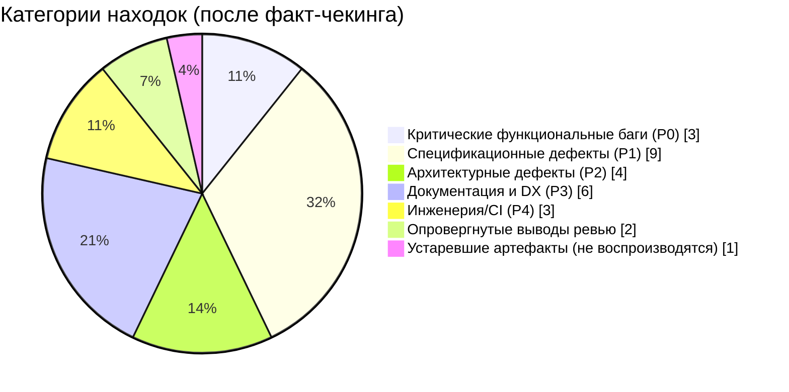
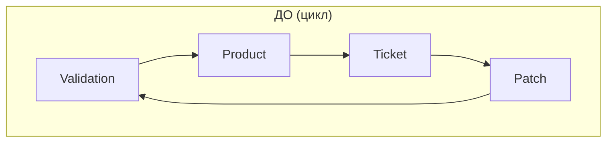
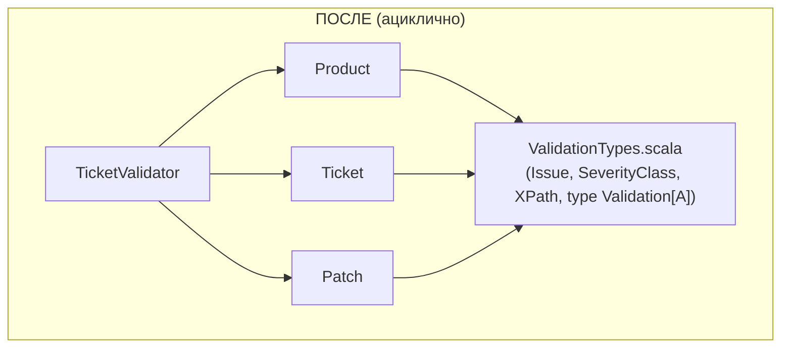
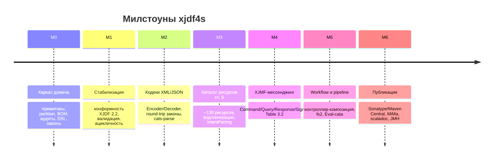
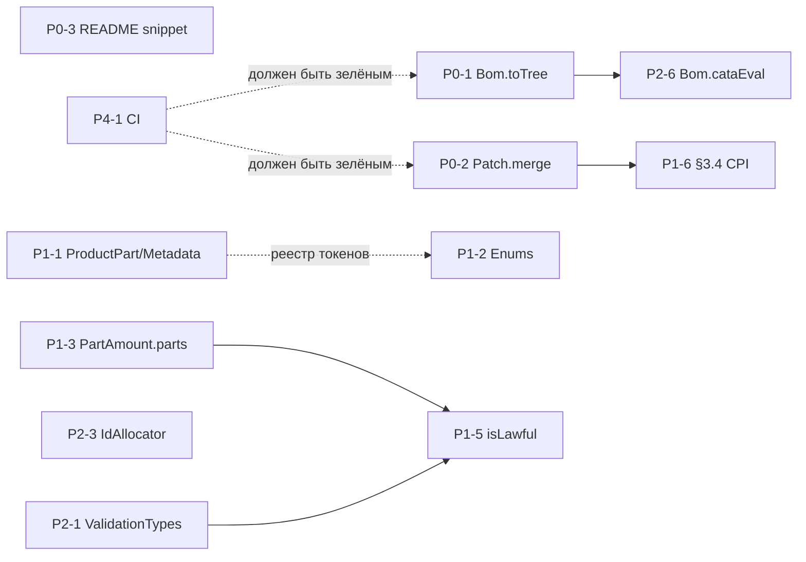

# ROADMAP — xjdf4s

> **XJDF 2.2** domain model for **Scala 3.8.4** / **sbt 2.0.2** / **cats 2.13.0**.
>
> Единственный источник истины — документация [`./reference/xjdf/*`](./reference/xjdf);
> любое решение сверяется со спецификацией (главы, таблицы, разделы указаны в
> scaladoc и в этом документе). Предположения без ссылки на `./reference/*` — баги.
>
> Документ самодостаточен: для понимания не требуется контекст отдельной сессии
> ревью. Исходные аудиты и предложения хранятся в [`./review/`](./review)
> (`REVIEW-{A,B,C}.md`, `PROPOSAL-{A,B,C}.md`, `DEPENDENCY-{REPORT,DIAGRAM}.md`)
> и три консолидированных плана — `PLAN-A.md`, `PLAN-B.md`, `PLAN-C.md`.
> Этот ROADMAP заменяет их как исполнительный документ.

---

## Оглавление

1. [Видение и не-цели](#1-видение-и-не-цели)
2. [Текущее состояние — милстоун M0](#2-текущее-состояние--милстоун-m0)
3. [Сводный вердикт аудиторов и факт-чекинг](#3-сводный-вердикт-аудиторов-и-факт-чекинг)
4. [Архитектурные решения (ADR)](#4-архитектурные-решения-adr)
5. [Поэтапный план M1 (P0–P4)](#5-поэтапный-план-m1-p0p4)
6. [Дорожная карта M2–M6](#6-дорожная-карта-m2m6)
7. [Граф зависимостей между задачами](#7-граф-зависимостей-между-задачами)
8. [Матрица трассируемости](#8-матрица-трассируемости)
9. [Критерии приёмки (Definition of Done)](#9-критерии-приёмки-dod)
10. [Риски и открытые вопросы](#10-риски-и-открытые-вопросы)
11. [Конвенции вклада](#11-конвенции-вклада)
12. [Ссылки](#12-ссылки)

---

## 1. Видение и не-цели

**Цель.** Дать декларативное, типобезопасное и *законосообразное* описание
XJDF: тикет, который невозможно построить невалидным молча; алгебраические
структуры, которые можно проверять свойствами; категориальный взгляд, в
котором тикет — морфизм, `ProductList` — начальная алгебра, `AuditPool` —
свободный моноид, а change order — действие моноида эндоморфизмов
(детали: [`docs/01-category-theory-view.md`](./docs/01-category-theory-view.md)).

**Не-цели (сейчас).** Сериализация/десериализация в XML/JSON, XJMF-сообщения
(глава 7), транспорт — это отдельные модули-милстоуны (M2–M6); ядро остаётся
«чистым» доменом.

**Определение готовности этапа (общее).**

- собирается: `sbt compile`, `sbt test`, `sbt examples/run` на sbt 2.0.2 /
  Scala 3.8.4 без предупреждений
  `-Wunused:all -Wvalue-discard -Wnonunit-statement`;
- каждая новая структура покрыта свойством-законом или тестом-примером из
  спецификации;
- scaladoc каждого нового типа ссылается на таблицу/раздел `./reference/xjdf/*`.

---

## 2. Текущее состояние — милстоун M0

M0 «Каркас домена» реализован и покрыт тестами. Сводка покрытия:

| Область | Что есть | Ссылка на спецификацию |
|---|---|---|
| Примитивы | NmToken(s), Id/IdRef(s), JobId/JobPartId/ProjectId, XjdfString, LanguageTag, Url, XPath, IcsVersion, XjdfVersion, XYPair, Shape, Rectangle, Matrix, Points/Microns/Grammage, Amount, Coverage, UnitInterval, Severity (§5.3.4.1), IntegerRange (§1.10.2), LabColor/CMYKColor/RGBColor, FloatList/IntegerList, AmountRange, Timestamp/TimeSpan/TimeRange | Appendix A; §1.10.2; §2.6.5 |
| Перечисления | 40+ закрытых enum с токенами из таблиц | Appendix A.2 |
| Partition | PartitionKey (27 ключей), `ValueOf` (match type), `Part` (Semigroup overlay, `matches`/`mergeWith`), `PartBuilder` | Table 6.4; §6.1.3.2–3 |
| Amounts | AmountPool/PartAmount/PartWaste | Tables 6.2–6.5 |
| Resource | ProcessType/ProcessPath/ProcessIndex, ResourceSet (+key, select), Resource | §3.4, §5.2, Table 6.1 |
| Resources | Media, Component, RunList(+ByteMap), NodeInfo, Contact(+Address/Person/Company/ComChannel), DeliveryParams(+DropItem), CuttingParams(+CutBlock), FoldingParams(+Fold/Perforate), Layout, Color, Preview, Device | Chapter 6 |
| Product | Product, ProductList, ProductTree/Fix/Bom (катаморфизм), Intent/IntentName | §3.3, Chapter 4 |
| Intents | BindingIntent (+7 деталей, union `BindingDetails`), MediaIntent, LayoutIntent, ColorIntent(+SurfaceColor), ProductionIntent, FoldingIntent, VariableIntent, AssemblingIntent(+4 вида вложений) | Chapter 4 |
| Audit | Audit (5 видов), AuditPool (Semigroup), Header/Notification/ProcessRun/ResourceInfo/DeviceInfo/Event/Milestone, Signal/Pulse, `Alignment` (FunctionK, Table 3.2) | §3.2; Tables 3.3–3.9, 7.3, 7.53, 7.67, 8.49 |
| Ticket | XJDF, WorkstepKey (named tuple), ChangeOrder (intersection), `TicketValidator` (12 проверок) | §3.1; §2.2.2–3 |
| Change orders | Patch (моноид Endo, действие на тикеты), `mergeResourceSets` (`Ior`) | §1.3.2 |
| ID | IdSource (State), IdAllocator (context function) | §2.2.3 |
| DSL | `dsl.*`: ticket/resourceSet/product/intent/audit-конструкторы → `ValidatedNec` | — |
| Примеры | Example 3.1, 3.4, 3.6, 5.2, 3.3 + brochure job + change order | Chapter 3/5 |
| Законы | Semigroup (Part/AmountPool/AuditPool), Semilattice (AmountRange), Monoid (TimeSpan/Matrix/Patch поведенчески), естественность `Alignment.snapshot`, семантика выборки §6.1.3.2, валидация тикетов | `modules/laws` |

M1 закрывает пробелы M0, выявленные тремя независимыми аудитами.

---

## 3. Сводный вердикт аудиторов и факт-чекинг

Три ревью (`REVIEW-A/B/C`) и три предложения (`PROPOSAL-A/B/C`) были
перекрёстно проверены по исходному коду `modules/*` и эталонам
`./reference/*`. Ниже — консолидированный результат.

### 3.1 Итоги факт-чекинга



### 3.2 Подтверждённые находки

| ID | Находка | Источник | Верификация по коду/спеке |
|---|---|---|---|
| **FC-02** | `Bom.toTree` ложно детектирует циклы | REVIEW-C R-02 | `Product.scala:151` — в `seen` кладётся ID **ребёнка** (`c.id`), а не текущего узла; развёртка любого BOM со `@ChildRefs` падает. |
| **FC-11** | `Patch.mergeResourceSets` дублирует конфликтующие сеты вместо замещения | REVIEW-B R3.2 | `Patch.scala:76` — `ticket.resourceSets ++ update`; старый и новый `ResourceSet` остаются вместе, нарушая §3.4. |
| **FC-13** | README-сниппет `.flatMap(_.build)` не компилируется | REVIEW-B R4 | `Validated` не монада; у неё нет `flatMap` (есть `andThen`). |
| **FC-05** | `Part/@ProductPart` имеет тип `IdRef`, спека требует `NMTOKEN` | REVIEW-A §1.2 | `Partition.scala:137`: `productPart: Option[IdRef]`; Table 6.4: `NMTOKEN` (deprecated 2.1). |
| **FC-06** | `Part/@Metadata` имеет тип `NmToken`, спека требует `regExp` | REVIEW-A §1.3 | `Partition.scala:130`: `metadata: Option[NmToken]`; `NmToken` запрещает пробелы и regex-символы. |
| **FC-07** | 7 ссылок на таблицы в scaladoc путают раздел и таблицу | REVIEW-A §2.1 | `Color.scala:7` (6.14→6.27), `Finishing.scala:9/44` (6.25→6.53, 6.36→6.74), `Layout.scala:8` (6.52→6.95), `Media.scala:8` (6.57→6.114), `NodeInfo.scala:7` (6.59→6.119), `Preview.scala:8` (6.66→6.134). |
| **FC-08** | `Sides` без `Unprinted`; `DeviceStatus` без `Cleanup`, `Setup` | REVIEW-B R2.1–2.2 | `Enums.scala:49–54` (4 из 5); `Enums.scala:109–114` (5 из 7). Table A.40 / Table A.15. |
| **FC-09** | `HardCoverJacket.Glued` — токен `"Glued"`, спека: `"Glue"` | REVIEW-B R2.3 | `Enums.scala:514–515`; Table 4.11. |
| **FC-10** | `PartAmount.parts` смоделирован одиночным `part: Part` | REVIEW-B R2.5 | `Amounts.scala:39`: `part: Part = Part.empty`; Table 6.3: `Part*` (0..*). |
| **FC-12** | `ChangeOrder = XJDF & Partial` вырожден | REVIEW-A §3.1 | `Ticket.scala:41` — `XJDF extends Partial`; строка 118 — `type ChangeOrder = XJDF & Partial`. Раз `XJDF <: Partial`, пересечение ≡ `XJDF`. |
| **FC-14** | `docs/03` ошибочно утверждает, что `Validated.andThen` не компилируется | REVIEW-B R4 | `Validated.andThen` существует в cats 2.13.0 и используется в `dsl.intent`. |
| **FC-15** | `Part.matches` названо предпорядком (транзитивным) — неверно | REVIEW-A §3.5 | Контрпример: `{Side=Front} ≼ {} ≼ {Side=Back}`, но `{Side=Front} ⋭ {Side=Back}`. Это отношение совместимости (рефлексивно + симметрично, не транзитивно). |
| **FC-16** | Цикл зависимостей `Validation ⇄ Product ⇄ Ticket ⇄ Patch` | DEPENDENCY-REPORT | 4 файла в цикле; нарушает ацикличность пакета `model`. |
| **FC-17** | `isLawful` и BOM-целостность не вызываются валидатором | REVIEW-B R2.6 | `BindingIntent.isLawful`, `VariableIntent.isLawful`, `Bom.fromProductList` и др. определены, но `TicketValidator` их не вызывает. |
| **FC-18** | Проверка уникальности ResourceSet (§3.4) не учитывает пересечение CPI | REVIEW-B R2.4 | `groupBy(_.key)` сверяет только точное равенство; пропускает `[0]` vs `[0,1]` и «common» (без CPI). |
| **FC-19** | `DropItem` не содержит `TotalDimensions/Volume/Weight` | REVIEW-C R-11 | Table 6.55 задаёт эти опциональные поля. |
| **FC-20** | `Notification` без `@ModuleID` и правила Milestone ⇒ Class="Event" | REVIEW-B R2.10 | Table 8.49. |
| **FC-21** | `Resource.specific` обязателен, хотя Table 6.1 допускает `<Resource/>` | REVIEW-B R2.7 | `Resource.scala:217`: `specific: ResourcePayload` (не `Option`). |
| **FC-22** | `IdAllocator`/`WithIds`/`IdSource` — мёртвый код | REVIEW-A §3.2 | `IdSource.scala` изолирован (Fan-In 0); DSL конструкторы его не используют. |
| **FC-23** | `PartBuilder.set` бросает `IllegalArgumentException` без `unsafe`-префикса | REVIEW-C R-18 | `Partition.scala:422–462`; нарушает принцип 5 (`docs/04`). |
| **FC-24** | Нет `.github/workflows/ci.yml` и `LICENSE` | REVIEW-C §4 | Каталог `.github/workflows` отсутствует; файла `LICENSE` нет (блокирует M6/Sonatype). |
| **FC-25** | `NamedColor` — закрытый enum, спека — открытый список | REVIEW-A §2.2 | Appendix A.2.30 ссылается на внешний список `[Color Names]` (напр. `Pantone 123 C`). |
| **FC-26** | `Header/@ID` включён в документный ID-скоуп (не должен) | REVIEW-A §2.3 | `Ticket.scala:74–76`: `origin.id` в `declaredIds`; Table 7.3 область уникальности — мессенджинговая. |
| **FC-27** | `XJDF/@Name` отсутствует в модели | REVIEW-B R2.10 | `Ticket.scala:24–42`; Table 3.1. |
| **FC-28** | `AmountRange.meet/join` расходятся с документацией | REVIEW-A §3.3 | `meet.amount` = `stricterMin` (берёт **большее**), doc обещает «меньше обещанное»; `join` сужает интервал, хотя заявлен как расширение. |
| **FC-29** | `Show[Part]` печатает `OptionKey` вместо спецификационного `Option` | REVIEW-C R-07 | `Partition.scala:131`: поле `optionKey`; спека: атрибут `Option`. Нужен реестр `attributeName`. |
| **FC-30** | Битые ссылки в `docs/02` и `docs/01` | REVIEW-B §4 | `docs/02` → `03-cats.md` (файл называется `03-cats-mapping.md`); `docs/01 §1` ссылается на «Part 1 – its-all-about-morphisms» (файл в Part 3). |

### 3.3 Опровергнутые и устаревшие выводы

Эти пункты из ревью **не входят** в план как дефекты — важно не тратить на них работу:

| ID | Утверждение ревью | Вердикт факт-чекинга |
|---|---|---|
| **FR-01** | «`Monoid[ValidatedNec[Issue, Unit]]` не существует, `checks.combineAll` не компилируется» (REVIEW-C R-01; PLAN-A P0-1, PLAN-B P0.1) | ❌ **Опровергнуто.** cats предоставляет `implicit def catsDataMonoidForValidated[E: Semigroup, A: Monoid]`. `NonEmptyChain[Issue]` имеет `Semigroup`, `Unit` — `Monoid`, поэтому инстанс синтезируется автоматически. Кастомный `given` **не добавлять** — он вызовет конфликт implicit-разрешения. Выводы PLAN-A/PLAN-B по этому пункту отменяются. |
| **FR-02** | «`IntegerRange.indices` не обрабатывает нисходящие диапазоны» (REVIEW-C R-03) | ❌ **Опровергнуто.** Текущий код (`Quantity.scala`) корректно строит `(lo to hi by -1)` для нисходящих. Требуется лишь переименование `lo`/`hi` → `clampedFrom`/`clampedTo` для читаемости (P2-2). |
| **FR-03** | «`build.log` закоммичен с красным тестом» (REVIEW-A §1.1) | ⚠️ **Не воспроизводится.** В текущем срезе `build.log` ни в индексе, ни в дереве; `*.log` в `.gitignore`. Действий не требуется (контроль P4-2). |

### 3.4 Уровни приоритета

| Приор. | Смысл |
|---|---|
| **P0** | Функциональный блокер: ломает корректность ядра или примеры спецификации |
| **P1** | Нарушение конформности XJDF 2.2 (типы, кардинальности, enum, валидация) |
| **P2** | Архитектура, алгебры, дизайн API, мёртвый код |
| **P3** | Документация, категориальная строгость, Developer Experience |
| **P4** | Инженерия, CI/CD, гигиена репозитория |

---

## 4. Архитектурные решения (ADR)

Ключевые развилки, зафиксированные до начала кодирования M1. Нумеруются как
`ADR-00xx`; каталог живёт в [`docs/adr/`](./docs/adr) (создаётся в P3).

### ADR-0001: Дизайн ChangeOrder и статус типа `Partial`

- **Проблема:** `type ChangeOrder = XJDF & Partial` при `XJDF extends Partial`
  семантически вырождено (`XJDF & Partial ≡ XJDF`) и не несёт типобезопасности.
- **Решение:**
    1. В рамках M1 изменение тикета моделируется моноидом эндоморфизмов
       `Patch: XJDF => XJDF` с действием `applyTo` (уже есть).
    2. Ввести номинальный тип-обёртку для подписей патчей и будущих кодеков M2:

       ```scala
       opaque type ChangeOrder = XJDF
  
       object ChangeOrder:
         def apply(ticket: XJDF): ChangeOrder = ticket
         extension (co: ChangeOrder)
           def toTicket: XJDF = co
           def asPatch: Patch  = Patch.fromChangeOrder(co)
       ```

    3. Честно описать статус маркерного трейта `Partial` в `docs/02`.

### ADR-0002: Разрыв цикла в пакете `model`

- **Проблема:** `Validation ⇄ Product ⇄ Ticket ⇄ Patch` (4-узловой цикл).
- **Решение:** вынести базовые типы валидации в независимый фундамент:





### ADR-0003: Интеграция `IdAllocator`/`IdSource` в DSL

- **Проблема:** чистый генератор `IdSource.fresh: State[Counter, Id]` и
  контекстная функция `WithIds[A]` оторваны от конструкторов DSL.
- **Решение:**

  ```scala
  def inIds[A](body: WithIds[A]): A = IdAllocator.run(body)
  def freshId(prefix: String = "id"): WithIds[Id] = summon[IdAllocator].fresh(prefix)
  ```

  Конструкторы `dsl.product`/`dsl.resourceSet` берут `Id` из контекста при
  `id = None`. Stateful-аллокатор помечается `@threadUnsafe` с документацией
  о чистой `State`-альтернативе.

### ADR-0004: Семантика `AmountRange.meet/join`

- **Проблема:** направления `meet`/`join` для `amount` противоречат документации.
- **Решение** (полурешётка обязательств по Table 6.3):

  | Операция | `min` | `max` | `amount` |
    |---|---|---|---|
  | `meet` (ужесточение контракта) | `max(min1,min2)` | `min(max1,max2)` | `min(amount1,amount2)` |
  | `join` (оптимистичное расширение) | `min(min1,min2)` | `max(max1,max2)` | `max(amount1,amount2)` |

  Если `join` нигде не используется — переименовать в `widen` и покрыть законом.

### ADR-0005: `Part.matches` — отношение толерантности, а не предпорядок

- **Проблема:** `docs/01 §3` называет `matches` preorder (транзитивным) — ложно.
- **Решение:** переформулировать как **отношение совместимости
  (tolerance relation)**: рефлексивно + симметрично, не транзитивно.
  Добавить закон-мост:

  ```scala
  a.matches(b) == a.conflictingKeys(b).isEmpty
  ```

  и явный контрпример к транзитивности в `PartitionLaws`.

---

## 5. Поэтапный план M1 (P0–P4)

План разбит на фазы. Внутри фазы задачи можно группировать в PR; порядок фаз
последовательный (см. [граф зависимостей](#7-граф-зависимостей-между-задачами)).

### Фаза P0 — Критические функциональные блокеры

> Цель: восстановить корректность ядра и примеров спецификации.

#### P0-1. Исправить `Bom.toTree` — ложные циклы (FC-02)

**Файл:** `modules/core/src/main/scala/xjdf4s/model/Product.scala`

В `seen` должен попадать ID **текущего** узла, а не ребёнка:

```scala
private def toTree(
    product: Product,
    byId: Map[String, Product],
    seen: Set[String]
): Either[Issue, Fix[ProductTree]] =
  val currentIdOpt = product.id.map(_.value)
  currentIdOpt match
    case Some(id) if seen.contains(id) =>
      Left(Issue.error(XPath("/XJDF/ProductList"),
        s"Cycle in product structure at ID '$id'"))
    case _ =>
      val nextSeen = currentIdOpt.fold(seen)(seen + _)
      // ... обход детей с nextSeen
```

**Тесты (`TicketLaws`):** (1) двухуровневое дерево без ложного цикла;
(2) истинный цикл ⇒ `Left`; (3) `SpecExamples.notebook` разворачивается и
`Bom.totalCopies` считается.

#### P0-2. Исправить `Patch.mergeResourceSets` — замещение, а не дублирование (FC-11)

**Файл:** `modules/core/src/main/scala/xjdf4s/model/Patch.scala`

```scala
def mergeResourceSets(ticket: XJDF, update: Chain[ResourceSet])
    : Ior[NonEmptyChain[Issue], XJDF] =
  val updateKeys = update.map(_.key).toList.toSet
  val conflicts  = ticket.resourceSets.filter(rs => updateKeys.contains(rs.key))
  val retained   = ticket.resourceSets.filterNot(rs => updateKeys.contains(rs.key))
  val merged     = ticket.copy(resourceSets = retained ++ update)
  if conflicts.isEmpty then Ior.right(merged)
  else
    val issues = conflicts.map(rs =>
      Issue.warning(XPath("/XJDF/ResourceSet"),
        s"Duplicate ResourceSet key replaced: ${Show[ResourceSetKey].show(rs.key)}"))
    NonEmptyChain.fromChain(issues) match
      case Some(nec) => Ior.both(nec, merged)
      case None      => Ior.right(merged)
```

**Тест:** после merge нет дубликатов `ResourceSetKey` (property-тест).

#### P0-3. Починить README-сниппет (FC-13)

**Файл:** `README.md`

```scala
val ticket: ValidatedNec[Issue, XJDF] =
  dsl.TicketDraft.of("J1", ProcessType.Product).andThen(_.build)
```

Добавить munit-тест «README-example compiles and validates» в `TicketLaws`.

---

### Фаза P1 — Конформность XJDF 2.2

> Цель: типы, кардинальности, перечисления и валидация 1:1 со спецификацией.

#### P1-1. Типы `Part/@ProductPart` и `Part/@Metadata` (FC-05, FC-06)

**Файлы:** `prim/Tokens.scala`, `model/Partition.scala`

1. Ввести opaque `RegExp` (валидация через `java.util.regex.Pattern.compile`):

   ```scala
   opaque type RegExp = String
   object RegExp:
     def from(raw: String): Option[RegExp] =
       try Some(raw).filter(_.nonEmpty)
          .tapEach(java.util.regex.Pattern.compile)
       catch case _: java.util.regex.PatternSyntaxException => None
     def unsafe(raw: String): RegExp = from(raw).getOrElse(
       throw IllegalArgumentException(s"Invalid RegExp: '$raw'"))
     extension (r: RegExp) def value: String = r
   ```

2. `productPart: Option[NmToken]` (вместо `IdRef`); `metadata: Option[RegExp]`.
3. `PartitionValue.ProductRef(value: NmToken)`, `PartitionValue.RegExpVal(value: RegExp)`.
4. `ValueOf`: `ProductPart.type => NmToken`, `Metadata.type => RegExp`.
5. Конструктор `byProductPart(value: NmToken)` вместо `byProductRef`.

#### P1-2. Дополнить enum Appendix A и исправить токен (FC-08, FC-09)

**Файл:** `prim/Enums.scala`

```scala
enum Sides extends XjdfEnum:
  case OneSided, OneSidedBack, TwoSidedHeadToFoot, TwoSidedHeadToHead, Unprinted

enum DeviceStatus extends XjdfEnum:
  case Cleanup, Idle, NonProductive, Offline, Production, Setup, Stopped

enum HardCoverJacket extends XjdfEnum:
  case Unjacketed, Loose, GlueApplied
  def token: NmToken = this match
    case Unjacketed  => NmToken.unsafe("None")
    case Loose       => NmToken.unsafe("Loose")
    case GlueApplied => NmToken.unsafe("Glue")
```

Property-тест: для каждого enum `all.map(_.token.value).toSet` совпадает с
золотым множеством из таблицы.

#### P1-3. Кардинальность `PartAmount.parts: Chain[Part]` + полный §6.1.2.1 (FC-10)

**Файлы:** `model/Amounts.scala`, `model/Validation.scala`

```scala
final case class PartAmount(
    amount: Option[Amount] = None,
    maxAmount: Option[Amount] = None,
    minAmount: Option[Amount] = None,
    waste: Option[Amount] = None,
    parts: Chain[Part] = Chain.empty,
    partWaste: Chain[PartWaste] = Chain.empty
):
  def part: Option[Part] = parts.headOption
```

`checkPartAmountKeys` проверяет **все** родительские `Part` и оба правила
Table 6.3 (ключ не переопределяет однозначно заданный; при совпадении ключей
значение — одно из родительских).

#### P1-4. 7 ссылок на таблицы в scaladoc (FC-07)

**Файлы:** `resources/{Color,Finishing,Layout,Media,NodeInfo,Preview}.scala`

| Файл | Было | Стало |
|---|---|---|
| `Color.scala:7` | Table 6.14 | **Table 6.27** |
| `Finishing.scala:9` (CuttingParams) | Table 6.25 | **Table 6.53** |
| `Finishing.scala:44` (FoldingParams) | Table 6.36 | **Table 6.74** |
| `Layout.scala:8` | Table 6.52 | **Table 6.95** |
| `Media.scala:8` | Table 6.57 | **Table 6.114** |
| `NodeInfo.scala:7` | Table 6.59 | **Table 6.119** |
| `Preview.scala:8` | Table 6.66 | **Table 6.134** |

#### P1-5. Подключить `isLawful` и BOM-целостность к `TicketValidator` (FC-17)

**Файл:** `model/Validation.scala`

Ввести шину `trait Lawful { def localIssues: Chain[Issue] }` и единый обход
дерева тикета. Подключить:

1. `Product.hasLawfulAmounts` (`checkProductAmounts`);
2. `Bom.fromProductList` (`checkBomIntegrity` — ацикличность и валидность `@ChildRefs`);
3. `PartWaste.isLawful` (`@ModuleIDs` или `@WasteDetails`);
4. `BindingIntent.isLawful`, `VariableIntent.isLawful` и др.

#### P1-6. Полная проверка уникальности ResourceSet по §3.4 (FC-18)

**Файл:** `model/Validation.scala`

```scala
private def cpiOverlap(
    a: Option[NonEmptyChain[ProcessIndex]],
    b: Option[NonEmptyChain[ProcessIndex]]
): Boolean =
  (a, b) match
    case (None, _) | (_, None) => true        // без CPI = применяется ко всем
    case (Some(x), Some(y)) =>
      x.toChain.toList.map(_.value).toSet
        .intersect(y.toChain.toList.map(_.value).toSet).nonEmpty

// конфликт пары: равные name/usage/processUsage + пересечение CPI
```

#### P1-7. Дополнить `DropItem`, `Notification`, `Resource.specific` (FC-19, FC-20, FC-21)

**Файлы:** `resources/Delivery.scala`, `model/Header.scala`, `model/Resource.scala`,
`examples/SpecExamples.scala`

```scala
final case class DropItem(
    amount: Long,
    itemRef: IdRef,
    totalDimensions: Option[Shape] = None,
    totalVolume: Option[Double] = None,
    totalWeight: Option[Double] = None)

final case class Notification(
    classification: SeverityClass,
    jobId: Option[JobId] = None,
    jobPartId: Option[JobPartId] = None,
    moduleId: Option[NmToken] = None,       // @ModuleID (Table 8.49)
    queueEntryId: Option[NmToken] = None,
    detail: Option[NotificationDetail] = None,
    parts: Chain[Part] = Chain.empty,
    comments: Chain[Comment] = Chain.empty
):
  def isLawful: Boolean = detail match
    case Some(_: Milestone) => classification == SeverityClass.Event
    case _                  => true

// Resource:
final case class Resource(specific: Option[ResourcePayload] = None, ...)
```

Обновить `SpecExamples.combinedProcesses` под literal Example 3.6.

#### P1-8. `NamedColor` → открытый тип + `Catalog` (FC-25)

**Файлы:** `prim/Enums.scala`, `prim/Common.scala`

`NamedColor` из закрытого enum becomes `NmToken` + объект `Catalog.NamedColor`
с рекомендуемыми значениями (по аналогии с `ContactType`, `PrintingTechnology`).

#### P1-9. Исключить `Header/@ID` из документного ID-скоупа (FC-26)

**Файлы:** `model/Ticket.scala`, `model/Audit.scala`, `model/Validation.scala`

Убрать `origin.id` из `declaredIds`; сделать `references` полным
(IDREF из `AuditResource/ResourceInfo`). Тест: два аудита с одинаковым
`Header/@ID` и разным `@Time` валидны.

#### P1-10. Добавить пропущенные поля `XJDF/@Name` (FC-27)

**Файл:** `model/Ticket.scala`

`XJDF` += `name: Option[XjdfString]` (Table 3.1).

#### P1-11. Согласовать семантику `AmountRange.meet/join` (FC-28)

**Файл:** `prim/Quantity.scala`

Реализовать направления по [ADR-0004](#adr-0004-семантика-amountrangemeetjoin);
покрыть `SemilatticeTests`/собственным законом в `AlgebraLaws`.

#### P1-12. Реестр спецификационных токенов (FC-29)

**Файлы:** `model/Partition.scala`, `prim/Enums.scala`

Ввести `PartitionKey.attributeName: String` (например `OptionKey → "Option"`);
`Show[Part]` и кодеки M2 используют его вместо имени Scala-поля.

---

### Фаза P2 — Архитектурная стабилизация

> Цель: ацикличный `model`, живые алгебры, типобезопасные API.

#### P2-1. Разорвать цикл зависимостей (FC-16, ADR-0002)

**Новый файл:** `model/ValidationTypes.scala`

Перенести `Issue`, `SeverityClass`, `XPath`, тип-алиас
`type Validation[A] = ValidatedNec[Issue, A]`. `Product`/`Ticket`/`Patch`
зависят только от него; `TicketValidator` — корень сбора проверок.

#### P2-2. Рефакторинг `IntegerRange` — имена переменных (FR-02)

**Файл:** `prim/Quantity.scala`

`lo`/`hi` → `clampedFrom`/`clampedTo`. Логика не меняется (нисходящие
диапазоны уже работают); добавить регрессионный тест `-1 0 selects reversed`.

#### P2-3. Подключить `IdAllocator`/`IdSource` к DSL (FC-22, ADR-0003)

**Файлы:** `dsl/XjdfDsl.scala`, `model/IdSource.scala`

Добавить `inIds`/`freshId`; конструкторы берут ID из контекста при `id = None`.
Законы уникальности последовательности — в `laws`.

#### P2-4. Безопасный API `PartBuilder` (FC-23)

**Файл:** `model/Partition.scala`

- `setSafe(key, value): Either[Issue, Part]`;
- `setUnsafe(key, value): Part` (явный маркер выброса исключения);
- старый `set` удалить или сделать `unsafe`-синонимом.

#### P2-5. Усилить алгебраические типы

**Файлы:** `prim/Quantity.scala`, `prim/Time.scala`

- `XYPair`, `TimeSpan`: `CommutativeMonoid` вместо `Monoid`;
- `Matrix`: задокументировать `Monoid` + `inverse: Option[Matrix]` (группа Ли
  с частичным обращением; для вырожденных матриц `inverse = None`).
- Покрыть discipline-style законами.

#### P2-6. Стек-безопасный `Bom.cata` на `Eval`

**Файл:** `model/Product.scala`

```scala
def cataEval[A](algebra: ProductTree[A] => Eval[A])(tree: Fix[ProductTree]): Eval[A] =
  tree.unfix match
    case ProductTree.Leaf(p) => algebra(ProductTree.Leaf(p))
    case ProductTree.Node(p, kids) =>
      kids.traverse(cataEval(algebra)).flatMap(cs =>
        algebra(ProductTree.Node(p, cs)))
```

Для глубоких BOM (500+ уровней) — без `StackOverflowError`.

#### P2-7. Вынести не-примитивы из `prim/Common.scala`

`Comment`, `GeneralID`, `Event`, `Milestone`, `Dependent`, `FileSpec`,
`Disposition` — элементы глав 3/8, а не примитивы. Перенести в
`model/Elements.scala`.

---

### Фаза P3 — Документация, категориальная строгость, DX

> Цель: точная теория, самопроверяемые примеры, реестр покрытия спеки.

#### P3-1. Исправить `docs/01` — `matches` как tolerance relation (FC-15, ADR-0005)

Заменить «preorder/тонкая категория» на «отношение совместимости»;
добавить диаграмму отношений наложения и полурешёток `AmountRange`;
контрпример к транзитивности в `PartitionLaws`.

#### P3-2. Актуализировать `docs/02` — статус `Partial` и ChangeOrder (FC-12)

Честно описать маркерный трейт `Partial` и переход к nominal opaque
`ChangeOrder` по ADR-0001.

#### P3-3. Исправить `docs/03` — тезис про `.andThen` (FC-14)

Удалить ошибочное утверждение; привести канонический пример
`Validated.andThen` последовательной валидации.

#### P3-4. Починить битые ссылки в docs (FC-30)

- `docs/02` → `03-cats-mapping.md`;
- `docs/01 §1` → корректная часть «its-all-about-morphisms» (Part 3).

#### P3-5. Каталог ADR

Создать `docs/adr/` с записями `0001-changeorder-design`,
`0002-dependency-cycle`, `0003-id-allocator-dsl`, `0004-amountrange-semilattice`,
`0005-matches-tolerance`.

#### P3-6. Реестр покрытия спецификации

Новый документ `docs/SPEC-COVERAGE.md`: таблица
`Раздел XJDF → Таблица → Scala-тип → Статус покрытия`. Обновляется в каждом PR.

#### P3-7. Golden-тесты примеров спецификации

Перенести валидацию всех примеров (`minimalProduct`, `notebook`,
`combinedProcesses`, `splitDelivery`, `brochureJob`) в регулярный сьют
`TicketLaws`; зафиксировать `Show`-вывод как golden-литералы.

#### P3-8. ADR по неточностям категориальной метафоры

Пометить в `docs/01 §7` «сопряжение Intent↔Resource» как эвристику/аналогию
(не строгая adjunction); «свободный моноид» для `NonEmptyChain`-носителей
уточнить до «свободной полугруппы» (`NonEmptyChain` не имеет нейтрального).

---

### Фаза P4 — Инженерная инфраструктура

> Цель: непрерывная верификация и воспроизводимость сборки.

#### P4-1. GitHub Actions CI

**Новый файл:** `.github/workflows/ci.yml`

```yaml
name: CI
on:
  push:
    branches: [ "main", "develop", "arena/**" ]
  pull_request:
    branches: [ "main", "develop" ]
jobs:
  build:
    runs-on: ubuntu-latest
    steps:
      - uses: actions/checkout@v4
      - name: Set up JDK 21
        uses: actions/setup-java@v4
        with: { java-version: '21', distribution: 'temurin', cache: 'sbt' }
      - name: Compile
        run: sbt -batch compile
      - name: Test
        run: sbt -batch test
      - name: Format check
        run: sbt -batch scalafmtCheckAll
      - name: Examples
        run: sbt -batch examples/run
```

#### P4-2. Гигиена VCS

Контроль: `*.log` в `.gitignore` (уже есть), `build.log` не отслеживается
(подтверждено). Коммиты по конвенции `M<n>: …`.

#### P4-3. LICENSE

Добавить `LICENSE` (Apache License 2.0) — требуется для публикации M6/Sonatype.

---

## 6. Дорожная карта M2–M6



### M2 — Кодеки: XML и JSON

Спецификация: §1.4 (два кодирования), §1.4.2 и §9.10 (JSON/REST),
«JSON Exception»-заметки; схема — `./reference/xjdf/schema.xsd`.

- `xjdf4s-codec-core`: `Encoder[A]`/`Decoder[A]` как typeclasses с законами
  (round-trip `decode ∘ encode = id`).
- `xjdf4s-codec-xml`: scala-xml, namespace `http://www.CIP4.org/JDFSchema_2_0`,
  порядок элементов (лексическая сортировка §1.3.5.1; Specific Resource
  последним, Table 6.1), foreign namespaces (§3.5).
- `xjdf4s-codec-json`: маппинг §1.4.2; `$schema`, `Name`, `AuditPool` массивом,
  `Comment/@Text`, `Types` массивом.
- Парсеры атомарных типов (XYPair, matrix, rectangle, dateTime/duration,
  LabColor, PDFPath, TransferFunction) на cats-parse с round-trip свойствами.
- **DoD:** каждый пример кодируется в XML и JSON и round-trip-ится без потерь.

> Зависимость: M2 начинается **после** P0–P1 (иначе ошибки типов
> зацементируются в wire-формате).

### M3 — Полный каталог ресурсов главы 6

- Перенести оставшиеся ~130 ресурсов алфавитными партиями (case class +
  Option/Chain + scaladoc-таблица + тест «строится и валидируется»).
- `Intent Pairing` из шапки раздела и привязка к процессам главы 5 — как
  типовой реестр `Process/…InputResources`.
- Парсер-генератор «таблица → тип» поверх `./reference/xjdf/*.md`.
- **DoD:** счётчик покрытия 100% в README; отчёт «таблица → тип».

### M4 — XJMF (глава 7), пакет `messaging`

- `XJMF`, `Header` (переиспользовать), 4 семейства Query/Command/Response/Signal
  как enum-иерархия (§1.5.6.2).
- Продолжить Alignment Table 3.2: CommandReturnQueueEntry → AuditProcessRun.
- REST-клеящий слой §9.10.3 на эффекте `Kleisli[F, *]`, транспорт изолирован.
- **DoD:** обмены из примеров главы 7 компилируются и валидируются.

### M5 — Workflow и категориальные демонстрации

- Процессные сети вне одного тикета (Controller-композиция, §2.4, §9.3):
  типы «конвейер тикетов» с проверкой стыковки output→input ResourceSet.
- `PipeControl`/`Dependent` — overlap-обработка (§3.4.1, §7.11).
- Writer-семантика аудитов на потоке сигналов (`fs2`/`WriterT`).
- Стек-безопасные свёртки BOM (`Eval`-cata, см. P2-6).
- **DoD:** end-to-end пример MIS → Device → аудиты → change order → повтор.

### M6 — Публикация и качество

- Публикация `xjdf4s-core`, `xjdf4s-laws`, `xjdf4s-codec-*` в Sonatype/Maven
  Central; semver, MiMa для ядра (через `sbt-typelevel`).
- Scaladoc-сайт; примеры как type-checked docs.
- Бенчмарки (валидация, кодеки) — JMH.
- Дорожная проверка реальными XJDF из CIP4-репозитория.

---

## 7. Граф зависимостей между задачами



Ключевые зависимости:

- **P4-1 (CI)** стоит поднять как можно раньше, чтобы каждая последующая задача
  верифицировалась автоматически; до него первый прогон `sbt` — вручную.
- **P2-1 (ValidationTypes)** предваряет P1-5: шина `Lawful` зависит от
  ацикличной модели.
- **P0-2 (Patch.merge)** предваряет P1-6 (§3.4 CPI): обе про уникальность
  ResourceSet, но на разных уровнях.
- **M2** стартует только после закрытия P0–P1.

---

## 8. Матрица трассируемости

| Находка | Источник ревью | Задача | Файлы | Приор. |
|---|---|---|---|---|
| BOM ложные циклы | REVIEW-C R-02 | **P0-1** | `model/Product.scala` | **P0** |
| Patch дублирует сеты | REVIEW-B R3.2 | **P0-2** | `model/Patch.scala` | **P0** |
| README `.flatMap` | REVIEW-B R4 | **P0-3** | `README.md` | **P0** |
| ProductPart: IdRef→NmToken | REVIEW-A §1.2 | **P1-1** | `model/Partition.scala` | P1 |
| Metadata: NmToken→RegExp | REVIEW-A §1.3 | **P1-1** | `prim/Tokens.scala`, `model/Partition.scala` | P1 |
| Sides/DeviceStatus/HardCoverJacket | REVIEW-B R2.1–2.3 | **P1-2** | `prim/Enums.scala` | P1 |
| PartAmount.parts кардинальность | REVIEW-B R2.5 | **P1-3** | `model/Amounts.scala`, `model/Validation.scala` | P1 |
| 7 ссылок на таблицы | REVIEW-A §2.1 | **P1-4** | `resources/*.scala` | P1 |
| isLawful не подключены | REVIEW-B R2.6 | **P1-5** | `model/Validation.scala`, `intents/*` | P1 |
| §3.4 CPI overlap | REVIEW-B R2.4 | **P1-6** | `model/Validation.scala` | P1 |
| DropItem/Notification/Resource.specific | REVIEW-B R2.7/R2.10, C R-11 | **P1-7** | `resources/Delivery.scala`, `model/Header.scala`, `model/Resource.scala` | P1 |
| NamedColor закрытый enum | REVIEW-A §2.2 | **P1-8** | `prim/Enums.scala`, `prim/Common.scala` | P1 |
| Header/@ID скоуп | REVIEW-A §2.3 | **P1-9** | `model/Ticket.scala`, `model/Audit.scala` | P1 |
| XJDF/@Name отсутствует | REVIEW-B R2.10 | **P1-10** | `model/Ticket.scala` | P1 |
| AmountRange meet/join | REVIEW-A §3.3 | **P1-11** | `prim/Quantity.scala` | P1 |
| Реестр токенов (OptionKey→Option) | REVIEW-C R-07 | **P1-12** | `model/Partition.scala` | P1 |
| Цикл зависимостей model | DEPENDENCY-REPORT | **P2-1** | `model/ValidationTypes.scala` (new) | P2 |
| IntegerRange имена | REVIEW-C R-03 | **P2-2** | `prim/Quantity.scala` | P2 |
| IdAllocator мёртвый код | REVIEW-A §3.2 | **P2-3** | `dsl/XjdfDsl.scala` | P2 |
| PartBuilder.set бросает | REVIEW-C R-18 | **P2-4** | `model/Partition.scala` | P2 |
| Алгебры (CommutativeMonoid) | REVIEW-A §3.4 | **P2-5** | `prim/Quantity.scala`, `prim/Time.scala` | P2 |
| Bom.cata stack-safety | PROPOSAL-B P-14 | **P2-6** | `model/Product.scala` | P2 |
| prim/Common не-примитивы | PROPOSAL-A §5.5 | **P2-7** | `prim/Common.scala` → `model/Elements.scala` | P2 |
| docs/01 matches/preorder | REVIEW-A §3.5 | **P3-1** | `docs/01-category-theory-view.md` | P3 |
| docs/02 Partial/ChangeOrder | REVIEW-B R3.1 | **P3-2** | `docs/02-scala3-features.md` | P3 |
| docs/03 .andThen | REVIEW-B R4 | **P3-3** | `docs/03-cats-mapping.md` | P3 |
| Битые ссылки docs | REVIEW-B §4 | **P3-4** | `docs/02`, `docs/01` | P3 |
| Каталог ADR | PROPOSAL-B P-15 | **P3-5** | `docs/adr/` | P3 |
| Реестр покрытия спеки | PROPOSAL-C | **P3-6** | `docs/SPEC-COVERAGE.md` | P3 |
| Golden-тесты примеров | PROPOSAL-A §4.4 | **P3-7** | `modules/laws`, `modules/examples` | P3 |
| Категориальные неточности | REVIEW-A §3.5 | **P3-8** | `docs/01` | P3 |
| CI отсутствует | REVIEW-C §4 | **P4-1** | `.github/workflows/ci.yml` | P4 |
| Гигиена VCS | REVIEW-A §1.1 | **P4-2** | `.gitignore` | P4 |
| LICENSE отсутствует | REVIEW-C §4 | **P4-3** | `LICENSE` | P4 |
| ~~Monoid[ValidatedNec]~~ | ~~REVIEW-C R-01~~ | **FR-01 — отклонено** | cats предоставляет инстанс | — |
| ~~IntegerRange нисходящие~~ | ~~REVIEW-C R-03~~ | **FR-02 — отклонено** (только rename P2-2) | — | — |
| ~~build.log в VCS~~ | ~~REVIEW-A §1.1~~ | **FR-03 — не воспроизводится** | — | — |

---

## 9. Критерии приёмки (DoD)

Проект считается завершившим M1 и готовым к M2 при выполнении **всех** условий:

1. **Сборка:** `sbt clean compile` и `sbt clean test` зелёные;
   `sbt examples/run` выполняется без исключений.
2. **Предупреждения:** ни одного варнинга при
   `-Wunused:all -Wvalue-discard -Wnonunit-statement`.
3. **Формат:** `sbt scalafmtCheckAll` чистый.
4. **Тесты:** все сьюты `AlgebraLaws`, `AlignmentLaws`, `PartitionLaws`,
   `TicketLaws` зелёные; каждый cats-инстанс покрыт property-тестом.
5. **BOM:** `Bom.fromProductList` разворачивает все спецификационные примеры
   со `@ChildRefs`; истинный цикл детектируется.
6. **Конформность:**
    - `Part.productPart: Option[NmToken]`, `Part.metadata: Option[RegExp]`;
    - `PartAmount.parts: Chain[Part]`;
    - `Resource.specific: Option[ResourcePayload]`;
    - все enum совпадают с Appendix A и разделами 3–8 (property-тест токенов);
    - каждая scaladoc-ссылка на таблицу верна (сверена с `./reference/xjdf/*`).
7. **Валидация:** все объявленные `isLawful` вызываются из `TicketValidator`;
   §3.4 (пересечение CPI) и §6.1.2.1 (PartAmount keys) проверяются полностью.
8. **Архитектура:** граф файлов пакета `model` ацикличен;
   `ChangeOrder` — не вырожденный intersection (ADR-0001);
   `IdAllocator` задействован в DSL; `PartBuilder` не бросает непомеченным.
9. **Документация:** `README`-пример компилируется (тест); `docs/01–03`
   актуализированы; битые ссылки устранены; каталог ADR и `SPEC-COVERAGE.md`
   ведутся.
10. **Инженерия:** `.github/workflows/ci.yml` зелёный на всех push/PR;
    `LICENSE` (Apache-2.0) присутствует; `build.log` не отслеживается.

---

## 10. Риски и открытые вопросы

| # | Риск | Вероятность | Влияние | Митигация |
|---|---|---|---|---|
| R1 | Нет доступа к JVM/sbt в среде планирования | Высокая | Высокое | Поднять CI (P4-1) первым делом; до него — ручной прогон после каждого PR |
| R2 | Изменение `Resource.specific` на `Option` ломает много вызовов | Высокая | Среднее | Механическая замена; компилятор укажет все места; обновить `SpecExamples` |
| R3 | Рефакторинг `ChangeOrder` затронет DSL и examples | Средняя | Среднее | ADR-0001 зафиксирован; opaque-обёртка сохраняет обратную совместимость на уровне значения |
| R4 | Регуляризация `PartAmount.parts` (один → цепочка) ломает `Show`/`Eq`/примеры | Средняя | Среднее | Сохранить `def part: Option[Part]` как совместимый аксессор; покрыть golden-тестом |
| R5 | Конфликт implicit при добавлении кастомного `Monoid[ValidatedNec]` | — | — | **Не добавлять** — cats предоставляет инстанс (см. FR-01) |
| R6 | Текст спеки и `schema.xsd` расходятся | Средняя | Среднее | Источник истины — текст; XSD — тест-оракул в M2; расхождения документировать в `SPEC-COVERAGE.md` |
| R7 | Глубокий BOM даёт `StackOverflowError` до P2-6 | Низкая | Среднее | Использовать `Eval`-cata (P2-6); добавить нагрузочный тест на 500+ уровней |
| R8 | Объём каталога ресурсов главы 6 (сотни таблиц) | — | — | Механический перенос партиями в M3; шаблон M0 отлажен |

**Открытые вопросы для вынесения в ADR:**

- Точная семантика `AmountRange.join` (используется ли где-либо? если нет —
  удалить или переименовать в `widen`).
- Уровень строгости ID-скоупа `Header/@ID` в зависимости от контекста
  (документный vs мессенджинговый) — нужен ли отдельный валидатор сообщений.

---

## 11. Конвенции вклада

- Один PR = один пункт фазы (или тесно связанная пара); в описании — ссылки
  на разделы `./reference/xjdf/*` и пункт этого ROADMAP (например, `P1-2`).
- Коммит-сообщения: `M<n>: краткое описание`
  (например, `M1: P1-2 add Unprinted/Cleanup/Setup enum values and Glue token`).
- Любой новый cats-инстанс — с property-тестом в `modules/laws`.
- Каждый новый тип — scaladoc со ссылкой на таблицу спеки.
- Языки: scaladoc — английский; `docs/*` и ROADMAP — русский.
- Флаги `-Wunused:all -Wvalue-discard -Wnonunit-statement` обязательны;
  предупреждения не допускаются в `develop`/`main`.
- Серьёзные дизайн-развилки фиксируются ADR в `docs/adr/` до кодирования.

---

## 12. Ссылки

**Спецификация и эталоны**

- XJDF 2.2: [`./reference/xjdf/0 – Table of Contents.md`](./reference/xjdf) …
  `Appendix H`, `schema.xsd`
- Категориальная база: [`./reference/category-theory/*`](./reference/category-theory)
- Возможности Scala 3: [`./reference/scala/docs/reference/*`](./reference/scala)
- cats: [`./reference/cats/docs/*`](./reference/cats)
- sbt: [`./reference/sbt/docs/*`](./reference/sbt)

**Дизайн-заметки проекта**

- [`docs/01-category-theory-view.md`](./docs/01-category-theory-view.md)
- [`docs/02-scala3-features.md`](./docs/02-scala3-features.md)
- [`docs/03-cats-mapping.md`](./docs/03-cats-mapping.md)
- [`docs/04-architecture.md`](./docs/04-architecture.md)

**Аудиты и планы (исходники этого ROADMAP)**

- [`review/REVIEW-A.md`](./review/REVIEW-A.md),
  [`review/REVIEW-B.md`](./review/REVIEW-B.md),
  [`review/REVIEW-C.md`](./review/REVIEW-C.md)
- [`review/PROPOSAL-A.md`](./review/PROPOSAL-A.md),
  [`review/PROPOSAL-B.md`](./review/PROPOSAL-B.md),
  [`review/PROPOSAL-C.md`](./review/PROPOSAL-C.md)
- [`review/DEPENDENCY-REPORT.md`](./review/DEPENDENCY-REPORT.md),
  [`review/DEPENDENCY-DIAGRAM.md`](./review/DEPENDENCY-DIAGRAM.md)
- [`PLAN-A.md`](./PLAN-A.md), [`PLAN-B.md`](./PLAN-B.md), [`PLAN-C.md`](./PLAN-C.md)