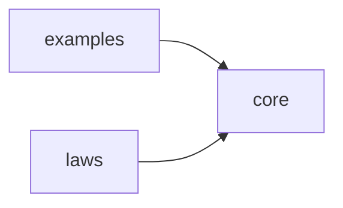
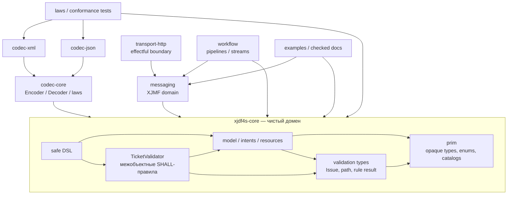
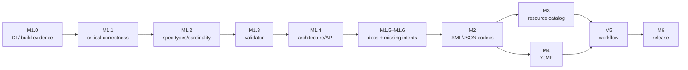

# ROADMAP — xjdf4s

> **Назначение:** единый план стабилизации и развития `xjdf4s` от текущего
> прототипа доменного ядра до публикуемой библиотеки с XML/JSON-кодеками,
> XJMF и поддержкой производственных workflow.
> **Базовый срез:** `ca29745`, 2026-08-15.
> **Технологии базового среза:** Scala 3.8.4, Cats 2.13.0, sbt 2.0.2;
> целевая JVM для CI — Temurin JDK 21.
> **Основание:** `PLAN-A.md`, `PLAN-B.md`, `PLAN-C.md`, материалы
> `review/*`, код `modules/*` и локальная копия XJDF 2.2 в `reference/xjdf/*`.
>
> Этот документ самодостаточен: для понимания целей и порядка работ читать
> планы и историю текущей сессии не требуется. Планы остаются журналом аудита,
> а `ROADMAP.md` является рабочим источником приоритетов и критериев приёмки.

---

## Содержание

1. [Видение и границы проекта](#1-видение-и-границы-проекта)
2. [Источники истины и правила принятия решений](#2-источники-истины-и-правила-принятия-решений)
3. [Базовое состояние](#3-базовое-состояние)
4. [Результат консолидации аудитов](#4-результат-консолидации-аудитов)
5. [Целевая архитектура](#5-целевая-архитектура)
6. [M1 — стабилизация и завершение доменного ядра](#6-m1--стабилизация-и-завершение-доменного-ядра)
7. [M2 — XML/JSON-кодеки](#7-m2--xmljson-кодеки)
8. [M3 — полный каталог ресурсов](#8-m3--полный-каталог-ресурсов)
9. [M4 — XJMF и транспорт](#9-m4--xjmf-и-транспорт)
10. [M5 — workflow и потоковая обработка](#10-m5--workflow-и-потоковая-обработка)
11. [M6 — релиз и эксплуатационная готовность](#11-m6--релиз-и-эксплуатационная-готовность)
12. [Зависимости между этапами](#12-зависимости-между-этапами)
13. [Стратегия тестирования](#13-стратегия-тестирования)
14. [Процесс разработки и Definition of Done](#14-процесс-разработки-и-definition-of-done)
15. [Риски и меры снижения](#15-риски-и-меры-снижения)
16. [Матрица трассируемости](#16-матрица-трассируемости)

---

## 1. Видение и границы проекта

### 1.1. Цель

`xjdf4s` должен предоставлять декларативную, типобезопасную и проверяемую
законами модель **XJDF 2.2**:

- валидный объект невозможно получить из непроверенных внешних данных без
  явного `unsafe`-перехода;
- ошибки домена накапливаются и содержат точную XPath-локализацию;
- различаются закрытые перечисления спецификации и открытые каталоги токенов;
- типы, кардинальности и wire-токены трассируются до таблиц XJDF;
- алгебраические инстансы Cats существуют только там, где их законы имеют
  понятную доменную семантику;
- XML и JSON являются разными представлениями одной нормализованной доменной
  модели, а не двумя независимыми моделями;
- чистое ядро не зависит от транспорта, файловой системы и конкретной
  библиотеки эффектов.

Итоговый пользовательский сценарий:

1. Controller строит либо декодирует XJDF.
2. `TicketValidator` возвращает все найденные нарушения.
3. Тикет кодируется в XML или JSON без потери доменной информации.
4. Device исполняет его и формирует аудиты/XJMF-сигналы.
5. Controller применяет change order как проверяемое изменение состояния.
6. Весь обмен воспроизводится в тестах на примерах спецификации и реальных
   документах.

### 1.2. Принципы

1. **Specification first.** Предположение без ссылки на `reference/xjdf/*`
   считается гипотезой, а не фактом.
2. **Parse, do not validate later.** Границы простых типов проверяются в
   фабриках/декодерах; межобъектные ограничения — корневым валидатором.
3. **Никаких скрытых исключений в safe API.** Бросающие методы имеют суффикс
   или префикс `unsafe`; обычные методы возвращают `Option`, `Either` или
   `ValidatedNec`.
4. **Законы важнее названий.** Нельзя объявлять `Monoid`, `Semilattice`,
   `Group`, preorder или adjunction только ради красивой интерпретации.
5. **Wire-формат отделён от домена.** XML namespace, JSON `Name`, порядок
   элементов и значения по умолчанию принадлежат кодекам.
6. **Совместимость расширений.** Foreign namespaces и открытые NMTOKEN-каталоги
   должны иметь явный escape hatch.
7. **Каждое SHALL — тест.** Нормативные ограничения получают негативный тест;
   SHOULD/MAY не должны ошибочно превращаться в безусловные ошибки.

### 1.3. Что не входит в ближайший этап

До завершения M1 не добавляются:

- сетевой транспорт и HTTP-клиенты;
- XJMF;
- полный каталог главы 6;
- генерация production-кода напрямую из XSD;
- обещания бинарной совместимости публичного API.

Они входят в M2–M6 и не должны «просачиваться» в `core`.

---

## 2. Источники истины и правила принятия решений

### 2.1. Приоритет источников

При расхождении источников используется следующий порядок:

1. Нормативный текст XJDF 2.2 в `reference/xjdf/1 – Introduction.md` …
   `reference/xjdf/9 – Building a System.md` и приложениях.
2. Release notes и явно помеченные изменения 2.1/2.2.
3. `reference/xjdf/schema.xsd` как структурный oracle для имён,
   кардинальностей и базовых XSD-типов.
4. Нормативные примеры спецификации.
5. Текущая реализация и документация проекта.

Если текст и XSD расходятся, решение фиксируется ADR с минимальным
воспроизводимым примером. Молчаливое следование XSD недопустимо.

### 2.2. Что означает «покрыто»

Таблица/правило считается покрытым только при наличии всех артефактов:

- доменного типа или явно задокументированного codec-only правила;
- ссылки на раздел/таблицу в Scaladoc;
- позитивного примера;
- негативного теста для каждого SHALL-инварианта;
- записи в будущем `docs/SPEC-COVERAGE.md`.

Сам факт наличия похожего `case class` не означает полное покрытие таблицы.

### 2.3. Статусы в этом документе

| Маркер | Значение |
|---|---|
| ✅ | Реализовано и подтверждено тестом/сборкой |
| 🟡 | Реализовано частично либо ещё не подтверждено воспроизводимой сборкой |
| ❌ | Подтверждённый дефект или отсутствие обязательной возможности |
| ⬜ | Запланировано |

Пункт можно пометить ✅ только после прохождения его критериев приёмки. Наличие
кода без теста или без доступного CI оставляет пункт 🟡.

---

## 3. Базовое состояние

### 3.1. Модули

```text
modules/core      — примитивы, доменная модель, ресурсы, интенты, DSL, validator
modules/laws      — munit + ScalaCheck, законы и проверки правил XJDF
modules/examples  — исполняемые примеры глав 3 и 5
```

Текущий граф верхнего уровня ацикличен:



Внутри `core` статический аудит выявил цикл между файлами
`Validation → Product → Ticket → Patch → Validation`; он закрывается в M1.4.

### 3.2. Что уже существует

Текущий M0 следует считать **функциональным прототипом**, а не завершённым
релизом. В нём присутствуют:

| Область | Реализованный фундамент | Статус |
|---|---|---|
| Простые типы | `NmToken(s)`, ID/IDREF, версии, размеры, цвета, диапазоны, время, URL/XPath и др. | 🟡 — требуется полный аудит Appendix A и codec round-trip |
| Перечисления | 40+ Scala `enum` и общие каталоги | 🟡 — найдены пропущенные и неверные токены |
| Партиционирование | 27 `PartitionKey`, `Part`, overlay `Semigroup`, выбор ресурса, runtime builder | 🟡 — два неверных типа и unsafe runtime API |
| Amounts | `PartAmount`, `PartWaste`, `AmountPool`, `AmountRange` | 🟡 — неверная кардинальность `Part*`, спорная алгебра диапазона |
| Products | `Product`, `ProductList`, BOM через `Fix[ProductTree]`, cata | ❌ — подтверждён ложный цикл в `Bom.toTree` |
| Resources | 12 specific payload-вариантов, `Resource`, `ResourceSet`, выбор по `Part` | 🟡 — каталог неполон, `specific` чрезмерно обязателен |
| Intents | 8 основных payload-вариантов и детали Binding/Assembling | 🟡 — глава 4 покрыта не полностью |
| Audits | пять видов аудита, `AuditPool`, `Header`, `Alignment` | 🟡 — нужны полный ID scope и интеграция локальных законов |
| Ticket | `XJDF`, `TicketValidator`, `Patch`, DSL | 🟡 — change order вырожден на уровне типов, validator неполон |
| Laws/examples | 4 тестовых suite, примеры 3.1/3.6/5.2 и демо | 🟡 — в базовом окружении нет JVM/CI, полный прогон не подтверждён |

### 3.3. Ограничение базовой верификации

На базовом срезе отсутствуют `java` и `sbt`, а GitHub Actions ещё не настроен.
Поэтому утверждения «компилируется» и «тесты зелёные» должны подтверждаться
первым пунктом M1, а не историческим `build.log`. Логи сборки не хранятся в Git.

---

## 4. Результат консолидации аудитов

Три плана содержат пересекающиеся выводы и несколько противоречий. Ниже
зафиксирован итог, которым следует руководствоваться при реализации.

### 4.1. Подтверждённые дефекты высокой важности

| ID | Дефект | Последствие | Этап |
|---|---|---|---|
| C-01 | `Bom.toTree` добавляет ID ребёнка в `seen` до рекурсивного входа | Валидная ссылка немедленно определяется как цикл | M1.1 |
| C-02 | `Patch.mergeResourceSets` сообщает «update wins», но сохраняет старый и новый set | После change order появляются запрещённые дубликаты | M1.1 |
| C-03 | `ProductPart` имеет `IdRef`, хотя Table 6.4 задаёт `NMTOKEN` | Искажён тип и document IDREF scope | M1.2 |
| C-04 | `Metadata` имеет `NmToken`, хотя Table 6.4 задаёт `regExp` | Нельзя выразить валидные регулярные выражения | M1.2 |
| C-05 | `PartAmount` содержит один `Part`, а Table 6.3 — `Part*` | Теряется допустимая структура документа | M1.2 |
| C-06 | Проверка ResourceSet учитывает точное равенство CPI вместо пересечения | Нарушения §3.4 проходят validator | M1.3 |
| C-07 | Локальные `isLawful` и целостность BOM не подключены к корневой валидации | Невалидный тикет может считаться валидным | M1.3 |
| C-08 | `ChangeOrder = XJDF & Partial`, при этом `XJDF extends Partial` | Пересечение эквивалентно обычному `XJDF` | M1.4 |
| C-09 | `PartBuilder.set` бросает неявный `IllegalArgumentException` | Safe API не является total | M1.4 |
| C-10 | README использует `.flatMap` на `ValidatedNec` | Минимальный пример не компилируется | M1.0 |

### 4.2. Подтверждённые расхождения со спецификацией

- `Sides` не содержит `Unprinted` (Table A.40).
- `DeviceStatus` не содержит `Cleanup` и `Setup` (Table A.15).
- `HardCoverJacket.Glued` даёт wire-токен `Glued`, но Table 4.11 требует
  `Glue`.
- `NamedColor` смоделирован закрытым enum, хотя список ссылается на внешний
  открытый каталог Color Names.
- `Resource.specific` обязателен, хотя Table 6.1 допускает Resource без specific
  child.
- `DropItem` не содержит `TotalDimensions`, `TotalVolume`, `TotalWeight`
  (Table 6.55).
- `Notification` не содержит `ModuleID` и не проверяет правило
  `Milestone ⇒ Class="Event"` (Table 8.49).
- `Header/@ID` ошибочно включён в document-scoped ID; его scope относится к
  сообщениям отправителя (Table 7.3).
- `Show[Part]`/`Show[PartitionKey]` способен печатать Scala-имя `OptionKey`
  вместо XJDF-атрибута `Option`.
- Семь Scaladoc-ссылок используют номер раздела вместо номера таблицы:
  `Color` 6.27, `CuttingParams` 6.53, `FoldingParams` 6.74, `Layout` 6.95,
  `Media` 6.114, `NodeInfo` 6.119, `Preview` 6.134.

### 4.3. Уточнённые и отклонённые находки

#### `ValidatedNec.combineAll` не требует локального `Monoid`

Добавлять собственный
`Monoid[ValidatedNec[Issue, Unit]]` **не нужно**. Cats предоставляет
`Monoid[Validated[E, A]]`, когда доступны `Semigroup[E]` и `Monoid[A]`.
Для `NonEmptyChain[Issue]` и `Unit` эти требования выполняются.

```scala
// Должно разрешаться стандартными instances Cats:
val instance = summon[Monoid[ValidatedNec[Issue, Unit]]]
```

M1 должен подтвердить это компиляцией. Если конкретная версия Cats ведёт себя
иначе, сначала фиксируется минимальный compile-test и только затем выбирается
локальный fold. Дублирующий implicit «на всякий случай» запрещён.

#### `IntegerRange(-1, 0)` уже имеет нисходящую ветку

Текущая реализация нормализует `from = -1` в последний индекс и проходит
`by -1`. В `AlgebraLaws` уже есть соответствующий тест. Требуется не исправление
алгоритма вслепую, а запуск теста и переименование `lo`/`hi` в
`clampedFrom`/`clampedTo` для ясности.

#### `build.log` не является текущей проблемой

На базовом срезе `build.log` не отслеживается, а `*.log` находится в
`.gitignore`. Результаты CI должны храниться как GitHub artifacts, а не как
файлы репозитория.

#### `XJDF/@Name` — codec-only JSON discriminator

Table 3.1 прямо указывает: `Name="XJDF"` обязателен у корневого JSON и запрещён
в XML. Рекомендуемое решение — JSON encoder всегда добавляет `Name`, decoder
валидирует и удаляет его при нормализации. Поле `name` не добавляется в общий
`XJDF` до ADR M2, иначе JSON-only правило протечёт в домен.

### 4.4. Теоретические и документационные неточности

- `Part.matches` — рефлексивное и симметричное отношение совместимости
  (tolerance), но не preorder: транзитивность нарушается.
- `NonEmptyChain[A]` соответствует непустым словам, то есть свободной
  **полугруппе**, а не моноиду. Это относится к `AuditPool`, `AmountPool`,
  `NmTokens` и `ProcessPath`, если их carrier непустой.
- Intent ↔ Resource pairing можно использовать как инженерную аналогию, но
  строгая adjunction не доказана и не должна описываться как установленный
  математический факт.
- `Matrix` не может иметь тотальный `Group`, потому что вырожденная матрица не
  обратима. Корректная модель — `Monoid[Matrix]` и `inverse: Option[Matrix]`
  либо отдельный проверенный `InvertibleMatrix`.
- `.andThen` у `Validated` существует и подходит для зависимого следующего
  шага; отсутствует именно lawful monadic `flatMap`.

---

## 5. Целевая архитектура

### 5.1. Направление зависимостей после M1–M4



Стрелка означает «зависит от». `core` не зависит ни от кодеков, ни от
messaging, ни от HTTP/fs2.

### 5.2. Слои внутри `core`

| Слой | Содержимое | Не должен знать о |
|---|---|---|
| `prim` | проверенные скалярные типы, closed enums, open catalogs | `XJDF`, XML/JSON, HTTP |
| `model` | агрегаты XJDF и локальные инварианты | парсеры XML/JSON, эффекты |
| `validation` | `Issue`, severity, path, composable rules, root validator | transport |
| `dsl` | удобное безопасное конструирование | wire ordering/namespaces |

Элементы глав 3/8 (`Comment`, `GeneralID`, `Event`, `Milestone`, `Dependent`,
`FileSpec`, `Disposition`) постепенно переносятся из перегруженного
`prim/Common.scala` в `model/elements`, без одновременного изменения их API и
семантики.

### 5.3. Форма валидации

Boolean `isLawful` недостаточен: он теряет причину и путь. Целевой контракт:

```scala
trait DomainRule[-A]:
  def check(value: A, at: XPath): Chain[Issue]

type ValidationResult[A] = ValidatedNec[Issue, A]
```

Локальные правила возвращают структурированные issues, а `TicketValidator`
обходит полный агрегат и накапливает их. Warning не превращает результат в
Invalid, если спецификация использует SHOULD/MAY; политика эскалации задаётся
отдельно.

---

## 6. M1 — стабилизация и завершение доменного ядра

**Цель M1:** получить воспроизводимо собираемое, спецификационно согласованное
ядро, на публичных типах которого безопасно строить кодеки. M1 выполняется
последовательно: сначала наблюдаемость сборки, затем функциональные дефекты,
конформность, validator, архитектура и оставшееся покрытие главы 4/8.

### M1.0 — Воспроизводимая сборка и быстрые исправления

#### M1.0-1. Ввести обязательный CI

Создать `.github/workflows/ci.yml`:

- checkout;
- Temurin JDK 21;
- официальный setup для sbt;
- cache Ivy/Coursier/sbt;
- один воспроизводимый запуск:

```bash
sbt -batch clean compile test examples/run
```

Форматирование включается в тот же gate только после добавления
`sbt-scalafmt`: сейчас `.scalafmt.conf` существует, но плагина и команды
`scalafmtCheckAll` в build нет. После добавления `project/plugins.sbt` целевая
команда:

```bash
sbt -batch clean scalafmtCheckAll compile test examples/run
```

CI не должен ограничиваться ветками `main/develop`: проверки обязательны для
любого pull request и push рабочей ветки.

**Критерии приёмки**

- workflow запускается на PR;
- все три модуля компилируются;
- предупреждения из `-Wunused:all`, `-Wvalue-discard`,
  `-Wnonunit-statement` отсутствуют;
- результаты доступны как CI checks, лог не коммитится.

#### M1.0-2. Исправить исполняемую документацию

- README: `.flatMap(_.build)` → `.andThen(_.build)`;
- добавить compile-test минимального README-примера;
- исправить ссылку `docs/02` на `03-cats-mapping.md`;
- исправить ссылки на материалы category theory;
- явно описать корректную роль `Validated.andThen` в `docs/03`.

#### M1.0-3. Зафиксировать статус спорных compile-findings

Добавить compile-level проверки для:

- стандартного `Monoid[ValidatedNec[Issue, Unit]]`;
- нисходящего `IntegerRange(-1, 0)`;
- всех существующих examples.

Задача закрывается тестом, а не введением неподтверждённого workaround.

---

### M1.1 — Критическая функциональная корректность

#### M1.1-1. Исправить развёртку BOM

**Файл:** `model/Product.scala`.
**Спецификация:** Product/ChildRefs и структура ProductList, глава 3.

При входе в узел следует:

1. проверить ID текущего узла против path-local `seen`;
2. сформировать `nextSeen = seen + currentId`;
3. передать один и тот же `nextSeen` каждому ребёнку;
4. не считать повторное использование общего поддерева в другой ветке циклом.

```scala
val currentId = product.id.map(_.value)
currentId match
  case Some(id) if seen.contains(id) => Left(cycleIssue(id))
  case _ =>
    val nextSeen = currentId.fold(seen)(seen + _)
// recurse into every child with nextSeen
```

**Обязательные тесты**

- лист без ID;
- валидное дерево глубины 2+;
- unresolved `ChildRef`;
- self-cycle;
- косвенный цикл A → B → C → A;
- DAG с общим ребёнком из двух независимых ветвей;
- `SpecExamples` с BOM и `totalCopies`.

#### M1.1-2. Исправить `Patch.mergeResourceSets`

Update должен удалить все конфликтующие старые ResourceSet и добавить новые,
а не конкатенировать обе версии. Конфликт определяется правилом §3.4, включая
пересечение CPI, а не только `ResourceSetKey ==`.

```scala
def cpiOverlap(a: Option[NonEmptyChain[ProcessIndex]],
               b: Option[NonEmptyChain[ProcessIndex]]): Boolean =
  (a, b) match
    case (None, _) | (_, None) => true
    case (Some(xs), Some(ys))  =>
      xs.toChain.toList.toSet.intersect(ys.toChain.toList.toSet).nonEmpty
```

Нужно отдельно проверить конфликты **внутри update**. Результат:

- `Right(ticket)` — замен не было;
- `Both(warnings, ticket)` — конфликтующие старые значения заменены;
- `Left(issues)` — сам update внутренне противоречив и применить его
  детерминированно нельзя.

**Обязательные тесты:** no conflict, exact key, partial CPI overlap, `None` vs
`Some(CPI)`, несколько replacement, duplicate внутри update, идемпотентность
повторного применения выбранной политики.

#### M1.1-3. Уточнить `IntegerRange`

Не менять подтверждённую семантику без падающего теста. Переименовать локальные
переменные `lo`/`hi` в `clampedFrom`/`clampedTo` и добавить boundary cases:
пустой список, выход за границы, отрицательные индексы, единичный элемент,
прямой и обратный диапазон.

---

### M1.2 — Соответствие типам, токенам и кардинальностям XJDF

#### M1.2-1. Исправить полную модель `Part` (Table 6.4)

1. `productPart: Option[NmToken]` вместо `Option[IdRef]`.
2. `metadata: Option[RegExp]` вместо `Option[NmToken]`.
3. Добавить проверенный opaque type `RegExp` с `from` и явным `unsafe`.
   Грамматику XJDF `regExp` сначала сверить со спецификацией: Java
   `Pattern.compile` допустим только при подтверждённой совместимости.
4. Обновить `PartitionValue`, `ValueOf`, typed constructors и builder.
5. Добавить `PartitionKey.attributeName`; для `OptionKey` возвращать
   `"Option"`.
6. Убрать `ProductPart` из автоматического IDREF-сбора. Его семантическая
   ссылка на Product проверяется отдельным правилом, несмотря на XSD-тип
   NMTOKEN.
7. Сверить все 27 ключей с Table 6.4 и `schema.xsd`.

Необходимо одно property-семейство, которое для каждого ключа доказывает:

- `keys.contains(k) == valueOf(k).isDefined`;
- runtime value имеет ожидаемый tag;
- right-biased `combine` заменяет только выбранный ключ;
- `attributeName` совпадает с XJDF;
- `matches(b) == conflictingKeys(b).isEmpty`.

#### M1.2-2. Исправить закрытые enums и открытые каталоги

- `Sides += Unprinted`;
- `DeviceStatus += Cleanup, Setup`;
- заменить `HardCoverJacket.Glued` на API-имя с wire-токеном `Glue`;
- провести машинную сверку `all.map(_.token)` с таблицами Appendix A;
- преобразовать `NamedColor` из закрытого enum в открытый проверенный токен;
  популярные значения оставить в `Catalog.NamedColor`.

Для каждого closed enum нужен golden set wire-токенов. Scala-имя case не должно
неявно считаться wire-токеном, если спецификация использует другое значение
(`Unjacketed` → `None`, jacket glue → `Glue`).

#### M1.2-3. Исправить `PartAmount` (Tables 6.2–6.5)

Целевая кардинальность:

```scala
final case class PartAmount(
                             amount: Option[Amount] = None,
                             maxAmount: Option[Amount] = None,
                             minAmount: Option[Amount] = None,
                             waste: Option[Amount] = None,
                             parts: Chain[Part] = Chain.empty,
                             partWaste: Chain[PartWaste] = Chain.empty
                           )
```

Миграция затрагивает examples, arbitraries, `Show`, validator и DSL. Временный
compatibility accessor `part: Option[Part]` допускается только как deprecated
переходный API.

#### M1.2-4. Разрешить bodyless `Resource`

Table 6.1 допускает отсутствие specific resource. Целевое поле:

```scala
specific: Option[ResourcePayload] = None
```

Следствия должны быть обработаны явно:

- `elementName: Option[NmToken]`;
- bodyless Resource получает имя из родительского `ResourceSet`, но не
  притворяется конкретным payload;
- `references` для `None` пуст;
- `hasLawfulChildren` принимает bodyless Resource;
- DSL предлагает `Resource.empty`/`Resource.withPayload`, а не требует `null`;
- XML-кодек сохраняет `<Resource/>`.

#### M1.2-5. Дополнить пропущенные поля и scope

- `DropItem`: `totalDimensions: Option[Shape]`, `totalVolume`, `totalWeight`;
- `Notification`: `moduleId: Option[NmToken]` и локальное правило
  `Milestone ⇒ Event`;
- не добавлять общий `XJDF.name` до codec ADR: JSON `Name` реализуется в M2;
- исключить `Header/@ID` из document ID scope и ввести отдельный message scope;
- собрать IDREF из аудитов/`ResourceInfo` и других уже реализованных payload;
- проверить `XJDF.references` на полноту обхода всего агрегата.

#### M1.2-6. Исправить Scaladoc и завести coverage registry

Исправить семь известных ссылок и проверить остальные автоматически. Создать
`docs/SPEC-COVERAGE.md` со столбцами:

```text
Section | Table | Element/Attribute | Scala type | Cardinality | Validation | Tests | Status
```

Проверка ссылок должна находить несуществующие номера таблиц и типы без ссылки.

---

### M1.3 — Полный корневой validator

#### M1.3-1. Правильно проверять уникальность ResourceSet (§3.4)

Два ResourceSet конфликтуют, если совпадают `Name`, `Usage`, `ProcessUsage` и:

- хотя бы у одного отсутствует `CombinedProcessIndex`; либо
- множества CPI пересекаются.

Сравниваются все пары, а не результат `groupBy(_.key)`. Один helper должен
использоваться и validator, и `Patch.mergeResourceSets`, чтобы политики не
расходились.

#### M1.3-2. Реализовать оба правила PartAmount/Part (§6.1.2.1)

Для всех parent `Resource/Part` и всех `PartAmount.parts`:

1. ключ, однозначно заданный родителем, не дублируется без необходимости;
2. если дочерний Part повторяет parent key, его значение совпадает хотя бы с
   одним допустимым значением родителя.

Нельзя сохранять текущую ветку `case 1 => ...; case _ => Nil`: она игнорирует
несколько родительских Part.

#### M1.3-3. Подключить локальные правила

Корневой обход включает минимум:

- `Intent/@Name == payload.elementName`;
- инварианты конкретных Intent payload;
- `PartWaste`: задан `ModuleIDs` или `WasteDetails`;
- `Disposition`: взаимоисключающие поля;
- amounts продуктов и ресурсов;
- Notification/Milestone;
- целостность и ацикличность BOM;
- все document-scoped ID/IDREF;
- хронологию AuditPool;
- bounds CombinedProcessIndex;
- правила `Usage`/`Status`;
- cardinality/required-field правила, которые нельзя выразить типом.

Каждое issue имеет стабильный machine-readable code, severity, XPath и
человекочитаемое сообщение. Это позволит кодекам и HTTP API не анализировать
строки.

#### M1.3-4. Разделить warnings и errors

`ValidatedNec` должен инвалидировать результат по SHALL-ошибкам. SHOULD/MAY
создают предупреждения в отдельном отчёте:

```scala
final case class ValidationReport(
                                   errors: Chain[Issue],
                                   warnings: Chain[Issue]
                                 )
```

Точный API фиксируется ADR; до этого severity внутри `Issue` не должна
игнорироваться.

---

### M1.4 — Архитектура и safe API

#### M1.4-1. Разорвать цикл файлов `model`

Предлагаемое разбиение:

```text
ValidationTypes.scala  — Issue, IssueCode, ValidationResult
Product.scala          — Product/BOM; зависит только от ValidationTypes
Ticket.scala           — XJDF; не зависит от Patch implementation
Patch.scala            — Patch; зависит от Ticket и ValidationTypes
TicketValidator.scala  — зависит от всей доменной модели и агрегирует rules
```

После рефакторинга генератор dependency report должен показывать 0 циклов.

#### M1.4-2. Принять номинальный дизайн Change Order

Текущий `XJDF & Partial` удаляется. Необходимо разделить:

- **ChangeOrder document** — частичное входное описание из §1.3.2/§1.6.5;
- **Patch** — нормализованная операция `XJDF => XJDF`;
- **результат применения** — `ValidatedNec[Issue, XJDF]`, потому что change
  order может нарушить инварианты.

Рекомендуемый интерфейс:

```scala
final case class ChangeOrder(/* только разрешённые partial-поля */)

object ChangeOrder:
  def compile(change: ChangeOrder, base: XJDF): ValidatedNec[Issue, Patch]

def applyChange(base: XJDF, change: ChangeOrder): ValidatedNec[Issue, XJDF]
```

Точный набор обязательных и опциональных полей утверждается ADR-0001 после
повторной сверки разделов. `opaque type ChangeOrder = XJDF` не решает проблему
ослабленной кардинальности и не является целевым вариантом.

#### M1.4-3. Сделать runtime builder total

- `PartBuilder.withValue` возвращает `Either[Issue, PartBuilder]`;
- бросающий вариант называется `withValueUnsafe`;
- предпочтительный API для compile-time известного ключа остаётся
  типизированным;
- `TicketDraft.withJobPart`/`withProject` не должны молча превращать невалидную
  строку в `None`: они возвращают `ValidatedNec` либо принимают уже проверенный
  тип.

#### M1.4-4. Решить судьбу `IdAllocator`

`IdSource` и `IdAllocator` сейчас не используются DSL. В M1 принимается одно из
двух проверяемых решений:

1. интегрировать scoped allocation в `product`/`resourceSet`, доказать
   уникальность и детерминизм;
2. удалить публичный мёртвый API и вернуть его в M5 вместе с workflow.

Рекомендуется чистая `State`-программа. Внутренний mutable allocator допустим
только как локальный интерпретатор с документированной thread-safety.

#### M1.4-5. Пересмотреть `AmountRange`

До фиксации алгебры требуется ADR-0004. Минимальные инварианты:

- `MinAmount <= MaxAmount`;
- если есть nominal `Amount`, он согласован с bounds;
- пересечение bounds повышает lower bound и понижает upper bound;
- пустое пересечение возвращает ошибку, а не «валидный» range;
- два разных nominal amounts не комбинируются произвольным `min`/`max` без
  доменного основания.

Рекомендуется отделить `AmountBounds` от nominal `Amount` и оставить
`Semilattice` только для структуры, где операция тотальна и доказана.
`join` удаляется или переименовывается в `widen` только после определения
порядка и law-tests.

#### M1.4-6. Уточнить алгебраические instances

- `XYPair`, `Points`, `TimeSpan` получают `CommutativeMonoid`, если операция
  действительно коммутативна;
- `Matrix` остаётся `Monoid` + partial inverse;
- `AuditPool`/`AmountPool` на `NonEmptyChain` — `Semigroup`;
- для opaque/named-tuple типов провести аудит `Eq`/`Order`: `Order` добавляется
  только при спецификационно осмысленном полном порядке, а не автоматически;
- подключить `cats-laws` + `discipline-munit` либо сохранить эквивалентные
  локальные law suites, но не смешивать две неполные системы.

#### M1.4-7. Сделать BOM stack-safe

После исправления семантики добавить `cataEval`/`Eval.defer` и stack-safe unfold.
Тест строит дерево глубины не менее 10 000 без `StackOverflowError`. Обычный
`cata` может остаться thin wrapper, если его stack-safety гарантирована.

---

### M1.5 — Исправление документации и категориальной строгости

Обновить `README.md` и `docs/01`–`docs/04`:

- `Part.matches` назвать tolerance relation, привести контрпример
  транзитивности;
- `NonEmptyChain`-носители назвать свободными полугруппами;
- pairing Intent/Resource пометить как эвристику, пока не заданы функторы,
  unit/counit и triangle identities;
- честно описать отказ от вырожденного intersection type ChangeOrder;
- документировать `Matrix` как моноид аффинных преобразований с частичным
  inverse;
- не называть debug `Show` сериализацией;
- все snippets сделать компилируемыми тестами.

### M1.6 — Закрыть заявленные пробелы главы 4 и общих элементов

После стабилизации общих abstractions добавить отсутствующие intent payload:

- `ContentCheckIntent` + `PreflightItem`, `ProofItem` и переиспользование/
  дополнение существующего `FileSpec`;
- `EmbossingIntent` + `EmbossingItem`;
- `HoleMakingIntent` + `HolePattern` и Appendix F;
- `LaminatingIntent`;
- `ShapeCuttingIntent` + `ShapeCut`, `CutBox`, `CutPath`/PDFPath.

Добавить общие элементы главы 8, необходимые этим intent/resources:

- `Certification` (§8.7, Table 8.8);
- `Crease` (§8.14, Table 8.17);
- `Glue` (§8.24, Table 8.29);
- `HolePattern` (§8.25, Table 8.30);
- `IdentificationField` (§8.26, Table 8.31);
- `GangSource` (§8.22, Table 8.27);
- `MISDetails` (§8.30, Table 8.48).

Дополнить `NodeInfo` полями `GangSource*` и `MISDetails?` из Table 6.119.
Реализовать NamedFeatures из §3.1.3.1 и правило: явно заданные Traits имеют
приоритет над подразумеваемыми `GeneralID[@Datatype="NamedFeature"]`.

Каждый новый payload проходит один шаблон приёмки: table-to-type mapping,
cardinality, references, local rules, constructor, positive/negative test,
coverage entry.

### Definition of Done M1

M1 закрыт, когда одновременно выполнено:

1. `sbt -batch clean scalafmtCheckAll compile test examples/run` зелёный на JDK
   21 и запускается в CI.
2. Нет неподтверждённых warnings компилятора.
3. BOM проходит normal/cycle/unresolved/deep-tree tests.
4. `ProductPart`, `Metadata`, `PartAmount.parts`, bodyless Resource и enum tokens
   соответствуют таблицам.
5. Root validator вызывает все зарегистрированные local rules.
6. ResourceSet conflict predicate един для validator и Patch.
7. ChangeOrder — номинальная partial-модель, а не вырожденное пересечение.
8. Внутри `core` нет циклических файловых зависимостей.
9. README snippets компилируются; docs не содержат известных теоретических
   ошибок и битых локальных ссылок.
10. `docs/SPEC-COVERAGE.md` создан и отражает фактическое, а не заявленное
    покрытие.
11. Выбрана лицензия проекта; до публикации рекомендуется Apache-2.0, но
    окончательное решение принимает владелец репозитория.

---

## 7. M2 — XML/JSON-кодеки

**Предусловие:** M1 полностью зелёный. Wire-формат нельзя стабилизировать поверх
известно неверных типов и кардинальностей.

### M2.1. Модульная структура

Добавить:

```text
modules/codec-core  — typeclasses, errors, normalization, laws
modules/codec-xml   — XJDF XML 2.2
modules/codec-json  — XJDF JSON mapping 2.2
```

Базовые контракты:

```scala
trait Encoder[Format, -A]:
  def encode(value: A): Format

trait Decoder[Format, A]:
  def decode(input: Format): ValidatedNec[DecodeIssue, A]
```

`DecodeIssue` содержит code, format path, ожидаемый тип, исходный token и
причину. Decoder должен накапливать независимые ошибки, но fail-fast на
невосстановимой синтаксической ошибке документа.

### M2.2. Нормализация и законы

Прямой закон `decode(encode(a)) == a` применим к нормализованной модели. Нужно
явно определить:

- default values;
- порядок несемантических XML attributes;
- namespace prefixes;
- JSON-only discriminators;
- различие отсутствующего и явно заданного default;
- foreign elements/attributes.

Целевые свойства:

```text
decode(encode(a)) = Right(normalize(a))
encode(decode(bytes)) = canonicalize(bytes)
```

Для lossless foreign extensions при необходимости вводится отдельный raw
extension AST; неизвестные расширения нельзя молча выбрасывать.

### M2.3. Парсеры атомарных типов

На `cats-parse` либо эквивалентном total parser реализовать:

- NMTOKENS и списки чисел;
- `XYPair`, `Shape`, `Rectangle`, `Matrix`;
- colors;
- `IntegerRange`;
- XSD `dateTime` и `duration`;
- `PDFPath`, transfer functions и другие типы, появившиеся в M1.6/M3.

Для каждого parser: valid examples, invalid corpus, whitespace rules,
round-trip, boundary values и отсутствие необработанных исключений.

### M2.4. XML

Обязательные правила:

- namespace `http://www.CIP4.org/JDFSchema_2_0`;
- корректная обработка default namespace и foreign prefixes (§3.5);
- порядок дочерних элементов по §1.3.5.1;
- specific Resource располагается последним среди XJDF-namespace children
  Resource (Table 6.1);
- codec сохраняет bodyless `<Resource/>`;
- XML не содержит JSON-only `XJDF/@Name`;
- escaping, Unicode и нормализация XSD lexical forms;
- опциональная проверка результата через `schema.xsd` в conformance tests.

Первый implementation может использовать `scala-xml` для in-memory API.
Streaming backend рассматривается отдельно и не меняет `codec-core`.

### M2.5. JSON

Реализовать §1.4.2 и JSON Exceptions из таблиц:

- root обязательно содержит `"Name": "XJDF"`;
- `$schema` обрабатывается по спецификации;
- `Types` — JSON array;
- `AuditPool` и другие элементы следуют заданному array/object mapping;
- `Comment/@Text` и специальные имена не выводятся механически из XML;
- decoder отвергает неверный root `Name`, encoder синтезирует корректный;
- unknown foreign fields либо сохраняются, либо дают настроенную ошибку — не
  исчезают молча.

Все JSON Exceptions должны находиться в централизованном registry, а не в
разрозненных `if` по encoder-ам.

### M2.6. Conformance corpus

Для каждого example из `modules/examples` хранить:

- канонический XML;
- канонический JSON;
- ожидаемую нормализованную доменную модель;
- ожидаемый validation report.

Дополнительно:

- negative fixtures с неверными токенами/кардинальностями;
- schema validation XML;
- cross-format test `XML → domain → JSON → domain`;
- property tests всех поддержанных payload;
- regression fixtures на все JSON Exceptions.

### Definition of Done M2

- все типы M1 имеют encoder/decoder либо документированное исключение;
- round-trip laws зелёные;
- examples совпадают с golden XML/JSON;
- ни decoder, ни parser не бросают исключения на произвольном input;
- foreign namespace policy протестирована;
- XSD используется как test oracle, но не заменяет текстовые правила.

---

## 8. M3 — полный каталог ресурсов

**Цель:** покрыть главу 6 без ручной потери полей и кардинальностей. В M0 есть
12 specific Resource payload-вариантов; точное число оставшихся таблиц должен
вычислять coverage report, а не приблизительная цифра в README.

### M3.1. Инвентаризация и масштабируемое представление payload

До массового добавления типов принять ADR о представлении `ResourcePayload`.
Текущий центральный `resources/AllResources.scala` уже имеет наибольшую
betweenness centrality в статическом отчёте; добавление всех таблиц в один enum
усилит bottleneck. Сравнить central generated enum, иерархию payload по
семействам и registry/typeclass-подход. Выбранный вариант обязан сохранять:

- исчерпывающий standard catalog;
- foreign extension escape hatch;
- total `elementName`, `references`, validation и codec dispatch;
- отсутствие unchecked casts;
- возможность добавлять ресурс одной вертикальной правкой без изменения
  десятков несвязанных файлов.

Затем создать tool, читающий Markdown-таблицы из
`reference/xjdf/6 – Resources.md` и строящий отчёт:

```text
Table | Resource | Attribute/Element | Type | Cardinality | Version note | Scala mapping
```

Генератор может создавать черновой case class/test skeleton, но сгенерированный
код не считается нормативным: prose constraints и JSON Exceptions требуют
ручной проверки. Одновременно сформировать полный стандартный каталог
`ProcessType` из главы 5 для process/resource registry.

### M3.2. Пакеты внедрения

Ресурсы добавляются небольшими вертикальными партиями, предпочтительно по
процессной области:

1. prepress/content;
2. layout/imposition;
3. printing/color;
4. finishing/binding;
5. packing/delivery;
6. device/scheduling/quality;
7. remaining alphabetical tail и extensions.

Один PR не должен добавлять десятки непроверенных case class. Для каждого
ресурса обязательны:

- exact table mapping;
- `ResourcePayload` variant;
- ID/IDREF traversal;
- local validation;
- XML/JSON codecs;
- golden fixture;
- coverage update.

### M3.3. Process/resource registry

Из шапок разделов главы 6 построить data registry:

```scala
final case class ResourceRole(
                               name: ResourceSetName,
                               intentPairing: Set[IntentName],
                               inputsOf: Set[ProcessType],
                               outputsOf: Set[ProcessType]
                             )
```

Это данные спецификации, а не жёсткие Scala union-типы на каждый процесс.
Validator может проверять несовместимые связки в configurable strict mode,
учитывая extension processes.

### M3.4. Контроль полноты

CI генерирует/проверяет `docs/SPEC-COVERAGE.md` и падает, если:

- таблица главы 6 не имеет статуса;
- Scala type ссылается на несуществующую таблицу;
- добавлено поле без codec mapping;
- version note 2.1/2.2 потеряна.

### Definition of Done M3

- 100% таблиц ресурсов классифицированы как Implemented, Not Applicable или
  Deliberately Deferred с причиной;
- все Implemented ресурсы проходят domain + XML + JSON tests;
- registry input/output/pairing воспроизводимо строится из coverage data;
- README показывает автоматически вычисленное покрытие.

---

## 9. M4 — XJMF и транспорт

### M4.1. Чистая messaging-модель

В отдельном `modules/messaging` реализовать:

- `XJMF` и `Header` с корректными message ID scopes;
- четыре семейства `Query`, `Command`, `Response`, `Signal`;
- type-safe payload для поддержанных message elements главы 7;
- extension escape hatch;
- reuse общих domain types без зависимости `core → messaging`.

### M4.2. Alignment message ↔ audit

Продолжить существующую Table 3.2 alignment:

- `Signal → Audit`;
- `CommandReturnQueueEntry → AuditProcessRun`;
- проверить естественность только для реально заданных functor mappings;
- сворачивать поток сигналов в хронологический `AuditPool` с явной политикой
  duplicate/out-of-order.

### M4.3. Кодеки XJMF

Расширить XML/JSON codec modules либо добавить sibling modules, не смешивая
message discriminator с XJDF root. Golden fixtures берутся из главы 7.

### M4.4. Эффектный транспорт

HTTP/REST §9.10.3 располагается в `transport-http`:

- `Kleisli`/tagless-final boundary для эффекта `F[_]`;
- Submit/Return QueueEntry, KnownDevices и согласованный минимальный набор;
- timeouts, retry и idempotency policy;
- relative endpoint model без зашитых localhost URL;
- logging/metrics не влияют на чистую messaging-модель.

### Definition of Done M4

- примеры обменов главы 7 декодируются, валидируются и кодируются обратно;
- message ID и document ID scopes не смешиваются;
- transport имеет in-memory test interpreter;
- signal stream детерминированно даёт ожидаемый AuditPool.

---

## 10. M5 — workflow и потоковая обработка

### M5.1. Композиция worksteps

Определить тип процесса с входными/выходными resource contracts. Композиция
разрешена, когда outputs предыдущего шага совместимы с inputs следующего с
учётом partition context и extension policy.

Не называть это категорией до определения:

- объектов;
- морфизмов;
- identity;
- associative composition;
- law-tests композиции.

### M5.2. Controller pipeline

Реализовать end-to-end сценарий:

```text
MIS builds XJDF
  → validation
  → Device execution
  → Signal/Audit accumulation
  → ChangeOrder compilation/application
  → revalidation
  → next run
```

### M5.3. Потоки

Добавить optional fs2 integration:

- bounded processing и back-pressure;
- chronology/watermark policy;
- `WriterT` только там, где его семантика лучше явного event stream;
- replay и deterministic tests;
- `PipeControl`/`Dependent` и overlap processing (§3.4.1, §7.11).

### M5.4. Масштаб и устойчивость

- benchmark глубокого/широкого BOM;
- большие AuditPool/ResourceSet без квадратичных обходов;
- incremental validation для Patch;
- сохранение stack-safety, достигнутой в M1.

### Definition of Done M5

- end-to-end demo воспроизводится одной командой;
- workflow composition имеет позитивные и негативные law/contract tests;
- replay одного event stream даёт одинаковый результат;
- memory/latency baselines задокументированы.

---

## 11. M6 — релиз и эксплуатационная готовность

### M6.1. Публичные артефакты

Планируемые coordinates:

- `xjdf4s-core`;
- `xjdf4s-codec-core`;
- `xjdf4s-codec-xml`;
- `xjdf4s-codec-json`;
- `xjdf4s-messaging`;
- optional `xjdf4s-workflow-fs2`;
- `xjdf4s-laws` как testkit, если API стабилен.

До публикации обязательны LICENSE, developers/SCM metadata, signing и
настроенный Maven Central workflow. Секреты не хранятся в Git.

### M6.2. Совместимость и версии

- до `1.0.0` breaking changes перечисляются в release notes;
- после фиксации public surface подключается MiMa или эквивалентная проверка
  совместимости Scala 3;
- schema/spec version не смешивается с library semver;
- deprecated API живёт минимум один объявленный minor cycle.

### M6.3. Документация

- Scaladoc site;
- type-checked tutorials;
- migration guide;
- matrix «XJDF 2.2 feature → support level»;
- cookbook для Controller, Device, ChangeOrder, codecs и extensions;
- ADR catalog.

### M6.4. Реальные документы и benchmarks

- публичный CIP4 corpus, лицензия каждого fixture проверена;
- XML/JSON decode/encode и validation benchmarks через JMH;
- fuzzing parsers/decoders;
- security review: entity expansion, oversized input, recursion depth,
  catastrophic regex, URL handling;
- release candidate валидирует и round-trip-ит согласованный набор реальных
  тикетов.

### Definition of Done M6

- release workflow публикует подписанные артефакты из tag;
- документация и source jars доступны;
- compatibility gate зелёный;
- public corpus и benchmarks имеют зафиксированный baseline;
- опубликован первый стабильный release с полным changelog.

---

## 12. Зависимости между этапами



Это порядок зависимостей, а не календарная оценка. После M2 части M3 и M4
могут идти параллельно. M6-инфраструктура (лицензия, metadata, docs skeleton)
может начинаться раньше, но стабильный релиз невозможен без предыдущих gates.

### Рекомендуемая нарезка M1 на PR

| PR | Содержание | Зависит от |
|---|---|---|
| 1 | CI, sbt-scalafmt, README/docs quick fixes | — |
| 2 | BOM correctness + regression tests | PR 1 |
| 3 | ResourceSet conflict predicate + Patch merge | PR 1 |
| 4 | Part types/RegExp/token registry | PR 1 |
| 5 | Enums/open NamedColor + token goldens | PR 1 |
| 6 | PartAmount cardinality + validator rules | PR 4 |
| 7 | bodyless Resource + DropItem/Notification/ID scopes | PR 3 |
| 8 | local rules + complete TicketValidator | PR 2, 6, 7 |
| 9 | ValidationTypes/TicketValidator dependency refactor | PR 8 |
| 10 | ChangeOrder ADR + nominal API | PR 3, 9 |
| 11 | safe builders, IdAllocator decision, AmountRange ADR | PR 9 |
| 12 | stack-safe BOM + algebra laws | PR 2, 11 |
| 13+ | missing intents/elements by small vertical slices | PR 4–12 |
| final | docs/coverage audit and M1 acceptance | all M1 PRs |

---

## 13. Стратегия тестирования

### 13.1. Пирамида

| Уровень | Что проверяет | Инструмент |
|---|---|---|
| Unit | opaque factories, token mapping, local invariants | munit |
| Property/laws | associativity, identity, round-trip, invariants | ScalaCheck, cats-laws/discipline |
| Specification | SHALL/SHOULD и примеры таблиц | named conformance tests |
| Golden | канонические XML/JSON | fixture diff |
| Integration | domain ↔ codec ↔ messaging ↔ transport | munit + test interpreters |
| Corpus/fuzz | реальные и произвольные документы | M6 tooling |

### 13.2. Правила тестов

- Название conformance test содержит раздел/таблицу.
- Для каждого бага сначала добавляется падающий regression test.
- Для enum сравнивается точное множество wire-токенов.
- Для algebra проверяются законы и доменная интерпретация; законность операции
  не доказывает правильность её смысла.
- `Show` тестируется только как debug output. Wire golden появляется в M2.
- Round-trip сравнивает нормализованную модель.
- Arbitrary generators создают отдельно lawful и intentionally invalid values;
  нельзя маскировать дефект генератором, который никогда не достигает границы.

### 13.3. Минимальная CI-матрица

На M1 достаточно одной обязательной платформы JDK 21/Linux. Перед M6 добавить:

- JDK 21 LTS на Linux/macOS/Windows либо обоснованную меньшую матрицу;
- current supported Scala patch;
- dependency update job без автоматического merge major versions;
- отдельные slow corpus/JMH jobs, не блокирующие быстрый feedback без причины.

---

## 14. Процесс разработки и Definition of Done

### 14.1. Для каждого изменения

1. В issue/PR указаны таблица и нормативная цитата.
2. Если планы расходятся, добавлен ADR или короткий decision record.
3. Изменение API сопровождается migration note.
4. Добавлены positive, negative и при необходимости property tests.
5. Обновлены Scaladoc и `SPEC-COVERAGE`.
6. Выполнены format, compile, test, examples.
7. Нет новых `unsafe` без safe alternative.
8. Нет generated logs/targets в Git.

### 14.2. Команды локальной проверки

После настройки M1.0:

```bash
sbt -batch scalafmtCheckAll
sbt -batch compile
sbt -batch test
sbt -batch examples/run
```

Для финального gate:

```bash
sbt -batch clean scalafmtCheckAll compile test examples/run
```

### 14.3. ADR, которые должны появиться

| ADR | Решение |
|---|---|
| ADR-0001 | ChangeOrder document, Patch и relaxed cardinality |
| ADR-0002 | Validation layers и разрыв dependency cycle |
| ADR-0003 | Open catalogs vs closed enums |
| ADR-0004 | AmountRange ordering и допустимые algebra instances |
| ADR-0005 | XML/JSON normalization и foreign extension preservation |
| ADR-0006 | Severity policy: errors vs warnings |

### 14.4. Definition of Done проекта

Отдельный milestone считается завершённым только при одновременном выполнении:

- зелёный обязательный CI;
- выполнены все milestone-specific criteria;
- документация описывает фактический API;
- coverage report обновлён;
- нет незадокументированных отклонений от XJDF;
- дальнейший milestone не вынужден обходить известный дефект предыдущего слоя.

---

## 15. Риски и меры снижения

| Риск | Вероятность / влияние | Меры |
|---|---|---|
| Базовая сборка ещё не воспроизведена в текущем окружении | Высокая / высокая | M1.0 первым PR; не маскировать compile errors проектированием новых модулей |
| Текст XJDF и XSD расходятся | Средняя / высокая | приоритет текста, schema как oracle, ADR + fixture на каждое расхождение |
| Breaking changes `Resource`, `PartAmount`, `ChangeOrder` | Высокая / высокая | выполнить до M2/первого релиза; migration helpers; compiler-driven refactor |
| Ошибочная открытость/закрытость token types | Средняя / высокая | registry Appendix A, отдельные Catalog objects, extension tests |
| Неверная математическая терминология превращается в API | Средняя / средняя | law-tests + доменное доказательство; docs review; удаление декоративных instances |
| Генератор главы 6 цементирует ошибку | Средняя / высокая | generator только scaffolding/report; ручная проверка prose и JSON Exceptions |
| Scope M3 (~сотня таблиц) замедляет feedback | Высокая / средняя | маленькие vertical slices; автоматически измеряемое покрытие; параллельные независимые пакеты |
| Потеря foreign extensions при round-trip | Средняя / высокая | raw extension AST и explicit unknown policy до стабилизации codec API |
| Глубокий BOM/большой AuditPool вызывает stack/memory проблемы | Средняя / высокая | Eval/iterative algorithms, deep tests в M1, JMH/corpus в M5–M6 |
| LICENSE выбрана без согласия владельца | Низкая / высокая | решение владельца до добавления; публикацию блокировать до ясной лицензии |
| Случайное обещание binary compatibility слишком рано | Средняя / средняя | pre-1.0 policy; зафиксировать public surface только в M6 |
| HTTP/stream dependencies загрязнят core | Средняя / высокая | отдельные modules и architecture dependency tests |

---

## 16. Матрица трассируемости

### 16.1. Находки планов → задачи ROADMAP

| Находка | Итоговое решение | Задача |
|---|---|---|
| Custom Monoid для `ValidatedNec` | Отклонено; использовать standard Cats instance и compile-test | M1.0-3 |
| BOM false cycle | Подтверждено; path-local current ID | M1.1-1 |
| IntegerRange reverse bug | Не подтверждено; сохранить поведение, улучшить names/tests | M1.1-3 |
| Patch duplicate merge | Подтверждено; replacement по общему conflict predicate | M1.1-2 |
| ProductPart `IdRef` | `NmToken`, отдельная semantic reference validation | M1.2-1 |
| Metadata `NmToken` | opaque `RegExp` | M1.2-1 |
| `OptionKey` wire name | `PartitionKey.attributeName = "Option"` | M1.2-1 |
| Missing enum values/token | exact Appendix A/table goldens | M1.2-2 |
| Closed `NamedColor` | open type + common catalog | M1.2-2 |
| `PartAmount.part` | `parts: Chain[Part]` | M1.2-3 |
| Mandatory Resource payload | `Option[ResourcePayload]` + bodyless semantics | M1.2-4 |
| Missing DropItem/Notification fields | добавить и проверить локальные правила | M1.2-5 |
| `XJDF/@Name` отсутствует | codec-only JSON discriminator; не загрязнять XML domain | M2.5 |
| Header ID wrong scope | document/message scope separation | M1.2-5 |
| Weak CPI duplicate check | pairwise overlap predicate | M1.3-1 |
| Weak PartAmount rule | полный §6.1.2.1 по всем parent/child Part | M1.3-2 |
| `isLawful` disconnected | composable local rules + root traversal | M1.3-3 |
| Degenerate `XJDF & Partial` | nominal partial ChangeOrder → validated Patch | M1.4-2 |
| Dependency cycle | ValidationTypes + outer TicketValidator | M1.4-1 |
| Unsafe `PartBuilder` | `Either` safe path + explicit unsafe path | M1.4-3 |
| Dead `IdAllocator` | integrate or remove after explicit decision | M1.4-4 |
| Ambiguous AmountRange meet/join | ADR, bounds/nominal separation | M1.4-5 |
| Stack-unsafe cata | Eval/iterative implementation + deep test | M1.4-7 |
| Wrong category-theory claims | tolerance/free semigroup/analogy wording | M1.5 |
| Missing intents/elements | vertical slices before codec freeze | M1.6 |
| Missing CI/LICENSE | CI in M1.0; owner-approved license before release | M1.0, M1 DoD |
| Full resource catalog | generated coverage + reviewed slices | M3 |
| XML/JSON/XJMF/workflow/release | отдельные modules с направленными dependencies | M2–M6 |

### 16.2. Ключевые нормативные ссылки

| Область | Источник |
|---|---|
| XJDF root и JSON `Name` | `reference/xjdf/3 – Structure.md`, Table 3.1 |
| Product/BOM/NamedFeatures | глава 3, §3.1.3.1, Tables 3.10–3.11 |
| ResourceSet uniqueness | глава 3, §3.4, Table 3.12 |
| AmountPool/PartAmount/Part | глава 6, Tables 6.2–6.5, §6.1.2–6.1.3 |
| Resource | глава 6, Table 6.1 |
| DropItem | глава 6, Table 6.55 |
| NodeInfo | глава 6, Table 6.119 |
| Product Intents | `reference/xjdf/4 – Product Intent.md` |
| Enums | `reference/xjdf/Appendix A – Data Types and Values.md` |
| Hole patterns | `reference/xjdf/Appendix F – Hole Pattern Catalog.md` |
| Header/XJMF | глава 7, Table 7.3 и message tables |
| Common elements | глава 8 |
| JSON/REST | §1.4.2 и глава 9, §9.10 |
| XML schema oracle | `reference/xjdf/schema.xsd` |

---

## Краткий следующий шаг

Первый практический инкремент — **M1.0 + M1.1**: включить воспроизводимый CI,
исправить README, затем закрыть BOM и `Patch.mergeResourceSets` тестами. Только
после зелёного baseline следует выполнять широкие изменения типов M1.2. Это
сохраняет короткий feedback loop и не позволяет зацементировать известные
ошибки в будущих XML/JSON-кодеках.