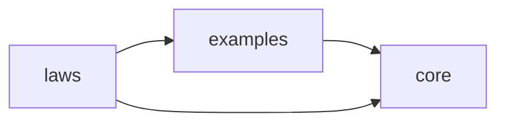
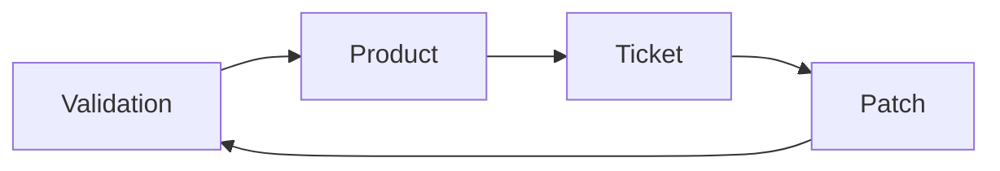
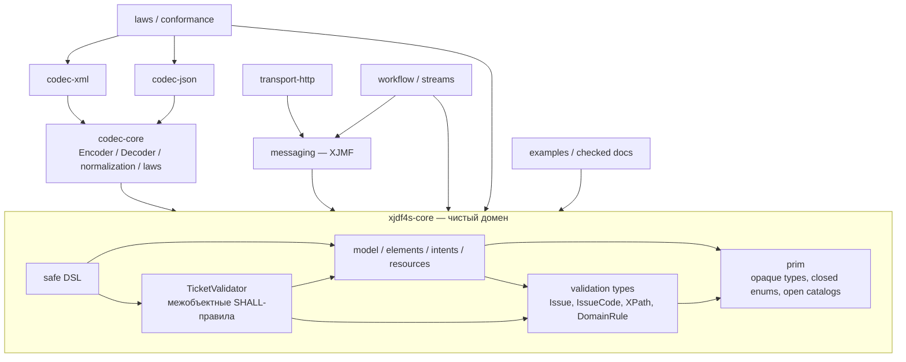
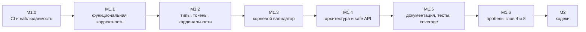
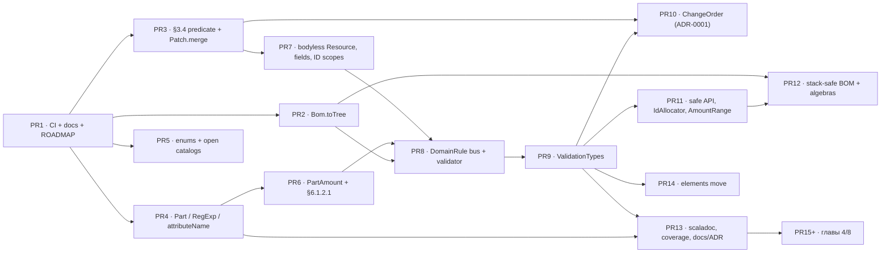
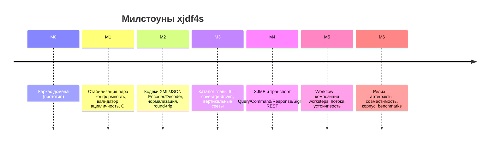

# ROADMAP — консолидированный план работ по `xjdf4s`

**Статус документа:** единственный действующий план работ проекта. Настоящий `ROADMAP.md` является результатом слияния двух согласованных планов — `FINAL-PLAN-A.md` и `FINAL-PLAN-B.md` — в одну непротиворечивую версию. Он заменяет собой все промежуточные материалы аналитики и ревью (три ревью, три предложения, два отчёта о зависимостях, три плана, две дорожные карты, три черновика `NEXT-*`), которые удаляются вместе с принятием этого документа. Все существенные сведения из них перенесены сюда в виде прямых цитат, таблиц и код-сниппетов. Ссылок на удалённые документы в тексте нет намеренно: документ самодостаточен.

**Дата консолидации:** 2026-08-15.
**Базовый срез репозитория:** ветка `arena/01a004e6-xjdf4s`, `HEAD = 9a530b6` («Added roadmaps next»), единственный коммит в истории ветки.
**Фактический срез исполнения:** ветка `arena/01a0051c-xjdf4s`, `HEAD = 719dd6d` («Added ROADMAP.md»), история из двух коммитов (`69eca70` «Initial commit», `719dd6d`); код и `docs/*` совпадают со срезом `9a530b6`, расхождение — только статус задачи M1.0-5 (см. раздел 8).
**Технологический baseline:** Scala 3.8.4, cats-core 2.13.0, munit 1.3.0, munit-scalacheck 1.3.0, sbt 2.0.2; целевая JVM для CI — Temurin JDK 21.
**Язык:** документ и `docs/*` — русский; scaladoc — английский.

## Оглавление

1. [Контракт документа](#1-контракт-документа)
2. [Резюме и первый шаг](#2-резюме-и-первый-шаг)
3. [Базовое состояние M0](#3-базовое-состояние-m0)
4. [Разрешение противоречий: отклонённые и переклассифицированные находки](#4-разрешение-противоречий-отклонённые-и-переклассифицированные-находки)
5. [Реестр подтверждённых находок](#5-реестр-подтверждённых-находок)
6. [Архитектурные решения (ADR)](#6-архитектурные-решения-adr)
7. [Целевая архитектура](#7-целевая-архитектура)
8. [План M1 — стабилизация доменного ядра](#8-план-m1--стабилизация-доменного-ядра)
9. [Нарезка M1 на pull request](#9-нарезка-m1-на-pull-request)
10. [Definition of Done M1](#10-definition-of-done-m1)
11. [Дорожная карта M2–M6](#11-дорожная-карта-m2m6)
12. [Стратегия тестирования и CI](#12-стратегия-тестирования-и-ci)
13. [Риски и меры снижения](#13-риски-и-меры-снижения)
14. [Матрица трассируемости](#14-матрица-трассируемости)
15. [Конвенции разработки](#15-конвенции-разработки)
- [Приложение A. Нормативные цитаты](#приложение-a-нормативные-цитаты)
- [Приложение B. Карта затрагиваемых файлов M1](#приложение-b-карта-затрагиваемых-файлов-m1)
- [Приложение C. Реестр сознательных отклонений](#приложение-c-реестр-сознательных-отклонений)
- [Приложение D. Команды локальной проверки](#приложение-d-команды-локальной-проверки)
- [Приложение E. Что сознательно не делается](#приложение-e-что-сознательно-не-делается)

---

## 1. Контракт документа

### 1.1 Роль

`ROADMAP.md` — рабочий источник порядка исполнения и зафиксированных решений. Если исполнитель обнаруживает расхождение между этим планом и реальностью, он:

- проверяет нормативный текст XJDF 2.2 в `reference/xjdf/*`;
- проверяет актуальный код и воспроизводимый тест;
- при необходимости заводит ADR в `docs/adr/`;
- обновляет `ROADMAP.md`, а не ведёт параллельный план в описании PR.

### 1.2 Приоритет источников истины

При расхождении сведений действует строгий порядок:

1. нормативный текст XJDF 2.2 в `reference/xjdf/*` (главы 1–9, Appendix A–H);
2. release notes XJDF 2.1/2.2 (`reference/xjdf/Appendix H – Release Notes.md`);
3. `reference/xjdf/schema.xsd` — структурный oracle для имён, кардинальностей и XSD-типов;
4. нормативные примеры XJDF (блоки `Example N.M` в тексте спецификации);
5. воспроизводимые compile-, regression- и conformance-тесты;
6. актуальный исходный код;
7. этот план.

Если prose и XSD расходятся, выбор нельзя делать молча: нужен ADR с цитатами и минимальной фикстурой. Приоритет — за текстом, XSD остаётся тест-оракулом.

### 1.3 Статусы

| Маркер | Значение |
| --- | --- |
| `[ ]` | не начато либо не подтверждено |
| `[~]` | частично реализовано, критерии приёмки не пройдены |
| `[x]` | подтверждено обязательным CI и тестами |
| `BLOCKED` | есть явно указанная внешняя зависимость или решение владельца |
| `REJECTED` | предложение рассмотрено и сознательно не принято |

Пункт нельзя отметить `[x]` только потому, что «код выглядит правильным». Нужны тест, документация и зелёный gate.

### 1.4 Схема идентификаторов

- `N-nn` — подтверждённая находка (дефект, расхождение, пробел);
- `X-nn` — отклонённая либо переклассифицированная находка;
- `M<k>.<фаза>-<номер>` — задача (например `M1.2-1`);
- `ADR-000n` — архитектурное решение;
- `P0`…`P4` — приоритет.

### 1.5 Шкала приоритетов

| Приоритет | Смысл |
| --- | --- |
| P0 | Ломает корректность ядра, примеры спецификации или наблюдаемость сборки |
| P1 | Нарушение конформности XJDF 2.2: типы, кардинальности, токены, валидация |
| P2 | Архитектура, алгебры, безопасность публичного API, мёртвый код |
| P3 | Документация, категориальная строгость, developer experience |
| P4 | Инженерия, CI/CD, гигиена репозитория, лицензия |

### 1.6 Ограничение верификации

Все выводы этого документа получены **статическим** анализом: чтением кода `modules/*` и сверкой с `reference/*`. В среде подготовки плана отсутствовали `java`, `sbt` и `scalafmt`, поэтому **ни одно** утверждение о результате компиляции или прогона тестов не подтверждено машинно. Именно это ограничение — корневая причина того, что часть находок предыдущих итераций оказалась ложной (раздел 4). Поэтому первая задача плана — не правка кода, а CI (`M1.0-1`).

Дополнительно проверено на текущем срезе репозитория:

- каталог `.github/` отсутствует (`ls .github` → `No such file or directory`);
- файла `LICENSE` нет;
- `project/` содержит только `build.properties` (`sbt.version=2.0.2`); файла `project/plugins.sbt` нет, следовательно команды `scalafmtCheckAll` в сборке **не существует**, хотя `.scalafmt.conf` (`version = "3.11.0"`, `runner.dialect = scala3`, `maxColumn = 120`) в репозитории есть;
- файл `build.log` отсутствует и в рабочем дереве, и в индексе (`git ls-files '*.log'` не возвращает ни одного файла проекта);
- `.gitignore` содержит маску `*.log`.

---

## 2. Резюме и первый шаг

### 2.1 Вердикт

`xjdf4s` — сильный, но **не верифицированный** прототип доменного ядра.

Домен не анемичен, алгебры настоящие (`Semigroup` / `Monoid` / `Semilattice`, `FunctionK`, `Ior`, `State`, `ValidatedNec`), Scala 3 применён осмысленно (opaque types, enum, union types, named tuples, match types, context functions), трассируемость к таблицам спецификации выдержана почти везде. Категориальный слой опирается на работающие конструкции, а не на метафоры: `Fix[ProductTree]` с катаморфизмом, моноид эндоморфизмов `Patch`, естественное преобразование `Pulse ~> NonEmptyChain` (`Alignment.snapshot`), `ValidatedNec` как аппликатив накопления ошибок.

Готовность M0 тем не менее нельзя признать по трём причинам.

1. **Ядро содержит функциональные дефекты**, ломающие заявленные возможности: развёртка BOM объявляет циклом любое валидное дерево со `@ChildRefs` (N-01); слияние change order дублирует `ResourceSet` вместо замещения (N-02); флагманский пример README не компилируется (N-26).
2. **Есть подтверждённые расхождения со спецификацией** в типах (`Part/@ProductPart`, `Part/@Metadata`), кардинальностях (`PartAmount/Part*`, `Resource/Specific?`), токенах (`Sides`, `DeviceStatus`, `HardCoverJacket`, `NamedColor`) и в семи scaladoc-ссылках на таблицы главы 6.
3. **Нет механизма верификации:** ни CI, ни зелёного прогона. В окружении аналитики отсутствовали JVM и sbt, поэтому ни одно утверждение вида «компилируется» / «тесты зелёные» не считается доказанным до первого прогона CI. Именно отсутствие компилятора породило два ложных «блокера» (X-01, X-02), на которые чуть не была потрачена работа.

Отдельно: валидатор декларирует больше, чем проверяет — объявленные локальные инварианты (`isLawful` в пяти местах, целостность BOM) не вызываются из `TicketValidator`, а проверка уникальности `ResourceSet` реализована строго уже правила §3.4.

### 2.2 Первый шаг (порядок, а не календарь)

```
PR-1  CI + sbt-scalafmt + README/docs quick fixes + compile-пробы
        → впервые появляется факт о сборке
PR-2  Bom.toTree + регрессионные тесты
        → ядро снова корректно считает BOM
PR-3  общий conflict-predicate §3.4 + Patch.mergeResourceSets
        → change order перестаёт нарушать §3.4
```

Только после зелёного baseline допускаются широкие изменения типов (фаза M1.2). Иначе крупный рефакторинг ведётся вслепую, а известные дефекты цементируются сначала в публичном API, а затем — в wire-формате M2.

### 2.3 Три правила, которые снимают большинство разногласий

| Правило | Следствие |
| --- | --- |
| Не чинить то, что не доказано падающим тестом | «Блокеры» X-01 и X-02 отклонены; вместо патча — compile/regression-тест |
| Wire-формат отделён от домена | `XJDF/@Name` и `@$schema` — JSON-only, они не попадают в `case class XJDF` |
| Законы важнее названий | `Group[Matrix]`, preorder, adjunction не объявляются ради красоты интерпретации |

### 2.4 Сводка находок

```
┌──────────────────────────────────────────────┬────────┬─────────────────┐
│ Категория                                    │ Кол-во │ Идентификаторы  │
├──────────────────────────────────────────────┼────────┼─────────────────┤
│ Функциональные дефекты ядра (P0)             │   2    │ N-01 … N-02     │
│ Расхождения со спецификацией XJDF 2.2 (P1)   │  17    │ N-03 … N-15,    │
│                                              │        │ N-47 … N-50     │
│ Неполнота корневого валидатора (P1)          │   7    │ N-16 … N-19,    │
│                                              │        │ N-36 … N-38     │
│ Архитектурные дефекты (P2)                   │  10    │ N-20 … N-25,    │
│                                              │        │ N-27 … N-29,    │
│                                              │        │ N-39            │
│ Документация и теория (P3)                   │  10    │ N-26, N-30 …    │
│                                              │        │ N-35, N-40 …    │
│                                              │        │ N-42            │
│ Инженерная инфраструктура (P4)               │   4    │ N-43 … N-46     │
├──────────────────────────────────────────────┼────────┼─────────────────┤
│ Итого подтверждено                           │  49    │                 │
│ Отклонено / переклассифицировано             │   6    │ X-01 … X-06     │
└──────────────────────────────────────────────┴────────┴─────────────────┘
```

---

## 3. Базовое состояние M0

### 3.1 Модули

```
modules/core      36 файлов — prim, model, intents, resources, dsl, validator
modules/laws       5 файлов — munit + ScalaCheck (4 сьюта + Arbitraries)
modules/examples   2 файла  — примеры глав 3/5 и демо
```

Всего 43 файла исходников, ~6 100 строк Scala.

Граф модулей направлен корректно:



`core` не зависит ни от `laws`, ни от `examples`; межмодульного цикла нет.
**M1.5-3 (PR-13):** добавлено ребро `laws → examples` — conformance-сьют
`laws/SpecExamplesSuite.scala` исполняет примеры `examples.SpecExamples`;
`examples` остался демонстрационным (DR-M1.5-3 в `docs/SPEC-COVERAGE.md`). Определение сборки (`build.sbt`) не использует плагинов; `project/` содержит только `build.properties` с `sbt.version=2.0.2`. Флаги компилятора зафиксированы в `build.sbt`:

```scala
ThisBuild / scalacOptions ++= Seq(
  "-deprecation",
  "-feature",
  "-unchecked",
  "-Wunused:all",
  "-Wvalue-discard",
  "-Wnonunit-statement"
)
```

### 3.2 Что уже реализовано

Статусы: 🟡 реализовано, но требует правки или не подтверждено сборкой; ❌ подтверждённый дефект.

| Область | Реализовано | Статус |
| --- | --- | --- |
| Примитивы Appendix A | `NmToken`/`NmTokens`, `Id`/`IdRef`/`IdRefs`, `JobId`/`JobPartId`/`ProjectId`, `XjdfString`, `LanguageTag`, `Url`, `IcsVersion`, `XjdfVersion`, `XYPair`, `Shape`, `Rectangle`, `Matrix`, `Points`/`Microns`/`Grammage`, `Amount`, `Coverage`, `UnitInterval`, `Severity`, `IntegerRange`, `LabColor`/`CMYKColor`/`RGBColor`, `FloatList`/`IntegerList`, `AmountRange`, `Timestamp`/`TimeSpan`/`TimeRange`, `RegExp` | 🟡 нужен полный аудит Appendix A и round-trip (M2). На базовом срезе `XPath` находился здесь; в PR-9 (M1.4-1) он перенесён в validation-слой `model/ValidationTypes.scala` вместе с `IssueCode` и `SeverityClass` |
| Перечисления | 45 закрытых `enum` + `XjdfEnum`/`XjdfEnumCompanion`, каталоги открытых токенов (`Catalog.*`) | 🟡 четыре подтверждённых расхождения (N-06…N-09) |
| Partition | 27 `PartitionKey`, `Part`, overlay-Semigroup, `matches`, `PartBuilder`, match type `ValueOf` | 🟡 два неверных типа, unsafe runtime API, нет `attributeName` |
| Amounts | `AmountPool`, `PartAmount`, `PartWaste`, `AmountRange` | 🟡 неверная кардинальность `Part`, спорная алгебра `meet`/`join` |
| Product/BOM | `Product`, `ProductList`, `Fix[ProductTree]`, `cata`, `totalCopies`, `validateAmounts` | ❌ развёртка сломана (N-01) |
| Resources | 12 payload-вариантов главы 6, `Resource`, `ResourceSet`, выбор по `Part` | 🟡 каталог неполон, `specific` чрезмерно обязателен |
| Intents | 8 payload-вариантов главы 4 + детали Binding/Assembling | 🟡 глава 4 покрыта частично (5 интентов отсутствуют) |
| Audit | 5 видов аудита, `AuditPool`, `Header`, `Signal`/`Pulse`, `Alignment` (Table 3.2) | 🟡 ID-скоуп и неподключённые локальные законы |
| Ticket | `XJDF`, `WorkstepKey` (named tuple), `Patch`, `TicketValidator` (12 проверок), DSL | 🟡 вырожденный change order, неполный валидатор |
| Законы/примеры | 4 сьюта (`AlgebraLaws`, `AlignmentLaws`, `PartitionLaws`, `TicketLaws`), примеры 3.1/3.3/3.4/3.6/5.2, brochure job, change order | 🟡 прогон не подтверждён |

### 3.3 Метрики графа зависимостей (baseline)

Статический анализ на текущем срезе зафиксировал:

| Метрика | Значение |
| --- | --- |
| Файлы/узлы | 43 |
| Файловые зависимости/рёбра | 232 |
| Модули | 3 |
| Циклы | 1 |
| Средний Fan-In / Fan-Out | 5.4 / 5.4 |
| Изолированные файлы | 0 |
| God-объекты (Fan-Out > 25) | 0 |
| Нарушения принципа стабильных зависимостей | 0 |
| Максимальный Fan-In | 36 (`prim.Tokens`) |
| Максимальный Fan-Out | 19 (`dsl.XjdfDsl`, `examples.SpecExamples`) |
| Максимальная betweenness | 161.6 (`resources.AllResources`) |
| Instability | `laws` 0.97, `examples` 0.98, `core` 0.52 |

Матрица межмодульных зависимостей (строки — откуда, столбцы — куда):

| from \ to | core | examples | laws |
| --- | --- | --- | --- |
| core | 160 | · | · |
| examples | 27 | 1 | · |
| laws | 42 | · | 2 |

### 3.4 Что подтверждено как корректное (не трогаем)

Для сбалансированности: следующее проверено по `reference/*` и признано верным.

- Матрицы `Orientation.matrix` — все 8 значений против §2.6.5 / A.2.32 совпадают.
- Состав и токены 42 из 45 `enum` против Appendix A.2, включая специальные «None»-токены (`BindingType.NoBinding → "None"`, `BindingOrder.Unbound → "None"`, `Coating.Uncoated → "None"`, `Unscored → "None"`, `HardCoverJacket.Unjacketed → "None"`).
- Имена элементов интентов/ресурсов/подэлементов против таблиц глав 4/6/8 (включая спецификационные `AdhesiveNote`, `SaddleStitching`).
- 27 Partition Keys = Table 6.4, в порядке таблицы. Сверено по таблице: `BinderySignatureID, BlockName, ContactType, DocIndex, DropID, Location, LotID, Metadata, Option, PageNumber, PartVersion, PreviewType, PrintCondition, Product, ProductPart, QualityMeasurement, Run, RunIndex, Separation, SetIndex, SheetIndex, SheetName, Side, StationName, TileID, TransferCurveName, WebName` — единственное отступление в коде это `Option → OptionKey` (коллизия со `scala.Option`), см. N-05.
- Семантика выбора §6.1.3.2 (итерация сверху вниз, первый совпавший: `resources.iterator.find(_.matches(selector))`) и §6.1.3.3 (несколько `Part` = дизъюнкция).
- Правила: §3.1.3 (`Product` не смешивается с процессами), Table 3.1 `@RelatedJobPartID` без `@RelatedJobID` запрещён, Table 6.1 `@Status` запрещён для `Usage="Output"`, «at most one of @Orientation/@Transformation» (структурно через union `OrientationSpec`), Table 6.5 «at least one of», §2.2.3 ID/IDREF, хронология `AuditPool`, §2.2.2 `WorkstepKey`.
- Счёт §1.10.2, включая нисходящие диапазоны (см. X-02).
- Формулы `Severity` §5.3.4.1.
- Table 3.2 выравнивание сигнал→аудит: `AuditProcessRun ↔ CommandReturnQueueEntry` корректно отсутствует в `SignalPayload`.
- Верные scaladoc-ссылки на таблицы, которые **не надо** менять: `Component` 6.37, `Contact` 6.38, `ComChannel` 6.39, `Company` 6.40, `Person` 6.42, `DeliveryParams` 6.54, `DropItem` 6.55, `Device` 6.57, `RunList` 6.148.
- Слои пакетов без циклов между `prim` и доменными пакетами: `prim` не импортирует domain-пакеты.
- `build.sbt`: `publish / skip := true` задан scoped (внутри `root.settings`), поэтому предупреждение миграционного гида sbt 2.x про bare settings («all subprojects will be skipped») здесь неприменимо.

### 3.5 Архитектурные hotspots

| Файл | Fan-In | Fan-Out | Betweenness | Практический вывод |
| --- | --- | --- | --- | --- |
| `resources.AllResources` | 5 | 13 | 161.6 | нельзя превращать M3 в один постоянно растущий центральный enum без ADR-0008 |
| `model.Resource` | 11 | 9 | 135.1 | изменения `specific`, references и validation требуют широких regression-тестов |
| `intents.AllIntents` | 3 | 6 | 45.9 | новые intents — вертикальными срезами, dispatch под контролем |
| `model.TicketValidator` | 6 | 11 | 42.1 | выполнено в M1.4-1 (PR-9): типы вынесены в `ValidationTypes` (Fan-Out 0), цикл разорван |
| `model.Intent` | 3 | 3 | 35.9 | — |
| `model.Ticket` | 7 | 11 | 30.8 | не добавлять codec-only детали и реализацию `Patch` в корневую модель |
| `model.Product` | 7 | 5 | 20.9 | BOM-изменения защищать cycle/DAG/deep-tree тестами |
| `model.Header` | 3 | 7 | 20.6 | явно разделить document и message ID scope |
| `prim.Common` | 14 baseline → 8 после PR-14 (5 внутри `core`) | 4 baseline | 14.7 baseline | `[x]` N-28: элементы перенесены в `model.elements`, остались `Url` и открытые каталоги |
| `prim.Enums` | 24 | 2 | 6.3 | точные wire-token goldens обязательны |
| `prim.Tokens` | 36 | 0 | 0 | стабильный фундамент; breaking changes требуют migration plan |
| `model.IdSource` | 0 | 1 | 0 | публичная возможность объявлена, но нигде не используется |

### 3.6 Цикл внутри `core`



Цикл `Validation → Product → Ticket → Patch → Validation` (4 файла) нарушает Acyclic Dependencies Principle и затрудняет расширение validator/codecs. Разрыв — задача M1.4-1 по ADR-0002.

**Статус (PR-9, M1.4-1):** цикл разорван — повторный анализ тем же алгоритмом даёт 0 циклов; `[x]` верифицировано владельцем (сборка и тесты чистые, Приложение D).

### 3.7 Ограничение верификации на срезе

На базовом срезе **отсутствуют**: `java`, `sbt`, каталог `.github/`, файл `LICENSE`, `project/plugins.sbt`. Файл `build.log`, о котором писали два ревью, отсутствует и в рабочем дереве, и в индексе; `*.log` присутствует в `.gitignore`. Поэтому статус любого пункта — 🟡 до первого зелёного CI-прогона.

---

## 4. Разрешение противоречий: отклонённые и переклассифицированные находки

Эти пункты не входят в план как дефекты. Раздел существует, чтобы на них не была потрачена работа повторно.

### X-01. `Monoid[ValidatedNec[Issue, Unit]]` — ❌ находка отклонена

**Утверждение источников:** «`checks.combineAll` не компилируется, нужен свой инстанс `Monoid[ValidatedNec[Issue, Unit]]`» — это позиция трёх из тринадцати входных документов; ещё пять утверждали обратное.

**Проверка.** cats предоставляет `catsDataMonoidForValidated[A: Semigroup, B: Monoid]: Monoid[Validated[A, B]]`. Для `A = NonEmptyChain[Issue]` есть `Semigroup`, для `B = Unit` есть `Monoid`, следовательно инстанс синтезируется. Нейтральный элемент — `Valid(())`. Места вызова в коде: `modules/core/src/main/scala/xjdf4s/model/Validation.scala` — `checks.combineAll` в `TicketValidator.validate`; `modules/core/src/main/scala/xjdf4s/model/Product.scala` — `kids.combineAll` в `Bom.validateAmounts`.

**Решение.** Рукописный `given` не добавлять — он создаст неоднозначность implicit-разрешения. Вместо этого — compile-тест, который закрывает вопрос фактом (задача M1.0-3):

```scala
test("cats provides Monoid[ValidatedNec[Issue, Unit]]"):
  val _ = summon[Monoid[ValidatedNec[Issue, Unit]]]
```

Если тест внезапно не скомпилируется на зафиксированных версиях, сначала сохраняется минимальный reproducer, и только затем выбирается локальный fold/instance.

### X-02. `IntegerRange.indices` и нисходящие диапазоны — ❌ находка отклонена

**Утверждение источника:** «ветка `by -1` недостижима, диапазон `-1 0` обрабатывается неверно».

**Проверка** — фактический код `modules/core/src/main/scala/xjdf4s/prim/Quantity.scala`:

```scala
/** Normalizes a single index: negative values count from the back. */
def normalizeIndex(i: Long, size: Long): Long =
  if i < 0 then size + i else i

/** The inclusive list of normalized indices selected by this range. */
def indices(size: Long): List[Long] =
  if size <= 0 then Nil
  else
    val f = normalizeIndex(r.from, size)   // "-1" при size=3 → 2
    val t = normalizeIndex(r.to, size)     // "0"  при size=3 → 0
    val lo = math.max(0L, math.min(f, size - 1))  // = 2  (это clamped FROM)
    val hi = math.max(0L, math.min(t, size - 1))  // = 0  (это clamped TO)
    if lo <= hi then (lo to hi).toList else (lo to hi by -1).toList
```

При `size = 3` и диапазоне `-1 0`: `lo = 2`, `hi = 0`; условие `2 <= 0` ложно, выполняется `(2 to 0 by -1) = List(2, 1, 0)`. Это в точности соответствует §1.10.2:

> XJDF also allows ranges of items to be sub-selected from lists by using a pair of integer values where the first item identifies the start of the selection and the second item identifies the end of the selection. Thus the range `"0-1"` represents all entries of a list and the range `"-1 0"` represents the same list in reverse order.

Ошибка ревьюера вызвана именами `lo`/`hi`, внушающими «lower/higher», хотя это «from/to». Соответствующий закон в `AlgebraLaws` уже существует:

```scala
property("IntegerRange -1 0 selects everything in reverse"):
  IntegerRange(-1, 0).select(List("a", "b", "c")) == List("c", "b", "a")
```

**Решение.** Семантику не менять. Выполнить только переименование `lo`/`hi` → `clampedFrom`/`clampedTo` и добавить граничные тесты (задача M1.1-4).

### X-03. Красный `build.log` в индексе — ⚠️ неприменимо

**Утверждение источников:** «в VCS закоммичен `build.log` с красным прогоном `PartitionLaws`».

**Проверка.** `git ls-files '*.log'` возвращает пустой результат; файла нет ни в рабочем дереве, ни в индексе; `*.log` присутствует в `.gitignore`. Дополнительно: описанное в логе свойство в текущем коде тавтологично — overlay право-смещённый, `Part.combine` реализован как `b.x.orElse(a.x)`.

**Решение.** Действий по коду не требуется. Остаётся только правило гигиены (M1.0-4): логи сборки — артефакты CI, а не файлы репозитория. Регрессионное свойство «overlay право-смещён» всё же стоит зафиксировать явно, поскольку оно дешёвое (M1.2-1, набор тестов).

### X-04. `XJDF/@Name` — 🔁 переклассифицировано: правило кодирования, не поле домена

**Утверждение части источников:** «добавить `XJDF.name: Option[XjdfString]`».

**Проверка** — Table 3.1 (Sheet 2 of 2), `reference/xjdf/3 – Structure.md`:

> `Name`? | `enumeration` | `@Name` SHALL specify the local name of the XJDF when `XJDF` is defined as a root JSON object. Allowed value is: `XJDF`. **JSON Exception:** `@Name` SHALL be provided in JSON if `XJDF` is the root JSON object and SHALL NOT be provided in XML.

Там же, Sheet 1 of 2, аналогично для `@$schema`:

> `$schema`? | `URL` | `@$schema` SHOULD reference the JSON schema for XJDF. **JSON Exception:** `@$schema` SHOULD be provided in JSON if `XJDF` is the root JSON object and SHALL NOT be provided in XML.

**Решение.** Поле **не добавляется** в `case class XJDF`: это правило кодирования, а не домена. Реализуется в M2 (`codec-json` синтезирует `"Name": "XJDF"` при кодировании, декодер валидирует и снимает значение при нормализации). Дополнительно: тип `@Name` — `enumeration` с единственным значением, а не `string`, поэтому предложенная сигнатура `Option[XjdfString]` была бы неверна и по типу. Фиксируется в ADR-0007; строка в `docs/SPEC-COVERAGE.md` со статусом codec-only (M2).

### X-05. `Group[Matrix]` — 🔁 переклассифицировано

**Утверждение источника:** «у `Matrix` есть `inverse`, значит можно объявить `Group`».

**Проверка.** `cats.kernel.Group` требует тотальный `inverse`. Фактическая сигнатура в `prim/Quantity.scala` — `def inverse: Option[Matrix]`, и это честно: у вырожденной матрицы (det = 0) обратной не существует.

**Решение.** `Group[Matrix]` не вводить. Оставить `Monoid[Matrix]` + частичный `inverse: Option[Matrix]` с задокументированной причиной. Опционально (не в M1) — отдельный проверенный тип `InvertibleMatrix` с честным `Group`. Задача M1.4-6.

### X-06. «Готовые реализации доступны через `git cherry-pick`» — ⚠️ неприменимо

**Утверждение источника:** ряд исправлений можно перенести коммитами `41aff7e`, `1de0ab8`, `90462ae`, `996b756`, `ca29745`.

**Проверка.** В истории текущей ветки один коммит (`9a530b6`); перечисленных коммитов здесь нет.

**Решение.** Планировать перенос кода из них нельзя. Все задачи формулируются как самостоятельные изменения.

### 4.1 Сводка разрешённых противоречий между источниками

| Спорный вопрос | Позиции источников | Решение плана | Основание |
| --- | --- | --- | --- |
| Кастомный `Monoid[ValidatedNec]` | «добавить (P0)» vs «не добавлять» | **Не добавлять**, закрыть compile-тестом | cats-инстанс существует; лишний `given` создаст ambiguity |
| `IntegerRange` нисходящие | «чинить алгоритм» vs «только rename» | Только rename + тесты | Логика верна, дефект — в именовании |
| Дизайн `ChangeOrder` | (A) убрать вовсе, оставить `Patch`; (B) `opaque type ChangeOrder = XJDF`; (C) номинальный partial-тип + компиляция в `Patch` | Вариант C (ADR-0001). (B) отвергнут: даёт номинал, но не выражает ослабленную кардинальность | §1.6.5 прямо описывает ослабление кардинальности |
| `XJDF/@Name` | «добавить поле» vs «codec-only» | Codec-only (M2) | Table 3.1: JSON Exception, в XML запрещён |
| Приоритет `build.log`/VCS | «блокер» vs «устарело» | Не дефект, только правило гигиены | Файла нет на срезе |
| Форма локальных правил | «подключить `isLawful`» vs «заменить `Boolean` на `DomainRule`» | Заменить на `DomainRule` и заодно подключить | Boolean теряет причину, severity и XPath |
| `join` у `AmountRange` | «удалить»; «переименовать в `widen`»; «исправить направления»; «сначала ADR» | ADR-0004 до кода: разделить bounds и nominal; `Semilattice` только там, где операция тотальна и осмысленна | Полурешёточные законы выполняются формально, но не доказывают доменный смысл |
| cats-laws / discipline-munit | «перевести законы» vs «оставить локальные» | Решение в ADR-0009 одним заходом; две неполные системы держать запрещено | Резолв под Scala 3.8.4 не проверен без JVM |
| Лицензия | «Apache-2.0» vs «решение владельца» | Рекомендация Apache-2.0, добавляется после подтверждения владельцем; публикация M6 блокируется до ясности | Юридическое решение вне компетенции плана |
| `Bom.toTree` — приоритет | «P1» vs «P0» | P0 | Ломает Example 3.4 и демо `Main.demoBomFold` |

---

## 5. Реестр подтверждённых находок

Каждая строка перепроверена по коду на `HEAD = 9a530b6` и по нормативным текстам `reference/xjdf/*`. Номера строк указаны на срезе, зафиксированном этим документом; при расхождении ориентироваться на имя символа.

### 5.1 Функциональные дефекты ядра (P0)

#### N-01. `Bom.toTree` кладёт в `seen` ID ребёнка перед рекурсией

**Файл:** `modules/core/src/main/scala/xjdf4s/model/Product.scala`, строки 130–154 (`toTree`, `fromProductList`).

Текущий код:

```scala
private def toTree(
    product: Product,
    byId: Map[String, Product],
    seen: Set[String]
): Either[Issue, Fix[ProductTree]] =
  val cycleIssue = product.id.collect { case id if seen.contains(id.value) => id }
  cycleIssue match
    case Some(id) =>
      Left(Issue.error(XPath("/XJDF/ProductList"), s"Cycle in product structure at ID '${id.value}'"))
    case None =>
      val childRefs = product.references.toList.distinct
      childRefs match
        case Nil =>
          Right(Fix(ProductTree.Leaf(product)))
        case refs =>
          val children = refs.foldLeft(Right(Chain.empty[Fix[ProductTree]]): Either[Issue, Chain[Fix[ProductTree]]]) {
            case (acc, ref) =>
              for
                kids <- acc
                child =
                  byId.get(ref.value).toRight(Issue.error(XPath("/XJDF/ProductList"), s"Unresolved ChildRef '$ref'"))
                kid <- child.flatMap(c => toTree(c, byId, seen + c.id.fold("")(_.value)))
              yield kids :+ kid
          }
          children.map(cs => Fix(ProductTree.Node(product, cs)))
```

**Дефект.** В `seen` перед рекурсией добавляется ID **ребёнка** `c.id`, а проверка на входе в `toTree` смотрит на ID **текущего** узла. Следовательно ребёнок немедленно находит собственный ID в `seen`, и любой продукт с `@ChildRefs` объявляется циклом. `Bom.fromProductList` фактически работает только для списков без ссылок — ровно для случая, где развёртка не нужна. Демо `Main.demoBomFold` на Example 3.4 (notebook) печатает «unfold failed: Cycle in product structure at ID 'IBack'».

**Норма.** Глава 3, `Product/@ChildRefs`, структура `ProductList` (Tables 3.10–3.11).

**Усугубляющий фактор.** Тестов на `Bom.fromProductList` в `modules/laws` нет — поэтому регрессия не ловится; вызывается только из `examples/Main.scala`.

**Приоритет: P0. Задача: M1.1-1.**

#### N-02. `Patch.mergeResourceSets` конкатенирует вместо замещения

**Файл:** `modules/core/src/main/scala/xjdf4s/model/Patch.scala`, строки 69–86.

Полный текущий код (с его же scaladoc):

```scala
/** Merges change-order ResourceSets into a ticket. The result is an `Ior`:
 *  `Right` — a clean merge; `Both` — merged, but some ResourceSet keys were
 *  duplicated (the update wins, the issue is reported); `Left` — the update
 *  cannot be applied at all.
 */
def mergeResourceSets(ticket: XJDF, update: Chain[ResourceSet]): Ior[NonEmptyChain[Issue], XJDF] =
  val conflicts = update.filter(rs => ticket.resourceSets.exists(_.key == rs.key))
  val merged = ticket.copy(resourceSets = ticket.resourceSets ++ update)
  if conflicts.isEmpty then Ior.right(merged)
  else
    val issues = conflicts.map: rs =>
      Issue.warning(
        XPath("/XJDF/ResourceSet"),
        s"Duplicate ResourceSet key replaced: ${Show[ResourceSetKey].show(rs.key)}"
      )
    NonEmptyChain.fromChain(issues) match
      case Some(nec) => Ior.both(nec, merged)
      case None      => Ior.right(merged)
```

**Два дефекта сразу:** конкатенация вместо замещения и сравнение по `_.key == rs.key` вместо предиката §3.4 (см. N-16).

1. `ticket.resourceSets ++ update` добавляет update после старых наборов; старый и новый `ResourceSet` остаются вместе.
2. Scaladoc обещает «the update wins», но это ложно: `ResourceSet.select` (§6.1.3.2, first match) итерирует сверху вниз и вернёт **старый** ресурс. Результат нарушает §3.4.
3. Ветка `Ior.left` из сигнатуры недостижима ни при каком входе.

**Норма.** §3.4, `reference/xjdf/3 – Structure.md`: «`ResourceSet` elements with the same values of `@Name`, `@Usage`, `@ProcessUsage` and common or no entries in `@CombinedProcessIndex` SHALL NOT be specified.»

**Приоритет: P0. Задачи: M1.1-2, M1.1-3.**

### 5.2 Расхождения со спецификацией XJDF 2.2 (P1)

| ID | Находка | Норма | Код | Задача |
| --- | --- | --- | --- | --- |
| N-03 | `Part/@ProductPart` типизирован как `IdRef` | Table 6.4: `ProductPart?` *(Deprecated in XJDF 2.1)* \| `NMTOKEN`; подтверждено `schema.xsd`: `<xs:attribute name="ProductPart" type="xs:NMTOKEN" use="optional"/>` | `model/Partition.scala:137` `productPart: Option[IdRef]`, `:70` `case ProductRef(value: IdRef)`, `def byProductRef(value: IdRef)` | M1.2-1 |
| N-04 | `Part/@Metadata` типизирован как `NmToken` | Table 6.4: `Metadata?` \| `regExp`; `schema.xsd`: `<xs:attribute name="Metadata" type="regExp" use="optional"/>`, где `regExp` определён как `<xs:restriction base="xs:string"/>`. `NmToken` запрещает пробелы, которые в regex допустимы | `model/Partition.scala:130` `metadata: Option[NmToken]` | M1.2-1 |
| N-05 | `Show[Part]` и сообщения валидатора печатают Scala-имя `OptionKey` | Table 6.4: имя атрибута — `Option?` \| NMTOKEN \| «Generic option that MAY be semantic free.» | `PartitionKey.OptionKey` (переименование вынужденное: коллизия со `scala.Option`), но wire-имя нигде не задано; валидатор формирует строки через `k.toString` | M1.2-1 |
| N-06 | `Sides` неполон: 4 значения из 5 | Table A.40 — 5 значений; отсутствует `Unprinted` *(New in XJDF 2.1)*: «Page contents SHALL NOT be imposed on either side.» | `prim/Enums.scala:49-54`: `case OneSided, OneSidedBack, TwoSidedHeadToFoot, TwoSidedHeadToHead` | M1.2-2 |
| N-07 | `DeviceStatus` неполон: 5 значений из 7 | Table A.15 — 7 значений; отсутствуют `Cleanup` *(New in XJDF 2.1)* и `Setup` *(New in XJDF 2.1)* | `prim/Enums.scala:109-114`: `case Idle, NonProductive, Offline, Production, Stopped`. Примечание: соседний `Status` содержит `Cleanup`/`Setup` — вероятная причина коллизии имён при wildcard-импорте | M1.2-2 |
| N-08 | `HardCoverJacket.Glued` даёт wire-токен `"Glued"` | Table 4.11 (HardCoverBinding, Sheet 1), `Jacket?`: «Allowed values are: `None` – No jacket is needed. `Loose` – The jacket is loosely wrapped. `Glue` – The jacket is glued to the spine.» | `prim/Enums.scala:514-518`: `case Unjacketed, Loose, Glued` с `case other => NmToken.unsafe(other.toString)` — даёт `"Glued"` вместо `"Glue"` | M1.2-2 |
| N-09 | `NamedColor` — закрытый enum из 16 значений | Appendix A.2.30: «`NamedColor` specifies a machine-readable definition of a color. For a list of allowed values, see `[Color Names]`.» — внешний открытый каталог. §1.10.3.2 задаёт правило: открытый список ⇒ NMTOKEN | `prim/Enums.scala:268-274`: `case Black, Blue, Cyan, DarkBlue, DarkGreen, DarkRed, Gold, Gray, Green, Magenta, Orange, Red, Silver, Violet, White, Yellow`. Значение `Pantone 123 C` невыразимо | M1.2-2 |
| N-10 | `PartAmount` содержит один `Part` | Table 6.3: `Part*` (0..*) — «Part specifies the selected parts that the PartAmount is valid for.» | `model/Amounts.scala:39` `part: Part = Part.empty` | M1.2-3 |
| N-11 | `Resource.specific` обязателен, из-за чего `<Resource/>` невыразим | Table 6.1: `Specific Resource?`. Example 3.6 буквально содержит `<Resource/>` дважды | `model/Resource.scala:217` `specific: ResourcePayload` (без `Option`); `:235` `def elementName: NmToken = specific.elementName` | M1.2-4 |
| N-12 | `DropItem` неполон | Table 6.55: `TotalDimensions?` (shape), `TotalVolume?` (float, «Total volume in liters»), `TotalWeight?` (float) | `resources/Delivery.scala:34-37`: `final case class DropItem(amount: Long, itemRef: IdRef)` | M1.2-5 |
| N-13 | `Notification` без `@ModuleID`; правило Milestone не проверяется | Table 8.49: `@ModuleID?` \| NMTOKEN. Там же: «`Milestone?` … If Milestone is present, the value of `@Class` SHALL be `"Event"`.» И: «`Comment*` … If multiple Comment elements occur, they SHALL have different `Comment/@Language` values.» | `model/Header.scala:70-78`: `Notification(classification, jobId, jobPartId, queueEntryId, detail, parts, comments)` — нет `moduleId`, нет инварианта | M1.2-5, M1.3-3 |
| N-14 | `Header/@ID` аудитов включён в **документный** скоуп уникальности ID; при этом `references` не собирает IDREF из аудитов — асимметрия | Table 7.3: «If present, `@ID` SHALL identify the parent message or XJMF and SHALL be unique for all messages and XJMF **initiated by the Sender**» — мессенджинговый скоуп, а не §2.2.3 («IDs and IDREFS are only valid within the scope of a single XJDF instance») | `model/Ticket.scala:57-63`: `val headerIds = auditPool.fold(...)(_.toNonEmptyChain.toChain.flatMap(a => Chain.fromOption(a.origin.id)))` попадает в `declaredIds`; `references` (:66-69) собирает только `resourceSets` и `productList` | M1.2-5 |
| N-15 | Семь scaladoc-ссылок указывают номер **раздела** вместо номера **таблицы** | сверено по `reference/xjdf/6 – Resources.md` (см. таблицу ниже) | `resources/{Color,Finishing,Layout,Media,NodeInfo,Preview}.scala` | M1.2-6 |
| N-47 | `ISOPaperSubstrate` неполон: 8 значений из 15 | Table A.26 — 15 значений; отсутствуют `LWCPlus`, `LWCStandard`, `NewsPlus`, `SCPlus`, `SCStandard`, `SNP` *(New in XJDF 2.1)* и `PS9` *(New in XJDF 2.2)* | `prim/Enums.scala`: `case PS1 … PS8` | M1.2-2 |
| N-48 | `MediaType` неполон: 13 значений из 21 | Table A.30 — 21 значение; отсутствует `Synthetic` *(New in XJDF 2.1)*, а также 7 значений с пометкой Deprecated (`EmbossingFoil`, `Foil`, `LaminatingFoil`, `MountingTape`, `SelfAdhesive`, `ShrinkFoil`, `Vinyl`), которые обязаны декодироваться | `prim/Enums.scala`: `case Blanket … Transparency` | M1.2-2 |
| N-49 | `Scope` неполон: 4 значения из 5 | Table A.36 — 5 значений; отсутствует `Device` *(New in XJDF 2.2)*: «The amount of resources is an absolute measurement that is currently available within the scope of a Device.» | `prim/Enums.scala`: `case Allowed, Estimate, Job, Present` | M1.2-2 |
| N-50 | Glue-энумерации смешаны: `prim.GlueType` (3 значения) используется и для полей, которые по Table 4.5/4.7/4.9 и XSD являются **элементом** `Glue` (`BindIn.glue`, `StickOn.glue`, `AdhesiveNote.glue`); набор `Glue/@GlueType` из 5 значений не смоделирован | Внутренний конфликт спецификации: Table A.24 (§A.2.23) — 3 значения (`ColdGlue`, `Hotmelt`, `PUR`); Table 8.29 `@GlueType` — 5 значений («Allowed values are: … `Permanent` … `Removable`»); `schema.xsd`: `EnumGlue` (3) для «from: Glue»-атрибутов vs inline-ограничение `Glue/@GlueType` (5); Example 8.15: `GlueType="Removable"`. По §1.2 приоритет — prose Table 8.29 и пример → **два разных закрытых набора** | `prim/Enums.scala:180-185` (`GlueType`, 3 значения); `intents/Binding.scala:111,117,137,213`; `intents/FoldingVariable.scala:119,143` | ADR-0011, M1.6-3 (PR-16) |
| N-51 | `FileSpec` (Table 8.22, `model/elements/CommonElements.scala`) неполон: (1) SHALL-правило взаимного исключения локаций — «If neither `@URL` nor `@UID` is present, both `@FileFormat` and `@FileTemplate` SHALL be present, unless the resource is a pipe. If either `@URL` or `@UID` is specified, then `@FileFormat` and `@FileTemplate` SHALL NOT be specified» — не проверяется: case class допускает одновременное задание `url` и `fileFormat`/`fileTemplate`, а `location` молча выбирает по приоритету; (2) `NetworkHeader*` *(New in XJDF 2.1)* не моделируется; (3) строки в `SPEC-COVERAGE.md` нет (тип вне `resources/*`/`intents/*`, чекер не требует) | Table 8.22 (`reference/xjdf/8 – Subelements.md`, строки 519+); `schema.xsd` `FileSpec` | `model/elements/CommonElements.scala` (`FileSpec`, `FileLocation`) | M1.6/M3 follow-up: `FileSpec.law` (`DomainRule`) + подключение к обходам всех FileSpec-несущих контейнеров (первый подключён в M1.6-11 — `ContentCheckIntent/ProofItem/FileSpec`); `NetworkHeader` — по решению о его моделировании. Зарегистрировано в PR-21 (M1.6-11) при сверке Table 4.24 |

**Происхождение N-47…N-49.** Находки получены машинной сверкой всех закрытых enum
`prim/Enums.scala` с таблицами раздела A.2 (процедура закреплена в ADR-0007 и
реализована тестом `laws/EnumLaws.scala`). Класс дефекта тот же, что у N-06/N-07:
при переносе таблицы теряются значения с пометками *New in XJDF 2.1/2.2*. Остальные
20 закрытых enum сверены и совпали точно. По решению владельца исправляются в PR-5
вместе с N-06…N-09.

Точная таблица исправлений N-15 (номера строк — позиции заголовков `**Table N.M: …**` в `reference/xjdf/6 – Resources.md`):

| Файл | Сейчас | Должно быть | Позиция в спецификации |
| --- | --- | --- | --- |
| `resources/Color.scala:7` | Table 6.14 | Table 6.27: Color Resource | строка 458 |
| `resources/Finishing.scala:9` (CuttingParams) | Table 6.25 | Table 6.53: CuttingParams Resource | строка 786 |
| `resources/Finishing.scala:44` (FoldingParams) | Table 6.36 | Table 6.74: FoldingParams Resource | строка 1086 |
| `resources/Layout.scala:8` | Table 6.52 | Table 6.95: Layout Resource | строка 1349 |
| `resources/Media.scala:8` | Table 6.57 | Table 6.114: Media Resource | строка 1583 |
| `resources/NodeInfo.scala:7` | Table 6.59 | Table 6.119: NodeInfo Resource | строка 1682 |
| `resources/Preview.scala:8` | Table 6.66 | Table 6.134: Preview Resource | строка 1844 |

Корректные ссылки, которые **менять не надо** (проверено): `Device.scala:7` — Table 6.57 (это действительно `Table 6.57: Device Resource`, строка 848; именно эта коллизия и создала ошибку в `Media.scala`); `Component.scala:8` — 6.37; `Contact.scala:8` — 6.38; `Contact.scala:46` (ComChannel) — 6.39; `Contact.scala:57` (Company) — 6.40; `Contact.scala:68` (Person) — 6.42; `Delivery.scala:8` (DeliveryParams) — 6.54; `Delivery.scala:31` (DropItem) — 6.55; `RunList.scala:8` — 6.148.

Ошибка систематическая (номер раздела выдан за номер таблицы), поэтому одной правки мало — вводится автоматическая проверка (M1.2-6).

### 5.3 Неполнота корневого валидатора (P1)

| ID | Находка | Норма | Код | Задача |
| --- | --- | --- | --- | --- |
| N-16 | §3.4 проверяется только на точное равенство ключа: не ловится ни частичное пересечение CPI (`[0]` vs `[0,1]`), ни смесь «без CPI» + «с CPI» | §3.4: «`ResourceSet` elements with the same values of `@Name`, `@Usage`, `@ProcessUsage` and **common or no entries** in `@CombinedProcessIndex` SHALL NOT be specified.» | `model/TicketValidator.scala` (до PR-9 — `model/Validation.scala`), `checkResourceSetKeys`: попарное сравнение через `ResourceSet.clashesWith` (PR-8) | M1.3-1 — `[x]` |
| N-17 | §6.1.2.1 реализован частично: при нескольких родительских `Part` проверка выключается, вторая половина правила отсутствует | Table 6.3, `Part*` | реализовано в PR-6 (M1.3-2, `[x]` верифицировано владельцем) | M1.3-2 — `[x]` |
| N-18 | Объявленные локальные инварианты не подключены к корневой валидации | соответствующие SHALL глав 3–8 | все бывшие `Boolean isLawful/hasLawful*` приведены к `DomainRule` и вызываются из `TicketValidator.checkLocalLaws` (PR-8) | M1.3-3 — `[x]` |
| N-19 | Целостность и ацикличность BOM не входят в `validate` | §3.3.1.1 | `checkBomIntegrity` вызывает `Bom.fromProductList` (PR-8) | M1.3-4 — `[x]` |

Полный текущий список проверок валидатора (для контроля полноты после M1.3):

```scala
def validate(ticket: XJDF): ValidatedNec[Issue, Unit] =
  val checks = Chain(
    checkVersion(ticket),                // @Version == "2.2" (Table 3.1)
    checkTypes(ticket),                  // §3.1.3: Product + процессы
    checkRelatedIds(ticket),             // @RelatedJobPartID ⇒ @RelatedJobID
    checkResourceSetKeys(ticket),        // §3.4 — НЕПОЛНО (N-16)
    checkResourceSetChildren(ticket),    // @Name ↔ specific resource
    checkResourceSetStatuses(ticket),    // @Status ∉ Usage="Output"
    checkCombinedProcessIndices(ticket), // границы CPI
    checkIdUniqueness(ticket),           // §2.2.3 — скоуп неверен (N-14)
    checkReferences(ticket),             // IDREF разрешимы — неполный обход (N-14)
    checkAuditChronology(ticket),        // §3.2 хронология
    checkPartAmountKeys(ticket),         // §6.1.2.1 — НЕПОЛНО (N-17)
    checkIntentLawfulness(ticket)        // только Intent/@Name
  )
  checks.combineAll
```

Дополнительные пробелы валидации, фиксируемые здесь же:

| ID | Находка | Норма | Задача |
| --- | --- | --- | --- |
| N-36 | Дубликат токена в `@Types` (`"Product Product"`) не отклоняется | §3.1.3 | строгая политика реализована (`ProductTokenDuplicate`), decision record в `docs/SPEC-COVERAGE.md` (PR-8) | M1.3-4 — `[x]` |
| N-37 | Не проверяется правило Table 3.11 для `Product/@PartVersion` | Table 3.11 (Sheet 2) | `checkPartVersion` (PR-8) | M1.3-4 — `[x]` |
| N-38 | Не проверяется уникальность `Comment/@Language` там, где этого требует таблица | Table 8.49 | `Notification.law` + `CommentLanguageDuplicate` код (PR-8) | M1.3-3 — `[x]` |

### 5.4 Архитектурные дефекты (P2)

| ID | Находка | Доказательство | Задача |
| --- | --- | --- | --- |
| N-20 | `ChangeOrder = XJDF & Partial` вырожден и семантически пуст | было: `trait Partial` + `type ChangeOrder = XJDF & Partial` ≡ `XJDF`. Закрыто в PR-10: номинальный `ChangeOrder` (ADR-0001); верифицировано владельцем | M1.4-2 — `[x]` (верифицировано владельцем) |
| N-21 | Цикл файловых зависимостей внутри `model` | `Validation → Product → Ticket → Patch → Validation` (4 файла), подтверждено импортами и статическим анализом | M1.4-1 |
| N-22 | `IdSource`/`IdAllocator`/`WithIds` — мёртвый код | `grep -rn "IdAllocator\|IdSource\|WithIds" modules` вне самого `model/IdSource.scala` возвращает **ноль** вхождений; Fan-In узла = 0. DSL берёт ID из явного параметра | M1.4-4 |
| N-23 | `AmountRange.meet`/`join` расходятся с собственной документацией; `join` не используется и не покрыт законом | `prim/Quantity.scala:540-544`: `stricterMin` возвращает **большее** (`if compare(x, y) >= 0 then x else y`); `meet.amount` использует `stricterMin` — «ужесточение» повышает обещание; `join.min` тоже использует `stricterMin` — «оптимистичное расширение» сужает интервал. `Semilattice[AmountRange]` определён через `meet`. grep подтверждает: `join` не вызывается нигде | M1.4-5 |
| N-24 | `PartBuilder.set` бросает `IllegalArgumentException` без `unsafe` в имени | `model/Partition.scala:406-462`: `def set(part: Part, key: PartitionKey, value: PartitionValue): Part` через вспомогательные `expectToken`/`expectProductRef`, которые бросают исключение при несовпадении вида значения | M1.4-3 |
| N-25 | `TicketDraft.withJobPart`/`withProject` молча глотают невалидные значения | `dsl/XjdfDsl.scala:195-199`: `def withJobPart(jobPartId: String): TicketDraft = copy(jobPartId = JobPartId.from(jobPartId))` — невалидная строка превращается в `None`. При этом `TicketDraft.of` валидирует `JobID` через `ValidatedNec` — несимметричный UX | M1.4-3 |
| N-27 | `Bom.cata` и развёртка не стек-безопасны | `model/Product.scala:179-183`: `cata` рекурсивен без `Eval`; `toTree` тоже. Глубокий BOM (коробочное производство) — реальный кейс | M1.4-7 — `[x]` (верифицировано владельцем) |
| N-28 | Непримитивные элементы глав 3/8 лежат в `prim/Common.scala` | На baseline файл содержал `Comment`, `GeneralID`, `Event`, `Milestone`, `Dependent`, `FileSpec`, внутренний coproduct `FileLocation` и `Disposition`; Fan-In — 14. В PR-14 они перенесены в `model/elements`; `Url` (Appendix A) и `Catalog` (открытые каталоги ADR-0007) оставлены в `prim` | M1.4-8 — `[x]` (PR-14, верифицировано владельцем) |
| N-29 | Генераторы `Arbitraries` покрывают 5 из 27 Partition Keys | `laws/Arbitraries.scala:47-55`, `arbPart` порождает только `sheetName`, `separation`, `run`, `side`, `docIndex`. Почти все сочетания overlay/matches не достигаются | M1.2-1 (тесты), M1.5-3 |
| N-39 | `resources.AllResources` — узкое место ещё до M3 (betweenness 161.6, Fan-Out 13) | Добавление ~130 таблиц главы 6 в единый enum усилит bottleneck линейно | ADR-0008, до массового M3 |

### 5.5 Документация и категориальная строгость (P3)

| ID | Находка | Доказательство | Задача |
| --- | --- | --- | --- |
| N-26 | Сниппет README не компилируется | `README.md:53`: `dsl.TicketDraft.of("J1", ProcessType.Product).flatMap(_.build)` — у `ValidatedNec` нет монадического `flatMap` | M1.0-2 |
| N-30 | `docs/03-cats-mapping.md` утверждает, что `.andThen` не компилируется | Дословно (`docs/03-cats-mapping.md:19-21`): «Поэтому ни for-comprehensions, ни `.flatMap`/`.andThen` на `Validated` не компилируются». Это ложно для `.andThen`: метод существует в cats 2.13.0 и **используется** в `dsl.intent` (`dsl/XjdfDsl.scala`) | M1.0-2 |
| N-31 | Битая ссылка в `docs/02-scala3-features.md` | Строка 164: «(см. 03-cats.md)»; файл называется `03-cats-mapping.md` | M1.0-2 |
| N-32 | Неточная ссылка в `docs/01-category-theory-view.md` | Строка 16 ссылается на «Part 1 – its-all-about-morphisms»; фактический файл — `reference/category-theory/Part 3 – its-all-about-morphisms.md` | M1.0-2 |
| N-33 | `Part.matches` назван предпорядком / тонкой категорией | `docs/01-category-theory-view.md:55-66`: «Семантика выбора — гом-множество в **тонкой категории** (preorder…): `part.matches(selector)` — отношение порядка … (рефлексивно и транзитивно — свойства проверяются в laws-модуле)». Контрпример: `{Side=Front} ~ {}` и `{} ~ {Side=Back}`, но `{Side=Front} ≁ {Side=Back}` — транзитивности нет | M1.5-1, ADR-0005 |
| N-34 | «Свободный моноид» для `NonEmptyChain`-носителей | `AuditPool`, `AmountPool`, `NmTokens`, `ProcessPath` построены на `NonEmptyChain` и не имеют нейтрального элемента ⇒ это свободные **полугруппы**. Кардинальность `T+` спецификации корректна, неточен термин | M1.5-1 |
| N-35 | «Сопряжение Intent ⇄ Resource» подано как факт | `docs/01 §7`: не заданы ни пара функторов, ни unit/counit, ни изоморфизм хом-множеств, ни triangle identities. Это инженерная аналогия | M1.5-1 |
| N-40 | `docs/04-architecture.md` не отражает ребро `resources → intents` | `resources/Finishing.scala` начинается с `import xjdf4s.intents.{Fold, Perforate}` — зависимость есть, на схеме её нет | M1.5-2 |
| N-41 | Scaladoc `XjdfVersion` не объясняет 2.2-only ограничение | `prim/Versions.scala`: `def from(raw: String): Option[XjdfVersion] = Option(raw).filter(_ == "2.2")`. Table A.52 перечисляет `2.0`, `2.1` *(New in XJDF 2.1)*, `2.2` *(New in XJDF 2.2)*; Table 3.1 требует: «The value of `@Version` SHALL be `"2.2"` for documents that comply to this specification». Разница между списком значений типа и ограничением корневого документа не объяснена | M1.5-2 |
| N-42 | Ссылки на `ROADMAP.md` останутся битыми после замены документа | `README.md:58` («`ROADMAP.md` — план работ»), `docs/02-scala3-features.md:130`, `docs/03-cats-mapping.md:96`, `docs/04-architecture.md:17` и `:74`/`:80`, `model/Partition.scala:101` («see ROADMAP, "Риски", item 3») | M1.0-5 |

### 5.6 Инженерная инфраструктура (P4)

| ID | Находка | Доказательство | Задача |
| --- | --- | --- | --- |
| N-43 | Нет CI | каталог `.github/` отсутствует | M1.0-1 |
| N-44 | Нет `sbt-scalafmt` | `.scalafmt.conf` (`version = "3.11.0"`, `runner.dialect = scala3`, `maxColumn = 120`) есть, но `project/plugins.sbt` отсутствует ⇒ команды `scalafmtCheckAll` в сборке **нет** | M1.0-1 |
| N-45 | Нет LICENSE | файла `LICENSE` нет; блокирует публикацию M6 | M1.0-4 |
| N-46 | Нет автоматического реестра покрытия спецификации | `docs/SPEC-COVERAGE.md` отсутствует; покрытие в README заявлено, но не вычисляется | M1.2-6 |

---

## 6. Архитектурные решения (ADR)

Каталог заводится в `docs/adr/`, формат Michael Nygard (Context / Decision / Alternatives / Consequences / Normative references / Migration impact). ADR фиксируется **до** написания кода соответствующей задачи.

| ADR | Тема | Дедлайн | Задача | Файл |
| --- | --- | --- | --- | --- |
| ADR-0001 | ChangeOrder: relaxed cardinality, компиляция в `Patch` | до M1.4-2 | M1.4-2 | `docs/adr/0001-change-order.md` (PR-10) |
| ADR-0002 | Слои валидации и разрыв цикла | до M1.4-1 | M1.4-1 | `docs/adr/0002-validation-layers-cycle-break.md` (PR-13) |
| ADR-0003 | Форма локальных правил: `DomainRule`, а не `Boolean` | до M1.3-3 | M1.3-3 | `docs/adr/0003-domain-rule-form.md` (PR-13) |
| ADR-0004 | Семантика `AmountRange`: bounds vs nominal | до M1.4-5 | M1.4-5 | `docs/adr/0004-amount-range-semantics.md` (PR-11) |
| ADR-0005 | `Part.matches` — отношение толерантности | до M1.5-1 | M1.5-1 | `docs/adr/0005-part-matches-tolerance.md` (PR-13) |
| ADR-0006 | Политика severity: errors vs warnings | до M1.3-5 | M1.3-5 | `docs/adr/0006-severity-policy.md` (PR-13) |
| ADR-0007 | Закрытые enum vs открытые каталоги; JSON Exceptions вне домена | до M1.2-2 | M1.2-2 | `docs/adr/0007-closed-enums-vs-open-catalogs.md` (PR-5) |
| ADR-0008 | Масштабируемое представление `ResourcePayload` | до массового M3 | M3.1 | `docs/adr/0008-resource-payload-representation.md` (PR-13) |
| ADR-0009 | Law-инфраструктура: `cats-laws`/`discipline-munit` или локальные сьюты | до M1.4-6 — `[x]` (зафиксирован в `docs/adr/0009-law-infrastructure.md`; рукописные сьюты сохранены; верифицировано владельцем в PR-12) | M1.4-6 | `docs/adr/0009-law-infrastructure.md` (PR-12) |
| ADR-0010 | Нормализация кодеков и сохранение расширений | до заморозки API M2 | M2.2 | `docs/adr/0010-codec-normalization.md` (PR-13) |
| ADR-0011 | Две Glue-энумерации: элемент `Glue` (Table 8.29) vs «Allowed value is from: Glue» (Table A.24); N-50 | до M1.6-3 | M1.6-3 | `docs/adr/0011-glue-enumerations.md` (зафиксирован в PR-15 при регистрации N-50) |

### ADR-0001 — ChangeOrder как номинальный partial-документ

**Контекст.** `type ChangeOrder = XJDF & Partial` при `XJDF extends Partial` семантически пуст (N-20). Нормативная база — §1.3.2:

> The simplest method of initiating a change transaction is to send an XJDF that contains only the modified values. Only the explicitly stated values will then be modified.

и §1.6.5:

> The cardinality for XJDF and any child elements applies to original job instruction XJDF documents that are submitted to a Device. In case of change orders, i.e. XJDF that is referenced by a `CommandResubmitQueueEntry`, the cardinality restrictions are loosened and all elements and attributes that are not required to identify the context of the change order become optional.

**Рассмотренные альтернативы.**

| Вариант | Суть | Оценка |
| --- | --- | --- |
| A | Убрать `Partial`, change order — только `Patch` | Честно, но теряется представление входящего документа §1.3.2 |
| B | `opaque type ChangeOrder = XJDF` | Даёт номинал, но **не решает** ослабленную кардинальность: `JobID`/`Types` остаются обязательными |
| C | Отдельный `final case class ChangeOrder` с partial-полями + компиляция в `Patch` | Единственный, выражающий §1.3.2/§1.6.5 |

**Решение — вариант C.** Разделить три сущности, которые сейчас смешаны:

- `ChangeOrder` — входной partial-документ (`final case class` с `Option`-полями; обязателен только контекст адресации изменения);
- `Patch` — нормализованная операция `XJDF => XJDF` (уже есть, моноид эндоморфизмов с правым действием);
- результат применения — `ValidatedNec[Issue, XJDF]`, потому что change order способен нарушить инварианты целевого тикета.

```scala
/** §1.3.2, §1.6.5: a change order carries only the modified values. */
final case class ChangeOrder(
    jobId: JobId,
    jobPartId: Option[JobPartId] = None,
    productList: Option[ProductList] = None,        // replace
    auditPool: Option[AuditPool] = None,            // append, chronologically
    resourceSets: Chain[ResourceSet] = Chain.empty, // upsert by the §3.4 predicate
    comments: Chain[Comment] = Chain.empty
)

object ChangeOrder:
  /** Compiles a change order against a base ticket into a lawful endomorphism. */
  def compile(change: ChangeOrder, base: XJDF): ValidatedNec[Issue, Patch]

def applyChange(base: XJDF, change: ChangeOrder): ValidatedNec[Issue, XJDF]
```

`trait Partial` и `type ChangeOrder = XJDF & Partial` удаляются.

Точный набор полей `ChangeOrder` подлежит подтверждению повторной сверкой §1.3.2, §1.6.5 и change-order-схемы (§1.6.5, Note: «The XML schema for change orders is designed to reflect this loosened state»). Приведённая выше сигнатура — стартовая; расширение фиксируется в самом ADR при реализации. Пока подтверждения нет, поля не считаются нормативно закреплёнными — это единственное явно допущенное открытое место ADR-0001.

**Следствия.**

- Демонстрация intersection types из README и `docs/02` теряет своё текущее (ложное) обоснование; текст переписывается честно (M1.5-2).
- Честное применение intersection types переносится в M4 (XJMF), где оно органично: `type SubscribedQuery = Query & WithSubscription`.
- Закон действия сохраняется через `toPatch`: `applyTo(applyTo(t, p), q) == applyTo(t, p |+| q)`. При реализации необходимо выверить согласованность с текущим `Monoid[Patch]` (`combine = andThen`).
- Полная форма ChangeOrder-документа перепроверяется в M4 на `CommandResubmitQueueEntry`.

### ADR-0002 — Слои валидации и разрыв цикла зависимостей

**Контекст.** N-21: цикл из 4 файлов `Validation → Product → Ticket → Patch → Validation`. Причина — все четыре файла используют тип `Issue`, а `Validation.scala` одновременно определяет `Issue` и зависит от доменных агрегатов.

**Решение.** Вынести фундамент валидации в независимый файл с Fan-Out 0:

```
model/ValidationTypes.scala    Issue, IssueCode, SeverityClass, XPath,
                               trait DomainRule[-A],
                               type ValidationResult[A] = ValidatedNec[Issue, A]
model/Product.scala            зависит только от ValidationTypes
model/Ticket.scala             не зависит от реализации Patch
model/Patch.scala              зависит от Ticket и ValidationTypes
model/TicketValidator.scala    зависит от всей доменной модели, агрегирует правила
```

```
ДО:   [Validation] → [Product] → [Ticket] → [Patch] → [Validation]   ЦИКЛ

ПОСЛЕ:            [ValidationTypes]   (Fan-Out 0, фундамент)
                    ▲     ▲     ▲
              [Product] [Ticket] [Patch]
                    ▲     ▲     ▲
                   [TicketValidator]
```

Искусственный trait ради метрики не вводится: зависимости должны следовать ответственности.

**Критерий приёмки.** Повторный прогон анализатора зависимостей тем же алгоритмом даёт 0 циклов; межмодульный граф остаётся прежним; публичные импорты получают migration-алиасы только при необходимости.

**Реализация (PR-9, M1.4-1).** Список содержимого `ValidationTypes.scala` выполнен буквально, по решению владельца: `IssueCode`, `SeverityClass` и `XPath` перенесены туда из `prim` (на срезе PR-8 они находились в `prim/Tokens.scala` и `prim/Enums.scala`), alias `ValidationResult[A]` введён. Для нуля циклов `Ticket.scala` освобождён также от ссылок на валидатор и на `Patch`: `XJDF.validate`/`validateReport` стали extension-методами в `TicketValidator.scala`, `XJDF.withPatch` — в `Patch.scala`. Migration-алиасы не понадобились: типы остались в пакете `xjdf4s.model`, call sites обновлены импортами (полный список — в DR-M1.4-1, `docs/SPEC-COVERAGE.md`). Повторный анализ: 0 циклов.

### ADR-0003 — Форма локальных правил: `DomainRule`, а не `Boolean`

**Контекст.** N-18: пять реализаций `isLawful: Boolean`, ни одна из которых не подключена к корневому валидатору. `Boolean` теряет причину, путь и severity.

**Решение.**

```scala
/** A model node carrying local structural laws (spec SHALL / SHALL NOT). */
trait DomainRule[-A]:
  def check(value: A, at: XPath): Chain[Issue]
```

Локальные правила возвращают структурированные `Issue` (код, severity, XPath, человекочитаемое сообщение); `TicketValidator` выполняет обход агрегата и накапливает их. Глобальные правила (уникальность ID, §3.4, хронология, целостность BOM) остаются в валидаторе. Каждый `Issue` получает стабильный machine-readable `IssueCode`, чтобы кодеки M2 и HTTP-слой M4 не разбирали строки сообщений.

Так восстанавливается заявленный в `docs/01` образ: валидация — единый гомоморфизм из дерева тикета в `ValidatedNec[Issue, Unit]`, реализованный, а не декларированный.

**Критерий полноты.** Registry-тест перечисляет все типы с локальными правилами и доказывает, что у каждого есть вызов из корня. Grep по приватным `isLawful` не должен находить «мёртвых законов».

### ADR-0004 — Семантика nominal `Amount` и `AmountBounds`

**Статус:** принято до кода M1.4-5; полный Nygard ADR — `docs/adr/0004-amount-range-semantics.md`.

**Контекст.** N-23: направления `meet`/`join` противоречат собственной документации; законы полурешётки выполняются покоординатно и потому ничего не доказывают о смысле; `join` не имеет потребителя.

**Нормативная база** — Table 6.3:

> `Amount?` | float | Amount, excluding waste, in units defined in `ResourceSet/@Unit` …
> `MaxAmount?` | float | Defines the planned `@Amount` including the maximum overage. `@MaxAmount` SHALL NOT be specified as actual amounts.
> `MinAmount?` | float | Defines the planned `@Amount` including the maximum underage that the customer is willing to accept.

**Решение.**

- Отделить `AmountBounds(min, max)` от nominal `Amount`: это разные по смыслу величины, и объединять их одной покоординатной операцией нельзя без доменного основания.
- Инварианты: `MinAmount <= MaxAmount`; nominal `Amount` согласован с границами; пустое пересечение (`min > max`) не возвращается как «валидный» range — либо `Option`, либо явная ошибка.
- Для bounds фиксируются направления:

| Операция | min | max |
| --- | --- | --- |
| `meet` — ужесточение контракта | max(min₁, min₂) | min(max₁, max₂) |
| `widen` — оптимистичное расширение | min(min₁, min₂) | max(max₁, max₂) |

- Nominal-амаунты не комбинируются произвольным `min`/`max`.
- `join` удаляется либо переименовывается в `widen` — после определения порядка и написания law-тестов, а не до.
- `Semilattice` объявляется только там, где операция тотальна и доказана law-тестом.

### ADR-0005 — `Part.matches` как отношение толерантности

**Контекст.** N-33: `docs/01` называет отношение предпорядком.

**Проверка.** `matches` рефлексивно ✅ и симметрично (по построению: `a.matches(b) ⟺ b.matches(a) ⟺ conflictingKeys(a, b).isEmpty`), но **не транзитивно**. Контрпример: `a = {Side=Front}`, `b = {}` (пустой Part), `c = {Side=Back}`. Тогда `a.matches(b)` истинно, `b.matches(c)` истинно, но `a.matches(c)` ложно.

**Решение.** В `docs/01 §3` заменить «тонкая категория (preorder)» на отношение толерантности (совместимости): рефлексивное и симметричное, но не транзитивное. Если нужен настоящий частичный порядок — он строится по конфликт-свободному слиянию: `a ≤ b ⟺ mergeWith(a, b).isRight && merge(a, b) == b`.

Законы в `PartitionLaws`:

```scala
property("Part.matches is reflexive")                     // уже есть
property("Part.matches is symmetric")                     // новый
property("matches(b) == conflictingKeys(b).isEmpty")      // закон-мост

test("Part.matches is a tolerance relation (reflexive, symmetric, non-transitive)"):
  val a = Part.bySide(Side.Front)
  val b = Part.empty
  val c = Part.bySide(Side.Back)
  assert(a.matches(b) && b.matches(c) && !a.matches(c))
```

### ADR-0006 — Политика severity: errors vs warnings

**Контекст.** `Issue` уже несёт `SeverityClass`, но `ValidatedNec` инвалидирует результат при любом issue. Спецификация различает SHALL (обязательно), SHOULD и MAY (§1.6.x, RFC-2119-стиль).

**Решение.**

```scala
final case class ValidationReport(errors: Chain[Issue], warnings: Chain[Issue]):
  def isValid: Boolean = errors.isEmpty
```

- SHALL-нарушения → `errors`, инвалидируют результат;
- SHOULD/MAY → `warnings`, не превращают `Valid` в `Invalid` по умолчанию;
- строгий режим может эскалировать warnings отдельным явным вызовом;
- каждый `Issue` получает стабильный `IssueCode`; вызывающая сторона не разбирает строки сообщений.

### ADR-0007 — Закрытые enum vs открытые каталоги; JSON Exceptions вне домена

**Нормативная база** — §1.10.3.1:

> If the data type of the attribute in the tables is ‘enumeration’ then the description contains either the phrase “Allowed values are:” to show a set of values, or “Allowed value is from:” to refer to a set of values defined elsewhere. In either case one of the values from the indicated set SHALL be used as the value of the attribute.

и §1.10.3.2:

> These are designed to be Machine readable values with a limited set of recommended values but an unlimited set of valid values. … As the list of values is an open list, implementers cannot rely on the values of these data types to be from a predetermined list. … the description contains either the phrase “Values include:” … or “Values include those from:” … This does not preclude the use of other values as required by vendor or customer extensions.

**Решение — часть 1 (open/closed).**

- Закрытый `enum` допустим только если тип в таблице — `enumeration`/`enumerations` и набор значений перечислён или задан ссылкой на закрытую таблицу Appendix A.
- Если тип — `NMTOKEN`/`NMTOKENS`/`string` или спецификация ссылается на внешний каталог (`[Color Names]`, Contact Types, Input Tray and Output Bin Names, Product Types, Node Categories) — тип открытый (`NmToken`) + `Catalog.*` с рекомендованными значениями и тестом на расширяемость.
- Scala-имя case не считается wire-токеном по умолчанию. Для каждого closed enum ведётся golden-множество wire-токенов, выписанное литералом рядом с тестом со ссылкой на таблицу.
- Известные намеренные расхождения «Scala-имя ↔ wire-токен» ведутся централизованным реестром (см. Приложение C).

**Решение — часть 2 (JSON Exceptions).** Все пометки «JSON Exception» из таблиц собираются в единый реестр кодека M2 и **не протекают** в доменные case-классы. Это касается как минимум: `XJDF/@Name`, `XJDF/@$schema`, `Comment/@Text` (Table 8.14: «`@Text` MAY be specified when encoded in JSON and SHALL NOT be specified when encoded in XML»), `@Types` как массив, `AuditPool` как массив с `Name`.

### ADR-0008 — Масштабируемое представление `ResourcePayload`

**Контекст.** N-39: `resources.AllResources` уже имеет максимальную betweenness (161.6) при 12 реализованных ресурсах. Глава 6 содержит около полутора сотен таблиц ресурсов.

**Решение.** До массового расширения (M3) сравнить три варианта:

1. центральный генерируемый enum;
2. иерархия payload по семействам процессов;
3. registry/typeclass dispatch.

Выбранный дизайн обязан сохранять:

- исчерпывающий стандартный каталог;
- escape hatch для foreign extensions;
- тотальные `elementName`, `references`, validation и codec dispatch;
- отсутствие unchecked casts;
- возможность добавить ресурс одной вертикальной правкой;
- контролируемую centrality `AllResources`/`Resource`.

Рост betweenness этих узлов после M3 не принимается без обновления ADR.

### ADR-0009 — Law-инфраструктура

**Контекст.** Сейчас законы написаны вручную (`AlgebraLaws`, `AlignmentLaws`, `PartitionLaws`, `TicketLaws`). Предлагался переход на `cats-laws` + `discipline-munit` (`SemigroupTests`, `MonoidTests`, `CommutativeMonoidTests`, `SemilatticeTests`, `FunctorTests`).

**Решение.** Выбор делается однократно и целиком: либо `cats-laws` + `discipline-munit`, либо текущие рукописные сьюты. Держать две неполные системы запрещено. Проверка резолва под Scala 3.8.4 / munit 1.3.0 выполняется в отдельной ветке-эксперименте в CI; при проблемах фиксируется отказ с обоснованием прямо в ADR. Доменные законы (§6.1.3.2, хронология аудитов, действие `Patch`) остаются обычными `ScalaCheckSuite`-свойствами в любом случае.

### ADR-0010 — Нормализация кодеков и сохранение расширений

**Решение.** Round-trip формулируется как

```
decode(encode(a))     = Right(normalize(a))
encode(decode(bytes)) = canonicalize(bytes)
```

До заморозки API M2 определяются: значения по умолчанию; различие «отсутствует» vs «явно задан default»; порядок атрибутов и дочерних элементов; namespace-префиксы; JSON-only дискриминаторы; канонические лексические формы; политика foreign namespaces. Если foreign extensions должны быть lossless, вводится raw extension AST — неизвестные данные нельзя молча отбрасывать.

---

## 7. Целевая архитектура

### 7.1 Направление зависимостей после M1–M4



Стрелка означает «зависит от». Запрещены зависимости `core → codec`, `core → messaging`, `core → transport`, `messaging → transport`.

### 7.2 Слои внутри `core`

| Слой | Содержимое | Не должен знать о |
| --- | --- | --- |
| prim | проверенные скалярные типы Appendix A, закрытые enum, открытые каталоги; `prim/Common.scala` после PR-14 содержит только `Url` и `Catalog` | `XJDF`, XML/JSON, HTTP, доменные пакеты |
| elements | `model/elements/CommonElements.scala`: общие элементы глав 3/8 (`Comment`, `GeneralID`, `Event`, `Milestone`, `Dependent`, `FileSpec`, `Disposition`) и внутренний coproduct `FileLocation`; зависит только от `prim` и cats | парсеры, эффекты, агрегаты XJDF |
| model | агрегаты XJDF и локальные инварианты | wire-формат, parser backend, сеть, файловая система |
| validation | `ValidationTypes.scala` (`Issue`, `IssueCode`, `SeverityClass`, `XPath`, `DomainRule`, `ValidationResult`, `ValidationReport` — фундамент с Fan-Out 0) + `TicketValidator.scala` (корневой валидатор) | транспорт, runtime-эффекты |
| dsl | безопасное декларативное конструирование | порядок элементов, namespace-префиксы |

### 7.3 Архитектурные budgets

После каждого крупного рефакторинга M1/M3 проверять:

- циклов файловых зависимостей: 0;
- `prim` не зависит от доменных слоёв;
- новые codec/transport-модули не импортируются из `core`;
- рост betweenness `AllResources`/`Resource` не принимается без ADR;
- новый центральный dispatch не требует правки десятков несвязанных файлов;
- фундамент с высоким Fan-In (`Tokens` 36, `Enums` 24, `Ids` 23, `Quantity` 19) меняется только с migration note и широкими тестами.

### 7.4 Принципы реализации

1. **Specification first.** В PR указываются section/table и нормативная цитата.
2. **Regression test first.** Подтверждённый баг сначала воспроизводится падающим тестом.
3. **Parse at the boundary.** Локальные ограничения простого типа проверяются фабрикой/декодером; межобъектные — корневым валидатором.
4. **Safe by default.** Обычный API не бросает исключения; бросающий путь явно содержит `unsafe` в имени.
5. **Законы и смысл — разные вещи.** Прохождение associativity/identity не доказывает правильность доменной интерпретации операции (ровно случай N-23: законы зелёные, семантика неверна).
6. **Wire ≠ domain.** Namespace-префиксы, JSON `Name`, порядок и defaults не протекают в `core`.
7. **Open ≠ closed.** «Allowed values are …» — обычно closed enum; внешний или расширяемый каталог — validated token + `Catalog`.
8. **Каждое SHALL — негативный тест.** SHOULD/MAY не превращаются в error без явной политики.
9. **Один предикат — несколько потребителей.** Конфликт `ResourceSet` одинаков для валидатора и `Patch`.
10. **Малые вертикальные срезы.** Новый payload включает модель, references, валидацию, тесты, coverage и позже кодеки.
11. **Нет сгенерированных артефактов в Git.** Targets/logs/cache — вне индекса.
12. **Не менять стек без причины.** Обновление Scala/cats/sbt — отдельный PR с доказательством совместимости.

---

## 8. План M1 — стабилизация доменного ядра

**Цель M1:** воспроизводимо собираемое, спецификационно согласованное ядро, на публичных типах которого безопасно строить кодеки M2.

**Не-цели M1** (сознательно не делаются до его закрытия): production XML/JSON-кодеки; сетевой транспорт; XJMF; полный каталог главы 6; fs2 workflow; кодогенерация напрямую из XSD; обещание бинарной совместимости публичного API. Допускаются только подготовительные абстракции, необходимые для устранения дефектов M1 и не создающие обратной зависимости `core → codecs/transport`.

### 8.0 Порядок фаз



Это порядок зависимостей, а не календарная оценка. Независимые PR внутри фазы могут идти параллельно после зелёного M1.0.

**Правило порядка:** широкие изменения типов (фаза M1.2) не начинаются до зелёного baseline (PR 1–2). Это единственный способ не зацементировать известные дефекты и не потратить работу на несуществующие (X-01, X-02).

### M1.0 — Воспроизводимая сборка и быстрые исправления

Без этой фазы все дальнейшие утверждения о корректности остаются гипотезами.

#### M1.0-1. Обязательный CI и `sbt-scalafmt` (P4) — закрывает N-43, N-44 — `[~]` частично (CI не возвращён)

**Решение владельца (PR-1):** интеграция CI-файла `.github/workflows/ci.yml` отложена — токен среды исполнения не имеет permission `workflows`, а сборка и проверка (компиляция, тесты) выполняются на стороне владельца. `project/plugins.sbt` (sbt-scalafmt) включён в сборку.

**Решение владельца (2026-08-16):** `scalafmtCheckAll` **НЕ является частью обязательного гейта**. Форматирование выполняется владельцем вручную в IntelliJ IDE с использованием `.scalafmt.conf`. Файл `.scalafmt.conf` остаётся в репозитории для IDE, но не контролируется в сборке. Зафиксировано в Приложении C.

**Финальный гейт фазы:** `sbt -batch clean compile test examples/run` (без `scalafmtCheckAll`).

**Статус сессии:** `project/plugins.sbt` добавлен (`org.scalameta:sbt-scalafmt:2.6.2`); CI отложен решением владельца; компиляция и тесты верифицированы владельцем (сборка чистая, тесты зелёные). Пункт не закрывается `[x]` до возврата обязательного CI.

**Файлы:** `.github/workflows/ci.yml` (новый, отложен), `project/plugins.sbt` (новый).

```yaml
name: CI
on:
  push:
    branches: [ "main", "develop", "arena/**" ]
  pull_request:
jobs:
  build:
    runs-on: ubuntu-latest
    steps:
      - uses: actions/checkout@v4
      - uses: actions/setup-java@v4
        with: { java-version: '21', distribution: 'temurin', cache: 'sbt' }
      - uses: sbt/setup-sbt@v1
      - run: sbt -batch clean compile test examples/run
```

```scala
// project/plugins.sbt
addSbtPlugin("org.scalameta" % "sbt-scalafmt" % "<версия, совместимая с sbt 2.0.2>")
```

Точная версия плагина подбирается при реализации и фиксируется в PR: она зависит от совместимости с sbt 2.0.2 и не может быть выбрана заочно. Финальный gate фазы (решение владельца 2026-08-16 — без `scalafmtCheckAll`):

```
sbt -batch clean compile test examples/run
```

**Зафиксировать в первом прогоне:** результат резолва версий (`cats-core 2.13.0`, `munit 1.3.0`, `munit-scalacheck 1.3.0`, Scala 3.8.4, sbt 2.0.2), полный список предупреждений `-Wunused:all -Wvalue-discard -Wnonunit-statement`, вывод демо `examples/run`.

**Критерии приёмки.**

- workflow запускается на любом PR и push рабочей ветки (не ограничивать `main`/`develop`, иначе feature-PR не проверяются);
- все три модуля компилируются;
- четыре существующих тест-сьюта действительно запускаются (не «No tests to run»);
- `examples/run` завершается с exit code 0;
- предупреждений от строгих флагов нет;
- логи — CI-артефакты, не файлы репозитория;
- `.scalafmt.conf` остаётся в репозитории для IDE (форматирование — ответственность владельца, см. Приложение C).

**Не делать.** Не включать `-Werror` до очистки baseline (это отдельный шаг после первого зелёного прогона без предупреждений). Не лечить возможные compile-ошибки спекулятивными implicit-ами до минимального reproducer.

#### M1.0-2. Исполняемая документация (P3) — закрывает N-26, N-30, N-31, N-32 — `[x]` выполнено (верифицировано владельцем)

- `README.md`: `.flatMap(_.build)` → `.andThen(_.build)`; добавить в `TicketLaws` тест «README example compiles and validates», дословно повторяющий сниппет README:

```scala
test("README example compiles and validates"):
  val ticket: ValidatedNec[Issue, XJDF] =
    dsl.TicketDraft.of("J1", ProcessType.Product).andThen(_.build)
  assert(ticket.isValid)
```

- `docs/03-cats-mapping.md`: переписать тезис. Текущий текст — «Поэтому ни for-comprehensions, ни `.flatMap`/`.andThen` на `Validated` не компилируются» — заменить на: у `Validated` нет монадического `flatMap` и for-comprehensions, но есть `andThen` — right-biased sequencing без накопления левой ошибки; он используется в `dsl.intent`.
- `docs/02-scala3-features.md:164`: `03-cats.md` → `03-cats-mapping.md`;
- `docs/01-category-theory-view.md:16`: «Part 1 – its-all-about-morphisms» → Part 3;
- линт остальных markdown-ссылок в `docs/*` и `README.md`;
- каждый неисполняемый сниппет явно пометить как `pseudocode`.

#### M1.0-3. Зафиксировать статус спорных compile-находок (P4) — закрывает X-01, X-02, X-03 — `[x]` выполнено (верифицировано владельцем)

Добавить тесты, а не workaround:

```scala
test("cats provides Monoid[ValidatedNec[Issue, Unit]]"):
  val _ = summon[Monoid[ValidatedNec[Issue, Unit]]]           // X-01

test("§1.10.2: IntegerRange(-1, 0) selects everything in reverse"):
  assertEquals(IntegerRange.unsafe(-1, 0).select(List("a", "b", "c")),
               List("c", "b", "a"))                            // X-02

test("regression: overlay is right-biased"):
  val l = Part(docIndex = Some(IntegerRange.unsafe(3, 3)))
  val r = Part(docIndex = Some(IntegerRange.unsafe(-10, -10)))
  assertEquals(Part.combine(l, r).docIndex, r.docIndex)        // X-03, архивный контрпример
```

Плюс smoke-тест, прогоняющий все `SpecExamples` (`minimalProduct`, `notebook`, `combinedProcesses`, `splitDelivery`, `brochureJob`, `mediaConsumptionAudit`) — он устраняет ситуацию «No tests to run», маскирующую непроверенные сьюты.

**Критерий:** ни одного «исправления» без падающего теста.

#### M1.0-4. Гигиена репозитория и лицензия (P4) — закрывает X-03, N-45 — `[~]` гигиена выполнена; лицензия — решение владельца

- подтвердить, что `git ls-files '*.log'` пусто (на срезе — да). Отклонение сессии: владельцем закоммичен `build.log` как канал обратной связи по сборке; по завершении отладки файл выводится из индекса (`git rm --cached build.log`) — иначе критерий «в Git нет build-логов» не выполнен;
- не хранить `target/`, кеши и сгенерированные отчёты в индексе;
- коммиты по конвенции `M<n>: <идентификатор> <описание>`;
- `LICENSE`: рекомендация Apache-2.0 (совместима с экосистемой Typelevel и требуется для Sonatype в M6); файл добавляется только после подтверждения владельцем репозитория. До принятия решения публикация M6 остаётся `BLOCKED`.

#### M1.0-5. Замена `ROADMAP.md` и починка ссылок (P3) — закрывает N-42 — `[x]` выполнено (PR-1)

Консолидация документов выполнена при принятии настоящего `ROADMAP.md`: промежуточные `NEXT-A.md`, `NEXT-B.md`, `NEXT-C.md`, `PLAN-A.md`, `PLAN-B.md`, `PLAN-C.md`, `ROADMAP-A.md`, `ROADMAP-B.md` и каталог `review/` (`REVIEW-A/B/C.md`, `PROPOSAL-A/B/C.md`, `DEPENDENCY-REPORT.md`, `DEPENDENCY-DIAGRAM.md`) удалены; `FINAL-PLAN-A.md` и `FINAL-PLAN-B.md` слиты в настоящий документ, все существенные сведения перенесены прямыми цитатами и таблицами.

Однако замена ссылок на прежний план **не была выполнена**: на фактическом срезе исполнения (`arena/01a0051c-xjdf4s @ 719dd6d`) все ссылки остались в старом виде. Пометка «выполнено одновременно с принятием документа, до начала M1» в прежней редакции была фактически ложной. Фактическое выполнение закрывается PR-1 по таблице ниже:

| Файл | Было | Стало |
| --- | --- | --- |
| `README.md` | «`ROADMAP.md` — план работ (M0 выполнено; M1–M6 впереди)» | «`ROADMAP.md` — консолидированный план работ (M0 — прототип; M1 в работе, M2–M6 впереди)» |
| `docs/02-scala3-features.md` | «см. ROADMAP, «Риски», п. 3» | «см. `ROADMAP.md`, «Риски и меры снижения»» |
| `docs/03-cats-mapping.md` | «в ROADMAP они запланированы для…» | «в `ROADMAP.md` они запланированы для…» |
| `docs/04-architecture.md` (дерево файлов) | `└── ROADMAP.md` | `└── ROADMAP.md` (консолидированный) |
| `docs/04-architecture.md` (заголовок и пункт) | «Что реализовано, а что осознанно в ROADMAP» | «Что реализовано, а что осознанно отложено в `ROADMAP.md`» |
| `modules/core/src/main/scala/xjdf4s/model/Partition.scala` | «see ROADMAP, "Риски", item 3» | «see ROADMAP.md, "Риски и меры снижения"» |

**Критерий (проверяется в PR-1):** `grep -rn "ROADMAP" README.md docs/ modules/` находит только валидные ссылки на настоящий документ; формулировка «M0 выполнено» нигде не встречается. В README числовых счётчиков покрытия нет, поэтому пометка «подлежит автоматизации» относится к будущему `docs/SPEC-COVERAGE.md` (M1.2-6).

#### DoD M1.0

- чистый CI зелёный на Temurin JDK 21;
- README-пример проверяется кодом;
- спорные compile-находки имеют воспроизводимый вердикт;
- в Git нет build-логов;
- ссылок на несуществующие документы нет;
- дальнейшие PR получают быстрый обязательный feedback.

### M1.1 — Критическая функциональная корректность

#### M1.1-1. Исправить развёртку BOM (P0) — закрывает N-01 — `[x]` выполнено (верифицировано владельцем)

**Файл:** `modules/core/src/main/scala/xjdf4s/model/Product.scala` (`toTree`, `fromProductList`).

**Алгоритм.** При входе в узел проверить ID текущего узла против path-local `seen`, сформировать `nextSeen`, передать один и тот же `nextSeen` каждому ребёнку.

```scala
private def toTree(
    product: Product,
    byId: Map[String, Product],
    seen: Set[String]
): Either[Issue, Fix[ProductTree]] =
  val currentId = product.id.map(_.value)
  currentId match
    case Some(id) if seen.contains(id) =>
      Left(Issue.error(XPath("/XJDF/ProductList"),
        s"Cycle in product structure at ID '$id'"))
    case _ =>
      val nextSeen = currentId.fold(seen)(seen + _)
      product.references.toList.distinct match
        case Nil  => Right(Fix(ProductTree.Leaf(product)))
        case refs =>
          refs.foldLeft(Right(Chain.empty[Fix[ProductTree]])
                : Either[Issue, Chain[Fix[ProductTree]]]) { (acc, ref) =>
            for
              kids  <- acc
              child <- byId.get(ref.value).toRight(
                         Issue.error(XPath("/XJDF/ProductList"),
                           s"Unresolved ChildRef '${ref.value}'"))
              kid   <- toTree(child, byId, nextSeen)
            yield kids :+ kid
          }.map(cs => Fix(ProductTree.Node(product, cs)))
```

Обратить внимание на две тонкости текущего кода, которые исправляются попутно: `seen + c.id.fold("")(_.value)` добавляет пустую строку для безымянного продукта (мусор в множестве), а сообщение об unresolved-ссылке печатает `IdRef` через `toString`, а не `.value`.

**Обязательные тесты:**

- лист без `@ID`;
- валидное дерево глубины ≥ 2;
- неразрешённый `@ChildRefs`;
- самоцикл (`A → A`);
- косвенный цикл `A → B → C → A`;
- DAG с общим ребёнком из двух независимых ветвей — не должен считаться циклом (в текущем коде ломается тоже);
- `SpecExamples.notebook` (Example 3.4) разворачивается и `Bom.totalCopies` считается;
- демо `Main.demoBomFold` проходит;
- дублирующиеся `Product/@ID` обрабатываются корневой проверкой уникальности ID, а не маскируются алгоритмом развёртки.

#### M1.1-2. Единый предикат конфликта §3.4 и корректный `Patch` (P0) — закрывает N-02, частично N-16 — `[x]` выполнено (верифицировано владельцем)

**Норма** — §3.4:

> `ResourceSet` elements with the same values of `@Name`, `@Usage`, `@ProcessUsage` and common or no entries in `@CombinedProcessIndex` SHALL NOT be specified.

Дополнительно Table 3.12 о `@CombinedProcessIndex`:

> `@CombinedProcessIndex` SHALL be specified if multiple `ResourceSet` items with the same `@Name`, `@ProcessUsage` and `@Usage` are specified in one XJDF. If `@CombinedProcessIndex` is not specified, the `ResourceSet` applies to all processes that match the `@Name`, `@ProcessUsage` and `@Usage` requirements as listed in Chapter 5 Processes.

Единый helper, используемый одновременно валидатором (M1.3-1), `Patch.mergeResourceSets` и тестами конфликтов:

```scala
/** §3.4: two ResourceSets clash when Name/Usage/ProcessUsage are equal AND
 *  their CombinedProcessIndex lists have common entries, or either is absent.
 */
def clashesWith(a: ResourceSet, b: ResourceSet): Boolean =
  a.name == b.name && a.usage == b.usage && a.processUsage == b.processUsage &&
    cpiOverlap(a.combinedProcessIndex, b.combinedProcessIndex)

private def cpiOverlap(
    a: Option[NonEmptyChain[ProcessIndex]],
    b: Option[NonEmptyChain[ProcessIndex]]
): Boolean = (a, b) match
  case (None, _) | (_, None) => true      // «no entries» применяется ко всем
  case (Some(x), Some(y))    =>
    x.toChain.toList.toSet.intersect(y.toChain.toList.toSet).nonEmpty
```

Иметь две похожие реализации с разной семантикой запрещено.

#### M1.1-3. Исправить `Patch.mergeResourceSets` (P0) — закрывает N-02 — `[x]` выполнено (верифицировано владельцем)

Update замещает конфликтующие наборы, а не конкатенирует:

```scala
def mergeResourceSets(ticket: XJDF, update: Chain[ResourceSet])
    : Ior[NonEmptyChain[Issue], XJDF] =
  val internalConflicts = pairsClashing(update)          // §3.4 внутри самого update
  if internalConflicts.nonEmpty then
    Ior.left(/* update внутренне противоречив — применить детерминированно нельзя */)
  else
    val replaced = ticket.resourceSets.filter(rs => update.exists(clashesWith(rs, _)))
    val retained = ticket.resourceSets.filterNot(rs => update.exists(clashesWith(rs, _)))
    val merged   = ticket.copy(resourceSets = retained ++ update)
    NonEmptyChain.fromChain(replaced.map(warnReplaced)) match
      case Some(nec) => Ior.both(nec, merged)
      case None      => Ior.right(merged)
```

**Контракт результата** (и он же — обновлённый scaladoc):

- `Right` — конфликтов не было, замен не произошло;
- `Both(warnings, ticket)` — конфликтующие старые значения заменены;
- `Left` — update сам по себе неоднозначен и не может быть применён детерминированно.

Ветка `Ior.left` наконец становится достижимой.

**Тесты:** без конфликта; точное совпадение ключа; частичное пересечение CPI; `None` vs `Some(CPI)`; непересекающиеся CPI; несколько замен; дубликат внутри update → `Left`; «старый больше не выигрывает при `select`»; идемпотентность повторного применения; property «после merge в тикете нет пары конфликтующих `ResourceSet`»; результат merge проходит `validate` (сейчас не проходят).

#### M1.1-4. Уточнить `IntegerRange` (P2) — закрывает X-02 — `[x]` выполнено (верифицировано владельцем)

Семантику **не менять**. Переименовать `lo`/`hi` → `clampedFrom`/`clampedTo` в `prim/Quantity.scala` и добавить граничные случаи: пустой список; выход за границы; отрицательные индексы; один элемент; прямой диапазон; обратный диапазон; `"5 2"`; `size = 0`.

#### DoD M1.1

- все BOM-кейсы зелёные; примеры спецификации больше не печатают ложный цикл;
- `Patch` не создаёт запрещённых спецификацией дубликатов `ResourceSet`;
- валидатор и `Patch` используют один предикат конфликта;
- нисходящий `IntegerRange` подтверждён тестом.

### M1.2 — Типы, токены и кардинальности XJDF 2.2

#### M1.2-1. Полная модель `Part` по Table 6.4 (P1) — закрывает N-03, N-04, N-05, N-29 — `[x]` выполнено (верифицировано владельцем)

**Файлы:** `prim/Tokens.scala` (новый тип), `model/Partition.scala`, `model/Validation.scala` (сообщение §6.1.2.1 через `attributeName`), `laws/Arbitraries.scala`, `laws/PartitionLaws.scala`, `laws/TicketLaws.scala` (регрессия N-05).

Новый проверенный opaque-тип для XJDF-типа данных `regExp`:

```scala
/** XJDF data type `regExp` (Appendix A; schema.xsd: restriction of xs:string). */
opaque type RegExp = String
object RegExp:
  def from(raw: String): Option[RegExp] =
    if raw == null || raw.isEmpty then None
    else
      try { java.util.regex.Pattern.compile(raw); Some(raw) }
      catch case _: java.util.regex.PatternSyntaxException => None
  def unsafe(raw: String): RegExp =
    from(raw).getOrElse(throw IllegalArgumentException(s"Invalid regExp: '$raw'"))
  extension (r: RegExp) def value: String = r
  given Show[RegExp] = Show.show(_.value)
  given Eq[RegExp]   = Eq.fromUniversalEquals
```

⚠️ **Предварительно сверить грамматику.** `schema.xsd` определяет `<xs:simpleType name="regExp"><xs:restriction base="xs:string"/></xs:simpleType>`, то есть на уровне схемы никаких ограничений нет. XSD-регулярные выражения и `java.util.regex.Pattern` — разные грамматики (Java является надмножеством с иным синтаксисом ряда конструкций). Если полная совместимость не подтверждается по Appendix A и `schema.xsd`, валидация ограничивается непустотой, а расхождение документируется строкой в `docs/SPEC-COVERAGE.md` и в Приложении C.

**Решение (принято в M1.2-1, риск R5 → ослабление).** Appendix A (Table A.1) определяет `regExp` как «Regular expression as defined by `[XMLSchema]`» — то есть грамматика XSD-regex, а не `java.util.regex`; `schema.xsd` (строки 77–80) задаёт лишь `restriction base="xs:string"`. Полная совместимость с `java.util.regex` не подтверждается (XSD не поддерживает lookaround/backreferences, вычитание классов записывается `[a-z-[aeiou]]`, а не `&&`), поэтому `RegExp.from` проверяет только непустоту; расхождение зафиксировано в Приложении C. Грамматический парсер `regExp` по `[XMLSchema]` — задача кодеков M2 (M2.3).

**Правки `model/Partition.scala`:**

- `productPart: Option[NmToken]` (было `Option[IdRef]`);
- `metadata: Option[RegExp]` (было `Option[NmToken]`);
- `PartitionValue`: `ProductRef(value: NmToken)`, новый `RegExpValue(value: RegExp)`;
- match type `ValueOf`: `ProductPart.type => NmToken`, `Metadata.type => RegExp`;
- конструктор `byProductRef` → `byProductPart(value: NmToken)`;
- соответствующие ветки `PartBuilder.set`.

Реестр wire-имён:

```scala
enum PartitionKey:
  // …
  /** The XJDF attribute name of this Partition Key (Table 6.4). */
  def attributeName: String = this match
    case OptionKey => "Option"     // Scala-имя изменено из-за scala.Option
    case other     => other.toString
```

`Show[Part]`, сообщения валидатора и будущие кодеки M2 используют `attributeName`, а не имя поля или `toString`.

`ProductPart` исключается из автоматического сбора IDREF: по Table 6.4 и `schema.xsd` это `NMTOKEN`, вне механизма §2.2.3. Семантическая ссылка на `Product/@ID` при необходимости проверяется отдельным правилом, но тип не выдаётся за XSD `IDREF`.

Сверить все 27 ключей Table 6.4 заново (имена, типы, порядок) против текста и `schema.xsd`. Это тот же класс ошибок, что N-03/N-04.

**Тесты** — одно property-семейство на каждый ключ:

```scala
property("Part.keys ↔ valueOf are consistent"):
  forAll: (p: Part) =>
    PartitionKey.values.forall(k => p.keys.contains(k) == p.valueOf(k).isDefined)

property("Part.combine is right-biased per key"):
  forAll: (a: Part, b: Part) =>
    PartitionKey.values.forall(k =>
      Part.combine(a, b).valueOf(k) == b.valueOf(k).orElse(a.valueOf(k)))

property("matches(b) == conflictingKeys(b).isEmpty"):
  forAll: (a: Part, b: Part) => a.matches(b) == a.conflictingKeys(b).isEmpty

test("regression: overlay is right-biased"):
  val l = Part(docIndex = Some(IntegerRange.unsafe(3, 3)))
  val r = Part(docIndex = Some(IntegerRange.unsafe(-10, -10)))
  assertEquals(Part.combine(l, r).docIndex, r.docIndex)
```

Также проверяется, что `attributeName` каждого ключа совпадает с именем атрибута Table 6.4, и что runtime-значение имеет ожидаемый тег.

`Arbitraries.arbPart` **переписывается** так, чтобы порождать **все 27 ключей** по типу каждого (N-29). Нельзя маскировать дефект генератором, который никогда не достигает границы. Добавление нового Partition Key без обновления всех мест перечисления (`keys`, `valueOf`, `combine`, `PartBuilder`, `ValueOf`, `attributeName`) обязано ломать сборку **или** закон.

**Статус сессии (PR-4):** реализация закоммичена (`65eb147`, `642a1fe`, `c5ef022`; ROADMAP-правки — отдельным коммитом PR-4). Статически проверено: 27 ключей Table 6.4 сверены с текстом и `schema.xsd` (расхождений, кроме N-03/N-04, нет); call sites `byProductRef`/`ProductRef`/`productPart`/`metadata` вне `model/Partition.scala` отсутствуют; N-05 закрыт также в сообщении §6.1.2.1 (`Validation.scala`, `@Option` вместо `@OptionKey`) с регрессионным тестом в `TicketLaws`; решение R5 зафиксировано выше и в Приложении C. Прогон владельца (Приложение D: `sbt -batch compile`, `sbt -batch test` — `PartitionLaws`, `TicketLaws`) — чистый, ошибок нет; статус переведён в `[x] (верифицировано владельцем)`.

#### M1.2-2. Закрытые enum и открытые каталоги (P1) — закрывает N-06, N-07, N-08, N-09, N-47, N-48, N-49 — `[x]` выполнено (верифицировано владельцем; PR-5)

**Файлы:** `prim/Enums.scala`, `prim/Common.scala` (каталоги).

```scala
/** `Sides` (Table A.40). */
enum Sides extends XjdfEnum:
  case OneSided, OneSidedBack, TwoSidedHeadToFoot, TwoSidedHeadToHead, Unprinted
  def token: NmToken = NmToken.unsafe(this.toString)

/** `DeviceStatus` (Table A.15). */
enum DeviceStatus extends XjdfEnum:
  case Cleanup, Idle, NonProductive, Offline, Production, Setup, Stopped
  def token: NmToken = NmToken.unsafe(this.toString)

/** `HardCoverBinding/@Jacket` (Table 4.11, Sheet 1). */
enum HardCoverJacket extends XjdfEnum:
  case Unjacketed, Loose, GlueApplied
  def token: NmToken = this match
    case Unjacketed  => NmToken.unsafe("None")
    case Loose       => NmToken.unsafe("Loose")
    case GlueApplied => NmToken.unsafe("Glue")
```

Соответствующие списки `all` в `XjdfEnumCompanion` обновляются вместе с enum-ами.

**Примечание к `DeviceStatus.Setup`:** соседний `Status` (`prim/Enums.scala`) уже содержит `Cleanup` и `Setup`. Вероятная причина исходного пропуска — коллизия имён при wildcard-импорте. Решается явной ссылкой (`DeviceStatus.Setup`), а не удалением члена спецификации.

`NamedColor` мигрирует из закрытого enum в открытый `NmToken` + `Catalog.NamedColor` с рекомендованными значениями (по образцу `ContactType`, `PrintingTechnology`). В scaladoc — ссылка на A.2.30 и внешний `[Color Names]`.

**Тесты:**

- для каждого закрытого enum — сверка точного множества wire-токенов с золотым множеством, выписанным литералом рядом с тестом со ссылкой на таблицу:

```scala
test("Table A.40: Sides wire tokens"):
  assertEquals(Sides.all.map(_.token.value).toSet,
    Set("OneSided", "OneSidedBack", "TwoSidedHeadToFoot",
        "TwoSidedHeadToHead", "Unprinted"))
```

- отдельный тест «открытый каталог принимает значение вне списка» для `NamedColor`;
- машинная сверка всех закрытых enum с Appendix A: при беглом переносе теряются именно пометки (New in XJDF 2.1/2.2).

Побочный продукт: централизованный реестр намеренных расхождений «Scala-имя ↔ wire-токен» (Приложение C) — он понадобится кодекам M2.

**Статус сессии (PR-5).** ADR-0007 зафиксирован в `docs/adr/0007-closed-enums-vs-open-catalogs.md` **до** правок кода. Реализовано: `Sides += Unprinted` (N-06); `DeviceStatus += Cleanup, Setup` (N-07); `HardCoverJacket` = `Unjacketed, Loose, GlueApplied` с явными токенами `None/Loose/Glue` и **без** fallback-ветки (N-08); `NamedColor` мигрирован в открытый `NmToken` + `Catalog.NamedColor` со 147 значениями `[Color Names]` (N-09); дополнительно `ISOPaperSubstrate`, `MediaType`, `Scope` (N-47…N-49). Списки `all` обновлены вместе с enum-ами. Новый сьют `laws/EnumLaws.scala`: golden-множества токенов по Table A.40, A.15, 4.11, A.26, A.30, A.36, семейство «→ `None`», round-trip `fromToken`, отсутствие дублей токенов, расширяемость `Catalog.NamedColor` и машинная сверка 24 закрытых enum с таблицами A.2 прямо из `reference/xjdf/*`.

Три отклонения от буквы плана, все обоснованы источниками (§1.1):

1. **`NamedColor`.** Формулировка плана «мигрирует в открытый `NmToken`» опиралась на §A.2.30, но prose (атрибуты объявлены как `enumeration` с формулой «Allowed value is from: NamedColor» — §1.10.3.1) и `schema.xsd` (147 `xs:pattern`) указывают на закрытый список. Расхождение вынесено владельцу и разрешено в пользу открытого каталога; обе стороны аргументации и причина выбора — в ADR-0007, часть 3, и в Приложении C.
2. **Тест-фикстура `Pantone 123 C` заменена на `Pantone185C`.** Значение из плана содержит пробелы и потому не является валидным `NMTOKEN`, а открытые каталоги проекта типизированы через `NmToken`; тест на нём проверял бы не расширяемость каталога, а отказ конструктора. `Pantone185C` — валидный NMTOKEN без пробелов, отсутствующий в 147 значениях `[Color Names]`, то есть действительно проверяет расширяемость. Промежуточный вариант `MintCream` отклонён: это стандартный цвет SVG 1.1, входящий в каталог, поэтому тест на нём был логически несостоятелен.
3. **Список call sites уже, чем ожидалось.** План предполагал правки в `resources/Color.scala`, генераторах `laws/Arbitraries.scala` и, возможно, примерах. Фактически `NamedColor` использовался только в `intents/Binding.scala` (5 полей), `intents/MediaLayout.scala` (1) и `resources/Media.scala` (1); `resources/Color.scala` оперирует `XjdfString`/`CMYKColor`/`LabColor` и `NamedColor` не содержит, генераторы и примеры его не упоминают. Полный список — в ADR-0007, раздел Migration impact.

Существующие тесты на захардкоженные наборы значений enum проверены: литеральных множеств нет, генераторы обращаются к `MediaType.all`/`BindingType.all`/`Side.all`/`PreviewType.all`/`TransferCurveTarget.all`, поэтому расширение enum их не ломает, а автоматически расширяет пространство генерации.

Прогон владельца (Приложение D: `sbt -batch clean scalafmtCheckAll compile test examples/run`) — чистый, ошибок и предупреждений нет; статус переведён в `[x] (верифицировано владельцем)`. Попутно исправлен тест расширяемости `Catalog.NamedColor`: фикстура заменена с `MintCream` (стандартный цвет SVG 1.1, входит в 147 значений каталога — тест был логически несостоятелен) на `Pantone185C` (валидный NMTOKEN вне списка); отдельный коммит `4e3515a`.

#### M1.2-3. Кардинальность `PartAmount` (P1) — закрывает N-10 — `[x]` выполнено (верифицировано владельцем; PR-6)

**Файлы:** `model/Amounts.scala`, `model/Resource.scala`, `model/Validation.scala`, `dsl/XjdfDsl.scala`, `laws/Arbitraries.scala`, `examples/SpecExamples.scala`.

```scala
/** `PartAmount` (Table 6.3). */
final case class PartAmount(
    amount: Option[Amount] = None,
    maxAmount: Option[Amount] = None,
    minAmount: Option[Amount] = None,
    waste: Option[Amount] = None,
    parts: Chain[Part] = Chain.empty,          // Table 6.3: Part*
    partWaste: Chain[PartWaste] = Chain.empty
):
  @deprecated("transitional accessor; removed before M2", "M1")
  def part: Option[Part] = parts.headOption
```

Миграция затрагивает `Show[PartAmount]` (сейчас печатает единственный `part`), DSL, примеры, генераторы и валидатор. Переходный аксессор допустим только как `@deprecated` и удаляется до M2.

**Статус сессии (PR-6).** `PartAmount.parts: Chain[Part]` внедрено (коммит `784c4b4`); переходный аксессор `def part: Option[Part] = parts.headOption` помечен `@deprecated("transitional accessor; removed before M2", "M1")`. Мигрированы `Show[PartAmount]` (печатает все `parts`), генератор `arbPartAmount` (порождает `Chain` из 0..* `Part`) и сообщение валидатора. Call sites уже, чем ожидалось: `dsl/XjdfDsl.scala` и `examples/SpecExamples.scala` не используют `PartAmount.part` (единственное вхождение `PartAmount(amount = …)` в `SpecExamples.changeOrder` на `part` не ссылается), поэтому правки в них не потребовались. Генератор `arbPartAmount` ограничен `Gen.listOfN(0..3, arbPart)` (коммит `41bcf86`), чтобы не раздувать `AmountPool`-закон в `AlgebraLaws` квадратичным `Gen.listOf`. Прогон владельца (Приложение D: `sbt -batch clean scalafmtCheckAll compile test examples/run`) — чистый; статус `[x] (верифицировано владельцем)`.

#### M1.2-4. Bodyless `Resource` (P1) — закрывает N-11 — `[x]` выполнено (верифицировано владельцем; PR-7)

**Норма** — Table 6.1: `Specific Resource?`:

> Details of the Resource. The XML element name SHALL be the value of `ResourceSet/@Name`. … Specific resource SHALL be specified as the last XJDF namespace element in the Resource. Note: This is an exception to the general instruction that all elements are ordered alphabetically.

и Example 3.6, где `<Resource/>` встречается буквально:

```xml
<ResourceSet Name="CuttingParams" Usage="Input">
  <Resource/>
</ResourceSet>
<ResourceSet Name="FoldingParams" Usage="Input">
  <Resource/>
</ResourceSet>
```

**Реализация:** `specific: Option[ResourcePayload] = None`. Следствия обработаны:

- `elementName: Option[NmToken]`;
- `isBodyless: Boolean`;
- bodyless Resource берёт имя из родительского `ResourceSet`, но не притворяется конкретным payload;
- `references` для `None` возвращает `Chain.empty`;
- `ResourceSet.hasLawfulChildren` пропускает bodyless (правило «`@Name` совпадает» применимо только при наличии payload: `r.elementName.forall(_ == name.toNmToken)`);
- DSL предлагает `Resource.empty` / `Resource.withPayload`, `dsl.emptyResource` / `dsl.withPayload`;
- `SpecExamples.combinedProcesses` переписан буквально под Example 3.6 с `dsl.emptyResource`;
- XML-кодек M2 обязан сохранять `<Resource/>`.

**Статус сессии (PR-7):** реализовано в коммите `c8876ea`. Тесты в `TicketLaws.scala`: представимость bodyless `<Resource/>`, сохранение поведения ресурсов с payload, `hasLawfulChildren` на пустых и ошибочных детях, буквальное моделирование Example 3.6. Прогон владельца (`sbt -batch clean scalafmtCheckAll compile test examples/run`) чистый; статус `[x] (верифицировано владельцем)`.

#### M1.2-5. Пропущенные поля и области видимости ID (P1) — закрывает N-12, N-13, N-14 — `[x]` выполнено (верифицировано владельцем; PR-7)

```scala
/** `DropItem` (Table 6.55). */
final case class DropItem(
    amount: Long,
    itemRef: IdRef,
    totalDimensions: Option[Shape]  = None,   // shape
    totalVolume: Option[Double]     = None,   // float, в литрах
    totalWeight: Option[Double]     = None    // float
)

/** `Notification` (Table 8.49). */
final case class Notification(
    classification: SeverityClass,
    jobId: Option[JobId] = None,
    jobPartId: Option[JobPartId] = None,
    moduleId: Option[NmToken] = None,         // @ModuleID
    queueEntryId: Option[NmToken] = None,
    detail: Option[NotificationDetail] = None,
    parts: Chain[Part] = Chain.empty,
    comments: Chain[Comment] = Chain.empty
)
```

Правило Table 8.49 «If Milestone is present, the value of `@Class` SHALL be `"Event"`» реализовано в `Notification.hasLawfulMilestone` и подключено в `TicketValidator`. Правило «If multiple Comment elements occur, they SHALL have different `Comment/@Language` values» (N-38) реализовано в `Notification.hasUniqueCommentLanguages` и валидаторе. Полная шина `DomainRule` (ADR-0003) подключается в M1.3-3 (PR-8).

**Скоупы идентификаторов:**

- `origin.id` (Header-ы аудитов) убран из `XJDF.declaredIds`: скоуп `Header/@ID` — мессенджинговый (Table 7.3), а §2.2.3 определяет документный скоуп. Отдельная проверка уникальности сообщений вводится в M4.
- `XJDF.references` сделан полным: обходит `ResourceSet.references`, `ResourceInfo.references` (`final case class ResourceInfo(resourceSet: ResourceSet, …)`), `Audit.references`, `AuditPool.references`.
- `XJDF/@Name` и `@$schema` не добавляются в домен (X-04, ADR-0007) — зафиксированы в `docs/SPEC-COVERAGE.md` со статусом codec-only (M2).

**Статус сессии (PR-7):** реализовано в коммитах `e4322b1`, `241020a`, `6bccf04`. Тесты в `TicketLaws.scala`: поля `DropItem`, опциональный `moduleId`, валидация Milestone/@Class, уникальность языков Comment в Notification, два аудита с одинаковым `Header/@ID` валидны, сбор и валидация IDREF из `AuditResource`. Прогон владельца (`sbt -batch clean scalafmtCheckAll compile test examples/run`) чистый; статус `[x] (верифицировано владельцем)`.

#### M1.2-6. Scaladoc-ссылки и реестр покрытия (P1/P3) — закрывает N-15, N-46 — `[x]` выполнено (PR-13, верифицировано владельцем)

Исправить семь ссылок по таблице из §5.2; `Device.scala:7` не трогать. Принять конвенцию scaladoc: `§x.y / Table z` — у спецификации нумерация разделов и таблиц независима, именно это породило все семь ошибок.

**Статус сессии (PR-13).** Семь ссылок исправлены (`Color` 6.27, `CuttingParams` 6.53, `FoldingParams` 6.74, `Layout` 6.95, `Media` 6.114, `NodeInfo` 6.119, `Preview` 6.134); `Device` 6.57 не тронут. `docs/SPEC-COVERAGE.md` пересобран в требуемую структуру (Resources/Intents/Deviations/Version notes/DR) и содержит все 12 ресурсов, 8 интентов, подэлементы и реестр отклонений; конвенция `§x.y / Table z` зафиксирована в шапке реестра. `scripts/check-spec-coverage.sh` реализует пять проверок (несуществующая таблица; тип без нормативной ссылки — в обе стороны; кардинальность вне словаря Table 1.2; Implemented-строка без validation/test-статуса; потерянная version note) и печатает вычисляемую сводку; README ссылается на реестр, приблизительных чисел нет. Чекер прогнан статически (exit 0) и проверен на двух намеренных нарушениях (ложная таблица, удалённая строка — оба ловятся). Подключение в CI — вместе с возвратом CI по решению владельца (M1.0-1).

**Прогон владельца (PR-13).** `clean`/`compile`/`test`/`examples/run` — чисто: 201 тест зелёный (0 failed), `examples/run` exit 0; чекер `RESULT: OK`. Статус `[x] (верифицировано владельцем)`.

Создать `docs/SPEC-COVERAGE.md`:

```
Section | Table | Element/Attribute | Scala type | Cardinality |
Validation | Domain tests | XML | JSON | Status | Notes
```

Автоматизация (запускается в CI и переиспользуется генератором отчёта M3): каждая ссылка `Table N.M` из кода обязана существовать в `reference/xjdf/*` (grep по заголовкам вида `**Table N.M: …**`). Checker должен находить: ссылку на несуществующую таблицу; доменный тип без нормативной ссылки; несогласованную кардинальность; реализованное поле без validation/test-статуса; потерянную version note.

#### DoD M1.2

- Table 6.4 отображена полностью и согласованно; все 27 ключей сверены;
- golden-множества wire-токенов совпадают с нормативными наборами;
- `PartAmount.parts` и bodyless `Resource` выражают спецификационные кардинальности;
- скоупы ID и новые поля покрыты тестами;
- `docs/SPEC-COVERAGE.md` создан и проверяем автоматически;
- генераторы достигают всех 27 Partition Keys.

### M1.3 — Полный корневой валидатор

#### M1.3-1. Уникальность `ResourceSet` по §3.4 (P1) — закрывает N-16 — `[x]` выполнено (верифицировано владельцем; PR-8)

Заменить `groupBy(_.key)` попарным сравнением с помощью `clashesWith` из M1.1-2. Выдавать стабильный `IssueCode` и XPath обоих конфликтующих наборов.

**Статус сессии (PR-8):** реализовано в `checkResourceSetKeys` (коммит `aefc38d`); конфликтующие пары ищутся попарно через `ResourceSet.clashesWith`, каждая помечается кодом `IssueCode.ResourceSetClash` и XPath `/XJDF/ResourceSet`. Негативные тесты: частичное пересечение CPI `[0]` vs `[0,1]`; `no-CPI` vs `CPI=[1]`; `Chain(a,a)` (унаследованный тест); валидный `[0]` vs `[1]` (Example 3.6). Прогон владельца (`sbt -batch clean scalafmtCheckAll compile test examples/run`) — чистый; статус `[x] (верифицировано владельцем)`.

**Тесты:** `[CPI=[0], CPI=[0,1]]` → invalid; `[no-CPI, CPI=[1]]` → invalid; `[CPI=[0], CPI=[1]]` → valid (это ровно текущий Example 3.6); `Chain(a, a)` → invalid; точное совпадение ключа → invalid.

#### M1.3-2. Оба правила §6.1.2.1 (P1) — закрывает N-17 — `[x]` выполнено (верифицировано владельцем; PR-6)

Для всех родительских `Resource/Part` и всех `PartAmount.parts`:

- ключ, однозначно заданный родительским контекстом, не переопределяется;
- если дочерний `Part` повторяет родительский ключ, значение SHALL совпадать с одним из значений родителя.

```scala
/** Every distinct value of a key across the parent Resource/Part elements. */
def parentValues(parts: Chain[Part], key: PartitionKey): List[PartitionValue] =
  parts.toList.flatMap(_.valueOf(key)).distinct
```

Ветка `case 1 => …; case _ => Nil` удаляется: несколько родительских `Part` больше не отключают проверку. Сообщение об ошибке использует `PartitionKey.attributeName`, поэтому пишет `@Option`, а не `@OptionKey`.

**Тесты:** положительный пример и оба отрицательных из §6.1.2.1; случай с несколькими родительскими `Part` (Example 6.1: «Versioned Set Of Plates with Multiple Part Elements»).

**Статус сессии (PR-6).** Оба правила реализованы (коммит `a79abe2`): ветка `case _ => Nil` удалена — несколько родительских `Part` больше не отключают проверку; добавлен helper `parentValues(parts, key)` (все различные значения ключа по родительским Resource/Part). Правило 1 (ключ, однозначно заданный родителем, не переопределяется) и правило 2 (повторённый ключ обязан совпадать с одним из значений родителя) проверяются для всех `PartAmount.parts`; сообщения используют `PartitionKey.attributeName`. В `TicketLaws` добавлены: Example 6.1 (несколько родительских `Part` `Separation="Cyan" PartVersion="English|French"` + отдельная Black-пластина) как валидный кейс; правило 2 положительное (совпадение с одним из нескольких значений); правило 1 отрицательное (повтор однозначного ключа); правило 2 отрицательное (значение вне списка родителя). Неисчерпывающий match (E029 на `List(_, _*)`) устранён (коммит `eb75c00`): ветка «несколько значений» стала безусловным catch-all `case parents =>`. Прогон владельца (Приложение D) — чистый; статус `[x] (верифицировано владельцем)`.

#### M1.3-3. Шина `DomainRule` и подключение локальных правил (P1) — закрывает N-18, N-38 — `[x]` выполнено (верифицировано владельцем; PR-8)

Заменить/обернуть `Boolean isLawful` композируемым контрактом ADR-0003. Один обход агрегата в `TicketValidator` вызывает все правила по структуре.

**Статус сессии (PR-8, решение владельца «рефакторить все сразу»):** `trait DomainRule[-A]` с методом `check(value, at): Chain[Issue]` введён в `model/Validation.scala` (в PR-9, M1.4-1, файл переименован в `TicketValidator.scala`, а trait перенесён в `model/ValidationTypes.scala`). Все бывшие `Boolean`-предикаты приведены к `DomainRule` и явно вызываются из `TicketValidator.checkLocalLaws`:

- `Intent.nameLaw` — `@Name == payload.elementName` (Table 4.1);
- `BindingIntent.law` — парность details ↔ `@BindingType` (Table 4.8) + запрет `@BindingSide` при `@BindingOrder="None"`;
- `VariableIntent.law` — `@MinPages ≤ @AveragePages ≤ @MaxPages` (Table 4.36);
- `PartWaste.law` — задан `@ModuleIDs` или `@WasteDetails` (Table 6.5);
- `Notification.law` — Milestone ⇒ `@Class="Event"` (Table 8.49) + уникальность `Comment/@Language` (N-38);
- `Product.amountsLaw` — неотрицательные amounts (§3.3.1.1);
- `ResourceSetLaw.children/statuses` — `@Name` ↔ payload и запрет `@Status` при `Usage="Output"` (Table 6.1).

`Disposition` (Table 8.23) вынесен в `TicketValidator.dispositionLaw`, чтобы не создавать зависимость `prim → validation` до M1.4-1; хук в обходе ресурсов готов к подключению при реализации FileSpec-несущих ресурсов в M1.6/M3.

`Boolean`-аксессоры (`Intent.isLawful`, `PartWaste.isLawful`, `Notification.hasLawfulMilestone/hasUniqueCommentLanguages`, `ResourceSet.hasLawfulChildren/hasLawfulStatuses`, `Product.hasLawfulAmounts`) сохранены как производные и используются тестами/DSL, но первичной формой закона является `DomainRule`.

**Критерий приёмки:** каждый закон имеет стабильный `IssueCode`; негативные тесты на каждое правило; registry-тест перечисляет типы и доказывает достижимость из корня. Прогон владельца (`sbt -batch clean scalafmtCheckAll compile test examples/run`) — чистый; статус `[x] (верифицировано владельцем)`.

> Прим.: `Disposition.law` реализован как `TicketValidator.dispositionLaw` (Table 8.23); подключение в обходе ресурсов последует при реализации FileSpec-несущих ресурсов в M1.6/M3 — правило не мёртвое, а ожидает свой узел.

Минимальный набор правил корневого обхода:

- `Intent/@Name == payload.elementName` (уже есть);
- `BindingIntent`: парность details ↔ `@BindingType` (Table 4.8) и запрет `@BindingSide` при `@BindingOrder="None"`;
- `VariableIntent`: `@MinPages ≤ @AveragePages ≤ @MaxPages`. Table 4.36: «`@MaxPages` SHALL NOT be smaller than `@AveragePages`», «`@MinPages` SHALL NOT be larger than `@AveragePages`»;
- `PartWaste`: задан `@ModuleIDs` или `@WasteDetails` (Table 6.5);
- `Disposition`: `@MinDuration` и `@Until` взаимоисключающи (Table 8.23);
- `Notification`: Milestone ⇒ `@Class="Event"` (Table 8.49);
- `Comment`: различные `@Language` внутри контейнера (Table 8.49);
- amounts продуктов (`Product.hasLawfulAmounts`) и ресурсов;
- правила `Usage`/`Status` (Table 6.1: «`@Status` SHALL NOT be specified if `ResourceSet/@Usage="Output"`»);
- границы `@CombinedProcessIndex`.

**Критерий приёмки:** grep-доказательство — ни одного приватного `isLawful` без подключения к шине; registry-тест перечисляет все типы с локальными правилами.

**Негативные тесты обязательны на каждое правило:** `SaddleStitching`-детали при `@BindingType="SoftCover"`; `VariableIntent` с `@MaxPages` 5 при `@AveragePages` 9; `Notification` с `Milestone` и `@Class="Warning"`; `Disposition` с двумя временами; `PartWaste` без обоих атрибутов; два `Comment` с одним `@Language`. Позитивные примеры (`brochureJob`, `notebook`) не должны деградировать.

#### M1.3-4. Целостность агрегата (P1) — закрывает N-19, N-36, N-37 — `[x]` выполнено (верифицировано владельцем; PR-8)

- Включить `Bom.fromProductList`/эквивалентное правило целостности в `validate`, XPath `/XJDF/ProductList`; дубликаты `Product/@ID` проверяются отдельно от детекции циклов;
- завершить обход ID/IDREF (с учётом M1.2-5);
- решить вопрос дубликата `Product` в `@Types` (N-36). §3.1.3 говорит: «`@Types` of process XJDF SHALL NOT contain the token `"Product"` if any additional process type tokens are present». Рекомендуемая строгая политика: `Product` не допускается при `types.size > 1`, включая дубликат. Это интерпретация, а не дословная норма, поэтому она обязана быть зафиксирована коротким decision record и негативной фикстурой — без молчаливого включения;
- проверить правило Table 3.11 о `Product/@PartVersion` (N-37);
- проверить хронологию `AuditPool` (уже есть — сохранить).

**Статус сессии (PR-8):**

- N-19: `checkBomIntegrity` вызывает `Bom.fromProductList` и ретегает ошибки кодами `BomCycle`/`BomUnresolvedChildRef`/`BomNoRoot`; дубликаты `@ID` остаются в `checkIdUniqueness` (НЕ маскируются как BOM-cycle).
- N-36: строгая политика реализована в `checkTypes` — смешение `Product` с процессными токенами даёт `ProductTokenMixed`, дубликат `Product` — `ProductTokenDuplicate`; decision record в `docs/SPEC-COVERAGE.md` (DR-N36).
- N-37: `checkPartVersion` проверяет согласованность `@PartVersion` корня и потомка по транзитивному замыканию `@ChildRefs` (Table 3.11).
- ID/IDREF обход остаётся (`checkReferences`), `AuditPool` хронология сохранена.
- Негативные тесты: цикл `@ChildRefs`, неразрешённый `@ChildRefs`, дубликат `"Product"`, child-v1/root-без-PartVersion, child-v1/root-v2, совпадающие PartVersion (valid).
- Прогон владельца (`sbt -batch clean scalafmtCheckAll compile test examples/run`) — чистый; статус `[x] (верифицировано владельцем)`.

#### M1.3-5. Разделение ошибок и предупреждений (P2) — ADR-0006 — `[x]` выполнено (верифицировано владельцем; PR-8)

`ValidationReport(errors, warnings)`; SHALL инвалидируют результат, SHOULD/MAY — нет; каждый `Issue` получает стабильный `IssueCode`; вызывающая сторона не анализирует строки сообщений.

**Статус сессии (PR-8):** `ValidationReport(errors, warnings)` с `isValid`, `withWarningsAsErrors`, `escalate(codes)`; `TicketValidator.validateReport(ticket)` — первичная точка входа, `validate` (легаси-`ValidatedNec`) сохранён для существующих вызовов и `XJDF.validate`; добавлен `XJDF.validateReport`. Все core-проверки снабжены стабильными `IssueCode` (реестр на срезе PR-8 — `prim.IssueCode`; в PR-9, M1.4-1, тип и реестр перенесены в `model/ValidationTypes.scala`); `code` остаётся `Option` для DSL-конструкторов и внешних потребителей, но сам валидатор всегда его проставляет — это покрыто негативным тестом «every issue produced by the core validator carries an IssueCode». На текущем срезе core не эмитирует warnings (только errors), поэтому положительный тест — пустой warnings-список; API строгой эскалации готов к SHOULD/MAY правилам M1.6/M3. Прогон владельца — чистый; статус `[x] (верифицировано владельцем)`.

#### DoD M1.3

- корневой валидатор обходит весь агрегат;
- все реализованные локальные законы подключены и покрыты негативными тестами;
- §3.4 (пересечение CPI) и §6.1.2.1 (оба предложения Table 6.3) реализованы полностью;
- BOM, IDREF, ResourceSet и PartAmount проверяются из одной публичной точки входа валидации;
- warnings не теряются и не смешиваются с errors.

### M1.4 — Архитектура, алгебры и безопасный API

#### M1.4-1. Разорвать цикл зависимостей (P2) — закрывает N-21, ADR-0002 — `[x]` выполнено (верифицировано владельцем; PR-9)

Создать `model/ValidationTypes.scala`, перенести `Issue`, `IssueCode`, `SeverityClass`, `XPath`, `trait DomainRule`, `type ValidationResult[A]`. Переименовать `Validation.scala` → `TicketValidator.scala` (корень проверок).

**Критерий:** повторный анализ зависимостей — 0 циклов; межмодульный граф не меняется.

**Статус сессии (PR-9).** Решение владельца: следовать буквальному списку ADR-0002 — в `ValidationTypes.scala` перенесены все перечисленные типы, включая `IssueCode`, `SeverityClass` и `XPath`, которые на срезе PR-8 находились в `prim` (`Tokens.scala`, `Enums.scala`); alias `type ValidationResult[A] = ValidatedNec[Issue, A]` введён и используется в сигнатуре `TicketValidator.validate`. Для нуля циклов из `Ticket.scala` убраны три ссылки на соседние файлы: `XJDF.validate` и `XJDF.validateReport` стали extension-методами в `TicketValidator.scala`, `XJDF.withPatch` — extension-методом в `Patch.scala` (тот же пакет `xjdf4s.model`; все call sites в репозитории импортируют `xjdf4s.model.*`, кроме `SpecExamplesSuite`, куда добавлен явный импорт `validate`).

**Компиляция владельца (первый прогон):** единственная ошибка — E008 в теле `withPatch`: extension-синтаксис `patch.applyTo(ticket)` не резолвится для opaque-типа `Patch` из тела top-level extension-блока в файле-определителе (компилятор предлагал `import xjdf4s.model.Patch.applyTo`). Исправлено статической формой вызова `Patch.applyTo(patch)(ticket)` (extension-метод — член компаньона); остальные юниты PR скомпилировались чисто, включая `ValidationTypes.scala` и extension-блоки `TicketValidator.scala`. Повторный прогон владельца — чистый: сборка и тесты зелёные (подтверждение владельца после коммита `fbcff7e`).

**Коммиты PR-9:** `04c4176` (create ValidationTypes.scala), `f3b7015` (rename), `4848653` (update imports and break cycle), ROADMAP-правки — настоящий коммит.

**Migration note (breaking для точечных импортов).** `XJDF.validate`, `XJDF.validateReport`, `XJDF.withPatch` больше не члены класса, а extension-методы; потребители с импортом конкретных членов вместо `import xjdf4s.model.*` обязаны добавить `validate` / `validateReport` / `withPatch` в импорт. Список call sites: `dsl/XjdfDsl.scala`, `examples/SpecExamples.scala`, `examples/SpecExamplesSuite.scala`, `laws/TicketLaws.scala`, `laws/BomLaws.scala`, `laws/PatchLaws.scala`. Типы `XPath`, `SeverityClass`, `IssueCode` сменили пакет `xjdf4s.prim` → `xjdf4s.model`; потребители, импортировавшие их через `prim.*` без `xjdf4s.model.*`, обновлены: `intents/Binding.scala`, `intents/FoldingVariable.scala`, `laws/EnumLaws.scala`.

**Статическая верификация.** Анализатор зависимостей (тот же стиль, что в §3.3: top-level-символы, package-aware резолвинг, комментарии/строки исключены): до PR-9 — 1 цикл (SCC с `Validation/Product/Ticket/Patch`), после — 0 циклов (файлов 48, рёбер 273). Межмодульный граф не изменился: `examples → core`, `laws → core`.

**Прогон владельца (Приложение D):** `sbt -batch clean scalafmtCheckAll compile test examples/run` — чистая сборка без предупреждений `-Wunused:all -Wvalue-discard -Wnonunit-statement`, все сьюты зелёные, `examples/run` завершается с exit 0. Подтверждено владельцем после коммита `fbcff7e`; статус `[x] (верифицировано владельцем)`.

#### M1.4-2. Номинальный ChangeOrder (P2) — закрывает N-20, ADR-0001 — `[x]` (верифицировано владельцем)

Удалить `trait Partial` и `type ChangeOrder = XJDF & Partial`; ввести `final case class ChangeOrder`, `ChangeOrder.compile`, `applyChange`. Переписать демонстрацию change order в `SpecExamples` на новый тип. Обновить `docs/02` (честное описание отказа от вырожденного intersection). Сохранить закон действия `Patch`: `applyTo(applyTo(t, p), q) == applyTo(t, p |+| q)`, выверив согласованность с `Monoid[Patch]` (`combine = andThen`).

Не принимаются как финал: `XJDF & Partial` при `XJDF <: Partial`; `opaque type ChangeOrder = XJDF`, если он не выражает ослабленную кардинальность; применение без повторной корневой валидации.

**Статус сессии (PR-10).** ADR-0001 зафиксирован в `docs/adr/0001-change-order.md` **до** кода. Сверка §1.3.2, §1.6.5, Table 1.2, Table 3.1, Table 7.56, §9.8.2.1.1–9.8.2.1.2, примеров 9.5–9.10 и `schema.xsd` закрыла набор полей — стартовая сигнатура ROADMAP §6 принята без расширения (Incremental; `Complete`/`Remove` и корневые атрибуты вроде `@Types` отложены в M4). Реализовано:

- `model/ChangeOrder.scala` — `final case class ChangeOrder(jobId, jobPartId?, productList?, auditPool?, resourceSets*, comments*)`; `compile` проверяет контекст и внутренний §3.4, собирает `Patch` через `andThen`; `applyChange` применяет патч и **обязательно** ревалидирует результат;
- `IssueCode.ChangeOrderJobIdMismatch` / `ChangeOrderJobPartIdMismatch`;
- `trait Partial` и `type ChangeOrder = XJDF & Partial` удалены из `Ticket.scala`;
- тесты в `laws/ChangeOrderLaws.scala` (позитивные resourceSets/auditPool/productList; негативные jobId, jobPartId, §3.4 внутри update, §6.1.2.1 после apply; закон действия `Patch`);
- `SpecExamples.changeOrder` переписан на новый тип; `docs/02` честно описывает отказ от вырожденного intersection.

Цикл ADR-0002 не вернулся: `ChangeOrder` зависит от `TicketValidator`, обратного ребра нет. Владелец подтвердил чистый прогон `sbt -batch clean scalafmtCheckAll compile test examples/run`; статус `[x]` (верифицировано владельцем).

#### M1.4-3. Тотальные конструкторы (P2) — закрывает N-24, N-25 — `[x]` (верифицировано владельцем)

- `PartBuilder.withValue` → `Either[Issue, PartBuilder]`; бросающий вариант — `withValueUnsafe`, имя объявляет поведение;
- для ключа, известного на этапе компиляции, сохраняется типизированный путь;
- `TicketDraft.withJobPart`/`withProject` возвращают `ValidatedNec` либо принимают уже проверенный тип — симметрично `TicketDraft.of`;
- правило: нет `unsafe` без safe-альтернативы; невалидный вход не превращается молча в `None`.

**Статус сессии (PR-11).** `PartBuilder.withValue` возвращает `Either[Issue, PartBuilder]`; `withValueUnsafe` и unsafe-варианты runtime helpers явно объявляют исключение. Добавлен типизированный `withSeparation`. `TicketDraft.withJobPart` и `withProject` возвращают `ValidatedNec`, а их unsafe-варианты бросают `IllegalArgumentException`. Регрессионные тесты покрывают оба поведения; внутренние call sites мигрированы на typed либо явно unsafe путь. Верифицировано владельцем чистой сборкой и тестами.

#### M1.4-4. Решить судьбу `IdAllocator`/`IdSource` (P2) — закрывает N-22 — `[x]` (верифицировано владельцем)

Одно из двух проверяемых решений; промежуточное состояние «код есть, но не используется» недопустимо.

1. **Интегрировать** в DSL: `dsl.inIds { … }`, `freshId(prefix)`; `dsl.product`/`dsl.resourceSet` берут ID из контекста при `id = None`; закон уникальности (`freshMany` → все ID различны) и детерминизма последовательности в `laws`; `IdAllocator.stateful` (он содержит `private var counter`) помечается как **не потокобезопасный** с указанием на чистую `State`-альтернативу `IdSource`.
2. **Удалить** публичный мёртвый API и вернуть его в M5 вместе с workflow, одновременно убрав заявление о готовности из README.

Рекомендуется вариант 1 с чистой `State`-программой как референсом.

**Статус сессии (PR-11).** Выбран вариант 1: `IdAllocator[A] = State[Map[String, Int], A]`; `IdSource.freshId`/`freshMany` и DSL `inIds`/`freshId`/`freshMany` имеют реальный Fan-In. `dsl.productWithFreshId` выделяет `Product_<n>` при отсутствии явного ID. Императивный `IdAllocator.stateful` оставлен только как явно документированная не потокобезопасная integration boundary; `WithIds` удалён. Тесты проверяют уникальность, последовательность `P_0`, `P_1` и детерминизм. Верифицировано владельцем чистой сборкой и тестами.

#### M1.4-5. Пересмотреть `AmountRange` (P2) — закрывает N-23, ADR-0004 — `[x]` (верифицировано владельцем)

Реализовать решение ADR-0004: разделить `AmountBounds` и nominal `Amount`; исправить направления; добавить в объект комментарий-таблицу «что растёт, что падает»; `join` удалить либо переименовать в `widen` после определения порядка и law-тестов. Пустое пересечение не возвращается как валидный range.

**Статус сессии (PR-11).** `AmountRange`, `join` и `Semilattice[AmountRange]` удалены. `PartAmount` хранит nominal `amount` и `AmountBounds` раздельно и проверяет согласованность. `meet` возвращает `Option` при пустом пересечении; `widen` расширяет границы. Law/regression-тесты покрывают направления, пустое пересечение, инвариант, ассоциативность, коммутативность, идемпотентность и эквивалентность `isDefined` непустому пересечению. Верифицировано владельцем чистой сборкой и тестами.

#### M1.4-6. Уточнить алгебраические инстансы (P2) — закрывает X-05, ADR-0009 — `[x]` выполнено (PR-12, верифицировано владельцем)

- `XYPair`, `Points`, `TimeSpan` → `CommutativeMonoid`, коммутативность доказуема (pointwise double addition, Duration.plus) — property-тест `combine(a, b) == combine(b, a)` включён в `commutativeMonoidLaws`;
- `Matrix` → `Monoid` + `inverse: Option[Matrix]` (X-05); scaladoc явно указывает, что `Group` не объявляется; `Group[Matrix]` compile-тест провалился бы; property-тест `inverse.isDefined ⟺ determinant != 0`;
- `AuditPool`/`AmountPool` — `Semigroup` (не `Monoid`); scaladoc явно пишет: «`Monoid` is structurally unattainable (cardinality `T+`)»; compile-тест `summon[Semigroup[AuditPool]]`;
- `Coverage`, `UnitInterval`, `IntegerRange`, `TimeSpan` — добавлен `Order` (полный порядок осмыслен по спецификации);
- каждый cats-инстанс имеет property-тест (ADR-0009: рукописные сьюты, `cats-laws`/`discipline-munit` не приняты);
- ADR-0009 зафиксирован: решение — сохранение рукописных сьютов с обоснованием (Scala 3.8.4 резолв, floating-point tolerance, domain laws); `cats-laws`/`discipline-munit` добавлены в `build.sbt` (закомментированы) для верификации владельцем.

**Прогон владельца (PR-12).** `sbt -batch clean scalafmtCheckAll compile test examples/run` — чистая сборка, 180 тестов зелёных, 0 предупреждений (`-Wunused:all -Wvalue-discard -Wnonunit-statement`); статус `[x] (верифицировано владельцем)`.

#### M1.4-7. Стек-безопасный BOM (P2) — закрывает N-27 — `[x]` выполнено (PR-12, верифицировано владельцем)

```scala
def cataEval[A](algebra: ProductTree[A] => Eval[A])(tree: Fix[ProductTree]): Eval[A] =
  tree.unfix match
    case ProductTree.Leaf(p)       => algebra(ProductTree.Leaf(p))
    case ProductTree.Node(p, kids) =>
      kids.traverse(k => Eval.defer(cataEval(algebra)(k)))
          .flatMap(cs => algebra(ProductTree.Node(p, cs)))
```

Стек-безопасная развёртка (`toTreeEval`): каждый рекурсивный вызов обёрнут в `Eval.defer`, 10 000+ глубина без `StackOverflowError`. `toTree` — обёртка над `toTreeEval`. `cata` — обёртка над `cataEval` (stack-safe через `Eval`). Тест `BomLaws` включает цепочку `@ChildRefs` глубиной 10 000, измерение глубины через `cataEval[Int]`. Deep-тест не является бенчмарком.

**Прогон владельца (PR-12).** `sbt -batch clean scalafmtCheckAll compile test examples/run` — чистая сборка, 180 тестов зелёных, 0 предупреждений; deep-тест 10 000 без `StackOverflowError`; статус `[x] (верифицировано владельцем)`.

#### M1.4-8. Разгрузить `prim/Common.scala` (P2) — закрывает N-28 — `[x]` выполнено (PR-14, верифицировано владельцем)

Перенести `Comment`, `GeneralID`, `Event`, `Milestone`, `Dependent`, `FileSpec`, `FileLocation`, `Disposition` в `model/elements/` (или эквивалентный пакет). Чисто механическое перемещение, **отдельным PR**, без функциональных правок. Проверить импорты, scaladoc-ссылки и граф зависимостей. `Url` и `Catalog` остаются кандидатами на `prim` — их принадлежность определяется в том же PR явно.

**Статус сессии (PR-14).** Типы verbatim перенесены в
`model/elements/CommonElements.scala`; нормативные ссылки сохранены:
`Comment` — Table 8.14, `GeneralID` — 8.28, `Event` — 8.21, `Milestone` —
8.50, `Dependent` — Table 3.13, `FileSpec`/`FileLocation` — 8.22,
`Disposition` — 8.23. `FileLocation` — внутренний coproduct вариантов
`FileSpec`, а не отдельный XJDF-элемент. Поведение и сигнатуры типов не
менялись.

**Решение о принадлежности.** `Url` остаётся в `prim` как тип Appendix A;
`Catalog` остаётся там же как набор открытых каталогов токенов по ADR-0007 и
§7.2. После переноса `prim/Common.scala` содержит только `Url` и `Catalog`.
Слой `model.elements` импортирует только `prim` и cats; искусственная
зависимость от `ValidationTypes` не добавлена.

**Migration note (breaking package move).** Точечные импорты переносимых типов
из `xjdf4s.prim` заменяются на `xjdf4s.model.elements`; wildcard
`xjdf4s.prim.*` больше не предоставляет эти имена. Полный список внутренних
call sites: `dsl/XjdfDsl.scala`; `model/{ChangeOrder,Header,Patch,Product,
Resource,Ticket,TicketValidator}.scala`; `resources/{Finishing,Layout,Preview,
RunList}.scala`; `examples/SpecExamples.scala`; `laws/{Arbitraries,
ChangeOrderLaws,TicketLaws}.scala`.

**Граф зависимостей.** Symbol-aware анализ 51 Scala-файла: 0 циклических SCC,
0 рёбер `prim → domain`, 0 посторонних project-зависимостей у `elements`;
Fan-In `prim/Common.scala` снизился с baseline 14 до 8 во всём репозитории
(до 5 внутри `core`). Промежуточное предупреждение E198 об устаревшем
`xjdf4s.prim.*` в `Patch.scala` устранено в коммите проверки графа.

**Документация.** `docs/04-architecture.md` отражает новый слой и граф. При
стартовой сверке PR-13 исправлены две остаточные неточности без изменения
кода: `IdAllocator[A]` описан как фактический `State[Map[String, Int], A]`, а
`NonEmptyChain` — как свободная полугруппа, не моноид.

**Прогон владельца.** `clean`/`compile`/`test`/`examples/run` — чисто:
201 тест зелёный, 0 ошибок и предупреждений, `examples/run` exit 0. Статус
`[x]` (верифицировано владельцем).

#### DoD M1.4

- циклов = 0;
- `ChangeOrder` — реальная номинальная partial-модель, применение ревалидируется;
- safe-API тотальны, скрытых исключений и молчаливых потерь входа нет;
- `IdAllocator` интегрирован или удалён по явному решению;
- семантика `AmountRange` зафиксирована ADR и тестами;
- имена алгебр соответствуют носителям;
- глубокий BOM не переполняет стек;
- `prim` содержит только примитивы Appendix A, закрытые enum и открытые каталоги; элементы глав 3/8 находятся в `model/elements`.

**Статус M1.4:** все пункты M1.4-1…M1.4-8 выполнены и верифицированы владельцем.

### M1.5 — Документация, тестовая инфраструктура и coverage

#### M1.5-1. Категориальная точность (P3) — закрывает N-33, N-34, N-35 — `[x]` выполнено (PR-13, верифицировано владельцем)

Обновить `docs/01-category-theory-view.md`:

- `Part.matches` — рефлексивное и симметричное отношение толерантности, не транзитивный предпорядок; добавить явный контрпример `{Side=Front} ~ {} ~ {Side=Back}`, но `{Side=Front} ≁ {Side=Back}`; настоящий частичный порядок обсуждать только через доказанное absorption/merge;
- `NonEmptyChain[A]` — свободная полугруппа, `Chain[A]` — свободный моноид; ввести в таблицу `docs/01 §4` колонку «свободная конструкция» и строку про кардинальности `T+`/`T*`;
- Intent ⇄ Resource — инженерная аналогия/структурное зеркалирование, пока не заданы функторы, unit/counit и triangle identities; проверяемая часть — закон `Intent/@Name == payload.elementName`;
- BOM: `ProductList` — граф ссылок; `Fix[ProductTree]` возникает как результат монадической развёртки этого графа, и только затем сворачивается катаморфизмом; сам `ProductList` деревом не является;
- `Matrix` — моноид аффинных преобразований с частичным обращением;
- `Show` — debug-вывод, а не сериализация; wire-golden появляется в M2.

Конвенция: каждое категориальное утверждение в `docs/*` имеет либо закон в `modules/laws`, либо явную пометку «эвристика».

**Статус сессии (PR-13).** `docs/01` переписан: введена конвенция «закон или пометка „эвристика“»; `Part.matches` — отношение толерантности с явным контрпримером; частичный порядок — только через `mergeWith`/`merge`; §4 — таблица свободных конструкций с колонкой «свободная конструкция» и кардинальностями `T+`/`T*`; все упоминания «свободный моноид» для `NonEmptyChain`-носителей заменены на «свободная полугруппа»; §7 переименован в «структурное зеркалирование (эвристика)» с перечнем незаданного (функторы, unit/counit, hom-iso, triangle identities); §2 различает граф `ProductList` и `Fix[ProductTree]` из монадической развёртки (плюс `toTreeEval`/`cataEval`, M1.4-7); §8 — `AmountBounds` (ADR-0004, без `Semilattice`); §9 — частичный `inverse`; `Show` — debug-вывод. Законы в `PartitionLaws`: симметричность `matches`, контрпример нетранзитивности, рефлексивность/антисимметричность/транзитивность merge-порядка.

**Прогон владельца (PR-13).** `PartitionLaws` — 27 тестов зелёных (включая 5 новых); полный прогон — 201/0. Статус `[x] (верифицировано владельцем)`.

#### M1.5-2. Scala/cats/архитектурные документы (P3) — закрывает N-40, N-41 — `[x]` выполнено (PR-13, верифицировано владельцем)

- `docs/02-scala3-features.md`: честно описать отказ от вырожденного intersection и текущее состояние `ChangeOrder`;
- `docs/03-cats-mapping.md`: `andThen`, семантика `AmountRange`, терминология «свободная полугруппа»;
- `docs/04-architecture.md`: добавить фактическое ребро `resources → intents` (`resources/Finishing.scala` импортирует `xjdf4s.intents.{Fold, Perforate}`) и новый слой валидации;
- `prim/Versions.scala`: в scaladoc объяснить разницу между Table A.52 (значения `2.0`, `2.1`, `2.2`) и Table 3.1 («The value of `@Version` SHALL be `"2.2"` for documents that comply to this specification»), из-за которой `XjdfVersion.from` принимает только `"2.2"`;
- проверить все локальные и reference-ссылки.

**Статус сессии (PR-13).** `docs/02`: убраны устаревшие `AmountRange`-трио, `WithIds`/context functions (заменены честным описанием `State`-программы `IdAllocator`, N-22), `NamedColor` вынесен из списка закрытых enum в открытые каталоги, `Semilattice` убран из списка инстансов, `XPath` — слой валидации. `docs/03`: `NonEmptyChain` — свободная полугруппа; таблица инстансов дополнена структурой (`Semigroup`/`Monoid`/`CommutativeMonoid`), секция `Semilattice` заменена на `AmountBounds` (ADR-0004); `Show` — debug, не сериализация; `Eval` — реализован (M1.4-7), а не «запланирован». `docs/04`: добавлены ребро `resources → intents` (Finishing.scala) и слой валидации (`ValidationTypes`/`TicketValidator`); `AmountBounds` в перечне `prim/Quantity`. `prim/Versions.scala`: scaladoc противопоставляет Table A.52 (словарь значений типа) и Table 3.1 (SHALL `"2.2"` для конформных документов); тест `EnumLaws` «accepts only \"2.2\"» добавлен. Ссылки в `docs/02`/`docs/03` приведены к полным путям (`./reference/scala/…`, `./reference/cats/…`).

**Прогон владельца (PR-13).** `EnumLaws` — 16 тестов зелёных (включая тест `XjdfVersion`); полный прогон — 201/0. Статус `[x] (верифицировано владельцем)`.

#### M1.5-3. Тесты и фикстуры (P3) — закрывает N-29 (тестовая часть) — `[x]` выполнено (PR-13, верифицировано владельцем)

- lawful- и намеренно невалидные `Arbitrary` разделены;
- генерация всех 27 Partition Keys;
- регрессионная фикстура на право-смещённый overlay (без зависимости от устаревшего build-лога);
- примеры спецификации (`minimalProduct`, `notebook`, `combinedProcesses`, `splitDelivery`, `brochureJob`) переносятся в регулярный тест-сьют, а не только запускаются из `main`; `modules/examples` остаётся демонстрационным;
- golden-тесты структуры примеров: `Show`-рендеры фиксируются как golden-литералы с процедурой обновления, но прямо помечаются как временные — в M2 они заменяются каноническими XML/JSON;
- счётчик покрытия вычисляется автоматически, а не хранится приблизительным числом в README.

**Статус сессии (PR-13).** Все 27 ключей в `arbPart` — на месте (сохранность N-29 подтверждена). `Arbitraries.Invalid` отделён от lawful-генераторов: `arbDuplicateResourceSets` (намеренно конфликтующие по §3.4 `ResourceSet`) + негативное property в `TicketLaws` («every intentionally invalid duplicate-keys ticket is rejected», ожидается `RESOURCESET-CLASH`). Регрессионная фикстура право-смещённого overlay — существующий тест X-03 в `PartitionLaws`, без зависимости от build-лога. Conformance-сьют переехал в `laws/SpecExamplesSuite.scala` (именованные тесты с номерами разделов/таблиц, включая BOM-проверки notebook и amount=650 после change order); `modules/examples` остался демонстрационным (`Main` + `SpecExamples`), его тестовая конфигурация удалена; `laws` объявлен зависящим от `examples` (`.dependsOn(core, examples)`, решение в DR-M1.5-3 реестра). Golden-тесты: семь `Show`-литералов с процедурой обновления в scaladoc сьюта, помечены временными (M2 заменит XML/JSON). Сводка покрытия вычисляется `check-spec-coverage.sh`.

**Прогон владельца (первый, компиляция).** Зафиксирована одна ошибка E008 в `TicketLaws`: вызов `forAll(Arbitraries.Invalid.arbDuplicateResourceSets) { t => … }` попал в перегрузку «значение» (неявный `Arbitrary[Arbitrary[XJDF]]`), и лямбда получила сам `Arbitrary[XJDF]` вместо тикета. Исправлено в том же PR: локальный `given Arbitrary[XJDF]` + явная сигнатура лямбды `(t: XJDF)` — тот же паттерн, что в верифицированных свойствах `PartitionLaws`.

**Прогон владельца (финальный).** `SpecExamplesSuite` — 14 тестов зелёных: все семь `Show`-golden совпали с выводом `examples/run` дословно (статический вывод литералов оказался точным); `TicketLaws` — 59 (включая негативное property §3.4); полный прогон — 201/0, `examples/run` exit 0. Статус `[x] (верифицировано владельцем)`.

#### M1.5-4. ADR и дисциплина покрытия (P3) — `[x]` выполнено (PR-13, верифицировано владельцем)

Создать `docs/adr/0001-change-order.md` … `docs/adr/0010-codec-normalization.md` по разделу 6. Любое сознательное отклонение имеет владельца, обоснование, нормативный источник, тест и срок пересмотра. Статус покрытия не может быть «есть case class».

**Статус сессии (PR-13).** Каталог `docs/adr/` дополнен до полного набора 0001–0010: созданы отсутствовавшие `0002-validation-layers-cycle-break.md`, `0003-domain-rule-form.md`, `0005-part-matches-tolerance.md`, `0006-severity-policy.md`, `0008-resource-payload-representation.md`, `0010-codec-normalization.md` (формат Nygard, русский, с миграционными последствиями и сроками пересмотра). Расхождение с планом сессии: ADR-0002/0003 считались созданными в предыдущих PR, но файлов в `docs/adr/` не было — созданы здесь (§1.1). Проверка ссылок по `docs/*` и README: все локальные и reference-ссылки разрешаются (shorthand-ссылки `docs/02`/`docs/03` приведены к полным путям).

**Прогон владельца (PR-13).** Полный прогон — 201/0, `examples/run` exit 0. Статус `[x] (верифицировано владельцем)`.

#### DoD M1.5

- известных теоретических ошибок и битых ссылок нет;
- сниппеты документации исполняемы либо явно помечены `pseudocode`;
- генераторы достигают всех важных ветвей;
- примеры проверяются тестами;
- `docs/adr/` и `docs/SPEC-COVERAGE.md` ведутся и проверяются в CI.

**Статус (PR-13).** Все пункты выполнены и верифицированы владельцем (201 тест зелёный, `examples/run` exit 0, golden совпали дословно). Пункт «проверяются в CI»: `scripts/check-spec-coverage.sh` готов и прогнан вручную (`RESULT: OK`); подключение к CI происходит вместе с возвратом CI по решению владельца (M1.0-1).

### M1.6 — Закрыть заявленные пробелы главы 4 и общих элементов главы 8

Выполняется после стабилизации общих абстракций, маленькими вертикальными срезами.
Идентификаторы задач закреплены за срезами в порядке исполнения (см. §9, PR-15+).

**Интенты главы 4** (отсутствуют в модели):

| Задача | Интент | Таблицы | Подэлементы |
| --- | --- | --- | --- |
| M1.6-9 | LaminatingIntent | Table 4.30 (§4.9) | — |
| M1.6-10 | EmbossingIntent | Table 4.25 (§4.6) | `EmbossingItem` (Table 4.26) |
| M1.6-11 | ContentCheckIntent | Table 4.22 (§4.5) | `PreflightItem` (Table 4.23), `ProofItem` (Table 4.24), переиспользование `FileSpec` |
| M1.6-12 | HoleMakingIntent | Table 4.29 (§4.8) | `HolePattern` (Table 8.30), каталог `Appendix F – Hole Pattern Catalog` |
| M1.6-13 | ShapeCuttingIntent | Table 4.34 (§4.13) | `ShapeCut` (Table 4.35), `CutBox`/`CutPath` (PDFPath) |

**Общие элементы главы 8** (отсутствуют в модели):

| Задача | Элемент | Раздел | Таблица |
| --- | --- | --- | --- |
| M1.6-1 | Certification | §8.7 | Table 8.8 |
| M1.6-2 | Crease | §8.14 | Table 8.17 |
| M1.6-3 | Glue | §8.24 | Table 8.29 |
| M1.6-4 | GangSource | §8.22 | Table 8.27 |
| M1.6-5 | HolePattern | §8.25 | Table 8.30 |
| M1.6-6 | IdentificationField | §8.26 | Table 8.31 |
| M1.6-7 | MISDetails | §8.30 | Table 8.48 |

**Дополнительно:**

- M1.6-8: `NodeInfo` (Table 6.119) дополняется `GangSource*` и `MISDetails?`;
- M1.6-14: NamedFeatures §3.1.3.1: «XJDF MAY contain zero or more `GeneralID[@Datatype="NamedFeature"]` elements to specify global setup definitions. … Explicitly specified Traits SHALL override any implied Traits defined by `GeneralID[@Datatype="NamedFeature"]`» — реализовать модель и правило приоритета явных Traits;
- M1.6-15: полная сверка `Part` с Table 6.4 против `schema.xsd` (завершение M1.2-1).

#### M1.6-2. `Crease` (Table 8.17) — `[x]` выполнено (верифицировано владельцем; PR-15)

Полный вертикальный срез: `Crease` в `model/elements/CommonElements.scala`
(4 атрибута, `@Depth` → `Microns`, `@StartPosition`/`@WorkingPath` → `XYPair`,
`@WorkingDirection` → новый закрытый enum `WorkingDirection`); `WorkingDirection`
(Table A.50: `Bottom`, `Top`) добавлен в `prim/Enums.scala` с golden-проверками и
машинной сверкой в `EnumLaws`; `FoldingParams.creases: Chain[Crease]` (`Crease*`,
Table 6.74); сьют `laws/CreaseLaws.scala` (позитивные тесты, mapping);
фикстура `SpecExamples.creasingJob` + conformance/golden-тесты в
`SpecExamplesSuite`; строки в `docs/SPEC-COVERAGE.md` (Crease, WorkingDirection,
новый раздел «Enumerations (Appendix A)», заметка FoldingParams).
`scripts/check-spec-coverage.sh` научен парсить номера таблиц Appendix A
(`Table A.NN`) — иначе строка WorkingDirection не проверяема.
SHALL-правил на самом `Crease` нет (все атрибуты опциональны) — негативные
тесты не требуются; контейнерное правило отсутствует.
В этом же PR по решению владельца зарегистрирована находка N-50 и
зафиксирован ADR-0011 (подготовка среза M1.6-3, Glue).

**Файлы:** `prim/Enums.scala`, `model/elements/CommonElements.scala`,
`resources/Finishing.scala`, `laws/EnumLaws.scala`, `laws/CreaseLaws.scala`
(новый), `examples/SpecExamples.scala`, `laws/SpecExamplesSuite.scala`,
`docs/SPEC-COVERAGE.md`, `scripts/check-spec-coverage.sh`,
`docs/adr/0011-glue-enumerations.md` (новый), `ROADMAP.md`.

**Критерии приёмки:** чистая сборка `sbt -batch clean compile test
examples/run`; 209 тестов зелёных (201 + `CreaseLaws` 5, `EnumLaws` 1,
`SpecExamplesSuite` 2); `examples/run` exit 0; `check-spec-coverage.sh` —
`RESULT: OK`.

**Прогон владельца (2026-08-16).** `clean`/`compile` — чисто (39 core + 2
examples источников, 0 предупреждений); `testFull` — **209/0** (EnumLaws 17,
CreaseLaws 5, AlignmentLaws 6, PatchLaws 13, ChangeOrderLaws 8,
SpecExamplesSuite 16, BomLaws 8, TicketLaws 59, PartitionLaws 27,
AlgebraLaws 50); `examples/run` — exit 0, вывод содержит новую строку
`Creasing job (Table 8.17): XJDF(job=creaseJob, types=Folding)` и не
содержит регрессий. Статус `[x]` — закрыт полностью.

#### M1.6-3. `Glue` (Table 8.29, ADR-0011) — `[x]` выполнено (верифицировано владельцем; PR-16)

Полный вертикальный срез по ADR-0011:
- **Модель элемента `Glue`** в `model/elements/CommonElements.scala`: 10 атрибутов
  (`@AreaGlue`, `@GlueLineWidth`, `@GlueRef`, `@GlueType`, `@GluingPattern`,
  `@GluingTechnique`, `@MeltingTemperature`, `@StartPosition`, `@WorkingDirection`,
  `@WorkingPath`); все опциональны.
- **Разрешение N-50:** `prim.GlueType` (3 значения) переименован в `prim.EnumGlue`
  (XSD `simpleType EnumGlue`, Table A.24); новый `prim.GlueType` (5 значений)
  для `Glue/@GlueType` (Table 8.29); новый `prim.GluingTechnique` (3 значения).
- **Breaking change:** `BindIn.glue`, `StickOn.glue`, `AdhesiveNote.glue`:
  `Option[GlueType]` → `Option[GlueElement]` (элемент, а не enum);
  `EdgeGluing.edgeGlue`, `HardCoverBinding.spineGlue`, `SoftCoverBinding.spineGlue`:
  `Option[GlueType]` → `Option[EnumGlue]`.
- **SHALL-правила:** `@GluingPattern` чётность (`IssueCode.GluePatternOdd`);
  `@MeltingTemperature` только с Hotmelt/PUR (`IssueCode.GlueMeltingTempWithoutHeat`);
  подключены к `TicketValidator.checkIntentLocalLaws`.
- **IDREF `@GlueRef`:** собирается через `Glue.references`; подключён к
  `AssemblingIntent.references` и `BindingIntent.references`.
- **Тесты:** `GlueLaws.scala` (15 тестов — позитивные, негативные на SHALL,
  IDREF, ADR-0011 регрессия); `EnumLaws` golden для `GlueType`, `EnumGlue`,
  `GluingTechnique`; `SpecExamples.gluingJob` + conformance-тест.
- **Строки в `docs/SPEC-COVERAGE.md`:** `Glue`, `EnumGlue`, `GlueType`,
  `GluingTechnique`; обновлены `BindIn`, `StickOn`, `AdhesiveNote`.
- **Дополнительно:** `ProcessType.Binding` добавлен в `model/Resource.scala`
  (стандартный процесс главы 5, отсутствовал в наборе).

**Файлы:** `prim/Enums.scala`, `model/elements/CommonElements.scala`,
`model/ValidationTypes.scala`, `model/Resource.scala`,
`intents/Binding.scala`,
`intents/FoldingVariable.scala`, `model/TicketValidator.scala`,
`laws/GlueLaws.scala` (новый), `laws/EnumLaws.scala`, `laws/SpecExamplesSuite.scala`,
`examples/SpecExamples.scala`, `docs/SPEC-COVERAGE.md`,
`docs/adr/0011-glue-enumerations.md`, `ROADMAP.md`.

**Прогон владельца (2026-08-16).** `clean`/`compile` — чисто;
`testFull` — **228/0** (CreaseLaws 5, PatchLaws 13, AlignmentLaws 6,
GlueLaws 15, ChangeOrderLaws 8, SpecExamplesSuite 17, EnumLaws 20,
TicketLaws 59, BomLaws 8, PartitionLaws 27, AlgebraLaws 50);
`examples/run` — exit 0, вывод содержит `Gluing job (Table 8.29): XJDF(job=glueJob,
types=Binding, ProductList(Product(?×100, root)))`. Статус `[x]` — закрыт полностью.

#### M1.6-5. `HolePattern` (Table 8.30, Appendix F) — `[x]` выполнено (верифицировано владельцем; PR-17)

Полный вертикальный срез по шаблону §8:

- **Модель элемента `HolePattern`** в `model/elements/CommonElements.scala`: 9 атрибутов
  (`@Center` → `XYPair`, `@CenterReference` → `HoleCenterReference`,
  `@Extent` → `XYPair`, `@HoleCount` → `IntegerList`,
  `@Pattern` → `NmToken` (open catalog Appendix F, 34 значения incl. `None` из XSD),
  `@Pitch` → `XYPair`, `@ReferenceEdge` → `HoleReferenceEdge`,
  `@Reinforcement` → `NmToken` (open, `Grommet`), `@Shape` → `HoleShape`); все опциональны.
- **Новые закрытые enum** в `prim/Enums.scala`:
  `HoleCenterReference` (2: `RegistrationMark`, `TrailingEdge`),
  `HoleReferenceEdge` (5: `Bottom`, `Left`, `Pattern`, `Right`, `Top`),
  `HoleShape` (3: `Elliptic`, `Rectangular`, `Round`) — golden в `EnumLaws`.
- **Открытые каталоги** в `prim/Common.scala`:
  `Catalog.HolePattern` (34: `None`, `S1-generic` … `C9.5m-round-0t` — XSD enumeration,
  prose — NMTOKEN allowed from Section F; per ADR-0007 open catalog)
  и `Catalog.HoleReinforcement` (`Grommet`).
- **SHALL-правило:** `@Pattern` SHALL быть задан если `@Center`, `@Extent` или `@Shape`
  отсутствует — `IssueCode.HolePatternPatternRequired`, метод `HolePattern.law`,
  подключён к `TicketValidator.checkBindingHolePatternLaws` для `LooseBinding/HolePattern`.
- **Wiring:** `LooseBinding.holePattern: Option[HolePattern]` (Table 4.12);
  `ProcessType.HoleMaking` добавлен в `model/Resource.scala` (процесс главы 5).
- **Тесты:** `HolePatternLaws.scala` (15 тестов — позитивные с @Pattern-only,
  с center+extent+shape без pattern, негативные на missing pattern — 5,
  open catalog extensibility, mapping токенов); `EnumLaws` golden для трёх новых enum.
- **Фикстура:** `SpecExamples.holePunchingJob` (Table 8.30 / Appendix F) —
  `BindingIntent` с `LooseBinding` + `HolePattern(R2m-DIN)`; conformance + golden
  в `SpecExamplesSuite`.
- **Строки в `docs/SPEC-COVERAGE.md`:** `HolePattern`, `HoleCenterReference`,
  `HoleReferenceEdge`, `HoleShape`, `Catalog.HolePattern`, `Catalog.HoleReinforcement`,
  обновлён `LooseBinding`.

**Файлы:** `prim/Enums.scala`, `prim/Common.scala`, `model/elements/CommonElements.scala`,
`model/ValidationTypes.scala`, `model/Resource.scala`, `intents/Binding.scala`,
`model/TicketValidator.scala`, `laws/HolePatternLaws.scala` (новый), `laws/EnumLaws.scala`,
`examples/SpecExamples.scala`, `laws/SpecExamplesSuite.scala`, `docs/SPEC-COVERAGE.md`, `ROADMAP.md`.

**Критерии приёмки:** чистая сборка `sbt -batch clean compile test examples/run`;
248 тестов зелёных (228 + `HolePatternLaws` 14 + `EnumLaws` 3 + `SpecExamplesSuite` 3);
`examples/run` exit 0 с `Hole punching job (Table 8.30 / Appendix F)`; `check-spec-coverage.sh` — `RESULT: OK`.

**Статус:** верифицировано владельцем (2026-08-16):
`clean`/`compile` — чисто (67 disk cache hits); `testFull` — **248/0**
(GlueLaws 15, HolePatternLaws 14, CreaseLaws 5, PatchLaws 13, AlignmentLaws 6,
ChangeOrderLaws 8, SpecExamplesSuite 20, EnumLaws 23, BomLaws 8, TicketLaws 59,
PartitionLaws 27, AlgebraLaws 50); `examples/run` — exit 0; статус `[x]` — закрыт полностью.
Исправление экранирования `87497a7` — `clean`/`compile` зелёный.

#### M1.6-9. `LaminatingIntent` (Table 4.30, §4.9) — `[x]` выполнено (верифицировано владельцем; PR-19)

Вертикальный срез продолжает паттерн интентов главы 4, закреплённый PR-18.

- **Сверка Table/XSD (§1.2).** Table 4.30 содержит четыре атрибута:
  обязательный `@Surface` (`enumerations`, значения из `Side`), опциональные
  `@Temperature` (`Hot`/`Cold`), `@Texture` (`NMTOKEN`, открытый список из
  Texture) и `@Thickness` (`float`, микроны). `schema.xsd` подтверждает
  обязательный `Surface` как `xs:list itemType="Side"`, остальные три атрибута
  как optional; дочерних элементов нет. Расхождений prose/XSD не обнаружено.
- **Модель** `intents/Laminating.scala`:
  `LaminatingIntent(surface: NonEmptyChain[Side], temperature:
  Option[LaminatingTemperature], texture: Option[NmToken], thickness:
  Option[Microns])`. Непустота обязательного списка поверхностей обеспечена
  структурно; отдельная runtime-проверка «at least one» не нужна.
- **Закрытый enum** `LaminatingTemperature` (`Hot`, `Cold`) добавлен в
  `prim/Enums.scala`; точное множество wire-токенов проверяется golden-тестом.
- **Открытый каталог** `Catalog.Texture` содержит 12 рекомендуемых значений
  Table A.80, включая `IPP:*`; произвольный валидный `NMTOKEN` остаётся
  допустимым по ADR-0007 и покрыт тестом расширяемости.
- **Dispatch/references:** `IntentPayload.Laminating`,
  `elementName = "LaminatingIntent"`; IDREF-атрибутов нет, поэтому
  `references = Chain.empty`. Специальных локальных SHALL-правил сверх
  структурной обязательности `@Surface` нет; общий `Intent.nameLaw` применяется
  существующим обходом корневого валидатора.
- **ProcessType:** добавлен стандартный `ProcessType.Laminating` (§5.6.23,
  Tables 5.109–5.110).
- **Тесты:** `LaminatingIntentLaws.scala` (7: dispatch, references,
  структурная кардинальность, mapping, открытый каталог, позитивная корневая
  валидация, негативный `Intent/@Name`); `EnumLaws` golden для температуры;
  `SpecExamples.laminatingJob` + conformance/golden в `SpecExamplesSuite`.
- **Coverage:** строки `LaminatingIntent`, `LaminatingTemperature`,
  `Catalog.Texture`; dispatch обновлён с 9 до 10 payload.

**Файлы:** `intents/Laminating.scala` (новый), `intents/AllIntents.scala`,
`prim/Enums.scala`, `prim/Common.scala`, `model/Resource.scala`,
`laws/LaminatingIntentLaws.scala` (новый), `laws/EnumLaws.scala`,
`examples/SpecExamples.scala`, `laws/SpecExamplesSuite.scala`,
`docs/SPEC-COVERAGE.md`, `ROADMAP.md`.

**Критерии приёмки:** `sbt -batch clean compile test examples/run` — чисто,
без предупреждений; 268 тестов зелёных (258 + 7 `LaminatingIntentLaws` +
1 `EnumLaws` + 2 `SpecExamplesSuite`); `examples/run` exit 0 с
`Laminating intent (Table 4.30): ...`; `scripts/check-spec-coverage.sh` —
`RESULT: OK`.

**Статус:** верифицировано владельцем: `clean` — success (8 disk cache hits),
`compile` — success (67 disk cache hits), `testFull` — **268/0**
(`EnumLaws` 24, `LaminatingIntentLaws` 7, `SpecExamplesSuite` 24 и все baseline
сьюты без регрессий), `examples/run` — exit 0 с ожидаемой строкой
`XJDF(job=laminatingJob, types=Laminating, ProductList(Product(?×100, root)))`.
Статус `[x]` — закрыт полностью.

#### M1.6-10. `EmbossingIntent` (Table 4.25, §4.6) + `EmbossingItem` (Table 4.26) — `[x]` выполнено (верифицировано владельцем; PR-20)

Вертикальный срез продолжает паттерн интентов главы 4 (PR-18/PR-19) и вводит
первый локальный подэлемент главы 4.

- **Сверка Table/XSD (§1.2).** Table 4.25 объявляет единственный член
  `EmbossingItem+`; `schema.xsd` (`EmbossingIntent`, строки 3047–3054)
  подтверждает `minOccurs="1" maxOccurs="unbounded"` — кардинальность `+`
  обеспечена структурно типом `NonEmptyChain[EmbossingItem]`, runtime-проверка
  не нужна. Table 4.26 содержит десять атрибутов: обязательный
  `@EmbossingType` (`EmbossType`), опциональные `@Direction` (`EmbossDirection`),
  `@Face` (`Face`), `@FoilColor` (`NamedColor`), `@FoilColorDetails` (string),
  `@Height` (float), `@ImageSize`/`@Position` (XYPair), `@Separation`/`@ToolName`
  (NMTOKEN). XSD (`EmbossingItem`, строки 1902–1915) совпадает с prose;
  дочерних элементов и IDREF-атрибутов нет. Расхождений prose/XSD не найдено.
- **Модель** `intents/Embossing.scala`: `EmbossingIntent(embossingItems:
  NonEmptyChain[EmbossingItem])`; `EmbossingItem` с десятью полями в порядке
  таблицы, `embossingType: EmbossType` — обычное (не-Option) поле. `Face`
  (Table A.20) уже существовал в модели и переиспользован.
- **Закрытые enum** `EmbossDirection` (Table A.18: `Both`, `Depressed`, `Flat`,
  `Raised`) и `EmbossType` (Table A.19: `BlindEmbossing`, `Braille`,
  `EmbossedFinish`, `FoilEmbossing`, `FoilStamping`) добавлены в `prim/Enums.scala`;
  golden-множества + машинная сверка с Appendix A в `EnumLaws`.
- **Открытый каталог:** `@FoilColor` типизирован `NmToken` по образцу
  `NamedColor` (ADR-0007) — расширяемость покрыта тестом.
- **Dispatch/references:** `IntentPayload.Embossing`,
  `elementName = "EmbossingIntent"`; IDREF-атрибутов нет,
  `references = Chain.empty` (факт сверен по Table 4.26 и XSD).
- **SHALL-правило (глобальное):** Table 4.26: «If a `ResourceSet/Resource/Color`
  element is specified for this separation, the value of `Color/@ColorType`
  SHALL be `"DieLine"`» — реализовано как `TicketValidator.checkEmbossingColorTypes`
  (`IssueCode.EmbossingColorNotDieLine`). Задокументированная интерпретация:
  `Color` «задан для separation» тогда, когда хотя бы один его `Part` несёт
  `Part/@Separation` с этим значением (Color-ресурсы разбиваются по
  `Part/@Separation`, Table 6.27); отсутствие `@ColorType` — нарушение
  (строгая трактовка «the value SHALL be DieLine»). SHOULD-правило
  «`@FoilColorDetails` ⇒ `@FoilColor`» не становится ошибкой без политики
  (ADR-0006), зафиксировано в scaladoc.
- **ProcessType:** добавлен `ProcessType.Embossing` (§5.6.12, Tables 5.87–5.88).
- **Тесты:** `EmbossingIntentLaws.scala` (12: elementName, references,
  структурная кардинальность, mapping, открытый каталог, позитивная корневая
  валидация, негативный `Intent/@Name`, два негативных SHALL — `Color` с
  `ColorType=Normal` и без `@ColorType`, позитивные — `DieLine`, другая
  separation, непартиционированный Color, отсутствие интента);
  `EnumLaws` golden для двух enum.
- **Фикстура:** `SpecExamples.embossingJob` (слепое тиснение + фольгирование
  `FoilStamping` с `Silver`/`Holographic`, Color-ресурс `DieLine` для
  separation `Emboss`) + conformance/golden в `SpecExamplesSuite`.
- **Coverage:** строки `EmbossingIntent`, `EmbossingItem`, `EmbossDirection`,
  `EmbossType`; dispatch обновлён с 10 до 11 payload;
  `check-spec-coverage.sh` — `RESULT: OK`.

**Файлы:** `intents/Embossing.scala` (новый), `intents/AllIntents.scala`,
`prim/Enums.scala`, `model/Resource.scala`, `model/ValidationTypes.scala`,
`model/TicketValidator.scala`, `laws/EmbossingIntentLaws.scala` (новый),
`laws/EnumLaws.scala`, `examples/SpecExamples.scala`,
`laws/SpecExamplesSuite.scala`, `docs/SPEC-COVERAGE.md`, `ROADMAP.md`.

**Критерии приёмки:** чистая сборка `sbt -batch clean compile test examples/run`;
284 теста зелёных (268 + `EmbossingIntentLaws` 12 + `EnumLaws` 2 +
`SpecExamplesSuite` 2); `examples/run` exit 0 с
`Embossing intent (Table 4.25): ...`; `check-spec-coverage.sh` — `RESULT: OK`.

**Статус:** верифицировано владельцем (2026-08-16): `compile` — чисто
(78 disk cache hits, 0 предупреждений); `testFull` — **284/0**
(GlueLaws 15, HolePatternLaws 14, LaminatingIntentLaws 7, CreaseLaws 5,
HoleMakingIntentLaws 8, AlignmentLaws 6, EmbossingIntentLaws 12, PatchLaws 13,
ChangeOrderLaws 8, SpecExamplesSuite 26, EnumLaws 26, TicketLaws 59, BomLaws 8,
PartitionLaws 27, AlgebraLaws 50); `examples/run` — exit 0, вывод содержит
`Embossing intent (Table 4.25): XJDF(job=embossingJob, types=Embossing,
ProductList(Product(?×200, root)))`; `check-spec-coverage.sh` — `RESULT: OK`.
Статус `[x]` — закрыт полностью.

#### M1.6-11. `ContentCheckIntent` (Table 4.22, §4.5) + `PreflightItem` (Table 4.23) + `ProofItem` (Table 4.24) — `[~]` реализовано, ожидает прогона владельца (PR-21)

Вертикальный срез продолжает паттерн интентов главы 4 (PR-18/19/20) и впервые
масштабирует его на два подэлемента и на переиспользование общего элемента
`FileSpec` из `model/elements` (перенос M1.4-8). Выбор подтверждён владельцем
2026-08-16.

- **Сверка Table/XSD (§1.2).** Table 4.22 объявляет `PreflightItem*` и
  `ProofItem*`; `schema.xsd` (`ContentCheckIntent`, строки 3267–3277)
  подтверждает `minOccurs="0" maxOccurs="unbounded"` для обоих — кардинальность
  `*` → `Chain`, пустой интент структурно валиден, контейнерного «at least
  one»-правила нет. Table 4.23: единственный атрибут `@PreflightLevel?` —
  закрытая энумерация (`Basic`, `Extended`, `Premium`); enum `PreflightLevel`
  уже существовал в `prim/Enums.scala` (добавлен заранее), но без golden-теста
  — пробел закрыт в этом PR. Table 4.24 (два листа): семь атрибутов и один
  дочерний элемент — `@Amount?` (integer), `@ColorType?` (закрытая
  энумерация `Monochrome`/`BasicColor`/`MatchedColor`, inline-ограничение в
  XSD), `@Contract?`/`@HalfTone?` (boolean), `@ID?` (ID), `@PageIndex?`
  (IntegerRange), `@ProofTarget?` (URL, *Deprecated in XJDF 2.1*),
  `FileSpec?` (element, *New in XJDF 2.1*). XSD (`ProofItem`, строки
  2500–2522) совпадает с prose: `FileSpec` — вложенный элемент
  (`minOccurs="0" maxOccurs="1"`), **не IDREF**. Расхождений prose/XSD не
  найдено.
- **Модель** `intents/ContentCheck.scala` (новый файл):
  `ContentCheckIntent(preflightItems: Chain[PreflightItem], proofItems:
  Chain[ProofItem])` + `declaredIds`; `PreflightItem(preflightLevel:
  Option[PreflightLevel])`; `ProofItem` — 8 полей в порядке таблицы,
  `fileSpec: Option[FileSpec]` (переиспользование), `proofTarget:
  Option[Url]` (deprecated-поле удержано для декодирования XJDF 2.0, без
  `@deprecated`-аннотации — политика warning-free, как для deprecated-значений
  `MediaType`).
- **Новый закрытый enum** `ProofColorType` (`Monochrome`, `BasicColor`,
  `MatchedColor`) в `prim/Enums.scala`. Отклонение: атрибут спецификации
  называется `ColorType`, но это имя занято энумерацией Color-ресурса
  (Table 6.27, другой набор значений) — Scala-имя с префиксом, wire-токены без
  изменений; зафиксировано в Приложении C и `SPEC-COVERAGE.md`.
- **Процесс.** В главе 5 **нет** процесса `ContentCheck` — интент pairing с
  `Approval` (§5.3.1, Tables 5.2–5.3) и `Preflight` (§5.4.14, Tables
  5.39–5.40). `ProcessType.Approval` уже существовал; добавлен
  `ProcessType.Preflight`. Выдумывать токен `ContentCheck` нельзя (§1.2) —
  решение зафиксировано в Приложении C.
- **ID/IDREF (§2.2.3, Table 6.55).** `ProofItem/@ID` — документный ID:
  `ContentCheckIntent.declaredIds` → новый метод `IntentPayload.declaredIds`
  (dispatch) → `Intent.declaredIds` → `ProductList.declaredIds` (расширен:
  теперь собирает и ID интентов). Так `DeliveryParams/DropItem/@ItemRef`
  (Table 6.55: «SHALL reference the Resource, ResourceSet, ProofItem or
  ProductList/Product») разрешается против `ProofItem/@ID` через существующий
  `checkReferences`. IDREF-атрибутов у интента нет — `references =
  Chain.empty` (факт сверен по Tables 4.22–4.24 и XSD).
- **SHALL-правила.** (1) «`@ID` SHALL be specified if delivery of a proof is
  specified in DeliveryParams» — обеспечено **структурно** разрешением IDREF:
  proof без `@ID` не может быть адресован; тесты — позитивный (ItemRef →
  ProofItem/@ID разрешается) и негативный (dangling → `IDREF-DANGLING`).
  (2) `Disposition` (`FileSpec`-ребёнок, Table 8.23: `@MinDuration` и `@Until`
  взаимно исключаются) — существующий `TicketValidator.dispositionLaw` впервые
  подключён к обходу через `checkContentCheckLaws` (запланированный хук для
  FileSpec-несущих контейнеров). Семантика `@HalfTone="true"` (эмуляция
  растрирования), `@PageIndex` (все страницы по умолчанию) и «нет ProofItem ⇒
  нет customer proofs» — runtime/обязательства поставки, не модельные правила
  (задокументированы в scaladoc, ошибки не создаются — ADR-0006).
- **Тесты:** `ContentCheckIntentLaws.scala` (12: dispatch, references,
  структурная валидность пустого интента, mapping PreflightLevel ×3,
  mapping всех 8 членов ProofItem включая deprecated+new сосуществование,
  `declaredIds`-wiring, позитив ItemRef→ProofItem, негатив dangling ItemRef,
  негатив duplicate ProofItem/@ID, негатив Disposition @MinDuration+@Until,
  позитив Disposition @MinDuration-only, негатив Intent/@Name mismatch);
  `EnumLaws` +2 golden (`PreflightLevel` Table 4.23 — закрытие пробела,
  `ProofColorType` Table 4.24) + round-trip/duplicates; registry-тест
  `TicketLaws` расширен FileSpec/Disposition-путём; фикстура
  `SpecExamples.contentCheckJob` (Types="Approval Preflight", Premium-префлайт
  + MatchedColor contract proof с `@ID`, DeliveryParams/DropItem → `Proof1`)
  + conformance/golden в `SpecExamplesSuite`.
- **Находка N-51 (зарегистрирована, не исправляется в этом PR — один
  семантический выбор на срез):** `FileSpec` (Table 8.22) неполон — SHALL
  взаимного исключения `@URL`/`@UID` vs `@FileFormat`/`@FileTemplate` не
  проверяется (case class допускает конфликт, `location` молча выбирает по
  приоритету), `NetworkHeader*` (New in 2.1) не моделируется, строки в
  `SPEC-COVERAGE.md` нет. Задача — `FileSpec.law` + подключение к обходам
  FileSpec-несущих контейнеров (M1.6/M3 follow-up).
- **Coverage:** строки `ContentCheckIntent`, `PreflightItem`, `ProofItem`,
  `PreflightLevel`, `ProofColorType`; dispatch обновлён с 11 до 12 payload;
  version note Table 4.24; три строки отклонений;
  `check-spec-coverage.sh` — `RESULT: OK` (Intents 36 строк, 107 таблиц).

**Файлы:** `intents/ContentCheck.scala` (новый), `intents/AllIntents.scala`,
`prim/Enums.scala`, `model/Resource.scala`, `model/Intent.scala`,
`model/Product.scala`, `model/TicketValidator.scala`,
`laws/ContentCheckIntentLaws.scala` (новый), `laws/EnumLaws.scala`,
`laws/TicketLaws.scala`, `examples/SpecExamples.scala`,
`laws/SpecExamplesSuite.scala`, `docs/SPEC-COVERAGE.md`, `ROADMAP.md`.

**Критерии приёмки:** чистая сборка `sbt -batch clean compile test
examples/run`; 300 тестов зелёных (284 + `ContentCheckIntentLaws` 12 +
`EnumLaws` 2 + `SpecExamplesSuite` 2); `examples/run` exit 0 с
`Content check intent (Table 4.22): XJDF(job=contentCheckJob, types=Approval
Preflight, ProductList(Product(?×100, root)))`; `check-spec-coverage.sh` —
`RESULT: OK`.

**Статус:** `[~]` — код и тесты внесены статически (среда без JVM/sbt);
ожидается прогон владельца: `sbt -batch clean compile test examples/run`.

#### M1.6-12. `HoleMakingIntent` (Table 4.29, §4.8) — `[x]` выполнено (верифицировано владельцем; PR-18)

Первый из пяти отсутствующих интентов главы 4; использует только что созданный
`HolePattern` (M1.6-5), закрепляя паттерн «общий элемент главы 8 → использующий
его интент главы 4».

- **Сверка кардинальности (§1.2).** Table 4.29 объявляет единственный член
  `HolePattern+` (`element`); `schema.xsd` (`HoleMakingIntent`, строки 3074–3083)
  подтверждает `minOccurs="1" maxOccurs="unbounded"`. Итог —
  `NonEmptyChain[HolePattern]`: правило «at least one HolePattern» SHALL
  обеспечивается **структурно** типом, runtime-проверка не нужна.
- **Модель** `intents/HoleMaking.scala`: `final case class HoleMakingIntent(holePatterns: NonEmptyChain[HolePattern])`;
  сам интент атрибутов не имеет.
- **Dispatch:** `IntentPayload.HoleMaking` в `intents/AllIntents.scala`
  (`elementName = "HoleMakingIntent"`); `references` — `Chain.empty`
  (у `HolePattern` нет IDREF-атрибутов).
- **Wiring SHALL-правила:** `TicketValidator.checkHoleMakingLaws` обходит
  `holePatterns` и применяет существующее `HolePattern.law` (Table 8.30,
  `IssueCode.HolePatternPatternRequired`) к каждому элементу — с XPath-индексом
  `HolePattern[i]`.
- **Тесты** `laws/HoleMakingIntentLaws.scala` (8): elementName, пустые references,
  кардинальность `NonEmptyChain`, позитивные (один и несколько валидных
  HolePattern через корневой `validate`), негативные на вложенное SHALL
  (missing `@Pattern`, только offending-элемент из нескольких, полностью пустой
  HolePattern — через `validateReport` с `IssueCode.HolePatternPatternRequired`).
- **Фикстура** `SpecExamples.holeMakingJob` (Table 4.29 / Table 8.30 / Appendix F):
  два `HolePattern` (каталожный `R4m-DIN-A4` + явная геометрия); conformance +
  golden в `SpecExamplesSuite`.
- **Coverage:** строки `HoleMakingIntent` (Table 4.29) и обновление
  `Intent payload dispatch` (9 payload) и `HolePattern` (контейнер
  `HoleMakingIntent` теперь моделируется); `check-spec-coverage.sh` — `RESULT: OK`
  (Intents 27 строк).

**Файлы:** `intents/HoleMaking.scala` (новый), `intents/AllIntents.scala`,
`model/TicketValidator.scala`, `laws/HoleMakingIntentLaws.scala` (новый),
`examples/SpecExamples.scala`, `laws/SpecExamplesSuite.scala`,
`docs/SPEC-COVERAGE.md`, `ROADMAP.md`.

**Критерии приёмки:** чистая сборка `sbt -batch clean compile test examples/run`;
258 тестов зелёных (248 + `HoleMakingIntentLaws` 8 + `SpecExamplesSuite` 2);
`examples/run` exit 0 с `Hole making intent (Table 4.29): ...`;
`check-spec-coverage.sh` — `RESULT: OK`.

**Статус:** верифицировано владельцем (2026-08-16):
`clean`/`compile` — чисто (91 disk cache hits); `testFull` — **258/0**
(GlueLaws 15, HolePatternLaws 14, CreaseLaws 5, HoleMakingIntentLaws 8,
PatchLaws 13, AlignmentLaws 6, ChangeOrderLaws 8, SpecExamplesSuite 22,
EnumLaws 23, BomLaws 8, TicketLaws 59, PartitionLaws 27, AlgebraLaws 50);
`examples/run` — exit 0, вывод содержит `Hole making intent (Table 4.29):
XJDF(job=holeMakingJob, types=HoleMaking, ProductList(Product(?×20, root)))`;
`check-spec-coverage.sh` — `RESULT: OK`; статус `[x]` — закрыт полностью.
Исправление `NonEmptyChain.size` → `.toChain.size.toInt` (коммит `047f812`) —
по конвенции кодовой базы (`Resource.scala`, `TicketValidator.scala`).

**Шаблон одного вертикального среза:**

1. точный table-to-type mapping и version notes;
2. доменный тип и кардинальность;
3. обход ID/IDREF;
4. локальные и глобальные правила;
5. безопасный конструктор / DSL;
6. позитивный, негативный и (при необходимости) property-тест;
7. пример или фикстура;
8. строка в `docs/SPEC-COVERAGE.md`;
9. после M2 — XML/JSON-кодеки и round-trip.

---

## 9. Нарезка M1 на pull request

| PR | Содержание | Задачи | Зависит от | Главный gate |
| --- | --- | --- | --- | --- |
| 1 | CI, `sbt-scalafmt`, README/docs quick fixes, compile-пробы, замена плана | M1.0-1 … M1.0-5 | — | чистый зелёный CI |
| 2 | Корректность BOM + регрессионные тесты | M1.1-1 | 1 | tree/DAG/cycle зелёные |
| 3 | Общий предикат §3.4 + `Patch.mergeResourceSets` | M1.1-2, M1.1-3, M1.1-4 | 1 | кейсы §3.4 зелёные |
| 4 | `Part`: типы, `RegExp`, реестр `attributeName`, законы по всем ключам | M1.2-1 | 1 | Table 6.4 зелёная |
| 5 | Enum-ы, открытый `NamedColor`, golden-множества токенов | M1.2-2 | 1 | точные наборы токенов |
| 6 | Кардинальность `PartAmount` + оба правила §6.1.2.1 | M1.2-3, M1.3-2 | 4 | parent/child кейсы |
| 7 | Bodyless `Resource`, `DropItem`, `Notification`, ID-скоупы | M1.2-4, M1.2-5 | 3 | Example 3.6 + тесты скоупов |
| 8 | Шина `DomainRule`, полный `TicketValidator`, severity | M1.3-1, M1.3-3, M1.3-4, M1.3-5 | 2, 6, 7 | все локальные законы подключены |
| 9 | `ValidationTypes` и разрыв цикла | M1.4-1 | 8 | циклов = 0 — `[x]` (PR-9 верифицирован владельцем) |
| 10 | ADR-0001 + номинальный `ChangeOrder` | M1.4-2 | 3, 9 | compile/apply/revalidate — `[x]` (верифицировано владельцем) |
| 11 | Тотальные builder-ы, решение по `IdAllocator`, ADR-0004 `AmountBounds` | M1.4-3, M1.4-4, M1.4-5 | 9 | `[x]` (верифицировано владельцем) |
| 12 | Stack-safe BOM + алгебраические инстансы (ADR-0009) | M1.4-6, M1.4-7 | 2, 11 | глубина ≥ 10 000 — `[x]` (верифицировано владельцем: чистая сборка, 180 тестов, 0 предупреждений) |
| 13 | Scaladoc-ссылки, `SPEC-COVERAGE`, docs/ADR, golden-примеры | M1.2-6, M1.5-1 … M1.5-4 | 4, 9 | docs/tests/coverage gate — `[x]` (верифицировано владельцем: 201 тест зелёный, `examples/run` exit 0, golden совпали) |
| 14 | Перенос элементов в `model/elements` (чистое перемещение) | M1.4-8 | 9 | `[x]` верифицировано владельцем: 201 тест, 0 предупреждений, `examples/run` exit 0, циклов = 0 |
| 15 | `Crease` + `WorkingDirection` (Table A.50) + N-50/ADR-0011 | M1.6-2 | 13 | `[x]` верифицировано владельцем: 209 тестов, `examples/run` exit 0 |
| — | `LICENSE` (после решения владельца) | M1.0-4 | — | `BLOCKED` до решения |
| 16 | `Glue` (Table 8.29) + ADR-0011 + N-50 | M1.6-3 | 15 | `[x]` верифицировано владельцем: 228 тестов, `examples/run` exit 0 |
| 17 | `HolePattern` (Table 8.30 / Appendix F) + 3 enum + open catalogs + SHALL + LooseBinding | M1.6-5 | 16 | `[x]` верифицировано владельцем: 248 тестов, `examples/run` exit 0 |
| 18 | `HoleMakingIntent` (Table 4.29, §4.8) + `HolePattern+` + wiring SHALL + fixture | M1.6-12 | 17 | `[x]` верифицировано владельцем: 258 тестов, `examples/run` exit 0 |
| 19 | `LaminatingIntent` (Table 4.30, §4.9) + `LaminatingTemperature` + открытый `Catalog.Texture` | M1.6-9 | 18 | `[x]` верифицировано владельцем: 268 тестов, `examples/run` exit 0 |
| 20 | `EmbossingIntent` (Table 4.25, §4.6) + `EmbossingItem` (Table 4.26) + `EmbossDirection`/`EmbossType` + SHALL `@Separation`↔`Color/@ColorType="DieLine"` | M1.6-10 | 19 | `[x]` верифицировано владельцем: 284 теста, `examples/run` exit 0 |
| 21 | `ContentCheckIntent` (Table 4.22, §4.5) + `PreflightItem` (4.23) + `ProofItem` (4.24) + `ProofColorType` + `ProcessType.Preflight` + `IntentPayload.declaredIds`-wiring + подключение `dispositionLaw` (Table 8.23) | M1.6-11 | 20 | `[~]` внесено статически; ожидается прогон владельца: 300 тестов, `examples/run` exit 0 |
| 22+ | Оставшиеся пробелы глав 4/8 — один вертикальный срез на PR (M1.6-1, M1.6-4, M1.6-6 … M1.6-15, кроме M1.6-9/11/12; плюс N-51 `FileSpec.law`) | M1.6 | 21 | шаблон среза выполнен |
| final | Аудит покрытия, регенерация отчёта о зависимостях, приёмка M1 | DoD §10 | все | весь DoD M1 |



PR 2 и 3, PR 4 и 5 могут идти параллельно после PR 1. Архитектурный рефакторинг не должен предшествовать регрессионным тестам, иначе семантическое исправление смешается с перемещением кода.

### 9.1 Правила размера PR

- один семантический выбор на PR;
- механическое перемещение — отдельно от изменения поведения;
- breaking type change содержит migration note и полный список call sites;
- сгенерированный diff не смешивается с рукописным поведением;
- каждый PR обновляет `SPEC-COVERAGE`, если меняется spec mapping;
- каждый bugfix содержит регрессионный тест, видимый до исправления;
- PR не закрывает пункт, если обязательный CI-job был skipped.

---

## 10. Definition of Done M1

M1 закрыт, когда выполнено одновременно:

1. **Сборка.** `sbt -batch clean compile test examples/run` зелёный на Temurin JDK 21 в обязательном CI, а не локально «на словах».
2. **Предупреждения.** Ни одного при `-Wunused:all`, `-Wvalue-discard`, `-Wnonunit-statement`.
3. **BOM.** Проходят тесты: лист без ID, валидное дерево, DAG с общим ребёнком, самоцикл, косвенный цикл, неразрешённый `ChildRef`, глубина ≥ 10 000 без `StackOverflowError`; все примеры спецификации со `@ChildRefs` разворачиваются.
4. **Конформность.**
    - `Part.productPart: Option[NmToken]`, `Part.metadata: Option[RegExp]`;
    - `PartAmount.parts: Chain[Part]`;
    - `Resource.specific: Option[ResourcePayload]`, `<Resource/>` представим, Example 3.6 смоделирован буквально;
    - все закрытые enum совпадают с золотыми множествами таблиц, включая значения (New in XJDF 2.1/2.2);
    - `HardCoverJacket` даёт токен `Glue`; `PartitionKey.OptionKey` печатается как `Option`; `NamedColor` — открытый каталог;
    - `DropItem` и `Notification` полны по Table 6.55 и Table 8.49;
    - каждая scaladoc-ссылка на таблицу существует в `reference/xjdf/*` (проверяется автоматически).
5. **Валидатор.** Все зарегистрированные локальные правила вызываются из корневого обхода; §3.4 проверяется с пересечением CPI; §6.1.2.1 реализован полностью (оба предложения Table 6.3); целостность BOM входит в `validate`; ошибки и предупреждения разделены; у каждого `Issue` есть `IssueCode` и XPath.
6. **Единый предикат.** Конфликт `ResourceSet` определяется одним helper-ом для валидатора и для `Patch`.
7. **Change Order.** Номинальная partial-модель с компиляцией в `Patch`; в кодовой базе нет `& Partial`; применение повторно валидируется.
8. **Скоупы ID.** Документный и мессенджинговый скоупы разделены; `declaredIds` и `references` симметричны и полны.
9. **Архитектура.** Внутри `core` нет циклических файловых зависимостей; `IdAllocator` либо задействован, либо удалён; safe-API не бросает непомеченных исключений и не теряет невалидный вход молча; `prim` содержит именно примитивы.
10. **Документация.** Сниппеты README и `docs/*` компилируются как тесты; известные теоретические ошибки исправлены; битых локальных ссылок нет; ведётся `docs/adr/`; `docs/SPEC-COVERAGE.md` отражает фактическое, а не заявленное покрытие.
11. **Инженерия.** CI обязателен для PR; логи не коммитятся; вопрос лицензии закрыт решением владельца либо M6 явно остаётся `BLOCKED`.
12. **Отсутствие обходов.** Ни одна задача M2 не вынуждена обходить известный дефект слоя M1.

---

## 11. Дорожная карта M2–M6



### M2 — XML/JSON-кодеки

**Предусловие:** M1 полностью зелёный. Wire-формат нельзя стабилизировать поверх известно неверных типов и кардинальностей.

**Нормативная база:** §1.4 (два кодирования), §1.4.2 «Use of JSON» (New in XJDF 2.2), §9.10 «Use of JSON and REST APIs», §9.10.1 «Mapping XJDF Data Types», §9.10.2 «Syntax Mapping», §1.3.5.1 «Order of Child Elements», `reference/xjdf/schema.xsd`.

#### M2.1 Модули и контракты

```
modules/codec-core — Encoder/Decoder, ошибки, нормализация, законы
modules/codec-xml  — XJDF XML 2.2
modules/codec-json — XJDF JSON mapping 2.2
```

```scala
trait Encoder[Format, -A]:
  def encode(value: A): Format

trait Decoder[Format, A]:
  def decode(input: Format): ValidatedNec[DecodeIssue, A]
```

`DecodeIssue` содержит код, путь в формате, ожидаемый тип, исходный токен и причину. Независимые семантические ошибки накапливаются; невосстановимая синтаксическая ошибка может быть fail-fast.

#### M2.2 Нормализация (ADR-0010)

Определить до заморозки API: значения по умолчанию; различие «отсутствует» vs «явно задан default»; порядок атрибутов и дочерних элементов; namespace-префиксы; JSON-only дискриминаторы; политику unknown/foreign элементов и атрибутов; канонические лексические формы.

Законы:

```
decode(encode(a))     = Right(normalize(a))
encode(decode(bytes)) = canonicalize(bytes)
```

Если foreign extensions должны быть lossless, вводится raw extension AST. Неизвестные данные нельзя молча отбрасывать.

#### M2.3 Атомарные парсеры

Тотальные парсеры (предпочтительно `cats-parse`) для: `NMTOKENS` и числовых списков; `XYPair`, `Shape`, `Rectangle`, `Matrix`; цветов (`LabColor`, `CMYKColor`, `RGBColor`); `IntegerRange`; XSD `dateTime`/`duration`; лексической формы `RegExp`; `PDFPath`; transfer functions; типов из M1.6/M3. Для каждого: валидный и невалидный корпуса, whitespace, round-trip, границы, fuzz, отсутствие необработанных исключений.

#### M2.4 XML

- namespace `http://www.CIP4.org/JDFSchema_2_0`;
- default namespace и foreign prefixes;
- порядок дочерних элементов по §1.3.5.1: «XJDF generally requires sibling elements to be provided in the order as specified in the element definitions. In general the order of elements is lexically sorted in ascending order. Exceptions to alphabetical sorting will be explicitly called out in the relevant sections.» Note: «the ordering of elements will be determined ignoring the case of any capital letters»;
- исключение: Specific Resource — последним среди XJDF-namespace детей `Resource` (Table 6.1: «Specific resource SHALL be specified as the last XJDF namespace element in the Resource. Note: This is an exception to the general instruction that all elements are ordered alphabetically»);
- foreign namespace elements — после всех элементов XJDF-namespace (Table 6.1: «Foreign namespace extensions SHALL be specified after all elements in the XJDF namespace»);
- bodyless `<Resource/>` сохраняется;
- XML не получает JSON-only `@Name` и `@$schema`;
- escaping/Unicode/XSD lexical normalization;
- `schema.xsd` — тест-оракул, но не замена текстовым правилам.

In-memory backend может начинаться с `scala-xml`; streaming backend не меняет API `codec-core`.

#### M2.5 JSON

Централизованный реестр JSON Exceptions (ADR-0007), а не разрозненные `if` по энкодерам:

- корневой `"Name": "XJDF"` обязателен в JSON и запрещён в XML;
- `@$schema` — по спецификации;
- `Types` как массив;
- `AuditPool` и другие array/object-исключения;
- `Comment/@Text` (JSON Exception, New in XJDF 2.2);
- политика unknown — явная и покрытая тестами.

Encoder синтезирует `Name`, decoder валидирует и снимает его при нормализации; домен его не хранит.

#### M2.6 Conformance corpus

Для каждого примера спецификации: канонический XML; канонический JSON; ожидаемая нормализованная доменная модель; ожидаемый validation report. Дополнительно: негативные фикстуры; проверки XML против схемы; cross-format `XML → domain → JSON → domain`; property-тесты payload; фикстура на каждое JSON Exception; политика foreign namespace.

#### DoD M2

- каждый тип M1 имеет кодек либо задокументированное исключение;
- round-trip-законы зелёные;
- примеры совпадают с XML/JSON golden;
- ни decoder, ни parser не бросают исключений на произвольном входе;
- политика foreign extensions протестирована;
- bodyless `Resource` и JSON `Name` имеют регрессии.

### M3 — Полный каталог ресурсов главы 6

**Предусловие:** ADR-0008 принят до массового расширения.

#### M3.1 Инвентаризация и tooling

Инструмент читает markdown-таблицы `reference/xjdf/6 – Resources.md` и строит отчёт:

```
Table | Resource | Attribute/Element | XJDF type | Cardinality |
Version note | Scala mapping | Validation | Codec | Test
```

Карта типов (Appendix A, Table A.1):

| XJDF DATA TYPE | Scala |
| --- | --- |
| NMTOKEN | `Option[NmToken]` |
| NMTOKENS | `Option[NmTokens]` |
| string | `Option[XjdfString]` |
| ID | `Option[Id]` |
| IDREF | `Option[IdRef]` |
| IDREFS | `Option[IdRefs]` |
| float | `Option[Double]` |
| integer | `Option[Long]` |
| XYPair / shape / rectangle / matrix / dateTime / duration | соответствующие opaque |
| IntegerRange | `Option[IntegerRange]` |
| regExp | `Option[RegExp]` |
| enumeration(s) | закрытый enum по «Allowed values are:» / «Allowed value is from:» (иначе — `NmToken` + `Catalog`, ADR-0007) |

Кардинальность: `? → Option`, `* → Chain`, `+ → NonEmptyChain`.

Сгенерированный код — черновик, не норматив. Prose-ограничения SHALL, release notes и JSON Exceptions проверяются человеком.

#### M3.2 Вертикальные срезы

Порядок пакетов внедрения: prepress/content → layout/imposition → printing/color → finishing/binding → packing/delivery → device/scheduling/quality → остаток каталога и extensions. Один PR не добавляет десятки непроверенных case-классов. Каждый ресурс проходит шаблон вертикального среза из M1.6, уже включая кодеки.

#### M3.3 Registry процессов и ресурсов

Данные спецификации (шапки разделов главы 6 «Resource Properties: Input of Processes: …» + глава 5), а не жёсткие union-типы на каждую комбинацию:

```scala
final case class ResourceRole(
    name: ResourceSetName,
    intentPairing: Set[IntentName],
    inputsOf: Set[ProcessType],
    outputsOf: Set[ProcessType]
)
```

Strict-валидация учитывает extension-процессы и конфигурируема.

#### M3.4 Контроль полноты

CI падает, если: таблица главы 6 не имеет статуса; тип ссылается на несуществующую таблицу; поле добавлено без codec-mapping; потеряна пометка (New in XJDF 2.1/2.2).

#### DoD M3

- 100% таблиц главы 6 классифицированы: Implemented / Not Applicable / Deliberately Deferred с причиной;
- каждый Implemented-ресурс имеет domain + validation + XML + JSON тесты;
- registry воспроизводимо строится из coverage-данных;
- README показывает вычисленное, а не заявленное покрытие.

### M4 — XJMF (глава 7) и транспорт

#### M4.1 Чистая messaging-модель

Отдельный `modules/messaging`: `XJMF`, `Header` с корректными message/sender-скоупами идентификаторов (подготовлено в M1.2-5), четыре семейства `Query`/`Command`/`Response`/`Signal` как enum-иерархия, type-safe payload поддержанных сообщений главы 7, escape hatch для расширений. `core` не зависит от `messaging`.

#### M4.2 Выравнивание сообщений и аудитов

Продолжить Table 3.2 «Alignment of Audits and Messages»: `Signal → Audit` (уже реализовано через `Alignment`), добавить `CommandReturnQueueEntry → AuditProcessRun` тем же приёмом, с законом на каждый case. Свёртка потока сигналов в хронологический `AuditPool` с явной политикой дубликатов и out-of-order. Утверждения о естественности формулируются только для реально заданных functor mappings.

#### M4.3 Кодеки XJMF

Расширить модули кодеков либо добавить sibling-модули; не смешивать XJMF и XJDF root-дискриминаторы. Golden-фикстуры — из главы 7.

#### M4.4 Эффектный транспорт

`transport-http` реализует REST §9.10.3 «REST API Endpoints» и §9.10.4 «JSON Transport Layer»: граница `Kleisli`/tagless-final; Submit/Return QueueEntry, KnownDevices и согласованный минимум; политика timeout/retry/idempotency; относительные endpoint-ы без зашитого localhost; in-memory интерпретатор для тестов; logging/metrics не загрязняют messaging-домен.

Здесь же проверяется ChangeOrder-документ из ADR-0001 (`CommandResubmitQueueEntry`, §1.6.5) и появляется честная демонстрация intersection types.

#### DoD M4

- обмены главы 7 декодируются, валидируются и кодируются обратно;
- message-ID и document-ID скоупы не смешиваются;
- транспорт тестируем без сети;
- поток сигналов детерминированно даёт ожидаемый `AuditPool`.

### M5 — Workflow и потоковая обработка

Композиция worksteps. Тип процесса с контрактами входных/выходных ресурсов; композиция разрешена, когда outputs предыдущего шага совместимы с inputs следующего с учётом partition-контекста и политики расширений. Не называть это категорией, пока не определены объекты, морфизмы, identity и ассоциативность и не написаны law-тесты композиции.

End-to-end сценарий: MIS строит XJDF → валидация → исполнение Device → накопление Signal/Audit → компиляция и применение ChangeOrder → повторная валидация → следующий прогон. Запускается одной командой.

Потоки: опциональная интеграция `fs2` (bounded processing, back-pressure, watermark-политика, replay, детерминированные тесты); `WriterT` — только там, где он лучше явного event-stream; `PipeControl` (§7.11) и `Dependent` (§3.4.1) для overlapping processing.

Масштаб: бенчмарки глубокого и широкого BOM; большие `AuditPool`/`ResourceSet` без случайных квадратичных обходов; инкрементальная валидация для `Patch`; baseline по памяти и latency. Stack-safety, полученная в M1.4-7, остаётся инвариантом.

**DoD M5:** end-to-end демо запускается одной командой; композиция имеет позитивные и негативные контрактные тесты; replay детерминирован; performance baselines задокументированы.

### M6 — Публикация и эксплуатационная готовность

**Артефакты:** `xjdf4s-core`, `xjdf4s-codec-core`, `xjdf4s-codec-xml`, `xjdf4s-codec-json`, `xjdf4s-messaging`, опционально `xjdf4s-workflow-fs2`, `xjdf4s-laws` как testkit. Обязательны: LICENSE, утверждённая владельцем; developers/SCM metadata; подпись; настроенный Maven Central workflow. Секреты не хранятся в Git.

**Совместимость:** до `1.0.0` breaking changes перечисляются в release notes; после фиксации публичной поверхности — MiMa или эквивалент для Scala 3; версия спецификации XJDF не смешивается с semver библиотеки; deprecated API живёт минимум объявленный minor-цикл.

**Документация:** scaladoc-сайт; type-checked tutorials; migration guide; матрица «фича XJDF 2.2 → уровень поддержки»; cookbook (Controller/Device/ChangeOrder/кодеки/расширения); каталог ADR.

**Корпус, производительность, безопасность:** легально используемый публичный корпус CIP4 (лицензия каждой фикстуры проверяется); JMH-бенчмарки decode/encode/validation; fuzzing парсеров и декодеров; review по entity expansion, oversized input, глубине рекурсии, catastrophic regex и обработке URL; round-trip согласованного набора реальных тикетов для release candidate.

**DoD M6:** tagged workflow публикует подписанные артефакты; доступны source/docs jars; compatibility gate зелёный; корпус и бенчмарки имеют baseline; первый stable release имеет полный changelog.

---

## 12. Стратегия тестирования и CI

### 12.1 Пирамида

| Уровень | Что проверяет | Инструмент |
| --- | --- | --- |
| Unit | фабрики opaque-типов, маппинг токенов, локальные инварианты | munit |
| Property / laws | ассоциативность, единица, идемпотентность, overlay, round-trip | ScalaCheck (+ `cats-laws`/`discipline-munit` по ADR-0009) |
| Specification | SHALL/SHOULD, примеры таблиц | именованные conformance-тесты с номером раздела/таблицы |
| Regression | каждый подтверждённый баг | минимальная фиксированная фикстура |
| Golden | канонический вывод примеров (`Show` в M1, XML/JSON с M2) | diff фикстур |
| Integration | domain ↔ codec ↔ messaging ↔ transport | munit + тестовые интерпретаторы |
| Corpus / fuzz | реальные и произвольные документы, тотальность парсеров | инструменты M6 |
| Performance | глубокие/широкие/большие структуры | JMH и контролируемые бенчмарки |

### 12.2 Обязательные правила

- Имя conformance-теста содержит раздел или таблицу спецификации.
- На каждый баг сначала пишется падающий регрессионный тест, потом исправление.
- Для каждого закрытого enum сверяется точное множество wire-токенов.
- Для алгебры проверяются и законы, и доменная интерпретация: законность операции не доказывает правильность её смысла (ровно случай `meet`/`join`, N-23 — законы зелёные, семантика неверна).
- `Show` тестируется только как debug-вывод; wire-golden появляется в M2.
- Round-trip сравнивает нормализованную модель.
- Генераторы создают отдельно lawful и намеренно невалидные значения; генератор обязан достигать границ. Нельзя маскировать дефект генератором, который никогда не доходит до границы.
- Каждый cats-инстанс имеет discipline- либо property-тест.
- Warning- и error-кейсы проверяются отдельно.
- Flaky property сохраняет минимизированный контрпример, а не только seed.
- Deep-тесты имеют разумный timeout и не запускаются случайно как бенчмарк.
- Добавление нового Partition Key без обновления всех мест перечисления обязано ломать сборку или закон.

### 12.3 CI-матрица

M1: одна обязательная быстрая платформа — Temurin JDK 21 / Linux. Перед M6: поддерживаемые OS/JDK по опубликованной политике; актуальный поддерживаемый patch Scala; job обновления зависимостей без автомерджа мажоров; отдельные медленные corpus/JMH/fuzz-джобы, не блокирующие быстрый PR-feedback.

---

## 13. Риски и меры снижения

| # | Риск | Вероятность / влияние | Меры |
| --- | --- | --- | --- |
| R1 | Базовая сборка ещё не воспроизведена: в среде аналитики не было JVM/sbt | Высокая / высокое | M1.0-1 первым PR; не маскировать возможные ошибки компиляции проектированием новых модулей; ложные блокеры X-01/X-02 — прямое следствие этого риска |
| R2 | Недоступность зафиксированных версий (`cats 2.13.0`, `munit 1.3.0`, Scala 3.8.4, sbt 2.0.2, версия `sbt-scalafmt`) | Средняя / высокое | Первый резолв в M1.0-1; при неудаче — откат на подтверждённые версии с фиксацией в ADR |
| R3 | Breaking changes `Resource`, `PartAmount`, `ChangeOrder` | Высокая / высокое | Выполнить **до** M2 и первого релиза; compiler-driven рефакторинг; переходные аксессоры как `@deprecated` с удалением до M2 |
| R4 | Текст XJDF и `schema.xsd` расходятся | Средняя / высокое | Приоритет — текст; XSD как тест-оракул; ADR и фикстура на каждое расхождение; строка в `SPEC-COVERAGE` |
| R5 | Java-regex ≠ XSD-regex для нового `RegExp` | Средняя / среднее | Сверить грамматику по Appendix A и `schema.xsd` (M1.2-1); при расхождении — ослабить валидацию до непустоты и задокументировать |
| R6 | Ошибочная открытость/закрытость типов токенов | Средняя / высокое | Реестр Appendix A, отдельные `Catalog`-объекты, тесты расширяемости (ADR-0007) |
| R7 | Валидатор снова «забудет» локальное правило | Средняя / высокое | Registry/composition `DomainRule` + тест полноты (ADR-0003) |
| R8 | `Patch` и валидатор разойдутся по §3.4 | Средняя / высокое | Один общий предикат `clashesWith` (M1.1-2) |
| R9 | `AllResources` станет узким местом при +130 ресурсах | Высокая / высокое | ADR-0008 **до** массового наполнения; метрический budget |
| R10 | Генератор главы 6 цементирует ошибку таблицы | Средняя / высокое | Генератор — только scaffolding и отчёт; prose и JSON Exceptions проверяются вручную |
| R11 | Потеря foreign extensions при round-trip | Средняя / высокое | ADR-0010: raw extension AST и явная политика unknown до стабилизации API кодеков |
| R12 | Глубокий BOM / большой `AuditPool` → stack/memory | Средняя / высокое | `Eval`/итеративные алгоритмы и deep-тесты в M1.4-7; JMH и корпус в M5–M6 |
| R13 | Неверная математическая терминология превращается в API | Средняя / среднее | Правило «закон или явная пометка эвристики» (M1.5-1); удаление декоративных инстансов |
| R14 | Объём M3 замедляет feedback | Высокая / среднее | Маленькие вертикальные срезы; автоматически измеряемое покрытие; параллельные независимые пакеты |
| R15 | Лицензия выбрана без согласия владельца | Низкая / высокое | Решение владельца до добавления файла; публикация M6 `BLOCKED` до ясности |
| R16 | Раннее обещание бинарной совместимости | Средняя / среднее | Pre-1.0 политика; публичная поверхность фиксируется только в M6 |
| R17 | HTTP/stream-зависимости протекают в `core` | Средняя / высокое | Отдельные модули + архитектурные тесты направления зависимостей в CI |
| R18 | Резолв `cats-laws`/`discipline-munit` под Scala 3.8.4 | Средняя / низкое | ADR-0009: эксперимент в отдельной ветке; при проблеме — задокументированный отказ |
| R19 | CI становится слишком медленным | Средняя / среднее | Быстрый обязательный job; медленные corpus/bench-джобы отдельно |
| R20 | Рефакторинг `ChangeOrder` затрагивает DSL и примеры | Средняя / среднее | ADR-0001 до кода; демо остаётся на `Patch`-моноиде; PR изолирован |

**Открытые вопросы, требующие решения в ADR** (перечислены явно, чтобы не оставаться неявными допущениями):

1. Точный набор полей `ChangeOrder` (ADR-0001) — **закрыт** сверкой §1.3.2, §1.6.5, Table 7.56, §9.8.2 и примеров 9.5–9.10: принята стартовая сигнатура ROADMAP §6 без расширения. Change-order schema в репозитории отсутствует (онлайн, §1.4.1.3); `schema.xsd` — жёсткая схема original job. Полная форма документа — M4.
2. Судьба `AmountRange.join`: удалить или переименовать в `widen` (ADR-0004) — зависит от наличия потребителя.
3. Нужен ли отдельный валидатор сообщений для мессенджингового ID-скоупа (решается в M4).
4. Переход на `cats-laws`/`discipline-munit` целиком либо сохранение локальных законов (ADR-0009).
5. Совместимость грамматики XJDF `regExp` с `java.util.regex` (M1.2-1, R5).
6. Интерпретация дубликата `"Product"` в `@Types` (N-36) — decision record в M1.3-4.
7. Версия `sbt-scalafmt`, совместимая с sbt 2.0.2 (M1.0-1).
8. Выбор лицензии (M1.0-4) — решение владельца репозитория.

---

## 14. Матрица трассируемости

### 14.1 Находка → решение → задача

| ID | Находка | Решение | Задача | Приор. |
| --- | --- | --- | --- | --- |
| N-01 | `Bom.toTree` даёт ложные циклы | ✅ path-local `seen` | M1.1-1 | P0 |
| N-02 | `Patch.mergeResourceSets` конкатенирует | ✅ замещение по предикату §3.4 | M1.1-3 | P0 |
| N-03 | `Part/@ProductPart` как `IdRef` | ✅ → `NmToken` | M1.2-1 | P1 |
| N-04 | `Part/@Metadata` как `NmToken` | ✅ → `RegExp` | M1.2-1 | P1 |
| N-05 | `OptionKey` в wire-выводе | ✅ `attributeName` | M1.2-1 | P1 |
| N-06 | `Sides` неполон | ✅ + `Unprinted` | M1.2-2 | P1 |
| N-07 | `DeviceStatus` неполон | ✅ + `Cleanup`, `Setup` | M1.2-2 | P1 |
| N-08 | Токен `Glued` вместо `Glue` | ✅ явный `token` | M1.2-2 | P1 |
| N-09 | `NamedColor` закрыт | ✅ открытый каталог (ADR-0007) | M1.2-2 | P1 |
| N-47 | `ISOPaperSubstrate` неполон (8/15) | ✅ пополнен по Table A.26 | M1.2-2 | P1 |
| N-48 | `MediaType` неполон (13/21) | ✅ пополнен по Table A.30 | M1.2-2 | P1 |
| N-49 | `Scope` неполон (4/5) | ✅ пополнен по Table A.36 | M1.2-2 | P1 |
| N-50 | Glue-энумерации смешаны; `Glue/@GlueType` (5 значений) не смоделирован | ✅ ADR-0011: элемент `Glue` + два закрытых набора (Table A.24 — 3, Table 8.29 — 5); реализация — PR-16 (M1.6-3), регистрация — PR-15 (M1.6-2) | M1.6-3 | P1 |
| N-51 | `FileSpec` неполон: нет SHALL-правила взаимного исключения `@URL`/`@UID` vs `@FileFormat`/`@FileTemplate`; `NetworkHeader*` (New in 2.1) не моделируется; нет строки в `SPEC-COVERAGE.md` | зарегистрировано при сверке Table 4.24 (PR-21, M1.6-11); `FileSpec.law` + подключение к FileSpec-несущим обходам — отдельный срез | M1.6/M3 follow-up | P1 |
| N-10 | `PartAmount.part` единственный | ✅ `Chain[Part]` | M1.2-3 | P1 |
| N-11 | `Resource.specific` обязателен | ✅ `Option` | M1.2-4 | P1 |
| N-12 | `DropItem` неполон | ✅ три поля Table 6.55 | M1.2-5 | P1 |
| N-13 | `Notification` без `@ModuleID` и правила Milestone | ✅ поле + `DomainRule` | M1.2-5, M1.3-3 | P1 |
| N-14 | `Header/@ID` в документном скоупе | ✅ разделить скоупы, дополнить `references` | M1.2-5 | P1 |
| N-15 | Семь ссылок на таблицы | ✅ исправлены + автопроверка | M1.2-6 — `[x]` (PR-13, верифицировано владельцем) | P1 |
| N-16 | §3.4 только точное равенство ключа | ✅ попарное сравнение через `clashesWith` + `IssueCode.ResourceSetClash` | M1.1-2, M1.3-1 — `[x]` | P1 |
| N-17 | §6.1.2.1 частично | ✅ оба правила | M1.3-2 | P1 |
| N-18 | `isLawful` не подключены | ✅ шина `DomainRule` (ADR-0003), все локальные законы подключены | M1.3-3 — `[x]` | P1 |
| N-19 | BOM вне `validate` | ✅ `checkBomIntegrity` через `Bom.fromProductList` | M1.3-4 — `[x]` | P1 |
| N-20 | `ChangeOrder` вырожден | ✅ ADR-0001, вариант C; номинальный `ChangeOrder` + `compile`/`applyChange`; `& Partial` удалён | M1.4-2 — `[x]` (верифицировано владельцем) | P2 |
| N-21 | Цикл зависимостей | ✅ ADR-0002 (реализовано в PR-9) | M1.4-1 — `[x]` | P2 |
| N-22 | `IdAllocator` мёртв | ✅ вариант 1: чистый `State` в `IdSource` и DSL | M1.4-4 — `[x]` (верифицировано владельцем) | P2 |
| N-23 | `meet`/`join` расходятся с docs | ✅ ADR-0004; `AmountBounds.meet`/`widen`, `AmountRange` удалён | M1.4-5 — `[x]` (верифицировано владельцем) | P2 |
| N-24 | `PartBuilder.set` бросает | ✅ `withValue` / `withValueUnsafe` | M1.4-3 — `[x]` (верифицировано владельцем) | P2 |
| N-25 | `TicketDraft` глотает вход | ✅ `ValidatedNec` + явные unsafe-варианты | M1.4-3 — `[x]` (верифицировано владельцем) | P2 |
| N-26 | README `.flatMap` | ✅ `.andThen` + compile-тест | M1.0-2 | P3 |
| N-27 | `cata` не стек-безопасен | ✅ `Eval` (cataEval + toTreeEval) | M1.4-7 — `[x]` (верифицировано владельцем) | P2 |
| N-28 | Не-примитивы в `prim/Common` | ✅ verbatim-перенос в `model/elements`; `Url`/`Catalog` оставлены в `prim`, SCC = 0 | M1.4-8 — `[x]` (PR-14, верифицировано владельцем) | P2 |
| N-29 | `arbPart` покрывает 5 ключей из 27 | ✅ 27 ключей (M1.2-1); invalid-генераторы отделены (PR-13) | M1.2-1, M1.5-3 — `[x]` (PR-13, верифицировано владельцем) | P2 |
| N-30 | `docs/03` о `.andThen` | ✅ исправить | M1.0-2 | P3 |
| N-31 | Битая ссылка в `docs/02` | ✅ | M1.0-2 | P3 |
| N-32 | Неточная ссылка в `docs/01` | ✅ | M1.0-2 | P3 |
| N-33 | `matches` назван preorder | ✅ ADR-0005 + законы (симметрия, контрпример, merge-порядок) | M1.5-1 — `[x]` (PR-13, верифицировано владельцем) | P3 |
| N-34 | «свободный моноид» | ✅ свободная полугруппа (`T+`) vs свободный моноид (`T*`) | M1.5-1 — `[x]` (PR-13, верифицировано владельцем) | P3 |
| N-35 | «сопряжение» как факт | ✅ структурное зеркалирование + пометка «эвристика» | M1.5-1 — `[x]` (PR-13, верифицировано владельцем) | P3 |
| N-36 | Дубликат `Product` в `@Types` | ✅ decision record + строгая политика (`ProductTokenDuplicate`) | M1.3-4 — `[x]` | P1 |
| N-37 | `Product/@PartVersion` root/child | ✅ `checkPartVersion`, правило Table 3.11 | M1.3-4 — `[x]` | P1 |
| N-38 | Уникальность `Comment/@Language` | ✅ `Notification.law` (`CommentLanguageDuplicate`) | M1.3-3 — `[x]` | P1 |
| N-39 | `AllResources` — bottleneck | ✅ ADR-0008 до M3 | M3.1 | P2 |
| N-40 | `docs/04` без ребра `resources → intents` | ✅ ребро добавлено (Finishing.scala: Fold/Perforate) | M1.5-2 — `[x]` (PR-13, верифицировано владельцем) | P3 |
| N-41 | Scaladoc `XjdfVersion` | ✅ Table A.52 vs Table 3.1 + тест «accepts only 2.2» | M1.5-2 — `[x]` (PR-13, верифицировано владельцем) | P3 |
| N-42 | Ссылки на прежний план | ✅ заменить на настоящий `ROADMAP.md` | M1.0-5 | P3 |
| N-43 | Нет CI | ✅ | M1.0-1 | P4 |
| N-44 | Нет `sbt-scalafmt` | ✅ | M1.0-1 | P4 |
| N-45 | Нет LICENSE | ✅ после решения владельца | M1.0-4 | P4 |
| N-46 | Нет реестра покрытия | ✅ `docs/SPEC-COVERAGE.md` + `scripts/check-spec-coverage.sh` (5 проверок + сводка) | M1.2-6 — `[x]` (PR-13, верифицировано владельцем) | P4 |
| X-01 | `Monoid[ValidatedNec]` отсутствует | ❌ отклонено | M1.0-3 (compile-тест) | — |
| X-02 | `IntegerRange` нисходящие сломаны | ❌ отклонено; только rename | M1.1-4 | P2 |
| X-03 | Красный `build.log` в VCS | ⚠️ не воспроизводится | M1.0-4 (правило) | P4 |
| X-04 | `XJDF/@Name` отсутствует в домене | 🔁 codec-only (ADR-0007) | M2.5 | — |
| X-05 | `Group[Matrix]` | 🔁 `Monoid` + частичный `inverse` | M1.4-6 — `[x]` (верифицировано владельцем) | P2 |
| X-06 | Перенос кода через `cherry-pick` | ⚠️ неприменимо: коммитов нет | — | — |

### 14.2 Ключевые нормативные ссылки

Все ссылки — на файлы в `reference/`. Спецификация нумерует разделы и таблицы независимо, поэтому в scaladoc используется формат `§x.y / Table z`.

| Область | Источник |
| --- | --- |
| Change order, ослабление кардинальности | `1 – Introduction.md`, §1.3.2, §1.6.5, Table 1.2 |
| Кодирования XML/JSON | `1 – Introduction.md`, §1.4, §1.4.2 |
| Порядок дочерних элементов | `1 – Introduction.md`, §1.3.5.1 |
| Счёт и диапазоны | `1 – Introduction.md`, §1.10.2 |
| Открытые/закрытые типы значений | `1 – Introduction.md`, §1.10.3.1–1.10.3.3 |
| ID/IDREF, документный скоуп | `2 – Overview.md`, §2.2.3 |
| Координатные системы, матрицы | `2 – Overview.md`, §2.6, §2.6.5 |
| Workstep, ID/IDREF | `2 – Overview.md`, §2.2.2, §2.2.3 |
| XJDF root, JSON `Name`/`$schema` | `3 – Structure.md`, Table 3.1 |
| Process XJDF и Gray Boxes | `3 – Structure.md`, §3.1.3 |
| NamedFeatures | `3 – Structure.md`, §3.1.3.1 |
| AuditPool, выравнивание с сообщениями | `3 – Structure.md`, §3.2, Table 3.2 |
| ProductList / Product / BOM | `3 – Structure.md`, §3.3, §3.3.1, §3.3.1.1, Table 3.11 |
| Уникальность ResourceSet | `3 – Structure.md`, §3.4, Table 3.12 |
| Dependent, overlapping processing | `3 – Structure.md`, §3.4.1 |
| Foreign namespaces | `3 – Structure.md`, §3.5 |
| Product Intents | `4 – Product Intent.md`, Tables 4.1–4.36 (в т.ч. 4.8, 4.11, 4.36) |
| Процессы, входные/выходные ресурсы | `5 – Processes.md` |
| Формулы Severity | `5 – Processes.md`, §5.3.4.1 |
| Resource | `6 – Resources.md`, Table 6.1 |
| AmountPool / PartAmount / Part | `6 – Resources.md`, Tables 6.2–6.5, §6.1.2, §6.1.2.1, §6.1.3, §6.1.3.1–6.1.3.3 |
| Ресурсы с исправленными ссылками | Tables 6.27, 6.53, 6.74, 6.95, 6.114, 6.119, 6.134 |
| Device / DropItem / DeliveryParams / RunList | Tables 6.57, 6.55, 6.54, 6.148 |
| Header / XJMF / PipeControl | `7 – Messaging.md`, Table 7.3, §7.11 |
| Общие элементы | `8 – Subelements.md` (в т.ч. Tables 8.8, 8.14, 8.17, 8.23, 8.27, 8.29, 8.30, 8.31, 8.48, 8.49, 8.50) |
| JSON и REST | `9 – Building a System.md`, §9.10, §9.10.1–9.10.4 |
| Типы данных и перечисления | `Appendix A – Data Types and Values.md` (Table A.1, A.15, A.30/§A.2.30, A.40, A.52) |
| Каталог отверстий | `Appendix F – Hole Pattern Catalog.md` |
| Release notes | `Appendix H – Release Notes.md` |
| Структурный оракул | `reference/xjdf/schema.xsd` |

Вспомогательные (не нормативные для домена) источники, остающиеся в репозитории: `reference/scala/*` (язык), `reference/cats/*` (библиотека), `reference/sbt/*` (сборка), `reference/category-theory/*` (теория).

---

## 15. Конвенции разработки

- Один PR = один пункт плана (или тесно связанная пара). В описании — ссылка на раздел/таблицу `reference/xjdf/*` и идентификатор задачи (`M1.2-1`).
- Коммиты: `M<n>: <идентификатор> <краткое описание>`, например `M1: M1.2-2 add Unprinted/Cleanup/Setup enum values and Glue wire token`.
- Спорная развилка фиксируется ADR в `docs/adr/` до написания кода.
- На каждый баг — сначала падающий регрессионный тест, потом исправление.
- Любое изменение публичного API сопровождается migration note.
- Каждый новый cats-инстанс — с property- либо discipline-тестом в `modules/laws`.
- Каждый новый тип — scaladoc в формате `§x.y / Table z`.
- Каждый SHALL — негативный тест; SHOULD/MAY не превращаются в безусловные ошибки.
- Нет скрытых исключений в safe API: бросающие методы содержат `unsafe` в имени; нет `unsafe` без safe-альтернативы.
- Флаги `-Wunused:all -Wvalue-discard -Wnonunit-statement` обязательны; предупреждения не попадают в `develop`/`main`.
- Языки: scaladoc — английский; `docs/*` и `ROADMAP.md` — русский.
- В Git не попадают логи, `target/`, кеши и сгенерированные артефакты.
- Каждое категориальное утверждение в `docs/*` имеет закон в `modules/laws` либо явную пометку «эвристика».
- `docs/SPEC-COVERAGE.md` и scaladoc обновляются в том же PR, что и код.
- Направление зависимостей (раздел 7) не нарушается; при сомнении — архитектурный тест.

### 15.1 Чеклист каждого изменения

1. Указаны нормативные section/table или явно сказано «не spec-driven».
2. При расхождении источников добавлен decision record или ADR.
3. Баг сначала воспроизведён тестом.
4. Изменение API имеет migration note.
5. Есть позитивные, негативные и (при необходимости) property-тесты.
6. Обновлены scaladoc и `SPEC-COVERAGE`.
7. Format, compile, test, examples прошли.
8. Нет нового `unsafe` без safe-альтернативы.
9. Нет сгенерированных логов, кешей и `target` в Git.
10. Направление зависимостей не нарушено.

### 15.2 Definition of Done для любого милстоуна

Милстоун завершён только если: обязательный CI зелёный; выполнены его специфические критерии; документация описывает фактический API; отчёт покрытия обновлён; сознательные отклонения задокументированы; отчёт о зависимостях не показывает запрещённой архитектуры; следующий милстоун не вынужден обходить известный дефект предыдущего.

---

## Приложение A. Нормативные цитаты

Цитаты приводятся дословно, чтобы документ был самодостаточным.

### §1.3.2 (change order, `1 – Introduction.md`)

> The monolithic model of JDF 1.x lent itself well to a plan and execute philosophy but had its limitations when changes were made after a job had been submitted. Since a job may be modeled as a set of transactions in XJDF, the idea of multiple transactions and thus also job changes is inherently built into the standard. The simplest method of initiating a change transaction is to send an XJDF that contains only the modified values. Only the explicitly stated values will then be modified.

### §1.3.5.1 (порядок элементов)

> Therefore XJDF generally requires sibling elements to be provided in the order as specified in the element definitions. In general the order of elements is lexically sorted in ascending order. Exceptions to alphabetical sorting will be explicitly called out in the relevant sections.
>
> Note: Although XML is case sensitive, the ordering of elements will be determined ignoring the case of any capital letters.
>
> Note: Attributes NEED NOT be sorted within an element.

### §1.6.5 (ослабление кардинальности)

> The cardinality for XJDF and any child elements applies to original job instruction XJDF documents that are submitted to a Device. In case of change orders, i.e. XJDF that is referenced by a `CommandResubmitQueueEntry`, the cardinality restrictions are loosened and all elements and attributes that are not required to identify the context of the change order become optional.
>
> Note: The XML schema for change orders is designed to reflect this loosened state.

### §1.10.2 (счёт и диапазоны)

> When accessing data using an index, zero-based indices SHALL be used in XJDF. Thus the first index is 0, the second index is 1, etc. Negative values SHALL specify a number that is counted from the back of the list. Thus the last item is at index -1, the second to last item is at index -2 etc.
>
> XJDF also allows ranges of items to be sub-selected from lists by using a pair of integer values where the first item identifies the start of the selection and the second item identifies the end of the selection. Thus the range `"0-1"` represents all entries of a list and the range `"-1 0"` represents the same list in reverse order.

### §1.10.3.1 (enumeration)

> If the data type of the attribute in the tables is ‘enumeration’ then the description contains either the phrase “Allowed values are:” to show a set of values, or “Allowed value is from:” to refer to a set of values defined elsewhere. In either case one of the values from the indicated set SHALL be used as the value of the attribute.

### §1.10.3.2 (NMTOKEN)

> These are designed to be Machine readable values with a limited set of recommended values but an unlimited set of valid values. … As the list of values is an open list, implementers cannot rely on the values of these data types to be from a predetermined list.
>
> … This does not preclude the use of other values as required by vendor or customer extensions.

### §2.2.3 (скоуп ID/IDREF)

> All attributes in XJDF with a data type of `ID` SHALL be named `ID`. The reference types MAY have names other than `IDREF`.
>
> IDs and IDREFS are only valid within the scope of a single XJDF instance and NEED NOT be maintained when a new XJDF is generated.

### Table 3.1, Sheet 2 (`@Name`)

> `Name`? | `enumeration` | `@Name` SHALL specify the local name of the XJDF when `XJDF` is defined as a root JSON object. Allowed value is: `XJDF`. **JSON Exception:** `@Name` SHALL be provided in JSON if `XJDF` is the root JSON object and SHALL NOT be provided in XML.

### Table 3.1, Sheet 2 (`@Version`)

> `Version`? | `enumeration` | `@Version` SHALL define the version of the XJDF document. The value of `@Version` SHALL be `"2.2"` for documents that comply to this specification. Allowed value is from: XJDFXJMFVersion.

### §3.1.3 (Product в `@Types`)

> `@Types` of process XJDF SHALL NOT contain the token `"Product"` if any additional process type tokens are present.

### §3.1.3.1 (NamedFeatures)

> XJDF MAY contain zero or more `GeneralID[@Datatype="NamedFeature"]` elements to specify global setup definitions. …
>
> Explicitly specified Traits SHALL override any implied Traits defined by `GeneralID[@Datatype="NamedFeature"]`.

### Table 3.11, Sheet 2 (`Product/@PartVersion`)

> `PartVersion`? | `NMTOKEN` | Version identifier — for example, the language version of a catalog. See also `Part/@PartVersion`. If `@PartVersion` is specified for a child product, the root products that reference the child products SHALL also contain `@PartVersion` with the same value. New in XJDF 2.1.

### §3.3.1.1 (Product Amount)

> `Product/@Amount` SHALL be applied within the context of one parent product. If `Product/@IsRoot="true"` then `Product/@Amount` SHALL specify the total number of products. If `Product/@IsRoot="false"` then `Product/@Amount` SHALL specify the total number of the respective child products required to create one parent product.

### §3.4 (уникальность ResourceSet)

> `ResourceSet` elements with the same values of `@Name`, `@Usage`, `@ProcessUsage` and common or no entries in `@CombinedProcessIndex` SHALL NOT be specified.

### Table 3.12 (`@CombinedProcessIndex`)

> `@CombinedProcessIndex` SHALL be specified if multiple `ResourceSet` items with the same `@Name`, `@ProcessUsage` and `@Usage` are specified in one XJDF. If `@CombinedProcessIndex` is not specified, the `ResourceSet` applies to all processes that match the `@Name`, `@ProcessUsage` and `@Usage` requirements as listed in Chapter 5 Processes.

### Table 4.11, Sheet 1 (`HardCoverBinding/@Jacket`)

> `Jacket?` | enumeration | Specifies whether a hardcover jacket is needed and how it is attached. … Allowed values are: None – No jacket is needed. Loose – The jacket is loosely wrapped. Glue – The jacket is glued to the spine.

### Table 4.36, Sheet 1 (`VariableIntent`)

> `MaxPages?` | integer | `@MaxPages` SHALL specify the maximum number of printed pages in each record. `@MaxPages` SHALL NOT be smaller than `@AveragePages`.
>
> `MinPages?` | integer | `@MinPages` SHALL specify the minimum number of printed pages in each record. `@MinPages` SHALL NOT be larger than `@AveragePages`.

### Table 6.1 (Resource: Specific Resource, Status, foreign namespaces)

> `Status?` | enumeration | The status of a resource indicates whether it is available for processing. `@Status` SHALL NOT be specified if `ResourceSet/@Usage="Output"`. Allowed values are: `Available`, `Unavailable`.
>
> `Specific Resource?` | element | Details of the Resource. The XML element name SHALL be the value of `ResourceSet/@Name`. If the specific resource is defined in the XJDF namespace, then it SHALL have the prefix that is declared in the `xmlns` attribute of the root element. Specific resource SHALL be specified as the last XJDF namespace element in the Resource. Note: This is an exception to the general instruction that all elements are ordered alphabetically.
>
> `<foreign namespace elements>*` | element | Any elements in a foreign namespace. Foreign namespace extensions SHOULD NOT duplicate functionality of XJDF. Foreign namespace extensions SHALL be specified after all elements in the XJDF namespace.

### Table 6.3 (PartAmount/Part и §6.1.2.1)

> `Part*` | element | Part specifies the selected parts that the PartAmount is valid for. If the parent AmountPool is specified in a Resource element that also contains Part elements, then these PartAmount/Part elements SHALL NOT include any Partition Keys that are already uniquely specified in any parent Resource/Part element.
>
> If any of these Part elements specify the same Partition Key as the parent Resource/Part element, then the value of that key SHALL match one of the values from the parent Resource/Part.

### Table 6.4 (Part: `Metadata`, `Option`, `ProductPart`, `Product`)

> `Metadata?` | regExp | Metadata SHALL match metadata extracted from a PDL using `RunList/MetadataMap` or `IdentificationField/MetadataMap`. See Section 8.29 MetadataMap.
>
> `Option?` | NMTOKEN | Generic option that MAY be semantic free.
>
> `Product?` (New in XJDF 2.1) | NMTOKEN | References the `Product/@ExternalID` that this Part applies to.
>
> `ProductPart?` (Deprecated in XJDF 2.1) | NMTOKEN | References the `Product/@ID` that this Part applies to. Deprecation note: Use `@Product` to reference `Product/@ExternalID`.

### §6.1.3.2 (выбор раздела)

> A matching partition for a given set of Partition Keys is selected by iterating the Resource elements of the respective ResourceSet from top to bottom. If any of the Resource/Part elements has no mismatching attributes, that Resource SHALL be selected. If a single result is expected, the iteration SHALL stop after the first match. If multiple results are expected, the iteration SHALL continue for all Resource elements of the ResourceSet. If a Resource with an `@ID` is referenced by an attribute with the data type of IDREF, then the Resource with a matching `@ID` SHALL be selected and any Resource/Part elements SHALL be ignored.

### §6.1.3.3 (несколько Part в одном Resource)

> A ResourceSet MAY contain one or more Resource elements that MAY respectively contain zero or more Part elements. Each Resource represents one entity, regardless of the number of Part elements. If a Resource contains more than one Part element, this Resource is applicable to any of the contained Part elements.

### Table 6.55 (DropItem)

> `Amount` | integer | `@Amount` SHALL be present and specify the number of products or resources.
>
> `ItemRef` | IDREF | `@ItemRef` SHALL reference the Resource, ResourceSet, ProofItem or ProductList/Product.
>
> `TotalDimensions?` | shape | Total dimensions in points of all individual items.
>
> `TotalVolume?` | float | Total volume in liters.
>
> `TotalWeight?` | float | Total weight of all individual items.

### Table 7.3 (`Header/@ID`)

> `@ID?` (Modified in XJDF 2.2) | ID | If present, `@ID` SHALL identify the parent message or XJMF and SHALL be unique for all messages and XJMF initiated by the Sender. `@ID` SHALL be present if `Subscription` is present in the parent `Query`. `@ID` SHOULD be present if the parent is a `Response` or `Signal`.
>
> Modification note: The requirements for the scope of uniqueness were clarified in XJDF 2.2.

### Table 8.14 (`Comment/@Text`)

> `@Text?` (JSON Exception, New in XJDF 2.2) | string | `@Text` specifies the body of the Comment. **JSON Exception:** `@Text` MAY be specified when encoded in JSON and SHALL NOT be specified when encoded in XML.

### Table 8.49 (Notification)

> `@Class` | enumeration | Class of the notification. Allowed value is from: Severity.
>
> `@ModuleID?` | NMTOKEN | `@ModuleID` of the Module that this Notification relates to.
>
> `Comment*` | element | A Comment element contains a verbose, human-readable description of the Notification. If multiple Comment elements occur, they SHALL have different `Comment/@Language` values.
>
> `Event?` | element | See Event element below. Not more than one of Event and Milestone SHALL be specified.
>
> `Milestone?` | element | See Milestone element below. Not more than one of Event and Milestone SHALL be specified. If Milestone is present, the value of `@Class` SHALL be `"Event"`.

### Table A.15 (DeviceStatus)

> `Cleanup` (New in XJDF 2.1); `Idle`; `NonProductive`; `Offline`; `Production`; `Setup` (New in XJDF 2.1); `Stopped`.

### Table A.40 (Sides)

> `OneSided`; `OneSidedBack`; `TwoSidedHeadToFoot`; `TwoSidedHeadToHead`; `Unprinted` (New in XJDF 2.1) — «Page contents SHALL NOT be imposed on either side.»

### §A.2.30 (NamedColor)

> `NamedColor` specifies a machine-readable definition of a color. For a list of allowed values, see `[Color Names]`.

### Table A.52 (XJDFXJMFVersion)

> `2.0` — XJDF 2.0; `2.1` (New in XJDF 2.1) — XJDF 2.1; `2.2` (New in XJDF 2.2) — XJDF 2.2.

### Example 3.6 (ResourceSet with CombinedProcessIndex) — целиком

```xml
<XJDF xmlns="http://www.CIP4.org/JDFSchema_2_0" JobID="CPI_Example" Types="Cutting Folding">
   <ResourceSet CombinedProcessIndex="0" Name="NodeInfo" Usage="Input">
     <Resource>
       <NodeInfo Start="2020-03-01T13:00:00+01:00"/>
     </Resource>
   </ResourceSet>
   <ResourceSet CombinedProcessIndex="1" Name="NodeInfo" Usage="Input">
     <Resource>
       <NodeInfo Start="2020-03-01T17:00:00+01:00"/>
     </Resource>
   </ResourceSet>
   <ResourceSet Name="CuttingParams" Usage="Input">
     <Resource/>
   </ResourceSet>
   <ResourceSet Name="FoldingParams" Usage="Input">
     <Resource/>
   </ResourceSet>
 </XJDF>
```

### Example 3.1 (XML и JSON кодирование корня)

```xml
<?xml version="1.0" encoding="UTF-8"?>
<XJDF xmlns="http://www.CIP4.org/JDFSchema_2_0" JobID="J1" Types="Product" Version="2.2"/>
```

```json
{
  "JobID": "J1",
  "Name": "XJDF",
  "Types": [
    "Product"
  ]
}
```

### Example 6.1 (несколько Part в одном Resource)

```xml
<ResourceSet Usage="Output" Name="ExposedMedia">
  <!-- 3 Common Plates for English and French-->
  <Resource>
    <Part Separation="Cyan" PartVersion="English"/>
    <Part Separation="Cyan" PartVersion="French"/>
    <ExposedMedia MediaRef="EM42"/>
  </Resource>
  <!-- Specific Black Plate for English-->
  <Resource>
    <Part Separation="Black" PartVersion="English"/>
    <ExposedMedia MediaRef="EM42"/>
  </Resource>
</ResourceSet>
```

### Table A.50 (WorkingDirection)

> `WorkingDirection` specifies the direction of an action or of the application of a resource.
>
> `Bottom` — From below. `Top` — From above.

### Table 8.17 (Crease)

> `Depth?` | float | Depth of the crease, measured in microns [µm].
>
> `StartPosition?` | XYPair | Starting position of the tool.
>
> `WorkingDirection?` | enumeration | Direction from which the tool is working. Allowed value is from: WorkingDirection.
>
> `WorkingPath?` | XYPair | Working path of the tool beginning at `@StartPosition`.

### Table A.24 (§A.2.23 Glue) и Table 8.29 (`Glue/@GlueType`) — внутренний конфликт спецификации (N-50)

Table A.24:

> `Glue` specifies the type of glue to be used.
>
> `ColdGlue`; `Hotmelt`; `PUR` — Polyurethane rubber.

Table 8.29 (`@GlueType`):

> `GlueType?` | enumeration | Glue type. Allowed values are: `ColdGlue` – Any type of glue that needs no heat treatment. `Hotmelt` – Hotmelt EVA (Ethylene-vinyl acetate). `Permanent` – Any glue that is designed not to be removed. `PUR` – Polyurethane. `Removable` – Any glue that is designed to be removed.

Пример (Example 8.15, фрагмент):

```xml
<Glue AreaGlue="true" GlueType="Removable"/>
```

Разрешение: по §1.2 приоритет prose Table 8.29 и примера; XSD подтверждает два набора
(`EnumGlue` — 3 значения для «Allowed value is from: Glue»-атрибутов; inline
`Glue/@GlueType` — 5 значений). Модель содержит оба набора (ADR-0011, M1.6-3).

---

## Приложение B. Карта затрагиваемых файлов M1

Карта не заменяет поиск call sites компилятором, но задаёт ожидаемую область изменений.

| Файл / область | Задачи |
| --- | --- |
| `.github/workflows/ci.yml` (новый) | M1.0-1 |
| `project/plugins.sbt` (новый) | M1.0-1 |
| `build.sbt` | M1.0-1 (команды CI), M1.4-6 (при выборе `cats-laws`/`discipline`) |
| `LICENSE` (новый, после решения владельца) | M1.0-4 |
| `ROADMAP.md` | настоящий консолидированный документ (M1.0-5) |
| `README.md` | M1.0-2, M1.0-5, M1.5-3 (ссылка на SPEC-COVERAGE, PR-13) |
| `docs/01-category-theory-view.md` | M1.0-2, M1.5-1 (PR-13) |
| `docs/02-scala3-features.md` | M1.0-2, M1.0-5, M1.5-2 |
| `docs/03-cats-mapping.md` | M1.0-2, M1.0-5, M1.5-2 |
| `docs/04-architecture.md` | M1.0-5, M1.5-2, M1.5-3 (PR-13) |
| `docs/adr/*` (новые) | M1.5-4 (ADR-0001 … ADR-0010); каждый ADR фиксируется перед своей задачей |
| `docs/adr/0001-change-order.md` | M1.4-2 (создан в PR-10) |
| `docs/adr/0002-validation-layers-cycle-break.md` | M1.4-1 (файл создан в PR-13) |
| `docs/adr/0003-domain-rule-form.md` | M1.3-3 (файл создан в PR-13) |
| `docs/adr/0004-amount-range-semantics.md` | M1.4-5 (создан до кода PR-11) |
| `docs/adr/0005-part-matches-tolerance.md` | M1.5-1 (создан в PR-13) |
| `docs/adr/0006-severity-policy.md` | M1.3-5 (файл создан в PR-13) |
| `docs/adr/0007-closed-enums-vs-open-catalogs.md` | M1.2-2 (создан в PR-5) |
| `docs/adr/0008-resource-payload-representation.md` | M3.1 (файл создан в PR-13) |
| `docs/adr/0009-law-infrastructure.md` | M1.4-6 (создан в PR-12) |
| `docs/adr/0010-codec-normalization.md` | M2.2 (файл создан в PR-13) |
| `docs/adr/0011-glue-enumerations.md` (новый) | M1.6-3 (ADR зафиксирован в PR-15 при регистрации N-50) |
| `docs/SPEC-COVERAGE.md` (новый) | M1.2-6, M1.5-4, M1.6-2 (строки Crease/WorkingDirection, раздел Enumerations) |
| `scripts/check-spec-coverage.sh` (новый) | M1.2-6 (создан в PR-13; в CI подключается вместе с возвратом CI); M1.6-2 (поддержка номеров таблиц Appendix A `Table A.NN`) |
| `prim/Tokens.scala` | M1.2-1 (`RegExp`), открытые каталоги |
| `prim/Enums.scala` | M1.2-2 (`Sides`, `DeviceStatus`, `HardCoverJacket`, `NamedColor`, `ISOPaperSubstrate`, `MediaType`, `Scope`); M1.6-2 (`WorkingDirection`) |
| `prim/Quantity.scala` | M1.1-4 (`IntegerRange`), M1.4-5 (`AmountBounds`), M1.4-6 (алгебры) |
| `prim/Time.scala` | M1.4-6 (`CommutativeMonoid[TimeSpan]` при подтверждении) |
| `prim/Versions.scala` | M1.5-2 (scaladoc 2.2-only, PR-13) |
| `prim/Common.scala` | M1.4-8: элементы удалены, оставлены `Url` и открытые каталоги; M1.2-2 (`Catalog.NamedColor`) |
| `model/elements/CommonElements.scala` (новый пакет) | M1.4-8: `Comment`, `GeneralID`, `Event`, `Milestone`, `Dependent`, `FileSpec`, `FileLocation`, `Disposition`; M1.6-2: `Crease` |
| `model/Partition.scala` | M1.2-1, M1.4-3, M1.0-5 (scaladoc-ссылка) |
| `model/Amounts.scala` | M1.2-3, M1.3-3 (`PartWaste`) |
| `model/Product.scala` | M1.1-1, M1.3-3, M1.3-4, M1.4-7 |
| `model/Patch.scala` | M1.1-2, M1.1-3, M1.4-2 |
| `model/Resource.scala` | M1.2-3, M1.2-4, M1.3-1 |
| `model/Ticket.scala` | M1.2-5, M1.4-1, M1.4-2 (удаление `Partial`) |
| `model/ChangeOrder.scala` (новый) | M1.4-2 |
| `model/Header.scala` | M1.2-5 (`Notification`), M1.3-3 |
| `model/Audit.scala` | M1.2-5 (references), M1.4-6 |
| `model/Validation.scala` → `model/TicketValidator.scala` | M1.3-1 … M1.3-5, M1.4-1 (переименование выполнено в PR-9) |
| `model/ValidationTypes.scala` (новый) | M1.4-1 (создан в PR-9) |
| `model/IdSource.scala` | M1.4-4 |
| `dsl/XjdfDsl.scala` | M1.2-4, M1.4-3, M1.4-4 |
| `resources/{Color,Finishing,Layout,Media,NodeInfo,Preview}.scala` | M1.2-6 |
| `resources/Delivery.scala` | M1.2-5 (`DropItem`) |
| `resources/NodeInfo.scala` | M1.2-6, M1.6 (`GangSource`, `MISDetails`) |
| `resources/AllResources.scala` | M1.2-4 (optional payload), подготовка ADR-0008 |
| `intents/*` | M1.3-3, M1.6; M1.2-2 (`Binding.scala`, `MediaLayout.scala` — тип цветовых полей) |
| `laws/Arbitraries.scala` | M1.2-1, M1.5-3 (lawful/`Invalid` разделены в PR-13) |
| `laws/AlgebraLaws.scala` | M1.0-3, M1.1-4, M1.4-5, M1.4-6 |
| `laws/PartitionLaws.scala` | M1.2-1, M1.5-1 (законы толерантности и merge-порядка, PR-13) |
| `laws/TicketLaws.scala` | M1.0-2, M1.1-1, M1.1-3, M1.3-*, M1.5-3 (негативное property на `Invalid`, PR-13) |
| `laws/SpecExamplesSuite.scala` (новый) | M1.5-3 (conformance + golden, создан в PR-13); M1.6-2 (creasingJob, PR-15) |
| `laws/CreaseLaws.scala` (новый) | M1.6-2 (создан в PR-15) |
| `laws/ChangeOrderLaws.scala` (новый) | M1.4-2 |
| `laws/AlignmentLaws.scala` | M1.4-6 |
| `laws/EnumLaws.scala` (новый) | M1.2-2 (golden-токены, открытые каталоги, сверка с Appendix A), M1.5-2 (тест `XjdfVersion`, PR-13), M1.6-2 (`WorkingDirection`, PR-15) |
| `examples/SpecExamples.scala` | M1.1-1, M1.2-3, M1.2-4, M1.4-2, M1.5-3, M1.6-2 (creasingJob, PR-15) |
| `resources/Finishing.scala` | M1.6-2 (`FoldingParams.creases`, PR-15) |
| `examples/Main.scala` | M1.1-1, M1.5-3 |
| `examples/src/test/SpecExamplesSuite.scala` (удалён) | M1.5-3 (переехал в `laws/SpecExamplesSuite.scala`, PR-13) |

---

## Приложение C. Реестр сознательных отклонений

Ведётся в `docs/SPEC-COVERAGE.md`; здесь — стартовое содержимое.

| Отклонение | Причина | Компенсация |
| --- | --- | --- |
| `PartitionKey.OptionKey` вместо `Option` | коллизия имени со `scala.Option` | `attributeName = "Option"` + тест на wire-имя |
| `SeverityClass` вместо `Severity` | коллизия с `@Severity: Int [0..100]` из §5.3.4.1 | документировано в scaladoc |
| `HardCoverJacket.GlueApplied` / `Unjacketed` | Scala-имена не совпадают с токенами `Glue` / `None` (Table 4.11) | явный `def token` + golden-множество токенов |
| Семейство «→ `None`»: `BindingType.NoBinding` (Table A.8), `BindingOrder.Unbound` (§4.3), `Coating.Uncoated` (Table A.11), `SoftCoverScoring.Unscored` (Table 4.18), `HardCoverJacket.Unjacketed` (Table 4.11) | `None` — зарезервированное имя `scala.None` | явные `token`-маппинги + golden-тест «`→ None` token family» в `laws/EnumLaws.scala`. **Список полон:** машинная сверка M1.2-2 подтвердила, что других case-ов с токеном `None` в модели нет |
| `HardCoverJacket.GlueApplied` | Scala-имя не совпадает с токеном `Glue` (Table 4.11, Sheet 1); имя `Glue` уже занято смыслом «тип клея» (`GlueType`, Table A.24) | явный `def token` без fallback-ветки + golden-тест на токен `Glue` (регрессия N-08) |
| `DeviceStatus.Cleanup` / `.Setup` и `Status.Cleanup` / `.Setup` — одинаковые имена в разных enum | это два разных типа спецификации (Table A.15 и Table A.46), совпадение имён нормативно | обращение только с явной квалификацией (`DeviceStatus.Setup`); член спецификации не удаляется (ADR-0007) |
| `Scope.Device` совпадает по имени с ресурсом `Device` (Table 6.57) | нормативное значение Table A.36 *(New in XJDF 2.2)* | обращение с явной квалификацией `Scope.Device`; коллизии нет, типы живут в разных пакетах |
| `MediaType` содержит 7 значений с пометкой Deprecated | декодер обязан читать документы, использующие их (ADR-0010: неизвестные/устаревшие данные не отбрасываются молча) | пометки только в scaladoc; аннотация `@deprecated` не ставится — она сделала бы предупреждающим сам список `all`, а сборка держится warning-free |
| `NamedColor` — открытый `NmToken` + `Catalog.NamedColor`, а не закрытый тип | prose (§1.10.3.1: атрибуты объявлены как `enumeration`) и `schema.xsd` (147 `xs:pattern`) указывают на закрытый список, но §A.2.30 делегирует набор внешнему каталогу `[Color Names]` (SVG 1.1), эволюционирующему вне версий XJDF | решение владельца, зафиксировано в ADR-0007 (часть 3) с обеими сторонами аргументации; 147 значений в `Catalog.NamedColor` + тест на расширяемость; лексическая проверка — в кодеках M2 |
| `Sides.Unprinted` и `Scope.Device` отсутствуют в `schema.xsd` | XSD отстаёт от нормативного текста Appendix A (обе пометки *New* присутствуют в prose) | по §1.2 приоритет за текстом; расхождение зафиксировано в ADR-0007, чтобы валидация против XSD в M2 не приняла его за дефект домена |
| `XJDF/@Name` и `@$schema` отсутствуют в домене | JSON Exception, в XML запрещены (Table 3.1) | реализуются в `codec-json` (M2); строка со статусом codec-only |
| `Comment/@Text` отсутствует в домене | JSON Exception (Table 8.14) | реализуется в `codec-json` (M2) |
| Валидация `RegExp` — только непустота | Appendix A (Table A.1): «Regular expression as defined by `[XMLSchema]`» — грамматика XSD-regex, несовместимая с `java.util.regex` (в XSD нет lookaround/backreferences; вычитание классов — `[a-z-[aeiou]]`, а не `&&`-пересечение); `schema.xsd` (`regExp`, строки 77–80) — `restriction base="xs:string"` без ограничений | M1.2-1: валидация непустотой; полная XSD-грамматика — на стороне кодеков M2 |
| `XjdfVersion.from` принимает только `"2.2"` | Table 3.1 требует `"2.2"` для соответствующих спецификации документов, хотя Table A.52 перечисляет `2.0`/`2.1`/`2.2` | scaladoc-объяснение (M1.5-2); при поддержке 2.0/2.1 — отдельное решение |
| `Monoid[Matrix]` вместо `Group` | вырожденная матрица необратима | `inverse: Option[Matrix]` + задокументированная причина; опциональный `InvertibleMatrix` вне M1 |
| `Semigroup` (не `Monoid`) для `AuditPool`, `AmountPool`, `NmTokens`, `ProcessPath` | носитель `NonEmptyChain`, кардинальность `T+` запрещает пустое значение | явная запись в scaladoc и в `docs/01` |
| Дубликат `"Product"` в `@Types` считается нарушением | §3.1.3 говорит «additional process type tokens»; трактовка «любой второй токен» | зафиксировано как интерпретация + тест (M1.3-4, N-36) |
| `scalafmtCheckAll` не является частью обязательного гейта сборки | решение владельца (2026-08-16): форматирование выполняется владельцем вручную в IntelliJ IDE | `.scalafmt.conf` остаётся в репозитории для IDE; финальный гейт — `sbt -batch clean compile test examples/run` (без `scalafmtCheckAll`); sbt-scalafmt доступен для ручного вызова |

---

## Приложение D. Команды локальной проверки

```bash
# после M1.0-1 (добавлен sbt-scalafmt; форматирование — ответственность владельца, см. Приложение C)
sbt -batch compile
sbt -batch test
sbt -batch examples/run

# финальный гейт (он же — команда CI)
sbt -batch clean compile test examples/run
```

Строгие флаги компилятора зафиксированы в `build.sbt` и обязательны:

```scala
ThisBuild / scalacOptions ++= Seq(
  "-deprecation",
  "-feature",
  "-unchecked",
  "-Wunused:all",
  "-Wvalue-discard",
  "-Wnonunit-statement"
)
```

`-Werror` включается отдельным шагом после первого зелёного прогона без предупреждений.

---

## Приложение E. Что сознательно не делается

- Не переписывается работающее ядро ради смены стиля: выбор opaque types / named tuples / enum / union types документирован и обоснован; изменения точечные.
- Не вводится эффект-система в `core`: `Validated`, `State`, `Patch` достаточны; `Kleisli`/`WriterT`/`fs2` живут в M4–M5.
- Не добавляется derivation макросами: ручные `Show`/`Eq` документируют токены спецификации; автоматизация — через генератор-отчёт M3, а не макросы.
- Не меняются версии стека (Scala 3.8.4, sbt 2.0.2, cats 2.13.0) без подтверждения реестрами в CI; обновление стека — отдельный PR с evidence.
- Не добавляется кастомный `Monoid[ValidatedNec[Issue, Unit]]` (X-01): он создаст ambiguity; вопрос закрыт compile-тестом.
- Не переписывается алгоритм `IntegerRange.indices` (X-02): он корректен.
- Не добавляется поле `name` в `case class XJDF` (X-04).
- Не объявляется тотальный `Group[Matrix]` (X-05).
- Не считается `schema.xsd` единственной спецификацией: приоритет — текст.
- Не кодируется приблизительное число покрытых ресурсов вручную: покрытие вычисляется.
- Не обещается бинарная совместимость до M6.
- Не добавляется workaround для неподтверждённой compile-проблемы.
- Метафора не называется математическим фактом без определений и законов.
- Не публикуются артефакты до закрытия вопроса лицензии владельцем.

---

**Краткий следующий шаг:** PR-1…PR-16 выполнены и верифицированы
владельцем. PR-13 закрыл M1.2-6 и M1.5-1…M1.5-4 (201 тест,
`examples/run` exit 0, `check-spec-coverage.sh` — `RESULT: OK`). PR-14 закрыл
M1.4-8/N-28: общие элементы глав 3/8 verbatim перенесены из `prim/Common.scala`
в `model/elements/CommonElements.scala`; `Url` и открытые каталоги оставлены в
`prim`; импорты и документация обновлены; повторный анализ показывает 0 циклов
и 0 рёбер `prim → domain`; владелец подтвердил 201 тест, 0 предупреждений и
`examples/run` exit 0. PR-15 (M1.6-2) реализовал вертикальный срез `Crease` +
`WorkingDirection` (модель, тесты, фикстура `creasingJob`, coverage; чекер
научен парсить `Table A.NN`), зарегистрировал находку N-50 и зафиксировал
ADR-0011 (подготовка M1.6-3, Glue); верифицировано владельцем: **209 тестов
зелёных (209/0)**, `examples/run` exit 0, статус `[x]` — закрыт полностью.
PR-16 (M1.6-3) реализовал вертикальный срез `Glue` + ADR-0011 + N-50:
элемент `Glue` (Table 8.29, 10 атрибутов, 2 SHALL-правила), разрешение конфликта
двух Glue-энумераций (`EnumGlue` 3 значения + `GlueType` 5 значений +
`GluingTechnique` 3 значения), breaking change 7 полей в intents, IDREF `@GlueRef`;
верифицировано владельцем: **228 тестов зелёных (228/0)**, `examples/run` exit 0,
статус `[x]` — закрыт полностью. PR-17 (M1.6-5) реализовал вертикальный срез
`HolePattern` (Table 8.30, Appendix F): 9 атрибутов, 3 новых закрытых enum
(`HoleCenterReference`, `HoleReferenceEdge`, `HoleShape`) + 2 открытых каталога
(`HolePattern` 34 значения incl. `None`, `HoleReinforcement` Grommet), SHALL-правило
`@Pattern` required (`IssueCode.HolePatternPatternRequired`), wiring в
`LooseBinding` (`HolePattern?`) + `ProcessType.HoleMaking`; тесты
`HolePatternLaws` (14), `EnumLaws` golden (3), фикстура `holePunchingJob` +
conformance/golden; верифицировано владельцем: **248 тестов зелёных (248/0)**,
`examples/run` exit 0 (вывод `Hole punching job (Table 8.30 / Appendix F): ...`),
`check-spec-coverage.sh` — `RESULT: OK`, статус `[x]` — закрыт полностью.
Первичный гейт `clean`/`compile` — чисто, 67 disk cache hits.
Исправлена ошибка экранирования строки в `HolePattern.law` (commit `87497a7`).
PR-18 (M1.6-12) реализовал вертикальный срез `HoleMakingIntent` (Table 4.29,
§4.8): `HolePattern+` → `NonEmptyChain[HolePattern]` (кардинальность сверена по
prose и `schema.xsd`, структурно), `IntentPayload.HoleMaking`, wiring SHALL-правила
`HolePattern.law` через `TicketValidator.checkHoleMakingLaws`, тесты
`HoleMakingIntentLaws` (8), фикстура `holeMakingJob` + conformance/golden,
строки в `docs/SPEC-COVERAGE.md` (27 строк Intents; `check-spec-coverage.sh` —
`RESULT: OK`). Статус `[x]` — закрыт полностью (верифицировано владельцем:
**258 тестов зелёных (258/0)**, `examples/run` exit 0).
PR-19 (M1.6-9) реализовал `LaminatingIntent` (Table 4.30): обязательный
непустой `@Surface`, закрытый `LaminatingTemperature`, открытый
`Catalog.Texture`, `ProcessType.Laminating`, dispatch, тесты, фикстуру и coverage;
верифицировано владельцем: **268 тестов зелёных (268/0)**, `examples/run` exit 0,
статус `[x]`. PR-20 (M1.6-10) реализовал `EmbossingIntent` (Table 4.25, §4.6) +
`EmbossingItem` (Table 4.26): `EmbossingItem+` → `NonEmptyChain[EmbossingItem]`
(структурно), закрытые `EmbossDirection` (Table A.18) и `EmbossType` (Table A.19),
переиспользование `Face` (Table A.20), открытый `@FoilColor` (ADR-0007),
глобальное SHALL-правило `@Separation` ↔ `Color/@ColorType="DieLine"`
(`IssueCode.EmbossingColorNotDieLine`, `TicketValidator.checkEmbossingColorTypes`),
`ProcessType.Embossing`, тесты `EmbossingIntentLaws` (12), golden-токены,
фикстура `embossingJob` + conformance/golden, coverage
(`check-spec-coverage.sh` — `RESULT: OK`); верифицировано владельцем:
**284 теста зелёных (284/0)**, `examples/run` exit 0, статус `[x]`.
PR-21 (M1.6-11) реализует `ContentCheckIntent` (Table 4.22, §4.5) +
`PreflightItem` (Table 4.23) + `ProofItem` (Table 4.24): обе кардинальности
`*` → `Chain` (пустой интент валиден), закрытый `ProofColorType`
(`Monochrome`/`BasicColor`/`MatchedColor`), переиспользование `FileSpec`
(`model/elements`, первый FileSpec-несущий интент), deprecated `@ProofTarget`
удержан, `ProcessType.Preflight` (§5.4.14; процесса `ContentCheck` в главе 5
нет — pairing с `Approval`/`Preflight`), новый `IntentPayload.declaredIds`
для `ProofItem/@ID` (§2.2.3, Table 6.55), подключение `dispositionLaw`
(Table 8.23), 12 тестов `ContentCheckIntentLaws` + 2 golden `EnumLaws`
(включая закрытие пробела `PreflightLevel`) + фикстура `contentCheckJob`;
зарегистрирована находка N-51 (неполнота `FileSpec`, M1.6/M3 follow-up).
Статус `[~]` — ожидает прогона владельца (ожидается 300 тестов,
`examples/run` exit 0). Следующий срез PR-22+ выбирается из
M1.6-1 Certification, M1.6-4/7/8 GangSource+MISDetails+NodeInfo,
M1.6-6 IdentificationField, M1.6-13 ShapeCuttingIntent (требует примитива
`PDFPath`), M1.6-14 NamedFeatures, M1.6-15 Part audit или N-51 `FileSpec.law`.
LICENSE остаётся `BLOCKED` до решения владельца; возврат обязательного CI —
открытая часть M1.0-1.
