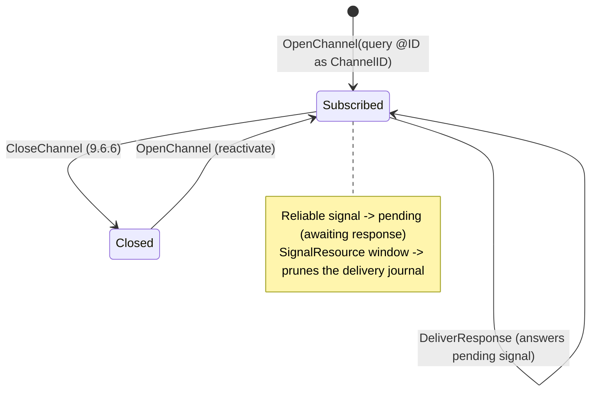

# xjdf4s-xjmf — XJMF transport: channels and sessions (stage 06)

The executable XJMF protocol **without a network**: persistent channels, subscriptions, response
correlation and signal replacement as a pure Free algebra with two interpreters (a deterministic
channel machine and an event trace). The HTTP runtime arrives in stage 07.

## Normative anchors

| Rule | Where |
|---|---|
| Query + `Subscription` opens a persistent channel; the receiver SHALL first answer the query, then send signals | 9.6.2 |
| `@ChannelID` SHALL equal the `Header/@ID` of the initiating query and SHALL match `Header/@refID` of every signal on the channel | Table 8.71 |
| A response's `Header/@refID` identifies the message it answers (9.6.1); for a signal it is the signal's `Header/@ID` | 9.6.1, Table 7.3 |
| Same subscription type to the same URL SHALL replace the existing subscription | 9.6.3 |
| `FireAndForget` signals are not resent; `Reliable` signals SHALL be resent until answered; unanswered reliable signals are observable state | 9.6.4, 9.6.5 |
| Signals SHALL be sent in event order; a later signal SHALL NOT overtake an unanswered one | 9.6.5.1 |
| A persistent channel SHALL be deleted by `CommandStopPersistentChannel` | 9.6.6 |
| `SignalResource` replacement window: previous signals of the same scope and `Header/@DeviceID` with time strictly between `@ReplaceAfter` and `@ReplaceBefore` are replaced | Table 7.54 |

## Channel state machine



A `Closed` channel is kept in the channel map, so a delivery attempt on it is observable as a
`ChannelNotOpen` event rather than being silently dropped.

## The two interpreters — one program

```scala
val program: Xjmf[Option[Response]] =
  for
    _      <- Xjmf.openChannel(subscription, channelId, messageType)
    _      <- Xjmf.deliver(signalResourceS1)          // Header/@refID = Q1, Reliable
    before <- Xjmf.awaitResponse(s1)                  // None: not answered yet
    _      <- Xjmf.deliverResponse(responseR1)        // Header/@refID = S1
    after  <- Xjmf.awaitResponse(s1)                  // Some(R1)
  yield after

val state = XjmfInterpreters.run(program)             // full machine, trace in state.events
val trace = XjmfInterpreters.trace(program)           // WriterT over the same state
assert(state.events == trace)                         // identical by construction
```

Both interpreters wrap the single transition core `XjmfInterpreters.transition`; the traced variant
(`WriterT[State[XjmfState, *], Chain[TransportEvent], *]`) exists because the trace depends on channel
state (`Unrouted`/`ChannelNotOpen`), which a plain `Writer` cannot see. The rule from the stage roadmap
holds: **Free for scenarios** (programs that run multiple times and can be traced/replayed), **tagless
final for runtime capabilities** — the stage 07 HTTP interpreter will be a `XjmfOp ~> IO`.

## State

```scala
final case class XjmfState(
  channels:  Map[Nmtoken, ChannelState],   // by @ChannelID
  pending:   Chain[PendingSignal],         // reliable signals awaiting a response, in delivery order
  responses: Chain[(String, Response)],    // received responses keyed by the @ID they answer
  delivered: Chain[(Nmtoken, Signal)],     // delivery journal, pruned by replacement windows
  events:    Chain[TransportEvent],        // the exchange trace
)
```

## Scope notes

- The window rule of Table 7.54 is implemented for `SignalResource` (the stage scope); `SignalStatus`
  has a symmetric window rule (Table 7.48) and is the natural extension point.
- "Same scope" is represented by the channel itself: a channel is one subscription, and the signals
  routed to it carry the channel's `@ChannelID` as `@refID`.
- `XsdDateTime` values are lexical ISO 8601 strings, so window comparisons are string comparisons.
- The transport holds no `IO` and no timers: resend timing belongs to stage 07, but the stage 07 runtime
  finds everything it needs here — the unanswered reliable signals are exactly `XjmfState.pending`.
