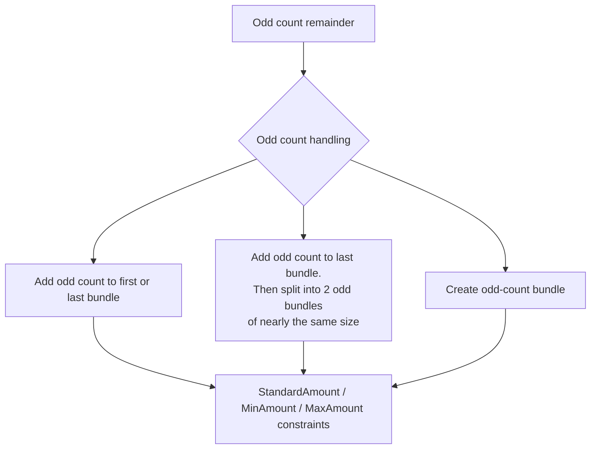
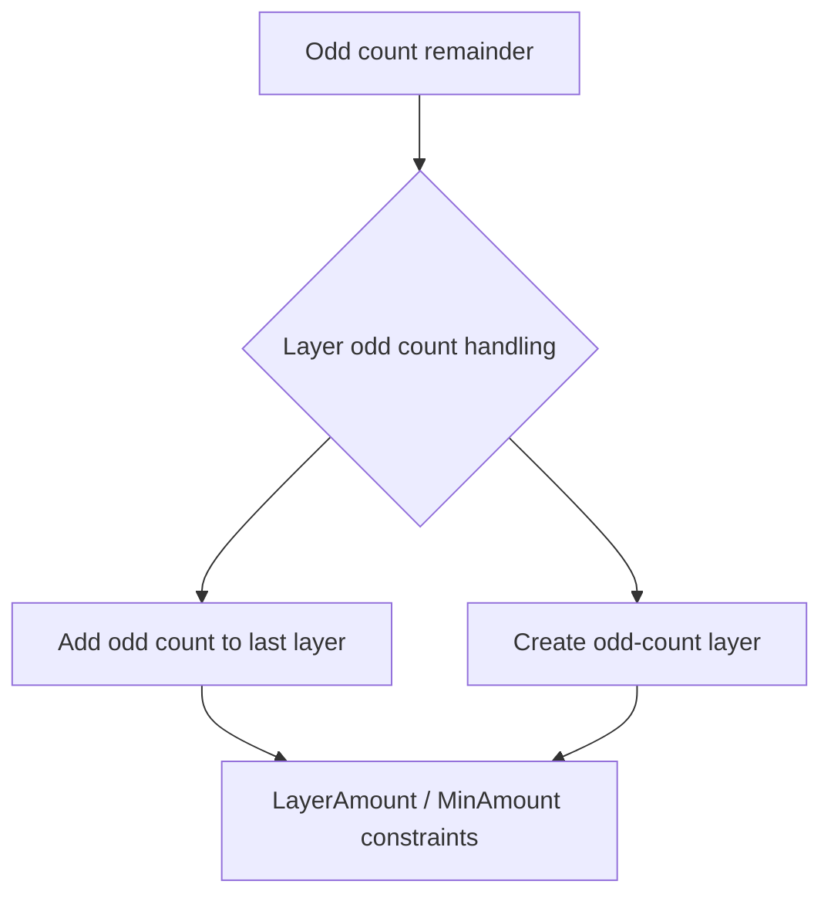

# Chapter 5 Processes

The following chapter lists the individual processes that are defined in detail for XJDF.

## 5.1 Process Template

Processes are defined by their input and output resources (i.e. `ResourceSet[@Usage="Input"]` and `ResourceSet[@Usage="Output"]`). The requirements for the individual processes are provided in the tables below. [Table 5.1 Generic Input ResourceSets](#table-51-generic-input-resourcesets) provides a list of resources that are valid for any process. In addition to the resources listed in the tables for each process, extension ResourceSets, i.e. those in a foreign namespace, MAY be provided. Foreign namespace extensions SHOULD NOT duplicate any XJDF functionality. See *Creating Extension ResourceSets* for details.

> **Note:** The cardinality requirements for ResourceSet and Intent elements, which are defined in this chapter and can be derived from the value of `XJDF/@Types`, are not validated by the XML schema provided by CIP4.

> **Note:** In this chapter, each entry in the 'Name' column of a table provides the requirements in the format:
> - **Name:** The `ResourceSet/@Name` of the resource, e.g. `Media` or `RunList`.
> - **(ProcessUsageValue):** If present, the `ResourceSet/@ProcessUsage` of the resource, e.g. `Document` or `Marks` in case of a `RunList`.
> - **Cardinality:** The cardinality of the ResourceSet. See *Table 1.2 Cardinality Symbols* for details. The cardinality applies to the number of ResourceSet elements. Each ResourceSet may contain multiple Resource elements.

<a id="table-51-generic-input-resourcesets"></a>

**Table 5.1: Generic Input ResourceSets (Sheet 1 of 2)**

| NAME | DESCRIPTION |
| --- | --- |
| `ApprovalDetails?` | ApprovalDetails MAY be appended to processes in order to model proofing and verification requirements. If multiple approvals are requested for an individual workstep, ApprovalDetails SHALL be partitioned by `@Option`. For more information on the Approval process, see [Section 5.3.1 Approval](#531-approval). |
| `Color?` | Color identifies all colors that are used in the job. Color may include separations that represent die lines or other auxiliary colors. |
| `Contact?` | List of internal and external contacts that are associated with processing this XJDF. `Resource/Part/@ContactType` SHALL be provided for all contacts. |
| `CustomerInfo?` | CustomerInfo (without the `@ProcessUsage` attribute) specifies information about the direct customer. |
| `CustomerInfo (EndCustomer)?` | CustomerInfo(EndCustomer) specifies information about the end customers in a subcontracting situation where the direct customer is not the end customer. |
| `Device?` | Device that is associated with processing this XJDF. |
| `MiscConsumable*` | Generic consumables that are associated with processing this XJDF. If multiple MiscConsumable are specified, `ResourceSet/@ProcessUsage` SHALL be specified. The preferred value of `ResourceSet/@ProcessUsage` for a process specific MiscConsumable is provided in that process's table of input resources shown below. Additional MiscConsumable MAY be specified, in which case the value of `ResourceSet/@ProcessUsage` SHOULD be set to the value of `MiscConsumable/@Type`. |
| `NodeInfo?` | NodeInfo (without the `@ProcessUsage` attribute) specifies scheduling information about the explicit process described by this XJDF. |
| `NodeInfo (EndCustomer)?` | NodeInfo(EndCustomer) specifies scheduling information from the end customers in a subcontracting situation where the direct customer is not the end customer. |
| `Preview?` | Any number of previews MAY be associated with a process and used for display purposes such as illustrating the orientation of a resource to an operator. For details of coordinate systems see *Section 2.6 Coordinate Systems in XJDF*. `Part/@PreviewType` SHOULD be `"ThumbNail"` or `"Viewable"`. |

**Table 5.1: Generic Input ResourceSets (Sheet 2 of 2)**

| NAME | DESCRIPTION |
| --- | --- |
| `PrintCondition?` <br> *New in XJDF 2.1* | PrintCondition shall specify the target print condition for a given printing process. |
| `Tool*` | Miscellaneous reusable tools required for a process. If multiple tools of different types are specified, `ResourceSet/@ProcessUsage` SHALL be set to the value of `Tool/@ToolType`. |
| `TransferCurve?` | TransferCurve specifies area coverage correction and coordinate transformations. |
| `UsageCounter?` | Devices MAY use counters, called "usage counters", to track equipment utilization or work performed, such as impressions produced or documents generated. If multiple counters are provided, UsageCounter SHALL be partitioned by `@Option` which SHOULD contain a value from `UsageCounter/@CounterTypes`. |
| `<foreign namespace ResourceSet>*` | Any ResourceSet in a foreign namespace. Foreign namespace extensions SHOULD NOT duplicate functionality of XJDF. See *Creating Extension ResourceSets* for details. |

## 5.2 Combining Individual Process Steps

The processes described in this chapter define individual workflow steps that are assumed to be executed by a single-purpose Device. Some Controllers and Devices are able to combine the functionality of multiple single-purpose Devices and execute more than one process type. For example, a digital printer might be able to execute the Interpreting, Rendering and DigitalPrinting processes. Each XJDF SHALL contain a `@Types` attribute, which in turn contains an ordered list of values of each of processes that the XJDF specifies. The ordering of the process names in the `@Types` attribute specifies the ordering in which the processes SHOULD be executed. If the Final Product result would be indistinguishable, the Device MAY change the execution order of the processes from that given in the `@Types` attribute.

**Example 5.1: Combined Process Steps**

Example of combining three processes in sequence: Interpreting, Rendering and DigitalPrinting.

```xml
<XJDF xmlns="http://www.CIP4.org/JDFSchema_2_0" JobID="CombinedExample"
      Types="Interpreting Rendering DigitalPrinting">
</XJDF>
```

### 5.2.1 Exchange ResourceSets in combined processes

A ResourceSet that is produced by one process and immediately consumed by the following process NEED NOT be explicitly specified in the XJDF. Any such ResourceSet MAY be completely under the control of the receiving Device. In the example above, the output RunList of the Interpreting process is the input RunList of Rendering process and NEED NOT be specified explicitly in the XJDF.

If an exchange ResourceSet is provided, `ResourceSet/@Usage` SHALL NOT be present and `ResourceSet/@CombinedProcessIndex` SHALL reference all processes that use the ResourceSet either as input or as output.

### 5.2.2 Usage of ResourceSets that are used as both input and output

Some processes, e.g. Stripping or QualityControl, modify a resource rather than consume or produce it.

Examples of modification include the expansion of a Layout by Stripping or the update of amounts in Component resources due to failing QualityControl. `ResourceSet/@Usage` of such a ResourceSet shall be set to the value where the ResourceSet is not used as an exchange resource as described in [Section 5.2.1 Exchange ResourceSets in combined processes](#521-exchange-resourcesets-in-combined-processes). If the ResourceSet is not used as an exchange ResourceSet, e.g. because `XJDF/@Types` is a single value, `ResourceSet/@Usage` shall be `"Output"`.

> **Note:** Printing and finishing processes do not modify Component resources; these processes have unique Component resources for their input and output because the resources are at different stages of production and thus need to be uniquely identifiable, e.g. for calculating the value of work in progress.

#### 5.2.2.1 Example of input and combined ResourceSet

For an XJDF that combines stripping and imposition, i.e. where `XJDF/@Types="Stripping Imposition"`, then `ResourceSet[@Name="Layout"]/@Usage="Input"` because Layout is an input to Stripping and an exchange ResourceSet between Stripping and Imposition.

#### 5.2.2.2 Example of output and combined ResourceSet

For an XJDF that combines printing and quality control, i.e. where `XJDF/@Types="ConventionalPrinting QualityControl"`, then `ResourceSet[@Name="Component"]/@Usage="Output"` because Component is an output of QualityControl and an exchange ResourceSet between ConventionalPrinting and QualityControl.

### 5.2.3 XJDF with Multiple Processes of the Same Type

`XJDF/@Types` MAY contain multiple instances of the same process type, e.g., `"Cutting Folding Cutting"`. The parameters of the first Cutting process are most likely to be different from those of the second Cutting process. If multiple processes that consume identical resources are specified in `@Types`, `ResourceSet/@CombinedProcessIndex` SHALL be present and refer to the index of the process type in the complete list of `XJDF/@Types`. In the example above, for instance `ResourceSet/@CombinedProcessIndex="0"` for the CuttingParams that apply to the first Cutting process and `ResourceSet/@CombinedProcessIndex="2"` for the CuttingParams that apply to the second Cutting process. `ResourceSet/@CombinedProcessIndex="1"` is not required for the FoldingParams since there is only one Folding process.

## 5.3 General Processes

General processes that can take place throughout the workflow.

### 5.3.1 Approval

The Approval process can take place at various steps in a workflow. For example, a ResourceSet (e.g., a printed sheet or a finished book) is used as the input to be approved, and an ApprovalDetails (given, for example, by a customer or foreman) is produced. If Approval is combined with any other process type, the workstep that follows Approval in `XJDF/@Types` SHALL NOT commence until a successful ApprovalDetails is provided for a given partition.

**Table 5.2: Approval – Input Resources**

| NAME | DESCRIPTION |
| --- | --- |
| `ApprovalParams` | Details of the approval process. |
| `ResourceSet` | The resources to be approved. When the input resource of an Approval process is a RunList that represents a ByteMap, it SHOULD be displayed on a viewing Device. |
| Generic Input Resources* | See [Table 5.1 Generic Input ResourceSets](#table-51-generic-input-resourcesets) for additional input resources that are valid for all process types. |

**Table 5.3: Approval – Output Resources**

| NAME | DESCRIPTION |
| --- | --- |
| `ApprovalDetails` | Result of any Approval process given, for example, by a customer or foreman. |
| `ResourceSet` | This ResourceSet describes the resources after the Approval is complete. |

### 5.3.2 Delivery

This process can be used to describe the delivery of an end product or a ResourceSet to or from a location that SHALL be specified in a Contact with `Part[@ContactType="Delivery"]`. Delivery of data over the network MAY also be specified in the Delivery process.

If the delivery only requires the address of a single end customer and no specific details of the delivery are known, then the delivery process need not be specifically parameterized.

Delivery to multiple destinations or in multiple steps SHOULD be specified in DeliveryParams that are partitioned by `@DropID`. If multiple DeliveryParams contain the same `@DropID`, they SHOULD be delivered in one delivery, regardless of whether the DeliveryParams belong to the same XJDF or not. Common delivery of multiple products to the same address SHALL be specified by providing multiple `DeliveryParams/DropItem` elements.

**Example 5.2: Split Delivery**

The following example illustrates a split delivery of thirty books, ten of which go to the contact defined by "Drop1" and twenty of which go to the contact defined by "Drop2".

```xml
<XJDF xmlns="http://www.CIP4.org/JDFSchema_2_0" JobID="splitDelivery" Types="Product">
  <ProductList>
    <Product Amount="30" ID="IDBook" IsRoot="true" ProductType="Book"/>
  </ProductList>
  <ResourceSet Name="Contact" Usage="Input">
    <Resource>
      <Part ContactType="Delivery" DropID="Drop1"/>
      <Contact>
        <Address City="city1"/>
        <Person FirstName="Name1"/>
      </Contact>
    </Resource>
    <Resource>
      <Part ContactType="Delivery" DropID="Drop2"/>
      <Contact>
        <Address City="city2"/>
        <Person FirstName="Name2"/>
      </Contact>
    </Resource>
  </ResourceSet>
  <ResourceSet Name="DeliveryParams" Usage="Input">
    <Resource>
      <Part DropID="Drop1"/>
      <DeliveryParams>
        <DropItem Amount="10" ItemRef="IDBook"/>
      </DeliveryParams>
    </Resource>
    <Resource>
      <Part DropID="Drop2"/>
      <DeliveryParams>
        <DropItem Amount="20" ItemRef="IDBook"/>
      </DeliveryParams>
    </Resource>
  </ResourceSet>
</XJDF>
```

**Table 5.4: Delivery – Input Resources (Sheet 1 of 2)**

| NAME | DESCRIPTION |
| --- | --- |
| `Bundle?` | Bundle describes the structure of the packaging of the products that SHALL be delivered. If DeliveryParams is partitioned by `@DropID`, Bundle SHOULD also be partitioned by `@DropID`. |

**Table 5.4: Delivery – Input Resources (Sheet 2 of 2)**

| NAME | DESCRIPTION |
| --- | --- |
| `DeliveryParams` | Details of the individual deliveries SHALL be provided in DeliveryParams. |
| Generic Input Resources* | See [Table 5.1 Generic Input ResourceSets](#table-51-generic-input-resourcesets) for additional input resources that are valid for all process types. |

**Table 5.5: Delivery – Output Resources**

| NAME | DESCRIPTION |
| --- | --- |
| `ResourceSet*` | Any ResourceSet that is delivered to the process SHALL be specified as an output of the Delivery process. |

### 5.3.3 ManualLabor

This process can be used to describe any process where resources are handled manually. The ManualLabor process is designed to monitor any type of non-automated labor from an MIS system.

**Table 5.6: ManualLabor – Input Resources**

| NAME | DESCRIPTION |
| --- | --- |
| `ManualLaborParams` | Details on the ManualLabor process. |
| `ResourceSet*` | Resources that are used to create the output resource. |
| Generic Input Resources* | See [Table 5.1 Generic Input ResourceSets](#table-51-generic-input-resourcesets) for additional input resources that are valid for all process types. |

**Table 5.7: ManualLabor – Output Resources**

| NAME | DESCRIPTION |
| --- | --- |
| `ResourceSet*` | The resources that were created by manual work. In general these will be Component resources, but other resources MAY also be processed manually. If no output resources are specified, the ManualLabor process describes incidental work. |

### 5.3.4 QualityControl

This process defines the setup and frequency of quality controls for a process. QualityControl is generally performed on Component resources.

Multiple QualityControl processes MAY be specified. See `ResourceSet/@CombinedProcessIndex` for differentiating the resources of multiple identical processes.

#### 5.3.4.1 Mapping severity to scores

XJDF provides a generic scoring of quality using the `@Severity` attribute which is an integer data type and has a restricted range of [0–100].

Typically, quality scoring systems will have their own levels and ordering of results and these SHOULD be mapped to a value in `@Severity`. This will typically require mapping multiple `@Severity` values to a quality score.

When writing a score as a severity, the following mapping SHALL be applied:

- Highest quality: `@Severity="0"`
- Lowest quality: `@Severity="100"`
- All other values:

  ```
  @Severity = 100 × P / (N − 1)
  ```

  Where `P` = "Position of score" and `N` = "Number of scores".

When reading a severity and translating to a score, the following mapping SHALL be applied:

```
P = S × (N − 1) / 100
```

Where `P` = "Position of score", `S` = "Severity" and `N` = "Number of scores".

> **Note:** The score positions are zero based and are assumed to be linearly distributed between the lowest and highest values.

> **Note:** The mapping of positions to the names of scores is left as an exercise for the reader.

> **Note:** The algorithms above ensure that `@Severity="0"` is always mapped to the highest score, `@Severity="100"` is always mapped to the lowest score and that all other positions are close to the center of the valid score range.

A low `@Severity` value of `"0"` SHALL always represent a better quality than higher `@Severity` values.

#### 5.3.4.2 Example Severity for Barcodes

The following table shows how the barcode quality grades as defined in [ISO15415:2011] and [ISO15416:2016] could be mapped to `@Severity` in QualityControlParams and QualityControlResult.

**Table 5.8: Barcode quality grade mapping (Sheet 1 of 2)**

| ANSI GRADE | ISO GRADE | @SEVERITY VALUE | @SEVERITY RANGE | DESCRIPTION |
| --- | --- | --- | --- | --- |
| A | 4 | `"0"` | `"0"`–`"20"` | Very good. |
| B | 3 | `"30"` | `"21"`–`"40"` | Good. |
| C | 2 | `"50"` | `"41"`–`"60"` | Satisfactory. |

**Table 5.8: Barcode quality grade mapping (Sheet 2 of 2)**

| ANSI GRADE | ISO GRADE | @SEVERITY VALUE | @SEVERITY RANGE | DESCRIPTION |
| --- | --- | --- | --- | --- |
| D | 1 | `"70"` | `"61"`–`"80"` | Sufficient. |
| F | 0 | `"100"` | `"81"`–`"100"` | Failed. |

**Table 5.9: QualityControl – Input Resources**

| NAME | DESCRIPTION |
| --- | --- |
| `ColorantControl?` <br> *New in XJDF 2.1* | ColorantControl SHALL define the color separations that are expected to have been printed on the input Component. |
| `Layout?` <br> *New in XJDF 2.1* | Definition of the production marks and print content for QualityControl. <br> **Note:** See Preview in [Table 5.1 Generic Input ResourceSets](#table-51-generic-input-resourcesets) for referencing images for comparison or display. |
| `QualityControlParams` | Detailed definition of the QualityControl process. |
| `ResourceSet` | The resource to be quality controlled. In general this will be a Component. |
| Generic Input Resources* | See [Table 5.1 Generic Input ResourceSets](#table-51-generic-input-resourcesets) for additional input resources that are valid for all process types. |

**Table 5.10: QualityControl – Output Resources**

| NAME | DESCRIPTION |
| --- | --- |
| `QualityControlResult` | Results of the process, e.g. measurement statistics. The details provided in QualityControlResult SHALL conform at least to the requested methods specified in `QualityControlParams/@Method`. Additional details MAY be provided. |
| `ResourceSet` | This ResourceSet describes the resources after QualityControl has been applied. |

### 5.3.5 Verification

The Verification process is used to confirm that a process has been completely executed.

Verification differs from QualityControl in that Verification verifies the existence of a given set of resources, whereas QualityControl verifies that the existing resources fulfill certain quality criteria.

**Table 5.11: Verification – Input Resources**

| NAME | DESCRIPTION |
| --- | --- |
| `ResourceSet` | The resources to be verified. The input will most often be a Component. |
| `VerificationParams` | Controls the verification requirements. |
| Generic Input Resources* | See [Table 5.1 Generic Input ResourceSets](#table-51-generic-input-resourcesets) for additional input resources that are valid for all process types. |

**Table 5.12: Verification – Output Resources**

| NAME | DESCRIPTION |
| --- | --- |
| `ResourceSet` | The resource after verification. Most often the ResourceSet will not be modified by Verification. |
| `VerificationResult?` | Results of the process, e.g. measurement statistics. |

## 5.4 Prepress Processes

This section lists all processes that are performed prior to printing. This includes processes that are performed to make digital assets press ready and the creation of physical assets such as plates or cut dies that are required for printing or converting.

### 5.4.1 Bending

The Bending Device consumes a printing plate and bends and/or punches it. An in-line plate puncher SHOULD be modeled as a combined process consisting of ImageSetting and Bending processes.

**Table 5.13: Bending – Input Resources**

| NAME | DESCRIPTION |
| --- | --- |
| `BendingParams` | List of assets used to create a listing of dependent assets. |
| `ExposedMedia` | The ExposedMedia resource to be bent/punched. Dummy forms are also described as ExposedMedia even though they NEED NOT be imaged. |
| Generic Input Resources* | See [Table 5.1 Generic Input ResourceSets](#table-51-generic-input-resourcesets) for additional input resources that are valid for all process types. |

**Table 5.14: Bending – Output Resources**

| NAME | DESCRIPTION |
| --- | --- |
| `ExposedMedia` | The bent/punched ExposedMedia resource. |

### 5.4.2 ColorCorrection

ColorCorrection is the process of modifying the specification of colors in documents to achieve some desired visual result. The process might be performed to ensure consistent colors across multiple files of a job or to achieve a specific design intent (e.g., "brighten the image up a little"). ColorCorrection provides simple controls for adjusting colors. See ColorSpaceConversion for color manipulations based on ICC profiles.

Individual output color separations MAY be directly modified by providing an input `TransferCurve/@Curve` to the ColorCorrection process. If present `@Curve` shall be applied after any modifications specified in ColorCorrectionParams.

**Table 5.15: ColorCorrection – Input Resources**

| NAME | DESCRIPTION |
| --- | --- |
| `ColorantControl?` | Identifies the assumed color model for the job. |
| `ColorCorrectionParams` | Parameters of the ColorCorrection process. |
| `RunList` | List of content elements that SHALL be operated on. |
| Generic Input Resources* | See [Table 5.1 Generic Input ResourceSets](#table-51-generic-input-resourcesets) for additional input resources that are valid for all process types. |

**Table 5.16: ColorCorrection – Output Resources**

| NAME | DESCRIPTION |
| --- | --- |
| `RunList` | List of color-corrected content elements. |

### 5.4.3 ColorSpaceConversion

ColorSpaceConversion is the process of converting colors that are provided in a PDL to another color space. There are two ways in which a Controller can use this process to accomplish the color conversion. It can simply order the colors to be converted by the Device assigned to the task, or it can request that the process simply tag the input data for eventual conversion. Additionally, the process can remove all tags from the PDL.

The color conversion controls are based on the use of ICC profiles. While the assumed characterization of input data can take many forms, each can internally be represented as an ICC profile. In order to perform the transformations, input profiles SHALL be paired with the identified final target Device profile to create the transformation.

The target profile for color space conversion selection should be based on `ColorSpaceConversionParams/@ICCProfileUsage` in the following order of precedence.

- **UsePDL** – If present, the embedded target profile SHALL be used.
- **UseSupplied** – The embedded target profile SHALL NOT be used.

In order to avoid the loss of black color fidelity resulting from the transformation from a four-component CMYK to a three-component interchange space, the Controller MAY provide a DeviceLink[^1] transform in `ColorSpaceConversionParams/ColorSpaceConversionOp/FileSpec[@ResourceUsage="DeviceLinkProfile"]`. The transform SHALL be applied when converting from a specific source color space to the final target Device color space specified for the ColorSpaceConversion operation being applied. In these instances, the final target profile SHALL NOT be specified in `ColorSpaceConversionParams/FileSpec`.

[^1]: A DeviceLink transform is a transform that is defined in an ICC profile file (see [ICC.1]) that maps directly from one specific source color space to a specific destination device color space. An example of this is a transform that maps directly from PDL source objects defined using sRGB directly to SWOP CMYK.

**Table 5.17: ColorSpaceConversion – Input Resources**

| NAME | DESCRIPTION |
| --- | --- |
| `ColorantControl?` | Identifies the assumed color model for the job. The ColorantControl resource MAY be modified by a ColorSpaceConversion process. |
| `ColorSpaceConversionParams` | Parameters that define how color spaces will be converted in the file. |
| `RunList` | List of pages, sheets or byte maps on which to perform the selected operation. |
| Generic Input Resources* | See [Table 5.1 Generic Input ResourceSets](#table-51-generic-input-resourcesets) for additional input resources that are valid for all process types. |

**Table 5.18: ColorSpaceConversion – Output Resources**

| NAME | DESCRIPTION |
| --- | --- |
| `RunList` | List of pages, sheets or byte maps on which the selected operation has been performed. |

### 5.4.4 DieDesign

This process describes the design of a die tool set with one or more stations starting from a DieLayout that describes the layout of the one-up designs on a die. The output of this process is a DieLayout resource, describing a tool set for the die cutter Machine that can be used in a subsequent DieMaking process. DieDesign typically follows DieLayoutProduction.

**Table 5.19: DieDesign – Input Resources**

| NAME | DESCRIPTION |
| --- | --- |
| `DieLayout` | A resource describing the die cutter layout. This layout is already imposed for a specific sheet size and MAY describe multiple stations. |
| Generic Input Resources* | See [Table 5.1 Generic Input ResourceSets](#table-51-generic-input-resourcesets) for additional input resources that are valid for all process types. |

**Table 5.20: DieDesign – Output Resources**

| NAME | DESCRIPTION |
| --- | --- |
| `DieLayout+` | A set of resources describing the die cutter tool set. |

### 5.4.5 DieLayoutProduction

This process describes the layout of one or more structural designs for a given Media. The output of this process is a DieLayout resource describing the positioning of the individual one-ups on the die. The DieLayoutProduction process can be performed by a human operator using a CAD application. In some cases it can be an automated process. The process can be run in estimation mode; in which case multiple solutions are returned that can then be used as input of a cost estimation module to determine the optimal layout. The DieLayoutProduction process is the packaging equivalent of a Stripping process in conventional printing. The output DieLayout of DieLayoutProduction is typically the input of a subsequent DieDesign process.

**Example 5.3: DieLayoutProduction: Single Shape and Two Sheet Sizes**

Example of DieLayoutProduction of a single shape on 2 stock sheet sizes.

```xml
<XJDF xmlns="http://www.CIP4.org/JDFSchema_2_0" JobID="Die1" Types="DieLayoutProduction">
  <ResourceSet Name="ShapeDef">
    <Resource ID="r_000007">
      <ShapeDef>
        <FileSpec URL="file://myserver/myshare/olive.dd3"/>
      </ShapeDef>
    </Resource>
  </ResourceSet>
  <ResourceSet Name="DieLayoutProductionParams" Usage="Input">
    <Resource>
      <DieLayoutProductionParams>
        <ConvertingConfig SheetHeightMax="2200" SheetHeightMin="2200"
                          SheetWidthMax="2800" SheetWidthMin="2800"/>
        <ConvertingConfig SheetHeightMax="2500" SheetHeightMin="2500"
                          SheetWidthMax="3400" SheetWidthMin="3400"/>
        <RepeatDesc LayoutStyle="StraightNest" ShapeDefRef="r_000007"/>
      </DieLayoutProductionParams>
    </Resource>
  </ResourceSet>
  <ResourceSet Name="DieLayout" Usage="Output">
    <Resource DescriptiveName="The die layout">
      <DieLayout/>
    </Resource>
  </ResourceSet>
</XJDF>
```

**Table 5.21: DieLayoutProduction – Input Resources**

| NAME | DESCRIPTION |
| --- | --- |
| `DieLayoutProductionParams` | The parameters for DieLayoutProduction. |
| Generic Input Resources* | See [Table 5.1 Generic Input ResourceSets](#table-51-generic-input-resourcesets) for additional input resources that are valid for all process types. |

**Table 5.22: DieLayoutProduction – Output Resources**

| NAME | DESCRIPTION |
| --- | --- |
| `DieLayout` | DieLayout describes a die cutter tool set. If `DieLayoutProductionParams/@Estimate="True"`, multiple alternative DieLayout Resource elements that SHALL be partitioned by `@Option` SHALL be returned, otherwise a single DieLayout SHALL be generated. |

### 5.4.6 ImageEnhancement

The ImageEnhancement process describes generic image data processing.

> **Note:** The source MAY be any image, but also text or vector graphics.

**Table 5.23: ImageEnhancement – Input Resources**

| NAME | DESCRIPTION |
| --- | --- |
| `ImageEnhancementParams` | Describes the controls selected for the manipulation of images. |
| `RunList` | List of content data elements on which to perform the selected operations. |
| Generic Input Resources* | See [Table 5.1 Generic Input ResourceSets](#table-51-generic-input-resourcesets) for additional input resources that are valid for all process types. |

**Table 5.24: ImageEnhancement – Output Resources**

| NAME | DESCRIPTION |
| --- | --- |
| `RunList` | List of page contents with images that have been manipulated as indicated by the ImageEnhancementParams resource. |

### 5.4.7 ImageSetting

The ImageSetting process is executed by an imagesetter or platesetter that images a bitmap onto the film or plate media.

**Table 5.25: ImageSetting – Input Resources**

| NAME | DESCRIPTION |
| --- | --- |
| `ColorantControl?` | The ColorantControl resources that define the ordering and usage of inks during marking on the imagesetter. |
| `DevelopingParams?` | Controls the physical and chemical specifics of the media development process. |
| `ImageSetterParams?` | Controls the Device specific features of the imagesetter. |
| `Media` | The film or plate prior to imaging. |
| `RunList` | Identifies the set of bitmaps to image. The RunList MAY contain bytemaps or images. |
| Generic Input Resources* | See [Table 5.1 Generic Input ResourceSets](#table-51-generic-input-resourcesets) for additional input resources that are valid for all process types. |

**Table 5.26: ImageSetting – Output Resources**

| NAME | DESCRIPTION |
| --- | --- |
| `ExposedMedia` | The exposed media resource. In the case of plate setting, this is the exposed set of plates. In the case of film setting, this is the exposed set of films. |

### 5.4.8 Imposition

The Imposition process is responsible for combining pages of input graphical content onto surfaces of the physical output media. Static or dynamic printer's marks can be added to the surface in order to facilitate various aspects of the production process. Among other things, these marks are used for press alignment, color calibration, job identification, and as guides for cutting and folding.

> **Note:** The Imposition process specifies the task of combining pages and marks on sheets. The task of setting up the parameters needed for Imposition is defined by Stripping.

**Table 5.27: Imposition – Input Resources (Sheet 1 of 2)**

| NAME | DESCRIPTION |
| --- | --- |
| `Layout` | A Layout resource that indicates how the content pages from the Document RunList and marks from the Marks RunList (see below) are combined onto imposed surfaces. |

**Table 5.27: Imposition – Input Resources (Sheet 2 of 2)**

| NAME | DESCRIPTION |
| --- | --- |
| `RunList(Document)` | Structured list of incoming page contents that are transformed to produce the imposed surface images. |
| `RunList(Marks)?` | Structured list of incoming marks. These are typically printer's marks such as fold marks, cut marks, punch marks or color bars. |
| Generic Input Resources* | See [Table 5.1 Generic Input ResourceSets](#table-51-generic-input-resourcesets) for additional input resources that are valid for all process types. |

There are two mechanisms provided for controlling the flow of page images onto sheet surfaces: The default mechanism is for non-automated (e.g., fully-specified) Imposition. Fully-specified imposition explicitly identifies all page content for each sheet imaged and references these pages by means of the order in which they are defined in the input RunList(Document) resource. Static printer's marks are referenced in a similar fashion from the input RunList(Marks) resource.

Setting the `@Automated` attribute of the Layout resource to `"true"` activates a template approach to imposition and relies upon the full hierarchy structure of the document (as specified by the RunList(Document)) to specify the page content to be imposed.

In XJDF, there is a single Layout definition. When described fully (`@Automated="false"`), the Layout resource partition structure explicitly defines the imposition to take place.

> **Note:** The XML order in which the partitions of the Layout resource are defined is significant for both automated and non-automated imposition and defines the order in which the imposition engine SHALL create the output RunList.

**Table 5.28: Imposition – Output Resources**

| NAME | DESCRIPTION |
| --- | --- |
| `RunList` | The RunList represents a structured list of imposed surfaces. Conceptually the output RunList will be partitioned by at least `@SheetName` and `@Side` to represent the individual printed surfaces. If the Imposition process is executed before any raster image processing, this will generally be consumed by an Interpreting process. In the case of where Imposition is executed after any raster image processing, it will be consumed by DigitalPrinting or ImageSetting. |

#### 5.4.8.1 Execution Model for Automated Imposition

The major difference between automated and non automated imposition is the execution model. Non-automated imposition requires a completely defined Layout that defines each sheet and "pulls" document pages from a RunList(Document).

On the other hand, automated imposition requires a completely defined RunList that "pushes" pages into positions of the Layout.

The Imposition process transforms the sequences of pages contained within the input RunList to a sequence of imposed sheet surfaces. The input RunList(Document) and the order of the documents defined by the Layout resource explicitly define the 'page to sheet' surface mapping transformation that SHALL be applied by the imposition engine.

The pseudo-code below describes the processing performed by the imposition engine at a high level:

```
For each Set in the set in the order specified in the input RunList(Document)
  For each Document in the order specified in the input RunList(Document)
    For each Page in the Document
      For each Layout partition that matches the Document and Page
        Process the Page through the Layout partition
```

Thus, each Resource in the `ResourceSet[@Name="Layout"]` SHALL be processed in the XML order specified. Every document belonging to the current set is then evaluated against the Partition Keys specified for that Layout to determine if it SHALL be processed by that Layout.

The RunList output from the Imposition process represents a sequence of imposed sheet surfaces. The structure of the Layout affects the Partition Keys conserved by its output RunList (and its referenced content), by conserving all Partition Keys specified in the Layout along with generating all of the appropriate Partition Keys, such as `@SetIndex`, `@DocIndex`, `@SheetIndex`. The output RunList can be viewed conceptually as a collection of sheet surface pairings (front and back) that conserves information about which PDL metadata was in scope at the time the sheets were generated.

#### 5.4.8.2 Cut and Stack Imposition

Pages are normally distributed onto an entire imposed sheet prior to processing the next imposed sheet. If cut and stack imposition is selected by specifying `Layout/Position/@StackOrd`, this distribution order shall be modified so that pages are distributed in the order of the individual stacks. Each stack is filled to the calculated value of `Layout/Position/@StackDepth` prior to filling the stack with the next highest value of `@StackOrd`.

**Example 5.4: Cut and Stack Imposition**

This simple example is configured for 2 stacks with a depth of 10 sheets. Therefore the first 20 pages will be filled into the position with `@StackOrd="0"`, the next 20 pages will be filled into the position with `@StackOrd="1"`, and the following pages will be continue switching stacks every 20 pages.

```xml
<Layout Automated="true" WorkStyle="WorkAndTurn">
  <Position RelativeBox="0 0 50 100" StackDepth="10" StackOrd="0"/>
  <Position RelativeBox="50 0 100 100" StackDepth="10" StackOrd="1"/>
</Layout>
```

#### 5.4.8.3 Imposition for Tiling

Sometimes content from a surface needs to be imaged onto media that is smaller than the designated surface. Each tile SHALL be specified as a Layout resource with a `Part/@TileID`. `PlacedObject/@ClipBox` SHOULD be specified as the size of the clipped image of the tile. `PlacedObject/@CTM` will typically be the same except for an image shift that moves the source image into the clip box. `@TrimSize` and `@TrimCTM` SHOULD be specified to define the visible area of the tile.

The following example illustrates tiling of the image shown in Figure 5-1 using Layout/PlacedObject, assuming that each tile has a dimension of 600 x 400 points and the clip box extends 10 points in all four directions. Only the first and last tile are shown for brevity.

```xml
<ResourceSet Name="Layout" Usage="Input">
  <Resource>
    <Part Side="Front" TileID="0 0"/>
    <Layout SurfaceContentsBox="0 0 1820 1220">
      <PlacedObject CTM="1 0 0 1 0 0" ClipBox="0 0 620 420" Ord="0"
                    TrimCTM="1 0 0 1 -10 -10" TrimSize="600 400">
        <ContentObject/>
      </PlacedObject>
    </Layout>
  </Resource>
  <!-- 7 further tiles '0 1' to '2 1' omitted for brevity -->
  <Resource>
    <Part Side="Front" TileID="2 2"/>
    <Layout SurfaceContentsBox="0 0 1820 1220">
      <PlacedObject CTM="1 0 0 1 -1200 -800" ClipBox="0 0 620 420" Ord="0"
                    TrimCTM="1 0 0 1 -1210 -810" TrimSize="600 400">
        <ContentObject/>
      </PlacedObject>
    </Layout>
  </Resource>
</ResourceSet>
```

> **Figure 5-1: Tiling Example using Layout/PlacedObject** — Диаграмма, показывающая разделение изображения постера на сетку тайлов. Обозначены: видимый размер тайла (`@TrimSize`), полезный размер изображения (`@SurfaceContentsBox`), область выпуска (bleed), видимая часть, перекрытие (overlap), а также параметры `@TileID`, `@TrimCTM` и `@ClipBox` для каждого тайла.

### 5.4.9 InkZoneCalculation

The InkZoneCalculation process takes place in order to preset the ink zones before printing. The Preview data are used to calculate a coverage profile that represents the ink distribution along and perpendicular to the ink zones within the printable area of the preview. The InkZoneProfile can be combined with additional, vendor-specific data in order to preset the ink zones and the oscillating rollers of an offset printing press.

**Table 5.29: InkZoneCalculation – Input Resources**

| NAME | DESCRIPTION |
| --- | --- |
| `InkZoneCalculationParams?` | Specific information about the printing press geometry (e.g., the number of zones) to calculate the InkZoneProfile. |
| `Layout?` | Specific information about the Media (including type and color) and about the sheet (placement coordinates on the printing cylinder). |
| `Preview` | A low to medium resolution bitmap file representing the content to be printed. |
| Generic Input Resources* | See [Table 5.1 Generic Input ResourceSets](#table-51-generic-input-resourcesets) for additional input resources that are valid for all process types. |

**Table 5.30: InkZoneCalculation – Output Resources**

| NAME | DESCRIPTION |
| --- | --- |
| `InkZoneProfile` | InkZoneProfile contains information about ink coverage along and perpendicular to the ink zones for a specific press geometry. |

### 5.4.10 Interpreting

The Interpreting process consumes PDL data and translates a stream of display list data in a system-specified format based on information about the marking engine and media.

See PDLCreation for the inverse process, which consumes display list data and generates PDL.

See RasterReading for the process that generates display list data from raster byte map images.

See Rendering for the process that consumes display list data and generates raster byte map images.

**Table 5.31: Interpreting – Input Resources**

| NAME | DESCRIPTION |
| --- | --- |
| `ColorantControl?` | Identifies the color model used by the job. |
| `FontPolicy?` | Describes the behavior of the font machinery in absence of requested fonts. |
| `InterpretingParams` | Provides the parameters needed to interpret the PDL pages specified in the RunList resource. |
| `RunList` | This resource identifies a set of PDL pages or surfaces that SHALL be interpreted. |
| Generic Input Resources* | See [Table 5.1 Generic Input ResourceSets](#table-51-generic-input-resourcesets) for additional input resources that are valid for all process types. |

**Table 5.32: Interpreting – Output Resources**

| NAME | DESCRIPTION |
| --- | --- |
| `RunList` | Pipe of streamed data that represents the results of Interpreting the pages in the RunList. In general, it is assumed that the Interpreting and Rendering processes are tightly coupled and that there is no value in attempting to develop a general specification for the format of this data. |

### 5.4.11 LayoutElementProduction

This process describes the creation of page elements. It also explains how to create a layout that can put together all of the necessary page elements, including text, bitmap images, vector graphics, PDL or application files such as Adobe InDesign®, Adobe PageMaker® and Quark XPress®. The elements might be produced using any of a number of various software tools. This process is often performed several times in a row before the final RunList, representing a final page layout file, is produced.

**Table 5.33: LayoutElementProduction – Input Resources**

| NAME | DESCRIPTION |
| --- | --- |
| `LayoutElementProductionParams?` | The parameters for the LayoutElementProduction process. |
| `PreflightParams?` | Preflight profile that describes the rules that the completed RunList SHALL adhere to. |
| `RunList?` | Location or metadata about the PDL or application file, bitmap image file, text file, vector graphics file, etc. |
| Generic Input Resources* | See [Table 5.1 Generic Input ResourceSets](#table-51-generic-input-resourcesets) for additional input resources that are valid for all process types. |

**Table 5.34: LayoutElementProduction – Output Resources**

| NAME | DESCRIPTION |
| --- | --- |
| `RunList` | A RunList that represents the page elements SHALL be produced. |

### 5.4.12 LayoutShifting

LayoutShifting specifies how to apply separation dependent shifts on a flat or objects on a press sheet.

The exact ordering of the process within the Interpreting, Rendering and ImageSetting and the elements referenced by input and output RunList elements are not defined. LayoutShifting MAY occur on display lists, raster data or in the image setting hardware.

**Table 5.35: LayoutShifting – Input Resources**

| NAME | DESCRIPTION |
| --- | --- |
| `LayoutShift` | Parameters for the LayoutShifting. |
| `RunList` | References the input objects/flats to apply shifting to. |
| Generic Input Resources* | See [Table 5.1 Generic Input ResourceSets](#table-51-generic-input-resourcesets) for additional input resources that are valid for all process types. |

**Table 5.36: LayoutShifting – Output Resources**

| NAME | DESCRIPTION |
| --- | --- |
| `RunList` | The output RunList references the image data that the separation dependent layout shifts applied to. |

### 5.4.13 PDLCreation

The PDLCreation Device consumes the display list of graphical elements generated by an Interpreting or RasterReading and produces a new PDL output RunList based on the selected output parameters.

See Interpreting for the inverse process, which consumes PDL data and generates display list data.

See RasterReading for the process that generates display list data from raster byte map images.

See Rendering for the process that consumes display list data and generates raster byte map images.

**Example 5.5: Creating a PDF from multiple input files**

The following example illustrates how multiple TIFF files are combined into a single PDF using `Part/@PageNumber`.

```xml
<XJDF xmlns="http://www.CIP4.org/JDFSchema_2_0" JobID="PDLCreationExample"
      Types="PDLCreation" Version="2.1">
  <ResourceSet Name="PDLCreationParams" Usage="Input">
    <Resource>
      <PDLCreationParams MimeType="application/pdf"/>
    </Resource>
  </ResourceSet>
  <ResourceSet Name="RunList" Usage="Input">
    <Resource>
      <Part PageNumber="0 0"/>
      <RunList NPage="1">
        <FileSpec MimeType="image/tiff" URL="file://page0.tif"/>
      </RunList>
    </Resource>
    <Resource>
      <Part PageNumber="1 1"/>
      <RunList NPage="1">
        <FileSpec MimeType="image/tiff" URL="file://page1.tif"/>
      </RunList>
    </Resource>
  </ResourceSet>
  <ResourceSet Name="RunList" Usage="Output">
    <Resource>
      <RunList NPage="2">
        <FileSpec MimeType="application/pdf" URL="file://2page.pdf"/>
      </RunList>
    </Resource>
  </ResourceSet>
</XJDF>
```

**Table 5.37: PDLCreation – Input Resources**

| NAME | DESCRIPTION |
| --- | --- |
| `ImageCompressionParams?` | This resource provides a set of controls that determines how images will be compressed in the resulting PDL pages. |
| `PDLCreationParams` | These parameters control the operation of the process that interprets the display list and produces the resulting PDL pages. |
| `RunList` | This resource is a pipe of streamed data that represents a Device independent display list structure. The RunList SHALL specify a ByteMap element. |
| Generic Input Resources* | See [Table 5.1 Generic Input ResourceSets](#table-51-generic-input-resourcesets) for additional input resources that are valid for all process types. |

**Table 5.38: PDLCreation – Output Resources**

| NAME | DESCRIPTION |
| --- | --- |
| `RunList` | This resource identifies the location of the resulting PDL file(s). If the `FileSpec/@MimeType` is specified, then the value SHALL match `PDLCreationParams/@MimeType`. If not specified, then `PDLCreationParams/@MimeType` SHALL be inserted. |

### 5.4.14 Preflight

Preflighting is the process of examining the components of a print job to ensure that the job will print successfully and with the expected results. Preflight checks can be performed on each document or page identified within the associated RunList.

Preflighting a file is generally a two-step process. First, the documents are analyzed and compared to the set of tests. Then, a preflight report is built to list the encountered issues (according to the tests).

**Table 5.39: Preflight – Input Resources**

| NAME | DESCRIPTION |
| --- | --- |
| `PreflightParams` | A specified list of tests against which documents and/or pages SHALL be tested. |
| `RunList` | The list of documents and/or pages to be preflighted. |
| Generic Input Resources* | See [Table 5.1 Generic Input ResourceSets](#table-51-generic-input-resourcesets) for additional input resources that are valid for all process types. |

**Table 5.40: Preflight – Output Resources**

| NAME | DESCRIPTION |
| --- | --- |
| `PreflightReport` | PreflightReport is a container for logging information that is generated by the Preflight process. |
| `RunList?` | The list of output documents that MAY have been repaired by the Preflight process. |

### 5.4.15 PreviewGeneration

The PreviewGeneration process produces a low resolution Preview of each separation that will be printed. The Preview can be used in later processes such as InkZoneCalculation.

The extent of the PDL coordinate system (as specified by the MediaBox attribute, the resolution of the preview image, and width and height of the image) SHALL fulfill the following requirements:

- `(MediaBox width × x_resolution) / 72 − width = ±1`
- `(MediaBox height × y_resolution) / 72 − height = ±1`
- A gray value of 0 represents full ink, while a value of 255 represents no ink (see the DeviceGray color model in [PostScript] Chapter 4.8.2).

**Table 5.41: PreviewGeneration – Input Resources**

| NAME | DESCRIPTION |
| --- | --- |
| `ColorantControl?` | The ColorantControl resources that define the ordering and usage of inks in print modules. Needed for generating thumbnails. |
| `PreviewGenerationParams` | Parameters specifying the size and the type of the preview. |
| `RunList?` | Bitmap data are consumed by the PreviewGeneration process. |
| Generic Input Resources* | See [Table 5.1 Generic Input ResourceSets](#table-51-generic-input-resourcesets) for additional input resources that are valid for all process types. |

**Table 5.42: PreviewGeneration – Output Resources**

| NAME | DESCRIPTION |
| --- | --- |
| `Preview` | Representation of the Preview files that were produced by the PreviewGeneration process. |

#### 5.4.15.1 Rules for the Generation of the Preview Image

To be useful for the ink consumption calculation, the preview data SHALL be generated with an appropriate resolution. This means not only spatial resolution, but also color or tonal resolution. Spatial resolution is important for thin lines, while tonal resolution becomes important with large areas filled with a certain tonal value. The maximum error caused by limited spatial and tonal resolution SHOULD be less than 1%.

#### 5.4.15.2 Spatial Resolution

Where pixels of the preview image fall on the border between two zones, their tonal values SHALL be split up. In a worst case scenario, the pixels fall just in the middle between a totally white and a totally black zone. In this case, the tonal value is 50%, but only 25% contributes to the black zone. With the resolution of the preview image and the zone width as variables, the maximum error can be calculated using the following equation:

```
error[%] = 100 / (4 × resolution[L/mm] × zone_width[mm])
```

For a zone width broader than 25 mm, a resolution of 2 lines per mm will always result in an error less than 0.5%. Therefore, a resolution of 2 lines per mm (equal to 50.8 dpi) is suggested.

> **Figure 5-2: Worst case scenario for area coverage calculation** — Диаграмма, показывающая две зоны (Zone 1 и Zone 2), разделённые границей, с пикселем, перекрывающим эту границу. Иллюстрирует наихудший случай при расчёте покрытия площади.

#### 5.4.15.3 Tonal Resolution

The kind of error caused by color quantization depends on the number of shades available. If the real tonal value is rounded to the closest (lower or higher) available shade, the error can be calculated using the following equation:

```
error[%] = 100 / (2 × number_of_shades)
```

Therefore, at least 64 shades SHOULD be used.

#### 5.4.15.4 Line Art Resolution

When rasterizing line art elements, the minimal line width is 1 pixel, which means 1/resolution. Therefore, the relationship between the printing resolution and the (spatial) resolution of the preview image is important for these kind of elements. In addition, a specific characteristic of PostScript RIPs adds another error: within PostScript, each pixel that is touched by a line is set. Tests with different PostScript jobs have shown that a line art resolution of more than 300 dpi is normally sufficient for ink-consumption calculation.

#### 5.4.15.5 Conclusion

There are quite a few different ways to meet the requirements listed above. The following list includes several examples:

- The job can be RIPed with 406.4 dpi monochrome.
- With anti-aliasing, the image data can be filtered down by a factor of 8 in both directions. This results in an image of 50.8 dpi with 65 color shades.
- High resolution data can also be filtered using anti-aliasing. First, the RIPed data, at 2540 dpi monochrome, are taken and filtered down by a factor of 50 in both directions. This produces an image of 50.8 dpi with 2501 color shades. Finally those shades are mapped to 256 shades, without affecting the spatial resolution.

Rasterizing a job with 50.8 dpi and 256 shades of gray is not sufficient. The problem in this case is the rendering of thin lines (see Line Art Resolution above).

#### 5.4.15.6 Recommendations for Implementation

The following three guidelines are strongly RECOMMENDED:

- The resolution of RIPed line art SHOULD be at least 300 dpi.
- The spatial resolution of the preview image SHOULD be approximately 20 pixel/cm (= 50.8 dpi).
- The tonal resolution of the preview image SHOULD be at least 64 shades.

### 5.4.16 RasterReading

The RasterReading process consumes raster graphic formatted files and converts them into a display list structure.

See Rendering for the inverse process that consumes display list data and generates byte maps of raster images.

See Interpreting for the process that consumes PDL data and generates display list data.

See PDLCreation for the process that consumes display list data and generates PDL.

**Table 5.43: RasterReading – Input Resources**

| NAME | DESCRIPTION |
| --- | --- |
| `RasterReadingParams?` | Additional parameters for reading raster files. |
| `RunList` | This resource identifies a set of raster pages or surfaces that will be inserted into the display list. This resource SHALL reference ByteMap images. |
| Generic Input Resources* | See [Table 5.1 Generic Input ResourceSets](#table-51-generic-input-resourcesets) for additional input resources that are valid for all process types. |

**Table 5.44: RasterReading – Output Resources**

| NAME | DESCRIPTION |
| --- | --- |
| `RunList` | Pipe of streamed data that represents the results of RasterReading the pages in the input RunList. The format and detail are implementation dependent. The RunList SHALL specify the output content data for RasterReading. |

### 5.4.17 Rendering

The Rendering process consumes the display list of graphical elements generated by the Interpreting or RasterReading process. It converts the graphical elements according to the geometric and graphic state information contained within the display list and with the RenderingParams information to produce binary rasterized data suitable for processes that consume ByteMap information.

See RasterReading for the inverse process that consumes raster data and generates display lists.

See Interpreting for the process that consumes PDL data and generates display list data.

See PDLCreation for the process that consumes display list data and generates PDL.

**Table 5.45: Rendering – Input Resources**

| NAME | DESCRIPTION |
| --- | --- |
| `ImageCompressionParams?` | Allows definition of compressed raster images. |
| `RenderingParams?` | This resource describes the format of the byte maps to be created and other specifics of the Rendering process. |
| `RunList` | Pipe of streamed data that represents the results of Interpreting or RasterReading the pages in the input RunList. In general, it is assumed that the Interpreting, RasterReading, Rendering and PDLCreation are tightly coupled and that there is no value in attempting to develop a general specification for the format of this data. |
| Generic Input Resources* | See [Table 5.1 Generic Input ResourceSets](#table-51-generic-input-resourcesets) for additional input resources that are valid for all process types. |

**Table 5.46: Rendering – Output Resources**

| NAME | DESCRIPTION |
| --- | --- |
| `RunList` | Pipe of streamed data that represents the results of Rendering. This RunList MAY be consumed by any subsequent process that consumes raster data, including PDLCreation, ImageSetting or DigitalPrinting. The data MAY be specified in ByteMap sub-elements. In general, it is assumed that the Interpreting, RasterReading, Rendering and PDLCreation are tightly coupled and that there is no value in attempting to develop a general specification for the format of this data. |

### 5.4.18 Screening

This process specifies the process of halftone screening. It consumes contone raster data (e.g., the output from a RasterReading or Rendering process). It produces monochrome that has been filtered through a halftone screen to identify which pixels are needed for approximating the original shades of color in the document.

This process definition includes capabilities for halftoning after raster image processing according to the PostScript definitions. Alternatively, it allows for the selection of FM screening/error diffusion techniques.

**Table 5.47: Screening – Input Resources**

| NAME | DESCRIPTION |
| --- | --- |
| `RunList` | Ordered list of rasterized ByteMap or interpreted data representing pages or surfaces. |
| `ScreeningParams` | Parameters specifying which halftone mechanism SHALL be applied and with what specific controls. |
| Generic Input Resources* | See [Table 5.1 Generic Input ResourceSets](#table-51-generic-input-resourcesets) for additional input resources that are valid for all process types. |

**Table 5.48: Screening – Output Resources**

| NAME | DESCRIPTION |
| --- | --- |
| `RunList` | Ordered list of rasterized and screened output pages. The resolution SHALL remain the same, with resulting data being one bit per component. Furthermore, the organization of planes within the data SHALL not change. |

### 5.4.19 Separation

The Separation process specifies the controls associated with the generation of color-separated data. Separation may be applied either to PDL data or raster data.

**Table 5.49: Separation – Input Resources**

| NAME | DESCRIPTION |
| --- | --- |
| `ColorantControl?` | Identifies which colorants in the job SHALL be output. |
| `RunList` | List of elements, surfaces or pages that SHALL be operated on. |
| `SeparationControlParams` | Controls for the separation process. |
| Generic Input Resources* | See [Table 5.1 Generic Input ResourceSets](#table-51-generic-input-resourcesets) for additional input resources that are valid for all process types. |

**Table 5.50: Separation – Output Resources**

| NAME | DESCRIPTION |
| --- | --- |
| `RunList` | List of separated elements, separated surfaces, separated pages or separated raster bytemaps. |

### 5.4.20 ShapeDefProduction

This process describes the structural design of a one-up product (e.g., a non rectangular label, a box, a display, a bag, a pouch, etc.). This is a description of the unprinted blank box as it will be available after ShapeCutting and before BoxFolding. Also, this process typically (but not exclusively) describes the process of designing the shape of a new box using a CAD application. See DieLayoutProduction for the process of designing a die for multiple one-up products. The output of the ShapeDefProduction process can be multiple ShapeDef resources (e.g., when the design of the box results in multiple pieces, such as a box, an object and an insert piece, where the insert piece is fixed to the object to be packed in the box).

Another example would be a multi-piece display. The ShapeDefProduction process can be performed by a human operator using a CAD application. In some cases it can be an automated process.

> **Note:** ShapeDefProduction needs information stored in both ShapeDefProductionParams and ShapeDef to make a new structural design.

**Table 5.51: ShapeDefProduction – Input Resources**

| NAME | DESCRIPTION |
| --- | --- |
| `RunList?` | A rough drawing or outline (e.g., an EPS) of the ShapeDef that serves as the input for structural design. |
| `ShapeDefProductionParams` | Parameters for the structural design. |
| Generic Input Resources* | See [Table 5.1 Generic Input ResourceSets](#table-51-generic-input-resourcesets) for additional input resources that are valid for all process types. |

**Table 5.52: ShapeDefProduction – Output Resources**

| NAME | DESCRIPTION |
| --- | --- |
| `ShapeDef` | A resource describing the shape of the product to be produced. If the product consists of multiple parts, the ShapeDef SHALL be partitioned by `@Option`. |

### 5.4.21 SheetOptimizing

SheetOptimizing describes ganging of multiple pages or BinderySignatures onto one or more printed sheets. These BinderySignatures MAY be parts of unrelated customer jobs. This process is also referred to as job ganging. The output Layout SHALL describe the positions of the placed GangElements as well as the requested amount of printed sheets.

SheetOptimizing MAY be used together with `QueueSubmissionParams/@GangName` and the ForceGang command. In this case, individual jobs with identical `QueueSubmissionParams/@GangName` are collected with each job submission. A CommandForceGang instructs the ganging engine to process all GangElement entries that have been submitted with a matching `QueueSubmissionParams/@GangName`. `XJDF/@JobID` SHALL be specified in the context of the requested Gang job.

**Example 5.6: SheetOptimizing amounts**

The following example illustrates the result of SheetOptimizing where four BinderySignatures with an ordered amount between 875 and 1025, including 25 finishing waste each, are distributed with two copies each and therefore a resulting sheet amount of 513.

```xml
<XJDF xmlns="http://www.CIP4.org/JDFSchema_2_0" JobID="job" JobPartID="root"
      Types="SheetOptimizing">
  <ResourceSet Name="SheetOptimizingParams" Usage="Input">
    <Resource>
      <SheetOptimizingParams>
        <ConvertingConfig SheetHeightMax="2125.98425197" SheetHeightMin="1984.2519685"
                          SheetWidthMax="2976.37795276" SheetWidthMin="2834.64566929"/>
        <GangElement GangElementID="Gang_0" JobID="Gang_0" OrderQuantity="1025"/>
        <GangElement GangElementID="Gang_1" JobID="Gang_10" OrderQuantity="975"/>
        <GangElement GangElementID="Gang_2" JobID="Gang_20" OrderQuantity="925"/>
        <GangElement GangElementID="Gang_3" JobID="Gang_30" OrderQuantity="875"/>
      </SheetOptimizingParams>
    </Resource>
  </ResourceSet>
  <ResourceSet Name="Layout" Usage="Output">
    <Resource>
      <AmountPool>
        <PartAmount Amount="513"/>
      </AmountPool>
      <Part SheetName="Sheet1"/>
      <Layout>
        <Position GangElementID="Gang_0" RelativeBox="0 0 0.5 0.25"/>
        <Position GangElementID="Gang_0" RelativeBox="0 0.25 0.5 0.5"/>
        <Position GangElementID="Gang_1" RelativeBox="0 0.5 0.5 0.75"/>
        <Position GangElementID="Gang_1" RelativeBox="0 0.75 0.5 1"/>
        <Position GangElementID="Gang_2" RelativeBox="0.5 0 1 0.25"/>
        <Position GangElementID="Gang_2" RelativeBox="0.5 0.25 1 0.5"/>
        <Position GangElementID="Gang_3" RelativeBox="0.5 0.5 1 0.75"/>
        <Position GangElementID="Gang_3" RelativeBox="0.5 0.75 1 1"/>
      </Layout>
    </Resource>
  </ResourceSet>
</XJDF>
```

**Example 5.7: SheetOptimizing with Operations**

The following example illustrates the use of `@Operations` to place four Gang candidates on one sheet with two CutBlocks. The left CutBlock, with `@BlockName="B1"`, has the attribute `@Operations="Laminate"`. The right CutBlock with, `@BlockName="B2"`, does not have an `@Operations` attribute. Therefore the two GangElements that contain matching attributes `@Operations="Laminate"` are placed into the region of `CutBlock/@BlockName="B1"` and the two GangElements with no `@Operations` attribute are placed into the region of `CutBlock/@BlockName="B2"`.

```xml
<XJDF xmlns="http://www.CIP4.org/JDFSchema_2_0" JobID="job" JobPartID="root"
      Types="SheetOptimizing" Version="2.1">
  <ResourceSet Name="SheetOptimizingParams" Usage="Input">
    <Resource>
      <SheetOptimizingParams>
        <ConvertingConfig SheetHeightMax="2125.98425197" SheetHeightMin="1984.2519685"
                          SheetWidthMax="2976.37795276" SheetWidthMin="2834.64566929">
          <CutBlock BlockName="B1" Box="0 0 1417.32283465 1984.2519685"
                    Operations="Laminate"/>
          <CutBlock BlockName="B2" Box="1417.32283465 0 2834.64566929 1984.2519685"/>
        </ConvertingConfig>
        <GangElement BinderySignatureIDs="BS0" GangElementID="Gang_0"
                     JobID="CustomerJob0" NPage="1" Operations="Laminate"
                     OrderQuantity="1025" PageDimension="1417.32283465 992.12598425"/>
        <GangElement BinderySignatureIDs="BS1" GangElementID="Gang_1"
                     JobID="CustomerJob10" NPage="1" OrderQuantity="975"
                     PageDimension="1417.32283465 992.12598425"/>
        <GangElement BinderySignatureIDs="BS2" GangElementID="Gang_2"
                     JobID="CustomerJob20" NPage="1" Operations="Laminate"
                     OrderQuantity="925" PageDimension="1417.32283465 992.12598425"/>
        <GangElement BinderySignatureIDs="BS3" GangElementID="Gang_3"
                     JobID="CustomerJob30" NPage="1" OrderQuantity="875"
                     PageDimension="1417.32283465 992.12598425"/>
      </SheetOptimizingParams>
    </Resource>
  </ResourceSet>
  <ResourceSet Name="Layout" Usage="Output">
    <Resource>
      <AmountPool>
        <PartAmount Amount="1025"/>
      </AmountPool>
      <Part SheetName="S0"/>
      <Layout>
        <Position BinderySignatureID="BS0" GangElementID="Gang_0"
                  RelativeBox="0 0 0.5 0.5"/>
        <Position BinderySignatureID="BS1" GangElementID="Gang_1"
                  RelativeBox="0.5 0 1 0.5"/>
        <Position BinderySignatureID="BS2" GangElementID="Gang_2"
                  RelativeBox="0 0.5 0.5 1"/>
        <Position BinderySignatureID="BS3" GangElementID="Gang_3"
                  RelativeBox="0.5 0.5 1 1"/>
      </Layout>
    </Resource>
  </ResourceSet>
  <ResourceSet Name="BinderySignature" Usage="Input">
    <Resource>
      <Part BinderySignatureID="BS0"/>
      <Part BinderySignatureID="BS1"/>
      <Part BinderySignatureID="BS2"/>
      <Part BinderySignatureID="BS3"/>
      <BinderySignature BinderySignatureType="Grid" NumberUp="1 1"/>
    </Resource>
  </ResourceSet>
</XJDF>
```

**Table 5.53: SheetOptimizing – Input Resources**

| NAME | DESCRIPTION |
| --- | --- |
| `Assembly?` | Input Assembly that MAY be used to specify the binding order e.g. for creep calculation. This Assembly MAY contain sections that are not included in this sheet optimization (e.g., when only covers are optimized and the bodies are produced individually). If the assemblies vary based on `GangElement/@GangElementID`, Assembly SHALL be partitioned either by `@Product` or by `@ProductPart` and SHOULD be partitioned by `@Product`. In addition, `GangElement/@ExternalID` SHALL match the appropriate Partition Key, i.e. `Part/@Product` or `Part/@ProductPart`. <br> **Note:** Partitioning by the deprecated `@ProductPart` is provided for backwards compatibility with XJDF 2.0 only. |
| `BinderySignature?` | List of BinderySignature elements that describe the individual Gang candidate signatures. If more than one BinderySignature resource is provided, then BinderySignature SHALL at least be partitioned by `@BinderySignatureID`. |
| `SheetOptimizingParams` | Parameters specifying details that allow individual sections to be distributed on the printed sheets. |
| Generic Input Resources* | See [Table 5.1 Generic Input ResourceSets](#table-51-generic-input-resourcesets) for additional input resources that are valid for all process types. |

**Table 5.54: SheetOptimizing – Output Resources**

| NAME | DESCRIPTION |
| --- | --- |
| `SheetOptimizingReport` <br> *New in XJDF 2.2* | SheetOptimizingReport SHALL specify a summary of the Gang quality. |
| `Layout?` <br> *Modified in XJDF 2.1* | The Layout resource that will be populated by the SheetOptimizing process. The resource MAY be partially populated by the submitter with restrictions on what the SheetOptimizing is allowed to do. <br> **Modification note:** Layout was made optional in XJDF 2.1 to allow collecting without the creation of a Gang sheet. |

### 5.4.22 Stripping

An important aspect of the interface between an MIS system and a prepress workflow system is imposition. When an order is accepted or even during the estimation phase, the MIS system determines how the product will be produced using the available equipment (e.g., presses, folders, cutters, etc.) in the most cost-efficient way. The result of this exercise has a large impact on imposition in prepress.

The Stripping process specifies the process of translating a high level structured description of the imposition of one or multiple Job Parts or part versions represented by a partially populated Layout resource into a fully populated Layout resource for the Imposition process. Note that the Stripping process can generate all resources needed for the Imposition process, thus also the RunList(Marks).

**Table 5.55: Stripping – Input Resources (Sheet 1 of 2)**

| NAME | DESCRIPTION |
| --- | --- |
| `Assembly?` | Assembly describes how the individual BinderySignature elements are combined relative to one another to create a Final Product. If multiple Final Products are ganged on a sheet, then Assembly SHALL be partitioned by either `@Product` or `@ProductPart` and SHOULD be partitioned by `@Product`. <br> **Note:** Partitioning by the deprecated `@ProductPart` is provided for backwards compatibility with XJDF 2.0 only. |
| `BinderySignature` | List of BinderySignature elements that describe the individual signatures that are combined to produce a Final Product. If more than one BinderySignature resource is provided, then BinderySignature SHALL at least be partitioned by `@BinderySignatureID`. |
| `ColorantControl?` | Contains information on the colors and separations. Useful when creating marks that need color information. |
| `Layout` | High level structured description of the imposition of one or multiple fold sheets. If `XJDF/@Types` does not contain `"Imposition"`, then `ResourceSet/@Usage` of Layout SHOULD NOT be provided. <br> **Note:** The previous restriction enforces that only one `ResourceSet[@Name="Layout"]` is provided as both input and output and will be modified appropriately. |
| `RunList(Document)?` | List of document pages that SHALL be used to calculate the exact geometry of the Layout based on the page geometry of the pages referenced by this Layout. |

**Table 5.55: Stripping – Input Resources (Sheet 2 of 2)**

| NAME | DESCRIPTION |
| --- | --- |
| Generic Input Resources* | See [Table 5.1 Generic Input ResourceSets](#table-51-generic-input-resourcesets) for additional input resources that are valid for all process types. |

**Table 5.56: Stripping – Output Resources**

| NAME | DESCRIPTION |
| --- | --- |
| `Layout` | A Layout that describes the exact positions of the pages and SHALL be filled by the Device. |
| `RunList(Marks)?` | List of marks that SHALL be used as input of the following Imposition process. |

#### 5.4.22.1 Pagination in Stripping

The distribution and orientation of pages on a BinderySignature is determined by the geometry of the Final Product. The Assembly resource determines which pages SHALL be placed on which BinderySignature.

Example: if two 8 page BinderySignatures are gathered on top of one another, then pages 1-8 will go on the first BinderySignature and pages 9-16 will go on the second BinderySignature. If the same BinderySignatures are collected on a saddle, then pages 1-4 and 13-16 will go on the first BinderySignature and pages 5-12 will go on the second BinderySignature.

The BinderySignature determines how the pages that are selected by the Assembly SHALL be distributed on each BinderySignature. The page distribution is modified by `BinderySignature/@BinderySignatureType` that determines whether the pagination SHALL be explicitly defined in `SignatureCell/@FrontPages` and `SignatureCell/@BackPages`, or SHALL be calculated from `@FoldCatalog` and `@BindingOrientation` using the methods defined in *Appendix E Pagination Catalog*.

##### 5.4.22.1.1 Pagination and page orientation for BinderySignatureType Fold

If `@BinderySignatureType="Fold"`, the distribution of the selected pages on a BinderySignature is determined by the two attributes: `@FoldCatalog` and `@BindingOrientation`. The default orientation assumes the binding side on the left and the jog edge at the bottom.

If the value of `@BindingOrientation` is one of the flip values (`"Flip0"`, `"Flip90"` etc.), then the implied page ordering of the BinderySignature SHALL be reversed.

If the value of `@BindingOrientation` results in a binding side on the left or right, (`"Rotate0"` or `"Rotate180"`) then the default alignment of page cells along the binding side SHALL be parallel.

If `@BindingOrientation` results in a binding side on the bottom or top (`"Rotate90"` or `"Rotate270"`), then the default alignment of page cells along the binding side SHALL be head to foot.

> **Note:** This results in the default behavior that all pages are right side up when the folded BinderySignature is opened along the bind.

If multiple BinderySignatures are gathered, the flow of pages SHALL be modified by the value of `Assembly/@Order` and, if specified, `AssemblySection/@BinderySignatureID`.

If BinderySignatures are gathered, each BinderySignature consumes pages from the current front position in the document and the current position is incremented by the number of consumed pages.

If BinderySignatures are collected, each BinderySignature consumes the first half of pages from the current front position in the document and the second half of pages in reverse order from the current back position in the document. The current front position is incremented by the number of pages that were consumed from the front and current back position is decremented by the number of pages that were consumed from the back.

See also *Appendix E Pagination Catalog* for additional details.

**Example 5.8: Stripping: Simple Digital Print**

The following example defines a simplex layout where each surface is exactly one page.

```xml
<Layout Automated="true" WorkStyle="Simplex">
  <Position/>
</Layout>
```

**Example 5.9: Stripping: Simple Example**

This simple example specifies three 16 page bindery signatures using folding catalog scheme F16-6.

```xml
<XJDF xmlns="http://www.CIP4.org/JDFSchema_2_0" JobID="Layout" JobPartID="3F-16"
      Types="Stripping">
  <ResourceSet Name="BinderySignature" Usage="Input">
    <Resource>
      <Part BinderySignatureID="bs1"/>
      <Part BinderySignatureID="bs2"/>
      <Part BinderySignatureID="bs3"/>
      <BinderySignature BinderySignatureType="Fold" FoldCatalog="F16-6"/>
    </Resource>
  </ResourceSet>
  <ResourceSet Name="Layout" Usage="Input">
    <Resource>
      <Part SheetName="sheet1"/>
      <Layout WorkStyle="WorkAndBack">
        <Position BinderySignatureID="bs1"/>
      </Layout>
    </Resource>
    <Resource>
      <Part SheetName="sheet2"/>
      <Layout WorkStyle="WorkAndBack">
        <Position BinderySignatureID="bs2"/>
      </Layout>
    </Resource>
    <Resource>
      <Part SheetName="sheet3"/>
      <Layout WorkStyle="WorkAndBack">
        <Position BinderySignatureID="bs3"/>
      </Layout>
    </Resource>
  </ResourceSet>
  <ResourceSet Name="Assembly" Usage="Input">
    <Resource>
      <Assembly BinderySignatureIDs="bs1 bs2 bs3" Order="Collecting"/>
    </Resource>
  </ResourceSet>
</XJDF>
```

### 5.4.23 Trapping

The Trapping process modifies a set of document pages to reduce or (ideally) eliminate visible mis-registration errors in the final printed output. XJDF makes no assumptions about the RunList data. Thus Trapping MAY occur on PDL data, display list data or raster image data.

**Table 5.57: Trapping – Input Resources**

| NAME | DESCRIPTION |
| --- | --- |
| `ColorantControl?` | Identifies the color model used by the job. |
| `FontPolicy?` | Describes the behavior of the font machinery in absence of requested fonts. |
| `RunList` | Structured list of incoming page contents that SHALL be trapped. |
| `TrappingParams` | Describes the general settings needed to perform trapping. |
| Generic Input Resources* | See [Table 5.1 Generic Input ResourceSets](#table-51-generic-input-resourcesets) for additional input resources that are valid for all process types. |

**Table 5.58: Trapping – Output Resources**

| NAME | DESCRIPTION |
| --- | --- |
| `RunList` | Structured list of the modified page contents after Trapping has been executed. |

## 5.5 Press Processes

Press processes involve the transfer of colorant to a substrate. All of the various printing technologies belong to one of two categories:

1. **ConventionalPrinting**, which involves printing from a physical master,
2. **DigitalPrinting**, which involves printing from a digital master.

The ConventionalPrinting and DigitalPrinting processes can be applied to either web or sheet fed printing.

### 5.5.1 ConventionalPrinting

ConventionalPrinting describes any printing process that involves printing from a physical master, including offset lithography, gravure, potato, screen and flexo printing. Press machinery often includes postpress processes (e.g., WebInlineFinishing, Folding and Cutting) as in-line finishing operations. The ConventionalPrinting process itself does not cover these postpress tasks.

Using a conventional printing press for producing a press proof can be performed by employing a ConventionalPrinting process to create a Component with `@ProductType="Proof"`.

In the context of web printing, the ConventionalPrinting process SHALL be in a combined process with the WebInlineFinishing process.

**Table 5.59: ConventionalPrinting – Input Resources (Sheet 1 of 2)**

| NAME | DESCRIPTION |
| --- | --- |
| `ColorantControl?` | ColorantControl SHALL specify the complete set of colors that SHALL be printed on a sheet. The ordering of separations SHALL be specified by `ColorantControl/@ColorantOrder`. |
| `Component` | Component SHALL specify the substrate that will be printed on. The most common Component used is unprinted paper. `Resource/@ExternalID` of a Component that describes the unprinted media SHOULD be identical to the `Resource/@ExternalID` of the referenced Media. |
| `ConventionalPrintingParams` | Specific parameters to set up the press. Any process coordinate transformations that apply to ConventionalPrinting SHALL be specified in the respective parent `Resource/@Orientation` or `Resource/@Transformation`. |
| `ExposedMedia(Plate)?` | This ExposedMedia SHALL specify the set of physical masters such as offset plates, flexo plates, screens or potatoes that SHALL be used by the ConventionalPrinting process. This ExposedMedia SHALL be partitioned by at least `@Separation`. |

**Table 5.59: ConventionalPrinting – Input Resources (Sheet 2 of 2)**

| NAME | DESCRIPTION |
| --- | --- |
| `ExposedMedia(Sleeve)?` | This ExposedMedia SHALL specify the flexo sleeve if this ConventionalPrinting process describes a flexo print process. |
| `Ink?` | Information about the physical properties of the ink. Ink SHALL be partitioned by at least `@Separation`. <br> **Note:** See also Color for a description of the logical properties of the color separations. |
| `InkZoneProfile?` | The InkZoneProfile contains information about the amount of ink that is needed along the printing cylinder of offset lithographic presses with ink key adjustment functions. |
| `Layout?` | Layout MAY be used to provide the positioning of MarkObject elements such as RegisterMark or ColorControlStrip that can be used for quality control at the press. |
| `MiscConsumable(MountingTape)?` | Description of a mounting tape for a sleeve. |
| Generic Input Resources* | See [Table 5.1 Generic Input ResourceSets](#table-51-generic-input-resourcesets) for additional input resources that are valid for all process types. |

**Table 5.60: ConventionalPrinting – Output Resources**

| NAME | DESCRIPTION |
| --- | --- |
| `Component` | Component SHALL specify the printed output. The number of copies produced SHALL be specified in `../Resource/AmountPool/PartAmount/@Amount`. |

### 5.5.2 DigitalPrinting

DigitalPrinting is a direct printing process that, like ConventionalPrinting, occurs after prepress processes but before postpress processes. In DigitalPrinting, the data to be printed are not stored on an extra medium (e.g., a printing plate or a printing foil), but instead are stored digitally. The printed image for each output is generated using the digital data. Electrophotography, inkjet, and other technologies are used for transferring colorant (either liquid ink or dry toner) onto the substrate. Furthermore, both Sheet-Fed and Web presses can be used as machinery for DigitalPrinting. The DigitalPrinting process SHALL also be used to describe hard copy proofing (see [Section 5.3.1 Approval](#531-approval)).

DigitalPrinting MAY also be used to image a small area on preprinted Component resources to perform actions such as addressing or numbering another Component. This kind of process can be executed by imaging with an inkjet printer during press, postpress or packaging operations.

Digital printing Devices that provide some degree of finishing capabilities (e.g., collating and stapling), as well as some automated layout capabilities (e.g., N-up and duplex printing), MAY be modeled as a combined process that includes DigitalPrinting. Such a combined process MAY also include other processes (e.g., Approval, ColorCorrection, ColorSpaceConversion, Cutting, Folding, HoleMaking, Imposition, Interpreting, Perforating, Rendering, Screening, Stacking, Stitching, Trapping or Trimming).

Controls for DigitalPrinting are provided in the DigitalPrintingParams resource. The set of input resources of a combined process that includes DigitalPrinting MAY be used to represent an Internet Printing Protocol (IPP) Job or a PPML Job. See Application Notes for IPP and Variable Data printing.

> **Note:** Putting a label on a product or DropItem is not DigitalPrinting; it is Inserting.

**Table 5.61: DigitalPrinting – Input Resources (Sheet 1 of 2)**

| NAME | DESCRIPTION |
| --- | --- |
| `ColorantControl?` | The ColorantControl resources that define the ordering and usage of inks in print modules. |
| `Component` | Component SHALL specify the substrate that will be printed on. The most common Component used is unprinted paper. `Resource/@ExternalID` of a Component that describes the unprinted media SHOULD be identical to the `Resource/@ExternalID` of the referenced Media. |
| `DigitalPrintingParams` | Specific parameters to set up the machinery. Any process coordinate transformations that apply to DigitalPrinting SHALL be specified in the respective parent `Resource/@Orientation` or `Resource/@Transformation`. |

**Table 5.61: DigitalPrinting – Input Resources (Sheet 2 of 2)**

| NAME | DESCRIPTION |
| --- | --- |
| `Ink?` | Ink or toner and information that is needed for DigitalPrinting. |
| `Layout?` | Layout MAY be used to provide the positioning of MarkObject elements such as RegisterMark or ColorControlStrip that can be used for quality control at the press. |
| `RunList` | Raster data that will be printed on the digital press are needed for DigitalPrinting. |
| Generic Input Resources* | See [Table 5.1 Generic Input ResourceSets](#table-51-generic-input-resourcesets) for additional input resources that are valid for all process types. |

**Table 5.62: DigitalPrinting – Output Resources**

| NAME | DESCRIPTION |
| --- | --- |
| `Component` | Components are produced for other printing processes or postpress processes. `../Resource/AmountPool/PartAmount/@Amount` SHALL specify the number of copies that SHALL be produced. If the input RunList specifies a PDL with multiple documents or sets, such as PDF/VT, the amount SHALL BE defined as the number of sets in the input RunList. |

### 5.5.3 Varnishing

Varnishing is the process of varnishing a Component. Spot varnishing with a ripped image or a printing plate from ExposedMedia SHALL be described as DigitalPrinting or ConventionalPrinting with `Ink/@InkType="Varnish"`. All types of all-over (flood) varnishing or spot varnishing applied without a ripped image or a printing plate from ExposedMedia SHALL be described with the Varnishing process. Flood coatings are typically intended to be protective; they can increase water resistance, scuff resistance, and even food resistance in the case of restaurant menus.

Common coating types requested by customers include UV coatings (Ultra Violet cured polymers) which provide higher durability, and aqueous coatings that are viewed as greener and typically more easily recycled at end-of-life. Both types of overall coating protect the printed image as well as the substrate.

**Table 5.63: Varnishing – Input Resources**

| NAME | DESCRIPTION |
| --- | --- |
| `Component` | The Component to be varnished. |
| `ExposedMedia?` | Various types of ExposedMedia MAY be specified for varnishing. See `VarnishingParams/@VarnishMethod` for details. |
| `Ink?` | Details of the colorant that is used for Varnishing. `Ink/@InkType` SHOULD be `"Varnish"`. |
| `VarnishingParams?` | Details of the setup of the varnishing Device. Any process coordinate transformations that apply to Varnishing SHALL be specified in the respective parent `Resource/@Orientation` or `Resource/@Transformation`. |
| Generic Input Resources* | See [Table 5.1 Generic Input ResourceSets](#table-51-generic-input-resourcesets) for additional input resources that are valid for all process types. |

**Table 5.64: Varnishing – Output Resources**

| NAME | DESCRIPTION |
| --- | --- |
| `Component` | The varnished Component. |

## 5.6 Postpress Processes

Postpress is the most flexible and varied area that is covered by this specification. The individual postpress processes are provided in alphabetical order.

### 5.6.1 BlockPreparation

As there are many options for a hardcover book, the block preparation is more complex than what has already been described for other types of binding. Those options are the ribbon band (numbers of bands, materials and colors), gauze (material and glue), head band (material and colors), kraft paper (material and glue) and tightbacking (different geometry and measurements).

**Table 5.65: BlockPreparation – Input Resources**

| NAME | DESCRIPTION |
| --- | --- |
| `Component` | The BlockPreparation process consumes one Component and creates a book block. |
| `BlockPreparationParams` | Specific parameters to set up the machinery. Any process coordinate transformations that apply to BlockPreparation SHALL be specified in the respective parent `Resource/@Orientation` or `Resource/@Transformation`. |
| `MiscConsumable(RegisterRibbon)?` | Description of the register ribbons. If present, processing instructions such as ribbon lengths should be specified in `BlockPreparationParams/RegisterRibbon`. |
| Generic Input Resources* | See [Table 5.1 Generic Input ResourceSets](#table-51-generic-input-resourcesets) for additional input resources that are valid for all process types. |

**Table 5.66: BlockPreparation – Output Resources**

| NAME | DESCRIPTION |
| --- | --- |
| `Component` | One Component is produced: the prepared book block. The value of `Component/@ProductType` SHALL be `"BookBlock"`. |

### 5.6.2 BoxFolding

BoxFolding defines the process of folding and gluing blanks into folded flat boxes for packaging.

**Table 5.67: BoxFolding – Input Resources**

| NAME | DESCRIPTION |
| --- | --- |
| `BoxFoldingParams` | Specific parameters to set up the folder gluer. |
| `Component` | The BoxFolding process consumes one Component, the folding blank. Its `@ProductType="BlankBox"`. |
| Generic Input Resources* | See [Table 5.1 Generic Input ResourceSets](#table-51-generic-input-resourcesets) for additional input resources that are valid for all process types. |

**Table 5.68: BoxFolding – Output Resources**

| NAME | DESCRIPTION |
| --- | --- |
| `Component` | One Component is produced: the folded flat box. The value of `Component/@ProductType` SHALL be `"FlatBox"`. |

### 5.6.3 BoxPacking

A pile, stack or bundle of products can be packed into a box or carton.

**Table 5.69: BoxPacking – Input Resources (Sheet 1 of 2)**

| NAME | DESCRIPTION |
| --- | --- |
| `BoxPackingParams` | Specific parameters to set up the machinery. |
| `Bundle?` | Bundle describes the structure of the packed boxes that are represented by the output Component. |

**Table 5.69: BoxPacking – Input Resources (Sheet 2 of 2)**

| NAME | DESCRIPTION |
| --- | --- |
| `Component(Contents)?` | The BoxPacking process puts a set of Product or Component resources into the Component(Box). If more than one Component(Contents) resource is specified, `Bundle/BundleItem/@ItemRef` SHALL also be specified for each Component. |
| `Component(Box)?` | Details of the box or carton. |
| `Media(Tie)?` | Protective Media can be placed between individual rows of Component resources. |
| `Media(Underlay)?` | Protective Media can be placed between individual layers of Component resources. |
| `MiscConsumable(FillMaterial)?` | Additional details of the filler material. `MiscConsumable/@Type` SHOULD be one of `"BlisterPack"`, `"Paper"` or `"Styrofoam"`. |
| Generic Input Resources* | See [Table 5.1 Generic Input ResourceSets](#table-51-generic-input-resourcesets) for additional input resources that are valid for all process types. |

**Table 5.70: BoxPacking – Output Resources**

| NAME | DESCRIPTION |
| --- | --- |
| `Component` | One Component is produced: the Component that represents the packed Box. |

### 5.6.4 Bundling

The Bundling process is normally followed by a Strapping process. In a Bundling process, single products like sheets or signatures are bundled together. The resulting bundle is the output Component of the process and is used to store the products. When this Component is used as an input to a consuming or subsequent process (e.g., Gathering, Collecting or Inserting), the single components of a bundle are used.

> **Figure 5-3: Bundle creation** — Иллюстрация процесса создания пачки/связки (bundle) из отдельных изделий.

> **Figure 5-4: Bundle transport** — Иллюстрация транспортировки связки (bundle).

**Table 5.71: Bundling – Input Resources (Sheet 1 of 2)**

| NAME | DESCRIPTION |
| --- | --- |
| `Bundle?` | Bundle describes the structure of the input Component that SHALL be bundled. |

**Table 5.71: Bundling – Input Resources (Sheet 2 of 2)**

| NAME | DESCRIPTION |
| --- | --- |
| `BundlingParams` | Bundling parameters. |
| `Component` | The Component to be bundled. |
| `Media?` <br> *Deprecated in XJDF 2.2* | End boards to protect the bundle. For each bundle a pair of end boards is needed. <br> **Deprecation note:** From XJDF 2.2 use `Tool[@ToolType="EndBoard"]`. |
| `Tool*` <br> *New in XJDF 2.2* | `Tool[@ToolType="EndBoard"]` SHALL specify the end boards that are used to protect the bundle. For each bundle a pair of end boards is required. |
| Generic Input Resources* | See [Table 5.1 Generic Input ResourceSets](#table-51-generic-input-resourcesets) for additional input resources that are valid for all process types. |

**Table 5.72: Bundling – Output Resources**

| NAME | DESCRIPTION |
| --- | --- |
| `Component` | The completed bundle. |

### 5.6.5 CaseMaking

Case making is the process where a hardcover book case is produced.

**Table 5.73: CaseMaking – Input Resources**

| NAME | DESCRIPTION |
| --- | --- |
| `CaseMakingParams` | Specific parameters to set up the machinery. Any process coordinate transformations that apply to CaseMaking SHALL be specified in the respective parent `Resource/@Orientation` or `Resource/@Transformation`. |
| `Component(CoverMaterial)?` | The cover material is either a preprinted or processed sheet of paper. |
| `Component(CoverBoard)` | The cardboard Component used for the cover board. |
| `Component(SpineBoard)?` | The cardboard Component used for the spine board. If not specified, the Component(CoverBoard) SHALL be used for the spine board. |
| Generic Input Resources* | See [Table 5.1 Generic Input ResourceSets](#table-51-generic-input-resourcesets) for additional input resources that are valid for all process types. |

**Table 5.74: CaseMaking – Output Resources**

| NAME | DESCRIPTION |
| --- | --- |
| `Component` | One Component is produced: the book case. `Component/@ProductType` SHALL be `"BookCase"`. |

### 5.6.6 CasingIn

The hardcover book case and the book block are joined in the CasingIn process.

**Table 5.75: CasingIn – Input Resources (Sheet 1 of 2)**

| NAME | DESCRIPTION |
| --- | --- |
| `CasingInParams` | Specific parameters to set up the machinery. |
| `Component(BookBlock)` | The prepared book block. |
| `Component(BookCase)` | The hardcover book case. |

**Table 5.75: CasingIn – Input Resources (Sheet 2 of 2)**

| NAME | DESCRIPTION |
| --- | --- |
| Generic Input Resources* | See [Table 5.1 Generic Input ResourceSets](#table-51-generic-input-resourcesets) for additional input resources that are valid for all process types. |

**Table 5.76: CasingIn – Output Resources**

| NAME | DESCRIPTION |
| --- | --- |
| `Component` | One Component is produced: the completed hardcover book. |

### 5.6.7 Collecting

This process collects folded sheets or Partial Products, some of which might have been cut. The first Component to enter the workflow lies at the bottom of the pile collected on a saddle, and the sequence of the input components that follows depends upon the produced component.

The operation coordinate system is defined as follows: The y-axis is aligned with the binding edge. It increases from the registered edge to the edge opposite the registered edge. The x-axis is aligned with the registered edge. It increases from the binding edge to the edge opposite to the binding edge (i.e., the product front edge).

**Table 5.77: Collecting – Input Resources**

| NAME | DESCRIPTION |
| --- | --- |
| `Assembly?` | Assembly explicitly describes the sequence of the Component resources to be collected. If Assembly is not specified, the sequence SHALL be defined by the sequence of the Component. |
| `Component` | The Component Resource elements in the ResourceSet represent the individual signatures that shall be collected. The first Resource element in XML order shall represent the outer Component. |
| Generic Input Resources* | See [Table 5.1 Generic Input ResourceSets](#table-51-generic-input-resourcesets) for additional input resources that are valid for all process types. |

**Table 5.78: Collecting – Output Resources**

| NAME | DESCRIPTION |
| --- | --- |
| `Component` | A block of collected sheets is produced. This Component can be joined in further postpress processes. |

### 5.6.8 CoverApplication

CoverApplication describes the process of applying a softcover to a book block.

**Table 5.79: CoverApplication – Input Resources**

| NAME | DESCRIPTION |
| --- | --- |
| `Component` | This Component ResourceSet SHALL represent the cover and book block. Exactly one Component resource with `Component/@ProductType="Cover"` SHALL be specified. The other Component resources SHALL represent the book block or parts of the book block. |
| `CoverApplicationParams` | Specific parameters to set up the machinery. |
| Generic Input Resources* | See [Table 5.1 Generic Input ResourceSets](#table-51-generic-input-resourcesets) for additional input resources that are valid for all process types. |

**Table 5.80: CoverApplication – Output Resources**

| NAME | DESCRIPTION |
| --- | --- |
| `Component` | The book block with the applied softcover. |

### 5.6.9 Creasing

Sheets are creased or grooved to enable folding or to create even, Finished Page delimiters.

**Table 5.81: Creasing – Input Resources**

| NAME | DESCRIPTION |
| --- | --- |
| `Component` | This process consumes one Component. |
| `CreasingParams` | Details of the Creasing process. Any process coordinate transformations that apply to Creasing SHALL be specified in the respective parent `Resource/@Orientation` or `Resource/@Transformation`. |
| Generic Input Resources* | See [Table 5.1 Generic Input ResourceSets](#table-51-generic-input-resourcesets) for additional input resources that are valid for all process types. |

**Table 5.82: Creasing – Output Resources**

| NAME | DESCRIPTION |
| --- | --- |
| `Component` | One creased Component is produced. |

### 5.6.10 Cutting

Sheets are cut using a guillotine Cutting Machine.

Since Cutting is described here in the most Machine independent manner, the specified CutBlock elements do not directly imply a particular cutting sequence. Instead, the Device SHALL determine the sequence.

Cutting MAY also be used to describe cutting of a web into multiple ribbons on a web press. This process is commonly referred to as "Slitting".

**Table 5.83: Cutting – Input Resources**

| NAME | DESCRIPTION |
| --- | --- |
| `Component` | This process consumes one Component: the printed sheets. |
| `CuttingParams` | Details of the Cutting process. Any process coordinate transformations that apply to Cutting SHALL be specified in the respective parent `Resource/@Orientation` or `Resource/@Transformation`. |
| Generic Input Resources* | See [Table 5.1 Generic Input ResourceSets](#table-51-generic-input-resourcesets) for additional input resources that are valid for all process types. |

**Table 5.84: Cutting – Output Resources**

| NAME | DESCRIPTION |
| --- | --- |
| `Component` | One or several blocks of cut Component resources are produced. The output SHOULD be partitioned by `@BlockName`. |

### 5.6.11 DieMaking

This process describes the production of tools for a die cutter (e.g., in a die maker shop).

**Table 5.85: DieMaking – Input Resources**

| NAME | DESCRIPTION |
| --- | --- |
| `DieLayout` | A resource describing the die cutter tool set. |
| Generic Input Resources* | See [Table 5.1 Generic Input ResourceSets](#table-51-generic-input-resourcesets) for additional input resources that are valid for all process types. |

**Table 5.86: DieMaking – Output Resources**

| NAME | DESCRIPTION |
| --- | --- |
| `Tool` | The set of tools for the die cutter. If the tool set contains multiple parts, e.g. an upper and a lower die, the Tool SHALL be partitioned by `@Option` and/or `@Side`. |

### 5.6.12 Embossing

The Embossing process is performed after printing to stamp a raised or depressed image (artwork or typography) into the surface of paper using engraved metal embossing dies, extreme pressure and heat. Embossing styles include blind, deboss and foil-embossed.

**Table 5.87: Embossing – Input Resources**

| NAME | DESCRIPTION |
| --- | --- |
| `Component` | This process consumes one Component that is embossed by the process. |
| `EmbossingParams` | Parameters to set up the machinery. Any process coordinate transformations that apply to Embossing SHALL be specified in the respective parent `Resource/@Orientation` or `Resource/@Transformation`. |
| `Media(Foil)?` <br> *Deprecated in XJDF 2.2* | Media(Foil) SHOULD be provided if an `EmbossingParams/Emboss/@EmbossingType="FoilEmbossing"` or `"FoilStamping"`. <br> **Deprecation note:** Starting with XJDF 2.2, use MiscConsumable(Foil). |
| `MiscConsumable(Foil)?` <br> *New in XJDF 2.2* | MiscConsumable(Foil) SHOULD be provided if an `EmbossingParams/Emboss/@EmbossingType="FoilEmbossing"` or `"FoilStamping"`. If multiple foils are consumed by the Embossing process, MiscConsumable(Foil) SHALL be partitioned by `@Option` and/or `@Side`. |
| `Tool?` | The embossing stamps or calenders. If the tool set contains multiple parts, e.g. an upper and a lower stamp, the Tool SHALL be partitioned by `@Option` and/or `@Side`. |
| Generic Input Resources* | See [Table 5.1 Generic Input ResourceSets](#table-51-generic-input-resourcesets) for additional input resources that are valid for all process types. |

**Table 5.88: Embossing – Output Resources**

| NAME | DESCRIPTION |
| --- | --- |
| `Component` | One Component is created. |

### 5.6.13 EndSheetGluing

EndSheetGluing finalizes the book block in preparation for case binding by attaching end sheets to the book block. Back end sheets and front end sheets are in most cases sheets folded once before EndSheetGluing takes place. The end sheets serve as connections between the book block and the cover boards.

**Table 5.89: EndSheetGluing – Input Resources**

| NAME | DESCRIPTION |
| --- | --- |
| `Component` | A back end sheet and a front end sheet are glued onto the book block. |
| `Component(BackEndSheet)?` | A back end sheet that SHALL be mounted on the book block. At least one of Component, Component(BackEndSheet) or Component(FrontEndSheet) SHALL be present. |
| `Component(FrontEndSheet)?` | A front end sheet that SHALL be mounted on the book block. At least one of Component, Component(BackEndSheet) or Component(FrontEndSheet) SHALL be present. |
| `EndSheetGluingParams` | Specific parameters to set up the machinery. |
| Generic Input Resources* | See [Table 5.1 Generic Input ResourceSets](#table-51-generic-input-resourcesets) for additional input resources that are valid for all process types. |

**Table 5.90: EndSheetGluing – Output Resources**

| NAME | DESCRIPTION |
| --- | --- |
| `Component` | A book block is produced that includes the end sheets. |

### 5.6.14 Feeding

The Feeding process separates sheets or signatures from a stack, roll or stream and feeds single Components to processes such as Folding, Gathering, Collecting, ConventionalPrinting, etc.

The Feeding process allows an arbitrary complex selection of input Component elements in any number, and in any order, as long as elements are consumed consecutively (i.e., no random access within a single input component).

When specified for a web press or web finishing Device, Feeding describes the process of unwinding Components from a roll.

> **Figure 5-5: Combined process with Feeding process** — Диаграмма комбинированного узла, в котором процесс Feeding подаёт материал в другой процесс (Other Process).

In the example, one input component (Component A) consists of a collated set of three sheets, the other one (Component B) is a collated set consisting of two sheets per set. Both sets are oriented face-up, see Figure 5-6. Figure 5-7 shows the output for the case of Gathering.

> **Figure 5-6: Input components** — Диаграмма двух входных компонентов: Component A (набор из 3 листов: Sheet 1, Sheet 2, Sheet 3) и Component B (набор из 2 листов: Sheet 1, Sheet 2), оба ориентированы лицевой стороной вверх.

> **Figure 5-7: Output component** — Диаграмма выходного компонента, собранного путём выбора: два элемента из Input Component A, два элемента из Input Component B, один элемент из Input Component A. Показан порядок листов в результирующей пачке.

Note that, by default, none of the sheets is flipped, so surfaces of sheet 1 of Component A do not show in a different direction. To flip sheets, `FeedingParams/CollatingItem/@Orientation` MAY be specified.

**Table 5.91: Feeding – Input Resources**

| NAME | DESCRIPTION |
| --- | --- |
| `Component+` | Sheets or signatures to be fed to the machinery. `ResourceSet/@ProcessUsage` of a Component MAY be specified as any valid `@ProcessUsage` of the feed consuming process. |
| `FeedingParams` | Specific parameters to set up the Feeding process. |
| Generic Input Resources* | See [Table 5.1 Generic Input ResourceSets](#table-51-generic-input-resourcesets) for additional input resources that are valid for all process types. |

**Table 5.92: Feeding – Output Resources**

| NAME | DESCRIPTION |
| --- | --- |
| `Component+` | Component(s) fed to the consuming process. |

### 5.6.15 Folding

Buckle folders or knife folders are used for Folding sheets. One or more sheets can be folded at the same time. Web presses often provide in-line Folding equipment. Longitudinal Folding is often performed using a former, a plow folder or a belt.

Jaw folding, chopper folding or drum folding equipment is used for folding the sheets that have been divided.

The XJDF Folding process covers both operations done in stand-alone Folding machinery—typically found when processing printed materials from sheet-fed presses—and in-line equipment of web presses. Creasing and/or slot perforating are sometimes necessary parts of the Folding operation that guarantee exact process execution. They depend on the folder used, the Media and the folding layout. These operations are specified in `FoldingParams/Crease` and `FoldingParams/Perforate` respectively.

**Table 5.93: Folding – Input Resources**

| NAME | DESCRIPTION |
| --- | --- |
| `Component` | Component resources, including a printed sheet or a pile of sheets, are used in the Folding process. |
| `FoldingParams` | Specific parameters to set up the machinery. Any process coordinate transformations that apply to Folding SHALL be specified in the respective parent `Resource/@Orientation` or `Resource/@Transformation`. |
| Generic Input Resources* | See [Table 5.1 Generic Input ResourceSets](#table-51-generic-input-resourcesets) for additional input resources that are valid for all process types. |

**Table 5.94: Folding – Output Resources**

| NAME | DESCRIPTION |
| --- | --- |
| `Component` | The process produces a Component, which in most cases is a folded sheet. |

### 5.6.16 Gathering

In the Gathering process, sheets or other Component resources are accumulated on a pile.

> **Figure 5-8: Gathering** — Иллюстрация двух типов подобранных стопок: свободные листы (loose sheets) и фальцованные тетради (folded signatures).

**Table 5.95: Gathering – Input Resources**

| NAME | DESCRIPTION |
| --- | --- |
| `Assembly?` | Explicitly describes the sequence of the Component resources to be gathered. If Assembly is not specified, the sequence is defined by the sequence of the Component. |
| `Component` | The Component Resource elements in the ResourceSet represent the individual signatures that SHALL be gathered on a pile. The first Resource element in XML order SHALL represent the top Component. |
| Generic Input Resources* | See [Table 5.1 Generic Input ResourceSets](#table-51-generic-input-resourcesets) for additional input resources that are valid for all process types. |

**Table 5.96: Gathering – Output Resources**

| NAME | DESCRIPTION |
| --- | --- |
| `Component` | Components gathered together (e.g., a pile of folded sheets). |

### 5.6.17 Gluing

Gluing describes arbitrary methods of applying glue to a Component.

**Table 5.97: Gluing – Input Resources**

| NAME | DESCRIPTION |
| --- | --- |
| `Component` | This process consumes one Component: the printed sheets. |
| `GluingParams` | Details of the Gluing process. Any process coordinate transformations that apply to Gluing SHALL be specified in the respective parent `Resource/@Orientation` or `Resource/@Transformation`. |
| Generic Input Resources* | See [Table 5.1 Generic Input ResourceSets](#table-51-generic-input-resourcesets) for additional input resources that are valid for all process types. |

**Table 5.98: Gluing – Output Resources**

| NAME | DESCRIPTION |
| --- | --- |
| `Component` | One Component is produced, the input Component with glue applied to it. |

### 5.6.18 HeadBandApplication

Head bands are applied to the hardcover book block. In case different head bands are desired for top and bottom, MiscConsumable(Headband) SHOULD be partitioned with `Part/@Option="Top"` and `Part/@Option="Bottom"`.

**Table 5.99: HeadBandApplication – Input Resources**

| NAME | DESCRIPTION |
| --- | --- |
| `Component` | The prepared book block. |
| `HeadBandApplicationParams` | Specific parameters to set up the machinery. |
| `MiscConsumable(BackReinforcement)?` | Additional details such as color and brand of the back reinforcement MAY be specified in this MiscConsumable. If required, the strip material SHOULD be specified in `MiscConsumable/@TypeDetails`. |
| `MiscConsumable(Headband)?` | Additional details such as color and brand of the head band MAY be specified in this MiscConsumable. |
| Generic Input Resources* | See [Table 5.1 Generic Input ResourceSets](#table-51-generic-input-resourcesets) for additional input resources that are valid for all process types. |

**Table 5.100: HeadBandApplication – Output Resources**

| NAME | DESCRIPTION |
| --- | --- |
| `Component` | One Component is produced: the hardcover block with head bands. |

### 5.6.19 HoleMaking

A variety of Machines (e.g., those responsible for stamping and drilling) can perform the HoleMaking process.

HoleMaking MAY be used to describe line hole punching that generates a series of holes with identical distance (pitch) running parallel to the edge of a web, which is mainly used to transport paper through continuous-feed printers and finishing Devices (form processing). The Final Product is typically a web with two lines of holes, one at each edge of the web. The distance between holes within each line of holes is identical (constant pitch). In case of line hole punching, `HoleMakingParams/HolePattern/@Center` applies to the initial hole and `HoleMakingParams/HolePattern/@Extent` applies to each hole individually.

Sometimes line hole punching is performed for multiple webs before dividing the web after the HoleMaking process.

> **Figure 5-9: HolePattern parameters** — Диаграмма, показывающая параметры HolePattern для двух случаев: линейной перфорации (Line Hole Punching) и линейной перфорации нескольких полотен (Multiple Web Line Hole Punching). Обозначены оси X и Y, параметры Center(X), Center(Y), Extent(X), Extent(Y), шаг (Pitch), направление движения (Direction of Travel) и ряды отверстий (Row 1–4).

**Table 5.101: HoleMaking – Input Resources**

| NAME | DESCRIPTION |
| --- | --- |
| `Component` | One Component (e.g., a printed sheet or a pile of sheets) is modified in the HoleMaking process. |
| `HoleMakingParams` | Specific parameters, including hole diameter and positions, used to set up the machinery. Any process coordinate transformations that apply to HoleMaking SHALL be specified in the respective parent `Resource/@Orientation` or `Resource/@Transformation`. |
| Generic Input Resources* | See [Table 5.1 Generic Input ResourceSets](#table-51-generic-input-resourcesets) for additional input resources that are valid for all process types. |

**Table 5.102: HoleMaking – Output Resources**

| NAME | DESCRIPTION |
| --- | --- |
| `Component` | A Component with holes (e.g., a book block or a single sheet) is produced. |

### 5.6.20 Inserting

This process can be performed at several stages in postpress. The process can be used to describe the labeling of products, labeling of packages or the gluing-in of a Component (e.g., a card, sheet or CD-ROM). Two Component resources are required for the Inserting process: the "mother" Component and the "child" Component. Inserting multiple child components is specified as a combined process with multiple individual Inserting steps.

The process coordinate system is defined as follows: The Y-axis is aligned with the binding edge and increases from the registered edge to the edge opposite the registered edge. The X-axis, meanwhile, is aligned with the registered edge. It increases from the binding edge to the edge opposite the binding edge, which is the product front edge.

> **Figure 5-10: Parameters and coordinate system used for Inserting** — Диаграмма системы координат и параметров процесса Inserting. Показаны: «материнский» компонент (Mother-Component) с началом системы координат, «дочерний» компонент (Child Component) с поворотом, заданным через `Resource/@Transformation`, сегменты и разрывы клеевой линии (glue line segment / glue line gap), начальная позиция клеевой линии и смещение листа (Sheet Offset). Оси X и Y.

**Table 5.103: Inserting – Input Resources (Sheet 1 of 2)**

| NAME | DESCRIPTION |
| --- | --- |
| `Component` | Designates where to insert the child Component. |
| `Component(Child)` | The Component that SHALL be inserted in the mother Component. Any coordinate transformations that apply to the child Component SHALL be specified in the respective parent `Resource/@Orientation` or `Resource/@Transformation`. |

**Table 5.103: Inserting – Input Resources (Sheet 2 of 2)**

| NAME | DESCRIPTION |
| --- | --- |
| `InsertingParams` | Specific parameters (e.g., placement) to set up the machinery. |
| Generic Input Resources* | See [Table 5.1 Generic Input ResourceSets](#table-51-generic-input-resourcesets) for additional input resources that are valid for all process types. |

**Table 5.104: Inserting – Output Resources**

| NAME | DESCRIPTION |
| --- | --- |
| `Component` | A mother Component is produced containing the inserted child Component. |

### 5.6.21 Jacketing

Jacketing is the process where the book is wrapped by a jacket that needs to be folded twice. As long as the book is specified and the jacket dimensions are known, there are just a few important details. If the jacketing Device also creases the jacket, this can be described with a combined process of Jacketing and Creasing.

**Table 5.105: Jacketing – Input Resources**

| NAME | DESCRIPTION |
| --- | --- |
| `Component(Book)` | The book that the jacket is wrapped around. |
| `Component(Jacket)` | The description of the jacket. |
| `JacketingParams` | Specific parameters to set up the machinery. |
| Generic Input Resources* | See [Table 5.1 Generic Input ResourceSets](#table-51-generic-input-resourcesets) for additional input resources that are valid for all process types. |

**Table 5.106: Jacketing – Output Resources**

| NAME | DESCRIPTION |
| --- | --- |
| `Component` | The jacketed book. |

### 5.6.22 Labeling

A label can be attached to a Component. The label can contain information on the addressee, the product, the product quantities, etc., which can be different for each Component.

**Table 5.107: Labeling – Input Resources**

| NAME | DESCRIPTION |
| --- | --- |
| `Bundle?` | Bundle describes the structure of the input Component that SHALL be labeled. |
| `Component` | The Labeling process labels one Component with a set of labels. |
| `Component(Label)?` | The label to be attached to the Component. |
| `LabelingParams` | Specific parameters to set up the machinery. |
| Generic Input Resources* | See [Table 5.1 Generic Input ResourceSets](#table-51-generic-input-resourcesets) for additional input resources that are valid for all process types. |

**Table 5.108: Labeling – Output Resources**

| NAME | DESCRIPTION |
| --- | --- |
| `Component` | One Component is produced: the labeled Component. |

### 5.6.23 Laminating

In the Laminating process, a plastic film is bonded to one or both sides of a Component resource's media, and adhered under pressure with either a thermal setting or pressure sensitive adhesive.

**Table 5.109: Laminating – Input Resources**

| NAME | DESCRIPTION |
| --- | --- |
| `Component` | A Component SHALL be specified for Laminating. |
| `LaminatingParams` | Specific parameters to set up the machinery. Any process coordinate transformations that apply to Laminating SHALL be specified in the respective parent `Resource/@Orientation` or `Resource/@Transformation`. |
| `Media(Foil)?` <br> *Deprecated in XJDF 2.2* | The laminating foil material. <br> **Deprecation note:** Starting with XJDF 2.2, use MiscConsumable(Laminate). |
| `MiscConsumable(Laminate)?` <br> *New in XJDF 2.2* | MiscConsumable(Laminate) SHOULD be specified. |
| `MiscConsumable(Glue)?` <br> *Modified in XJDF 2.2* | Details of the dispersion glue used if `LaminatingParams/@LaminatingMethod="DispersionGlue"`. <br> **Modification note:** Starting with XJDF 2.2 glue is optional and is no longer required. |
| `MiscConsumable(Hardener)?` <br> *Modified in XJDF 2.2* | Details of the dispersion glue hardener used if `LaminatingParams/@LaminatingMethod="DispersionGlue"`. <br> **Modification note:** Starting with XJDF 2.2 hardener is optional and is no longer required. |
| Generic Input Resources* | See [Table 5.1 Generic Input ResourceSets](#table-51-generic-input-resourcesets) for additional input resources that are valid for all process types. |

**Table 5.110: Laminating – Output Resources**

| NAME | DESCRIPTION |
| --- | --- |
| `Component` | One Component is produced: the laminated component. |

### 5.6.24 LooseBinding

LooseBinding describes a binding (as for a notebook, catalog, price list) holding pages together by spiral wire, plastic combs, metal clamps, rings or metal rods.

LooseBinding binding techniques allow contents to be changed, inserted or removed at will. There are two essential groups of loose-leaf binding systems: those that require the paper to be punched or drilled and those that do not. The ring binding method is the most prominent binding in the loose-leaf binding category.

Loose-leaf binding methods include:

- **Ring binding.**
  In this process, pre-punched sheets are placed in a ring binder. Ring binders have different numbers of rings that are fixed to a metal backbone. In most cases, two, three or four metal rings hold the sheets together as long as the binding is closed. Depending on the amount of sheets to be bound together, ring binders of different thickness are used. Additional details MAY be specified in `LooseBindingParams/RingBindingDetails`.

- **Mechanical binding methods.**
  Single leafs are fastened into what is essentially a permanent system that is not meant to be reopened. However, special machinery can be used to reopen some of the mechanical binding systems described below.

  In mechanical binding, printing and folding can be done in a conventional manner. The gathered sheets, however, often require the back to be trimmed, as well as the other three sides. Mechanical bindings are often used for short-run jobs such as ones that have been printed digitally.

  Mechanical binding methods include:

    - **Channel binding.**
      Various sizes of metal clamps can be used. The process can be executed in two ways. In the first, a pile of single sheets—sometimes together with a front and back cover—is inserted into a U-shaped clamp and crimped in special machinery. In the second, a pre-assembled cover that includes the open U-shaped clamp is used instead of the U-shaped clamp alone. The thickness of the pile of sheets determines in both cases the width of the U-shaped clamp to be used for forming the fixed document, which is not meant to be reopened later.
      Additional details MAY be specified in `LooseBindingParams/ChannelBindingDetails`.

    - **Coil binding.**
      Another name is spiral binding. Metal wire, wire with plastic or pure plastic is used to fasten pre-punched sheets of paper, cardboard or other materials. First, automated machinery forms a spiral of proper diameter and length. The ends of the spiral are then "tucked-in". Finally, the content is permanently fixed.
      Additional details MAY be specified in `LooseBindingParams/CoilBindingDetails`.

    - **Comb binding.**
      In this method, a metal wire, wire with plastic or pure plastic insert wraps through pre-punched holes in the substrate. In case of plastic combs, these holes are most often rectangular and elongated. After the comb is opened with a special tool, the pre-punched block of sheets—often together with a top and bottom cover—is inserted onto the "teeth" of the comb.
      Additional details MAY be specified in `LooseBindingParams/CombBindingDetails`.

    - **Strip binding.**
      Hard plastic strips are held together by plastic pins, which in turn are bound to the strips with heat. The sheets to be bound are pre-punched so that the top strip with multiple pins fits through the assembled material. The top strip is then connected to the bottom strip with matching holes for the pins. The binding edge is often compressed in a special Machine before the excess pin length is cut off. The backstrip is permanently fixed with plastic clamping bars and cannot be removed without a special tool.
      Additional details MAY be specified in `LooseBindingParams/StripBindingDetails`.

**Table 5.111: LooseBinding – Input Resources**

| NAME | DESCRIPTION |
| --- | --- |
| `Component` | This Component ResourceSet SHALL represent sheets to be bound. At most one Component resource with `Component/@ProductType="Cover"` SHALL be specified. The other Component resources SHALL represent the sheets to be bound. |
| `LooseBindingParams` | Specific parameters to set up the machinery. Any process coordinate transformations that apply to LooseBinding SHALL be specified in the respective parent `Resource/@Orientation` or `Resource/@Transformation`. |
| `MiscConsumable(Cover)?` | Details such as brand and color of the cover. If the binding mechanism is separate from the cover, the binding mechanism SHALL be specified in MiscConsumable(Spine). The cover is dependent on the binding type. For ring binding, where `@BindingType="RingBinding"`, the value of `MiscConsumable/@Type` SHOULD be `"RingBinder"`. For all other types of binding any non-printed cover, e.g. a transparent plastic sheet, the value of `MiscConsumable/@Type` SHOULD be `"Cover"`. |
| `MiscConsumable(Spine)?` | Details such as brand and color of the spine. The spine is dependent on the binding type: <br> **ChannelBinding:** The clamp/cover. The value of `MiscConsumable/@Type` SHOULD be `"ChannelBinder"`. <br> **CoilBinding:** The coil. The value of `MiscConsumable/@Type` SHOULD be `"Coil"`. <br> **CombBinding:** The comb. The value of `MiscConsumable/@Type` SHOULD be `"Comb"`. <br> **StripBinding:** The strip. The value of `MiscConsumable/@Type` SHOULD be `"StripBinder"`. |
| Generic Input Resources* | See [Table 5.1 Generic Input ResourceSets](#table-51-generic-input-resourcesets) for additional input resources that are valid for all process types. |

**Table 5.112: LooseBinding – Output Resources**

| NAME | DESCRIPTION |
| --- | --- |
| `Component` | One Component is produced: the bound item such as a brochure. |

### 5.6.25 Palletizing

Bundles, stacks, piles or boxes can be loaded onto a pallet.

**Table 5.113: Palletizing – Input Resources**

| NAME | DESCRIPTION |
| --- | --- |
| `Bundle?` | Bundle describes the structure of the loaded pallets that are represented by the output Component. |
| `Component?` | The Palletizing process puts the set of Product or Component resources onto the pallet. If more than one Component resource is specified, `Bundle/BundleItem/@ItemRef` SHALL also be specified for each Component. |
| `Pallet` | The pallet. |
| `PalletizingParams` | Specific parameters to set up the machinery. |
| Generic Input Resources* | See [Table 5.1 Generic Input ResourceSets](#table-51-generic-input-resourcesets) for additional input resources that are valid for all process types. |

**Table 5.114: Palletizing – Output Resources**

| NAME | DESCRIPTION |
| --- | --- |
| `Component` | One Component is produced. It represents the loaded pallet. |

### 5.6.26 Perforating

Perforating describes any process where a Component is perforated.

**Table 5.115: Perforating – Input Resources**

| NAME | DESCRIPTION |
| --- | --- |
| `Component` | This process consumes one Component: the printed sheets. |
| `PerforatingParams` | Details of the Perforating process. Any process coordinate transformations that apply to Perforating SHALL be specified in the respective parent `Resource/@Orientation` or `Resource/@Transformation`. |
| Generic Input Resources* | See [Table 5.1 Generic Input ResourceSets](#table-51-generic-input-resourcesets) for additional input resources that are valid for all process types. |

**Table 5.116: Perforating – Output Resources**

| NAME | DESCRIPTION |
| --- | --- |
| `Component` | One Component is produced. |

### 5.6.27 ShapeCutting

The ShapeCutting process can be performed using tools such as hollow form punching, perforating or die-cutting equipment.

**Table 5.117: ShapeCutting – Input Resources (Sheet 1 of 2)**

| NAME | DESCRIPTION |
| --- | --- |
| `Component` | This process consumes one Component that are the sheets to be cut. |
| `ShapeCuttingParams` | Details of the ShapeCutting process. Any process coordinate transformations that apply to ShapeCutting SHALL be specified in the respective parent `Resource/@Orientation` or `Resource/@Transformation`. |
| `Tool?` | The set of tools (die, counter, blankers, strippers, etc.). If the tool set contains multiple parts, e.g. an upper and a lower die, the Tool SHALL be partitioned by `@Option` and/or `@Side`. |

**Table 5.117: ShapeCutting – Input Resources (Sheet 2 of 2)**

| NAME | DESCRIPTION |
| --- | --- |
| Generic Input Resources* | See [Table 5.1 Generic Input ResourceSets](#table-51-generic-input-resourcesets) for additional input resources that are valid for all process types. |

**Table 5.118: ShapeCutting – Output Resources**

| NAME | DESCRIPTION |
| --- | --- |
| `Component` | The Component SHOULD be partitioned by `@StationName`. |

### 5.6.28 Shrinking

The Shrinking process shrinks the shrink-wrap that is wrapped around a bundle. Shrink-wrap foil SHALL be treated in order to shrink.

> **Note:** Shrinking does NOT include the wrapping of the Component with foil. The actual wrapping is described by the Wrapping process. See [Section 5.6.39 Wrapping](#5639-wrapping).

**Table 5.119: Shrinking – Input Resources**

| NAME | DESCRIPTION |
| --- | --- |
| `Bundle?` | Bundle describes the structure of the input Component that SHALL be treated. |
| `Component` | The Bundle including the shrink-wrap media is represented by this Component. |
| `ShrinkingParams` | Specific parameters to set up the machinery. |
| Generic Input Resources* | See [Table 5.1 Generic Input ResourceSets](#table-51-generic-input-resourcesets) for additional input resources that are valid for all process types. |

**Table 5.120: Shrinking – Output Resources**

| NAME | DESCRIPTION |
| --- | --- |
| `Component` | One Component is produced: the bundle including the shrunk shrink-wrap media. |

### 5.6.29 SpinePreparation

The SpinePreparation process describes the preparation of the spine of book blocks for hard and softcover book production (e.g., milling and notching).

**Table 5.121: SpinePreparation – Input Resources**

| NAME | DESCRIPTION |
| --- | --- |
| `Component` | The raw book block. |
| `SpinePreparationParams` | Specific parameters to set up the machinery. Any process coordinate transformations that apply to SpinePreparation SHALL be specified in the respective parent `Resource/@Orientation` or `Resource/@Transformation`. |
| Generic Input Resources* | See [Table 5.1 Generic Input ResourceSets](#table-51-generic-input-resourcesets) for additional input resources that are valid for all process types. |

**Table 5.122: SpinePreparation – Output Resources**

| NAME | DESCRIPTION |
| --- | --- |
| `Component` | The book block with a processed spine. |

### 5.6.30 SpineTaping

SpineTaping describes the process of applying a tape strip to the spine of a book block. It also describes the process of applying kraft paper to a hardcover book block.

**Table 5.123: SpineTaping – Input Resources**

| NAME | DESCRIPTION |
| --- | --- |
| `Component` | The book block that the spine is taped to. |
| `MiscConsumable(Tape)?` | Details such as brand and color of the tape. |
| `SpineTapingParams` | Specific parameters to set up the machinery. Any process coordinate transformations that apply to SpineTaping SHALL be specified in the respective parent `Resource/@Orientation` or `Resource/@Transformation`. |
| Generic Input Resources* | See [Table 5.1 Generic Input ResourceSets](#table-51-generic-input-resourcesets) for additional input resources that are valid for all process types. |

**Table 5.124: SpineTaping – Output Resources**

| NAME | DESCRIPTION |
| --- | --- |
| `Component` | The book block with the spine. |

### 5.6.31 Stacking

The Stacking process collects Components and produces a pile, stack or bundle for delivery. In a standard production each bundle consists of the same amount of identical products, possibly followed by one or more odd-count bundles. In a production with variable data (e.g., newspaper dispatch, demographic production or individual addressed products), each bundle has a variable amount of products, and, in the worst case, each product can be different from the others. The input components are single products; the output components are stacks of this product.

A stack of components might be uneven and unstable, due to variations in thickness across each component. The thickness variations might be caused by folding, binding or inserted components. A stack might be split into layers, with successive layers rotated by 180° to compensate for the unevenness (Figure 5-11).

If the thickest part is on an edge (e.g., a book binding), the components might be offset to separate the thick parts. Layer compensation and offsetting can be combined as in the following examples of pile patterns.

> **Figure 5-11: Stacking layers** — Диаграмма, показывающая стек/пачку/связку из компонентов StandardAmount, разделённую на слои по LayerAmount компонентов. Иллюстрирует компенсацию неровности стопки за счёт слоёв.

**Table 5.125: Parameters in Stacking**[^2]

[^2]: Column headings 'STANDARD AMOUNT', 'LAYER AMOUNT', 'COMPENSATE' and 'DISJOINTING OFFSET' refer to the values in `StackingParams/@StandardAmount`, `StackingParams/@LayerAmount`, `StackingParams/@Compensate` and `StackingParams/Disjointing/@Offset` respectively.

| PILE PATTERN | STANDARD AMOUNT | LAYER AMOUNT | COMPENSATE | DISJOINTING OFFSET |
| --- | --- | --- | --- | --- |
| *(stack of 6, no layers)* | 6 | 6 | true | 0 0 |
| | 6 | 1 | true | 0 0 |
| | 6 | 1 | false | x 0 |
| | 6 | 1 | true | x 0 |
| | 6 | 3 | true | 0 0 |
| | 6 | 3 | false | x 0 |
| | 6 | 3 | true | x 0 |

If the number of components is not evenly divisible by `StackingParams/@StandardAmount` or the number of components in a bundle is not evenly divisible by `StackingParams/@LayerAmount`, there will be a remainder, yielding one or more odd-count stacks or layers. By default, the odd-count stack or layer size can contain as few as one component. This might exceed equipment cycle times, and flimsy components (newspapers) might cause problems with downstream equipment, such as strappers. `StackingParams/@MinAmount` and `StackingParams/@MaxAmount` control the minimum and maximum size of odd-count stacks and layers. The following figures show the odd count handling for bundles and layers.

> **Figure 5-12: Odd count handling for a bundle** — Блок-схема обработки нечётного остатка для связки (bundle). Показаны параметры StandardAmount, Odd count, MinAmount, MaxAmount и варианты действий: добавить остаток к первой или последней связке; добавить остаток к последней связке, затем разделить на 2 почти равные нечётные связки; создать связку нечётного количества.



> **Figure 5-13: Odd count handling for a layer** — Блок-схема обработки нечётного остатка для слоя (layer). Показаны параметры Odd count, MinAmount, LayerAmount и варианты действий: добавить остаток к последнему слою; создать слой нечётного количества.



**Table 5.126: Stacking – Input Resources**

| NAME | DESCRIPTION |
| --- | --- |
| `Bundle?` | Bundle describes the structure of the stacks that are represented by the output Component. |
| `Component` | The Stacking process consumes one Component and stacks it onto a stack. |
| `StackingParams` | Specific parameters to set up the machinery. Any process coordinate transformations that apply to Stacking SHALL be specified in the respective parent `Resource/@Orientation` or `Resource/@Transformation`. |
| Generic Input Resources* | See [Table 5.1 Generic Input ResourceSets](#table-51-generic-input-resourcesets) for additional input resources that are valid for all process types. |

**Table 5.127: Stacking – Output Resources**

| NAME | DESCRIPTION |
| --- | --- |
| `Component` | One Component is produced: the stack of input components. |

### 5.6.32 Stitching

Gathered or collected sheets or signatures are stitched together with a cover. This process can be used to describe corner stitching, side stitching or saddle stitching.

**Table 5.128: Stitching – Input Resources**

| NAME | DESCRIPTION |
| --- | --- |
| `Component` | A Component SHALL be specified that represents the pile of gathered or collected sheets, including the cover. |
| `MiscConsumable(Wire)?` | Details such as brand and color of the stitching wire. |
| `StitchingParams` | Specific parameters to set up the machinery. Any process coordinate transformations that apply to Stitching SHALL be specified in the respective parent `Resource/@Orientation` or `Resource/@Transformation`. |
| Generic Input Resources* | See [Table 5.1 Generic Input ResourceSets](#table-51-generic-input-resourcesets) for additional input resources that are valid for all process types. |

**Table 5.129: Stitching – Output Resources**

| NAME | DESCRIPTION |
| --- | --- |
| `Component` | One Component is produced: the gathered or collected sheets including the cover stitched together. |

### 5.6.33 Strapping

The Strapping process specifies how straps are wrapped around a bundle. The straps that are used SHOULD be specified as a MiscConsumable.

**Table 5.130: Strapping – Input Resources**

| NAME | DESCRIPTION |
| --- | --- |
| `Bundle?` | Bundle describes the structure of the input Component that SHALL be strapped. |
| `Component` | The Strapping process puts straps around a bundle that is represented by a Component. |
| `MiscConsumable(Strap)?` | Details such as brand and color of the strap. |
| `StrappingParams` | Specific parameters to set up the machinery. Any process coordinate transformations that apply to Strapping SHALL be specified in the respective parent `Resource/@Orientation` or `Resource/@Transformation`. |
| Generic Input Resources* | See [Table 5.1 Generic Input ResourceSets](#table-51-generic-input-resourcesets) for additional input resources that are valid for all process types. |

**Table 5.131: Strapping – Output Resources**

| NAME | DESCRIPTION |
| --- | --- |
| `Component` | One Component is produced: the strapped Component. |

### 5.6.34 ThreadSealing

ThreadSealing involves sewing the spines of individual signatures of a book with pieces of meltable thread prior to Gathering. The thread is melted by applying heat during SpinePreparation. In practice, ThreadSealing will often be combined with Folding in a single process.

**Table 5.132: ThreadSealing – Input Resources (Sheet 1 of 2)**

| NAME | DESCRIPTION |
| --- | --- |
| `Component` | This process consumes one Component that is the gathered individual folded signatures. |

**Table 5.132: ThreadSealing – Input Resources (Sheet 2 of 2)**

| NAME | DESCRIPTION |
| --- | --- |
| `MiscConsumable(Thread)?` | Details such as brand and color of the thread. |
| `ThreadSealingParams` | Details of the ThreadSealing process. Any process coordinate transformations that apply to ThreadSealing SHALL be specified in the respective parent `Resource/@Orientation` or `Resource/@Transformation`. |
| Generic Input Resources* | See [Table 5.1 Generic Input ResourceSets](#table-51-generic-input-resourcesets) for additional input resources that are valid for all process types. |

**Table 5.133: ThreadSealing – Output Resources**

| NAME | DESCRIPTION |
| --- | --- |
| `Component` | One Component is produced, the individual folded and sewn signatures. |

### 5.6.35 ThreadSewing

This process involves stitching signatures together with thread to create a book block.

**Table 5.134: ThreadSewing – Input Resources**

| NAME | DESCRIPTION |
| --- | --- |
| `Component` | The operation requires one Component that is the gathered individual folded signatures. |
| `MiscConsumable(Thread)?` | Details such as brand and color of the thread. |
| `ThreadSewingParams` | Specific parameters to set up the machinery. Any process coordinate transformations that apply to ThreadSewing SHALL be specified in the respective parent `Resource/@Orientation` or `Resource/@Transformation`. |
| Generic Input Resources* | See [Table 5.1 Generic Input ResourceSets](#table-51-generic-input-resourcesets) for additional input resources that are valid for all process types. |

**Table 5.135: ThreadSewing – Output Resources**

| NAME | DESCRIPTION |
| --- | --- |
| `Component` | One Component is produced: the thread-sewn components forming an item such as a raw book block. |

### 5.6.36 Trimming

The Trimming process is performed to adjust a book block or sheet to its final size. In most cases, it follows a block joining process, and the process is often executed as an in-line operation of a production chain. For example, the binding station might deliver the book blocks to the trimmer. A combined process in the trimming machinery would then execute a cut at the front, head and tail in a cycle of two operations. Closed edges of folded signatures would then be opened while the book block is trimmed to its predetermined dimensions.

The separation of N-up multiple products is specified with a Cutting process prior to a Trimming process.

The process coordinate system is defined as follows:

- The X-axis SHALL be aligned with the registered side. It increases from the binding side to the face side.
- The Y-axis SHALL be aligned with the binding side. It increases from the registered edge.

> **Figure 5-14: Parameters and coordinate system used for trimming** — Диаграмма системы координат и параметров процесса обрезки (trimming). Показаны: блок до обрезки (Block before trimming), обрезанный блок (Trimmed block), корешковая сторона (Spine side), зарегистрированная сторона (Registered side), лицевая сторона (Face side), начало системы координат операции, смещение обрезки (TrimmingOffset), ширина (Width) и высота (Height). Оси X и Y.

**Table 5.136: Trimming – Input Resources**

| NAME | DESCRIPTION |
| --- | --- |
| `Component` | The bound book block or sheet that will be trimmed. |
| `TrimmingParams` | Specific parameters (e.g., trim size) to set up the machinery. Any process coordinate transformations that apply to Trimming SHALL be specified in the respective parent `Resource/@Orientation` or `Resource/@Transformation`. |
| Generic Input Resources* | See [Table 5.1 Generic Input ResourceSets](#table-51-generic-input-resourcesets) for additional input resources that are valid for all process types. |

**Table 5.137: Trimming – Output Resources**

| NAME | DESCRIPTION |
| --- | --- |
| `Component` | One Component is produced: the trimmed component. |

### 5.6.37 WebInlineFinishing

The WebInlineFinishing process combines all additional information about inline finishing functionality in connection with Web printing. In order to describe the WebInlineFinishing functionality fully, it is necessary to combine additional processes, such as Stitching, Trimming, Gluing, etc.

**Table 5.138: WebInlineFinishing – Input Resources (Sheet 1 of 2)**

| NAME | DESCRIPTION |
| --- | --- |
| `Component` | Printed webs or ribbons, which will be processed by the WebInlineFinishing process. |

**Table 5.138: WebInlineFinishing – Input Resources (Sheet 2 of 2)**

| NAME | DESCRIPTION |
| --- | --- |
| `Layout?` | Defines how the surfaces of the bindery signatures of a single job or jobs are placed onto the web(s) or sheet(s). This information MAY be used for counting the amount of components produced. |
| `WebInlineFinishingParams` | Additional parameters for production are described by WebInlineFinishingParams. |
| Generic Input Resources* | See [Table 5.1 Generic Input ResourceSets](#table-51-generic-input-resourcesets) for additional input resources that are valid for all process types. |

**Table 5.139: WebInlineFinishing – Output Resources**

| NAME | DESCRIPTION |
| --- | --- |
| `Component` | Describes the finished printed Component out of web inline finishing equipment. This could be printed and/or folded sheets or rolls. With one production run, it is possible to produce more than one product per press run. Component MAY be partitioned by `@Product`. |

### 5.6.38 Winding

The Winding process describes the winding of continuous media or processed components onto a core or roll stand. The setup is defined in WindingParams. The final orientation of the labels or components on the output roll is specified in `Component/@WindingResult`.

**Table 5.140: Winding – Input Resources**

| NAME | DESCRIPTION |
| --- | --- |
| `Component` | Ribbon or web to be wound. |
| `Media(Core)?` | Core that the input Component is wound around. |
| `WindingParams` | Setup parameters of the winding process. Any process coordinate transformations that apply to Winding SHALL be specified in the respective parent `Resource/@Orientation` or `Resource/@Transformation`. |
| Generic Input Resources* | See [Table 5.1 Generic Input ResourceSets](#table-51-generic-input-resourcesets) for additional input resources that are valid for all process types. |

**Table 5.141: Winding – Output Resources**

| NAME | DESCRIPTION |
| --- | --- |
| `Component` | The roll including the core and the wound products. `Component/@WindingResult` SHALL be evaluated to determine the winding orientation. |

### 5.6.39 Wrapping

Single products, bundles or pallets can be wrapped using bags, bands or wrapping material.

**Table 5.142: Wrapping – Input Resources (Sheet 1 of 2)**

| NAME | DESCRIPTION |
| --- | --- |
| `Bundle?` | Bundle describes the structure of the input Component that SHALL be wrapped. |
| `Component` | The Wrapping process wraps a bundle that is represented by a Component. |
| `Component(Wrapper)?` | If the wrapping material is preprinted, then Component(Wrapper) represents the wrapping material. |

**Table 5.142: Wrapping – Input Resources (Sheet 2 of 2)**

| NAME | DESCRIPTION |
| --- | --- |
| `MiscConsumable(Wrapper)?` | Additional details of the wrapper material. Non-printed material SHOULD be represented as MiscConsumable. MiscConsumable(Wrapper) SHALL NOT be present if Component(Wrapper) is provided. `MiscConsumable/@Type` SHOULD be one of `"PaperBand"`, `"PaperWrap"`, `"PlasticBand"`, `"RubberBand"` or `"ShrinkWrap"`. |
| `WrappingParams` | Specific parameters to set up the machinery. |
| Generic Input Resources* | See [Table 5.1 Generic Input ResourceSets](#table-51-generic-input-resourcesets) for additional input resources that are valid for all process types. |

**Table 5.143: Wrapping – Output Resources**

| NAME | DESCRIPTION |
| --- | --- |
| `Component` | One Component is produced: the wrapped Component. |