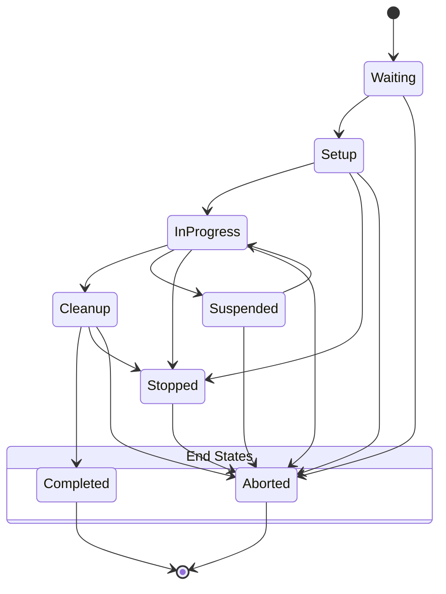
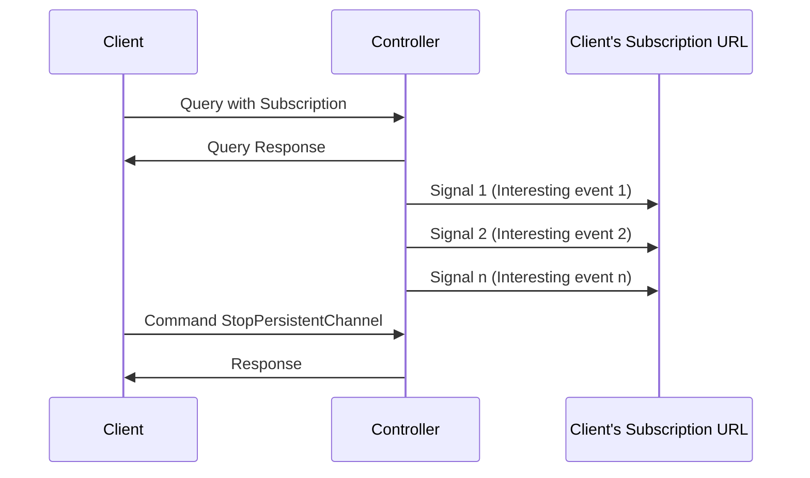
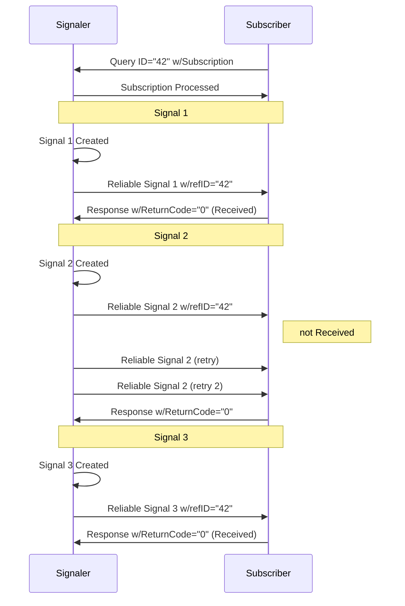

# Chapter 9 Building a System

A Device SHALL be able to consume the inputs and produce the outputs for each process type it is able to execute.

## 9.1 Queue Support

In XJMF, a Controller or Device is assumed to have one input queue that accepts and manages queue entries by responding to `CommandSubmitQueueEntry`, `CommandResubmitQueueEntry` and `CommandModifyQueueEntry`. Queue entries SHALL be returned to the submitting Controller using a `CommandReturnQueueEntry`. Similarly, `ReturnQueueEntry` messages “cascade” back up through each level. If a Machine supports multiple queues, it SHALL be represented by multiple logical Devices in XJDF. In other words, a Device SHALL NOT have more than one queue. The simple case of a Device with no queue that supports pending jobs can be mapped to a queue with either no `QueueEntry` elements or with one `QueueEntry` element where `@Status="InProgress"`.

XJMF supports simple handling of priority queues. The following assumptions are made:
* Queues MAY support priority.
* Priority SHALL only be changed if `QueueEntry/@Status="Waiting"` or `QueueEntry/@Status="Held"`.
* A queue MAY round priorities to the number of supported priorities, which MAY be one, indicating no priority handling.
* Priority is described by an integer from 0 to 100. Priority 100 defines a job that SHOULD pause another job that is in progress and commence immediately. If a Device does not support the pausing of running jobs, it SHOULD queue a priority 100 job after the last pending priority 100 job.
* Queue entries SHALL be unambiguously identified by `QueueEntry/@QueueEntryID`.
* A Controller or Device MAY analyze an XJDF that is submitted to its queue either at submission or at execution time.

A queue MAY treat an XJDF as a closed envelope that is passed on to the Device without checking. The behavior is implementation dependent.

### 9.1.1 Queue Entry ID Generation

Queue entries are identified by the `QueueEntry/@QueueEntryID` attribute, which the queue’s Device SHALL generate when it receives and accepts the submitted job, and which SHALL be returned in the `ResponseSubmitQueueEntry`. `@QueueEntryID` SHALL uniquely identify an entry within the scope of one queue. An implementation is free to choose the algorithm that generates `@QueueEntryID` values.

## 9.2 Status Transitions

A process that is represented by an XJDF will go through various states during its life time as described in Figure 9-1: Life Cycle of a process and queue entry. These states are defined in detail in `NodeInfo/@Status`.

> **Note:** The process or queue entry NEED NOT go through all phases such as "Setup" or "Cleanup" explicitly if the Device does not physically support these phases. In this case the phases as described in Figure 9-1 MAY be skipped and processing SHALL continue with the next supported phase.


*Figure 9-1: Life Cycle of a process and queue entry*

## 9.3 Execution Model

The processing model of XJDF is based on a producer/consumer model. Devices that process XJDF act both as producers and consumers of resources.

### 9.3.1 Determining Executable XJDF

In order to determine which parts of an XJDF can be executed, the Controller or Device SHALL use the following procedures.
1. The Controller or Device SHOULD select one or more partitions with `NodeInfo/@Status="Waiting"` taking into account the scheduling attributes in `NodeInfo`.
2. The Controller or Device SHOULD determine if no `ResourceSet[@Usage="Input"]/Resource/@Status="Unavailable"` for the selected partition.

### 9.3.2 Serial Processing

The simplest process sequence is serial processing. In serial processing, the Controller sends an XJDF to a Device and waits until the first XJDF has been completely processed before sending a subsequent XJDF with the same `@JobID` to the same or a different Device.

### 9.3.3 Partial Processing of XJDF with Partitioned ResourceSets

Some processes apply to multiple parts such as multiple sheets or plates. The structure of `ResourceSet[@Name="NodeInfo"]` SHALL define the sequencing of the process steps. The Device SHALL process all work steps that are explicitly specified in `NodeInfo` Resources.

If a Device is only capable of performing more granular worksteps than the `NodeInfo` partition structure requires, the Device MAY split the execution into multiple work steps. For instance, a non-perfecting press MAY process a request for a duplex sheet in two runs - one for front and one for back.

### 9.3.4 Parallel Processing

Some processes are independent of one another and therefore it is possible to execute them in parallel. Examples are pre-press of individual pages prior to impositioning or printing of individual sheets prior to binding. In parallel processing, the Controller sends an XJDF to one Device and does not wait until the first XJDF has been processed before sending a subsequent XJDF with the same `@JobID` to a different Device or to the same Device if it is capable of processing multiple work steps simultaneously, e.g. a multi-threaded raster image processor.

### 9.3.5 Overlapping Processing

Some processes, e.g. a long print run, take a long time to complete while constantly creating intermediate output that is already available for processing by a subsequent process prior to completion of the initial process. In overlapping processing, the Controller sends an XJDF to the initial Device and does not wait until the first XJDF has been processed before sending a subsequent XJDF that describes the next process step of the same job to a different Device. The subsequent Device MAY begin processing as soon as the initial Device has produced sufficient resources for the subsequent Device. The communication between the Devices SHOULD use `CommandPipeControl` messages. If this is technically not feasible, out of band communication such as a pallet of printed paper that was delivered by a fork lift MAY be used as process control.

`ResourceSet/Dependent` provides information to setup a pipe. Any `ResourceSet` MAY be defined as a pipe resource by specifying `Dependent/@PipeProtocol`.

*Изображение 9-2: График, иллюстрирующий перекрывающуюся обработку. Показано изменение уровня ресурсов (Pipe Level) во времени в зависимости от статусов производителя (Producer) и потребителя (Consumer). Уровень ресурсов растет, когда производитель активен (In Progress), и падает, когда потребитель забирает ресурсы.*

`Dependent/@XJMFURL` SHALL specify the URL that receives `CommandPipeControl` XJMF messages.
`Dependent/@PipeProtocol` SHALL specify the protocol used to control the pipe.

#### 9.3.5.1 Dynamic Pipes

In addition to abstractly declaring pipe properties, XJMF provides the `CommandPipeControl` message that allows dynamic control of pipes. Dynamic pipes can be used to model situations where the amount of resources is not known beforehand but becomes known during processing. An example of this behavior is a long press run where new plates are needed during a press run because of quality deterioration. The exact point in time where quality becomes unacceptable is not predetermined and might even vary from separation to separation.

Another usage of dynamic pipes is linking the output of a variable data print job to various components. Examples include a pipe describing the `RunList` that links the RIP to a print engine or a pipe describing the `Component` that links the printer to finishing equipment or individual finishing Devices. In this case, the `RunList` and `Component` are templates that are logically expanded in increments by the `CommandPipeControl` messages.

`Dependent/@XJMFURL` specifies the recipient of `CommandPipeControl` messages. Depending on the values of the `Dependent/@PipeProtocol` attribute, the following actions are possible.

* **"XJMFPull"**: The consumer initiates the pipe by sending a `CommandPipeControl/PipeParams/@Operation="Pull"` message to its `@XJMFURL`. The consumer MAY request new resources by sending `CommandPipeControl/PipeParams/@Operation="Pull"` messages. If the producer is incapable of fulfilling `CommandPipeControl/PipeParams/@Operation="Pull"` messages for other reasons (such as a malfunction), it SHOULD send a `CommandPipeControl/PipeParams/@Operation="Pause"` message to the consumer. Once the producer is again capable of supplying (e.g. the malfunction has been removed), it SHOULD send a `CommandPipeControl/PipeParams/@Operation="Push"` message to the consumer to inform the consumer that it can commence sending `@Operation="Pull"` messages. The consumer SHOULD send a `CommandPipeControl/PipeParams/@Operation="Close"` message to the producer if the consumer does not require any further resources.
* **"XJMFPush"**: The producer initiates the pipe by sending a `CommandPipeControl/PipeParams/@Operation="Push"` message to its `@XJMFURL`. The producer MAY dispatch new resources by sending `CommandPipeControl/PipeParams/@Operation="Push"` messages. If the consumer is incapable of fulfilling `CommandPipeControl/PipeParams/@Operation="Push"` requests for other reasons (such as a malfunction), it SHOULD send a `CommandPipeControl/PipeParams/@Operation="Pause"` message to the producer. Once it is again ready to consume resources (e.g. the malfunction has been removed), it SHOULD send a `CommandPipeControl/PipeParams/@Operation="Pull"` to inform the producer that it can commence sending `CommandPipeControl/PipeParams/@Operation="Push"` messages. The producer SHOULD send a `CommandPipeControl/PipeParams/@Operation="Close"` message to the consumer if the producer cannot provide any further resources.

Dynamic pipes are initially dormant and SHALL be activated by an explicit request. If `Dependent/@PipeProtocol="XJMF"`, dynamic pipe requests MAY be initiated by either end of the pipe. As soon as the pipe has been initiated, actions that are required by the implied `@PipeProtocol` ("XJMFPush" or "XJMFPull") SHALL be applied. For example, a print process might notify an off-line finishing process when a certain amount is ready by sending a `CommandPipeControl/PipeParams/@Operation="Push"` message, or the printing process might request a new plate by sending a `CommandPipeControl/PipeParams/@Operation="Pull"` message.

#### 9.3.5.2 Comparison of Non-Dynamic and Dynamic Pipes

Each `Dependent` element between non-dynamic pipes provides the pipe definitions for the process to which the `Dependent` element belongs. Therefore, many processes can link to the same pipe to enable parallel processing.

In contrast, dynamic pipes provide a URL address to control a process. In the case of dynamic pipes, no master Controller is needed to control the pipe. Control is accomplished by sending pipe messages. If pipe resources are linked to multiple consumers or producers, such as two finishing lines that consume the output of one press one pallet at a time, it is up to the implementation to ensure consistency of the processes.

#### 9.3.5.3 Metadata in Pipe Messages

`PipeParams/ResourceSet` can contain metadata that is required by the recipient of the message. This metadata SHALL be specified as Partition Keys in `ResourceSet/Resource/Part` and additional details MAY be specified as the actual contents of the `ResourceSet`. Partition Key metadata provides a mechanism to retain context in large variable data jobs without requiring completely expanded `ResourceSets` with potentially thousands of `Resource` elements in the XJDF.

A typical example of Partition Key metadata is `Part/@DocIndex`, `Part/@RunIndex` and `Part/@Side` to uniquely identify the context of a surface image that is sent from a RIP to a digital press.

### 9.3.6 Approval, Proofing, Quality Control and Verification

In many cases, it is desirable to ensure that an executed process or set of processes have been executed completely and/or correctly. In the graphic arts industry this is often accomplished by generating proofs and signing approvals. XJDF defines the approval process and the verification processes by using an `ApprovalDetails` that MAY be specified as an input `ResourceSet` in any process.

The `Approval`, `QualityControl` and `Verification` processes accept any `ResourceSet` as input. These processes output a `ResourceSet` of the same type as the input `ResourceSet` and an `ApprovalDetails`, `QualityControlResult` or `VerificationResult` ResourceSet. For hard copy proofing, a `DigitalPrinting` process generates the hard proof that is input to an `Approval` process. For soft proofing, a `Rendering` or `PDLCreation` process generates the soft proof that is input to an `Approval` process.

XJDF provides a `QualityControl` process to verify that the output of a process fulfills certain quality criteria. `QualityControl` differs from the `Verification` process, which verifies the completeness of a given `ResourceSet`.

### 9.3.7 Gang Jobs

XJMF provides a mechanism to specify groups of `QueueEntry` elements within a queue that are processed together in a Gang. A job is submitted to a Gang by specifying `QueueSubmissionParams/@GangPolicy`. The details of how individual Job Parts are ganged are Device specific. `CommandForceGang` allows Gang to be released to a Device and `QueryGangStatus` provides information about the currently known Gangs. For a description of planned job ganging, see also Section 5.4.21 SheetOptimizing.

### 9.3.8 Error Handling

Error handling is an implementation-dependent feature of XJDF based systems. `AuditPool` provides a container where errors that occur during the execution of an XJDF SHOULD be logged as `AuditNotification` elements. `Notification` elements MAY also be sent in XJMF `SignalNotification` messages. The content of the `Notification` element is described in Table 8.49 Notification Element. For a list of predefined error codes, see Appendix A.4.2 Return Codes.

#### 9.3.8.1 Classification of Notifications

`Notification` elements are classified by the `@Class` attribute. Every workflow implementation SHALL associate a `@Class` with all events on an event-by-event basis. For values, see `Notification/@Class` in Table 8.49 Notification Element.

#### 9.3.8.2 Event Description

A description of the event SHOULD be given in the `Notification/Comment` element, which SHALL be specified for the `Notification` with `@Class="Information"`, `"Warning"`, `"Error"` or `"Fatal"`. For example, after a process is aborted, error information describing a Device error SHOULD be logged in the `Comment` element of the `Notification` element.

#### 9.3.8.3 Error Handling via Messaging (XJMF)

An XJMF with a `SignalNotification` message SHOULD be sent through all persistent channels that subscribed events of class `"Error"`. In order to receive notifications, `SignalNotification` XJMF signals SHALL be subscribed for by using the standard subscription mechanisms described in Section 9.6.3 Managing Persistent Channels.

## 9.4 Specifying Complex Processing

There are occasions where a Controller might need to provide details of multiple individual processes to a Controller such as a prepress workflow system or production control system in the context of an individual job. This can be achieved by submitting an initial XJDF with `SubmitQueueEntry` and submitting the individual process XJDF with a `ResubmitQueueEntry` as follows:

The Controller SHALL submit an XJDF with a new `XJDF/@JobID`. This XJDF SHOULD have a value of `XJDF/@Types` that contains `"Product"` and SHOULD provide an `XJDF/ProductList` that completely describes the desired products.

Additional processes SHALL be supplied by sending one or more `ResubmitQueueEntry` XJMF. These messages SHALL reference a process XJDF where the value of `XJDF/@JobID` is identical to the primary `XJDF/@JobID` and the value of `XJDF/@JobPartID` is different from the value of the primary `XJDF/@JobPartID`.

`XJDF/ResourceSet` specifies the respective resource in the context of the submitted process XJDF. `ResourceSet` elements SHALL be identified by `ResourceSet/@ID`. Thus two `ResourceSet` elements in two XJDF elements with the same `ResourceSet/@ID` represent the same physical objects. `ResourceSet/@ID` NEED NOT be maintained over multiple XJDF instances. `XJDF/ResourceSet/Dependent` elements MAY be specified to explicitly setup process dependencies.

### 9.4.1 Referencing Multiple XJDF in a Directory

If `QueueSubmissionParams/@URL` of the original XJDF references a directory, then all contained files with an extension of `".xjdf"` SHALL be processed in lexically sorted ascending order. The first entry is processed as a logical `SubmitQueueEntry` and the second and further entries are processed as logical `ResubmitQueueEntry` commands.

The first two digits of the file names of the XJDF files in the directory SHOULD begin with a numerical character, i.e. a character in the range '0' to '9' in order to ensure a well defined lexical ordering.

## 9.5 XJDF and XJMF Interchange Protocol

XJDF and XJMF SHOULD be exchanged over a network by using http [RFC2616] or https.

Controllers and Devices SHOULD provide insecure http without a TLS layer for better interoperability. Controllers and Devices MAY provide hot folders or other file based mechanisms for exchange of XJDF or XJMF for debugging and prototyping purposes.

> **Note:** It is strongly discouraged to design a production workflow based on hot folders.

The interchange protocol definitions in this section apply equally to XML-encoded XJDF/XJMF as well as JSON-encoded XJDF/XJMF.

### 9.5.1 HTTP Port

XJMF messaging does not specify a standard port.

### 9.5.2 HTTP Response Code

*New in XJDF 2.2* The http response code defines the success or failure of the underlying network protocol and http server handling. The value of the http response code SHALL be 200 whenever a valid XJMF Response can be generated.

### 9.5.3 HTTP Request Method

A sender SHALL use an http POST request to transmit an XJMF that contains XJMF queries, XJMF commands and XJMF signals to an http server.

The contents SHALL be placed in the body of the http request. See Section 9.7 XJDF Packaging below for details of XJMF packaging.

The receiver SHALL place the XJMF containing XJMF response messages in the body of the response to the http POST. The receiver SHALL package response messages as raw XML.

The body of an http response to an XJMF that contains only XJMF signals that are not defined as reliable (`@ChannelMode != "Reliable"`) MAY be empty.

### 9.5.4 HTTPS-Based Protocol – TLS

Secure XJMF has no additional requirements in addition to standard TLS [RFC5246].

> **Note:** Since Controllers and Devices will typically implement the http client interface and the http server interface, sender and receiver will need to provide certificates and maintain the chain of trust to verify that the certificates are valid.

### 9.5.5 Authentication

Whereas encryption allows for secure communication in the internet by hiding the contents of transactions from third parties, authentication is used to verify that the sender of a message is actually the entity that it claims to be. Authentication is therefore extremely important when fulfilling contracts in order to prevent fraud and misuse of the interface.

It is strongly encouraged to only allow access to authenticated clients. If authentication is implemented, it SHOULD follow the directions shown in [RFC6750]. All implementations SHOULD support at least section "2.1 Authorization Request Header Field" from [RFC6750].

[RFC6750] provides methods to verify the identity of a message sender. XJDF defines no proprietary authentication methods but it is emphasized that authentication is important in all business transactions.

The initial exchange of the token and renewal, as well as the format of the token is not part of this specification and is implementation dependent.

## 9.6 XJMF Handshaking

This section describes the actions and appropriate reactions in a communication between Controllers and Devices using XJMF.

### 9.6.1 Single Query/Command Response Communication

The handshaking mechanisms for queries and commands are identical. The sender SHALL send a Query message or Command message to the receiver. The receiver SHALL parse the Query message or Command message and SHALL synchronously return an appropriate Response to the sender. `Header/@refID` SHALL be set to the value of `Header/@ID` of the message from the sender. If the incoming message could not be parsed, the response SHALL be a `ResponseNotification`.

#### 9.6.1.1 XJMF Error Handling

If a command message, query message, or a signal message is not successfully handled, a processor SHALL reply with a response that SHALL contain a non-zero `@ReturnCode` from Appendix A.4.2 Return Codes and that SHOULD contain a `Notification` element that SHOULD provide additional details of the error.

The response messages contain a `@ReturnCode` attribute. `@ReturnCode` defaults to 0, which indicates that the response is successful. In case of success and in responses to commands an informational `Notification` element (`@Class="Information"`) MAY be provided. In case of a warning, error or fatal error, the `@ReturnCode` is greater than 0 and indicates the kind of error that occurred. In this case, a `Notification` element SHOULD be provided. Error codes are defined in Appendix A.4.2 Return Codes.

**Example 9.1: Response with Notification Element**
The following example uses a `Notification` element to describe an error:
```xml
<XJMF xmlns="http://www.CIP4.org/JDFSchema_2_0">
  <Header DeviceID="DeviceID" ID="l_000002" Time="2019-03-26T14:07:48.126+00:00"/>
  <ResponseModifyQueueEntry ReturnCode="5">
    <Header DeviceID="DeviceID" ID="R1" Time="2019-03-26T14:07:48.126+00:00" refID="C1"/>
    <Notification Class="Error">
      <Comment>StartJob unsuccessful - Device does not handle resume</Comment>
    </Notification>
  </ResponseModifyQueueEntry>
</XJMF>
```

### 9.6.2 Subscribing for Signals

Queries SHALL be subscribed to by including a `Subscription` element that defines the details of the subscription. The receiver of the subscription SHALL initially send a response message containing only `@ReturnCode` and any appropriate `Notification` elements to the sender. The receiver of the subscription SHALL send XJMF signals whenever the conditions that were specified in the subscription element are met. Such a subscribed query that requests multiple signals is referred to as a "persistent channel".

> **Note:** The sender and receiver roles for signals are reversed compared with the initial subscription.

If a Controller that does not support persistent channels is queried to set up a persistent channel, it SHALL answer the query message with a response message and set the `@ReturnCode` to "111".

The following examples illustrate the subscription handshake for `SignalStatus` including the first signal.


*Figure 9-3: Interaction of messages with a subscription*

**Example 9.2: Status Subscription**
The following `QueryStatus` subscription requests a time trigger `SignalStatus` every thirty seconds.
```xml
<XJMF xmlns="http://www.CIP4.org/JDFSchema_2_0">
  <Header DeviceID="TestSender" ID="l_000002" Time="2019-03-26T14:07:48.281+00:00"/>
  <QueryStatus>
    <Header DeviceID="TestSender" ID="Status1" Time="2019-03-26T17:00:00.000+00:00"/>
    <Subscription RepeatTime="30" URL="http://MIS:1234/xjmfurl"/>
    <StatusQuParams/>
  </QueryStatus>
</XJMF>
```

**Example 9.3: Status Subscription Response**
The following `ResponseStatus` to the subscription above is empty and `@ReturnCode="0"` defines success.
```xml
<XJMF xmlns="http://www.CIP4.org/JDFSchema_2_0">
  <Header DeviceID="TestSender" ID="l_000002" Time="2019-03-26T14:07:49.257+00:00"/>
  <ResponseStatus ReturnCode="0">
    <Header DeviceID="TestSender" ID="l_000003" Time="2019-03-26T17:00:00.000+00:00" refID="Status1"/>
  </ResponseStatus>
</XJMF>
```

**Example 9.4: Status Subscription Signal**
The following `SignalStatus` is a simple signal status by a Device that is currently producing.
```xml
<XJMF xmlns="http://www.CIP4.org/JDFSchema_2_0">
  <Header DeviceID="DeviceID" ID="l_000002" Time="2019-03-26T14:07:48.511+00:00"/>
  <SignalStatus>
    <Header DeviceID="DeviceID" ID="S1" Time="2019-03-26T17:00:00.000+00:00" refID="Status1"/>
    <DeviceInfo Status="Production">
      <JobPhase JobID="j1" JobPartID="p1" StartTime="2019-03-26T17:00:00.000+00:00" Status="InProgress"/>
    </DeviceInfo>
  </SignalStatus>
</XJMF>
```

### 9.6.3 Managing Persistent Channels

A Controller MAY request information about currently active subscriptions by sending a `QueryKnownSubscriptions` to a Device. A Controller SHOULD NOT send a new Subscription if a matching Subscription is already in place in the Device. If the Device does not support `QueryKnownSubscriptions`, the Controller MAY create a new Subscription. A Device that receives a Subscription of the same type to the same URL SHOULD replace the existing Subscription with the new Subscription.

A Controller SHOULD remove persistent channels that are no longer evaluated by sending a `CommandStopPersistentChannel` to a Device.

Persistent channels SHOULD be maintained, even when a Device is powered off and powered on again.

### 9.6.4 Signal Handshaking

XJMF signal messages that were subscribed with `Subscription/@ChannelMode="FireAndForget"` SHALL NOT be resent in case they were not successfully delivered to the signal subscriber. In case of success, the subscriber SHALL send an http response with an empty body. If an error occurred, the receiver SHOULD return an error response message as defined in Section 9.6.1.1 XJMF Error Handling.

### 9.6.5 Reliable Signaling

XJMF signal messages that were subscribed with `Subscription/@ChannelMode="Reliable"` SHALL be resent in case they were not successfully delivered to the signal subscriber. If the receiver does not respond to the reliable signal, the sender SHALL retry the reliable signal. If a response is received with a `@ReturnCode` value other than zero, then the signal message SHOULD be retried, unless the sender determines that resending the message is not useful in an implementation specific manner. For instance, a Heartbeat signal that is triggered by `Subscription/@RepeatTime` MAY be replaced by the following signal if no information that is required for job costing is lost.


*Figure 9-4: Example of reliable signaling*

#### 9.6.5.1 Sequence of Signals

Signals SHALL be sent in the order that the underlying event that triggered the signal occurred. Thus subsequent signals that occurred after a signal that was in error and needs to be resent SHALL NOT be sent until either the offending signal has been successfully resent or the offending signal has been discarded.

### 9.6.6 Deleting Persistent Channels

A persistent channel SHALL be deleted by sending a `StopPersistentChannel` command message.

### 9.6.7 XJMF Bootstrapping

XJMF currently provides no mechanism for initial Device discovery. Thus the URL of an XJMF Device needs to be provided to a Controller outside of XJMF. Once the XJMF URL is known, a Controller SHOULD follow the steps below:

**Known message discovery**
* **1a** Controller sends `QueryKnownMessages` to Device.
  The Controller SHOULD query for known messages and refrain from sending unknown messages, including messages specified in this section.
* **1b** Device sends `ResponseKnownMessages` to Controller.
  The Device SHOULD respond with a list of known messages.

**Device discovery**
* **2a** Controller sends `QueryKnownDevices` to Device.
  If the Device is a workflow Controller, the Controller MAY query for additional known lower-level Devices that the Device wishes to publish. The Controller SHOULD apply this bootstrapping procedure defined in this section to all lower level Devices that are supplied in the `ResponseKnownDevices`.
* **2b** Device sends `ResponseKnownDevices` to Controller.
  The Device SHOULD respond with a list of known lower-level Devices.

**Subscription discovery**
* **3a** Controller sends `QueryKnownSubscriptions` to Device.
  If the Controller intends to subscribe for signals from the Device, the Controller SHOULD query for a list of existing subscriptions. The Controller SHOULD NOT resubscribe for existing subscriptions.
* **3b** Device sends `ResponseKnownSubscriptions` to Controller.
  The Device SHOULD respond with a list of known subscriptions.

### 9.6.8 Device/ Controller Selection

XJMF defines the `KnownDevices` query message to find Controllers and Devices. The information provided by this query can be used by a Controller to infer the appropriate routing for an XJDF.

## 9.7 XJDF Packaging

An XJMF MAY be transferred with no additional packaging. Alternatively, an XML-encoded XJMF and its referenced digital assets MAY be combined into a single zip package consisting of:
* a single XJMF message,
* the XJDF job tickets to which it refers, and
* the digital assets to which the XJMF and XJDF job tickets refer.

XJMF messages that do not refer to XJDF or external digital assets SHOULD NOT be packaged as zip. Digital assets that are not included in the zip package MAY be referenced. Multiple XJMF messages SHALL NOT be packaged in one zip package.

See Section 9.10 Use of JSON and REST APIs for a discussion of packaging JSON-encoded XJMF.

### 9.7.1 ZIP Packaging Details of XML-Encoded XJMF

Zip is a de facto industry standard for packaging and compressing data. Directory structures can be encoded in a zip package. For details see [ZIP].

#### 9.7.1.1 Identifying the Root XJMF
The root XJMF SHALL be named `root.xjmf` and SHALL reside in the root directory of the zip package.

#### 9.7.1.2 Referencing Digital Assets within a ZIP Package
Referenced digital assets that reside in the zip package, for instance those that are referenced with `@URL`, SHALL be referenced as local URLs. The current URL for calculating local URLs SHALL be the root of the zip package, regardless of the location of the referring XJDF within the zip package.

Digital assets other than the `root.xjmf` MAY be placed in a directory tree structure within the zip file.

#### 9.7.1.3 ZIP File Name Encoding
All file and directory names in a zip package SHALL be encoded in UTF-8.
> **Note:** Zip allows any encoding but provides no method to declare the encoding.

#### 9.7.1.4 ZIP passwords and encryption
*New in XJDF 2.1* ZIP packages SHALL NOT be encrypted and SHALL NOT be locked by an internal zip password.
> **Note:** Encryption and authentication SHOULD be handled by the underlying transport layer, e.g. https.

### 9.7.2 MIME Types and File Extensions

The following MIME types and extensions SHOULD be used when storing XJDF or XJMF as files or when a MIME type is required, e.g. when setting the http Content-Type header.

**Table 9.1: MIME Types and File Extensions**

| MIME TYPE | EXTENSION | USAGE |
| :--- | :--- | :--- |
| `application/vnd.cip4-xjdf+json` | `xjdf.json` | Unpackaged JSON XJDF. A double extension of ‘.xjdf.json’ SHOULD be used. |
| `application/vnd.cip4-xjmf+json` | `xjmf.json` | Unpackaged JSON XJMF. A double extension of ‘.xjmf.json’ SHOULD be used. |
| `application/vnd.cip4-xjdf+xml` | `xjdf` | Unpackaged XJDF. |
| `application/vnd.cip4-xjmf+xml` | `xjmf` | Unpackaged XJMF. |
| `application/vnd.cip4-xjdf+zip` | `xjdf.zip` | Zip packaged XJDF. A double extension of ‘.xjdf.zip’ SHOULD be used. |
| `application/vnd.cip4-xjmf+zip` | `xjmf.zip` | Zip packaged XJMF. A double extension of ‘.xjmf.zip’ SHOULD be used. |

## 9.8 Job Modification

While jobs are waiting for execution in a queue or even during execution of a job, circumstances may arise that require modifications to that job. XJDF enables modifications to jobs using the `ModifyQueueEntry` and `ResubmitQueueEntry` messages.

> **Note:** Although the XJDF mechanisms for modifying jobs are fairly simple, the underlying physical changes may make modifications difficult or even impossible. The actual implementation of changes is always Device dependent, and Controllers SHOULD always expect modification requests to fail and process failure appropriately.

### 9.8.1 Rescheduling with ModifyQueueEntry

`ModifyQueueEntry` is designed to allow rescheduling of jobs without changing any parameters of the XJDF. Typical use cases for `ModifyQueueEntry` are:
* Reordering the sequence of execution to optimize setup times by running similar jobs in sequence.
* Suspending a running job so that a rush job can be processed before the current job is completed.

### 9.8.2 Modifying Jobs

`ResubmitQueueEntry` is designed to modify the details of the underlying sets of XJDF for a job. Jobs can be modified in a number of different ways. These are differentiated by `ResubmissionParams/@UpdateMethod` and the related `XJDF/@JobPartID`.

Typical use cases for `ResubmitQueueEntry` are:
* Change the number of copies requested;
* Change the number or details of physical inks required for printing;
* Change content data such as number of pages or page size;
* Change the details of the physical substrate to print on;
* Change binding or other finishing options;
* Select a different Device with differing properties, e.g. sheet size, to optimize utilization of multiple Devices.

**Table 9.2: Modifying Job Parameters**

| RESUBMISSION-PARAMS/ @UPDATE-METHOD | XJDF/ @JOBPARTID | DESCRIPTION |
| :--- | :--- | :--- |
| `Complete` | `-` | If `XJDF/@JobPartID` is omitted, the job parameters of all XJDFs that belong to the queue entry SHALL be completely overwritten with new information. |
| `Complete` | `known` | If the value of `XJDF/@JobPartID` matches an existing Job Part, then the job parameters relating to `@JobPartID` SHALL be completely overwritten with new information. |
| `Remove` | `known` | If the value of `XJDF/@JobPartID` matches an existing Job Part, then the job parameters that are explicitly supplied in the referenced XJDF SHALL be removed. If no XJDF is provided, the entire process step described by `@JobPartID` SHALL be removed. |
| `Incremental` | `known` | If the value of `XJDF/@JobPartID` matches an existing Job Part, then the job parameters that relate to the existing XJDF are overwritten by the data that is explicitly supplied in the referenced XJDF. |
| `Incremental` | `new` | If `XJDF/@JobPartID` is supplied and does not match any existing Job Part, then a new process step is requested. Details SHALL be supplied in the referenced XJDF. |

#### 9.8.2.1 Referencing values for incremental update

The following sections describe how to reference data when `ResubmissionParams/@UpdateMethod="Incremental"` or `ResubmissionParams/@UpdateMethod="Remove"`. The algorithms shown here are illustrated assuming an internal XJDF model but this is purely for illustration and no assumption is made about the actual implementation.

As a general rule, elements and attributes within XJDF SHALL be addressed by searching elements and attributes with matching XPath results. Attributes with a data type of `ID` or `IDREF` SHALL be ignored when calculating XPaths because IDs MAY be regenerated dynamically and are only valid within the scope of a single XML document.

##### 9.8.2.1.1 Finding the correct XJDF to update
An XJDF SHALL match if the values of `XJDF/@JobID` and `XJDF/@JobPartID` are both identical.

##### 9.8.2.1.2 Finding the correct Resource to update
A `ResourceSet` SHALL match if the values of `ResourceSet/@Name`, `ResourceSet/@ProcessUsage` and `ResourceSet/@Usage` are all identical.

Once a matching `ResourceSet` has been found, a child resource SHALL match if all `Resource/Part` elements match. A part matches if all attribute values are identical. The ordering of the `Resource/Part` elements is not significant.

#### 9.8.2.2 Updating values

If `ResubmissionParams/@UpdateMethod="Incremental"` then all attribute values and element text SHALL be replaced with the attribute values defined in the XJDF that is referenced by `@URL`. If the ancestors of a given attribute do not exist, they SHALL be appropriately created.

#### 9.8.2.3 Removing values

If `ResubmissionParams/@UpdateMethod="Remove"` then all resources that are found according to Section 9.8.2.1.2 Finding the correct Resource to update SHALL be removed. If a `ResourceSet` with no child resource elements is provided, then the entire `ResourceSet` SHALL be removed.

The following example of an XJMF with a referenced XJDF removes the `VarnishingParams` Resource for the sheet with `@SheetName="Body"`:
```xml
<XJMF xmlns="http://www.CIP4.org/JDFSchema_2_0">
  <Header DeviceID="TestSender" ID="l_000002" Time="2019-03-26T14:07:49.355+00:00"/>
  <CommandResubmitQueueEntry>
    <Header DeviceID="TestSender" ID="C1" Time="2019-03-26T14:07:49.355+00:00"/>
    <ResubmissionParams QueueEntryID="qe1" URL="http://jobserver.xjdf.org?job1" UpdateMethod="Remove"/>
  </CommandResubmitQueueEntry>
</XJMF>
```
The above example references the following XJDF:
```xml
<XJDF xmlns="http://www.CIP4.org/JDFSchema_2_0" JobID="ChangeOrder" JobPartID="RemoveVarnish" Types="Varnishing">
  <ResourceSet Name="VarnishingParams" Usage="Input">
    <Resource>
      <Part SheetName="Body"/>
    </Resource>
  </ResourceSet>
</XJDF>
```

### 9.8.3 Examples for Job Modification

The following examples are valid but simplified examples of change orders. Real life examples will typically contain additional details.

**Example 9.5: Rescheduling**
The following example reschedules the planned start of a process.
```xml
<XJDF xmlns="http://www.CIP4.org/JDFSchema_2_0" JobID="ChangeOrder" JobPartID="Reschedule" Types="Folding">
  <ResourceSet Name="NodeInfo" Usage="Input">
    <Resource>
      <Part SheetName="Sheet1"/>
      <NodeInfo Start="2020-03-01T17:00:00+01:00"/>
    </Resource>
  </ResourceSet>
</XJDF>
```

**Example 9.6: Changing Amount**
The following example updates the requested amount of Sheet1 to 4000.
```xml
<XJDF xmlns="http://www.CIP4.org/JDFSchema_2_0" JobID="ChangeOrder" JobPartID="Amount" Types="Folding">
  <ResourceSet Name="Component" Usage="Output">
    <Resource>
      <AmountPool>
        <PartAmount Amount="4000"/>
      </AmountPool>
      <Part SheetName="Sheet1"/>
    </Resource>
  </ResourceSet>
</XJDF>
```

**Example 9.7: Adding a color separation**
The following example adds a color separation "Acme ColorBook 42" to sheets with `@SheetName="Sheet1"`.
```xml
<XJDF xmlns="http://www.CIP4.org/JDFSchema_2_0" JobID="ChangeOrder" JobPartID="AddColor" Types="ConventionalPrinting">
  <ResourceSet Name="NodeInfo" Usage="Input">
    <Resource>
      <Part SheetName="Sheet1"/>
      <NodeInfo/>
    </Resource>
  </ResourceSet>
  <ResourceSet Name="Media">
    <Resource ID="r_000007">
      <Media MediaType="Plate"/>
    </Resource>
  </ResourceSet>
  <ResourceSet Name="ExposedMedia" Usage="Input">
    <Resource>
      <Part Separation="Spot1" SheetName="Sheet1" Side="Front"/>
      <ExposedMedia MediaRef="r_000007"/>
    </Resource>
  </ResourceSet>
  <ResourceSet Name="Color" Usage="Input">
    <Resource>
      <Part Separation="Spot1"/>
      <Color ActualColorName="Acme ColorBook 42" CMYK="0.2 0.3 0.4 0.1"/>
    </Resource>
  </ResourceSet>
  <ResourceSet Name="Ink" Usage="Input">
    <Resource Brand="Acme Ink 42">
      <Part Separation="Spot1"/>
      <Ink InkType="Ink"/>
    </Resource>
  </ResourceSet>
  <ResourceSet Name="ColorantControl" Usage="Input">
    <Resource>
      <Part SheetName="Sheet1" Side="Front"/>
      <ColorantControl ColorantOrder="Cyan Magenta Yellow Black Spot1" ColorantParams="Cyan Magenta Yellow Black Spot1"/>
    </Resource>
  </ResourceSet>
</XJDF>
```

**Example 9.8: Selecting a Device**
The following example changes the Device to Folder2.
```xml
<XJDF xmlns="http://www.CIP4.org/JDFSchema_2_0" JobID="ChangeOrder" JobPartID="Device" Types="Folding">
  <ResourceSet Name="NodeInfo" Usage="Input">
    <Resource>
      <Part SheetName="Sheet1"/>
      <NodeInfo Start="2020-03-01T17:00:00+01:00"/>
    </Resource>
  </ResourceSet>
  <ResourceSet Name="Device" Usage="Input">
    <Resource>
      <Part SheetName="Sheet1"/>
      <Device DeviceID="Folder2"/>
    </Resource>
  </ResourceSet>
</XJDF>
```

**Example 9.9: Modifying the selected paper**
The following example changes the paper weight to 120 g/m2 for Sheet1.
```xml
<XJDF xmlns="http://www.CIP4.org/JDFSchema_2_0" JobID="ChangeOrder" JobPartID="Paper" Types="ConventionalPrinting">
  <ResourceSet Name="Component" Usage="Input">
    <Resource>
      <AmountPool>
        <PartAmount Amount="4000"/>
      </AmountPool>
      <Part SheetName="Sheet1"/>
      <Component MediaRef="r_000007"/>
    </Resource>
  </ResourceSet>
  <ResourceSet Name="Media">
    <Resource ID="r_000007">
      <Media MediaType="Paper" Weight="120"/>
    </Resource>
  </ResourceSet>
</XJDF>
```

**Example 9.10: Adding an offline varnishing step**
The following example adds a varnishing step including the description of the blanket and varnish.
```xml
<XJDF xmlns="http://www.CIP4.org/JDFSchema_2_0" JobID="ChangeOrder" JobPartID="AddVarnish" Types="Varnishing">
  <ResourceSet Name="NodeInfo" Usage="Input">
    <Resource>
      <Part SheetName="Sheet1"/>
      <NodeInfo/>
    </Resource>
  </ResourceSet>
  <ResourceSet Name="Media">
    <Resource ID="r_000007">
      <Media MediaType="Blanket"/>
    </Resource>
  </ResourceSet>
  <ResourceSet Name="ExposedMedia" Usage="Input">
    <Resource>
      <Part Separation="Var" SheetName="Sheet1" Side="Front"/>
      <ExposedMedia MediaRef="r_000007"/>
    </Resource>
  </ResourceSet>
  <ResourceSet Name="Color" Usage="Input">
    <Resource>
      <Part Separation="Varnish"/>
      <Color ActualColorName="Acme Gloss Varnish"/>
    </Resource>
  </ResourceSet>
  <ResourceSet Name="Ink" Usage="Input">
    <Resource Brand="Acme Gloss Varnish">
      <Part Separation="Varnish"/>
      <Ink InkType="Gloss Varnish"/>
    </Resource>
  </ResourceSet>
  <ResourceSet Name="VarnishingParams" Usage="Input">
    <Resource>
      <Part SheetName="Sheet1" Side="Front"/>
      <VarnishingParams VarnishMethod="Blanket"/>
    </Resource>
  </ResourceSet>
  <ResourceSet Name="Device" Usage="Input">
    <Resource DescriptiveName="Offline Acme varnishiner">
      <Part SheetName="Sheet1" Side="Front"/>
      <Device DeviceID="Var_1"/>
    </Resource>
  </ResourceSet>
</XJDF>
```

## 9.9 Use of XML Schema for Capability Descriptions

Individual Devices will never implement the entire XJDF specification. Meaningful communication between a Controller and a Device is only possible if the Controller is aware of the limitations of the Device.

XJDF does not provide a proprietary method to define Device capabilities. Since XJDF is an XML dialect, standard XML tools such as XML schema [XMLSchema] SHOULD be used to declare the supported features of a Device. See `Device/FileSpec[@ResourceUsage="Schema"]` and `Device/FileSpec[@ResourceUsage="CurrentSchema"]` for details of how to provide a Device specific schema.

CIP4's schema for XJDF provides functionality to define the supported individual values of any attributes in XML. It currently does not provide conditional constraints for values that depend on the value of other attributes within the XJDF.

This limitation is seen as acceptable for the benefit of using standard XML tools and may be addressed in a future version of this specification.

CIP4 provides schema for the entire XJDF specification and reduced schema for ICS documents. Vendors are encouraged to provide XML schemas that define the supported XJDF features of their Devices.

Device schema for XJDF SHALL use the XJDF namespace for standard XJDF features.

## 9.10 Use of JSON and REST APIs

*New in XJDF 2.2* JSON has been introduced as a secondary encoding method for XJDF and XJMF. This section provides details for mapping XJDF and XJMF encoded in XML to JSON encoding. This section also specifies how to use XJDF and XJMF to define a REST API.

**Example 9.11: Mapping of ResourceSet and Resource in JSON**
The following example illustrates a simple XJDF file encoded in both XML and JSON.

*XML Encoding*
```xml
<?xml version="1.0" encoding="UTF-8"?>
<XJDF xmlns="http://www.CIP4.org/JDFSchema_2_0" JobID="Job1" Types="Product" Version="2.2">
  <AuditPool>
    <AuditCreated>
      <Header DeviceID="CIP4_JDF_Writer_Java" Time="2024-05-03T18:06:15+02:00"/>
    </AuditCreated>
  </AuditPool>
  <ResourceSet Name="NodeInfo" Usage="Input">
    <Resource DescriptiveName="my status">
      <Part SheetName="Sheet1"/>
      <NodeInfo Start="2024-05-03T18:06:15+02:00" Status="Waiting"/>
    </Resource>
  </ResourceSet>
</XJDF>
```

*JSON Encoding*
```json
{
  "AuditPool": [
    {
      "Header": {
        "DeviceID": "CIP4_JDF_Writer_Java",
        "Time": "2024-05-03T18:06:15+02:00"
      },
      "Name": "AuditCreated"
    }
  ],
  "JobID": "Job1",
  "Name": "XJDF",
  "ResourceSet": [
    {
      "Name": "NodeInfo",
      "Resource": [
        {
          "DescriptiveName": "my status",
          "NodeInfo": {
            "Start": "2024-05-03T18:06:15+02:00",
            "Status": "Waiting"
          },
          "Part": [
            {
              "SheetName": "Sheet1"
            }
          ]
        }
      ],
      "Usage": "Input"
    }
  ],
  "Types": [
    "Product"
  ],
  "Version": "2.2"
}
```

### 9.10.1 Mapping XJDF Data Types

Both XML and JSON provide a hierarchical definition of key-value pairs. One notable difference is the usage of arrays in JSON. The mapping of XML to arrays in JSON is described in detail below.

Unless explicitly called out in the description with a label of ‘JSON Exception’, all syntax definitions are identical for JSON-encoded and XML-encoded XJDF.

### 9.10.2 Syntax Mapping

The JSON representation of an XJDF document or XJMF message SHALL be based on the schema data type rather than the current data type of a specific instance. For instance, an attribute with a data type of `NMTOKENS` that contains a single `NMTOKEN` SHALL be mapped in JSON to an array of strings with a single entry.

> **Note:** This implies that any translation tool to JSON is aware of the respective XML schema.

#### 9.10.2.1 XML Elements
Elements with a schema cardinality of "1" SHALL be mapped to a JSON object. Elements with a schema cardinality greater than "1" SHALL be mapped to an array of JSON objects unless an explicit ‘JSON Exception’ has been called out in the element definition table of the parent object, e.g., `Address/AddressLine`.

#### 9.10.2.2 XML Root
The name of the XML root node SHALL be specified in the `@Name` attribute of the JSON root object. See Example 3.1: JSON-encoded XJDF and Example 7.1: JSON-encoded XJMF for XJDF and XJMF root JSON objects.

When XJDF or XJMF are defined as subelements, e.g., in a PrintTalk PurchaseOrder, the name of the JSON object SHOULD be the respective XML local name and the `@Name` attribute NEED NOT be specified redundantly.

#### 9.10.2.3 XML Attributes and Values
All XML attribute values conform to one of the XJDF data types. An XJDF attribute/value shall be mapped to a JSON name/value pair. The JSON value SHALL be mapped according to the XJDF data type as shown below in Table 9.3 XJDF Data Types Mapped to JSON.

**Table 9.3: XJDF Data Types Mapped to JSON**

| XJDF DATA TYPE | JSON DATA TYPE | COMMENT |
| :--- | :--- | :--- |
| `boolean` | `boolean` | |
| `CMYKColor` | `array of float` | The length of the array SHALL be 4. The values SHALL be in the range [0.0... 1.0]. |
| `enumeration` | `string` | The allowed enumeration values are identical in JSON and XML. |
| `float` | `number` | Float values MAY be written as ‘integer’ values. |
| `FloatList` | `array of float` | |
| `ID` | `string` | The restrictions for ID values are identical in JSON and XML.<br>**Note:** JSON does not have an inherent definition of ID. Nonetheless an object can be tagged explicitly. |
| `IDREF` | `string` | **Note:** JSON does not have an inherent definition of ID. Nonetheless an object can be referenced if it contains an "ID" key. |
| `IDREFS` | `array of string` | **Note:** JSON does not have an inherent definition of ID. Nonetheless an object can be referenced if it contains an "ID" key. |
| `integer` | `integer` | |
| `IntegerList` | `array of integer` | |
| `IntegerRange` | `array of integer` | The length of the array SHALL be 2. |
| `LabColor` | `array of float` | The length of the array SHALL be 3. |
| `languages` | `array of string` | |
| `list of <data type>` | `array of <data type>` | Lists of data types that are derived from ‘string’ such as NMTOKENS, IDREFS or enumerations SHALL be mapped to an array of string.<br>**Note:** Lists includes ranges which are technically lists of two data type objects. |
| `matrix` | `array of float` | The length of the array SHALL be 6. |
| `NMTOKEN` | `string` | The restriction for NMTOKEN values are identical in JSON and XML. |
| `NMTOKENS` | `array of string` | The restriction for each NMTOKEN value is identical in JSON and XML. |
| `PDFPath` | `string` | PDFPath values SHALL be passed as a single string.<br>**Note:** This mapping ensures that an XML to JSON parser need not be aware of PDF syntax. |
| `rectangle` | `array of float` | The length of the array SHALL be 4. |
| `RGBColor` | `array of float` | The length of the array SHALL be 3. The values SHALL be in the range [0.0... 1.0]. |
| `shape` | `array of float` | The length of the array SHALL be 3. |
| `string` | `string` | |
| `TransferFunction` | `array of array of float` | The outer array defines an series of points in x-y space.<br>The inner arrays SHALL define an individual point in x-y space and SHALL have a length of 2.<br>Example:<br>XJDF `"0.0 0.0 0.5 0.7 1.0 1.0"` maps to JSON `[[0.0,0.0],[0.5,0.7],[1.0,1.0]]` |
| `XYPair` | `array of float` | The length of the array SHALL be 2. |
| `<all other types>` | `string` | |

#### 9.10.2.4 Foreign XML Namespaces in JSON

XJDF elements SHOULD NOT be prefixed with a namespace when translated to JSON. XML elements and attributes that are defined in other namespaces SHOULD be provided using the namespace prefix.

The mapping of namespace and schema for foreign namespaces SHOULD be provided using the ‘@context’ construct from [JSON-LD].

> **Note:** JSON mapping of XJDF uses a minimal set of features from [JSON-LD], implementations do not require full support of [JSON-LD].

**Example 9.12: JSON Mapping of XML Foreign Namespaces**
The following example shows how an `AuditCreated` that contains data in a foreign namespace is encoded in XML and JSON.

*XML Encoding*
```xml
<?xml version="1.0" encoding="UTF-8"?>
<XJDF xmlns="http://www.CIP4.org/JDFSchema_2_0" JobID="J1" Types="Product" Version="2.2">
  <ResourceSet Name="Foo:FooBar" Usage="Input">
    <Resource>
      <Foo:FooBar xmlns:Foo="www.foo.com"/>
    </Resource>
  </ResourceSet>
</XJDF>
```

*JSON Encoding*
```json
{
  "JobID": "J1",
  "Name": "XJDF",
  "ResourceSet": [
    {
      "Name": "Foo:FooBar",
      "Resource": [
        {
          "Foo:FooBar": {
            "@context": {
              "Foo": "www.foo.com"
            }
          }
        }
      ],
      "Usage": "Input"
    }
  ],
  "Types": [
    "Product"
  ],
  "Version": "2.2"
}
```

#### 9.10.2.5 XML Mixed Content

The only XJDF element that contains mixed content is the `Comment` element. The element text of `Comment` SHALL be mapped to a string with a key of `"Text"`.

### 9.10.3 REST API Endpoints

[REST] APIs typically provide specific endpoints for dedicated API calls. The base URLs for these endpoints are not restricted by this specification. In order to provide interoperability between various vendor’s API implementations, the following mapping of API endpoints to XJMF messages SHOULD be followed.

#### 9.10.3.1 REST API Endpoints provided by XJMF Controllers

The message endpoint for subscriptions are defined by the Controller in `Query/Subscription/@URL` when subscribing, and as such is not standardized.

**Table 9.4: REST API Endpoints provided by XJMF Controllers**

| XJMF MESSAGE | DEVICE MESSAGE | CONTROLLER MESSAGE ENDPOINT |
| :--- | :--- | :--- |
| `GangStatus` | `SignalGangStatus` | **Note:** The endpoint is specified by the Controller in `QueryGangStatus/Subscription/@URL`. |
| `KnownDevices` | `QueryKnownDevices` | `/devices` |
| `KnownMessages` | `QueryKnownMessages` | `/messages` |
| `Notification` | `SignalNotification` | **Note:** The endpoint is specified by the Controller in `QueryNotification/Subscription/@URL`. |
| `PipeControl` | `CommandPipeControl` | `/pipes` |
| `QueueStatus` | `SignalQueueStatus` | **Note:** The endpoint is specified by the Controller in `QueryQueueStatus/Subscription/@URL`. |
| `RequestQueueEntry` | `CommandRequestQueueEntry` | `/queue-entries/request` |
| `Resource` | `SignalResource` | **Note:** The endpoint is specified by the Controller in `QueryResource/Subscription/@URL`. |
| `ReturnQueueEntry` | `CommandReturnQueueEntry` | `/queue-entries/return` |
| `Status` | `SignalStatus` | **Note:** The endpoint is specified by the Controller in `QueryStatus/Subscription/@URL`. |

#### 9.10.3.2 REST Endpoints provided by the XJMF Device

**Table 9.5: XJMF Device Message Mapping to REST API Endpoints**

| XJMF MESSAGE | CONTROLLER MESSAGE | DEVICE MESSAGE ENDPOINT |
| :--- | :--- | :--- |
| `ForceGang` | `CommandForceGang` | `/gangs/force` |
| `GangStatus` | `QueryGangStatus` | `/gangs`<br>**Note:** This endpoint is for use with a synchronous `QueryGangStatus`. |
| `GangStatus` | `QueryGangStatus` | `/gangs/subscribe`<br>**Note:** This endpoint is for use with a `QueryGangStatus` containing a Subscription. |
| `KnownDevices` | `QueryKnownDevices` | `/devices` |
| `KnownMessages` | `QueryKnownMessages` | `/messages` |
| `KnownSubscriptions` | `QueryKnownSubscriptions` | `/subscriptions` |
| `ModifyQueueEntry` | `CommandModifyQueueEntry` | `/queue-entries/modify` |
| `Notification` | `QueryNotification` | `/notifications`<br>**Note:** This endpoint is for use with a synchronous `QueryNotification`. |
| `Notification` | `QueryNotification` | `/notifications/subscribe`<br>**Note:** This endpoint is for use with a `QueryNotification` containing a Subscription. |
| `PipeControl` | `CommandPipeControl` | `/pipes` |
| `QueueStatus` | `QueryQueueStatus` | `/queue-entries`<br>**Note:** This endpoint is for use with a synchronous `QueryQueueStatus`. |
| `QueueStatus` | `QueryQueueStatus` | `/queue-entries/subscribe`<br>**Note:** This endpoint is for use with a `QueryQueueStatus` containing a Subscription. |
| `Resource` | `QueryResource` | `/resources`<br>**Note:** This endpoint is for use with a synchronous `QueryResource`. |
| `Resource` | `QueryResource` | `/resources/subscribe`<br>**Note:** This endpoint is for use with a `QueryResource` containing a Subscription. |
| `Resource` | `CommandResource` | `/resources/modify` |
| `ResubmitQueueEntry` | `CommandResubmitQueueEntry` | `/queue-entries/resubmit` |
| `ShutDown` | `CommandShutDown` | `/devices/shut-down` |
| `Status` | `QueryStatus` | `/status`<br>**Note:** This endpoint is for use with a synchronous `QueryStatus`. |
| `Status` | `QueryStatus` | `/status/subscribe`<br>**Note:** This endpoint is for use with a `QueryStatus` containing a Subscription. |
| `StopPersistentChannel` | `CommandStopPersistentChannel` | `/subscriptions/stop` |
| `SubmitQueueEntry` | `CommandSubmitQueueEntry` | `/queue-entries/submit` |
| `WakeUp` | `CommandWakeUp` | `/devices/wake-up` |

### 9.10.4 JSON Transport Layer

JSON is frequently used in the context of [REST] APIs. This section defines the protocol requirements for a JSON-based XJDF/XJMF [REST] API.

#### 9.10.4.1 JSON API Request Method
JSON-based XJMF commands always contain a request body. Therefore XJDF/XJMF [REST] APIs SHALL provide http POST endpoints.

#### 9.10.4.2 JSON multipart/form-data
[REST] APIs generally use MIME `multipart/form-data` when packaging external data into single http requests, see [RFC2388]. Therefore, JSON XJMFs with a `CommandSubmitQueueEntry`, a `CommandResubmitQueueEntry` or a `CommandReturnQueueEntry` MAY be packaged in a MIME `multipart/form-data` package. The XJMF SHALL be provided in the field “xjmf”. The referenced XJDF and any additionally referenced files SHOULD be provided and referenced as file attachments in the field “attachment”. Attached files SHALL be referenced using the “filename” of the corresponding part as a relative URL.

**Example 9.13: JSON multipart/form-data Packaging**
```http
POST /queue-entries/submit HTTP/1.1
Host: foo.example
Content-Type: multipart/form-data;boundary="148152952621447"

--148152952621447
Content-Disposition: form-data; name="xjmf"

[...]
--148152952621447
Content-Disposition: form-data; name="attachment"; filename="order-A.xjdf"

[...]
--148152952621447
Content-Disposition: form-data; name="attachment"; filename="artwork.pdf"

[...]
--148152952621447--
```